# 01 — System Architecture

> LEVEL — "Know where you are. Know what's next. Prove your growth."
> Status: design baseline for Phase 1+. Source of truth for product/engineering decisions is the Decisions Brief;
> this document refines it into an implementable architecture. It is the authoritative source for module boundaries,
> routes and API shapes referenced by `03-user-flows.md`, and it adopts the explicit product decisions of
> `02-mvp-spec.md` (F01–F22, D1–D32) where that spec makes them. Where the brief is silent, choices are marked
> **Decision:** inline and repeated in the [decision log](#19-decision-log-for-cross-document-alignment).

---

## 0. Architectural drivers (ranked)

| # | Driver | Consequence in this architecture |
|---|--------|----------------------------------|
| 1 | **Trust**: scores, levels, payments, unlocks, referral rewards are never decided by the client | All state transitions live in server-side application services; RLS is defense in depth; the client only renders server DTOs. |
| 2 | **A test start is never blocked** (viral traffic, mobile CGNAT, AI outages) | Own anonymous sessions (no Supabase anonymous sign-in), generous IP limits, deterministic scoring with zero AI dependency, fail-open rate limiter for non-money keys. |
| 3 | **Cost per 1,000 UZS report** | Deterministic engines (no AI in the critical path), coarse-keyed AI cache, per-report AI budget guard, a single Postgres. |
| 4 | **Auditability** | Immutable versioned questions, `scoring_model_version`, `question_versions` in results, `payment_events` for every callback, `audit_logs` for privileged changes. |
| 5 | **Mobile-first, Telegram-native** | One question per screen, small JS payloads (02 §8.1 budgets), Telegram Mini App (TMA) as a first-class channel, Stars for in-TMA digital goods. |
| 6 | **API-first** | Every personal flow is served by `/api/v1` JSON endpoints that future Android/iOS apps reuse unchanged. |
| 7 | **Global by configuration** | Unlimited locales, per-country prices/currencies/providers as data, not code. |

---

## 1. System context

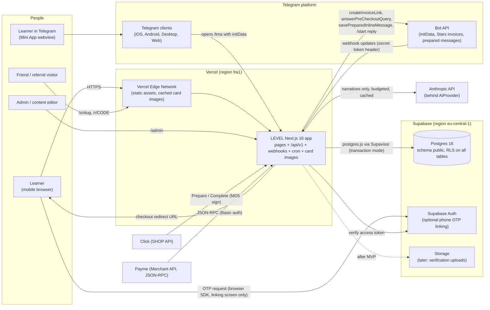

### External systems and trust boundaries

| System | Direction | Protocol / auth | What we trust | What we never trust |
|--------|-----------|-----------------|---------------|---------------------|
| Browser / TMA client | in | HTTPS, `level_session` cookie or `Authorization: Bearer` | Nothing beyond the session subject | Scores, prices, payment status, unlock flags, referral claims, experiment variants, `openInvoice` callback status |
| Telegram initData | in | HMAC-SHA256 with bot token, `auth_date` ≤ 24 h | Telegram user id, names, `language_code`, `start_param` after verification | Unverified `initDataUnsafe` |
| Telegram Bot webhook | in | `X-Telegram-Bot-Api-Secret-Token` = `TELEGRAM_WEBHOOK_SECRET` | `pre_checkout_query`, `successful_payment`, `/start` after header check + payload match | — |
| Click | in | MD5 `sign_string` + `service_id` check | Prepare/Complete after signature, amount, state checks | Amounts that differ from `payments.amount_minor` |
| Payme | in | Basic auth with the merchant key | JSON-RPC methods after auth + amount + state checks | Anything without valid auth |
| Supabase Auth | out/in | Access token verification (JWKS, or `SUPABASE_JWT_SECRET` for HS256 projects) | `sub`, verified phone | Client-claimed identity |
| Anthropic | out | API key | Text that passes schema + content validators | Any number, source, URL, or fact the model introduces |
| Supabase Postgres | out | Privileged pooled connection (server only) | — | Direct client access (Data API exposure of `public` disabled, §13) |

---

## 2. Container view

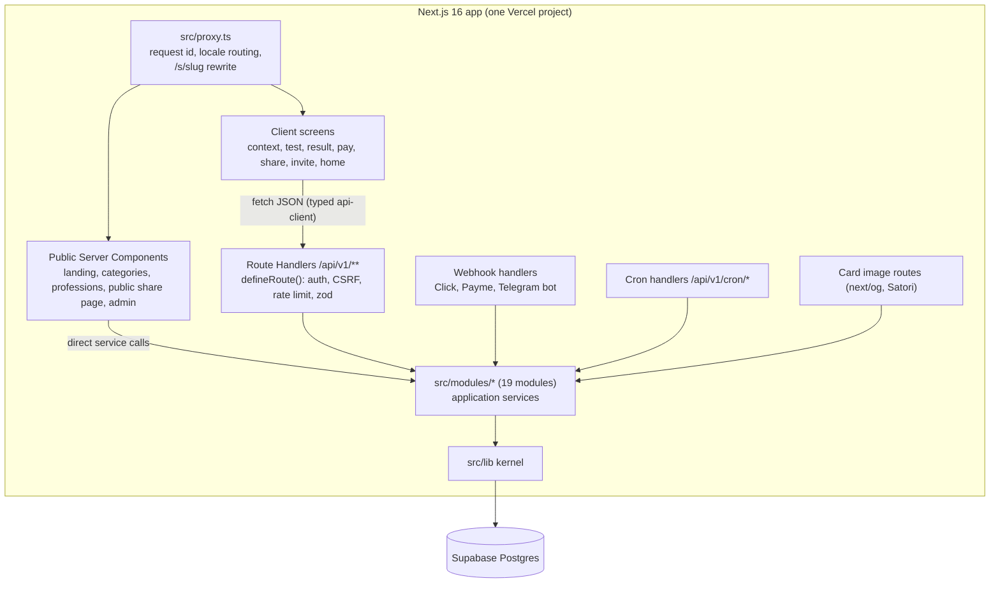

**Decision: rendering split.** Public, cacheable pages (S01 landing, S03 categories, S04 professions, S12 public share
page, admin) are React Server Components that call application services directly. Every *personal* screen (S05 context,
S06 test, S08/S10 result, S09 pay, S11 share, S13 invite, S15–S18) is a Client Component that talks to `/api/v1`
through the typed client in `src/lib/api-client`; the **server** still decides teaser vs full (`GET /api/v1/results/{id}`
returns `access: 'teaser' | 'full'`). Reasons: (1) inside Telegram Web the Mini App runs in a cross-site iframe where a `SameSite=Lax`
cookie is not sent, so the TMA authenticates with the Bearer token from `POST /api/v1/auth/telegram` (02 D25);
(2) the web app dogfoods the exact API future native apps will use; (3) one data path per screen keeps tests simple.

---

## 3. Modular monolith

### 3.1 Module catalog and table ownership

A table is **owned** by exactly one module. Only the owner's `infrastructure/` repositories issue INSERT/UPDATE/DELETE
against it. Other modules read through the owner's public API. Foreign keys across modules are allowed in SQL (the
database is not layered); code dependencies are.

| Module | Responsibility | Owned tables | First phase |
|--------|----------------|--------------|-------------|
| **identity** | Anonymous users, session JWTs, Telegram initData sign-in, web→Telegram link tokens, phone linking (Supabase OTP), user merge, profiles, data deletion, admin login | `users`, `profiles`, `auth_sessions`, `link_tokens` (**Decision**, additive) | 1 (linking/deletion: 8) |
| **catalog** | Profession taxonomy and level schemes; reference data (languages, countries, currencies) | `languages`, `countries`, `currencies`, `profession_categories`, `professions`, `specializations`, `skills`, `specialization_skill_weights`, `skill_prerequisites`, `levels`, `level_requirements` | 1 (reference) / 2 |
| **assessments** | Assessment templates, versioned item bank, session lifecycle, answer capture, CAT orchestration, retest cooldown | `assessment_templates`, `assessment_questions`, `question_options`, `assessment_sessions`, `assessment_answers` | 3 |
| **scoring** | Pure psychometrics: IRT 2PL+c, EAP (general + hierarchical per skill), item information, CAT selection and stop rule, θ→score, composite, level assignment, confidence. Versioned by `scoring_model_version` | — (no tables, no I/O) | 3 |
| **results** | Finalize a session into an immutable result; interpretation (bands, bottleneck, next level), teaser and full report JSON, optional AI narrative, accuracy feedback (F22); result read models | `assessment_results`, `skill_scores`, `level_scores`, `result_feedback` (02 D2) | 3 (scores) / 4 (report) |
| **pricing** | Products and price resolution by product × country × currency × experiment variant × validity window | `products`, `prices` | 5 |
| **payments** | Provider adapters (mock, click, payme, telegram_stars, stripe placeholder), payment state machine, webhooks, idempotency, unlocks, entitlements, subscriptions, provider fees | `payment_provider_configs`, `payments`, `provider_transactions`, `payment_events`, `result_unlocks`, `entitlements`, `subscriptions` | 5 |
| **sharing** | Share cards (public payload snapshot per toggle set), image rendering (story/square/telegram/og), public share page data, Telegram prepared messages, share events | `share_cards`, `share_events` | 6 |
| **referrals** | Referral codes, visit attribution (first touch), status progression, validity checks, reward rules and idempotent grants, K-factor inputs | `referral_codes`, `referrals`, `referral_reward_rules`, `referral_reward_grants` | 6 |
| **roadmaps** | Action library and do-not rules; pure planner (top-3 actions, do-not list, 7-day plan, 30-day roadmap); persisted roadmaps (proposed → active) and item progress | `actions`, `do_not_rules`, `roadmaps`, `roadmap_items`, `action_results` | 2 (library tables + content) / 4 (planner) / 8 (persisted) |
| **growth** | Growth OS: home view, goals, Today action, skill/level projections and history, retest eligibility, assessed vs verified badges, personalization | `goals`, `user_skills`, `skill_history`, `level_history` | 8 |
| **verification** | Verification tasks, attempts, rubric scoring (rule / ai / human / hybrid), verified level — behind `features.verification = false` in MVP | `verification_tasks`, `verification_attempts` | 8 (scaffold, flag off) |
| **evidence** | Sources, claims, evidence links, learning resources (verified only are served), benchmarks with sample-size gating | `sources`, `claims`, `evidence`, `learning_resources`, `benchmarks` | 2 (resources) / 4 |
| **analytics** | Event whitelist (8 client events, the rest server-only — 02 D31), client ingestion, authoritative server events, funnel/metric queries over its own table | `analytics_events` | 3 (capture) / 7 (dashboards) |
| **experiments** | Experiment definitions, sticky weighted assignment, variant lookup | `experiments`, `experiment_assignments` | 3 (tables + `getVariant`) / 7 (admin + analysis) |
| **organizations** | Companies/universities/teams, membership with consent, team assessments, aggregate-only reporting (min group size) | `organizations`, `organization_members`, `team_assessments` | post-launch (out of MVP scope) |
| **ai** | `AiProvider` abstraction, budget guard, cache, usage/cost ledger, output validation | `ai_usage`, `ai_cache` | 4 |
| **notifications** | Notification queue and channel senders (Telegram bot first; web push/email later), quiet hours, dedupe | `notifications` | post-launch (02 §6: no reminders in MVP) |
| **admin** | Read-mostly operator surface: dashboards, question analytics and flags, integrity counters, unit economics, settings editor, refunds, manual unlocks. Owns no tables; delegates writes to owners | — (owns SQL views prefixed `admin_v_`) | 1 (login) / 7 |
| *kernel* (`src/lib`) | Cross-cutting infrastructure, no business rules | `app_settings`, `audit_logs`, `rate_limits` | 1 |

### 3.2 Kernel and composition root

- **`src/lib` (kernel)** — db client and transaction helper, config/env and typed `app_settings` reader, HTTP
  primitives (errors, envelope, CSRF, request meta), crypto (HMAC, salted hashes, base32, constant-time compare),
  localized-text resolver, money, in-process domain event bus and event type catalog, Postgres fixed-window rate limiter,
  audit log writer, logger, Telegram primitives (initData verification, minimal Bot API client), tiny TTL LRU cache,
  injectable clock, typed API client. **The kernel imports no module.**
- **`src/server` (composition root)** — `defineRoute()` (auth/CSRF/rate-limit/validation wrapper), request-context
  resolution (calls `identity`), bootstrap that registers event subscriptions, user-lifecycle participants and
  purchase-target resolvers, and cron job implementations that orchestrate several modules. Route handlers and Server
  Components are the only other places allowed to call several modules in sequence.

### 3.3 Public service APIs

Each module exposes exactly three entry points; everything else is private (enforced by `scripts/arch/check-module-deps.ts`):

| Entry | Contents | Allowed importers |
|-------|----------|-------------------|
| `@/modules/<m>` (`index.ts`, starts with `import 'server-only'`) | Wired application services + server-side types | Other modules (per dependency table), `src/server`, `src/app` server code, scripts |
| `@/modules/<m>/contracts` (`contracts.ts`) | zod wire schemas, DTO types, enums — isomorphic, no I/O | Anyone, including client components and the API client |
| `@/modules/<m>/ui/*` | React components specific to the module | `src/app`, other modules' `ui/` |

Key functions per module (signatures abbreviated; `ctx: RequestContext`; money as `{ amountMinor, currency }`):

| Module | Public API (index.ts) |
|--------|-----------------------|
| identity | `resolveSession(token) → SessionClaims \| null` · `ensureAnonymous(meta) → { user, token }` · `signInWithTelegram({ initDataRaw, currentUserId, meta }) → { user, token, startParam, merged }` · `createLinkToken(userId)` / `getLinkTokenStatus(userId, id)` / `consumeLinkToken(tx, token, telegramUserId)` · `linkPhone(userId, supabaseAccessToken)` · `getUser(id)` · `getProfile(userId)` · `updateProfile(userId, patch)` · `setFirstTouchReferral(userId, codeId)` (write-once) · `canonicalUserId(id)` (follows `merged_into_user_id`) · `requestDeletion(ctx)` · `registerLifecycleParticipant(p)` · `adminLogin(password, meta)` |
| catalog | `listLanguages()` · `getCountry(code)` · `getCurrency(code)` · `listCategories()` · `listProfessions({ categorySlug? })` · `getProfession(slugOrId) → ProfessionAggregate` (config, specializations, skills, weights, prerequisite graph, resolved level scheme + requirements) · `getContentVersion()` |
| assessments | `getContextQuestions(professionId, specializationId?)` · `startSession(ctx, input) → SessionView` (abandons the user's other `in_progress` session) · `getActiveSession(userId) → { sessionId, professionSlug, answered, total } \| null` · `getSessionView(ctx, sessionId)` · `submitAnswer(ctx, sessionId, input) → { status: 'next', question, progress } \| { status: 'ready_to_finalize' }` · `loadForScoring(tx, sessionId) → ScoringInput` · `markCompleted(tx, sessionId)` · `retestEligibility(userId, professionSlug) → { eligibleAt, hasEntitlement }` · `expireIdleSessions(now)` · admin: `questionStats(range)`, `flagQuestion(key, reason, actor)`, `retireQuestion(key, actor)` |
| scoring | `SCORING_MODEL_VERSION` · `estimateGeneral(responses, priorMean)` · `estimateSkills(responses, thetaG, tau)` · `probability(item, θ)` · `information(item, θ)` · `selectNextItem(state, bank, constraints, rng)` · `shouldStop(state, config)` · `thetaToScore(θ)` · `composite(skillScores, weights)` · `assignLevel(input) → { level, range, capsApplied }` · `computeConfidence(input) → { confidence, reasons }` · `createRng(seed, sequence)` |
| results | `finalizeSession(ctx, sessionId) → { resultId, teaser }` (idempotent) · `getResultView(ctx, resultId) → { access: 'teaser' \| 'full', teaser, report?, narrative? }` · `listMyResults(ctx, cursor)` · `hasResults(userId)` · `submitFeedback(ctx, resultId, input)` · `assertOwnedResult(userId, resultId)` · `getShareFacts(userId, resultId)` · `getResultSummary(resultId)` · `generateNarrative(resultId, locale)` · `aggregateForBenchmark(professionId, specializationId, windowDays)` |
| pricing | `quote({ productSlug, countryCode, currency, channel, userId, at }) → Quote \| null` · `listActivePrices(productSlug)` |
| payments | `getCheckoutOptions(ctx, { productSlug, targetType, targetId }) → { providers, openPayment } \| { status: 'already_unlocked' }` · `createPayment(ctx, { productSlug, targetType, targetId, provider, idempotencyKey })` · `getPaymentStatus(ctx, paymentId)` · `handleClick(stage, form)` · `handlePaymeRpc(req)` · `handleTelegramPreCheckout(q)` · `handleTelegramSuccessfulPayment(msg)` · `mockComplete(paymentId, outcome)` (non-prod) · `refund(paymentId, reason, actor)` · access: `isResultUnlocked(resultId, type)`, `grantUnlock(tx?, input)`, `grantEntitlement(tx?, input)`, `consumeEntitlement(tx, userId, entitlement, ref)`, `listEntitlements(userId)` · `expireStalePayments(now)` · `registerTargetResolver(targetType, resolver)` |
| sharing | `createOrReuseCard(ctx, { resultId, showName, showStrongest, showNext }) → ShareCardView` · `getPublicCard(slug)` · `renderCardImage(slug, format) → ImageResponse` · `prepareTelegramMessage(ctx, slug)` · `recordShareEvent(ctx, slug, event, channel)` · `revokeCard(ctx, slug)` · `revokeCardsForResult(tx, resultId)` |
| referrals | `getOrCreateCode(userId)` · `getMySummary(ctx)` · `recordVisit(code, meta)` · `attributeVisit({ userId, code, channel, deviceHash, ipHash, telegramUserId, userCreatedInThisRequest })` · handlers `onStarted`, `onCompleted`, `onPaid`, `onRefunded` · `viralInputs(range)` |
| roadmaps | `getActionLibrary(professionId)` · `getDoNotRules(professionId)` · `planPreview(input: PlanInput) → { top3, doNot, plan7, plan30 }` · `createRoadmap(input)` (status `proposed` or `active`) · `activateRoadmap(tx, id)` · `getRoadmap(ctx, id)` · `getActiveRoadmap(userId, professionId)` · `setItemStatus(ctx, itemId, status, note?)` · `todayItems(userId, roadmapId, localDate)` |
| growth | `getHome(ctx) → HomeView` · `acceptRoadmap(ctx, { resultId, goal })` (activates the proposed roadmap or creates an active one; idempotent per result) · `getHistory(ctx, cursor)` · handlers `proposeRoadmapOnUnlock(evt)`, `recordAssessedResult(evt)`, `recordVerifiedAttempt(evt)` |
| verification | `listTasks(professionId, level)` · `startAttempt(ctx, taskId)` · `submitAttempt(ctx, attemptId, submission)` · `scoreAttempt(attemptId)` |
| evidence | `getSources(ids)` (verified only) · `getResources({ skillIds, level, locale })` (verified only) · `getBenchmark({ professionId, specializationId, metric })` (null unless `sample_size ≥ benchmark_min_sample`) · `upsertBenchmark(row)` |
| analytics | `track(tx?, event: ServerEvent)` · `ingestClientEvents(ctx, batch)` · `funnel(range, filters)` · `metric(name, range, filters)` · `cohort(definition)` |
| experiments | `getVariant(userId, key, targetingCtx) → string \| null` (sticky, persisted) · `getAssignments(userId)` · admin: `upsertExperiment`, `setStatus` |
| organizations | `createOrganization` · `joinByInviteCode` · `createTeamAssessment` · `getTeamAggregate(teamAssessmentId)` (SECURITY DEFINER SQL function enforcing `min_group_size` + consent) |
| ai | `generate<T>(req: AiRequest<T>) → AiOutcome<T>` (never throws) · `estimateCostMicros(model, inTok, outTok)` · `usageSummary(range)` |
| notifications | `enqueue(input)` (dedupe key) · `cancel(userId, type)` · `dispatchDue(now, limit)` |
| admin | `getDashboard(range)` · `getCohortReadout()` · `getIntegrityCounters()` · `getQuestionAnalytics(professionId)` · `getFlags(range)` · `getUnitEconomics(range)` · `updateSetting(key, value, actor)` · delegating commands (refund, manual unlock, experiment status) |

### 3.4 Dependency graph (acyclic)

Rules: an arrow `A → B` means "A may import B's public API". Every module may import the kernel, `analytics` and
`catalog` (edges omitted for readability). **Upward** communication happens only through domain events or registered
participants/resolvers (§3.5).

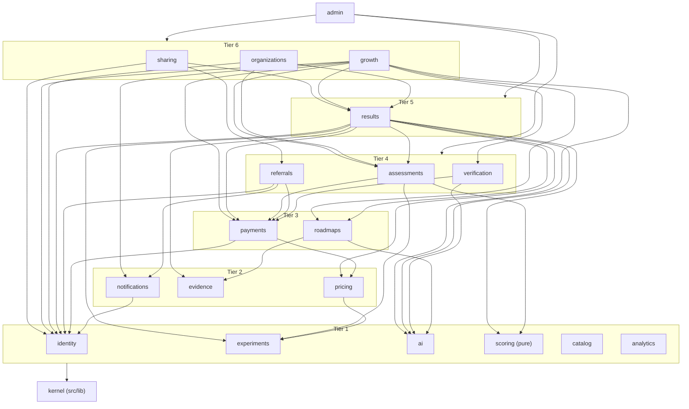

Allowed-dependency map (the machine-checked version lives in `src/modules/module-graph.ts`):

| Module | May depend on (besides kernel, analytics, catalog) |
|--------|---------------------------------------------------|
| identity, experiments, ai, scoring, analytics, catalog | — (scoring additionally may not import kernel I/O: db, http, settings) |
| evidence | — |
| notifications | identity |
| pricing | experiments |
| payments | identity, pricing |
| roadmaps | evidence, ai |
| assessments | scoring, experiments, payments |
| referrals | identity, payments, notifications |
| verification | ai, payments |
| results | assessments, scoring, roadmaps, evidence, payments, pricing, experiments, identity, ai |
| sharing | results, referrals, identity |
| growth | results, roadmaps, verification, assessments, payments, notifications, identity, ai |
| organizations | identity, assessments, results |
| admin | any module |

### 3.5 Cross-module mechanisms

**Domain events (upward notifications).** Event types are declared in the kernel (`src/lib/events/catalog.ts`) so
subscribers never import publishers. Publishers return events from their transaction; `src/server` publishes them
**after commit** inside Next's `after()` so the response is not delayed. Subscribers are registered once per instance
(`src/instrumentation.ts` → `src/server/bootstrap.ts` → `src/server/subscriptions.ts`). Handlers are idempotent and
derivable from facts, so a reconcile cron (`/api/v1/cron/reconcile`, every 15 min) repairs anything a failed handler
missed.

**Decision:** in-process, post-commit, at-least-once-by-reconcile events; no outbox table in MVP. Money and unlock state
are **never** propagated by events — they change in the same database transaction (§7.4).

| Event | Publisher | Subscribers (effect) |
|-------|-----------|----------------------|
| `assessment.started` | assessments | referrals (`invited → started`) |
| `result.finalized` | results | growth (upsert `user_skills`, append `skill_history`/`level_history` kind=assessed; P8), referrals (`→ completed`, evaluate `completed` rules) |
| `result.unlocked` | payments | results (AI narrative, async, budgeted), growth (create `proposed` roadmap from the report's 30-day plan — 02 D18; P8) |
| `payment.paid` | payments | referrals (`→ paid`, evaluate `paid` rules) |
| `payment.refunded` | payments | sharing (revoke cards of the result — 02 D15), referrals (stop counting this payment and re-evaluate; already consumed rewards are flagged for admin, never silently clawed back). The payment-sourced unlock is deleted **inside** the refund transaction, not by an event. |
| `verification.scored` | verification | growth (verified scores, `level_history` kind=verified) |
| `identity.users_merged` | identity | analytics (`account_linked` server event) |

**User-lifecycle participants (synchronous, one transaction).** Merge and deletion touch many modules' tables
atomically, so they cannot be events. Each module registers a participant in `src/server/bootstrap.ts`:
`{ repoint(tx, fromId, toId), onDeletion?(tx, userId) }`. `identity.mergeUsers(tx, from, to)` and
`identity.requestDeletion(ctx)` call every participant inside their transaction. Merge conflict rules (**Decision**):

| Table(s) | Rule |
|----------|------|
| `assessment_sessions`, `assessment_results`, `result_feedback`, `payments`, `result_unlocks`, `entitlements`, `subscriptions`, `share_cards`, `share_events`, `goals`, `roadmaps`, `action_results`, `skill_history`, `level_history`, `verification_attempts`, `referrals.referrer_user_id` | Re-point `user_id` to target. |
| `auth_sessions` | Re-point (02 F19: the existing web cookie keeps working and now resolves to the merged user). |
| `user_skills` (PK user, skill) | Keep the row with the later `updated_at`. |
| `referral_codes` (unique user) | If target has no code, re-point; otherwise keep the anon code row — attribution resolves its owner via `canonicalUserId()`. |
| `referrals.referred_user_id` (unique) | If target already has a referral row, mark the anon row `is_valid = false, invalid_reason = 'merged_duplicate'`; else re-point. |
| `referral_reward_grants` (unique user, rule) | On conflict keep target's grant; entitlements already granted are kept (never lose value). |
| `experiment_assignments` | On conflict keep target's variant. |
| `notifications` | Cancel anon's queued notifications. |
| `profiles` | Fill target's NULL columns from anon's profile. |
| `analytics_events` | Not rewritten (append-only); queries resolve `coalesce(users.merged_into_user_id, users.id)`. |
| `users` (anon) | `merged_into_user_id = target`; row kept for audit. Chains are followed up to depth 5. |

Deletion (02 D27): `users.deleted_at` set, sessions revoked, profile fields anonymized, share cards revoked (public page →
410), referral code deactivated; payments retained for accounting with only the opaque user id.

**Purchase target resolvers.** `payments` is below `results`, so it cannot validate a result id itself.
`src/server/bootstrap.ts` registers `payments.registerTargetResolver('assessment_result', results.assertOwnedResult)`.
New purchasable things register their own resolver; payments code is unchanged.

**Transactions.** `withTx(fn)` (kernel) opens `sql.begin()`, retries the whole function up to 3 times on SQLSTATE
`40001`/`40P01`, and passes `tx` explicitly. Repositories accept `Sql | Tx` as first argument. A use case that needs
another module's write inside its transaction calls that module's API with `tx` (e.g. `assessments.markCompleted(tx, id)`).

---

## 4. Layering rules

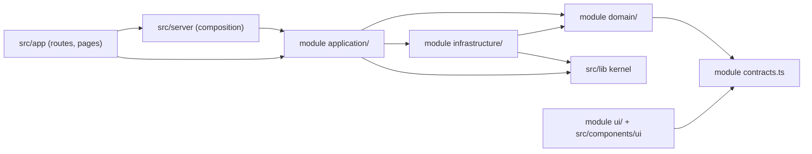

| Layer | May import | Must not | Testing |
|-------|-----------|----------|---------|
| `domain/` | own `contracts.ts`, other modules' **pure** exports (e.g. `scoring` functions), `src/lib/utils`, `src/lib/money`, `src/lib/i18n/localized-text` | `postgres`, `next/*`, `react`, `process.env`, `Date.now()`, `Math.random()`, `fetch`, own `application/` or `infrastructure/` | Unit tests only, ≥ 90 % line coverage (**Decision**) |
| `application/` | own domain + infrastructure, other modules' `index.ts` (per dependency map), kernel | `next/*` request objects (receives `RequestContext`, never `Request`), React | Unit tests with fakes + integration tests on real Postgres |
| `infrastructure/` | `postgres` (tagged templates only), provider SDKs, kernel, own domain types | Business rules (no "if level ≥ 5" logic), other modules' tables | Integration tests |
| `ui/` | `contracts.ts`, `src/components/ui`, `next-intl`, `src/lib/api-client` | `index.ts` of any module (server-only) | Component behaviour via e2e |
| `src/app` route handlers | `src/server/api`, modules' `index.ts`, `contracts.ts` | SQL, business rules; > 80 lines | API integration tests |

Additional rules:

1. Application services are factories with explicit dependencies (`createAssessmentsService(deps)`); `index.ts` wires the
   default instance. Clock and RNG are injected — deterministic tests, reproducible CAT.
2. SQL lives only in `infrastructure/*-repo.ts` and migrations. String concatenation into SQL is forbidden; dynamic
   identifiers use `sql(identifier)` helpers only for whitelisted column names.
3. **Decision:** the HTTP wire format is camelCase JSON (same as TypeScript; repositories map snake_case columns);
   inputs are zod-validated; outputs are shaped explicitly (`toQuestionDto()` strips option scores; `toTeaserDto()`
   contains no level).
4. Enforcement: ESLint `no-restricted-imports` (per-layer bans), `scripts/arch/check-module-deps.ts` (entry points +
   dependency map + cycles), `max-lines` (see `12-folder-structure.md`), `server-only` import in every `index.ts`.

---

## 5. API-first design (`/api/v1`)

### 5.1 Conventions

| Concern | Rule |
|---------|------|
| Base path | `/api/v1/...`; breaking changes ship as `/api/v2` alongside v1 for ≥ 6 months (**Decision**). Additive fields are not breaking; clients must ignore unknown fields. |
| Auth | `level_session` httpOnly cookie (web) **or** `Authorization: Bearer <jwt>` (TMA, native). Same JWT, claims `sub`, `sid`, `ch`. Bearer wins when both are present (**Decision**). Native apps call `POST /api/v1/session` and keep the token in secure storage. |
| CSRF | Cookie-authenticated mutating requests require `Origin` (or `Referer`) host ∈ `{APP_URL host}`; Bearer requests and signed webhooks are exempt. |
| Content | `application/json; charset=utf-8`; request body ≤ 16 KB except webhooks (≤ 64 KB) — **Decision**; event `properties` ≤ 2 KB each (02 AC-F21-01). |
| Casing | camelCase JSON keys (**Decision**). Webhook routes speak each provider's own format. |
| Envelope | Success: `{ "data": … , "meta"?: { "nextCursor"?: string, "locale"?: string } }`. Error: `{ "error": { "code": "RETEST_COOLDOWN", "messageKey": "err.retestCooldown", "message": "<localized text>", "details"?: { … }, "retryAfter"?: 3, "requestId": "…" } }`. The UI maps `code` to a state (03 §0.4) and never shows raw technical text. `messageKey`/`retryAfter` carry 02 D32's `message_key`/`retry_after` in the API's camelCase. |
| Locale | Resolved per request (§16); responses contain resolved strings, never raw `{uz,ru,en}` maps; `meta.locale` echoes the locale used. |
| IDs, time, money | UUID strings; ISO-8601 UTC timestamps; money `{ "amountMinor": 100000, "currency": "UZS", "display": "1,000 soʻm" }` (`amountMinor` < 2^53 guaranteed by CHECK). |
| Idempotency | `Idempotency-Key` (UUIDv4) **required** on `POST /payments` (02 F09: generated when the pay sheet opens, kept per result × provider), optional on other creates (`POST /assessments/sessions` uses it against double taps). Same key + different body → `422 IDEMPOTENCY_KEY_REUSED`. Answers are idempotent per `sequence`. |
| Pagination | Cursor based: `?limit=20&cursor=…` (max 50); cursor = opaque base64url of `(created_at, id)`. |
| Caching headers | Personal data: `Cache-Control: private, no-store`. Public catalog: `public, s-maxage=300, stale-while-revalidate=86400`. Card images: `public, max-age=31536000, immutable` (URL carries the payload hash). |
| Rate limits | 429 with `Retry-After` header and `retryAfter` in the body. |
| Client identification | `X-Client-Platform: web\|tma\|android\|ios`, `X-Client-Version`. `GET /api/v1/config` returns `minSupportedVersion` per platform, active locales, feature flags, Telegram links. |
| Schema export | zod 4 schemas in each `contracts.ts` → `scripts/api/generate-openapi.ts` emits `openapi.json` (via `z.toJSONSchema`) in CI; drift fails the build. |

### 5.2 Error codes

| `code` | HTTP | `messageKey` | Client behaviour (03 §0.4) |
|--------|------|--------------|----------------------------|
| `VALIDATION_FAILED` | 400 | `err.generic` | `details.issues` holds paths only (no echo of values) |
| `UNAUTHENTICATED` | 401 | — | Web: silently `POST /api/v1/session`, retry once. TMA: re-auth with `initData` |
| `TELEGRAM_INIT_DATA_INVALID` / `TELEGRAM_INIT_DATA_EXPIRED` | 401 | `err.tmaSession` | "LEVELni bot orqali qayta oching" |
| `FORBIDDEN` | 403 | `err.forbidden` | Not admin / feature disabled |
| `NOT_FOUND` | 404 | `err.notFound` / `err.notYours` | Also used for resources the caller does not own (no existence oracle) |
| `GONE` | 410 | `public.revoked` | Revoked or deleted share card (02 AC-F15-04, AC-F19-05) |
| `SESSION_NOT_ACTIVE` | 409 | `err.sessionEnded` | Session completed/expired/abandoned → navigate to result or restart |
| `STALE_QUESTION` | 409 | — | Re-fetch session view silently |
| `RETEST_COOLDOWN` | 409 | `err.retestCooldown` | `details.eligibleAt`; UI "Qayta test {date} kuni ochiladi." |
| `SHARE_REQUIRES_RESULT` | 409 | `err.generic` | Share card requested for a result the user does not own or that is not finalized |
| `PRODUCT_UNAVAILABLE` | 409 | `err.paymentUnavailable` | No active price/provider for country × channel |
| `IDEMPOTENCY_KEY_REUSED` | 422 | `err.generic` | Client bug |
| `PAYLOAD_TOO_LARGE` | 413 | `err.generic` | — |
| `RATE_LIMITED` | 429 | `err.rateLimited` | Auto-retry after `retryAfter` (default 3 s) |
| `PAYMENT_PROVIDER_ERROR` | 502 | `err.paymentProvider` | Offer another provider |
| `PROVIDER_UNAVAILABLE` | 503 | `err.paymentUnavailable` | Provider disabled by config/kill switch |
| `MAINTENANCE` | 503 | `err.maintenance` | `app_settings.maintenance.enabled` or database unavailable |
| `INTERNAL` | 500 | `err.generic` | "Xatolik yuz berdi. Qayta urinib koʻring." / "Произошла ошибка. Попробуйте ещё раз." / "Something went wrong. Please try again." |

### 5.3 Endpoint catalog (v1)

This table is the authoritative list of paths, auth modes and owners; `03-user-flows.md` §0.5 maps screens onto it.

| Method & path | Auth mode | Module(s) | Phase |
|---------------|-----------|-----------|-------|
| `GET /api/v1/health` | none | kernel | 1 |
| `GET /api/v1/config` | none | kernel, catalog | 1 |
| `POST /api/v1/session` · `DELETE /api/v1/session` | ensure / required | identity, referrals | 1 |
| `POST /api/v1/auth/telegram` (`{ initData, tz }` → `{ token, user, locale }`) | optional | identity, referrals | 1 |
| `GET /api/v1/me` (+ `activeAssessment`, `hasResults`, composed from assessments/results) · `PATCH /api/v1/me` (`locale`, `firstName`, `timezone`) | required | identity (+ composition) | 1 / 3 |
| `POST /api/v1/me/deletion` | required | identity (+ lifecycle participants) | 8 |
| `POST /api/v1/auth/link-tokens` · `GET /api/v1/auth/link-tokens/{id}` (web → Telegram, 02 D26) | required | identity | 8 |
| `POST /api/v1/auth/link` (phone: Supabase access token after OTP) | required | identity | 8 |
| `GET /api/v1/catalog/categories` · `GET /api/v1/catalog/professions?category=` · `GET /api/v1/catalog/professions/{slug}` | none | catalog | 2 |
| `GET /api/v1/catalog/professions/{slug}/context-questions` | none | assessments | 3 |
| `POST /api/v1/assessments/sessions` (`{ professionSlug, specializationSlug?, context, retestOfSessionId? }`) | ensure | assessments | 3 |
| `GET /api/v1/assessments/sessions/{id}` | required | assessments | 3 |
| `POST /api/v1/assessments/sessions/{id}/answers` (`{ questionId, optionKey, sequence }`) | required | assessments → results | 3 |
| `POST /api/v1/assessments/sessions/{id}/complete` (idempotent recovery path) | required | results | 3 |
| `GET /api/v1/retests/eligibility?professionSlug=` (`{ eligibleAt, hasEntitlement }`) | required | assessments, payments | 8 |
| `GET /api/v1/results` · `GET /api/v1/results/{id}` (`{ access: 'teaser' \| 'full', … }`) | required | results, payments, pricing | 4 |
| `POST /api/v1/results/{id}/feedback` (F22) | required | results | 4 |
| `GET /api/v1/payments/options?productSlug=full_report&targetType=assessment_result&targetId=` (+ `openPayment`) | required | payments, pricing | 5 |
| `POST /api/v1/payments` (`Idempotency-Key`) · `GET /api/v1/payments/{id}` | required | payments | 5 |
| `POST /api/v1/payments/webhooks/click/prepare` · `…/click/complete` · `…/payme` | provider signature | payments | 5 |
| `POST /api/v1/payments/mock/{id}` | required, non-production only | payments | 5 |
| `POST /api/v1/telegram/webhook` | secret header | payments, identity | 5 |
| `POST /api/v1/share-cards` (create or reuse for a toggle set) | required | sharing | 6 |
| `GET /api/v1/share-cards/{slug}` (public payload) · `DELETE /api/v1/share-cards/{slug}` (owner revoke) | none / required | sharing | 6 |
| `POST /api/v1/share-cards/{slug}/events` · `POST /api/v1/share-cards/{slug}/telegram-message` (prepared inline message for `shareMessage`) | required | sharing, analytics | 6 |
| `GET /api/v1/share-cards/{slug}/image/{format}?v={payloadHash}` (`story \| square \| telegram \| og`) | none | sharing | 6 |
| `GET /api/v1/referrals/me` | required | referrals | 6 |
| `POST /api/v1/events` | session optional; never creates users | analytics | 3 |
| `GET /api/v1/growth/home` | required | growth | 8 |
| `POST /api/v1/roadmaps` (`{ resultId, goal }` → active roadmap) · `GET /api/v1/roadmaps/{id}` | required | growth, roadmaps | 8 |
| `PATCH /api/v1/roadmaps/{id}/items/{itemId}` (`{ status: 'done' \| 'skipped' \| 'partial' }`, idempotent) | required | roadmaps | 8 |
| `GET /api/v1/history?cursor=` | required | growth | 8 |
| `GET /api/v1/verification/tasks` · `POST /api/v1/verification/attempts` · `POST /api/v1/verification/attempts/{id}/submit` | required, `features.verification` | verification | 8 (flag off) |
| `POST /api/v1/admin/login` · `GET/PATCH/POST /api/v1/admin/*` | admin | admin | 1 / 7 |
| `GET /api/v1/cron/{job}` | `Authorization: Bearer CRON_SECRET` | src/server/jobs | 3+ |

Non-API routes: `/tma` (S00 Telegram Mini App bootstrap — 02 D25), `/r/{code}` (referral redirect, 302; with
`?c={slug}` it lands on that card's profession page), `/s/{slug}` (rewritten to `/{locale}/s/{slug}`, S12). Auth modes:
`none`, `optional`, `required`, `ensure` (creates an anonymous user + session if missing — used where a test start must
never be blocked), `admin`, `cron`.

---

## 6. Request pipeline (common to all handlers)

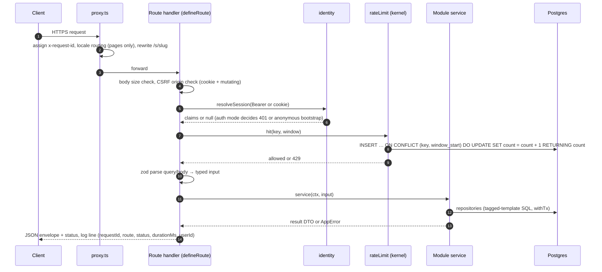

`defineRoute` shape (in `src/server/api/define-route.ts`):

```ts
export const POST = defineRoute(
  {
    auth: 'ensure',
    rateLimit: { key: 'assess_start', scope: 'user', limit: 10, windowSec: 3600 },
    body: StartSessionRequest, // zod schema from @/modules/assessments/contracts
    idempotency: 'optional',
  },
  async ({ ctx, body }) => created(await assessments.startSession(ctx, body)),
);
```

`RequestContext` = `{ requestId, user: { id, isAnonymous, role } | null, sessionId, channel: 'web'|'telegram'|'mobile',
locale, countryCode, timezone, ipHash, uaHash, deviceHash, experimentVariants (lazy), now }`.

Default rate limits (overridable in `app_settings.rate_limits`; **Decision** values):

| Key | Scope | Limit / window | On limiter failure |
|-----|-------|----------------|--------------------|
| `session_create` | ip_hash | 300 / 10 min (CGNAT-safe, abuse only) | fail open |
| `session_create` | device_hash | 20 / 10 min | fail open |
| `telegram_auth` | ip_hash | 120 / 10 min | fail open |
| `assess_start` | user | 10 / 1 h | fail open |
| `answer` | session | 60 / 1 min | fail open |
| `payment_create` | user | 10 / 10 min | fail closed |
| `events` | user or ip_hash | 120 / 1 min, ≤ 20 events/batch | fail open (drop) |
| `share_card_create` | user | 60 / 1 h (the share screen re-posts on toggle changes) | fail open |
| `referral_visit` | ip_hash + code | 30 / 1 h (over limit: redirect still works, visit not attributed) | fail open |
| `link_token_create` | user | 10 / 1 h | fail closed |
| `admin_login` | ip_hash | 5 / 15 min | fail closed |

---

## 7. Request lifecycles

### 7.1 Start assessment

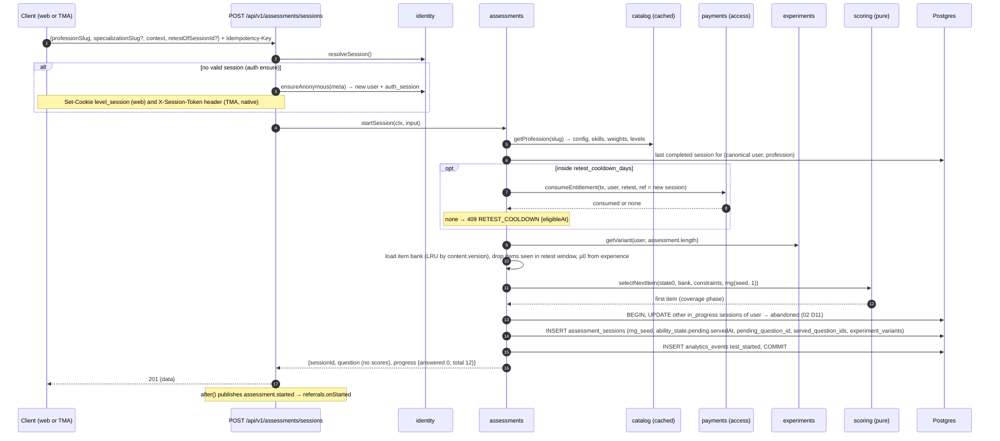

Notes:
- Resume is a client decision: `GET /api/v1/me` returns `activeAssessment`; the client opens
  `/{locale}/assess/session/{sessionId}` instead of starting a new one, and asks for confirmation before replacing a
  session of another profession (03 S05).
- `rng_seed` = 63-bit random from `crypto.getRandomValues`; per-step RNG = splitmix64(`rng_seed` + `sequence`) → reproducible.
- Context answers (4 defaults incl. `time_per_day`, optional 5th — 02 D8) are collected client-side one per screen
  and sent with the start request; `context_completed` is a client event.
- In-progress sessions idle > 24 h are set `expired` by the hourly cron (02 D11).

### 7.2 Answer question

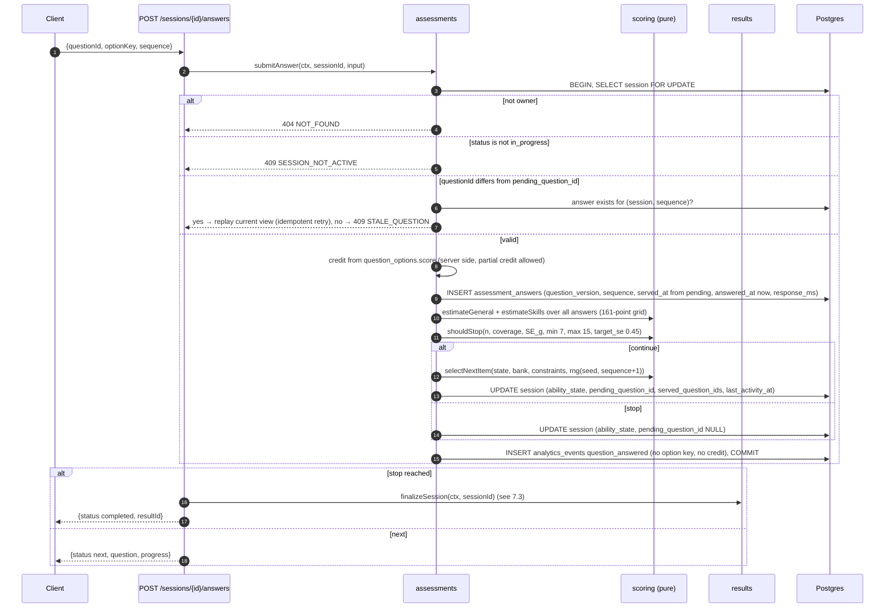

Rules: `ability_state` is a cache — the answers table is the source of truth and the estimate is recomputed from all
answers on every step (cheap: ≤ 15 items × 161 grid points × ≤ 11 skills). No correctness feedback is returned; the
400 ms answer commit delay (02 D9) is client-side only. If finalization fails after the last answer, the response is
`{ status: 'ready_to_finalize' }`, the session stays `in_progress` with `pending_question_id = NULL`, and the client calls
`POST /complete` (idempotent).

### 7.3 Complete and score

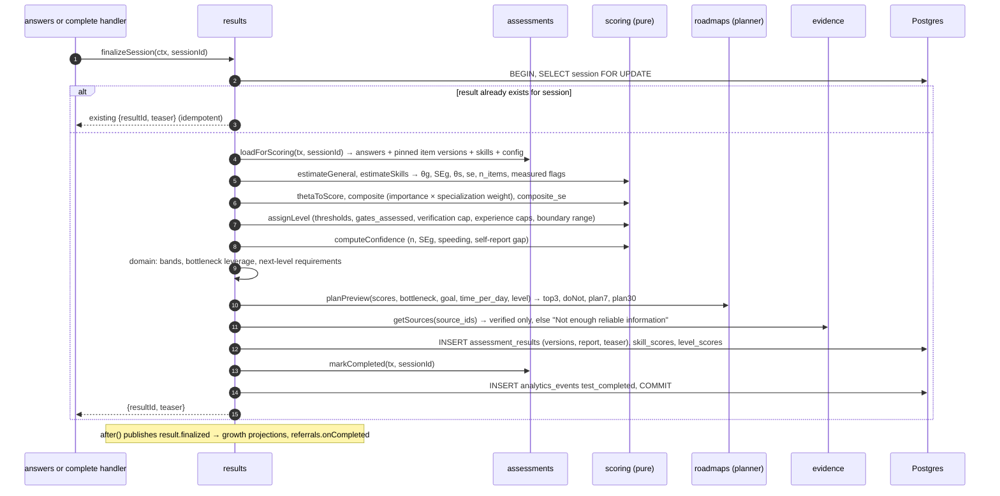

- Report and teaser are computed once, deterministically, and stored; reads never recompute (auditability).
- `composite_se` (**Decision**) = `SE_g × 100 / 7` (slope of the θ→score mapping); the range ("Level 4–5") is shown when
  `|composite − boundary| < composite_se` for the nearest boundary (under the badge only; cards use the single assessed
  level — 02 D16).
- Teaser JSON contains no price and no level (02 D12); the current price is attached at read time by `pricing.quote()`.

### 7.4 Pay and unlock (Payme on web; Telegram Stars variant)

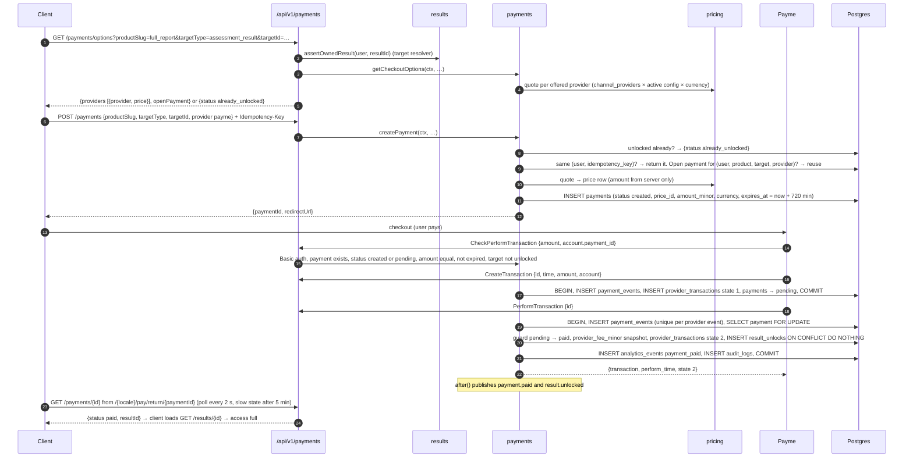

Telegram Stars (TMA channel; providers per `app_settings.payments.channel_providers`, default
`{"web": ["click","payme"], "telegram": ["telegram_stars"], "mobile": []}` — 02 F09; Stars is offered only once an
active XTR price row exists — 02 D14):

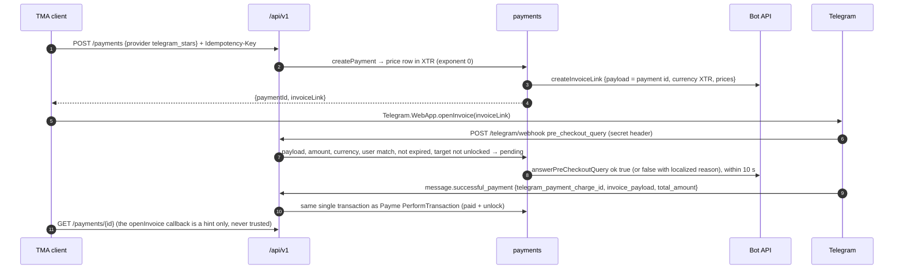

Invariants: amount always from the server price row; webhook amount must equal stored `amount_minor`; every callback is
stored in `payment_events` with `unique(provider, event_type, provider_event_id)` so replays become `outcome='duplicate'`;
the PAID transition and the unlock happen in **one** transaction; provider pre-checks reject already-unlocked targets
so a second provider cannot capture money for the same result (02 F09). **Decision:** the expiry cron never fails a
payment with a live provider transaction (Payme state 1), and pre-checks refuse expired payments, so a `failed → paid`
transition does not exist; a provider success for a failed payment is stored as `rejected`, alerts ops, and is refunded
manually. Refund (admin, `paid → refunded`): one transaction deletes the payment-sourced unlock and writes the audit row;
`payment.refunded` then revokes the result's share cards and referral counting (02 D15).

### 7.5 Share and referral attribution

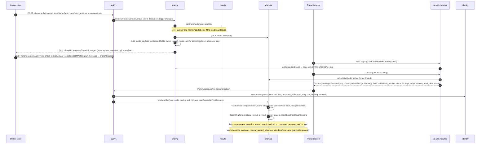

TMA variant: `t.me/<bot>/<app>?startapp=CODE` opens `/tma`; `POST /api/v1/auth/telegram` verifies initData, applies the
`start_param` grammar (02 D26: `^[A-Z2-7]{6,12}$` referral code, `^lk_[A-Za-z0-9]{20,40}$` link token, else ignored and
logged) and calls the same `attributeVisit`. **Decisions:**
- **Locked results may be shared with a level-less card** (`public.title.locked`: "{profession} LEVEL testi. Sen qaysi
  LEVELdasan?"); a card that shows a level requires an unlocked result. Sharing must never leak the paid level, and the
  locked card keeps the referral loop open before payment. (02 F15's "sharing requires an unlocked result" applies to
  level-bearing cards.)
- Attribution only for users created in this request (no prior session — 02 D20); first-touch and write-once
  (`users.referred_by_code_id IS NULL` guard); window 30 days (`level_ref` cookie lifetime).
- `device_hash` = HMAC-SHA256(`HASH_SALT`, `level_did` cookie value); in TMA, device identity is the Telegram user id.
  `auth_sessions` gets an additive `device_hash` column so the referrer's devices can be compared. IP hash alone never
  invalidates (CGNAT); it only feeds an admin anomaly flag (> 20 valid referrals per ip_hash per day).
- Referral codes: 8 characters from the RFC 4648 base32 alphabet (`A–Z`, `2–7`), random, retry on unique conflict (fits
  the 02 D26 grammar). Share-card slugs: 10 lowercase base32 characters.
- MVP reward rule (02 D21): 3 valid `completed` referrals → 1 `retest` entitlement; one-sided.

### 7.6 Telegram sign-in, link token and merge (S00 `/tma`)

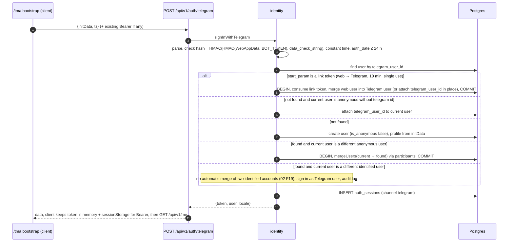

Routing after bootstrap (03 §0.6.1): `activeAssessment` → `/{locale}/assess/session/{sessionId}`; `hasResults` →
`/{locale}/home`; otherwise landing. Because merge re-points `auth_sessions`, an existing web cookie keeps working and
resolves to the merged user (02 F19).

---

## 8. AI layer

### 8.1 Provider abstraction

```ts
// src/modules/ai/domain/types.ts
export type AiPurpose =
  | 'report_narrative' | 'roadmap_narrative'          // Phase 4 / 8
  | 'open_answer_scoring' | 'simulation_turn'          // verification only (flag off in MVP), never test scoring
  | 'content_review';                                  // offline admin tooling, human approval required

export interface AiProvider {
  readonly id: 'anthropic' | 'null';
  complete(req: ProviderRequest): Promise<ProviderResponse>; // may throw; gateway catches
}

export interface AiRequest<T> {
  purpose: AiPurpose;
  tier: 'cheap' | 'standard';          // → AI_MODEL_CHEAP / AI_MODEL_STANDARD
  promptVersion: string;               // e.g. 'report_narrative@3'
  locale: string;
  cacheKeyInput: unknown;              // coarse, canonical-JSON hashed (see 8.3)
  system: string; input: string;       // built by the CALLING module's prompt builder
  schema: z.ZodType<T>;                // output contract
  maxOutputTokens: number;
  budget: { ref: { type: string; id: string }; maxCostMicros: number };
  fallback: () => T;                   // deterministic, always available
}

export type AiOutcome<T> =
  | { source: 'ai' | 'cache'; value: T; costMicros: number }
  | { source: 'fallback'; value: T; reason: 'disabled' | 'budget' | 'timeout' | 'provider_error' | 'invalid_output' };
```

Implementations: `AnthropicProvider` (`@anthropic-ai/sdk`, `maxRetries: 1`, timeout `AI_TIMEOUT_MS`, default 8,000 ms)
and `NullProvider` (always throws `disabled`, so every call resolves to the deterministic fallback). `AI_PROVIDER=null`
is the default in development and test. Prompt builders live in the **calling** module
(`results/application/narrative-prompt.ts`); the `ai` module knows nothing about results. AI-written text is labelled
in the UI and never changes scores (02 E9).

### 8.2 When AI is called — and when it is not

| Purpose | Trigger | Tier (default model) | Mode | Deterministic fallback |
|---------|---------|----------------------|------|------------------------|
| `report_narrative` | `result.unlocked` event, once per result × locale | cheap (`claude-haiku-4-5`) | async (`after()`); result page shows deterministic text until ready | Template narrative assembled from report JSON (`results/domain/narrative-template.ts`) |
| `roadmap_narrative` | Roadmap accepted (Phase 8) | cheap | async | `actions.why` templates |
| `open_answer_scoring` | Verification submissions with `scoring_rule='open_ai'` (after MVP) | standard (`claude-sonnet-5-5`) | sync with timeout, retried by cron | Attempt stays `submitted` for human scoring; never blocks a level |
| `simulation_turn` | Verification simulations (after MVP) | standard | sync | Task marked unavailable |
| `content_review` | Admin script (translation/question review drafts) | standard | offline | Human-only |

**Never AI:** item selection, closed-item scoring, θ/SE, level, confidence, bottleneck, next-level requirements, action
selection, do-not rules, 7-day/30-day plan structure, teaser, prices, payment state, unlocks, referrals, experiment
assignment, share card content. The MVP item bank contains **no `open` items** (02 D9); the core assessment is
100 % deterministic and works with `AI_PROVIDER=null`.

Output guardrails (in the gateway, before caching): zod schema; length caps; reject output containing `http`, `www.`,
`@`, `%`, or any digit sequence not present in the input facts; reject names of books/sources not passed in. Rejected →
fallback (`invalid_output`). The prompt passes only structured facts (skill names, scores, bottleneck, requirements,
selected action titles) and instructs: no new facts, numbers, sources, percentiles; no shaming; "Level = domain
competency, not human value."

### 8.3 Caching

- Key = `sha256(canonicalJson({ purpose, promptVersion, model, locale, cacheKeyInput }))` in `ai_cache` (TTL 180 days,
  **Decision**).
- **Decision: coarse cache keys.** Narratives are generated for a *profile*, not a person:
  `report_narrative` key input = `{ professionId, specializationId, level, confidence, strongestSkillId, bottleneckSkillId,
  weakSkillIds[0..2], goalType }`; personal specifics (name, exact scores, dates) are inserted by deterministic templates
  around the AI text. Many users share one generation, so the marginal AI cost trends toward zero at scale.
- The resolved narrative is also stored in `assessment_results.ai_report[locale]` so the result page never re-hits the
  cache table.
- Provider-side prompt caching is not relied on: system prompts here are ~1,500 tokens, below the 4,096-token minimum
  cacheable prefix of `claude-haiku-4-5` (provider documentation as of 2026-09). Revisit if a standard-tier model is used.

### 8.4 Cost budget per 1,000 UZS report

```
gross_usd          = price.amount_minor / 10^minor_units(currency) / fx_rate(currency per USD)   // app_settings.fx
ai_budget_micros   = gross_usd × ai.max_share_of_gross × 10^6                                     // default share 0.10
est_cost_micros    = in_tok × price_in_per_mtok + out_tok × price_out_per_mtok                     // app_settings.ai.prices
call allowed       ⇔ ai.enabled ∧ est_cost_micros ≤ ai_budget_micros − already_spent(result)
                     ∧ daily_spend + est ≤ ai.daily_budget_usd_micros ∧ user_calls_today < ai.per_user_daily_calls
```

Worked example (list prices for `claude-haiku-4-5` as of 2026-09: $1 per million input tokens, $5 per million output
tokens — stored in `app_settings.ai.prices`, re-verify before launch): a narrative capped at 2,000 input + 700 output
tokens costs at most 2,000 × 1 + 700 × 5 = **5,500 micro-USD ($0.0055)** on a cache miss and **0** on a cache hit. The
budget guard compares this against 10 % of the 1,000 UZS gross converted with the admin-maintained `fx.UZS` rate.
**Decision:** if `fx` is missing or the guard fails, the call is skipped (fail closed on cost), the deterministic
narrative is used, and an admin flag `ai_budget_blocked` is raised. Every provider call writes `ai_usage` (tokens,
`cost_usd_micros`, latency, `cache_hit`, `ref_type/ref_id`), which feeds unit economics (02 AC-F09-09).

---

## 9. Caching strategy

| What | Where | Key / invalidation | TTL |
|------|-------|--------------------|-----|
| Catalog aggregates (profession + skills + levels + requirements) | Per-instance LRU (`src/lib/cache/lru.ts`, 500 entries) | `catalog:{slug}:{content.version}`; seeding/admin edits bump `app_settings.content.version` | 5 min soft TTL + version check (version read ≤ 1×/60 s) |
| Item bank per (profession, specialization) | Per-instance LRU | `bank:{professionId}:{specId}:{content.version}` | same |
| Prices, provider configs, `channel_providers` | Per-instance LRU | key | 60 s (02 AC-F18-02: price edits visible within 60 s) |
| `app_settings` | Per-instance memo | key | 60 s |
| Session revocation lookup | Per-instance LRU | `sid` | 60 s |
| Public catalog API | Vercel CDN via `Cache-Control: public, s-maxage=300, stale-while-revalidate=86400` | URL + `Accept-Language` | 5 min |
| Public pages (landing, categories, professions, `/s/{slug}`) | ISR (`export const revalidate = 300`) | path | 5 min; revoking a card calls `revalidatePath` so the page answers 410 immediately |
| Card images | CDN, `public, max-age=31536000, immutable` | `/api/v1/share-cards/{slug}/image/{format}?v={payloadHash}` (text in the card's stored locale) | 1 year (new toggles → new hash); revoked → 404 |
| Results (report, teaser) | Postgres (computed once) | immutable | ∞ |
| AI outputs | `ai_cache` + `assessment_results.ai_report` | coarse key (§8.3) | 180 days |
| Personal API responses | none (`private, no-store`) | — | — |

**Decision:** no Redis in MVP. Per-instance caches are safe because every cached object is versioned, immutable, or
tolerates ≤ 60 s staleness. Redis (or similar) is introduced only when the §15 triggers fire.

---

## 10. Error handling

- **Domain** functions return values; invariant violations (programmer errors) throw `InvariantError`.
- **Application** services throw `AppError(code, httpStatus, details?)` from the catalog in §5.2. No raw Postgres errors
  escape a repository: unique violations are mapped (`23505` on idempotency key → replay; on `result_unlocks` → no-op).
- **Route wrapper** maps `AppError` → envelope; `ZodError` → `400 VALIDATION_FAILED`; anything else → `500 INTERNAL`
  with `requestId` and a full server log (stack, no PII).
- **Transactions** retry serialization/deadlock errors (`40001`, `40P01`) up to 3× with jitter (20–80 ms).
- **Webhooks** never return 5xx for business rejections; they answer in the provider's protocol (Payme JSON-RPC error
  objects, Click `error` codes, Telegram `ok=false`) and store `outcome='rejected'|'error'` in `payment_events`.
  Infrastructure failures return 5xx so providers retry; replays are safe by uniqueness.
- **AI** never surfaces errors to users (fallback).
- **UI**: route-segment `error.tsx` per area, localized, non-shaming, always offering a next step (03 §0.4 states).
  Network errors in the test runner keep the current question on screen and retry the same `sequence` (idempotent).
- **Graceful degradation**: AI down → full product works; Telegram Bot API down → web payments still work, Stars
  unavailable; one payment provider down → disable via `payment_provider_configs.is_active` or `channel_providers` (no
  deploy); database down → static landing served from CDN, API returns 503 `MAINTENANCE`.

---

## 11. Observability

| Signal | Implementation |
|--------|----------------|
| Request id | Generated in `proxy.ts` (`x-request-id`, UUIDv7), echoed in responses (`requestId`) and every log line. |
| Logs | `src/lib/observability/logger.ts`: one JSON line per event to stdout (captured by Vercel): `ts, level, msg, requestId, route, method, status, durationMs, userId, channel, module, errorCode, provider`. Redaction list: `authorization, cookie, initData, hash, sign_string, password, token, phone, email, firstName, username`. Raw provider payloads go to `payment_events.payload`, never to logs. |
| Product metrics | `analytics_events` (whitelisted names) → funnel/metrics/cohort queries and `admin_v_*` views. |
| Integrity counters | Nightly + on-demand reconciliation query (02 §3.3: `unlock_without_payment`, `paid_without_unlock`, `double_paid_target`, `amount_mismatch`, `lost_results`); non-zero → admin banner + alert. |
| Business ledgers | `payments`, `payment_events` (webhook outcomes), `ai_usage` (cost/latency), `audit_logs`. |
| Health | `GET /api/v1/health` → `{ status, db: 'ok', version: VERCEL_GIT_COMMIT_SHA, time }` (db ping with 1 s timeout). |
| Ops checks | Cron `ops-checks` every 10 min; alerts to `TELEGRAM_ADMIN_CHAT_ID` via the bot. **Decision** thresholds: payments `pending` > 30 min (any); `payment_events.outcome='error'` in last 10 min (any); `signature_valid=false` ≥ 10 in 10 min; AI fallback rate > 20 % of last 100 calls; daily AI spend > 80 % of `ai.daily_budget_usd_micros`; API 5xx rate > 1 % over 1 h (02 §3.2); health latency > 500 ms. |
| Tracing | Deferred. `src/instrumentation.ts` exists from Phase 1 (hook point); OpenTelemetry export only if log correlation proves insufficient (Phase 9 review). |

---

## 12. Configuration

**Precedence:** environment variables (secrets, infrastructure, hard kill switches) → `app_settings` (runtime business
configuration, admin-editable, every change audited) → typed defaults in `src/lib/config/settings-defaults.ts`.
**Secrets are never stored in the database** (`payment_provider_configs.settings` holds only non-secret data such as
display names and return paths). `src/lib/config/env.ts` validates `process.env` with zod at boot and fails fast.
**Decision:** the production guard keys on `APP_ENV=production`, not `NODE_ENV` — Vercel preview builds also run with
`NODE_ENV=production` but must allow the `mock` provider; boot fails when `APP_ENV=production` and
`PAYMENTS_MOCK_ENABLED=true` (implements 02 AC-F09-08).

### 12.1 Environment variables

| Variable | Scope | Purpose |
|----------|-------|---------|
| `APP_ENV` | server | `development \| test \| preview \| production`; gates mock payments, dev-only routes, seed scripts |
| `APP_URL` / `NEXT_PUBLIC_APP_URL` | server / client | Canonical origin for links, OG, payment return URLs, CSRF allowlist |
| `DATABASE_URL` | server | Pooled Postgres URL (Supavisor transaction mode; postgres.js `prepare: false`) |
| `DATABASE_URL_DIRECT` | scripts/CI | Direct (session) connection for migrations and long-running scripts |
| `DATABASE_POOL_MAX` | server | postgres.js `max` per instance (default 5) |
| `TEST_DATABASE_URL` | tests | Admin URL of a Postgres 16 server where tests may `CREATE DATABASE` |
| `SESSION_SECRET` | server | HS256 key for `level_session` JWT, ≥ 32 bytes |
| `SESSION_SECRET_PREVIOUS` | server | Verify-only key during rotation |
| `HASH_SALT` | server | HMAC key for `ip_hash`, `ua_hash`, `device_hash` (≥ 32 bytes) |
| `ADMIN_PASSWORD` | server | Bootstrap admin login (≥ 20 chars; constant-time compare; rate-limited) |
| `CRON_SECRET` | server | Bearer token Vercel Cron sends to `/api/v1/cron/*` |
| `TELEGRAM_BOT_TOKEN` | server | initData HMAC + Bot API calls (separate bot per environment) |
| `TELEGRAM_BOT_USERNAME` | server | Builds `t.me/<bot>` links |
| `TELEGRAM_MINIAPP_SHORT_NAME` | server | Builds `t.me/<bot>/<app>?startapp=…` links |
| `TELEGRAM_WEBHOOK_SECRET` | server | Expected `X-Telegram-Bot-Api-Secret-Token` |
| `TELEGRAM_ADMIN_CHAT_ID` | server | Ops alert destination (optional) |
| `CLICK_SERVICE_ID`, `CLICK_MERCHANT_ID`, `CLICK_MERCHANT_USER_ID`, `CLICK_SECRET_KEY` | server | Click SHOP API |
| `CLICK_CHECKOUT_URL` | server | Click checkout base (sandbox vs production) |
| `PAYME_MERCHANT_ID`, `PAYME_KEY` | server | Payme Merchant API (key per environment: test vs production) |
| `PAYME_CHECKOUT_URL` | server | Payme checkout base (sandbox vs production) |
| `PAYMENTS_MOCK_ENABLED` | server | Enables `mock` provider; forbidden when `APP_ENV=production` |
| `AI_PROVIDER` | server | `anthropic \| null` (hard override; runtime toggle is `app_settings.ai.enabled`) |
| `ANTHROPIC_API_KEY` | server | Required when `AI_PROVIDER=anthropic` |
| `AI_MODEL_CHEAP` / `AI_MODEL_STANDARD` | server | Defaults `claude-haiku-4-5` / `claude-sonnet-5-5` |
| `AI_TIMEOUT_MS` | server | Provider timeout (default 8000) |
| `NEXT_PUBLIC_SUPABASE_URL`, `NEXT_PUBLIC_SUPABASE_ANON_KEY` | client | Supabase Auth OTP from the phone-linking screen only (publishable key) |
| `SUPABASE_JWT_SECRET` | server | Mint Supabase-compatible JWTs (`sub`, `role=authenticated`) for future direct reads; verify HS256 access tokens (JWKS is used when the project has asymmetric keys) |
| `SUPABASE_SERVICE_ROLE_KEY` | server | Storage uploads (after MVP only) |
| `LOG_LEVEL` | server | `debug \| info \| warn \| error` |
| `VERCEL_GIT_COMMIT_SHA`, `VERCEL_ENV` | server | Provided by Vercel; version in logs/health |

### 12.2 `app_settings` keys (defaults)

| Key | Default | Notes |
|-----|---------|-------|
| `benchmark_min_sample` | `1000` | From brief; percentiles hidden below it |
| `content.version` | `1` | Bumped by seeder/admin edits; cache key component |
| `launch.public_at` | `null` | Cohort start (02 §3.1) |
| `analytics.targets` / `analytics.flag_thresholds` | 02 §3.2 values | Validation milestone targets and alarms |
| `analytics.excluded_user_ids` | `[]` | Cohort exclusions |
| `payments.channel_providers` | `{"web": ["click","payme"], "telegram": ["telegram_stars"], "mobile": []}` | 02 F09; order = display order |
| `payments.expiry_minutes` | `{ click: 30, payme: 720, telegram_stars: 30, mock: 30 }` | Payme 12 h timeout |
| `ai.enabled` | `true` | Runtime kill switch |
| `ai.max_share_of_gross` | `0.10` | §8.4 |
| `ai.daily_budget_usd_micros` | set by owner before launch | Global circuit breaker |
| `ai.per_user_daily_calls` | `5` | |
| `ai.prices` | `{ "claude-haiku-4-5": { "in": 1, "out": 5 }, … }` (USD per MTok) | Admin-maintained |
| `fx` | `{ "UZS": null, "XTR": null }` (units per USD) | Admin-maintained; null ⇒ AI budget guard fails closed |
| `assessment.idle_expiry_hours` | `24` | 02 D11 |
| `referral.attribution_days` | `30` | |
| `rate_limits` | §6 table | |
| `economics.infra_cost_per_paid_report_usd_micros` | set by owner | Unit economics |
| `features` | `{ growth_os: false, verification: false, organizations: false }` | Feature flags; `growth_os` switches on when Phase 8 ships (part of the MVP launch) |
| `maintenance.enabled` | `false` | 03 §0.4 |
| `support` | `{ telegram: null, email: null }` | Support contact |

---

## 13. Security architecture (summary)

Full threat model and checklists live in the security document; the architecture guarantees:
- Server is the only writer of sensitive state; RLS enabled on every table, deny-by-default for `anon`/`authenticated`,
  teaser/level never readable before unlock (RLS on results requires `EXISTS result_unlocks`).
- **Decision:** the Supabase Data API does not expose schema `public` until a feature needs direct client reads
  (defense in depth on top of RLS); the app uses only the privileged pooled connection.
- JWT HS256 sessions (`SESSION_SECRET`), httpOnly + Secure (prod) + SameSite=Lax cookie; **Decision:** 180-day expiry
  with sliding re-issue when < 30 days remain; revocation via `auth_sessions.revoked_at` (checked with 60 s cache).
- CSRF via Origin check; webhooks authenticated by provider signatures; replay-safe event storage.
- Headers (in `next.config.ts`): CSP with `frame-ancestors 'self'` + Telegram Web origins (TMA embedding),
  `script-src` allowing Telegram's `telegram-web-app.js` (loaded conditionally — 02 D28),
  `X-Content-Type-Options: nosniff`, `Referrer-Policy: strict-origin-when-cross-origin`, minimal `Permissions-Policy`,
  HSTS (production); `X-Frame-Options` omitted because `frame-ancestors` supersedes it and Telegram Web must embed the app.
- PII minimization: IP/UA/device stored only as salted HMACs; analytics properties whitelisted per event; phone numbers
  masked in admin lists.

---

## 14. Deployment (Vercel + Supabase)

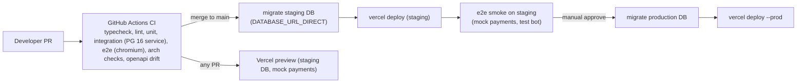

| Aspect | Decision |
|--------|----------|
| Environments | `development` (local Postgres 16 or Supabase CLI), `test` (ephemeral DB per Vitest worker), `preview` (Vercel previews → staging Supabase project, mock payments, staging bot), `production`. |
| Regions | **Decision:** Vercel functions `fra1` co-located with Supabase `eu-central-1`; re-measure RTT from Tashkent in Phase 1 against other region pairs offered by both providers and switch only before launch. |
| Migrations | Forward-only SQL in `supabase/migrations`, applied by `scripts/db/migrate.ts` (tracking table `meta.schema_migrations`). Expand → deploy → contract: a migration must be compatible with the currently running code. Production deploys are gated on a successful migration; Vercel Git auto-deploy for production is disabled and the CI job runs `vercel deploy --prebuilt --prod`. |
| Cron (Vercel, requires a plan with sub-daily crons) | `expire-payments` */10 min · `expire-sessions` hourly · `reconcile` */15 min · `ops-checks` */10 min · `integrity` daily 01:10 UTC · `question-stats` daily 02:10 UTC · `compute-benchmarks` daily 03:10 UTC · `prune` daily 04:10 UTC (rate_limits older than 1 day, expired ai_cache, expired link tokens). `dispatch-notifications` only after MVP. |
| Function limits | API default `maxDuration` 10 s; image routes and AI-triggering routes 30 s. |
| Telegram | One bot per environment; webhook set by `scripts/telegram/set-webhook.ts` with `secret_token`; Mini App URL `{APP_URL}/tma`; bot answers `/start` with the Mini App button only (no campaigns in MVP). |
| Fonts | Inter `.woff` (latin, latin-ext, cyrillic subsets; latin covers U+02BB/U+02BC; 400/700) committed under `assets/fonts/` for Satori (no woff2), included via `outputFileTracingIncludes` for image routes; web UI uses self-hosted woff2 subsets with `font-display: swap` (02 §8.1). |
| Backups | Supabase daily backups from day 1; one restore drill before launch; point-in-time recovery at the 10k stage. |
| Runtime | Node.js 22 LTS, pnpm 10 (**Decision**). |

---

## 15. Scaling path to 1M users

Design targets (planning assumptions, not measurements): MVP load test 50 answer requests/s for 10 min with p95 ≤ 400 ms
(02 §8.1); for the 1M-user stage, **100 answer submissions/s** and **20 webhook calls/s** at peak with API p95 < 300 ms
server time. Per answer: 1 locked select, 1 insert, 1 update, 1 analytics insert (~4–5 statements, bank from cache). A
completed assessment writes ~60 rows (1 session, ~12 answers, 1 result, ~10 skill scores, 9 level scores, ~20 events).

| Stage | Trigger to act (measured) | Changes |
|-------|---------------------------|---------|
| **≤ 10k users** | — | Single Supabase instance (smallest compute that keeps CPU < 60 %), Vercel, per-instance caches, Postgres rate limiter. Indexes from the data model; `EXPLAIN ANALYZE` on every hot query in Phase 9. |
| **10k → 100k** | DB CPU > 60 % sustained 1 h; `analytics_events` > 20M rows; dashboard queries > 2 s | Upgrade compute; monthly range partitioning of `analytics_events` (by `occurred_at`) with 13-month raw retention then daily aggregates; admin dashboards on materialized views refreshed by cron; PITR on; item recalibration (2PL fit offline on items with ≥ 300 responses → new question versions, new `scoring_model_version`). |
| **100k → 1M** | Rate-limit upserts or settings reads ≥ 10 % of DB time; connection saturation; notification backlog | Move rate limits + hot caches to a managed Redis; read replica for admin/analytics; queue (Postgres-based such as pgmq, or managed) for notifications and AI jobs; analytics export to a warehouse (batch); native apps launch on `/api/v1`. |
| **1M+** | Payment webhook latency or isolation needs; team growth | Optionally split webhooks + payments into a separate deployment sharing the database (module boundaries already allow it); per-country payment providers; organizations (B2B) on read replicas. The modular monolith stays the default — split only along an existing module boundary with a measured reason. |

Data-volume hygiene from day 1: `bigint identity` on `analytics_events`; bounded jsonb (`served_question_ids` ≤ 15);
`rate_limits` pruned daily; `ai_cache` expiry; card images never stored (rendered on demand, CDN-cached).

---

## 16. Localization architecture

| Layer | Mechanism |
|-------|-----------|
| Routing | next-intl, `localePrefix: 'always'` → `/uz`, `/ru`, `/en`; default `uz`. Short links `/r/{code}`, `/s/{slug}` and `/tma` have no prefix and resolve the locale with the chain below. `src/i18n/routing.ts` imports `locales.generated.ts` (generated from the message directories by `scripts/i18n/sync-locales.ts`). |
| Locale negotiation (first match) | URL prefix → `NEXT_LOCALE` cookie → `users.locale` → Telegram `language_code` if active → `Accept-Language` → otherwise `uz` with the S02 language sheet offered on S01 (02 D4). API requests use `?locale=` or `Accept-Language`, then the same chain (falling back to `uz`). |
| UI strings | `src/i18n/messages/<locale>/<namespace>.json` (ICU MessageFormat). `request.ts` deep-merges `uz` ← `en` ← requested so missing keys fall back (requested → en → uz, as the brief). Types come from the `en` namespace files. CI (`i18n:check`) fails if an **active** locale misses keys; draft locales may be partial. |
| Content (DB) | jsonb `{ "uz": …, "ru": …, "en": … }`; `localizedText(value, locale)` resolves requested → `languages.fallback_code` (if set) → `en` → `uz`; returns `{ text, locale }` so the UI can mark fallbacks. Questions activate only with uz+ru+en present (02 D5). Unknown → "Yetarli ishonchli maʼlumot mavjud emas." / "Недостаточно достоверных данных." / "Not enough reliable information.", never an invented translation. |
| Adding a locale | (1) add `src/i18n/messages/<code>/` (may start partial), (2) insert `languages` row (`is_active`, `fallback_code`, e.g. `uz-Cyrl` → `uz`), (3) translate content progressively in jsonb, (4) deploy. No code changes. |
| Formatting | Dates/numbers via `Intl` with the resolved locale; money via `formatMoney(money, locale)` using `currencies.minor_units` + per-locale templates in messages (`money.UZS = "{amount} soʻm"`), so copy like "{price}ga toʻliq natijani ochish" never hardcodes "1,000". |
| Orthography guard | `scripts/content/lint-uz.ts` rejects ASCII `'`/`’` in `uz` strings where U+02BB (oʻ, gʻ) or U+02BC (tutuq: maʼlumot, taʼlim) is required; runs on message files and content JSON. |
| Direction | `dir` derived from a static RTL list in `src/lib/i18n/direction.ts` (none of the MVP locales are RTL). |
| Images | Satori fonts cover Latin, Cyrillic, U+02BB/U+02BC; share text comes from messages, e.g. uz "Sen qaysi LEVELdasan?", ru "А какой LEVEL у тебя?", en "What's your LEVEL?". |

---

## 17. Currency, country and provider configurability

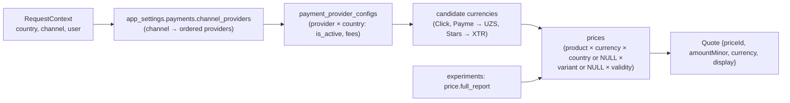

- **Country** resolution: `users.country_code` → `x-vercel-ip-country` at session bootstrap (stored once) →
  `countries.is_active` check → default `UZ`.
- **Provider availability** = provider ∈ `channel_providers[channel]` ∧ `payment_provider_configs.is_active` for
  (provider, country) ∧ adapter credentials present in env ∧ an active price row in a supported currency ∧ not `mock`
  in production. Enabling Click/Payme for `telegram` shows the admin warning from 02 §7.3 and opens checkout with
  `WebApp.openLink`.
- **Price resolution** (most specific wins; 02 §7.2): active product; `prices.is_active`; `now ∈ [valid_from, valid_to)`;
  currency ∈ provider currencies; `country_code = ctx.country` preferred over `NULL`; `experiment_variant = assigned`
  preferred over `NULL`; newest `valid_from`. No row → `PRODUCT_UNAVAILABLE`. A payment snapshots `price_id` and
  `amount_minor`.
- **Money** is `amount_minor bigint + currency char(3)`; exponent from `currencies.minor_units` (UZS 2 → 1,000 UZS =
  100000; XTR 0). Provider adapters convert units at the edge (Payme amounts in tiyin = `amount_minor`; Click amounts in
  soʻm = `amount_minor / 100`).
- **Fees**: `provider_fee_minor` computed at PAID time from the `fee_percent`/`fee_fixed_minor` snapshot and stored on
  the payment, so later config changes do not rewrite history.
- Adding a country = rows in `countries`, `prices`, `payment_provider_configs` (+ a provider adapter only if the provider
  is new). Adding a currency = a `currencies` row.

---

## 18. Data-access patterns (implementation notes)

- postgres.js singleton in `src/lib/db/client.ts`: `postgres(DATABASE_URL, { max: DATABASE_POOL_MAX, idle_timeout: 20,
  prepare: false })` (`prepare: false` is required behind the transaction-mode pooler). **Decision:** no global column
  transform; repositories map snake_case ↔ camelCase explicitly so SQL stays greppable.
- All repository functions take `(db: Sql | Tx, …)`; no repository opens its own transaction.
- Row locks: `assessment_sessions` (answer/finalize), `payments` (state transitions). No table locks.
- Every query on user-owned data filters by `user_id = canonicalUserId` server-side even though RLS exists.
- JSON columns are validated with zod on write (`report`, `teaser`, `public_payload`, `ability_state`, `config`).

---

## 19. Decision log (for cross-document alignment)

1. Rendering split: public pages = RSC + direct service calls; personal screens = client components over `/api/v1`
   (TMA iframe cookies, native parity); the server always decides teaser vs full (`access`).
2. Module tiers and allowed-dependency map (§3.4); `scoring` is a pure module with no tables; `admin` owns no tables.
3. Kernel owns `app_settings`, `audit_logs`, `rate_limits`; `catalog` owns `languages`, `countries`, `currencies`;
   `results` owns `result_feedback` (02 D2).
4. `roadmaps` owns `actions`, `do_not_rules` (library + pure planner); `results` calls the planner; `growth` creates a
   `proposed` roadmap on `result.unlocked` (02 D18) and `POST /api/v1/roadmaps {resultId, goal}` activates it (or
   creates an active one) idempotently per result.
5. `payments` owns `result_unlocks`, `entitlements`, `subscriptions`; target validation via registered resolvers
   (`targetType = 'assessment_result'`).
6. In-process post-commit domain events + reconcile cron; no outbox table in MVP; money/unlocks never via events.
7. Merge and deletion via registered user-lifecycle participants in one transaction, with the conflict rules in §3.5;
   `auth_sessions` are re-pointed on merge (02 F19).
8. Anonymous user minted lazily by the first personal API call (`POST /api/v1/session` on the first CTA/tile tap, or any
   `auth: 'ensure'` endpoint); landing hydration creates nothing, so crawlers create no users; pre-session client events
   are buffered and flushed after bootstrap. (02 D25 says "first API call"; this is the same rule made precise.)
9. Additive schema: `auth_sessions.device_hash`; identity-owned `link_tokens(id, user_id, token_hash, expires_at,
   consumed_at, consumed_by_user_id, created_at)`; `device_hash` = HMAC(`HASH_SALT`, `level_did` cookie).
10. Share cards: created/reused per toggle set; a level-bearing card requires an unlocked result, a locked result may
    share a level-less card; revoked or deleted cards answer 410 (02 AC-F15-04) and their images 404.
11. `composite_se = SE_g × 100 / 7`; teaser stores no price and no level.
12. Payment `created` = checkout issued; `pending` = provider acknowledged (Payme CreateTransaction, Click Prepare, Stars
    pre_checkout_query); no `failed → paid` path; expiry minutes per provider in `app_settings`; refunds delete the
    payment-sourced unlock in the refund transaction and revoke the result's cards (02 D15).
13. Channel → provider map in `app_settings.payments.channel_providers` (02 F09); no XTR price seeded (02 D14).
14. MVP item bank has no `open` items; AI only for narratives (cheap tier `claude-haiku-4-5`), coarse cache keys, budget
    10 % of gross, fail closed on cost.
15. No Redis in MVP; per-instance versioned caches; prices cached ≤ 60 s; ISR 300 s for public pages.
16. API: camelCase JSON; envelope `{ data }` / `{ error: { code, messageKey, message, details?, retryAfter?, requestId } }`
    (camelCase form of 02 D32); UPPER_SNAKE error codes (§5.2); 404 for non-owned resources; 410 for revoked cards;
    `Idempotency-Key` required on payments; already-unlocked responses use `{ status: 'already_unlocked' }`; cursor
    pagination; OpenAPI generated from zod; paths per §5.3.
17. Session JWT lifetime 180 days with sliding renewal; Bearer wins over cookie; Supabase Data API exposure of `public`
    disabled.
18. Vercel `fra1` + Supabase `eu-central-1`; Node 22 LTS; pnpm 10; migrations via own runner before gated prod deploy.
19. Rate-limit defaults (§6) and ops alert thresholds (§11).
20. `localePrefix: 'always'`; `/s/{slug}` rewritten (not redirected) to the localized page so link previews get 200 + OG;
    TMA bootstrap route is `/tma` (02 D25); payment return route `/{locale}/pay/return/{paymentId}`.
21. Referral codes: 8 characters, RFC 4648 base32 alphabet (fits 02 D26 grammar); share slugs: 10 lowercase base32.
22. Production guard uses `APP_ENV`, not `NODE_ENV` (Vercel previews run with `NODE_ENV=production`).
23. Analytics capture and experiment tables/`getVariant()` ship in Phase 3; dashboards and experiment management in
    Phase 7; notifications/reminders and organizations are post-launch.
24. Coverage target ≥ 90 % lines on `domain/`; source files ≤ 300 non-blank lines, functions ≤ 60 lines
    (`12-folder-structure.md` §10).
