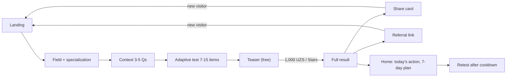

# 02 — MVP Specification

> Scope: what LEVEL ships in the first public release, how we judge it with the first 100 users, and the
> acceptance criteria each feature must pass before launch.
> Source of truth: the Engineering Decisions Brief. This document does not override it. Where the brief is
> silent, a concrete choice is made and marked **Decision:**. All of them are collected in [§11](#11-decisions-log)
> so other sections can align.
> Companion: screen-by-screen behaviour, states and copy are in [03-user-flows.md](./03-user-flows.md).

---

## 1. Product slice in one paragraph

A person opens LEVEL (responsive web or Telegram Mini App, no sign-up), picks one of 10 fields, picks a
specialization, answers 3–5 context questions and a 7–15 item adaptive test (target 12, about 3–5 minutes).
The server scores it and shows a free **teaser** (strongest skill and main blocker; LEVEL locked). For
**1,000 UZS** (or the configured Telegram Stars price) the person unlocks the **full result**: LEVEL, skill
scores, bottleneck, next-level gaps, 3 actions to do now, things not to do yet, a 7-day plan and a 30-day roadmap,
each with a "why". They can share a privacy-safe card, invite friends with a referral link, follow today's action
on a basic dashboard, and retest after a cooldown. Admins see the funnel, question health, payments and unit
economics, and can change prices and payment-provider availability without a deploy.

---

## 2. MVP goals

| ID | Goal | Measured by (see §3) |
|----|------|----------------------|
| G1 | Prove people finish a 3–5 minute adaptive assessment on a phone, on the web and in Telegram. | Completion rate, median duration |
| G2 | Prove the teaser creates enough value for a 1,000 UZS micro-payment, with no dark patterns. | Teaser→checkout, teaser→paid |
| G3 | Prove the payment rails (Click, Payme, Telegram Stars) are correct: no lost or double payments, no unlock without payment. | Integrity counters = 0, payment success rate |
| G4 | Prove the result feels accurate and useful enough to share. | Accuracy feedback, share rate |
| G5 | Get a first measurement of the viral loop (share card + referral). | Referral visits per sharer, referral conversion, K |
| G6 | Get a first signal that people come back to act on the plan. | Plan start rate, D7 return (observe only) |

Non-goals for the MVP: revenue scale, subscriptions, verified levels, B2B.

---

## 3. Success metrics for the first 100 users

### 3.1 Cohort definition

- **Cohort** = the first 100 distinct users with a server-emitted `test_started` event in production after the
  launch flag `app_settings.launch.public_at` is set.
- **Excluded**: users with `role = 'admin'`, user IDs in `app_settings.analytics.excluded_user_ids`, and any user
  whose only payments used provider `mock`.
- **Observation window**: each cohort user is observed for 14 days after their first `test_started`. The cohort
  readout happens when user #100 reaches day 14.
- **Decision:** with n ≈ 100 every rate is directional. The admin dashboard shows each rate with a 95% Wilson
  score interval whenever the denominator is below 1,000, so nobody over-reads a small sample.

### 3.2 Metric targets

**Decision:** the targets below are LEVEL's own launch hypotheses, not industry benchmarks. They are stored in
`app_settings.analytics.targets` and the alarm thresholds in `app_settings.analytics.flag_thresholds`, so product
can change them without a deploy. Every formula uses only real events from the whitelist in the brief (§11)
plus `result_feedback_submitted` (see F22).

| Metric | Formula (distinct counts unless noted) | Target | Alarm (admin flag) | Flag routes to |
|--------|----------------------------------------|--------|--------------------|----------------|
| Test start rate | users with `test_started` / users with `landing_view` | ≥ 35% | < 20% (min 50 landing users) | Landing headline/CTA |
| Completion rate | sessions with `test_completed` / sessions with `test_started` | ≥ 70% | < 60% (min 30 starts) | Questions |
| Median test duration | median(`completed_at − started_at`) over completed sessions | 3–5 min | > 6 min | Questions / question count |
| Teaser → checkout | results with ≥1 `payment_started` / results with `teaser_viewed` | ≥ 30% | < 20% (min 30 teasers) | Teaser / paywall |
| Payment success | payments with `payment_paid` / payments with `payment_started` | ≥ 85% | < 70% (min 20 payments) | Provider config |
| Teaser → paid | results with a `payment`-sourced unlock / results with `teaser_viewed` | ≥ 20% | < 10% | Teaser / paywall |
| Perceived accuracy | (`accurate` + `partly`) / all `result_feedback_submitted` | ≥ 70% | < 50% (min 20 answers) | Scoring / content |
| Share rate | users with `share_completed` / users with `result_viewed` (full) | ≥ 20% | < 15% (min 30 viewers) | Share card |
| Referral visits per sharer | `referral_started` / users with `share_completed` or a copied referral link | ≥ 2.0 | < 1.0 | Share card / loop |
| Referral conversion | referred users with `referral_completed` / referred users with `referral_started` | ≥ 30% | < 20% (min 30 visits) | Referral loop |
| Viral coefficient K | avg invites per user × invite conversion to completed (brief §10) | ≥ 0.3 | none (observe) | — |
| Plan start rate | roadmaps `proposed → active` (`roadmap_accepted`) / unlocked results | ≥ 40% | none (observe) | Result → plan |
| D7 return | cohort users with any authenticated activity on days 7–13 after first `test_started` | observe only | none | — |
| Landing TTI (lab, §8.1 profile) | p75 of CI runs | ≤ 5.0 s | > 7.0 s | Engineering |
| API 5xx rate | 5xx responses / all `/api/v1/**` responses | < 0.5% | > 1% over 1 h | Engineering |

D7 has no target because the MVP sends no reminders (out of scope, §6); we only want a baseline.

### 3.3 Integrity counters (must be exactly zero)

These are computed by a reconciliation query that runs nightly and on demand from the admin. Any non-zero
value pages the on-call engineer (admin banner + log alert).

| Counter | Definition |
|---------|------------|
| `unlock_without_payment` | `result_unlocks` with `source = 'payment'` whose `payment_id` is not `paid` (or `refunded` with the unlock still present) |
| `paid_without_unlock` | `payments.status = 'paid'` for `full_report` with no matching `result_unlocks` row |
| `double_paid_target` | more than one `paid` payment per (user, product, target) (also prevented by a partial unique index; counter catches provider-side captures that had to be refunded) |
| `amount_mismatch` | `payment_events` rejected because the provider amount differed from `payments.amount_minor` (not zero-tolerance by itself; every row needs an admin look) |
| `lost_results` | `assessment_results` whose `user_id` points to a user with `merged_into_user_id` set (merge must re-point everything) |
| `client_trusted_state` | any code path where level, score, unlock or payment status came from the client (enforced by tests, reported as 0/1 by the release checklist) |

### 3.4 What we do with the readout

| Outcome | Action |
|---------|--------|
| Completion < 60% | Review question-level drop-off (F18); cut the worst items; test `question count` experiment (target 10 vs 12). |
| Teaser → checkout < 20% | Test teaser variants (what is visible), never by adding urgency or fake scarcity. |
| Payment success < 70% | Inspect `payment_events.failure_reason` by provider and channel; switch provider order. |
| Perceived accuracy < 50% | Freeze marketing, audit scoring and content for the worst professions before growing traffic. |
| Share rate < 15% | Iterate on card templates and share entry points. |
| All green | Open the next 1,000-user stage; enable price experiments for the deep report. |

---

## 4. Users and channels

| Channel | Entry | Identity at start | Payment providers (default) |
|---------|-------|-------------------|-----------------------------|
| `web` | `/{locale}`, `/r/CODE`, `/s/SLUG`, in-app browsers (Instagram, Telegram link preview) | anonymous user + `level_session` cookie | Click, Payme |
| `telegram` | `t.me/<bot>/<app>`, `?startapp=CODE`, bot `/start` button | Telegram user (initData verified) | Telegram Stars (Click/Payme only if admin enables, §7.3) |
| `mobile` | not shipped in MVP | — | — |

Primary user types the copy is written for: early-career people choosing or changing a field, working
specialists who want to know "what is next", students (career readiness), and small-business owners.

**Decision:** the MVP assumes users may be on low-end Android phones with unstable mobile data. Every
requirement in §8 is written for that device first.

---

## 5. In-scope features and acceptance criteria

Each feature lists what it is, the rules that are easy to get wrong, and acceptance criteria (AC). AC IDs are
referenced by Playwright and vitest test names (`test("AC-F06-04 …")`). Screen IDs (S01…) refer to
[03-user-flows.md](./03-user-flows.md).

### Feature index

| ID | Feature | Modules | Screens |
|----|---------|---------|---------|
| F01 | Landing page | catalog, analytics | S01 |
| F02 | Three languages (uz default, ru, en) | i18n, catalog | all, S02 |
| F03 | 10 MVP categories | catalog | S03 |
| F04 | Profession and specialization select | catalog | S04 |
| F05 | Context questions (3–5) | assessments | S05 |
| F06 | Adaptive assessment | assessments | S06 |
| F07 | Server scoring and level assignment | scoring, results | S07 |
| F08 | Teaser result | results | S08 |
| F09 | 1,000 UZS payment unlock | payments, pricing | S09 |
| F10 | Full result page | results | S10 |
| F11 | Skill scores | results | S10 |
| F12 | Next level and what is missing | results | S10 |
| F13 | 3 actions now + not-now rules | results, roadmaps | S10 |
| F14 | 7-day plan + 30-day roadmap | roadmaps | S10, S15 |
| F15 | Share card | sharing | S11, S12 |
| F16 | Referral link and rewards | referrals | S13 |
| F17 | Basic user dashboard (home), history, retest | growth, assessments | S15–S17 |
| F18 | Admin analytics and configuration | admin, analytics, pricing | admin |
| F19 | Anonymous identity, optional account linking, data deletion | identity | S14, account |
| F20 | Telegram Mini App shell | identity, ui | all (TMA) |
| F21 | Analytics event pipeline | analytics | all |
| F22 | Result accuracy feedback | results, analytics | S10 |

---

### F01 — Landing page

Hero: "Sen oʻz sohangda qaysi LEVELdasan?", sub "3 daqiqada aniqlang: hozir qayerdasiz, sizni nima toʻxtatib
turibdi va keyingi qadam qanday.", CTA **LEVELIMNI ANIQLASH**. Below the fold: how it works (3 steps), the 10
fields as tappable tiles (tap skips S03 and goes to S04), trust strip, footer with disclaimers and links.

Rules:
- Landing HTML is static and cacheable (no per-user data in the server render). Personal bits (resume banner,
  "your result" link) hydrate client-side after `POST /api/v1/session`.
- **Decision:** the price is disclosed on the landing under the CTA ("Test va qisqa natija bepul · Toʻliq natija —
  1,000 soʻm", amount read from the active price row at build/revalidate time, ISR revalidate 300 s). Users must
  know before they start that the full result is paid.
- **Decision:** the "3 daqiqada" claim must match reality: if the measured median duration (§3.2) exceeds 4 min
  for 7 consecutive days, the headline experiment switches the sub copy to "3–5 daqiqada".
- In TMA the CTA is the Telegram MainButton; the in-page CTA is hidden.

AC:
- **AC-F01-01** Landing renders hero, sub, CTA, price note, 3 steps, 10 field tiles, trust strip and footer in
  uz/ru/en with no missing message keys.
- **AC-F01-02** Tapping the CTA goes to S03 (or S02 when the locale was never chosen nor detected, see F02);
  tapping a field tile goes straight to S04 for that field.
- **AC-F01-03** If the user has an `in_progress` assessment, a resume banner shows profession and "n / total",
  with "Davom etish" (resume at the pending question) and "Yangidan boshlash" (marks the old session `abandoned`).
- **AC-F01-04** `landing_view` fires once per page view with `channel`, `locale`, `referral_code` (if any) and UTM
  fields in `properties`.
- **AC-F01-05** No countdowns, "N people are taking the test now", or percentiles appear anywhere on the page.
- **AC-F01-06** Meets the landing performance budget in §8.1.

### F02 — Three languages

Rules:
- Locale-prefixed routes `/uz`, `/ru`, `/en` (next-intl, default `uz`). Short links `/r/CODE` and `/s/SLUG` have no
  prefix and resolve the locale.
- Locale resolution order: explicit choice (cookie `NEXT_LOCALE` + `users.locale`) → Telegram `language_code`
  (`uz`, `ru`, `en` only) → `Accept-Language` best match among uz/ru/en → none.
- **Decision:** S02 (language select) is shown only when resolution returned "none"; otherwise the language pill
  in the header (UZ · RU · EN) is the language switch. This avoids an extra step for most users while still
  letting everyone switch at any time.
- Content (questions, options, skills, levels, actions) comes from jsonb `{uz, ru, en}` with fallback requested →
  en → uz (brief §1).
- **Decision:** a question cannot be set to `status = 'active'` unless `prompt` and every option `label` have
  non-empty `uz`, `ru` and `en`. Enforced by a DB CHECK-trigger and by the content seed validator. So the fallback
  chain is a safety net, not a content strategy.
- Switching language mid-test re-renders the pending question in the new locale; scoring is unaffected.
  `assessment_sessions.locale` keeps the start locale.
- Uzbek copy uses U+02BB (ʻ) and U+02BC (ʼ) only; a CI lint fails on ASCII `'`, U+2018 or U+2019 inside `uz`
  message values.
- **Decision:** UZS amounts are formatted per locale by a custom formatter: uz `1,000 soʻm` (comma grouping, as
  in the brief's copy), ru `1 000 сум` (narrow no-break space), en `1,000 UZS`. Stars: `{n} Stars` in all locales.

AC:
- **AC-F02-01** Every message key exists in uz, ru and en (CI script compares key sets; build fails on diff).
- **AC-F02-02** CI lint finds zero ASCII apostrophes or U+2018/U+2019 in Uzbek message values.
- **AC-F02-03** Switching language on any screen keeps the user on the same screen and state (same pending
  question, same result) and persists the choice to cookie and `users.locale`.
- **AC-F02-04** Russian strings that are up to 40% longer than Uzbek wrap without clipping on a 320 px wide
  viewport (Playwright screenshot test per key screen).
- **AC-F02-05** Share cards and OG images render ʻ, ʼ and Cyrillic glyphs (no tofu) — snapshot test.

### F03 — 10 MVP categories

**Decision:** in the MVP each category contains exactly one active profession (the 10 professions of brief §13).
The category screen exists so the catalog can grow to many professions per category without a UI change.

| sort | category slug | Category (uz / ru / en) | profession slug | Profession (uz) | `is_regulated` |
|------|---------------|-------------------------|-----------------|-----------------|----------------|
| 1 | `business` | Tadbirkorlik / Предпринимательство / Entrepreneurship | `entrepreneur` | Tadbirkor | false |
| 2 | `it` | IT va dasturlash / IT и разработка / IT & software | `software_developer` | Dasturchi | false |
| 3 | `sales` | Savdo / Продажи / Sales | `sales_specialist` | Sotuv mutaxassisi | false |
| 4 | `marketing` | Marketing / Маркетинг / Marketing | `marketing` | Marketolog | false |
| 5 | `management` | Boshqaruv / Менеджмент / Management | `manager` | Menejer | false |
| 6 | `accounting` | Buxgalteriya / Бухгалтерия / Accounting | `accountant` | Buxgalter | **true** (financial) |
| 7 | `design` | Dizayn / Дизайн / Design | `designer` | Dizayner | false |
| 8 | `students` | Talaba va karyera / Студенты и карьера / Students & career | `career_readiness` | Karyeraga tayyorlik | false |
| 9 | `education` | Taʼlim / Образование / Education | `teacher` | Oʻqituvchi | false |
| 10 | `driving` | Haydovchilik / Вождение / Driving | `driving_instructor` | Haydovchilik yoʻriqchisi | **true** (road safety, state licensing) |

**Decision:** `accountant` and `driving_instructor` are `is_regulated = true` with disclaimers (copy in
03-user-flows §S04). The content section must seed these flags and disclaimers.

AC:
- **AC-F03-01** Exactly the categories with `is_active = true AND is_mvp = true` show, ordered by `sort_order`,
  as a 2-column grid of tiles (icon + name), each ≥ 48 px tall touch target.
- **AC-F03-02** One tap selects and advances (no confirm button); `category_selected` fires.
- **AC-F03-03** When a category has one active profession, its specialization step (S04) is shown directly;
  when it has more than one, S04 first lists professions.
- **AC-F03-04** An inactive or unknown category slug in the URL shows the category grid with a non-blocking toast,
  not a 404.

### F04 — Profession and specialization select

Rules:
- Specializations are listed as large radio cards plus **"Umumiy (yoʻnalishsiz)"** which sets
  `specialization_id = NULL`.
- **Decision:** non-regulated professions with zero active specializations skip this screen entirely; regulated
  professions always show it (as a short intro with a *Boshlash* button) so the disclaimer is seen before the test.
- Regulated professions show their `disclaimer` inline on this screen, before any question.

AC:
- **AC-F04-01** Tapping a card highlights it and advances after 250 ms; `profession_selected` fires with
  `profession_id` and `specialization_id`.
- **AC-F04-02** Regulated professions display the disclaimer block above the list in the current locale.
- **AC-F04-03** Back returns to S03 with the previous selection remembered.

### F05 — Context questions

Default set (template `context_questions`, brief §6; copy in 03 §S05):

| key | Question (uz) | Values | Stored in |
|-----|---------------|--------|-----------|
| `experience` | Bu sohada qancha tajribangiz bor? | `0`, `lt1`, `1to3`, `3to5`, `5plus` | session.context; prior μ0; experience caps |
| `working` | Hozir bu sohada ishlayapsizmi? | `yes`, `no`, `learning` | session.context |
| `goal` | Asosiy maqsadingiz qanday? | `start`, `find_job`, `professional`, `increase_income`, `lead`, `expert` | session.context; goals; importance adjustment |
| `time_per_day` | Rivojlanish uchun kuniga qancha vaqt ajrata olasiz? | `10`, `20`, `30`, `60` (minutes) | session.context; `profiles.time_per_day_minutes` |
| (optional 5th) | profession-specific, defined in the template | 2–6 options | session.context |

Rules:
- **Decision:** `time_per_day` is always asked because the 7-day plan must respect it (brief §8). That makes
  4 default questions; a template may add one profession-specific question (max 5 total).
- **Decision:** context answers live client-side (memory + `sessionStorage`) until the last one; the assessment
  session is created by `POST /api/v1/assessments` with the full context, because the prior μ0 needs `experience`
  before the first item is chosen. Back navigation inside context is allowed.
- **Decision:** context questions may have up to 6 options (the `goal` enum has 6); test items keep 2–5.
- Templates may hide or relabel goal options per profession (e.g. entrepreneur hides `find_job`).

AC:
- **AC-F05-01** One question per screen, auto-advance on tap, step indicator "1 / 4".
- **AC-F05-02** Reload mid-context restores answered context steps from `sessionStorage`.
- **AC-F05-03** Completing the last question fires `context_completed` (client) and creates the session; the
  server emits `test_started` and returns the first item in the same response.
- **AC-F05-04** A retest pre-fills context from the previous session; the user confirms or edits.

### F06 — Adaptive assessment

Behaviour follows brief §6 exactly (IRT 2PL with guessing, EAP, coverage → precision, randomesque, stop rules,
≤ 2 self-report, ≥ 2 scenario/judgment/decision). UI rules:

- One question per screen; 2–5 big options; no correct/incorrect feedback; no visible timer.
- **Decision:** auto-advance uses a commit delay of 400 ms (`app_settings.ui.answer_commit_delay_ms`): tapping a
  different option during the delay changes the selection; after the delay the answer is submitted. There is no
  "previous question" (adaptive items cannot be re-answered).
- Progress shows "n / D". **Decision:** D starts at `professions.config.target_questions` (default 12). If the
  engine continues past 12, D becomes `max_questions` (15) and the screen shows "Aniqroq natija uchun yana bir
  nechta savol" once. If the engine stops early, the bar fills to 100% on the computing screen. The bar never
  shows n > D.
- Resume after reload: the server stores `pending_question_id`; `GET /api/v1/assessments/{id}` returns the same
  pending item, never a newly selected one.
- **Decision:** an `in_progress` session with no activity for 24 h (`app_settings.assessment.session_ttl_hours`)
  becomes `expired`; starting a different profession while one is in progress marks the old one `abandoned` after
  confirmation.
- **Decision:** the MVP test serves no `open` (AI-scored) items. The core path makes zero AI calls.
- **Decision:** no "I don't know" option in the MVP; it would break the guessing parameter c = 1/num_options.
  Hint copy on the first item asks for the best guess instead.

AC:
- **AC-F06-01** Each answer is sent as `{question_id, sequence, option_key}`; the response contains the next item
  or `{completed: true, result_id}`.
- **AC-F06-02** Double submit (same `sequence`) is idempotent: the server returns the current state, no second
  answer row (unique(session_id, sequence)).
- **AC-F06-03** Reloading at item 7 shows item 7 (same `question_id`, same option order) with "7 / 12".
- **AC-F06-04** The client never receives option scores, item parameters, θ or SE (response schema test).
- **AC-F06-05** Stop rule: n ≥ 7 AND coverage done AND SE_g ≤ 0.45, or n = 15 (unit test on the engine; e2e with
  seeded bank).
- **AC-F06-06** Same session seed + same answers ⇒ same item sequence (reproducibility test).
- **AC-F06-07** With the AI provider forced to fail, a full test completes and produces a result.
- **AC-F06-08** `question_answered` (server) carries `sequence`, `question_id`, `question_version`, `response_ms`
  (server-measured), never the credit.
- **AC-F06-09** Network failure on submit retries 3 times (1 s, 2 s, 4 s) keeping the selection, then shows the
  offline banner with manual retry.

### F07 — Server scoring and level assignment

Exactly as brief §6–§7 (`irt2pl-eap-hier-v1`, default 9 levels, caps, confidence, range near boundaries).

AC:
- **AC-F07-01** Re-running scoring from stored answers + stored `question_versions` reproduces identical
  `composite_score`, `theta`, `assessed_level`, skill scores and confidence (golden-file test per profession).
- **AC-F07-02** Levels with `requires_verification` (8, 9) are never assessed; the maximum assessed level is the
  highest non-verification level (7 by default).
- **AC-F07-03** Experience caps apply (e.g. `{"0": 4, "lt1": 5}`) and the cap is recorded in
  `confidence_reasons`/report so the UI can explain it.
- **AC-F07-04** Speeding (< 2.5 s on > 30% of items) or self-report inconsistency (> 0.45) downgrades confidence
  one step and lists the reason.
- **AC-F07-05** The result is computed synchronously inside the final answer request (target p95 ≤ 400 ms server
  time) and `test_completed` is emitted by the server.
- **AC-F07-06** `assessment_results` stores `assessment_version`, `scoring_model_version`, `question_versions`,
  `teaser` and the deterministic `report`.

### F08 — Teaser result

Exact layout and copy in 03 §S08. Content = brief §8: "Natijangiz tayyor", strongest skill name, main blocker
(bottleneck skill name), LEVEL locked, skill detail locked, roadmap locked, CTA "1,000 soʻmga toʻliq natijani
ochish" (amount from the price row).

Rules:
- The teaser API returns only `assessment_results.teaser`; locked sections are static placeholders. **Decision:**
  no real value (level, scores, plan) is ever sent to the client before unlock, not even blurred.
- **Decision:** when no skill is in the `weak` band, the "main blocker" slot shows the lowest-scored skill labelled
  "Eng past koʻrsatkich"; when the strongest skill is not in the `strong` band it is labelled "Nisbatan kuchli
  tomoningiz" (relatively strongest). The teaser never overstates.
- The teaser states that the payment is one-time and that the result is saved (no urgency).

AC:
- **AC-F08-01** Network inspection of the teaser response and HTML shows no level number, level name, skill score
  or roadmap content.
- **AC-F08-02** CTA text and amount come from `GET /api/v1/payments/options` for the user's channel and country.
- **AC-F08-03** `teaser_viewed` fires once per result per day.
- **AC-F08-04** If the result is already unlocked, the teaser route redirects to the full result.
- **AC-F08-05** If no provider is available, the CTA is replaced by the "payment unavailable" state; the result
  stays saved.

### F09 — Payment: 1,000 UZS unlock

Product `full_report`, target `assessment_result`. Providers: Click and Payme (web), Telegram Stars (TMA),
`mock` in dev/test only. Server rules per brief §9. UI states in 03 §S09.

Rules:
- Amount is always the server price row (`prices.amount_minor`, UZS 100000 minor = 1,000 UZS).
- Client sends `Idempotency-Key` (UUIDv4 generated when the pay sheet opens, kept in `sessionStorage` per
  (result, provider)); the server reuses the open payment for the same (user, product, target, provider) and
  returns `{status: "unlocked"}` if the target is already unlocked.
- The return URL (`/{locale}/pay/{paymentId}`) never trusts query parameters; it polls
  `GET /api/v1/payments/{id}`.
- Provider pre-checks (Click Prepare, Payme `CheckPerformTransaction`, Stars `pre_checkout_query`) reject when
  the target is already unlocked, so a second provider cannot capture money for the same result.
- `paid` transition + `result_unlocks` insert in one DB transaction; unlock idempotent.
- **Decision:** a refund (admin-initiated, `paid → refunded`) deletes the `payment`-sourced unlock for that payment
  in the same transaction (audit-logged) and revokes referral counting (brief §10). The result returns to teaser
  state; share cards for it are revoked.
- **Decision:** default channel → provider map lives in `app_settings.payments.channel_providers`
  (`{"web": ["click","payme"], "telegram": ["telegram_stars"], "mobile": []}`); array order is display order. A
  provider is offered only if it is in that list for the channel, its `payment_provider_configs` row is active for
  the user's country, and an active price row exists in a currency it supports (Click/Payme → UZS,
  Stars → XTR).
- **Decision:** no XTR price is seeded. Until an admin creates an active XTR price row for `full_report`, Stars is
  not offered (the TMA then shows "payment unavailable" unless Click/Payme are enabled for `telegram`). This avoids
  inventing an exchange rate.

AC:
- **AC-F09-01** Happy path web (Click and Payme sandbox) and TMA (Stars test environment): pay → return →
  full result visible within 5 s of the provider confirmation; `payment_started` and `payment_paid` recorded.
- **AC-F09-02** Replaying the same provider callback produces `payment_events.outcome = 'duplicate'` and no state
  change.
- **AC-F09-03** A callback with a different amount is rejected (`amount_mismatch`), payment stays unpaid.
- **AC-F09-04** Tapping the CTA twice quickly creates one payment (idempotency key + reuse rule).
- **AC-F09-05** Opening checkout for an already-unlocked result returns `unlocked` and navigates to the full result.
- **AC-F09-06** Stars `openInvoice` callback `cancelled` returns to the teaser with a toast; `failed` shows the
  failure state; `paid` shows "checking" until the server says `paid` (client status is never trusted).
- **AC-F09-07** If confirmation takes > 5 min, the slow state appears; when the payment later becomes `paid` the
  result is unlocked on the next visit without any user action.
- **AC-F09-08** `mock` provider is unavailable when `NODE_ENV=production` (startup assertion + test).
- **AC-F09-09** Unit economics per payment are computable: gross, provider fee, AI cost, infra estimate, referral
  reward cost, net (admin view, F18).

### F10 — Full result page

Section order is fixed (03 §S10): level badge → level name → short explanation → "Qayerdasiz?" → skill bars →
strongest → lowest → bottleneck → next level → what is missing → do now → not now → 7-day plan → 30-day roadmap →
why this → share. Footer: disclaimers, accuracy feedback (F22), account-linking card (anonymous web users).

Rules:
- Badge shows `LEVEL n` + "BAHOLANGAN" (assessed). **Decision:** when the brief's boundary rule produces a range,
  the badge keeps the single assessed level and a line below reads "Ehtimoliy oraliq: LEVEL 4–5". Share cards use
  the single assessed level.
- Confidence line uses the brief copy: "Bu dastlabki baholash. Level 4 natijangiz Medium Confidence. Real amaliy
  topshiriq orqali aniqlikni oshirish mumkin."
- "Level is not human value" and "educational, not a certificate" disclaimers always render; regulated
  professions add their disclaimer.
- Percentile line appears only if a `benchmarks` row exists with `sample_size ≥ app_settings.benchmark_min_sample`
  (default 1000), and it shows n and the window. Otherwise nothing (no placeholder).
- AI narrative (`ai_report`) is optional and never blocks render. **Decision:** when present it appears as an
  extra paragraph in "Qayerdasiz?" with the label "Bu izoh AI yordamida yozilgan va natija ballariga taʼsir
  qilmaydi." It is generated in the session locale only; in other locales it is hidden.

AC:
- **AC-F10-01** All 16 sections render in the given order for every seeded profession golden result.
- **AC-F10-02** The page is reachable only by the owner with an unlock (server check + RLS). Another user gets the
  "not yours" state (403) that reveals nothing about the result; the owner without an unlock gets the teaser.
- **AC-F10-03** `result_viewed` (server) fires on first full view per result.
- **AC-F10-04** Every recommendation has a "why" with reason, sources (verified only), limitation and confidence;
  when no source exists it shows "Yetarli ishonchli maʼlumot mavjud emas." (and ru/en equivalents).
- **AC-F10-05** No percentile is displayed when the benchmark sample is below the threshold (test with 999 and
  1000).
- **AC-F10-06** With the AI provider down, the page is complete and identical except for the optional AI paragraph.

### F11 — Skill scores

Rules: one bar per profession skill, score 0–100 with the number printed, band label (Kuchli / Meʼyorda / Eʼtibor
kerak per brief §8 bands), a tick for the next-level threshold when a `skill_min` requirement exists, and
"Bevosita oʻlchanmagan" for skills with no items. **Decision:** bars are sorted by score descending; the
bottleneck bar carries a "Asosiy toʻsiq" tag.

AC:
- **AC-F11-01** Each bar exposes `role="meter"` with `aria-valuenow`, min 0, max 100 and an accessible label.
- **AC-F11-02** Band is conveyed by text and color, never color alone.
- **AC-F11-03** Unmeasured skills (θ_s = θ_g) are labelled and excluded from "strongest".

### F12 — Next level and what is missing

Rules: show L+1 name, the composite gap ("Umumiy ball: 41 / 45"), and each L+1 requirement with current vs
threshold and met flag. If L+1 requires verification, show "LEVEL 8 faqat amaliy tasdiqlash orqali beriladi. Bu
imkoniyat hozircha mavjud emas." If an experience cap applies, explain the cap. "What is missing" lists unmet
requirements ordered by leverage (brief §8), max 3, in plain words.

AC:
- **AC-F12-01** Requirement rows match `level_requirements` for L+1 with correct met flags (unit test).
- **AC-F12-02** Capped results show the cap explanation; verification-only next levels show the unavailable note.

### F13 — Three actions now + not-now rules

AC:
- **AC-F13-01** Exactly 3 actions (fewer only if the action library has fewer matching; then the gap is logged as a
  content issue), each with title, duration (5–30 min), skill, and why.
- **AC-F13-02** 1–3 "not now" items from `do_not_rules` whose conditions match; zero is allowed and the section
  then shows "Hozircha cheklov yoʻq" rather than invented advice.
- **AC-F13-03** Learning resources appear only if `verification_status = 'verified'`; no invented URLs or books.

### F14 — 7-day plan + 30-day roadmap

Rules (brief §8): one main action per day, 5–30 min, respecting `time_per_day`; W1 foundation, W2 practice,
W3 real application, W4 verification.

- **Decision:** the roadmap is created at unlock with `status = 'proposed'`; "Rejani boshlash" sets it `active`
  (`roadmap_accepted`), `started_at = now()`.
- **Decision:** MVP roadmap items = days 1–7 as daily items (`day_number` 1..7, `is_main` true for one per day,
  up to 2 optional per day) + weeks 2–4 as one milestone item each (`week_number` 2..4, `day_number` NULL).
  Daily tracking beyond day 7 is Growth OS (out of scope).
- **Decision:** pacing is sequence-based, not calendar-punishing: "today's main action" is the earliest pending
  main item with `day_number ≤ current_day`; missed days are never shown as failures and there are no streaks.
- Main action duration ≤ `time_per_day_minutes` (if 60, cap main at 30 and fill optionals).

AC:
- **AC-F14-01** 7 daily main items exist and each duration ≤ min(30, time_per_day).
- **AC-F14-02** W2–W4 milestones exist with phase labels.
- **AC-F14-03** Mark done/skip fires `action_completed`/`action_skipped`, persists `action_results`, idempotent.

### F15 — Share card

Templates: story 1080×1920, square 1080×1080, telegram 1080×1350, og 1200×630 (brief §10). Card payload only
from `share_cards.public_payload`: LEVEL logo, optional first name (default **off**), profession, `LEVEL n · name`,
"BAHOLANGAN" micro-label, strongest skill (toggle, default on), next target (toggle, default on), short link + QR,
"Sen qaysi LEVELdasan?".

Rules:
- Sharing requires an unlocked result (the card shows the level).
- **Decision:** the `share_cards` row is created (or reused for the same toggle set + display name) as soon as the
  share-screen preview for a toggle set settles (debounce 600 ms), and the preview is that card's own image. This
  keeps every share action synchronous inside the tap handler (Web Share / Safari require the user gesture) with
  the slug and PNG already loaded. Unshared rows expose only `public_payload` behind an unguessable slug.
- **Decision:** the share link is `/s/{slug}`; visits to it attribute to the card owner's referral code, so the
  share loop and the referral loop are one loop.
- **Decision:** the card carries an "ASSESSED / BAHOLANGAN" micro-label so nobody mistakes it for a verified
  credential.
- Weakness, bottleneck, scores, salary and any private data are never on the card.

AC:
- **AC-F15-01** `public_payload` JSON schema allows only the fields above (zod schema test; extra keys rejected).
- **AC-F15-02** Name is off by default; turning it on uses `profiles.first_name` or a typed name (≤ 20 chars,
  letters/space/hyphen/ʻ/ʼ).
- **AC-F15-03** All 4 templates render in < 1.5 s p95 server time and are cached by `(slug, template, locale,
  updated_at)`.
- **AC-F15-04** `/s/{slug}` has OG/Twitter meta with the og template and the brief's title format; revoked cards
  return 410 with a start CTA.
- **AC-F15-05** `share_clicked`, `share_completed` (best-effort: native share resolved / Telegram share callback /
  download done) and `share_card_viewed` (public page view) are recorded.

### F16 — Referral link and rewards

Rules (brief §10): one code per user (base32), `/r/CODE`, `t.me/<bot>/<app>?startapp=CODE`; first-touch;
statuses invited → started → completed → paid; invalid for self-referral (same user, telegram id, device hash,
merged identity); rewards from `referral_reward_rules`, idempotent grants, refunds revoke counting.

- **Decision:** `/r/CODE` sets a first-touch cookie `level_ref` (30 days, httpOnly, SameSite=Lax, value = code,
  never overwritten while present) and redirects to `/{locale}`; `/s/{slug}` sets the same cookie to the card
  owner's code; the `referrals` row (`invited`) and `referral_started` are written when the anonymous
  user is created by the first API call. Link-preview crawlers (no JS) therefore create no users or referrals.
- **Decision:** attribution counts only for users who had no assessment session before the referral visit.
- **Decision:** MVP active reward rule: 3 valid `completed` referrals → 1 `retest` entitlement (skips the retest
  cooldown once). The referral screen renders only active rules. An admin cannot activate a rule whose entitlement
  is not consumable in the current release (admin validation: `deep_analysis` and `verification_attempt` are
  blocked while those features are off).
- **Decision:** no reward for the referred user in the MVP (one-sided), and the referred user never sees the
  referrer's identity unless they arrived via a share card that showed a name.

AC:
- **AC-F16-01** A user has exactly one code; the screen shows web and Telegram links with copy/share buttons.
- **AC-F16-02** Status counters (visited, started, completed, paid) show counts only, no names or IDs.
- **AC-F16-03** Self-referral cases (same user, same telegram id, same device hash, merged) are stored with
  `is_valid = false` and excluded from counters and rewards.
- **AC-F16-04** Reaching the threshold grants the entitlement exactly once even under concurrent completions
  (unique(user_id, rule_id) test).
- **AC-F16-05** Refund of a referred user's payment decrements the "paid" counter.

### F17 — Basic user dashboard (home), history, retest

Home (`/{locale}/home`): assessed level, next level, progress bar, today's ONE main action + up to 2 optional,
main gap (bottleneck), next assessment date, roadmap strip. History (`/{locale}/history`): timeline of results and
milestones. Retest: cooldown per profession (`retest_cooldown_days`, default 14) unless a `retest` entitlement.

- **Decision:** progress bar = `(composite − min_composite(L)) / (min_composite(L+1) − min_composite(L))`,
  clamped 0–1, labelled with the raw numbers ("41 / 45") and the count of unmet L+1 requirements. The bar only
  moves on a new result; completing actions does not move it (copy says so).
- **Decision:** a retest result follows the same teaser → 1,000 UZS unlock as any result (one payment per result);
  the `retest` entitlement only skips the cooldown. Growth OS will later bundle unlocks.
- **Decision:** home uses the latest *unlocked* result for that profession; a newer locked result shows a banner
  "Yangi natijangiz ochilishini kutmoqda" with the unlock CTA.
- **Decision:** a bottom navigation with three tabs (Bosh sahifa, Tarix, Taklif) appears only for users with at
  least one completed result, and is hidden whenever the TMA MainButton is visible.
- The VERIFIED badge slot is hidden while verification is off (feature flag `features.verification = false`).

AC:
- **AC-F17-01** Home empty, locked, proposed-plan, active-plan and plan-done states render per 03 §S15.
- **AC-F17-02** Retest during cooldown is blocked server-side (409 `retest_cooldown`) and the UI shows the date;
  with an entitlement, the entitlement is consumed atomically at session creation.
- **AC-F17-03** Retest prefers unseen items (bank permitting) and links `retest_of_session_id`; `retest_started`
  fires.
- **AC-F17-04** The full result of a retest shows per-skill deltas vs the previous unlocked result of the same
  profession; level-down copy is neutral (no shame).
- **AC-F17-05** History lists results newest first, 20 per page, locked ones with an unlock CTA.

### F18 — Admin analytics and configuration

Admin is `/admin/**`, separate layout, `users.role = 'admin'` checked server-side, bootstrap login with
`ADMIN_PASSWORD` (rate-limited, constant-time compare). All mutations write `audit_logs`.

| Admin screen | Content |
|--------------|---------|
| Overview | First-100 cohort panel (§3.2 table with Wilson intervals), integrity counters (§3.3), active flags |
| Funnel | landing → language → category → profession → context → started → completed → teaser → payment_started → paid → result_viewed → share → referral; filters: date range, channel, locale, profession, experiment variant |
| Questions | per item: serves, drop-off rate (sessions abandoned/expired on this pending item ÷ serves), median `response_ms`, option distribution, credit mean, flagged status; actions: flag, retire |
| Payments | list with status, provider, amount, fee, failure reason, events timeline; CSV export; manual "mark refunded" (after the refund is done in the provider cabinet); manual unlock grant with reason (source `admin`) |
| Unit economics | per payment and aggregated: gross, provider fee, AI cost, infra estimate, referral reward cost, net |
| Growth loops | share rate, card template usage, referral funnel, K, rewards granted |
| Experiments | variants, assignment counts, primary metric per variant with intervals; start/stop |
| Settings | prices (per product, currency, country, experiment variant, validity), product active flags, provider configs, channel→provider map, `benchmark_min_sample`, flag thresholds, targets, retest cooldown default, session TTL, commit delay, support contact |

Rules:
- **Decision:** per-question auto-suggested flags (admin confirms): drop-off > 10% with ≥ 20 serves; median
  response > 60 s; one option chosen > 90% with ≥ 50 serves; an option never chosen with ≥ 50 serves.
- **Decision:** funnel flags need a minimum denominator (values in §3.2) before they fire, to avoid noise.
- Admin never sees raw IP/UA (hashes only) and sees no phone numbers in lists (masked `+998 •• ••• •• 12`).

AC:
- **AC-F18-01** Funnel numbers equal direct SQL over `analytics_events` for the same filters (integration test).
- **AC-F18-02** Changing the `full_report` UZS price changes the teaser CTA within 60 s (cache TTL) and never
  changes the amount of an already-created payment.
- **AC-F18-03** Disabling a provider for a channel removes it from the pay sheet for new payments only.
- **AC-F18-04** Every admin mutation creates an `audit_logs` row with before/after.
- **AC-F18-05** Non-admin sessions get 404 on `/admin/**` and 403 on `/api/v1/admin/**`.

### F19 — Anonymous identity, optional account linking, data deletion

Rules: brief §3. No login wall anywhere. Linking options: Telegram (web → TMA via link token) and phone (web:
Supabase Auth OTP; TMA users are already identified by Telegram).

- **Decision:** the anonymous user + session is minted by the first API call (`POST /api/v1/session` on landing
  hydration, or implicitly by any mutating endpoint); static pages create nothing, so crawlers create no users.
- **Decision:** in the Telegram channel the client authenticates with `POST /api/v1/auth/telegram {initData}` and
  uses the returned session token as `Authorization: Bearer` (kept in memory + `sessionStorage`). Reason: Telegram
  Web clients embed the Mini App in a cross-site iframe where a SameSite=Lax cookie is not sent.
- **Decision:** web → Telegram linking uses a one-time link token (10 min TTL, single use) passed as
  `startapp=lk_<token>`; when the TMA consumes it, the anonymous web user is merged into the Telegram user (or
  upgraded in place if no user with that Telegram id exists). Because merge re-points `auth_sessions`, the web
  cookie keeps working and now resolves to the merged user.
- **Decision:** `start_param` grammar: `^[A-Z2-7]{6,12}$` = referral code; `^lk_[A-Za-z0-9]{20,40}$` = link token;
  anything else is ignored (logged as `invalid_start_param`).
- **Decision:** merging two already-identified users (both non-anonymous with results) is out of scope; the UI
  explains and points to support; nothing is deleted.
- **Decision:** "Maʼlumotlarimni oʻchirish" (account screen) is in scope: it sets `users.deleted_at`, revokes all
  share cards, deactivates the referral code, ends sessions, and anonymizes profile fields; payments are retained
  for accounting with the user link kept only as an opaque ID. Hard purge jobs are out of scope.

AC:
- **AC-F19-01** A user can go from landing to share without ever entering a phone, email or Telegram account
  (web e2e).
- **AC-F19-02** Linking (Telegram or phone) after paying keeps all results, unlocks, payments, share cards and
  referrals visible under the merged user (`lost_results = 0`).
- **AC-F19-03** initData older than 24 h or with a bad hash is rejected (401) with constant-time compare.
- **AC-F19-04** Link tokens are single-use and expire after 10 min.
- **AC-F19-05** Deletion request leaves no public share page reachable (410) and logs an audit row.

### F20 — Telegram Mini App shell

Rules (detail in 03 §0.6): `WebApp.ready()`, `expand()`, theme params → CSS tokens, safe-area insets, BackButton
and MainButton per screen, haptics map, `disableVerticalSwipes()` during the test, closing confirmation only while
a payment is being confirmed, `openInvoice` for Stars, `openLink`/`openTelegramLink` for external and t.me links,
`shareMessage` / `shareToStory` / `downloadFile` gated by `isVersionAtLeast`.

- **Decision:** `telegram-web-app.js` is loaded only when an inline detector finds Telegram launch parameters
  (URL hash `tgWebAppData` or `tgWebAppPlatform`, `sessionStorage['__telegram__initParams']`, or
  `window.TelegramWebviewProxy`). Plain web visitors never download it.
- **Decision:** the bot's Mini App URL is `https://<host>/tma`, a tiny bootstrap route that authenticates and then
  routes into the normal locale routes.

AC:
- **AC-F20-01** In Telegram iOS, Android and Desktop clients the full golden path works with native BackButton and
  MainButton (manual test matrix before launch; Playwright covers the bootstrap with a signed fake initData).
- **AC-F20-02** Theme follows Telegram light/dark and updates on `themeChanged` without reload.
- **AC-F20-03** No content is hidden under notches or Telegram header in fullscreen-capable clients (safe-area
  insets applied).
- **AC-F20-04** Features absent in older clients degrade (e.g. no `shareToStory` → story template offers
  download/send instead).

### F21 — Analytics event pipeline

AC:
- **AC-F21-01** `POST /api/v1/events` accepts only whitelisted client-side names, max 20 events per request, max
  2 KB `properties` each, rate-limited; unknown names → 400.
- **AC-F21-02** **Decision:** `POST /api/v1/events` accepts only `landing_view`, `language_selected`,
  `category_selected`, `profession_selected`, `context_completed`, `roadmap_opened` (session optional; it never
  creates users). `share_clicked` and `share_completed` are reported through `POST /api/v1/share-cards/{id}/events`,
  which checks card ownership and records both `share_events` and the analytics event. Every other event
  (`test_started`, `question_answered`, `test_completed`, `teaser_viewed`, `payment_started`, `payment_paid`,
  `payment_failed`, `result_viewed`, `share_card_viewed`, `referral_started`, `referral_completed`,
  `referral_paid`, `roadmap_accepted`, `action_completed`, `action_skipped`, `retest_started`, `account_linked`,
  `result_feedback_submitted`) is emitted only by the server; client attempts are rejected with 400.
- **AC-F21-03** Each event carries `channel`, `locale`, `country_code`, `experiment_variants`, and no PII.

### F22 — Result accuracy feedback

**Decision:** a one-tap question at the end of the full result: "Natija sizga qanchalik toʻgʻri tuyuldi?"
(Toʻgʻri / Qisman / Notoʻgʻri), optional 200-char comment. Stored as event `result_feedback_submitted`
(`properties: {result_id, rating, has_comment}`) and the comment in a `result_feedback` row. This requires adding
`result_feedback_submitted` to the analytics whitelist; the analytics and data-model sections must include it.
Reason: perceived accuracy is the earliest signal that the assessment is trustworthy (G4).

AC:
- **AC-F22-01** One rating per user per result (last write wins), editable for 24 h.
- **AC-F22-02** Comments are never shown publicly and are visible to admins only in the Questions/Profession view.

---

## 6. Explicitly out of scope for the MVP

| Out of scope | Note |
|--------------|------|
| Growth OS subscription checkout and recurring billing | `growth_os_monthly` product exists, `is_active = false` |
| Deep report generation and purchase | `deep_report` configured, inactive |
| Verification tasks, attempts, uploads, simulations, VERIFIED badge | tables exist; feature flag off |
| Open-answer (AI-scored) questions in the test | `open` type not served |
| Any "ask AI anything" chat | never (brief §0) |
| B2B: organizations, team assessments, team dashboards, invoicing | schema forward-looking only |
| Stripe / international cards; currencies other than UZS and XTR | placeholder provider only |
| Native iOS / Android apps | API-first design keeps the door open |
| Reminders and campaigns (Telegram bot messages, web push, email) | bot only answers `/start` with the Mini App button and handles Stars invoices |
| Percentile display before `benchmark_min_sample` | code path exists, shows nothing below threshold |
| Email linking, Google/Apple sign-in, Telegram Login Widget | phone + Telegram only |
| Self-service refunds | admin marks refunds done in provider cabinets |
| Certificates, PDF export | not a certification product |
| Leaderboards, public profiles, feeds, comments | — |
| Salary data or income claims | — |
| More than 3 UI languages | architecture supports unlimited locales |
| More than 10 professions; user-suggested professions | — |
| Question authoring UI | content ships via seed files; admin can only flag/retire |
| Streaks, badges, points, countdowns | conflicts with ethics rules |
| Multi-profession comparison view | history lists them separately |
| Offline mode / PWA install | — |
| Live chat support | support contact from `app_settings.support` |
| Merging two identified accounts | support case |
| Promo codes UI | admin manual grant only |

---

## 7. Pricing ladder (all admin-configurable)

### 7.1 Ladder

| Tier | `products.slug` | `kind` | Default price (UZS) | Entitlement | MVP state |
|------|-----------------|--------|---------------------|-------------|-----------|
| Entry: full report | `full_report` | one_time | **1,000** (`amount_minor = 100000`) | `result_unlocks.unlock_type = 'full'` | **Active** |
| Deep report | `deep_report` | one_time | 9,900–19,900 (admin picks one value per price row; range reserved for experiments) | `deep` unlock / `deep_analysis` | Inactive |
| Growth OS | `growth_os_monthly` | subscription | from 29,900 per month | `growth_os` | Inactive |
| Verification attempt | `verification_attempt` | one_time | admin-set | `verification_attempt` | Inactive |
| B2B | not a `products` row in MVP | contract | per agreement | organizations | Out of scope |

Telegram Stars: separate `prices` rows with `currency = 'XTR'` (exponent 0). None seeded (F09 decision).

### 7.2 Configuration rules

- Prices are rows in `prices` (`product_id, currency, country_code, amount_minor, is_active, experiment_variant,
  valid_from, valid_to`). Resolution for a user: active product → rows matching currency the provider supports →
  `country_code = user's country` else `NULL` (global) → matching `experiment_variant` if the user is assigned
  to a price experiment, else `NULL` → within validity → newest `valid_from`.
- A payment snapshots `price_id` and `amount_minor`; later price edits never change existing payments.
- **Decision:** price experiments are allowed only as sticky per-user assignments; a user always sees one
  consistent price, and no "was / now" anchor prices are ever shown.
- Provider fees (`fee_percent`, `fee_fixed_minor`) live in `payment_provider_configs` for unit economics.
- **Decision:** non-UZ web visitors see UZS prices with the note "Hozircha faqat Click va Payme orqali
  (Oʻzbekiston kartalari) toʻlash mumkin."; Telegram Stars works for them inside the TMA once an XTR price exists.

### 7.3 Channel availability

`app_settings.payments.channel_providers` (F09 decision). Admin warning when enabling Click/Payme for the
`telegram` channel: "Telegram requires Stars for digital goods inside Mini Apps (brief §9). Enable only with a
documented reason." When enabled, the TMA opens Click/Payme with `WebApp.openLink` in the external browser.

---

## 8. Non-functional requirements

### 8.1 Performance (mobile, 3G)

**Decision:** the lab "3G profile" for CI is 1.6 Mbps down, 750 kbps up, 300 ms RTT, 4× CPU slowdown, Moto-G-class
viewport 360×800, applied via Chrome DevTools Protocol in Playwright. Budgets:

| Budget | Landing (`/{locale}`) | Test screen | Full result |
|--------|------------------------|-------------|-------------|
| First-load JS (gzip) | ≤ 150 KB | ≤ 170 KB | ≤ 200 KB |
| Total transfer, cold | ≤ 350 KB incl. fonts | ≤ 400 KB | ≤ 500 KB (excl. card preview) |
| LCP (lab, 3G profile) | ≤ 3.5 s | ≤ 3.5 s | ≤ 4.0 s |
| TTI (lab, 3G profile) | ≤ 5.0 s | ≤ 5.5 s | ≤ 6.0 s |
| CLS | ≤ 0.05 | ≤ 0.05 | ≤ 0.1 |

| Server timing (p95, excluding network) | Target |
|-----------------------------------------|--------|
| `POST /api/v1/session`, `/auth/telegram` | ≤ 150 ms |
| `POST /assessments` (create + first item) | ≤ 300 ms |
| `POST /assessments/{id}/answers` (next item) | ≤ 250 ms; final answer incl. scoring ≤ 400 ms |
| `GET /results/{id}` | ≤ 300 ms |
| `POST /payments` (incl. provider call, e.g. Stars `createInvoiceLink`) | ≤ 1,000 ms |
| Payment webhooks | ≤ 500 ms |
| Share card render (uncached) | ≤ 1,500 ms |

Rules: landing is a Server Component with small client islands; fonts self-hosted (Inter subsets latin,
latin-ext, cyrillic incl. U+02BB/U+02BC, `font-display: swap`, one preloaded weight); images lazy with fixed aspect
ratio; Supabase JS is loaded only on the phone-linking screen; no third-party analytics scripts.

Load: the system must sustain 50 answer requests/s for 10 min with p95 ≤ 400 ms and error rate < 0.1%
(tsx load script against staging). Postgres access goes through the Supabase transaction pooler (postgres.js with
prepared statements disabled).

### 8.2 Telegram WebView constraints

| Constraint | Requirement |
|------------|-------------|
| Telegram Web (web.telegram.org) runs the app in a cross-site iframe | Bearer session token, not cookies (F19); CSP `frame-ancestors` allows Telegram web origins only (brief §12) |
| No reliable `window.open`, popups, `alert`/`confirm` | Use `WebApp.openLink`, `openTelegramLink`, `showPopup`, `showConfirm` |
| `navigator.share` and file downloads are unreliable in WebViews | Use `shareMessage` (≥ 8.0), `shareToStory` (≥ 7.8), `downloadFile` (≥ 8.0) with fallbacks |
| Swipe-down closes the app | `disableVerticalSwipes()` (≥ 7.7) during the test; answers are saved anyway |
| Viewport changes with keyboard and expansion | Layout uses `--tg-viewport-stable-height`; sticky elements anchored to it |
| Safe areas (fullscreen-capable clients) | Use `--tg-safe-area-inset-*` and `--tg-content-safe-area-inset-*`, fallback `env(safe-area-inset-*)` |
| initData freshness | Server accepts `auth_date` ≤ 24 h; our own session token outlives it until expiry |
| Digital goods inside Mini Apps | Stars by default (brief §9) |
| Older clients | Every API used is gated with `WebApp.isVersionAtLeast(...)` |

### 8.3 Accessibility

Target WCAG 2.2 AA. Touch targets ≥ 48×48 px; text contrast ≥ 4.5:1 (≥ 3:1 for large text and UI components) in
light, dark and Telegram themes (theme colors that fail are overridden for text); visible focus; options as
`radiogroup`; progress announced via `aria-live="polite"`; focus moves to the new question heading after advance;
`prefers-reduced-motion` removes transitions and confetti; layouts survive 200% text zoom; every image has alt text;
skill information never by color alone; axe-core check in Playwright with zero serious/critical violations on
S01–S17.

### 8.4 No login wall

Nothing in the funnel (test, teaser, payment, full result, share, referral, home) requires an account. Linking is
offered as a dismissible card after unlock and on home, never as a modal gate.

### 8.5 Reliability and data safety

- Monthly availability target for user-facing routes: 99.5%.
- Answers, payments and unlocks are durable before the API responds; the client never holds the only copy.
- The core assessment, scoring, teaser and full report work with the AI provider fully down.
- Payment webhooks are idempotent and tolerate provider retries and out-of-order delivery.
- Backups per the Supabase plan; one restore drill before launch.

### 8.6 Security and privacy

Brief §12 applies in full. Additionally: no PII in analytics `properties`; phone numbers masked in admin lists;
`ip`/`ua` only as salted hashes; share pages expose only `public_payload`; result pages require owner session.

### 8.7 Compatibility

**Decision:** supported engines follow the Tailwind CSS 4 baseline: Safari / WKWebView ≥ 16.4, Chromium / Android
WebView ≥ 111, Firefox ≥ 128. Telegram clients: iOS, Android, Desktop, macOS, Web (K and A). In-app browsers
(Instagram, Telegram link preview) are treated as the web channel and must complete Click/Payme redirects (no
popups, same-tab navigation).

### 8.8 Observability

Structured JSON logs with request id, route, status, latency, user id (UUID only), no secrets/PII; payment events
fully traceable by `payment_id`; nightly reconciliation job (§3.3); admin banner for integrity alarms.

---

## 9. Ethics rules (enforceable)

| # | Rule | Enforcement |
|---|------|-------------|
| E1 | No fabricated percentiles, benchmarks, statistics, studies, experts, books or URLs. Unknown → "Yetarli ishonchli maʼlumot mavjud emas." / "Недостаточно достоверных данных." / "Not enough reliable information." | Percentile component requires `sample_size ≥ benchmark_min_sample` and renders n + window; resources/sources must be `verified` |
| E2 | No fake urgency or scarcity: no countdowns, "only today", "N people viewing", expiring teaser, fake discounts. | Copy lint (banned patterns), design review checklist |
| E3 | No shame. Level is domain competency, not human value or intelligence. No IQ language. | Banned-terms lint per locale (e.g. uz "aqlsiz", "qobiliyatsiz", "muvaffaqiyatsiz odam"; ru "неудачник", "слабак", "IQ"; en "loser", "failure", "IQ", "dumb"); level-down copy reviewed |
| E4 | Every result shows: "LEVEL tanlangan sohadagi koʻnikmalarni baholaydi. U insonning qadri yoki aql darajasini oʻlchamaydi." (+ ru/en) | Component test |
| E5 | Educational assessment only, not a certificate; regulated professions show their disclaimer before the test and on the result. | Content validator requires `disclaimer` for `is_regulated = true` |
| E6 | Price is visible before starting, before paying, and is exact; one-time vs subscription is stated; no pre-selected add-ons. | AC-F01-01, AC-F08-02 |
| E7 | Locked content is honest: no blurred real data, no fake placeholder numbers. | AC-F08-01 |
| E8 | Share privacy: name off by default; low scores/bottleneck/salary never on cards; nothing is posted automatically. | AC-F15-01/02 |
| E9 | AI-written text is labelled and never changes scores. | AC-F10-06 |
| E10 | Referral rewards only for valid real referrals; no contact-list upload; no automated invites. | AC-F16-03 |
| E11 | Assessed vs verified is always distinguished; assessed results never claim verification. | Card and badge micro-labels |
| E12 | Data minimization: no selling data, no PII in analytics, deletion on request. | F19 |
| E13 | Students (career readiness) copy avoids pressure language; marketing opt-in default off for everyone. | Copy review; `profiles.marketing_opt_in default false` |

---

## 10. Release gates (Definition of Done for the MVP)

1. All AC in §5 pass in CI (vitest unit + integration on real Postgres, Playwright e2e on web; TMA bootstrap with
   signed fake initData).
2. Payment providers verified in their sandbox / test environments: Click, Payme, Telegram Stars (Telegram test
   environment), including replay, amount mismatch, cancel and timeout cases.
3. Content: 10 professions, each with 8–11 skills, levels, requirements and ≥ 40 active questions in uz/ru/en,
   ≥ 3 actions per skill, do-not rules; validator passes (brief §13).
4. Copy: key-parity check, Uzbek apostrophe lint and banned-terms lint pass; uz copy reviewed by a native speaker.
5. Performance budgets §8.1 pass on the 3G profile; load test passes.
6. Accessibility: axe zero serious/critical; manual screen-reader pass of S06, S08, S10 (TalkBack + VoiceOver).
7. Security checklist from the security section signed off; `mock` provider disabled in production.
8. Manual Telegram matrix (iOS, Android, Desktop, Web) for the golden path and Stars payment.
9. Admin can change price and provider availability in production without a deploy (verified on staging).

---

## 11. Decisions log

Decisions made in this document that other sections must align with:

| # | Decision | Affects |
|---|----------|---------|
| D1 | First-100 cohort definition, 14-day window, Wilson intervals; targets/thresholds in `app_settings.analytics.targets` and `.flag_thresholds` | analytics, admin |
| D2 | New analytics event `result_feedback_submitted` + `result_feedback` table (F22) | analytics whitelist, data model |
| D3 | Price disclosed on landing; "3 daqiqada" claim tied to measured median | landing, experiments |
| D4 | Language select screen only when locale unresolved; uz/ru/en currency formatting | i18n |
| D5 | Question activation requires uz+ru+en content (DB trigger + validator) | data model, content |
| D6 | 10 category slugs (business, it, sales, marketing, management, accounting, design, students, education, driving), one profession each | catalog seed |
| D7 | `accountant` and `driving_instructor` are `is_regulated = true` with disclaimers | content |
| D8 | Context: 4 default questions incl. `time_per_day` (10/20/30/60), optional 5th; up to 6 options; collected client-side; session created after context | assessments API |
| D9 | Answer commit delay 400 ms; no back to previous item; no "I don't know"; no `open` items in MVP | assessments UI/engine |
| D10 | Progress denominator 12 → 15 if extended; never n > D | assessments UI |
| D11 | Session TTL 24 h → `expired`; starting another profession → `abandoned` | assessments |
| D12 | Teaser never ships real locked values; fallbacks for no weak skill / no strong skill | results API |
| D13 | `app_settings.payments.channel_providers` default map; provider offered only with active config + price in supported currency | payments, pricing |
| D14 | No seeded XTR price; Stars hidden until admin sets one | pricing seed |
| D15 | Refund removes the payment-sourced unlock and revokes share cards | payments, sharing |
| D16 | Range shown under badge; card uses single assessed level; "BAHOLANGAN/ASSESSED" micro-label | results, sharing |
| D17 | Skill bars sorted by score desc; bands labelled Kuchli / Meʼyorda / Eʼtibor kerak | results UI |
| D18 | Roadmap: proposed at unlock, active on accept; days 1–7 daily + W2–W4 milestones; sequence-based pacing, no streaks | roadmaps |
| D19 | `share_cards` row created/reused when the share preview settles (preview = card image); `/s/{slug}` attributes to owner's referral code | sharing, referrals |
| D31 | `/events` client whitelist = 6 UI events; share events via the share-card events endpoint; all others server-only (AC-F21-02) | analytics, sharing |
| D32 | API error envelope `{error: {code, message_key, retry_after?, details?, request_id}}` (03 §0.4, 01 §5.1); TMA minimum `WebApp.version` 6.2 (03 §0.6) | API, ui |
| D33 | Regulated professions always show S04 (disclaimer before the first question); non-regulated professions without specializations skip it (03 S04) | catalog UI |
| D34 | Payment return polling: every 2 s for 30 s, then every 5 s; slow state at 5 min; web "I did not finish paying" path after 15 s (03 §9.4, §9.6) | payments UI |
| D20 | `/r/CODE` → `level_ref` cookie, referral row on first API call; attribution only for users with no prior session | referrals, identity |
| D21 | MVP reward rule: 3 completed → 1 `retest`; rules with non-consumable entitlements cannot be activated; one-sided rewards | referrals, admin |
| D22 | Retest results need their own unlock; `retest` entitlement only skips cooldown | payments, growth |
| D23 | Progress bar formula; actions never move level | growth |
| D24 | Bottom nav (Home, History, Invite) only after first result | ui |
| D25 | Identity minted on first API call; TMA uses Bearer token from `/auth/telegram`; `/tma` bootstrap route | identity, security |
| D26 | Link token `lk_` via `startapp`, 10 min, single use; `start_param` grammar | identity, referrals |
| D27 | Data deletion request in scope (soft delete + revoke) | identity, privacy |
| D28 | Conditional loading of `telegram-web-app.js` | ui, CSP |
| D29 | Lab 3G profile and budgets; browser baseline = Tailwind 4 baseline | engineering |
| D30 | Default level names in uz/ru (03 §S10) unless the content section renames them | content |
