# 03 — User Flows

> Screen-by-screen behaviour for the MVP: routes, layout order, interactions, every loading / empty / error
> state, Telegram Mini App (TMA) specifics, analytics, and production copy in Uzbek (default), Russian and
> English.
> Source of truth: the Engineering Decisions Brief. Scope and acceptance criteria: [02-mvp-spec.md](./02-mvp-spec.md)
> (feature IDs F01–F22, decisions D1–D30). New choices made here are marked **Decision:**.
>
> Uzbek copy uses U+02BB (ʻ) for oʻ/gʻ and U+02BC (ʼ) for tutuq belgisi. Never ASCII `'`.
> Copy in tables is final unless marked *illustrative* (illustrative text shows the shape; real text comes from
> seeded content).

---

## 0. Conventions

### 0.1 Screen and route map

API paths used below are mirrored by the endpoint catalog in [01-architecture.md](./01-architecture.md) §5.3, which
is authoritative for request/response shapes (snake_case on the wire).

| ID | Screen | Route | Needs result unlock | TMA BackButton | TMA MainButton |
|----|--------|-------|---------------------|----------------|----------------|
| S00 | TMA bootstrap | `/tma` | — | hidden | hidden |
| S01 | Landing | `/{locale}` | — | hidden | "LEVELIMNI ANIQLASH" |
| S02 | Language select | `/{locale}/language?next=…` | — | → previous | hidden |
| S03 | Category | `/{locale}/start` | — | → S01 | hidden |
| S04 | Profession / specialization | `/{locale}/start/{category}` | — | → S03 | "Boshlash" (intro variant only) |
| S05 | Context questions | `/{locale}/start/{category}/{profession}/context?spec={slug\|general}` | — | → previous step / S04 | hidden |
| S06 | Adaptive test | `/{locale}/a/{sessionId}` | — | → exit confirm | hidden |
| S07 | Computing (overlay on S06) | — | — | hidden | hidden |
| S08 | Teaser | `/{locale}/results/{resultId}` (server returns teaser) | no | → S15 or S01 | unlock CTA |
| S09 | Pay sheet + status | sheet on S08; return page `/{locale}/pay/{paymentId}` | no | → close sheet | hidden / progress |
| S10 | Full result | `/{locale}/results/{resultId}` (server returns full) | yes | → S15 | "Natijani ulashish" |
| S11 | Share | `/{locale}/results/{resultId}/share` | yes | → S10 | primary share action |
| S12 | Public share page | `/s/{slug}` (rewritten to `/{locale}/s/{slug}`) | public | n/a (web) | n/a |
| S13 | Referral | `/{locale}/invite` | — | → previous | "Havolani ulashish" |
| S14 | Account linking | `/{locale}/account/link` + inline card | — | web only | web only |
| S15 | Growth OS home | `/{locale}/home` | — | hidden (tab root) | hidden |
| S16 | Retest | `/{locale}/retest/{profession}` | — | → S15 | "Testni boshlash" when eligible |
| S17 | History | `/{locale}/history` | — | hidden (tab root) | hidden |
| S18 | Account & settings | `/{locale}/account` | — | → previous | hidden |

Web shows the same back behaviour as a header arrow. Short links `/r/{CODE}` and `/s/{slug}` and the TMA entry
`/tma` have no locale prefix and resolve the locale themselves (02 F02).

### 0.2 Master flow

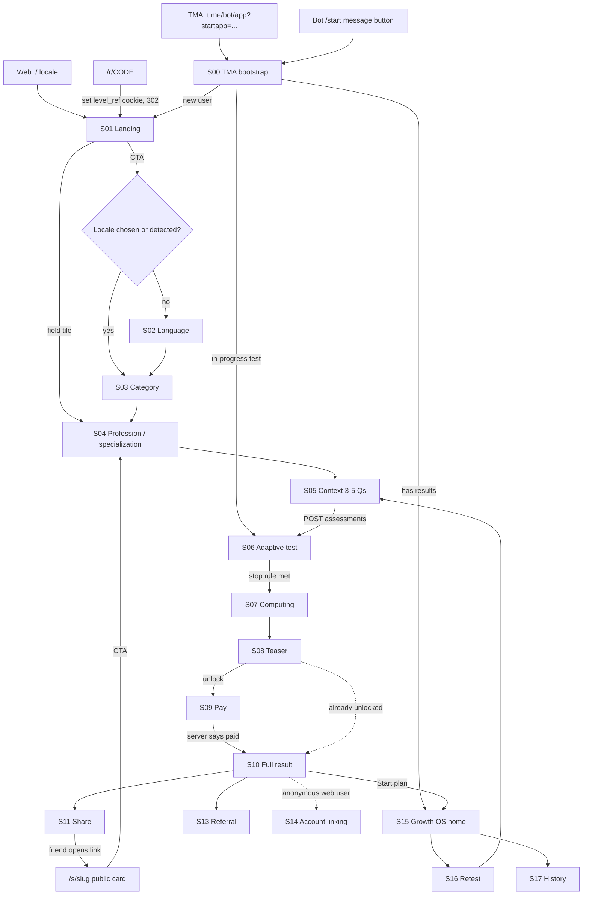

### 0.3 Global layout

- **Web header** (48 px): back arrow (non-root screens), LEVEL wordmark (links to S15 if the user has a result,
  else S01), language pill `UZ · RU · EN`, account icon (only after the first result).
- **TMA**: no web header (Telegram draws its own); the language pill sits at the top-right of S01, S15 and S18
  content; back is the native BackButton.
- **Bottom navigation** (02 D24): tabs *Bosh sahifa* (S15), *Tarix* (S17), *Taklif* (S13); shown only for users
  with ≥ 1 completed result, on S15/S17/S13/S10; hidden whenever the TMA MainButton is visible and during
  S03–S09.
- Content column max-width 480 px, 16 px side gutters, no horizontal scroll at 320 px.
- Primary buttons: full width, min-height 52 px, 16–17 px semibold. Option buttons: min-height 56 px.

### 0.4 Global state patterns

| State | Trigger (`error.code`) | Behaviour | Copy key |
|-------|------------------------|-----------|----------|
| Initial loading | route data pending | Layout-matching skeleton, shown only after 300 ms (avoids flashes). No full-screen spinners except S07 and payment confirming. | — |
| Action pending | button tapped | Spinner inside the button, button disabled, label kept; TMA uses `MainButton.showProgress()` | — |
| Offline | `navigator.onLine === false` or fetch `TypeError` | Non-blocking top banner; auto-retry on `online` event; user input kept | `err.offline` |
| Server error | 5xx `internal` | Inline error card in the failed region with *Qayta urinish* | `err.generic` |
| Rate limited | 429 `rate_limited` | Toast; automatic retry after `retry_after` (default 3 s) | `err.rateLimited` |
| No session (web) | 401 `unauthenticated` | Silently `POST /api/v1/session`, retry the request once | — |
| No session (TMA) | 401 `unauthenticated` / `telegram_init_data_expired` | Re-auth with `WebApp.initData`; if Telegram data is older than 24 h → full-page state with *LEVELni qayta ochish* (`WebApp.close()`) | `err.tmaSession` |
| Not yours | 403 `forbidden` on a result or session | Full-page state: explains the result belongs to another device/account; buttons *Telegram orqali ochish*, *Hisobni bogʻlash* | `err.notYours` |
| Not found | 404 `not_found` | Full-page state + *Bosh sahifa* | `err.notFound` |
| Gone | 410 `gone` (revoked share card) | Page-specific (S12) | `public.revoked` |
| Maintenance | 503 `maintenance` (`app_settings.maintenance.enabled`) | Full page; saved answers stay saved | `err.maintenance` |

**Decision:** API errors share one envelope
`{ "error": { "code": "retest_cooldown", "message_key": "err.retestCooldown", "retry_after": 3, "details": {…}, "request_id": "…" } }`
(01 §5.1–5.2); the UI maps `code` to the states above and never shows raw server messages.

### 0.5 API touchpoints

01 §5.3 is authoritative for shapes and auth modes; this table maps calls to screens.

| Call | Used on | Notes |
|------|---------|-------|
| `GET /api/v1/config` | S00, S01 | Feature flags, Telegram links, active locales |
| `POST /api/v1/session` | S01 hydrate (web) | Creates anonymous user + `level_session` cookie if missing; body `{locale, tz, utm, referrer}`; reads `level_ref` cookie (02 D20, D25) |
| `POST /api/v1/auth/telegram` | S00 | `{init_data, tz}` → `{token, user, locale, resume}`; handles `start_param` |
| `GET /api/v1/me` · `PATCH /api/v1/me` | S02, S18 | `locale`, `first_name` |
| `GET /api/v1/catalog/categories` | S01, S03 | Public, cacheable (ISR 300 s) |
| `GET /api/v1/catalog/categories/{slug}` | S04 | Professions, specializations, disclaimers |
| `GET /api/v1/catalog/professions/{slug}/context` | S05 | Context questions from the active template |
| `POST /api/v1/assessments` | S05 → S06 | `{profession_id, specialization_id, context, retest_of_session_id?}` → session + first item + progress |
| `GET /api/v1/assessments/active` | S01, S05 | In-progress session summary |
| `GET /api/v1/assessments/{id}` | S06 | Status, pending item, progress, `result_id` when completed, `ready_to_finalize` |
| `POST /api/v1/assessments/{id}/answers` | S06 | `{question_id, sequence, option_key}`; idempotent per sequence |
| `POST /api/v1/assessments/{id}/complete` | S07 | Idempotent recovery when the final answer could not finalize |
| `POST /api/v1/assessments/{id}/abandon` | S05, S06 | Marks `abandoned` |
| `GET /api/v1/assessments/retest-eligibility?profession={slug}` | S15, S16 | `{eligible, available_at, retest_credits}` |
| `GET /api/v1/results` · `GET /api/v1/results/{id}` | S08, S10, S17 | `{state: "teaser" \| "full", ...}`; server decides by unlock |
| `POST /api/v1/results/{id}/feedback` | S10 | F22 |
| `GET /api/v1/payments/options?product=full_report&target_id={resultId}` | S08, S09 | Providers for channel + price + `open_payment`, or `{status: "unlocked"}` |
| `POST /api/v1/payments` | S09 | Header `Idempotency-Key`; `{product, target_id, provider}` → `{payment_id, redirect_url \| invoice_link}` or `{status: "unlocked"}` |
| `GET /api/v1/payments/{id}` | S09 | `{status, result_id}` only |
| `POST /api/v1/share-cards` | S11 | Create or reuse for the toggle set → `{card_id, share_url, images, share_text}` |
| `POST /api/v1/share-cards/{id}/events` | S11 | `share_clicked`, `share_completed` (server writes `share_events` + analytics) |
| `POST /api/v1/share-cards/{id}/telegram-message` | S11 (TMA) | Returns a prepared inline message id for `shareMessage` |
| `DELETE /api/v1/share-cards/{id}` | S12 (owner), S18 | Revoke |
| `GET /s/{slug}`, `GET /s/{slug}/{template}.png?l={locale}&v={hash}` | S12, S11 | Public page and images |
| `GET /r/{code}` | entry | Sets `level_ref`, 302 to `/{locale}` |
| `GET /api/v1/referrals/me` | S13 | Code, links, counters, rules, grants |
| `POST /api/v1/account/link-tokens`, `GET …/{id}` | S14 | Web → Telegram linking |
| `POST /api/v1/account/link/phone` | S14 | Supabase access token after OTP |
| `GET /api/v1/home` | S15 | Aggregate for home |
| `POST /api/v1/roadmaps/{id}/accept` · `GET /api/v1/roadmaps/{id}` | S10, S15 | `proposed → active` |
| `POST /api/v1/roadmap-items/{id}/complete` / `/skip` | S15 | Idempotent |
| `GET /api/v1/history?cursor=` | S17 | 20 per page |
| `POST /api/v1/me/deletion` | S18 | 02 D27 |
| `POST /api/v1/events` | all | Whitelisted client events only; session optional, never creates users |

### 0.6 Telegram Mini App specifics (global)

#### 0.6.1 Bootstrap (S00)

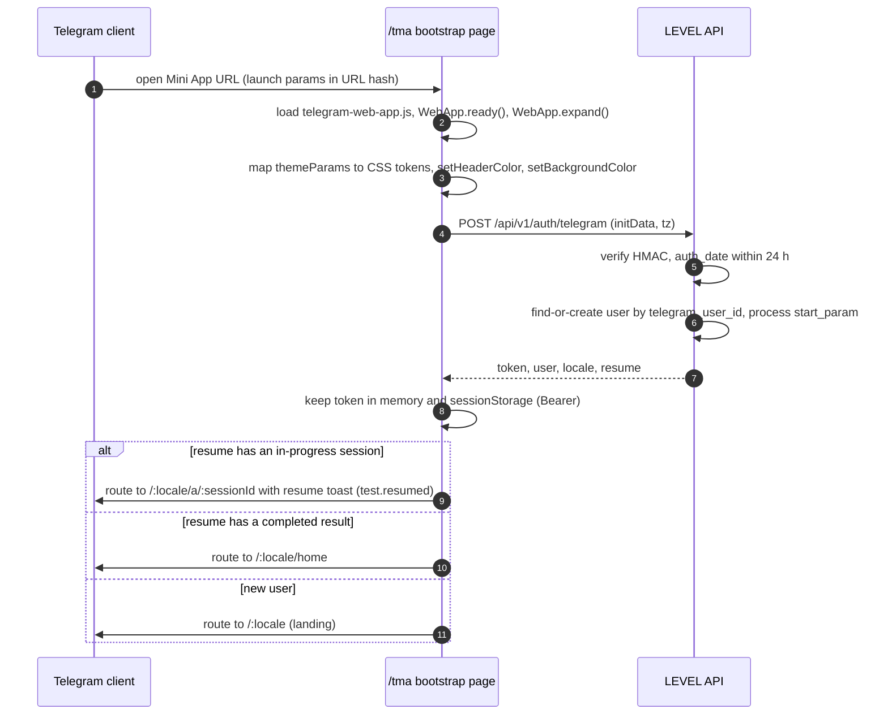

- **Decision:** returning TMA users skip the landing: in-progress test → straight to the pending question;
  any completed result → S15. New users → S01.
- Locale: stored `users.locale` → Telegram `language_code` if `uz`/`ru`/`en` → otherwise S02.
- `start_param` (02 D26): base32 code → referral attribution (only for users created in this request);
  `lk_<token>` → account linking (S14); anything else ignored.
- **Decision:** minimum supported `WebApp.version` is 6.2. Below it S00 shows *Telegram ilovangizni yangilang*
  with a link that opens the web version via `openLink`.
- Bootstrap failure (network) → full-page retry state; HMAC failure → "LEVELni bot orqali qayta oching" (never
  show raw reasons).

#### 0.6.2 Theme

The SDK exposes `--tg-theme-*` CSS variables. LEVEL maps them onto its tokens inside TMA:

| Telegram theme param | LEVEL token |
|----------------------|-------------|
| `bg_color` | `--background` |
| `secondary_bg_color` | `--background-subtle` (page background behind cards) |
| `section_bg_color` | `--card` |
| `text_color` | `--foreground` |
| `hint_color` / `subtitle_text_color` | `--muted-foreground` |
| `link_color` | `--link` |
| `button_color` / `button_text_color` | `--primary` / `--primary-foreground` |
| `accent_text_color` | `--accent-foreground` |
| `section_separator_color` | `--border` |
| `destructive_text_color` | `--destructive` |
| `header_bg_color` | `WebApp.setHeaderColor(...)` |
| `bottom_bar_bg_color` | `WebApp.setBottomBarColor(...)` (≥ 7.10) |

- **Decision:** level badge colors (`levels.color`) and share cards keep LEVEL brand colors in every theme.
- **Decision:** if `text_color` on `bg_color` has contrast below 4.5:1, LEVEL's own light/dark palette is used for
  text tokens (WCAG over theme fidelity).
- Listen to `themeChanged` and re-apply without reload. Web uses `prefers-color-scheme`.

#### 0.6.3 Viewport and safe areas

- Height: `var(--tg-viewport-stable-height, 100dvh)` for full-height layouts; never `100vh`.
- Insets: `padding-top: max(var(--tg-safe-area-inset-top, 0px) + var(--tg-content-safe-area-inset-top, 0px), env(safe-area-inset-top))`
  and the same for bottom. Re-read on `safeAreaChanged` / `contentSafeAreaChanged` (≥ 8.0).
- No content is placed under the native MainButton; when it is visible the page bottom padding is 16 px only
  (the button sits outside the WebView).

#### 0.6.4 Haptics

| Moment | Call |
|--------|------|
| Option, tile, toggle, language selected | `HapticFeedback.selectionChanged()` |
| MainButton / primary CTA press | `impactOccurred('light')` |
| Link copied | `impactOccurred('soft')` |
| Result ready (S07 → S08), payment confirmed, level up | `notificationOccurred('success')` |
| Payment failed, unrecoverable error | `notificationOccurred('error')` |
| Offline banner, retest blocked by cooldown | `notificationOccurred('warning')` |

No haptic on every answer commit (avoids buzz fatigue across 12 items).

#### 0.6.5 Native controls, links, closing

- `BackButton.show()` / `hide()` per the route map (0.1); one `onClick` handler bound per screen, removed on
  unmount (`offClick`).
- MainButton via a small hook `useMainButton({text, visible, active, progress, onClick})` so screens never touch
  the SDK directly; `setParams` batches changes; `has_shine_effect` (≥ 7.10) only on S08 unlock.
- Confirmations: `WebApp.showConfirm` (exit test, start over); errors in-page, not `showAlert`.
- External URLs: `WebApp.openLink(url)`; `t.me` URLs: `WebApp.openTelegramLink(url)`.
- `disableVerticalSwipes()` (≥ 7.7) on S06, `enableVerticalSwipes()` on leave.
- **Decision:** `enableClosingConfirmation()` only while a payment is being created/confirmed (S09); answers are
  saved server-side so the test does not need it.

#### 0.6.6 Version gating

| Capability | Min version | Fallback |
|------------|-------------|----------|
| BackButton, HapticFeedback, `openInvoice`, header/background colors | 6.1 | — (6.2 is the floor) |
| `showPopup` / `showConfirm`, closing confirmation | 6.2 | — |
| `disableVerticalSwipes` | 7.7 | none needed (resume handles accidental close) |
| `shareToStory` | 7.8 | Story template offers *Rasmni yuklab olish* instead |
| SecondaryButton, `setBottomBarColor`, `has_shine_effect` | 7.10 | in-page secondary button |
| `shareMessage`, `downloadFile`, safe-area events, `activated` event | 8.0 | `openTelegramLink('https://t.me/share/url?...')`, `openLink(imageUrl)`, `env()` insets, `visibilitychange` |

### 0.7 Analytics by screen

| Screen | Client events (`POST /api/v1/events`) | Server events |
|--------|---------------------------------------|---------------|
| S01 | `landing_view` | — |
| S02 | `language_selected` | — |
| S03 | `category_selected` | — |
| S04 | `profession_selected` | — |
| S05 | `context_completed` | `test_started` (session created) |
| S06 | — | `question_answered` (each), `test_completed` |
| S08 | — | `teaser_viewed` (once per result per day) |
| S09 | — | `payment_started` (payment created and handed to provider), `payment_paid`, `payment_failed` |
| S10 | `roadmap_opened` (plan section expanded) | `result_viewed` (first full view), `roadmap_accepted`, `result_feedback_submitted` (02 D2) |
| S11 | — (sent to `POST /api/v1/share-cards/{id}/events`) | `share_clicked`, `share_completed` recorded by that endpoint |
| S12 | — | `share_card_viewed` (bots excluded by UA) |
| S13 | — | `referral_started`, `referral_completed`, `referral_paid` |
| S14 | — | `account_linked` |
| S15 | `roadmap_opened` | `action_completed`, `action_skipped` |
| S16 | — | `retest_started` |

**Decision:** the client whitelist for `POST /api/v1/events` is exactly: `landing_view`, `language_selected`,
`category_selected`, `profession_selected`, `context_completed`, `roadmap_opened`. Share events are reported through
the share-card events endpoint (which validates card ownership). All other names are server-only.
(02 AC-F21-02 matches this split.)

---

## 1. Entry points

| Entry | What happens | Attribution |
|-------|--------------|-------------|
| `/{locale}` (ads, search, direct) | S01 static page; `POST /session` on hydrate | UTM params → `users.first_touch` |
| `/r/{CODE}` | Visit recorded (rate-limited); 302 → `/{locale}` with `level_ref` cookie (30 days, first touch wins) and `level_did` | Referral row on first API call (02 D20, 01 §7.5) |
| `/s/{slug}` | S12 public page; sets `level_ref` = card owner's code if none | Same as referral |
| `t.me/<bot>/<app>?startapp={CODE}` | S00 | `start_param` on verified initData |
| Bot `/start` | Bot replies with a message and a `web_app` button to the Mini App URL | none |

Bot `/start` message (sent in the user's `language_code`, default uz):

| | uz | ru | en |
|-|----|----|----|
| Text | Salom! LEVEL oʻz sohangizdagi darajangizni 3–5 daqiqada aniqlashga yordam beradi. Roʻyxatdan oʻtish shart emas. | Привет! LEVEL поможет за 3–5 минут узнать ваш уровень в своей сфере. Регистрация не нужна. | Hi! LEVEL helps you find your level in your field in 3–5 minutes. No sign-up needed. |
| Button | LEVELIMNI ANIQLASH | УЗНАТЬ МОЙ LEVEL | FIND MY LEVEL |

---

## S01 — Welcome / landing

**Purpose:** one clear promise, one action. **Route:** `/{locale}`. Static, cacheable (ISR 300 s); personal elements
hydrate after `POST /api/v1/session` (02 D25: the anonymous user is minted on this first API call, so crawlers that
do not run JS create nothing).

### Layout (top to bottom)

1. Header (web) / language pill (TMA).
2. Hero title (28–32 px, max 3 lines at 360 px).
3. Sub title (16–17 px, muted).
4. CTA button (web) — in TMA the MainButton carries it and this button is hidden.
5. Price note directly under the CTA (02 D3).
6. Resume banner (only if an in-progress session exists; hydrated).
7. Trust strip: 3 items with icons (no sign-up, duration, educational).
8. *Qanday ishlaydi?* — 3 numbered steps.
9. *Sohalar* — 10 tiles (2 columns), tap → S04 for that field.
10. Footer: level-is-not-value disclaimer, links *Maxfiylik siyosati*, *Foydalanish shartlari*, *Yordam*
    (support contact from `app_settings.support`).

### Interactions

- CTA → S02 if the locale is unresolved (02 D4), else S03. TMA: MainButton press → same.
- Tile → S04 `/{locale}/start/{category}` (fires `category_selected`).
- Resume banner (from `GET /api/v1/assessments/active`): *Davom etish* → S06 at the pending item; *Yangidan
  boshlash* → `showConfirm`/dialog `landing.resume.confirm` → `POST …/abandon` → S03.

### States

| State | UI |
|-------|----|
| Default | As above |
| Catalog failed to load (tiles) | Tiles section replaced with *Qayta urinish*; CTA still works (S03 retries) |
| Has completed results (web) | Header shows account icon; a slim card *Natijalarim* → S15 above the trust strip |
| Offline on load | Static page still renders (cached); CTA leads to S03 which shows offline state |

### Copy

| Key | uz | ru | en |
|-----|----|----|----|
| `landing.hero.title` | Sen oʻz sohangda qaysi LEVELdasan? | Какой у тебя LEVEL в твоей сфере? | What LEVEL are you in your field? |
| `landing.hero.subtitle` | 3 daqiqada aniqlang: hozir qayerdasiz, sizni nima toʻxtatib turibdi va keyingi qadam qanday. | Узнайте за 3 минуты: где вы сейчас, что вас сдерживает и какой следующий шаг. | Find out in 3 minutes: where you are now, what is holding you back, and what to do next. |
| `landing.hero.cta` | LEVELIMNI ANIQLASH | УЗНАТЬ МОЙ LEVEL | FIND MY LEVEL |
| `landing.hero.priceNote` | Test va qisqa natija bepul · Toʻliq natija — {price} | Тест и краткий результат бесплатно · Полный результат — {price} | Test and short result are free · Full result: {price} |
| `landing.trust.noSignup` | Roʻyxatdan oʻtish shart emas | Без регистрации | No sign-up needed |
| `landing.trust.duration` | 3–5 daqiqa, 7–15 ta savol | 3–5 минут, 7–15 вопросов | 3–5 minutes, 7–15 questions |
| `landing.trust.educational` | Taʼlimiy baholash, sertifikat emas | Образовательная оценка, не сертификат | Educational assessment, not a certificate |
| `landing.how.title` | Qanday ishlaydi? | Как это работает? | How it works |
| `landing.how.step1` | Sohangizni tanlang va qisqa savollarga javob bering | Выберите сферу и ответьте на короткие вопросы | Pick your field and answer short questions |
| `landing.how.step2` | LEVELingizni, kuchli tomoningizni va asosiy toʻsiqni biling | Узнайте свой LEVEL, сильную сторону и главное препятствие | See your LEVEL, your strongest skill and your main blocker |
| `landing.how.step3` | Keyingi levelga olib boradigan aniq rejani oling | Получите конкретный план до следующего уровня | Get a concrete plan toward the next level |
| `landing.fields.title` | Sohalar | Сферы | Fields |
| `landing.resume.title` | Tugallanmagan test bor | У вас есть незавершённый тест | You have an unfinished test |
| `landing.resume.body` | {profession} · {answered} / {total} | {profession} · {answered} / {total} | {profession} · {answered} / {total} |
| `landing.resume.continue` | Davom etish | Продолжить | Continue |
| `landing.resume.restart` | Yangidan boshlash | Начать заново | Start over |
| `landing.resume.confirm` | Oldingi test yopiladi va javoblari hisobga olinmaydi. Yangidan boshlaysizmi? | Предыдущий тест будет закрыт, его ответы не учтутся. Начать заново? | The previous test will be closed and its answers will not count. Start over? |
| `landing.myResults` | Natijalarim | Мои результаты | My results |
| `common.disclaimer.value` | LEVEL tanlangan sohadagi koʻnikmalarni baholaydi. U insonning qadri yoki aql darajasini oʻlchamaydi. | LEVEL оценивает навыки в выбранной сфере. Он не измеряет ценность человека или интеллект. | LEVEL estimates skills in a chosen field. It does not measure a person's worth or intelligence. |
| `footer.privacy` / `.terms` / `.help` | Maxfiylik siyosati / Foydalanish shartlari / Yordam | Политика конфиденциальности / Условия использования / Помощь | Privacy policy / Terms of use / Help |

---

## S02 — Language select

**Shown only** when the locale could not be resolved (02 D4; 01 §16 negotiation reached no signal); always
reachable via the language pill.

Layout: trilingual title, three full-width buttons with native names, each 56 px. Tap → `NEXT_LOCALE` cookie set
immediately, `PATCH /api/v1/me {locale}` (fire-and-forget) → `next` (default S03). Fires `language_selected`.
Haptic `selectionChanged`.

| Element | Text (identical in every locale) |
|---------|----------------------------------|
| Title | Tilni tanlang · Выберите язык · Choose a language |
| Buttons | Oʻzbekcha · Русский · English |

States: the PATCH failing never blocks (locale cookie is enough; retried on next API call).

---

## S03 — Category

**Route:** `/{locale}/start`. Title "Qaysi sohada oʻz levelingizni bilmoqchisiz?".

Layout: title, subtitle, 2-column grid of 10 tiles (icon 28 px + name, tile min-height 88 px), ordered by
`sort_order` (02 F03 table). One tap advances to S04 (`category_selected`), haptic `selectionChanged`.

| State | UI |
|-------|----|
| Loading | 10 tile skeletons |
| Error | Card *Sohalarni yuklab boʻlmadi* + *Qayta urinish* |
| Offline | Offline banner + cached list if present (ISR HTML), else error card |
| Unknown slug deep link | Grid + toast `category.unknown` |

| Key | uz | ru | en |
|-----|----|----|----|
| `category.title` | Qaysi sohada oʻz levelingizni bilmoqchisiz? | В какой сфере вы хотите узнать свой уровень? | In which field do you want to know your level? |
| `category.subtitle` | Bittasini tanlang. Keyinroq boshqa sohani ham sinab koʻrishingiz mumkin. | Выберите одну. Другую сферу можно пройти позже. | Pick one. You can try another field later. |
| `category.loadError` | Sohalarni yuklab boʻlmadi | Не удалось загрузить сферы | Could not load the fields |
| `category.unknown` | Bu soha topilmadi. Roʻyxatdan tanlang. | Эта сфера не найдена. Выберите из списка. | That field was not found. Please pick from the list. |

Category names: see 02 F03 table.

---

## S04 — Profession / specialization

**Route:** `/{locale}/start/{category}`.

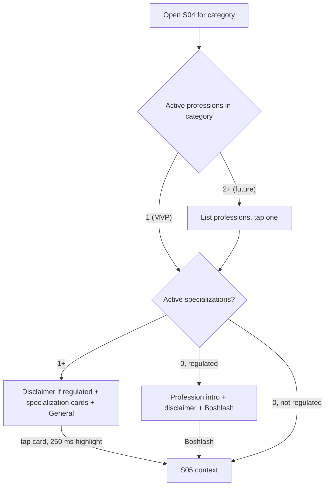

**Decision (refines 02 F04):** the screen is skipped only for a non-regulated profession with no
specializations; a regulated profession always shows S04 so its disclaimer is seen before the first question.

Layout: title, subtitle, regulated disclaimer block (if `is_regulated`), radio cards (name + one-line
description), last card *Umumiy (yoʻnalishsiz)* → `specialization_id = NULL`. Tap advances
(`profession_selected`). Back → S03 with the card still highlighted. TMA MainButton "Boshlash" appears only on the
intro variant (no specializations).

States: loading (4 card skeletons), error card with retry, unknown or inactive category slug → S03 with toast
`category.unknown`.

| Key | uz | ru | en |
|-----|----|----|----|
| `profession.title` | Yoʻnalishingizni tanlang | Выберите направление | Choose your track |
| `profession.subtitle` | Savollar shu yoʻnalishga moslashadi. | Вопросы подстроятся под это направление. | Questions will adapt to this track. |
| `profession.general` | Umumiy (yoʻnalishsiz) | Общее (без направления) | General (no specific track) |
| `profession.pickProfession` | Kasbingizni tanlang | Выберите профессию | Choose your profession |
| `profession.start` | Boshlash | Начать | Start |

Example specializations (entrepreneur, *illustrative labels; the content seed is authoritative*): Yangi
boshlovchi tadbirkor · Kichik biznes egasi · Oʻsayotgan biznes asoschisi · Bir nechta filial egasi · Startap
asoschisi · Kompaniya rahbari (CEO).

Regulated disclaimers (02 D7):

| Profession | uz | ru | en |
|------------|----|----|----|
| `accountant` | Bu taʼlimiy baholash. U buxgalteriya yoki soliq boʻyicha professional maslahat, malaka sertifikati yoki litsenziya oʻrnini bosmaydi. Rasmiy hisobot va soliq qarorlari uchun vakolatli mutaxassisga murojaat qiling. | Это образовательная оценка. Она не заменяет профессиональную консультацию по бухучёту или налогам, квалификационный сертификат или лицензию. По официальной отчётности и налогам обращайтесь к уполномоченному специалисту. | This is an educational assessment. It does not replace professional accounting or tax advice, a qualification certificate or a licence. For official reporting and tax decisions, consult an authorised professional. |
| `driving_instructor` | Bu taʼlimiy baholash. U haydovchilik guvohnomasi, yoʻriqchilik huquqi yoki rasmiy imtihon oʻrnini bosmaydi. Yoʻl harakati qoidalari va amaldagi rasmiy talablarga amal qiling. | Это образовательная оценка. Она не заменяет водительское удостоверение, право на инструкторскую деятельность или официальный экзамен. Соблюдайте ПДД и действующие официальные требования. | This is an educational assessment. It does not replace a driving licence, an instructor permit or an official exam. Follow the traffic rules and current official requirements. |

---

## S05 — Quick context (3–5 questions)

**Route:** `/{locale}/start/{category}/{profession}/context?spec={slug|general}`.

Layout per step: small header *Bir nechta qisqa savol* + step indicator `1 / 4`, question (20 px), helper line
(first step only), 2–6 option buttons stacked (56 px). Tap → `selectionChanged`, 250 ms highlight, next step.
Back goes to the previous step (answers kept) or S04 from step 1.

Persistence: answers in memory + `sessionStorage['level.ctx.{profession}']` (02 D8). After the last step:
`context_completed` → `GET /api/v1/assessments/active`; if a test for another profession is in progress, confirm
`context.switchConfirm` and `POST …/abandon` it (same profession → resume it instead) → `POST /api/v1/assessments`
(button-less; a full-width inline loader *Test tayyorlanmoqda…* appears after 300 ms) → S06 with the first item
already in the response.

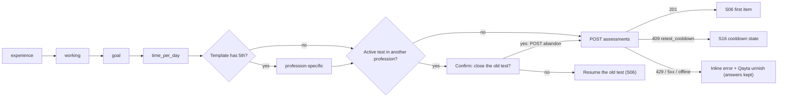

| Key | uz | ru | en |
|-----|----|----|----|
| `context.header` | Bir nechta qisqa savol | Несколько коротких вопросов | A few quick questions |
| `context.helper` | Bu javoblar test qiyinligini sizga moslashtirish uchun kerak. | Эти ответы помогут подобрать сложность теста. | These answers help match the test difficulty to you. |
| `context.experience.q` | Bu sohada qancha tajribangiz bor? | Сколько у вас опыта в этой сфере? | How much experience do you have in this field? |
| `…experience.0` | Tajribam yoʻq | Нет опыта | None yet |
| `…experience.lt1` | 1 yildan kam | Меньше 1 года | Less than 1 year |
| `…experience.1to3` | 1–3 yil | 1–3 года | 1–3 years |
| `…experience.3to5` | 3–5 yil | 3–5 лет | 3–5 years |
| `…experience.5plus` | 5 yildan ortiq | Больше 5 лет | More than 5 years |
| `context.working.q` | Hozir bu sohada ishlayapsizmi? | Вы сейчас работаете в этой сфере? | Are you working in this field now? |
| `…working.yes` | Ha, ishlayapman | Да, работаю | Yes, I am |
| `…working.no` | Yoʻq | Нет | No |
| `…working.learning` | Oʻrganyapman | Учусь | I am learning it |
| `context.goal.q` | Asosiy maqsadingiz qanday? | Какая ваша главная цель? | What is your main goal? |
| `…goal.start` | Sohani boshlash | Начать в этой сфере | Get started in the field |
| `…goal.find_job` | Ish topish | Найти работу | Find a job |
| `…goal.professional` | Professional boʻlish | Стать профессионалом | Become a professional |
| `…goal.increase_income` | Daromadni oshirish | Увеличить доход | Increase my income |
| `…goal.lead` | Jamoaga rahbarlik qilish | Руководить командой | Lead a team |
| `…goal.expert` | Ekspert boʻlish | Стать экспертом | Become an expert |
| `context.time.q` | Rivojlanish uchun kuniga qancha vaqt ajrata olasiz? | Сколько времени в день вы готовы уделять развитию? | How much time per day can you give to growth? |
| `…time.10/20/30/60` | 10 daqiqa / 20 daqiqa / 30 daqiqa / 1 soat | 10 минут / 20 минут / 30 минут / 1 час | 10 min / 20 min / 30 min / 1 hour |
| `context.preparing` | Test tayyorlanmoqda… | Готовим тест… | Preparing your test… |
| `context.switchConfirm` | Sizda boshqa soha boʻyicha tugallanmagan test bor. Uni yopib, yangisini boshlaymizmi? | У вас есть незавершённый тест по другой сфере. Закрыть его и начать новый? | You have an unfinished test in another field. Close it and start this one? |

Retest variant (S16): steps are pre-filled; a single summary screen *Maʼlumotlaringiz oʻzgardimi?* lists the four
answers with *Oʻzgartirish* links and a primary *Testni boshlash*.

---

## S06 — Adaptive test

**Route:** `/{locale}/a/{sessionId}`. One question per screen, no correct/incorrect feedback, no timer.

### Layout (360 × 800)

```text
+------------------------------------------+
| [x]  Tadbirkor                  7 / 12    |  exit (web) / BackButton (TMA); profession; counter
| [==============---------]                 |  progress bar n / D, 4 px
|                                           |
|  +-------------------------------------+  |
|  | VAZIYAT                             |  |  scenario card (scenario items only), muted bg
|  | Oy oxirida kassada pul yetmayapti,  |  |  illustrative text
|  | sotuvlar esa oʻtgan oydagidek.      |  |
|  +-------------------------------------+  |
|                                           |
|  Birinchi navbatda nima qilasiz?          |  prompt, 19 px, semibold
|                                           |
|  [ A  Narxlarni darhol oshiraman       ]  |  options: full width, min 56 px, 17 px,
|  [ B  Oxirgi 3 oy xarajatlarini        ]  |  wrap allowed, letter marker,
|  [    tahlil qilaman                   ]  |  2-5 options
|  [ C  Qarz olaman                      ]  |
|  [ D  Reklamani koʻpaytiraman          ]  |
|                                           |
|  Oʻylab javob bering — tezlik emas,       |  hint: first item only
|  aniqlik muhim.                           |
+------------------------------------------+
```

- **Decision:** options are shuffled deterministically by `hash(rng_seed, question_id)` (stable on reload);
  `self_report` (Likert) items keep `sort_order`.
- Media (`media` jsonb): image with fixed aspect ratio box (no layout shift), `alt` required, lazy-loaded.
- Long prompts scroll; options never hide behind fixed elements.

### Answer interaction

1. Tap option → selected style + `selectionChanged`.
2. Commit window 400 ms (02 D9): tapping another option moves the selection and restarts the window.
3. Submit `POST /api/v1/assessments/{id}/answers {question_id, sequence, option_key}`; options disabled;
   selected option shows a small spinner if the response takes > 300 ms. The overlay S07 is shown for this request
   when the client knows it is the last possible item (n = 15) or as soon as the response is slower than 600 ms on
   any item n ≥ 7 (the engine may stop there).
4. Response `next` → cross-fade 150 ms (none with reduced motion); focus moves to the new prompt heading;
   `aria-live` announces "Savol 8 / 12".
5. Response `completed {result_id}` → S08. Response `ready_to_finalize` → S07 calls `…/complete`.

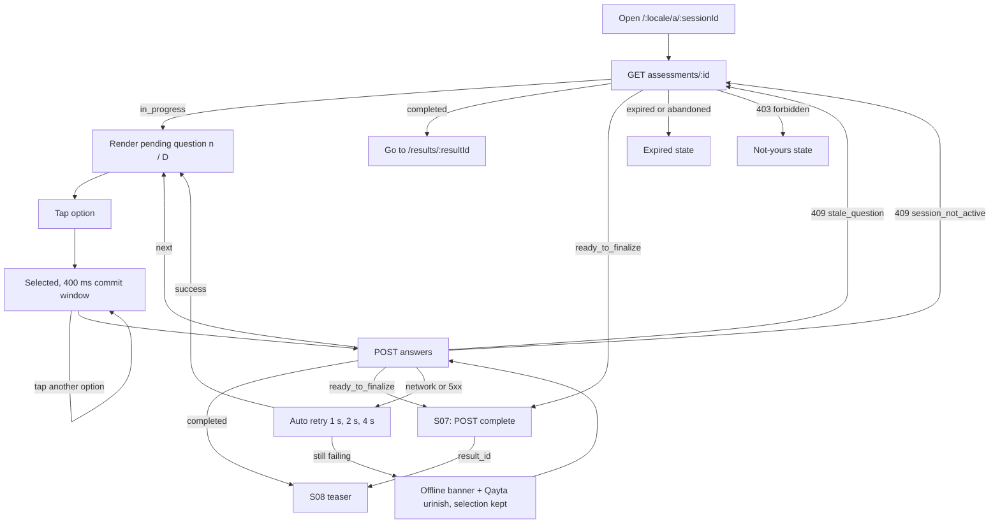

### Progress rules (02 D10)

- Shows `n / D` where n = current item number (answered + 1), D = 12 by default.
- When the engine serves item 13, D becomes 15 and a one-time inline note appears above the prompt:
  `test.extended`.
- When the engine stops early (n < D), S07 animates the bar to full; no "skipped" wording.

### Resume and exit

- Reload / reopen: server returns the same `pending_question_id`, same option order, same counter (AC-F06-03).
- TMA BackButton or web exit (x) → `showConfirm` / dialog `test.exit.*`. *Chiqish* → S15 if the user has results,
  else S01 (session stays `in_progress` until TTL).
- Session older than 24 h of inactivity → expired state.
- Switching language re-renders the pending item in the new language.

### States

| State | UI | Copy key |
|-------|----|----------|
| Loading first item | Prompt + 4 option skeletons | — |
| Submitting | Options disabled, spinner on selected after 300 ms | — |
| Offline / retries exhausted | Banner, *Qayta urinish*, selection kept | `err.offline` |
| Rate limited (429 on answers) | Auto wait `retry_after`, then resubmit; toast once | `err.rateLimited` |
| Expired / abandoned (`session_not_active` without result) | Full page: title, body, *Yangidan boshlash* (→ S05 with context pre-filled) | `test.expired.*` |
| Not yours (403) | Full page per 0.4 | `err.notYours` |
| Maintenance (503) | Full page per 0.4 | `err.maintenance` |

### TMA

BackButton → exit confirm; MainButton hidden; `disableVerticalSwipes()` on enter; no closing confirmation.

### Copy

| Key | uz | ru | en |
|-----|----|----|----|
| `test.progress` | {n} / {total} | {n} / {total} | {n} / {total} |
| `test.progress.a11y` | Savol {n} / {total} | Вопрос {n} из {total} | Question {n} of {total} |
| `test.scenario` | Vaziyat | Ситуация | Situation |
| `test.hint.first` | Oʻylab javob bering — tezlik emas, aniqlik muhim. Aniq bilmasangiz, eng toʻgʻri deb oʻylagan variantni tanlang. | Отвечайте вдумчиво — важна точность, а не скорость. Если не уверены, выберите вариант, который считаете наиболее верным. | Take your time: accuracy matters, not speed. If unsure, choose the option you think is most right. |
| `test.extended` | Aniqroq natija uchun yana bir nechta savol | Ещё несколько вопросов для точности | A few more questions for accuracy |
| `test.exit.title` | Testdan chiqasizmi? | Выйти из теста? | Leave the test? |
| `test.exit.body` | Javoblaringiz saqlanadi. Keyinroq shu joydan davom ettirasiz. | Ваши ответы сохранены. Вы сможете продолжить с этого места. | Your answers are saved. You can continue from here later. |
| `test.exit.stay` | Davom etish | Продолжить | Continue |
| `test.exit.leave` | Chiqish | Выйти | Leave |
| `test.resumed` | Davom etamiz: {n} / {total} | Продолжаем: {n} / {total} | Picking up where you left off: {n} / {total} |
| `test.expired.title` | Test muddati tugagan | Срок теста истёк | This test has expired |
| `test.expired.body` | 24 soatdan ortiq faollik boʻlmadi. Yangidan boshlang — bu bir necha daqiqa oladi. | Более 24 часов без активности. Начните заново — это займёт несколько минут. | There was no activity for over 24 hours. Start again; it takes a few minutes. |
| `test.expired.cta` | Yangidan boshlash | Начать заново | Start again |

---

## S07 — Computing

Overlay on S06 while the final answer request (which finalizes and scores inline, 01 §7.2–7.3, 02 AC-F07-05) or
the fallback `POST …/complete` is in flight.

- **Decision:** no artificial delay or fake "analysing 37 factors" animation; the overlay lasts exactly as long as
  the request. If it takes > 8 s, the line changes to `computing.slow`.
- On success: `notificationOccurred('success')` → S08 (`/{locale}/results/{resultId}`).
- On error: `GET /api/v1/assessments/{id}`; `completed` → S08 with `result_id`; `ready_to_finalize` →
  `POST …/complete` (idempotent); answer not recorded → resubmit (stale/duplicate answers are rejected safely);
  after 3 failures show the offline/error card with *Qayta urinish*.

| Key | uz | ru | en |
|-----|----|----|----|
| `computing.title` | Natijangiz hisoblanmoqda… | Считаем ваш результат… | Calculating your result… |
| `computing.slow` | Hisoblash odatdagidan uzoqroq davom etmoqda. Javoblaringiz saqlangan. | Расчёт занимает больше времени, чем обычно. Ваши ответы сохранены. | This is taking longer than usual. Your answers are saved. |

---

## S08 — Teaser result (free)

**Route:** `/{locale}/results/{resultId}` when the server reports `state = "teaser"`. Data: only
`assessment_results.teaser` (02 D12):

```json
{
  "profession": { "slug": "entrepreneur", "name": { "uz": "Tadbirkor", "ru": "Предприниматель", "en": "Entrepreneur" } },
  "specialization": { "slug": "small_business_owner", "name": { "uz": "Kichik biznes egasi", "ru": "Владелец малого бизнеса", "en": "Small business owner" } },
  "strongest": { "skill_key": "customer_communication", "name": { "uz": "…", "ru": "…", "en": "…" }, "relative": false },
  "blocker": { "skill_key": "financial_control", "name": { "uz": "…", "ru": "…", "en": "…" }, "kind": "bottleneck" },
  "locked": ["level", "skill_scores", "next_level", "actions", "plan"],
  "is_regulated": false,
  "completed_at": "2026-10-01T10:00:00Z"
}
```

`blocker.kind` is `bottleneck` or `lowest` (fallback when no skill is in the weak band); `strongest.relative` is
`true` when the top skill is not in the strong band.

### Exact locked layout

```text
+------------------------------------------+
| [<]  LEVEL                      UZ RU EN  |  web header (TMA: none)
|                                           |
|  (check)  Natijangiz tayyor               |  A  H1 24 px
|  Tadbirkor · Kichik biznes egasi          |  B  profession · specialization, 14 px muted
|                                           |
|  +-------------------------------------+  |
|  | (lock)  LEVEL  ?                    |  |  C  locked badge: neutral grey, NO number,
|  |         Toʻliq natijada ochiladi    |  |     NO level color, 72 px tall
|  +-------------------------------------+  |
|                                           |
|  +-------------------------------------+  |
|  | Eng kuchli tomoningiz               |  |  D  visible card, green tint
|  | (trending-up) Mijozlar bilan muloqot|  |     skill name only, no score
|  +-------------------------------------+  |
|  +-------------------------------------+  |
|  | Asosiy toʻsiq                       |  |  E  visible card, amber tint
|  | (alert) Moliyaviy nazorat           |  |     skill name only, no score
|  | Bu koʻnikma boshqa kuchli           |  |     generic one-line hint by blocker.kind
|  | tomonlaringizni cheklab turibdi.    |  |
|  +-------------------------------------+  |
|                                           |
|  Toʻliq natijada:                         |  F  locked list: lock icon + label +
|  (lock) LEVEL va uning maʼnosi    ====    |     static grey skeleton bar (never real data)
|  (lock) Har bir koʻnikma boʻyicha ball ===|
|  (lock) Keyingi levelga nima yetishmayapti|
|  (lock) Hozir qilinadigan 3 ta ish        |
|  (lock) 7 kunlik reja va 30 kunlik        |
|         yoʻl xaritasi                     |
|                                           |
|  [ 1,000 soʻmga toʻliq natijani ochish ]  |  G  primary CTA (web: sticky bottom bar with
|                                           |     safe-area padding; TMA: MainButton)
|  Bir martalik toʻlov. Obuna emas.         |  H  reassurance, 13 px muted
|  Natijangiz saqlandi — xohlagan vaqtda    |
|  ochishingiz mumkin.                      |
|                                           |
|  Taʼlimiy baholash, sertifikat emas.      |  I  disclaimers (+ regulated disclaimer)
|  LEVEL ... qadri yoki aql darajasini      |
|  oʻlchamaydi.                             |
+------------------------------------------+
```

Element rules:

- A–I always render in this order. D and E use `strongest`/`blocker`; titles switch per the fallback rules.
- C contains no digits and uses the same grey for every result (no information leak through color).
- F rows are static text; skeleton bars are decorative (`aria-hidden`).
- G text and amount come from `GET /api/v1/payments/options` (currency-specific template); while it loads, G shows
  a disabled skeleton button. TMA: `MainButton.setParams({text, is_active: true, has_shine_effect: true})` when
  ≥ 7.10.
- No timer, no "offer ends", no crossed-out price, no counts of other users.

### Interactions

- G → S09. If the options response is `{status: "unlocked"}` (e.g. paid on another device) → reload as S10.
- Back → S15 if the user has another completed result, else S01.
- *Doʻstlarni taklif qilish* text link under I → S13 (the referral link works before paying). There is no share-card
  action on the teaser: cards require an unlocked result (02 F15).

### States

| State | UI |
|-------|----|
| Loading | A–B text skeleton, C–E card skeletons, G disabled |
| Payment options unavailable (0 providers, `product_unavailable`) | G replaced by note `pay.unavailable` (no button) |
| Open payment exists | G label stays; S09 sheet opens on the open-payment row |
| Result not found / not yours | 0.4 states |
| Teaser JSON missing a blocker (should not happen) | Hide E; log `teaser_incomplete` |

### Copy

| Key | uz | ru | en |
|-----|----|----|----|
| `teaser.title` | Natijangiz tayyor | Ваш результат готов | Your result is ready |
| `teaser.level.locked` | Toʻliq natijada ochiladi | Откроется в полном результате | Revealed in the full result |
| `teaser.strongest` | Eng kuchli tomoningiz | Ваша сильная сторона | Your strongest skill |
| `teaser.strongest.relative` | Nisbatan kuchli tomoningiz | Ваша относительно сильная сторона | Your relatively strongest skill |
| `teaser.blocker.bottleneck` | Asosiy toʻsiq | Главное препятствие | Main blocker |
| `teaser.blocker.bottleneck.hint` | Bu koʻnikma boshqa kuchli tomonlaringizni cheklab turibdi. | Этот навык сдерживает ваши сильные стороны. | This skill is holding back your other strengths. |
| `teaser.blocker.lowest` | Eng past koʻrsatkich | Самый низкий показатель | Your lowest score |
| `teaser.blocker.lowest.hint` | Bu hozircha eng past koʻrsatkichingiz. | Сейчас это ваш самый низкий показатель. | This is your lowest score for now. |
| `teaser.locked.title` | Toʻliq natijada: | В полном результате: | In the full result: |
| `teaser.locked.level` | LEVEL va uning maʼnosi | LEVEL и что он значит | Your LEVEL and what it means |
| `teaser.locked.skills` | Har bir koʻnikma boʻyicha ball | Баллы по каждому навыку | A score for each skill |
| `teaser.locked.next` | Keyingi levelga nima yetishmayapti | Чего не хватает до следующего уровня | What is missing for the next level |
| `teaser.locked.actions` | Hozir qilinadigan 3 ta ish | 3 действия на сейчас | 3 actions to take now |
| `teaser.locked.plan` | 7 kunlik reja va 30 kunlik yoʻl xaritasi | План на 7 дней и дорожная карта на 30 дней | 7-day plan and 30-day roadmap |
| `teaser.cta.uzs` | {amount} soʻmga toʻliq natijani ochish | Открыть полный результат за {amount} сум | Unlock the full result for {amount} UZS |
| `teaser.cta.xtr` | Toʻliq natijani ochish · {amount} Stars | Открыть полный результат · {amount} Stars | Unlock the full result · {amount} Stars |
| `teaser.oneTime` | Bir martalik toʻlov. Obuna emas. | Разовый платёж, не подписка. | One-time payment, not a subscription. |
| `teaser.saved` | Natijangiz saqlandi — xohlagan vaqtda ochishingiz mumkin. | Результат сохранён — откройте его, когда удобно. | Your result is saved; unlock it whenever you like. |
| `common.disclaimer.educational` | Taʼlimiy baholash, sertifikat emas. | Образовательная оценка, не сертификат. | Educational assessment, not a certificate. |
| `teaser.invite` | Doʻstlarni taklif qilish | Пригласить друзей | Invite friends |

With the brief's default price the uz CTA reads exactly **"1,000 soʻmga toʻliq natijani ochish"**.

---

## S09 — Payment flow

Product `full_report`, target = result. Server rules: brief §9, 02 F09. The client never decides that a payment
succeeded; it only displays server status.

### 9.1 Provider choice by channel

Availability = provider ∈ `app_settings.payments.channel_providers[channel]` ∧ `payment_provider_configs.is_active`
for (provider, country) ∧ an active price in a currency the provider supports (02 D13, 01 §17).

| Channel | Default providers | Opening method |
|---------|-------------------|----------------|
| web (incl. in-app browsers) | Click, Payme | Same-tab `location.assign(redirect_url)`; never a popup |
| telegram | Telegram Stars | `WebApp.openInvoice(invoice_link, callback)` |
| telegram (only if admin added Click/Payme to `channel_providers.telegram`) | + Click, Payme | `WebApp.openLink(redirect_url)` in the external browser; TMA shows the waiting screen |

If exactly one provider is available, the sheet is skipped and checkout starts on CTA tap. With 2+ providers a
bottom sheet lists them in the configured order (array order in `channel_providers`).

### Pay sheet layout

```text
+------------------------------------------+
|  Toʻlov usulini tanlang              [x]  |
|  Toʻliq natija · 1,000 soʻm               |  price line from the price row
|  Bir martalik toʻlov                      |
|                                           |
|  [ (logo) Click                       > ] |  provider buttons, 56 px
|  [ (logo) Payme                       > ] |
|                                           |
|  ! Sizda tugallanmagan toʻlov bor (Click) |  only if open_payment exists
|    [ Holatni tekshirish ]                 |
|                                           |
|  Toʻlov tanlangan xizmat sahifasida       |  muted note
|  amalga oshiriladi. Karta maʼlumotlaringiz|
|  LEVELga uzatilmaydi.                     |
+------------------------------------------+
```

### 9.2 Web flow (Click / Payme)

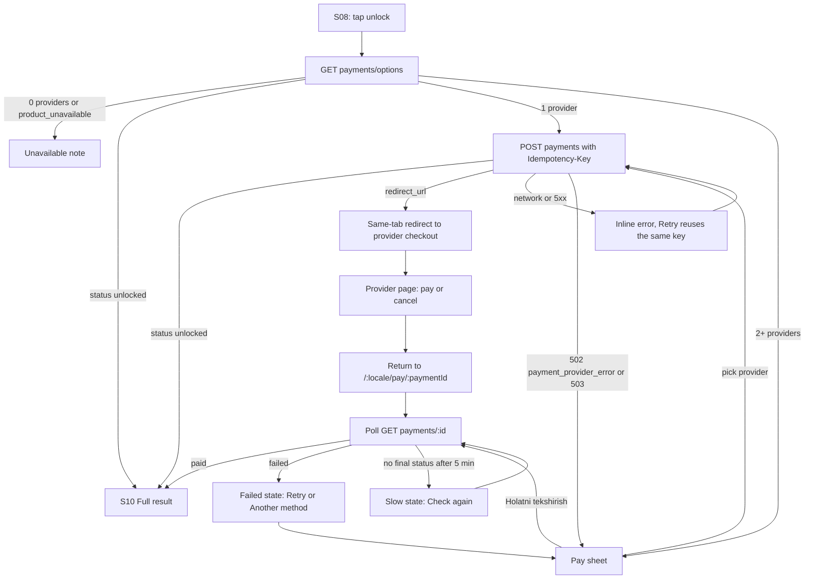

### 9.3 Telegram flow (Stars)

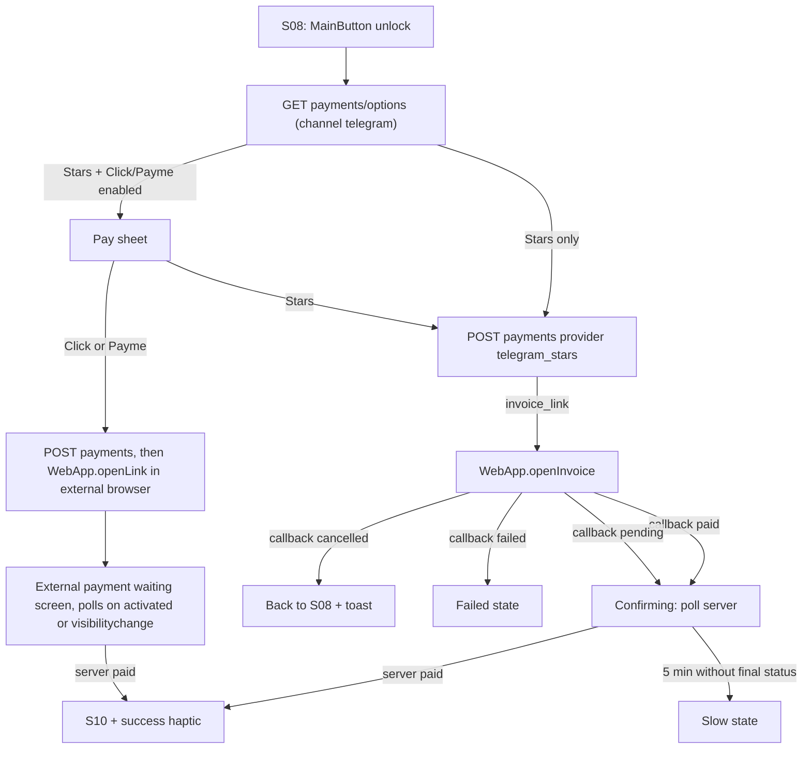

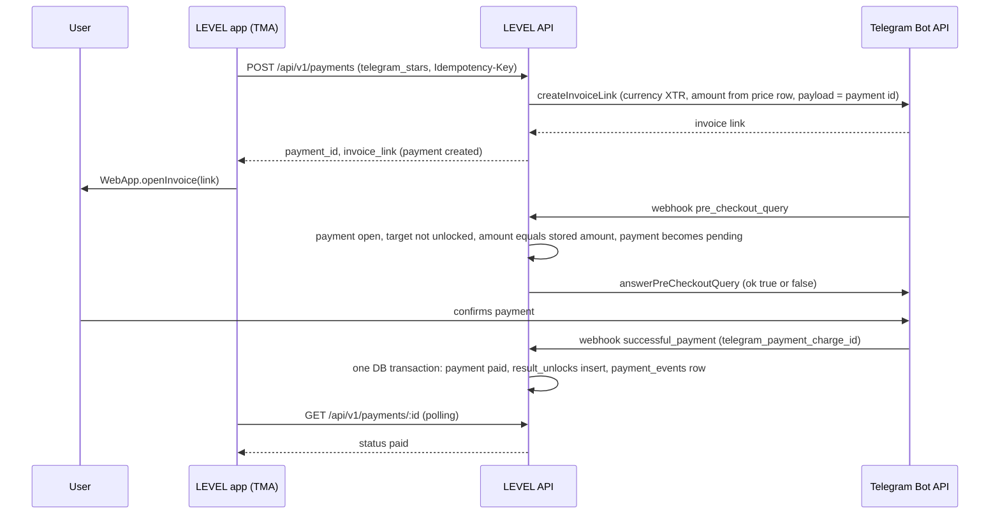

### 9.4 Return and polling

- Return route `/{locale}/pay/{paymentId}` ignores all query parameters from providers.
- **Decision:** poll immediately, then every 2 s for 30 s, then every 5 s until 5 min → slow state. Extra poll on
  `visibilitychange` → visible and on TMA `activated` (≥ 8.0). Stops on `paid`, `failed`, `refunded`.
- While confirming in TMA: `enableClosingConfirmation()`, BackButton hidden,
  `MainButton.showProgress()` with text `pay.confirming.title`, inactive.
- **Decision:** when the return page is opened without a matching session (e.g. TMA user who paid in an external
  browser), it shows only the payment status (`paid` / `pending` / `failed`) for that unguessable payment id, with
  *Telegramga qaytish* (`t.me/<bot>/<app>`), never result content.

### 9.5 Double-payment protection (UX side)

1. CTA disables and shows progress on the first tap.
2. `Idempotency-Key` per (result, provider) kept in `sessionStorage`; every retry reuses it.
3. Server reuses an open payment for the same provider and answers `{status: "unlocked"}` if already paid
   (brief §9).
4. The sheet shows an existing open payment with *Holatni tekshirish* above the provider list.
5. Provider pre-checks reject captures for an already-unlocked result (02 F09).
6. Confirming and slow states say "Iltimos, qayta toʻlamang".
7. If a second capture still happens (race across providers), the unlock stays, the second payment is queued for
   admin refund, and the success screen shows `pay.duplicate`.

### 9.6 States

| State | Trigger | UI | TMA |
|-------|---------|----|-----|
| Choosing | 2+ providers | Sheet | BackButton closes sheet; MainButton hidden |
| Creating | POST in flight | CTA spinner `pay.creating` | `MainButton.showProgress()`, closing confirmation on |
| Redirecting | `redirect_url` received | Full-screen `pay.redirecting` (provider name) | — |
| Invoice open | Stars | Telegram's native invoice UI | — |
| External waiting | Click/Payme in TMA | Screen `pay.external.*`, *Holatni tekshirish* | MainButton "Holatni tekshirish" |
| Confirming | returned / callback paid or pending | Spinner + `pay.confirming.*` | progress MainButton |
| Paid | server `paid` | Check icon + `pay.paid` for 800 ms → S10 | success haptic |
| Cancelled | Stars callback `cancelled` | Toast `pay.cancelled`, back to S08 | — |
| Returned without paying (web) | Confirming for ≥ 15 s with no final status | Secondary button `pay.notPaidBack` → S08; the open payment stays reusable (no new charge path) | — |
| Failed | server `failed` or Stars `failed` | `pay.failed.*` with reference = first 8 chars of payment id, *Qayta urinish*, *Boshqa usul* | error haptic |
| Slow | 5 min without final status | `pay.slow.*`, *Holatni tekshirish*, support link | closing confirmation off |
| Expired | server `failed` with reason `expired` | `pay.expired` + *Qayta urinish* (new key) | — |
| Unavailable | 0 providers / `product_unavailable` | `pay.unavailable` | — |
| Provider error | 502 `payment_provider_error` / 503 `provider_unavailable` on POST | Sheet reopens without that provider + toast `pay.providerError` | error haptic |
| Create error | 4xx/5xx/network on POST | Inline `err.generic` + retry (same key) | error haptic |
| Non-UZ web visitor | `country_code != 'UZ'`, web | Extra line `pay.nonUzNote` in the sheet | — |

### 9.7 Copy

| Key | uz | ru | en |
|-----|----|----|----|
| `pay.choose.title` | Toʻlov usulini tanlang | Выберите способ оплаты | Choose a payment method |
| `pay.choose.price.uzs` | Toʻliq natija · {amount} soʻm | Полный результат · {amount} сум | Full result · {amount} UZS |
| `pay.choose.price.xtr` | Toʻliq natija · {amount} Stars | Полный результат · {amount} Stars | Full result · {amount} Stars |
| `pay.choose.oneTime` | Bir martalik toʻlov | Разовый платёж | One-time payment |
| `pay.choose.note` | Toʻlov tanlangan xizmat sahifasida amalga oshiriladi. Karta maʼlumotlaringiz LEVELga uzatilmaydi. | Оплата проходит на странице выбранного сервиса. Данные карты не передаются LEVEL. | Payment happens on the provider's page. Your card details are never shared with LEVEL. |
| `pay.open.title` | Sizda tugallanmagan toʻlov bor ({provider}). | У вас есть незавершённый платёж ({provider}). | You have an unfinished payment ({provider}). |
| `pay.checkStatus` | Holatni tekshirish | Проверить статус | Check status |
| `pay.creating` | Toʻlov tayyorlanmoqda… | Готовим оплату… | Preparing payment… |
| `pay.redirecting` | {provider} sahifasiga oʻtilmoqda… | Переходим на страницу {provider}… | Opening {provider}… |
| `pay.confirming.title` | Toʻlov tekshirilmoqda | Проверяем оплату | Checking your payment |
| `pay.confirming.body` | Odatda bir necha soniya oladi. Iltimos, qayta toʻlamang. | Обычно это занимает несколько секунд. Пожалуйста, не оплачивайте повторно. | This usually takes a few seconds. Please do not pay again. |
| `pay.paid` | Toʻlov qabul qilindi | Оплата получена | Payment received |
| `pay.cancelled` | Toʻlov bekor qilindi | Оплата отменена | Payment cancelled |
| `pay.notPaidBack` | Toʻlovni yakunlamadim — orqaga | Оплата не завершена — вернуться | I did not finish paying, go back |
| `pay.providerError` | {provider} hozir javob bermayapti. Boshqa usulni tanlang. | {provider} сейчас не отвечает. Выберите другой способ. | {provider} is not responding right now. Please choose another method. |
| `pay.failed.title` | Toʻlov amalga oshmadi | Оплата не прошла | Payment did not go through |
| `pay.failed.body` | Agar hisobingizdan pul yechilgan boʻlsa, qoʻllab-quvvatlash xizmatiga yozing va shu raqamni koʻrsating: {ref}. | Если деньги списались, напишите в поддержку и укажите номер: {ref}. | If you were charged, contact support and mention this reference: {ref}. |
| `pay.failed.retry` | Qayta urinish | Повторить | Try again |
| `pay.failed.other` | Boshqa usul | Другой способ | Another method |
| `pay.slow.title` | Tasdiqlash choʻzilmoqda | Подтверждение задерживается | Confirmation is taking longer |
| `pay.slow.body` | Toʻlov tasdiqlanishi bilan natija avtomatik ochiladi — bu sahifani yopsangiz ham. Qayta toʻlamang. | Результат откроется автоматически, как только оплата подтвердится, даже если вы закроете страницу. Не оплачивайте повторно. | Your result unlocks automatically once the payment is confirmed, even if you close this page. Do not pay again. |
| `pay.expired` | Toʻlov muddati tugadi. Yangi toʻlov yarating. | Срок платежа истёк. Создайте новый платёж. | This payment has expired. Please start a new one. |
| `pay.external.title` | Toʻlov brauzerda ochildi | Оплата открыта в браузере | Payment opened in your browser |
| `pay.external.body` | Toʻlovni yakunlab, Telegramga qayting. Bu sahifa holatni oʻzi tekshiradi. | Завершите оплату и вернитесь в Telegram. Эта страница сама проверит статус. | Finish paying, then come back to Telegram. This page checks the status automatically. |
| `pay.return.external` | Toʻlov qabul qilindi. Natijani koʻrish uchun Telegramga qayting. | Оплата получена. Вернитесь в Telegram, чтобы увидеть результат. | Payment received. Return to Telegram to see your result. |
| `pay.return.backToTelegram` | Telegramga qaytish | Вернуться в Telegram | Back to Telegram |
| `pay.unavailable` | Hozir toʻlov usullari mavjud emas. Natijangiz saqlangan — keyinroq urinib koʻring. | Способы оплаты сейчас недоступны. Результат сохранён — попробуйте позже. | No payment methods are available right now. Your result is saved; try again later. |
| `pay.nonUzNote` | Hozircha faqat Click va Payme orqali (Oʻzbekiston kartalari) toʻlash mumkin. | Сейчас оплата доступна только через Click и Payme (карты Узбекистана). | For now, payment is available only via Click and Payme (Uzbekistan cards). |
| `pay.duplicate` | Bu natija uchun ikkinchi toʻlov ham qabul qilindi. Ortiqcha summa qaytarilishi uchun qoʻllab-quvvatlash xizmati siz bilan bogʻlanadi yoki unga yozing: {ref}. | За этот результат прошёл второй платёж. Поддержка оформит возврат лишней суммы; можно написать в поддержку: {ref}. | A second payment for this result also went through. Support will arrange a refund of the extra amount; you can also contact them: {ref}. |

---

## S10 — Full result

**Route:** `/{locale}/results/{resultId}` when `state = "full"` (owner + unlock, brief §5). Data: `report` jsonb +
skill scores + level scores; optional `ai_report` (02 F10).

### 10.1 Section order (fixed)

| # | Section | Content and source | Edge / empty case |
|---|---------|--------------------|-------------------|
| 1 | Level badge | `LEVEL {n}` in `levels.color`, micro-label *BAHOLANGAN*; range line if near boundary (02 D16); confidence line (brief copy) | LOW confidence adds reasons list (`result.conf.reason.*`) |
| 2 | Level name | `levels.name` (default names in 10.3) | — |
| 3 | Short explanation | `levels.short_description` | — |
| 4 | Qayerdasiz? | 9-rung ladder with current rung highlighted, rungs 8–9 marked *amaliy tasdiqlash*; `levels.meaning`; experience-cap note; retest delta strip (S16); percentile line only if a qualifying benchmark exists (n and window shown); optional AI paragraph with label | No benchmark → nothing; no AI → nothing |
| 5 | Skill bars | All profession skills, sorted by score desc (02 D17); number, band label, next-level tick, *Bevosita oʻlchanmagan* tag, low-confidence dot | — |
| 6 | Strongest | Top measured skill + template sentence | If not in strong band → *Nisbatan kuchli tomoningiz* |
| 7 | Lowest (weakest) | Lowest measured skill + score | If identical to bottleneck → sections 7 and 8 merge into one card titled `result.lowestAndBlocker` |
| 8 | Bottleneck | Bottleneck skill, leverage explanation template naming the limited strong skills; `result.bottleneck.whyNotLowest` when it is not the lowest | No weak skill → card says `result.bottleneck.none` |
| 9 | Next level | `LEVEL {n+1} · {name}`, composite `41 / 45`, requirement rows (met / current → needed) | Next level needs verification → `result.verifyOnly`; at top assessable level with all requirements met → same |
| 10 | What is missing | Up to 3 unmet requirements ordered by leverage, in plain words with gap sizes | All met except verification → `result.verifyOnly` |
| 11 | Do now | 3 action cards: title, duration, skill tag, *Nega?* link to section 15 | Fewer than 3 in library → show available, log content gap |
| 12 | Not now | 1–3 `do_not_rules`: message + reason | None → `result.dontNow.none` |
| 13 | 7-day plan | 7 rows `1-kun · 15 daqiqa · {title}`; CTA *Rejani boshlash* (roadmap `proposed → active`, 02 D18) | Already active → CTA becomes *Rejani ochish* (S15) |
| 14 | 30-day roadmap | 4 week cards (W1 foundation, W2 practice, W3 real application, W4 verification) with goal + milestone | — |
| 15 | Why this? | Accordion per recommendation: reason, sources (verified only: title, publisher, year), limitation, confidence | No source → `result.why.noSource` (exact brief text) |
| 16 | Share | Thumbnail of the default card, *Natijani ulashish* → S11, *Doʻstlarni taklif qilish* → S13 | — |
| — | Footer | Disclaimers (value, educational, regulated), accuracy feedback (F22), account-linking card (anonymous web users only), AI label if AI text shown | — |

### 10.2 First fold (360 px)

```text
+------------------------------------------+
| [<]  LEVEL                      UZ RU EN  |
|  Tadbirkor · Kichik biznes egasi          |
|  +-------------------------------------+  |
|  |  LEVEL 4                 BAHOLANGAN |  |  1  badge, level color band
|  |  Amaliyotchi                        |  |  2  name
|  |  Asosiy ishlarni mustaqil           |  |  3  short explanation (illustrative)
|  |  bajarasiz, lekin jarayonlar hali   |  |
|  |  tizimli emas.                      |  |
|  |  Ehtimoliy oraliq: LEVEL 4–5        |  |     only when range applies
|  |  Bu dastlabki baholash. Level 4     |  |     confidence line
|  |  natijangiz Medium Confidence. Real |  |
|  |  amaliy topshiriq orqali aniqlikni  |  |
|  |  oshirish mumkin.                   |  |
|  +-------------------------------------+  |
|  Qayerdasiz?                              |  4
|  1 2 3 [4] 5 6 7 8* 9*                    |     * = amaliy tasdiqlash talab qilinadi
+------------------------------------------+
```

Skill bar row:

```text
  Mijozlar bilan muloqot          72  Kuchli
  [##################------]  |              tick = next-level threshold (if skill_min)
  Moliyaviy nazorat   Asosiy toʻsiq  38  Eʼtibor kerak
  [#########---------------]      |
```

### 10.3 Default level names (02 D30)

| n | uz | ru | en | min composite |
|---|----|----|----|---------------|
| 1 | Ilk qadam | Старт | Starter | 0 |
| 2 | Boshlovchi | Начинающий | Beginner | 15 |
| 3 | Rivojlanayotgan | Развивающийся | Developing | 25 |
| 4 | Amaliyotchi | Практик | Practitioner | 35 |
| 5 | Professional | Профессионал | Professional | 45 |
| 6 | Ilgʻor | Продвинутый | Advanced | 55 |
| 7 | Ekspert | Эксперт | Expert | 65 |
| 8 | Yetakchi | Лидер | Leader | 75 (verification) |
| 9 | Usta | Мастер | Master | 85 (verification) |

### 10.4 Interactions

- *Rejani boshlash* → `POST /api/v1/roadmaps/{id}/accept` → `roadmap_accepted` → toast `result.plan7.started` → S15.
- Section 15 links: tapping *Nega?* on any card scrolls to and expands its accordion item.
- Feedback buttons → `POST results/{id}/feedback`; the row collapses to `result.feedback.thanks`; optional comment
  field (200 chars) appears after *Qisman* or *Notoʻgʻri*.
- TMA: MainButton *Natijani ulashish* → S11; SecondaryButton (≥ 7.10) *Rejani boshlash* while the roadmap is
  `proposed`; BackButton → S15.

### 10.5 States

| State | UI |
|-------|----|
| Loading | Badge skeleton + 5 bar skeletons + card skeletons |
| Just unlocked (from S09) | One-time banner `result.unlocked` at top, success haptic |
| AI narrative pending / failed | Nothing shown (deterministic report is complete) |
| Locale switched, AI text exists only in another locale | AI paragraph hidden |
| Refunded (unlock removed) | Server returns `teaser` state → S08 with toast `result.refunded` |
| Not yours / not found | 0.4 states |

### 10.6 Copy

| Key | uz | ru | en |
|-----|----|----|----|
| `result.badge.assessed` | BAHOLANGAN | ОЦЕНЁН | ASSESSED |
| `result.range` | Ehtimoliy oraliq: LEVEL {low}–{high} | Вероятный диапазон: LEVEL {low}–{high} | Likely range: LEVEL {low}–{high} |
| `result.confidence` | Bu dastlabki baholash. Level {n} natijangiz {confidence} Confidence. Real amaliy topshiriq orqali aniqlikni oshirish mumkin. | Это предварительная оценка. Ваш результат Level {n}: {confidence} Confidence. Точность можно повысить реальным практическим заданием. | This is an initial assessment. Your Level {n} result has {confidence} confidence. A real practical task can make it more accurate. |
| `result.conf.reason.fewItems` | Savollar soni kam boʻldi | Было мало вопросов | Few questions were answered |
| `result.conf.reason.highSe` | Javoblar turlicha boʻldi, shuning uchun baho hali aniq emas | Ответы сильно различались, поэтому оценка пока неточная | Answers varied a lot, so the estimate is less precise |
| `result.conf.reason.speeding` | Baʼzi savollarga juda tez javob berildi | На часть вопросов ответы были очень быстрыми | Some questions were answered very quickly |
| `result.conf.reason.selfReportGap` | Oʻzingizni baholashingiz va amaliy savollar natijasi farq qildi | Самооценка расходится с ответами на практические вопросы | Your self-rating differs from your answers to practical questions |
| `result.where.title` | Qayerdasiz? | Где вы сейчас? | Where are you? |
| `result.where.body` | Siz LEVEL {n} — {name} darajasidasiz. {meaning} | Вы на уровне LEVEL {n}: {name}. {meaning} | You are at LEVEL {n}, {name}. {meaning} |
| `result.where.verifyRung` | Amaliy tasdiqlash talab qilinadi | Требуется практическое подтверждение | Requires practical verification |
| `result.where.cap` | Bu kasbda “{experience}” tajriba bilan test orqali eng koʻpi LEVEL {cap} beriladi. | В этой профессии при опыте «{experience}» тест присваивает не выше LEVEL {cap}. | In this profession, with “{experience}” experience, the test awards at most LEVEL {cap}. |
| `result.where.percentile` | Shu kasb boʻyicha foydalanuvchilarning {p}% idan yuqori (n = {n}, oxirgi {days} kun). | Выше, чем у {p}% пользователей этой профессии (n = {n}, последние {days} дней). | Higher than {p}% of users in this profession (n = {n}, last {days} days). |
| `result.ai.label` | Bu izoh AI yordamida yozilgan va natija ballariga taʼsir qilmaydi. | Этот текст написан с помощью ИИ и не влияет на баллы. | This text was written with AI help and does not affect your scores. |
| `result.skills.title` | Koʻnikmalaringiz | Ваши навыки | Your skills |
| `result.band.strong` | Kuchli | Сильный | Strong |
| `result.band.mid` | Meʼyorda | В норме | On track |
| `result.band.weak` | Eʼtibor kerak | Зона роста | Focus area |
| `result.skill.notMeasured` | Bevosita oʻlchanmagan | Не измерялся напрямую | Not directly measured |
| `result.strongest.title` | Eng kuchli tomoningiz | Ваша сильная сторона | Your strongest skill |
| `result.strongest.body` | Bu koʻnikma hozir sizning tayanch nuqtangiz. | Этот навык сейчас ваша опора. | This skill is your anchor right now. |
| `result.lowest.title` | Eng past koʻrsatkich | Самый низкий показатель | Your lowest score |
| `result.lowest.body` | Bu eng past koʻrsatkichingiz: {score}/100. | Это ваш самый низкий показатель: {score}/100. | This is your lowest score: {score}/100. |
| `result.lowestAndBlocker` | Eng past koʻrsatkich va asosiy toʻsiq | Самый низкий показатель и главное препятствие | Lowest score and main blocker |
| `result.bottleneck.title` | Asosiy toʻsiq | Главное препятствие | Main blocker |
| `result.bottleneck.whyNotLowest` | Bu eng past ball emas, lekin u boshqa kuchli tomonlaringizni cheklab turibdi. | Это не самый низкий балл, но он ограничивает ваши сильные стороны. | This is not your lowest score, but it limits your strong skills. |
| `result.bottleneck.example` *(illustrative template output)* | Savdo talab yaratyapti, lekin ichki jarayonlar takrorlanadigan emas — shuning uchun kuchli tomoningiz toʻliq natija bermayapti. | Продажи создают спрос, но внутренние процессы не повторяемы, поэтому сильная сторона не даёт полного результата. | Sales generate demand, but internal processes are not repeatable, so your strength cannot pay off fully. |
| `result.bottleneck.none` | Hozir aniq toʻsiq yoʻq: barcha koʻnikmalar keyingi level talabiga yaqin. | Явного препятствия нет: все навыки близки к требованиям следующего уровня. | No clear blocker: all skills are close to the next level's requirements. |
| `result.next.title` | Keyingi level | Следующий уровень | Next level |
| `result.next.composite` | Umumiy ball: {score} / {target} | Общий балл: {score} / {target} | Overall score: {score} / {target} |
| `result.next.req` | {skill}: {current} → {needed} kerak | {skill}: {current} → нужно {needed} | {skill}: {current} → {needed} needed |
| `result.verifyOnly` | LEVEL {n} faqat amaliy tasdiqlash orqali beriladi. Bu imkoniyat hozircha mavjud emas. | LEVEL {n} присваивается только после практической проверки. Пока эта возможность недоступна. | LEVEL {n} is granted only through practical verification, which is not available yet. |
| `result.missing.title` | Nima yetishmayapti? | Чего не хватает? | What is missing? |
| `result.doNow.title` | Hozir nima qilish kerak | Что делать сейчас | Do this now |
| `result.duration` | {min} daqiqa | {min} мин | {min} min |
| `result.why.link` | Nega? | Почему? | Why? |
| `result.dontNow.title` | Hozircha qilmang | Пока не делайте | Not now |
| `result.dontNow.none` | Hozircha cheklov yoʻq. | Пока ограничений нет. | No restrictions for now. |
| `result.plan7.title` | 7 kunlik reja | План на 7 дней | 7-day plan |
| `result.plan7.day` | {day}-kun · {min} daqiqa | День {day} · {min} мин | Day {day} · {min} min |
| `result.plan7.start` | Rejani boshlash | Начать план | Start the plan |
| `result.plan7.open` | Rejani ochish | Открыть план | Open the plan |
| `result.plan7.started` | Reja boshlandi. Bugungi ish bosh sahifada. | План начат. Задание на сегодня на главной. | Plan started. Today's action is on your home screen. |
| `result.road30.title` | 30 kunlik yoʻl xaritasi | Дорожная карта на 30 дней | 30-day roadmap |
| `result.week.1` | 1-hafta: Asosni mustahkamlash | Неделя 1: Фундамент | Week 1: Foundation |
| `result.week.2` | 2-hafta: Amaliyot | Неделя 2: Практика | Week 2: Practice |
| `result.week.3` | 3-hafta: Real ishda qoʻllash | Неделя 3: Применение в реальной работе | Week 3: Real application |
| `result.week.4` | 4-hafta: Tekshirish | Неделя 4: Проверка | Week 4: Verification |
| `result.why.title` | Nega aynan shu? | Почему именно это? | Why this? |
| `result.why.reason` / `.sources` / `.limitation` / `.confidence` | Sabab / Manbalar / Cheklov / Ishonchlilik | Причина / Источники / Ограничения / Уверенность | Reason / Sources / Limitation / Confidence |
| `result.why.noSource` | Yetarli ishonchli maʼlumot mavjud emas. | Недостаточно достоверных данных. | Not enough reliable information. |
| `result.share.title` | Natijani ulashish | Поделиться результатом | Share your result |
| `result.share.cta` | Kartani tayyorlash | Создать карточку | Create a card |
| `result.invite.cta` | Doʻstlarni taklif qilish | Пригласить друзей | Invite friends |
| `result.feedback.q` | Natija sizga qanchalik toʻgʻri tuyuldi? | Насколько точным вам кажется результат? | How accurate does this result feel? |
| `result.feedback.accurate` / `.partly` / `.wrong` | Toʻgʻri / Qisman / Notoʻgʻri | Точно / Частично / Неточно | Accurate / Partly / Not accurate |
| `result.feedback.comment` | Nima notoʻgʻri tuyuldi? (ixtiyoriy) | Что показалось неточным? (необязательно) | What felt off? (optional) |
| `result.feedback.thanks` | Rahmat! Bu baholashni yaxshilashga yordam beradi. | Спасибо! Это помогает улучшать оценку. | Thank you! This helps us improve the assessment. |
| `result.unlocked` | Toʻliq natija ochildi | Полный результат открыт | Full result unlocked |
| `result.refunded` | Toʻlov qaytarilgani uchun toʻliq natija yopildi. | Полный результат закрыт, так как платёж возвращён. | The full result was closed because the payment was refunded. |

---

## S11 — Share

**Route:** `/{locale}/results/{resultId}/share`. Requires an unlocked result (the card shows the level; 02 F15).
A locked result redirects to S08.

### Layout

1. Template tabs: *Story* (1080×1920) · *Kvadrat* (1080×1080) · *Telegram* (1080×1350).
   **Decision:** default tab by context: TMA → Telegram; mobile web → Story; desktop web → Kvadrat.
2. Card preview (image, aspect-correct, max height 60% of viewport).
3. Toggles: *Ismimni koʻrsatish* (default **off**), *Eng kuchli tomonni koʻrsatish* (on), *Keyingi maqsadni
   koʻrsatish* (on). Turning the name on with no `profiles.first_name` reveals a text field (≤ 20 chars).
4. Privacy note.
5. Actions (by channel, below).
6. Default share text preview (editable only in the native share sheet / Telegram composer, not here).

Card content (brief §10): LEVEL logo, optional first name, profession, `LEVEL {n} · {name}`, *BAHOLANGAN*
micro-label, strongest skill (toggle), next target (toggle), short link + QR to `/s/{slug}`, footer
"Sen qaysi LEVELdasan?". Never: lowest skill, bottleneck, scores, confidence reasons, salary.

`POST /api/v1/share-cards` returns `{card_id, share_url, images, share_text}` (01 §7.5); images are
`/s/{slug}/{template}.png?l={locale}&v={hash}`.

**Decision (refines 02 D19):** the `share_cards` row is created or reused when the preview for a toggle set
settles (debounce 600 ms), so every share action runs synchronously inside the tap handler with the slug and the
PNG blob already available (Web Share and Safari require the call within the user gesture). Rows are reused per
unique toggle set + display name; unshared rows expose only `public_payload` behind an unguessable slug.

### Actions by channel

| Action | Web | TMA |
|--------|-----|-----|
| Native share | `navigator.share({files: [png], text, url})` if `navigator.canShare({files})`; else `navigator.share({text, url})`; hidden if unsupported | hidden |
| Telegram | open `https://t.me/share/url?url={share_url}&text={share_text}` in a new tab | `WebApp.shareMessage(preparedId)` (≥ 8.0, prepared server-side with the card image and an inline button "LEVELINGIZNI TEKSHIRING" → `t.me/<bot>/<app>?startapp={CODE}`); fallback `openTelegramLink(t.me/share/url…)` |
| Story | — (use native share / download) | `WebApp.shareToStory(storyPngUrl, {text, widget_link})` (≥ 7.8). **Decision:** `widget_link` (`{url: t.me/<bot>/<app>?startapp={CODE}, name: "LEVEL"}`) only when `initDataUnsafe.user.is_premium`, since story links are a Premium feature |
| Download | `<a download>` of the PNG | `WebApp.downloadFile({url, file_name})` (≥ 8.0; image endpoint sends `Content-Disposition: attachment` and CORS for Telegram web origins); fallback `openLink(pngUrl)` |
| Copy link | Clipboard API; fallback select-text field | same |

Reported via `POST /api/v1/share-cards/{id}/events`: `share_clicked` on tap; `share_completed` when the native
share promise resolves, the `shareMessage` / `shareToStory` callback reports success, the download finishes, or the
link is copied (`downloaded` is also recorded for downloads).

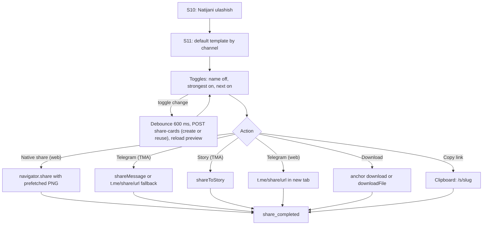

### States

| State | UI |
|-------|----|
| Preview loading | Aspect-ratio skeleton; actions disabled until the PNG blob is ready |
| Preview failed | `share.previewError` + retry; copy link still works once the slug exists |
| Card creation rate-limited | Toast `err.rateLimited`; last good preview stays |
| Native share cancelled (AbortError) | Silent; no `share_completed` |
| Name field invalid | Inline `share.name.invalid` |
| Result not unlocked | Redirect to S08 |
| Result refunded meanwhile | Cards are revoked server-side (02 D15); the page redirects to S08 on the next request |

TMA: MainButton = primary action for the current tab (Telegram tab → "Telegramda yuborish"; Story → "Storyga
joylash"; Kvadrat → "Rasmni yuklab olish"); BackButton → S10.

### Copy

| Key | uz | ru | en |
|-----|----|----|----|
| `share.title` | Natijani ulashish | Поделиться результатом | Share your result |
| `share.tab.story` / `.square` / `.telegram` | Story / Kvadrat / Telegram | Story / Квадрат / Telegram | Story / Square / Telegram |
| `share.toggle.name` | Ismimni koʻrsatish | Показать моё имя | Show my name |
| `share.toggle.strongest` | Eng kuchli tomonni koʻrsatish | Показать сильную сторону | Show my strongest skill |
| `share.toggle.next` | Keyingi maqsadni koʻrsatish | Показать следующую цель | Show my next goal |
| `share.name.label` | Kartadagi ism | Имя на карточке | Name on the card |
| `share.name.invalid` | Faqat harflar, boʻsh joy va chiziqcha (20 belgigacha). | Только буквы, пробел и дефис (до 20 символов). | Letters, spaces and hyphens only (up to 20 characters). |
| `share.privacy` | Kartada faqat siz tanlagan maʼlumotlar koʻrinadi. Past koʻrsatkichlar kartada hech qachon koʻrsatilmaydi. | На карточке только то, что вы выбрали. Низкие показатели никогда не показываются. | The card shows only what you choose. Low scores are never shown. |
| `share.action.native` | Ulashish | Поделиться | Share |
| `share.action.telegram` | Telegramda yuborish | Отправить в Telegram | Send in Telegram |
| `share.action.story` | Storyga joylash | Выложить в историю | Post to your story |
| `share.action.download` | Rasmni yuklab olish | Скачать картинку | Download image |
| `share.action.copy` | Havolani nusxalash | Скопировать ссылку | Copy link |
| `share.copied` | Havola nusxalandi | Ссылка скопирована | Link copied |
| `share.previewError` | Kartani yuklab boʻlmadi | Не удалось загрузить карточку | Could not load the card |
| `share.text.default` | Men {profession} LEVEL testidan oʻtdim. Natijam: LEVEL {n}. Sizniki nechchi? | Мой результат в тесте LEVEL ({profession}): LEVEL {n}. А какой у вас? | I took the LEVEL test for {profession}. My result: LEVEL {n}. What is yours? |
| `card.strongest` | Kuchli tomoni: {skill} | Сильная сторона: {skill} | Strongest skill: {skill} |
| `card.next` | Keyingi maqsad: LEVEL {n} | Следующая цель: LEVEL {n} | Next goal: LEVEL {n} |
| `card.footer` | Sen qaysi LEVELdasan? | А какой LEVEL у тебя? | What's your LEVEL? |
| `card.assessed` | BAHOLANGAN | ОЦЕНЁН | ASSESSED |

The uz default text renders exactly as the brief: "Men Tadbirkor LEVEL testidan oʻtdim. Natijam: LEVEL 4. Sizniki
nechchi?" **Decision:** the card is rendered in the sharer's locale at creation; `/s/{slug}` page chrome uses the
viewer's locale.

---

## S12 — Public share page (viewer)

**Route:** `/s/{slug}`, rewritten (not redirected) to `/{locale}/s/{slug}` so link previews get 200 + OG (01).
Public RSC, ISR 300 s, OG image = og template (1200×630).

Layout: card image (square template), H1, CTA, secondary *Telegram orqali ochish*
(`t.me/<bot>/<app>?startapp={ownerCode}`), *Bu nima?* (3 lines), disclaimers. The page sets `level_ref` to the
owner's code if absent (02 D19). CTA → S04 for the card's profession category (skips S03), so the friend starts the
same test in one tap.

| State | UI |
|-------|----|
| Default | As above; `share_card_viewed` (server, bots excluded) |
| Revoked / owner deleted | HTTP 410 `gone`: `public.revoked` + CTA to S01; image URLs stop resolving immediately |
| Unknown slug | 404 page with CTA to S01 |
| Viewer is the owner | Extra row *Bu sizning kartangiz* + *Kartani oʻchirish* (confirm → revoke) |

| Key | uz | ru | en |
|-----|----|----|----|
| `public.title.named` (also OG title) | {name} — {profession} LEVEL {n}. Sizniki nechchi? | {name} — {profession}, LEVEL {n}. А у вас какой? | {name}: {profession} LEVEL {n}. What is yours? |
| `public.title.anon` | {profession} LEVEL {n}. Sizniki nechchi? | {profession}, LEVEL {n}. А у вас какой? | {profession} LEVEL {n}. What is yours? |
| `public.cta` | LEVELINGIZNI TEKSHIRING | ПРОВЕРЬТЕ СВОЙ LEVEL | CHECK YOUR LEVEL |
| `public.openTelegram` | Telegram orqali ochish | Открыть в Telegram | Open in Telegram |
| `public.what` | LEVEL — 3–5 daqiqalik moslashuvchan test. U tanlangan sohadagi hozirgi darajangizni, kuchli tomoningizni va keyingi qadamni koʻrsatadi. | LEVEL — адаптивный тест на 3–5 минут. Он показывает ваш текущий уровень в выбранной сфере, сильную сторону и следующий шаг. | LEVEL is a 3–5 minute adaptive test. It shows your current level in a chosen field, your strongest skill and your next step. |
| `public.revoked` | Bu karta oʻchirilgan | Эта карточка удалена | This card has been removed |
| `public.owner` | Bu sizning kartangiz | Это ваша карточка | This is your card |
| `public.revoke` | Kartani oʻchirish | Удалить карточку | Remove card |

Example from the brief (uz, name on): "Aziz — Sales LEVEL 5. Sizniki nechchi?" + "LEVELINGIZNI TEKSHIRING".

---

## S13 — Referral

**Route:** `/{locale}/invite`. Available to every user (even before paying).

### Layout

1. Title + explanation.
2. Link box: web link `https://<host>/r/{CODE}` with *Nusxalash*; second row Telegram link
   `t.me/<bot>/<app>?startapp={CODE}`.
3. Share buttons (same mechanisms as S11, text only): Telegram, native share (web), copy.
4. Reward progress: one card per **active** rule (02 D21), e.g. "3 ta doʻst testni yakunlasa → 1 ta kutishsiz
   qayta baholash", progress bar `1 / 3`, granted state with check.
5. Counters: *Kirdi* · *Boshladi* · *Yakunladi* · *Toʻladi* (counts only, valid referrals only).
6. Fine print.

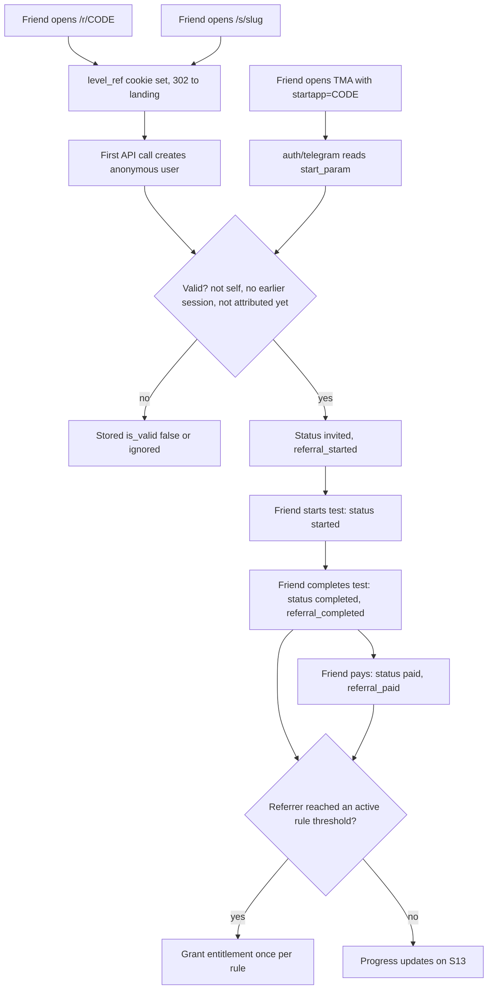

### States

| State | UI |
|-------|----|
| Loading | Link box skeleton, counters `–` |
| Empty (0 visits) | Counters at 0 + `ref.empty` |
| Reward granted | Rule card shows `ref.granted`; retest credit visible on S15/S16 |
| No active rules | Progress section hidden (no invented rewards) |
| Code inactive (account deleted) | Page shows `err.generic` + home link |

TMA: MainButton "Havolani ulashish" → Telegram share of the text with the TMA link.

### Copy

| Key | uz | ru | en |
|-----|----|----|----|
| `ref.title` | Doʻstlaringizni taklif qiling | Пригласите друзей | Invite friends |
| `ref.body` | Doʻstingiz sizning havolangiz orqali kirib, testni yakunlasa, u hisobga olinadi. | Друг засчитывается, когда переходит по вашей ссылке и завершает тест. | A friend counts when they open your link and finish the test. |
| `ref.link.web` / `.tg` | Sizning havolangiz / Telegram havolasi | Ваша ссылка / Ссылка для Telegram | Your link / Telegram link |
| `ref.copy` | Nusxalash | Копировать | Copy |
| `ref.share` | Havolani ulashish | Поделиться ссылкой | Share link |
| `ref.shareText` | Oʻz sohangdagi LEVELingni 3 daqiqada aniqla: {link} | Узнай свой уровень в своей сфере за 3 минуты: {link} | Find out your level in your field in 3 minutes: {link} |
| `ref.stat.visited` / `.started` / `.completed` / `.paid` | Kirdi / Boshladi / Yakunladi / Toʻladi | Перешли / Начали / Завершили / Оплатили | Visited / Started / Completed / Paid |
| `ref.rule.completed` | {threshold} ta doʻst testni yakunlasa: {reward} | Когда {threshold} друга завершат тест: {reward} | When {threshold} friends finish the test: {reward} |
| `ref.rule.paid` | {threshold} ta doʻst toʻliq natijani ochsa: {reward} | Когда {threshold} друга откроют полный результат: {reward} | When {threshold} friends unlock their full result: {reward} |
| `ref.reward.retest` | 1 ta kutishsiz qayta baholash | 1 повторная оценка без ожидания | 1 retest without the waiting period |
| `ref.progress` | {count} / {threshold} | {count} / {threshold} | {count} / {threshold} |
| `ref.granted` | Mukofot berildi | Награда получена | Reward granted |
| `ref.empty` | Hali hech kim havolangiz orqali kirmagan. Natija kartangizni ulashing — havola unda bor. | Пока никто не перешёл по вашей ссылке. Поделитесь карточкой результата — ссылка уже в ней. | No one has used your link yet. Share your result card; the link is already on it. |
| `ref.fine` | Oʻzingizni taklif qilish hisobga olinmaydi. Toʻlov qaytarilsa, taklif hisobdan chiqariladi. | Приглашение самого себя не засчитывается. При возврате платежа приглашение не учитывается. | Inviting yourself does not count. Refunded payments are removed from the count. |

Russian plural forms (`друга`/`друзей`) use ICU `plural` in message files; the table shows the common form.

---

## S14 — Account linking

Never blocking (02 F19). Offered: (a) card in S10 footer and on S15 for **anonymous web** users; (b) S18 *Bogʻlangan
hisoblar*. TMA users are already identified by Telegram, so TMA shows no linking prompt.

### 14.1 Prompt card

```text
+-------------------------------------+
| Natijangizni saqlang            [x] |
| Hozir natijangiz faqat shu          |
| brauzerda. Telegram yoki telefon    |
| raqamingizni bogʻlasangiz, uni      |
| istalgan qurilmada koʻrasiz.        |
| [ Telegram orqali bogʻlash ]        |
| [ Telefon raqamni bogʻlash ]        |
| Keyinroq                            |
+-------------------------------------+
```

Dismiss (*Keyinroq* / x) hides it for 7 days (`localStorage`, per user id).

### 14.2 Web → Telegram

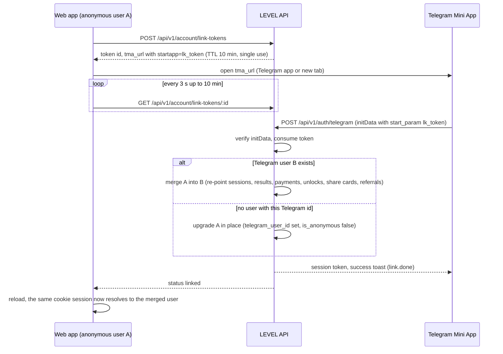

States (web side): waiting (`link.tg.waiting`, spinner, *Bekor qilish*), linked (`link.done`, success, card
disappears), expired (`link.tokenExpired` + *Qayta urinish*), conflict (`link.conflict`), error (`err.generic`).
TMA side after consuming a token: toast `link.done`, then normal S00 routing (the merged user has results → S15).

### 14.3 Phone (web)

Supabase JS is lazy-loaded on this screen only.

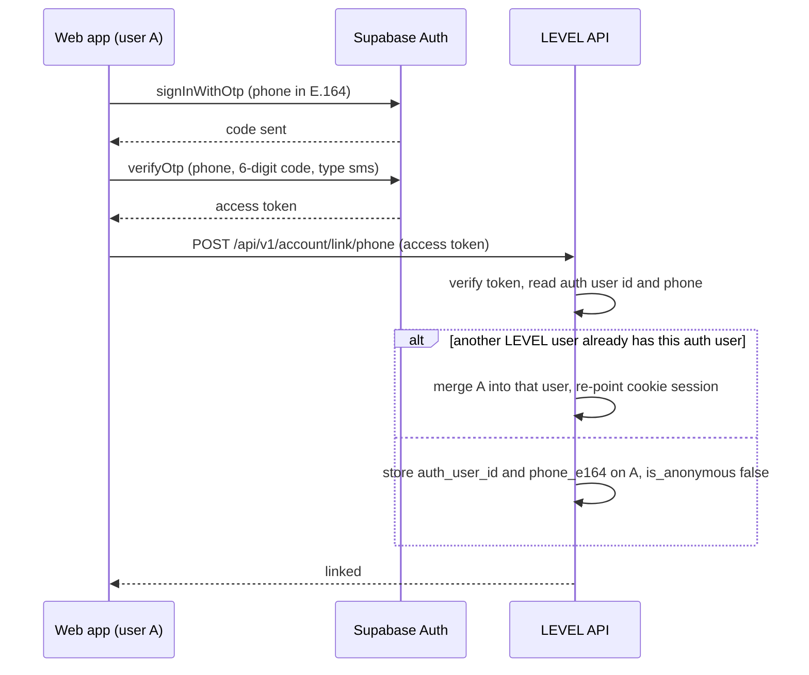

Phone step layout: country code prefilled from `users.country_code` (UZ → `+998`), mask `+998 XX XXX XX XX`,
*Kod yuborish*. Code step: 6 inputs with `autocomplete="one-time-code"` and `inputmode="numeric"`, auto-submit on
the 6th digit, resend countdown 60 s, *Raqamni oʻzgartirish*.

| State | UI | Copy key |
|-------|----|----------|
| Invalid phone | Inline under field | `link.phone.invalid` |
| SMS send failed / rate-limited | Inline + retry after countdown | `link.phone.sendFailed` |
| Wrong code | Inline, field cleared, focus first box | `link.phone.wrong` |
| Expired code | Inline + resend enabled | `link.phone.expired` |
| Too many attempts | Inputs disabled 10 min | `link.phone.locked` |
| Linked | Success screen → back to where the user came from | `link.done` |
| Conflict (both identified with results) | Explanation, support link; nothing is merged or deleted | `link.conflict` |

### 14.4 Copy

| Key | uz | ru | en |
|-----|----|----|----|
| `link.card.title` | Natijangizni saqlang | Сохраните результат | Keep your result |
| `link.card.body` | Hozir natijangiz faqat shu brauzerda. Telegram yoki telefon raqamingizni bogʻlasangiz, uni istalgan qurilmada koʻrasiz. | Сейчас результат доступен только в этом браузере. Привяжите Telegram или телефон, чтобы видеть его на любом устройстве. | Right now your result lives only in this browser. Link Telegram or your phone to see it on any device. |
| `link.telegram` | Telegram orqali bogʻlash | Привязать Telegram | Link Telegram |
| `link.phone` | Telefon raqamni bogʻlash | Привязать телефон | Link phone number |
| `link.later` | Keyinroq | Позже | Later |
| `link.tg.waiting` | Telegramda LEVELni oching… Bu sahifa oʻzi yangilanadi. | Откройте LEVEL в Telegram… Эта страница обновится сама. | Open LEVEL in Telegram… This page will update by itself. |
| `link.cancel` | Bekor qilish | Отменить | Cancel |
| `link.done` | Hisob bogʻlandi. Barcha natijalaringiz saqlandi. | Аккаунт привязан. Все результаты сохранены. | Account linked. All your results are kept. |
| `link.tokenExpired` | Havola muddati tugadi. Qaytadan urinib koʻring. | Срок ссылки истёк. Попробуйте ещё раз. | The link has expired. Please try again. |
| `link.conflict` | Bu hisob boshqa LEVEL profiliga bogʻlangan va unda ham natijalar bor. Ikkala profildagi natijalar saqlanadi; birlashtirish uchun qoʻllab-quvvatlash xizmatiga yozing. | Этот аккаунт уже привязан к другому профилю LEVEL с результатами. Результаты обоих профилей сохранены; для объединения напишите в поддержку. | This account is already linked to another LEVEL profile that has results. Results in both profiles are kept; contact support to combine them. |
| `link.phone.title` | Telefon raqamingiz | Ваш номер телефона | Your phone number |
| `link.phone.send` | Kod yuborish | Отправить код | Send code |
| `link.phone.code` | SMS orqali kelgan 6 xonali kodni kiriting | Введите 6-значный код из SMS | Enter the 6-digit code from SMS |
| `link.phone.resend` | Kodni qayta yuborish ({s} s) | Отправить снова ({s} с) | Resend code ({s}s) |
| `link.phone.change` | Raqamni oʻzgartirish | Изменить номер | Change number |
| `link.phone.invalid` | Raqam notoʻgʻri. Tekshirib, qayta kiriting. | Неверный номер. Проверьте и введите снова. | That number looks wrong. Please check it. |
| `link.phone.sendFailed` | Kod yuborilmadi. Birozdan soʻng qayta urinib koʻring. | Не удалось отправить код. Попробуйте чуть позже. | We could not send the code. Please try again shortly. |
| `link.phone.wrong` | Kod notoʻgʻri. Qayta tekshiring. | Неверный код. Проверьте ещё раз. | Wrong code. Please check it. |
| `link.phone.expired` | Kod muddati tugagan. Yangi kod soʻrang. | Срок действия кода истёк. Запросите новый. | The code has expired. Request a new one. |
| `link.phone.locked` | Urinishlar juda koʻp. 10 daqiqadan soʻng qayta urinib koʻring. | Слишком много попыток. Попробуйте через 10 минут. | Too many attempts. Try again in 10 minutes. |

---

## S15 — Growth OS home

**Route:** `/{locale}/home`. Data: `GET /api/v1/home` → latest unlocked result per profession (02 D17 decision on
locked newer results), roadmap, today's items, retest eligibility.

### 15.1 Decision tree

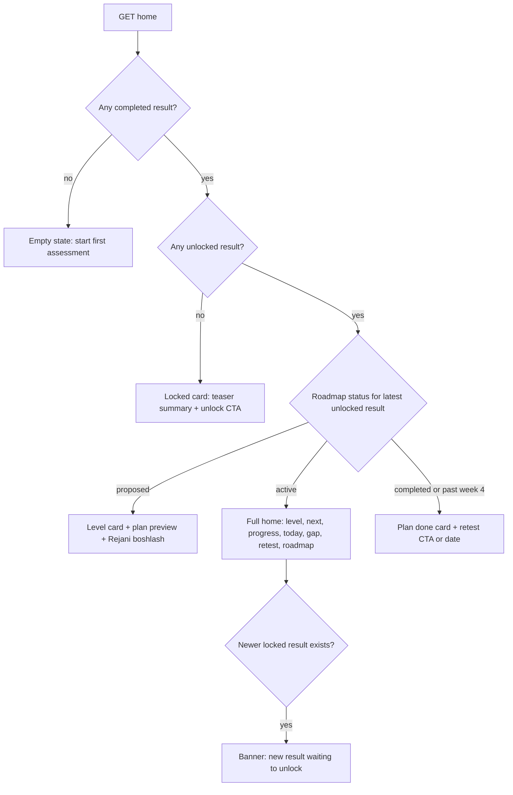

### 15.2 Layout (active plan)

```text
+------------------------------------------+
|  Mening oʻsishim                UZ RU EN  |
|  +-------------------------------------+  |
|  | Tadbirkor                           |  |  profession (switcher if 2+ professions)
|  | LEVEL 4 · Amaliyotchi   BAHOLANGAN  |  |  assessed badge (VERIFIED slot hidden, 02 F17)
|  | Keyingi: LEVEL 5 · Professional     |  |
|  | [##############------]  41 / 45     |  |  progress bar (02 D23)
|  | 2 ta talab hali bajarilmagan        |  |
|  +-------------------------------------+  |
|                                           |
|  Bugungi asosiy ish                       |
|  +-------------------------------------+  |
|  | 3-kun · 15 daqiqa · Moliyaviy       |  |  ONE main action
|  | nazorat                             |  |
|  | Oxirgi 30 kunlik xarajatlarni       |  |  illustrative title
|  | 5 toifaga ajrating                  |  |
|  | Nega?  v                            |  |  expandable why
|  | [ Bajarildi ]   Oʻtkazib yuborish   |  |
|  +-------------------------------------+  |
|  Qoʻshimcha (ixtiyoriy)                   |
|  [ 10 daqiqa · ... ] [ 10 daqiqa · ... ]  |  up to 2 optional, compact
|                                           |
|  Asosiy toʻsiq: Moliyaviy nazorat 38 → 50 |  main gap
|  Harakatlar LEVELni avtomatik oshirmaydi… |  honesty note (small)
|                                           |
|  Qayta baholash: 15-oktabrdan             |  or "Qayta baholash mavjud" + button
|                                           |
|  Yoʻl xaritasi                            |
|  [1 ok][2 ok][3 *][4][5][6][7]            |  7-day strip: done / skipped / today / upcoming
|  2-hafta · 3-hafta · 4-hafta              |  week milestones
+------------------------------------------+
| Bosh sahifa  |  Tarix  |  Taklif          |  bottom nav
+------------------------------------------+
```

### 15.3 Rules

- **Today's main** = earliest `pending` main item with `day_number ≤ current_day` (02 D18), where
  `current_day = days between roadmap.started_at and today in profiles.timezone + 1` (timezone from the browser at
  session creation; default `Asia/Tashkent`). If that item's day is before today, show `home.today.catchUp`.
- After day 7, the main item is the current week's milestone (W2–W4).
- **Optional** = up to 2 pending non-main items of the same day, else actions for the top-2 weak skills not
  already in the plan.
- *Bajarildi* / *Oʻtkazib yuborish* → `POST roadmap-items/{id}/complete|skip` (optimistic UI, rollback on error,
  `impactOccurred('light')`). No streaks, no "you missed" language.
- Progress bar only changes with a new result (02 D23); the honesty note says so.
- Retest line from `retest-eligibility`: cooldown date, or *Qayta baholash mavjud* (→ S16), or a credit
  (*1 ta kutishsiz qayta baholash*).

### 15.4 States

| State | UI | Copy key |
|-------|----|----------|
| Loading | Level card skeleton, action card skeleton | — |
| Empty (no result) | Illustration-free card + CTA *Testni boshlash* → S03 | `home.empty.*` |
| Locked only | Teaser summary (strongest, blocker) + unlock CTA → S08 | `home.locked.*` |
| Proposed plan | Level card + 7-day preview + *Rejani boshlash* | `home.planProposed` |
| All done today | Main card replaced by `home.today.allDone` with tomorrow's title | `home.today.allDone` |
| Skipped today | `home.today.skipped` + tomorrow's title | `home.today.skipped` |
| Plan done | `home.planDone` + retest CTA or date | `home.planDone` |
| Newer locked result | Banner at top with unlock CTA | `home.newLocked` |
| Action update failed | Card reverts, toast `err.generic` | — |
| Anonymous web user | Account-linking card (S14) under the roadmap | — |

TMA: no MainButton (bottom nav visible), BackButton hidden; language pill in content.

### 15.5 Copy

| Key | uz | ru | en |
|-----|----|----|----|
| `home.title` | Mening oʻsishim | Мой рост | My growth |
| `home.level` | LEVEL {n} · {name} | LEVEL {n} · {name} | LEVEL {n} · {name} |
| `home.next` | Keyingi: LEVEL {n} · {name} | Следующий: LEVEL {n} · {name} | Next: LEVEL {n} · {name} |
| `home.progress` | {score} / {target} | {score} / {target} | {score} / {target} |
| `home.unmet` | {count} ta talab hali bajarilmagan | Невыполненных требований: {count} | {count} requirements still open |
| `home.today.title` | Bugungi asosiy ish | Главное на сегодня | Today's main action |
| `home.today.optional` | Qoʻshimcha (ixtiyoriy) | Дополнительно (по желанию) | Optional extras |
| `home.today.done` | Bajarildi | Сделано | Done |
| `home.today.skip` | Oʻtkazib yuborish | Пропустить | Skip |
| `home.today.why` | Nega? | Почему? | Why? |
| `home.today.catchUp` | Oldingi kundan qolgan ish — shu yerdan davom etamiz. | Задание с прошлого дня — продолжим с него. | Left over from an earlier day; let us continue from here. |
| `home.today.allDone` | Bugungi asosiy ish bajarildi. Ertaga: {title} | Главное на сегодня сделано. Завтра: {title} | Today's main action is done. Tomorrow: {title} |
| `home.today.skipped` | Bugungi ish oʻtkazib yuborildi. Ertaga: {title} | Задание на сегодня пропущено. Завтра: {title} | Today's action was skipped. Tomorrow: {title} |
| `home.gap` | Asosiy toʻsiq: {skill} {current} → {needed} | Главное препятствие: {skill} {current} → {needed} | Main blocker: {skill} {current} → {needed} |
| `home.actionsNote` | Harakatlar LEVELni avtomatik oshirmaydi. Oʻsishingiz qayta baholashda koʻrinadi. | Действия не повышают LEVEL автоматически. Рост будет виден при повторной оценке. | Actions do not raise your LEVEL automatically. Your growth shows up in a retest. |
| `home.retest.available` | Qayta baholash mavjud | Повторная оценка доступна | Retest available |
| `home.retest.date` | Qayta baholash: {date}dan | Повторная оценка: с {date} | Retest available from {date} |
| `home.retest.credit` | Sizda {count} ta kutishsiz qayta baholash bor | Повторных оценок без ожидания: {count} | You have {count} retest(s) without waiting |
| `home.roadmap.title` | Yoʻl xaritasi | Дорожная карта | Roadmap |
| `home.week` | {n}-hafta | Неделя {n} | Week {n} |
| `home.empty.title` | Hali natija yoʻq | Пока нет результатов | No results yet |
| `home.empty.body` | 3–5 daqiqalik testdan boshlang. | Начните с теста на 3–5 минут. | Start with a 3–5 minute test. |
| `home.empty.cta` | Testni boshlash | Начать тест | Start the test |
| `home.locked.title` | Natijangiz ochilishini kutmoqda | Ваш результат ждёт открытия | Your result is waiting to be unlocked |
| `home.planProposed` | 7 kunlik rejangiz tayyor | Ваш план на 7 дней готов | Your 7-day plan is ready |
| `home.planDone` | 30 kunlik reja yakunlandi. Oʻsishingizni qayta baholashda tekshiring. | 30-дневный план завершён. Проверьте свой рост повторной оценкой. | Your 30-day plan is complete. Check your growth with a retest. |
| `home.newLocked` | Yangi natijangiz ochilishini kutmoqda | Ваш новый результат ждёт открытия | Your new result is waiting to be unlocked |
| `nav.home` / `nav.history` / `nav.invite` | Bosh sahifa / Tarix / Taklif | Главная / История / Пригласить | Home / History / Invite |

---

## S16 — Retest with cooldown

**Route:** `/{locale}/retest/{profession}`. Cooldown = `professions.config.retest_cooldown_days` (default 14) from
the last completed session of that profession, unless the user has a `retest` entitlement (brief §6).

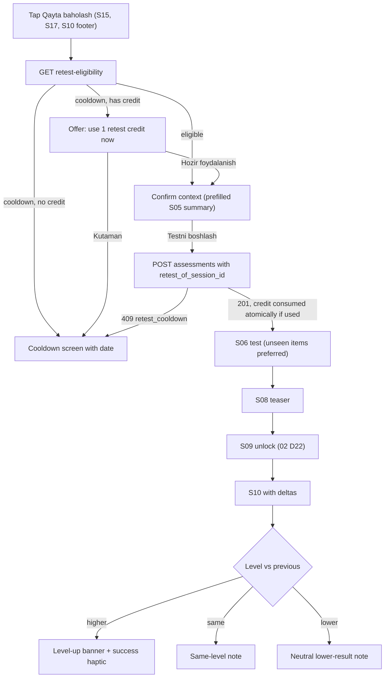

- Deltas appear inside section 4 (*Qayerdasiz?*) as a strip "LEVEL 4 → 5" and as `+6` / `−3` chips on skill bars,
  compared with the previous unlocked result of the same profession. If the previous result was never unlocked,
  no deltas are shown (the user never paid to see those numbers).
- Level-up: confetti only without `prefers-reduced-motion`; never shown for a lower result.
- `retest_started` is emitted by the server on session creation.

| State | UI |
|-------|----|
| Loading eligibility | Button spinner |
| Cooldown | Date, explanation, *Rejaga qaytish* → S15 (TMA MainButton) |
| Credit available | Two buttons: *Hozir foydalanish* / *Kutaman* |
| Eligible | Context summary + *Testni boshlash* (TMA MainButton) |
| In-progress session for this profession | Redirect to S06 resume |

| Key | uz | ru | en |
|-----|----|----|----|
| `retest.title` | Qayta baholash | Повторная оценка | Retest |
| `retest.cooldown.title` | Qayta baholash {date}dan mavjud | Повторная оценка будет доступна с {date} | Retest available from {date} |
| `retest.cooldown.body` | Oʻsish uchun vaqt kerak. Shu kunlarda rejadagi ishlarni bajaring — natijada farq aniqroq koʻrinadi. | Для роста нужно время. Выполняйте задания плана — так разница будет заметнее. | Growth takes time. Work through your plan in the meantime so the difference is clearer. |
| `retest.backToPlan` | Rejaga qaytish | Вернуться к плану | Back to my plan |
| `retest.credit.body` | Sizda {count} ta kutishsiz qayta baholash bor. Hozir foydalanasizmi? | У вас есть повторная оценка без ожидания ({count}). Использовать сейчас? | You have {count} retest(s) without waiting. Use one now? |
| `retest.credit.use` | Hozir foydalanish | Использовать сейчас | Use it now |
| `retest.credit.wait` | Kutaman | Подожду | I will wait |
| `retest.confirm.title` | Maʼlumotlaringiz oʻzgardimi? | Изменились ли ваши данные? | Has anything changed? |
| `retest.confirm.edit` | Oʻzgartirish | Изменить | Change |
| `retest.start` | Testni boshlash | Начать тест | Start the test |
| `retest.levelUp` | Tabriklaymiz! LEVEL {from} → LEVEL {to} | Поздравляем! LEVEL {from} → LEVEL {to} | Congratulations! LEVEL {from} → LEVEL {to} |
| `retest.same` | LEVEL oʻzgarmadi. Koʻnikmalar boʻyicha oʻzgarishlarni pastda koʻring. | LEVEL не изменился. Изменения по навыкам смотрите ниже. | Your LEVEL is the same. See skill changes below. |
| `retest.lower` | Bu safar natija pastroq chiqdi. Bu sizning qadringizni oʻlchamaydi: savollar va kun holati natijaga taʼsir qilishi mumkin. | В этот раз результат ниже. Это не мера вашей ценности: на результат влияют вопросы и состояние в этот день. | Your result is lower this time. That does not measure your worth; the question set and how your day went can affect it. |

---

## S17 — History timeline

**Route:** `/{locale}/history`. `GET /api/v1/history?cursor=` (20 per page, newest first), grouped by month.

Item types:

| Type | Source | Row content | Tap |
|------|--------|-------------|-----|
| Result (unlocked) | `assessment_results` + unlock | Date · profession · `LEVEL n` · confidence · delta vs previous same-profession unlocked result | S10 |
| Result (locked) | no unlock | Date · profession · *Yopiq natija* · *Ochish* | S08 |
| Level change | `level_history` (assessed) | "LEVEL 4 → 5" | S10 of that result |
| Plan started / completed | `roadmaps` | "7 kunlik reja boshlandi" / "30 kunlik reja yakunlandi" | S15 |
| Reward granted | `referral_reward_grants` | "Mukofot: 1 ta kutishsiz qayta baholash" | S13 |
| Abandoned / expired tests | — | not shown (no noise, no shame) | — |

States: loading (5 row skeletons), empty (`history.empty` + *Testni boshlash*), error card with retry, end of list
(no "load more" button; infinite scroll with a sentinel and a manual *Yana koʻrsatish* fallback).

| Key | uz | ru | en |
|-----|----|----|----|
| `history.title` | Tarix | История | History |
| `history.empty` | Hali tarix yoʻq. Birinchi baholashdan boshlang. | Истории пока нет. Начните с первой оценки. | No history yet. Start with your first assessment. |
| `history.locked` | Yopiq natija | Закрытый результат | Locked result |
| `history.unlock` | Ochish | Открыть | Unlock |
| `history.levelChange` | LEVEL {from} → LEVEL {to} | LEVEL {from} → LEVEL {to} | LEVEL {from} → LEVEL {to} |
| `history.planStarted` | 7 kunlik reja boshlandi | План на 7 дней начат | 7-day plan started |
| `history.planDone` | 30 kunlik reja yakunlandi | 30-дневный план завершён | 30-day plan completed |
| `history.reward` | Mukofot: {reward} | Награда: {reward} | Reward: {reward} |
| `history.more` | Yana koʻrsatish | Показать ещё | Show more |

---

## S18 — Account & settings

**Route:** `/{locale}/account`. Sections: Language (UZ/RU/EN), *Kartadagi ism* (first name used on share cards,
optional), *Bogʻlangan hisoblar* (Telegram ✓/link, phone masked `+998 •• ••• •• 12`/link; web only for linking),
*Maʼlumotlarimni oʻchirish* (02 D27), legal links, support contact.

Deletion: confirm dialog with `account.delete.body`; typed confirmation not required (one extra confirm tap);
on success the session ends and the user lands on S01 with toast `account.deleted`.

| Key | uz | ru | en |
|-----|----|----|----|
| `account.title` | Hisob | Аккаунт | Account |
| `account.language` | Til | Язык | Language |
| `account.shareName` | Kartadagi ism | Имя на карточке | Name on share cards |
| `account.linked` | Bogʻlangan hisoblar | Привязанные аккаунты | Linked accounts |
| `account.delete` | Maʼlumotlarimni oʻchirish | Удалить мои данные | Delete my data |
| `account.delete.body` | Hisobingiz yopiladi: natijalar, kartalar va taklif havolangiz boshqa koʻrinmaydi, shaxsiy maʼlumotlaringiz oʻchiriladi. Toʻlov yozuvlari buxgalteriya uchun shaxsingizga bogʻlanmagan holda saqlanadi. Bu amalni ortga qaytarib boʻlmaydi. | Аккаунт будет закрыт: результаты, карточки и реферальная ссылка станут недоступны, личные данные будут удалены. Записи о платежах сохраняются для бухгалтерии без привязки к вашей личности. Действие нельзя отменить. | Your account will be closed: results, cards and your referral link will no longer be available, and your personal data will be removed. Payment records are kept for accounting without your personal details. This cannot be undone. |
| `account.delete.confirm` | Ha, oʻchirish | Да, удалить | Yes, delete |
| `account.deleted` | Maʼlumotlaringiz oʻchirildi | Ваши данные удалены | Your data has been deleted |
| `account.support` | Qoʻllab-quvvatlash xizmati | Поддержка | Support |

---

## 19. Common copy

| Key | uz | ru | en |
|-----|----|----|----|
| `action.retry` | Qayta urinish | Повторить | Try again |
| `action.back` | Orqaga | Назад | Back |
| `action.continue` | Davom etish | Продолжить | Continue |
| `action.home` | Bosh sahifa | На главную | Home |
| `action.close` | Yopish | Закрыть | Close |
| `err.offline` | Internet aloqasi yoʻq. Ulanish tiklangach davom etamiz. | Нет подключения к интернету. Продолжим, когда связь восстановится. | No internet connection. We will continue when you are back online. |
| `err.generic` | Nimadir notoʻgʻri ketdi. Qayta urinib koʻring. | Что-то пошло не так. Попробуйте ещё раз. | Something went wrong. Please try again. |
| `err.rateLimited` | Juda koʻp soʻrov. Bir necha soniyadan soʻng qayta urinib koʻring. | Слишком много запросов. Попробуйте через несколько секунд. | Too many requests. Try again in a few seconds. |
| `err.notYours` | Bu natija boshqa hisobga tegishli. Testni topshirgan qurilma yoki Telegram orqali kiring. | Этот результат принадлежит другому аккаунту. Откройте его на том устройстве или в том Telegram, где проходили тест. | This result belongs to another account. Open it on the device or Telegram account you used for the test. |
| `err.notFound` | Sahifa topilmadi | Страница не найдена | Page not found |
| `err.tmaSession` | Sessiya muddati tugadi. LEVELni yopib, qayta oching. | Сессия истекла. Закройте и снова откройте LEVEL. | Your session has expired. Close and reopen LEVEL. |
| `err.tmaOutdated` | Telegram ilovangizni yangilang yoki LEVELni brauzerda oching. | Обновите Telegram или откройте LEVEL в браузере. | Please update Telegram or open LEVEL in your browser. |
| `err.maintenance` | Texnik ishlar olib borilmoqda. Javoblaringiz saqlangan — birozdan soʻng qayting. | Идут технические работы. Ваши ответы сохранены — вернитесь чуть позже. | We are doing maintenance. Your answers are saved; please come back a little later. |
| `common.disclaimer.value` | see S01 | see S01 | see S01 |
| `common.disclaimer.educational` | see S08 | see S08 | see S08 |

---

## 20. Edge-case index

| # | Situation | Behaviour |
|---|-----------|-----------|
| 1 | Two tabs answering the same session | Second tab's submit gets 409 → re-syncs to the server's pending item |
| 2 | User starts a test on web, continues in TMA | Possible only after linking (S14); otherwise TMA starts a new session for the Telegram user |
| 3 | Result link opened on another device | 403 → `err.notYours` with linking options; nothing about the result is revealed |
| 4 | Paid on phone A, opens result on phone B (linked) | Server unlock applies to the merged user; S10 renders |
| 5 | Payment succeeds after the user closed the app | Next visit to S08/S15 shows the result as unlocked (server state) |
| 6 | Provider callback arrives before the return redirect | Return page's first poll already sees `paid` |
| 7 | Payment `paid` but webhook delayed > 5 min | Slow state; reconciliation (02 §3.3) and admin view catch it |
| 8 | Price changed while sheet open | Server uses the price at payment creation; the sheet refreshes options when reopened |
| 9 | User switches language on S10 | Report re-renders from i18n content; AI paragraph hidden if not in that locale |
| 10 | Referral link opened by an existing user | No attribution change (first touch, no prior session rule) |
| 11 | Share card owner deletes data | `/s/{slug}` returns 410 |
| 12 | Refund | Unlock removed, cards revoked, S10 → S08 with `result.refunded`, referral "paid" counter decremented |
| 13 | Profession archived after a result | Result and history stay readable; retest and new tests for it are blocked with `err.notFound` on S04 |
| 14 | Question retired after being served in an in-progress session | Pending item is still answerable (immutable version); not served again |
| 15 | Clock skew on device | All dates and cooldowns are computed server-side; the client only formats them |
| 16 | Link token arrives for a user who also has a referral cookie | `start_param` carries one value; a link-token launch never creates referral attribution (merged identities are invalid referrals, brief §10) |
| 17 | User on Telegram older than 6.2 | S00 shows `err.tmaOutdated` with a link to the web version |
| 18 | Very long skill or profession names on cards | Card renderer clamps to 2 lines with ellipsis; full text stays on S10 |
