# 04 — Database Design and ERD

> **Scope.** The Postgres schema of LEVEL: conventions, entity-relationship diagrams per domain, per-table
> specifications (columns, types, constraints, indexes, RLS, retention), the data lifecycle (anonymous-user merge,
> result immutability, auditability through versions, deletion, retention), the pgvector plan, partitioning of
> `analytics_events`, and the content seed/versioning strategy.
>
> **Sources of truth.** The engineering brief (§4 Database, §5 RLS) governs. The SQL files in `supabase/migrations/`
> are the single source of truth for the *implemented* schema; this document describes them (files `…000100` to
> `…001400`) and specifies the **Planned** additive changes that later migrations must implement. A PR that adds a
> migration updates this document in the same PR. Where the brief is silent, this document records a **Decision:**.
>
> **Related.** `01-architecture.md` (§3.1 table ownership per module, §3.5 merge participants, §7 request lifecycles,
> §15 scaling), `02-mvp-spec.md` (F19 identity/deletion, F21 analytics, F22 feedback, D-log), `12-folder-structure.md`
> (§5 content, migrations list), `13-build-phases.md`.

## Contents

1. [Conventions](#1-conventions)
2. [Domain map](#2-domain-map)
3. [Identity](#3-identity)
4. [Catalog](#4-catalog)
5. [Assessment](#5-assessment)
6. [Results](#6-results)
7. [Payments](#7-payments)
8. [Sharing and referrals](#8-sharing-and-referrals)
9. [Growth, roadmaps and verification](#9-growth-roadmaps-and-verification)
10. [Evidence](#10-evidence)
11. [Analytics and experiments](#11-analytics-and-experiments)
12. [Organizations and ops](#12-organizations-and-ops)
13. [Payment integrity in SQL](#13-payment-integrity-in-sql)
14. [Data lifecycle](#14-data-lifecycle)
15. [pgvector usage plan](#15-pgvector-usage-plan)
16. [`analytics_events` partitioning and retention](#16-analytics_events-partitioning-and-retention)
17. [Content seed and versioning strategy](#17-content-seed-and-versioning-strategy)
18. [Migration practice](#18-migration-practice)
19. [Hot queries and the indexes that serve them](#19-hot-queries-and-the-indexes-that-serve-them)
20. [Alignment notes (implemented vs. specified)](#20-alignment-notes-implemented-vs-specified)
21. [Decision log](#21-decision-log)

### Notation used in the table specifications

| Mark | Meaning |
|------|---------|
| `PK` / `UQ` / `FK → t(c)` | primary key / unique / foreign key; the FK action follows (`cascade`, `restrict`, `set null`) |
| `NN` | NOT NULL |
| `D x` | DEFAULT x |
| `CK …` | CHECK constraint |
| `i18n` / `i18n!` | jsonb guarded by `public.is_i18n()` (optional) / `public.is_i18n_nonempty()` (required) |
| `upd` | table has `updated_at timestamptz NN D now()` maintained by the `set_updated_at` BEFORE UPDATE trigger |
| **Planned** | not in the applied migrations yet; must be added by a new migration (see §20) |
| RLS **Public** | anon + authenticated may SELECT rows passing a visibility filter (active / verified) |
| RLS **Own** | authenticated may SELECT rows where the owner column = `auth.uid()` |
| RLS **Own+unlocked** | own AND `public.is_result_unlocked(result_id)` |
| RLS **Server-only** | RLS on, no policy, no table privileges for anon/authenticated |

Every table has RLS enabled (migration `…001200_rls.sql` loops over all `public` tables). The server connects with a
privileged role and is the primary gate; RLS is defense in depth (brief §5).

---

## 1. Conventions

### 1.1 Naming

- Schemas: `public` (all application tables), `auth` (Supabase; emulated locally by
  `scripts/db/supabase-local-shim.sql`), `extensions` (Supabase extension schema: `citext` and, when present, pgvector
  live here, never in the API-exposed `public`; plain local Postgres uses its default creation schema),
  `level_meta` (ledger of the local migration runner: `level_meta.migrations(name PK, checksum, applied_at)`).
- Tables: snake_case plural nouns (`assessment_sessions`); association tables name both sides
  (`organization_members`, `specialization_skill_weights`).
- Columns: snake_case. FKs `<entity>_id`; booleans `is_*`, `show_*`, `*_opt_in`, `requires_*`; instants `*_at`;
  money `*_minor`; arrays plural (`skill_ids`, `tags`); hashes `*_hash`.
- Indexes `<table>_<purpose>_idx`; unique indexes `<table>_<purpose>_key`; named constraints `<table>_<rule>`
  (inline CHECKs get Postgres's generated `<table>_<column>_check`); triggers carry the name of their function.
- Functions: `public.<verb>_<noun>()`, always `set search_path = ''` with schema-qualified references (prevents
  search-path hijacking of SECURITY DEFINER code).

### 1.2 Primary keys

| Kind | Rule | Tables |
|------|------|--------|
| Surrogate uuid | `id uuid PK D gen_random_uuid()` | all entity tables |
| Natural code | identity *is* the code | `languages(code)`, `currencies(code)`, `countries(code)`, `app_settings(key)`, `ai_cache(key)` |
| Composite | pure associations and counters | `specialization_skill_weights`, `skill_prerequisites` (+`relation`), `user_skills`, `experiment_assignments`, `organization_members`, `rate_limits` |
| 1:1 extension | PK = FK | `profiles(user_id)` |
| `bigint` identity | very high-volume append-only | `analytics_events` |

uuids are minted by the database (or the server), are not enumerable, and survive user merges unchanged. Public
surfaces never expose uuids of other users' data: share pages use `share_cards.slug`, referral links use
`referral_codes.code`. **Decision:** uuid v4 (`gen_random_uuid()`, core since Postgres 13, so no pgcrypto). The random insert locality of v4
is acceptable at the planned scale (01 §15); the one table where it would matter, `analytics_events`, uses `bigint`.

### 1.3 Timestamps

- `timestamptz` everywhere, stored and compared in UTC; rendering applies `profiles.timezone`.
- Mutable tables: `created_at NN D now()` and `updated_at NN D now()` + `set_updated_at` trigger.
- Append-only tables carry only their event time: `skill_scores`, `level_scores` (`created_at`), `result_unlocks`
  (`created_at`), `share_events`, `payment_events` (`received_at`, `processed_at`), `referral_reward_grants`
  (`granted_at`), `skill_history` / `level_history` (`recorded_at`), `analytics_events` (`occurred_at`,
  `received_at`), `audit_logs`, `ai_usage`, `benchmarks` (`computed_at`).
- Domain instants (`paid_at`, `completed_at`, `served_at`, `answered_at`, …) are set by the server. `now()` is the
  transaction start time, so every row written in one transaction shares it (e.g. `payments.paid_at =
  result_unlocks.created_at`), which makes audits easy. `clock_timestamp()` is used only for rate-limit windows.
- The only client-influenced instant is `analytics_events.occurred_at` for buffered UI events; the server clamps it
  (§16.2).
- Provider timestamps stay in provider format where the provider protocol needs them back
  (`provider_transactions.create_time` etc. are Payme millisecond epochs, `bigint`).

### 1.4 Enum-like columns: `text` + CHECK

Enumerations are `text` with an in-list CHECK, never Postgres `enum` types, so adding a value is a constraint swap
inside a normal transactional migration:

```sql
alter table public.payments
  drop constraint payments_provider_check,
  add constraint payments_provider_check
    check (provider in ('click', 'payme', 'telegram_stars', 'stripe', 'mock', 'uzum')) not valid;
alter table public.payments validate constraint payments_provider_check;  -- scans without blocking writes
```

Removing a value requires migrating rows first. **Decision:** every CHECK in-list has a TypeScript twin (`as const`
tuple in the owning module's `domain/types.ts`); an integration test reads the in-lists from `pg_constraint`
(`pg_get_constraintdef`) and fails on drift.

Value sets shared by several tables (change them together, in one migration):

| Value set | Values | Tables |
|-----------|--------|--------|
| payment provider | `click`, `payme`, `telegram_stars`, `stripe`, `mock` | `payment_provider_configs`, `payments`, `provider_transactions`, `payment_events`, `subscriptions` |
| channel | `web`, `telegram`, `mobile` (+ `server` in analytics) | `auth_sessions`, `assessment_sessions`, `analytics_events` |
| goal type | `start`, `find_job`, `professional`, `increase_income`, `lead`, `expert`, `first_job`, `manager`, `build_business`, `scale_business`, `change_career` | `profiles`, `goals` |
| budget | `free`, `low`, `medium`, `high` | `profiles`, `goals`, `actions` |
| entitlement | `deep_analysis`, `verification_attempt`, `retest`, `growth_os` (+ `result_unlock` on products) | `products`, `entitlements`, `referral_reward_rules` |
| grant source | `payment`, `referral_reward`, `subscription`, `admin`, `promo` | `result_unlocks`, `entitlements` |
| confidence | `high`, `medium`, `low` | `assessment_results`, `skill_scores`, `claims` |
| content status | `draft`, `active`, `archived` | `professions`, `specializations`, `skills`, `actions`, `do_not_rules`, `verification_tasks` |
| verification status | `unverified`, `verified`, `rejected` | `sources`, `learning_resources` |

### 1.5 Localized content (jsonb, plainly named)

- Localized columns have plain names (`name`, `description`, `prompt`, `label`, `message`…) and type `jsonb` holding
  `{"uz": "…", "ru": "…", "en": "…"}`. Unlimited locales by design: any key matching
  `^[a-z]{2,3}(-[A-Za-z0-9]{2,8})*$` (e.g. a future `uz-Cyrl`), registered in `languages`.
- Guards (migration `…000100`):
  - `public.is_i18n(v)` — object, BCP-47-like keys, all values strings (`{}` is valid; `NULL` passes, for optional
    columns);
  - `public.is_i18n_nonempty(v)` — plus at least one non-blank value (required columns);
  - `public.has_required_locales(v)` — non-blank `uz`, `ru` and `en`; enforced by triggers when a question/option
    becomes `active`, and by `content:validate` for all other content (02 D5).
- Resolution at read time: requested → `languages.fallback_code` → `en` → `uz` (01 §16). Missing text is never
  machine-translated on the fly; unknown facts render "Yetarli ishonchli maʼlumot mavjud emas." / "Недостаточно
  достоверных данных." / "Not enough reliable information."
- Example (`skills.name`):

  ```json
  {"uz": "Mijozning asl ehtiyojini aniqlash", "ru": "Выявление истинной потребности клиента", "en": "Identifying the customer's real need"}
  ```

  Uzbek strings use U+02BB for oʻ/gʻ and U+02BC for the tutuq belgisi: `"Maʼlumotlarni tahlil qilish va toʻgʻri xulosa
  chiqarish"`. `content:lint-uz` rejects ASCII apostrophes in `uz` values.
- User-entered or original-language text is plain `text`, not i18n: `profiles.display_name`, `action_results.note`,
  `result_feedback.comment`, `sources.title` (a source is cited in its own language), `organizations.name`.

### 1.6 Money

- Every amount is `amount_minor bigint` + `currency char(3)` FK → `currencies(code)`; `currencies.minor_units` is the
  exponent. No floats, no `numeric` money, no cross-currency sums (aggregates always `group by currency`).

  | Currency | `minor_units` | Display | `amount_minor` |
  |----------|---------------|---------|----------------|
  | UZS | 2 (tiyin) | 1,000 soʻm | `100000` |
  | UZS | 2 | 14,900 soʻm | `1490000` |
  | XTR (Telegram Stars) | 0 | 5 ⭐ | `5` |
  | USD | 2 | $4.99 | `499` |

- Edge conversions live in provider adapters only: Payme amounts are tiyin (= `amount_minor`); Click amounts are soʻm
  with two decimals (= `amount_minor / 100`); Stars `total_amount` = `amount_minor` (exponent 0).
- **Decision (fee rounding):** `provider_fee_minor = round(amount_minor * fee_percent / 100) + fee_fixed_minor`, computed
  in SQL `numeric` (half away from zero), snapshotted on the payment at PAID time (01 §17). The fixed part is added only
  when `fee_currency` is NULL or equals the payment currency; otherwise it is 0 and `ops-checks` raises a warning.
- AI costs are `ai_usage.cost_usd_micros bigint` (1 USD = 1,000,000). FX rates live in `app_settings.fx`; `null` means
  unknown and is never guessed.

### 1.7 jsonb documents and the postgres.js camelCase transform

The server's postgres.js client (`src/lib/db/client.ts`) uses `transform: postgres.camel`. That transform maps column
names snake ⇄ camel **and recursively rewrites object keys inside `json`/`jsonb` values on read** (`min_questions` →
`minQuestions`); it does not touch keys on write. Rules that follow from this:

- **J1 — Decision:** structural keys inside jsonb written by the application or the seeder are stored in
  **camelCase** (`{"minQuestions": 7}`), so the stored spelling equals what the app reads and writes need no transform.
  The brief's snake_case field lists map 1:1 (`min_questions` ↔ `minQuestions`, `source_ids` ↔ `sourceIds`,
  `weak_skills` ↔ `weakSkills`). SQL that inspects jsonb uses the stored spelling: `config->>'retestCooldownDays'`.
  Documents built *inside* SQL functions (e.g. `team_assessments.aggregate_snapshot`) may use snake_case keys; the app
  receives them camelized, which is lossless as long as J2 holds.
- **J2 — Decision:** data values that may contain `_` (slugs, question keys, skill slugs) are never object keys; use
  arrays of objects (`question_versions = [{"questionId": …, "questionKey": "sales_specialist.discovery.03",
  "version": 2}]`). Safe as keys: locale codes, uuids, experience bands (`0`, `lt1`, `1to3`, `3to5`, `5plus`),
  percentile labels (`p10`…), and experiment keys (J3).
- **J3 — Decision:** experiment keys use only `[a-z0-9]`, `.` and `-` (e.g. `teaser.headline`, `price.full-report`,
  `assessment.length`) so `experiment_variants` maps such as `{"teaser.headline": "b"}` survive reads. (The CHECK on
  `experiments.key` must change — §20.)
- **J4 — Decision:** third-party payloads (`payment_events.payload`, `provider_transactions.raw`) are stored verbatim,
  with the provider's own key spelling, and are read for audit as text (`payload::text`) or inside SQL only — never
  round-tripped through the transform.
- **J5:** every jsonb column has a `jsonb_typeof` CHECK; the owning repository validates documents with zod on write
  (01 §18). Size bounds: `analytics_events.properties` ≤ 8 KB (CHECK) and ≤ 2 KB per client event (API);
  `assessment_results.report` ≤ 64 KB and `share_cards.public_payload` ≤ 4 KB (zod, **Decision**).

### 1.8 Array and polymorphic references

Postgres has no array foreign keys. These `uuid[]` columns are written only by the server or the seeder, which
validate every id; CHECK `array_position(col, null) is null` forbids NULL elements; the daily `integrity` job reports
dangling ids (§14.5):

| Column | Points to | Index |
|--------|-----------|-------|
| `assessment_questions.specialization_ids` | `specializations.id` (empty = all) | — (filtered in memory from the cached bank) |
| `assessment_sessions.served_question_ids` | `assessment_questions.id` (≤ 15) | — |
| `verification_tasks.skill_ids`, `learning_resources.skill_ids` | `skills.id` | GIN |
| `actions.resource_ids` | `learning_resources.id` | — |
| `actions.source_ids`, `do_not_rules.source_ids` | `sources.id` | — |

Polymorphic references (type + id; validated by registered resolvers in the owning module, 01 §3.5):

| Columns | Targets |
|---------|---------|
| `payments.target_type`, `target_id` | `assessment_result` → `assessment_results`, `verification_task` → `verification_tasks`, `subscription` → `subscriptions`, `none` (NULL id) |
| `skill_history.kind`, `source_id`; `level_history.kind`, `source_id` | `assessed` → `assessment_results`, `verified` → `verification_attempts` |
| `entitlements.source`, `source_ref` | payment id / referral reward grant id / subscription id / audit log id |
| `audit_logs.entity_type`, `entity_id` | any table (text id) |
| `ai_usage.ref_type`, `ref_id` | e.g. `assessment_result` |
| `content_embeddings.entity_type`, `entity_id` | §15 |

### 1.9 Deletes and foreign-key actions

- Users are **never hard-deleted** in the MVP (soft delete via `users.deleted_at`, 02 F19). FK actions are chosen so a
  future hard purge behaves correctly anyway: `cascade` for user-owned rows, `restrict` for financial and legal records
  (`payments.user_id`, `organizations.owner_user_id`), `set null` for logs (`audit_logs`, `ai_usage`,
  `analytics_events`, `share_events.user_id`, `app_settings.updated_by`).
- Catalog rows referenced by user data are protected with `restrict` (`assessment_sessions.profession_id`,
  `assessment_results.level_id`, `skill_scores.skill_id`, `assessment_answers.question_id`…). Content is archived
  (`status`), not deleted.
- Composite FKs `(specialization_id, profession_id) → specializations(id, profession_id)` and
  `(skill_id, profession_id) → skills(id, profession_id)` make cross-profession mix-ups impossible; triggers enforce the
  same for `skill_prerequisites`, `specialization_skill_weights`, `skill_scores` and answers, and
  `skills.profession_id` is immutable.
- **Ownership chains.** Composite FKs carry the owner along: `assessment_results (session_id, user_id) →
  assessment_sessions (id, user_id)`, and `result_unlocks` / `share_cards (result_id, user_id) → assessment_results (id,
  user_id)`, all `on update cascade deferrable initially deferred`. Re-pointing a session's `user_id` therefore moves its
  result, unlocks and share cards in the same statement, and a result can never belong to someone other than its
  session's owner. (Referential *actions* run immediately; only the existence check is deferred to COMMIT.)
- **Deferred verification triggers** (`create constraint trigger … deferrable initially deferred`) check cross-table
  invariants at COMMIT, so multi-statement operations (merge, refund, seeding) may touch rows in any order:
  `payments_verify`, `result_unlocks_verify`, `referrals_referrer_owns_code`, `assessment_questions_require_options`,
  `question_options_require_count`.

### 1.10 Privileges and RLS (summary of migration `…001200`)

- `revoke all` on every table and sequence from `anon`, `authenticated`; default privileges revoked too, so a new
  table is closed until a migration grants it. Supabase Data API exposure of `public` is disabled (01 D17).
- Public catalog SELECT (filtered to active/verified rows): `languages`, `countries`, `currencies`,
  `profession_categories`, `professions`, `specializations`, `skills`, `skill_prerequisites`, `levels`,
  `level_requirements`, `products`, `prices`, `learning_resources`, `sources`.
- Column-level grants: `assessment_sessions` without `ability_state` and `rng_seed`; `referrals` without `ip_hash`,
  `device_hash`, `first_payment_id`; UPDATE on `profiles` limited to non-privileged columns.
- SECURITY DEFINER helpers: `is_result_unlocked(uuid)`, `is_org_member(uuid)`, `is_org_admin(uuid)`,
  `team_assessment_aggregate(uuid)` (returns only the frozen, k-anonymous snapshot of a closed campaign).
- Functions: EXECUTE is revoked from `public`, `anon`, `authenticated` on every non-extension function in `public`
  (and by default privileges for future ones), then granted back only for the policy helpers and the team aggregate
  RPC; `rate_limit_hit` is `service_role` only.
- **Planned** `scripts/db/check-rls.ts` (12 §6) fails CI if any `public` table (including future partitions) lacks
  RLS.

---

## 2. Domain map

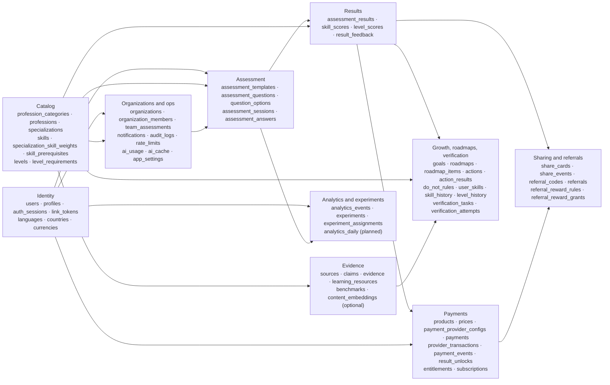

Arrows read "is referenced by". Ownership (only the owner module writes a table) follows 01 §3.1:

| Domain | Tables | Owner module(s) | Migration file |
|--------|--------|-----------------|----------------|
| Identity | `users`, `profiles`, `auth_sessions`, `link_tokens` (**Planned**) | identity | `…000200_identity.sql` |
| Reference | `languages`, `countries`, `currencies` | catalog | `…000200_identity.sql`, data in `…001400` |
| Catalog | `profession_categories`, `professions`, `specializations`, `skills`, `specialization_skill_weights`, `skill_prerequisites`, `levels`, `level_requirements` | catalog | `…000300_catalog.sql` |
| Assessment | `assessment_templates`, `assessment_questions`, `question_options`, `assessment_sessions`, `assessment_answers` | assessments | `…000400_assessments.sql` |
| Results | `assessment_results`, `skill_scores`, `level_scores`, `result_feedback` | results | `…000400_assessments.sql` |
| Verification | `verification_tasks`, `verification_attempts` | verification | `…000500_verification.sql` |
| Payments | `products`, `prices` (pricing); `payment_provider_configs`, `payments`, `provider_transactions`, `payment_events`, `result_unlocks`, `entitlements`, `subscriptions` (payments) | pricing, payments | `…000600_payments.sql` |
| Sharing / referrals | `share_cards`, `share_events` (sharing); `referral_codes`, `referrals`, `referral_reward_rules`, `referral_reward_grants` (referrals) | sharing, referrals | `…000700_sharing_referrals.sql` |
| Growth / roadmaps | `goals`, `user_skills`, `skill_history`, `level_history` (growth); `actions`, `do_not_rules`, `roadmaps`, `roadmap_items`, `action_results` (roadmaps) | growth, roadmaps | `…000800_growth.sql` |
| Evidence | `sources`, `claims`, `evidence`, `learning_resources`, `benchmarks`, `content_embeddings` | evidence | `…000900_evidence.sql`, `…001300_pgvector_optional.sql` |
| Analytics / experiments | `analytics_events`, `analytics_daily` (**Planned**); `experiments`, `experiment_assignments` | analytics, experiments | `…001000_analytics_experiments.sql` |
| Organizations / ops | `organizations`, `organization_members`, `team_assessments` (organizations); `notifications` (notifications); `ai_usage`, `ai_cache` (ai); `audit_logs`, `rate_limits`, `app_settings` (kernel) | several | `…001100_orgs_ops.sql` |

---

## 3. Identity

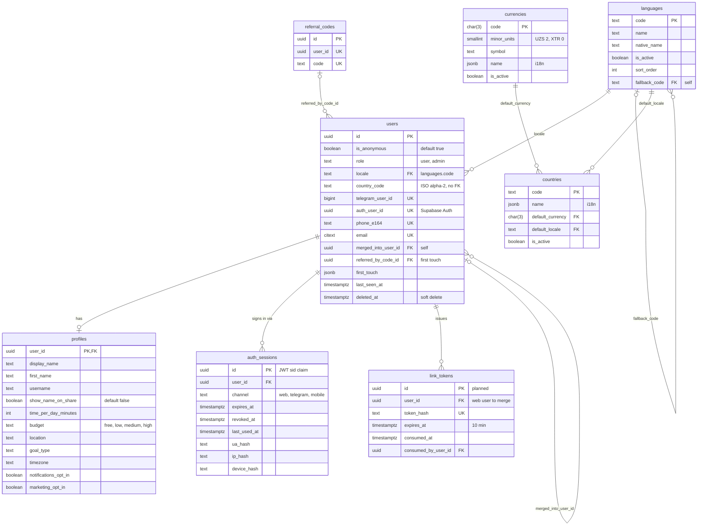

#### `users`

Anonymous-first accounts (no login wall); optionally linked to Telegram or a Supabase Auth phone/email identity.
Owner: identity. RLS: **Own** (`id = auth.uid()`). Retention: kept forever; soft delete anonymizes (§14.4).

| Column | Type | Constraints / notes |
|--------|------|---------------------|
| `id` | uuid | PK `D gen_random_uuid()`; the session JWT `sub` |
| `is_anonymous` | boolean | NN `D true`; becomes `false` when Telegram, phone or email is linked |
| `role` | text | NN `D 'user'` CK in (`user`, `admin`); set only by an audited admin operation |
| `locale` | text | NN `D 'uz'` FK → `languages(code)` on update cascade |
| `country_code` | text | CK `^[A-Z]{2}$`; deliberately not an FK (an unknown country never blocks a session) |
| `telegram_user_id` | bigint | UQ, CK > 0 |
| `auth_user_id` | uuid | UQ — Supabase Auth user id after OTP verification |
| `phone_e164` | text | UQ, CK `^\+[1-9][0-9]{6,14}$` |
| `email` | citext | UQ, CK length ≤ 254 and basic shape |
| `merged_into_user_id` | uuid | FK → `users(id)` set null; CK ≠ `id`; set once by merge (§14.1) |
| `referred_by_code_id` | uuid | FK → `referral_codes(id)` set null (added in `…000700`); write-once first-touch attribution |
| `first_touch` | jsonb | NN `D '{}'` object: `{refCode, cardSlug, utm: {source, medium, campaign, content, term}, landing, channel, at}` (J1) |
| `last_seen_at` | timestamptz | **Decision:** written at most once per 5 minutes per user to avoid a hot-row write on every request |
| `deleted_at` | timestamptz | soft-delete marker (02 F19) |
| `created_at`, `updated_at` | timestamptz | `upd` |

Indexes: unique btree for each UQ (NULLs are distinct, so many users have no Telegram id); `users_merged_into_user_id_idx`
(partial, `merged_into_user_id is not null`); `users_locale_idx`; `users_created_at_idx`; `users_referred_by_code_id_idx`
(partial). Trigger `users_referred_by_not_own_code` (in `…000700`) forbids attributing a user to their own code.
Invariant: the canonical user of any id is `public.canonical_user_id(id)` (follows `merged_into_user_id`, at most 5
hops); merges also flatten chains (§14.1), so in practice one hop suffices.

#### `profiles`

1:1 user-editable profile and planning preferences. Owner: identity. RLS: **Own** SELECT; UPDATE of
`display_name, first_name, show_name_on_share, time_per_day_minutes, budget, location, goal_type, timezone,
notifications_opt_in, marketing_opt_in` on the own row. Retention: anonymized on deletion.

| Column | Type | Constraints / notes |
|--------|------|---------------------|
| `user_id` | uuid | PK, FK → `users(id)` cascade |
| `display_name`, `first_name` | text | length 1–64 |
| `username` | text | Telegram username, server-managed (not client-updatable) |
| `show_name_on_share` | boolean | NN `D false` (brief: the user decides; default off) |
| `time_per_day_minutes` | integer | CK 5–480 (context answers 10/20/30/60, 02 D8) |
| `budget` | text | CK in budget set |
| `location` | text | length ≤ 120 |
| `goal_type` | text | CK in goal-type set |
| `timezone` | text | IANA name, length ≤ 64 |
| `notifications_opt_in`, `marketing_opt_in` | boolean | NN `D false` |
| `created_at`, `updated_at` | timestamptz | `upd` |

#### `auth_sessions`

Server-issued sessions backing the `level_session` JWT (`sid` claim); revocable. Owner: identity. RLS: **Server-only**.
Retention: **Decision** — the `prune` job deletes rows 90 days after `coalesce(revoked_at, expires_at)`.

| Column | Type | Constraints / notes |
|--------|------|---------------------|
| `id` | uuid | PK; JWT `sid` |
| `user_id` | uuid | NN FK → `users(id)` cascade; re-pointed on merge (02 F19) |
| `channel` | text | NN CK in (`web`, `telegram`, `mobile`) |
| `expires_at` | timestamptz | NN, CK `> created_at`; 180 days, sliding renewal (01 D17) |
| `revoked_at` | timestamptz | logout, deletion, admin action |
| `last_used_at` | timestamptz | **Decision:** updated at most once per hour |
| `ua_hash`, `ip_hash`, `device_hash` | text | ≤ 128 chars; HMAC-SHA256 with `HASH_SALT` (never raw values); `device_hash` from the `level_did` cookie (01 D9) |
| `created_at`, `updated_at` | timestamptz | `upd` |

Index: `auth_sessions_user_id_idx (user_id, created_at desc)`. Token validation: `select … where id = $sid and user_id
= $sub and revoked_at is null and expires_at > now()`.

#### `link_tokens` (**Planned**, migration `<ts>_identity_link_tokens.sql`, 01 D9, 02 D26)

One-time tokens that carry a web user into the Telegram Mini App (`startapp=lk_<token>`), 10-minute TTL, single use.
Owner: identity. RLS: **Server-only**. Retention: deleted by `prune` 7 days after `expires_at`.

| Column | Type | Constraints / notes |
|--------|------|---------------------|
| `id` | uuid | PK |
| `user_id` | uuid | NN FK → `users(id)` cascade — the web user to be merged |
| `token_hash` | text | NN UQ; `sha256` hex of the secret; the raw `lk_…` token is never stored |
| `expires_at` | timestamptz | NN; `created_at + interval '10 minutes'` |
| `consumed_at` | timestamptz | set atomically on use |
| `consumed_by_user_id` | uuid | FK → `users(id)` set null; CK `(consumed_at is null) = (consumed_by_user_id is null)` |
| `created_at` | timestamptz | NN `D now()` |

Single-use consumption is one statement (no read-then-write race):

```sql
update public.link_tokens
   set consumed_at = now(), consumed_by_user_id = $telegram_user_id
 where token_hash = $hash and consumed_at is null and expires_at > now()
returning user_id;
```

#### `languages`

UI/content locales; unlimited by design. Owner: catalog. RLS: **Public** (`is_active`). Retention: forever.

| Column | Type | Constraints / notes |
|--------|------|---------------------|
| `code` | text | PK, CK BCP-47-like `^[a-z]{2,3}(-[A-Za-z0-9]{2,8})*$` |
| `name`, `native_name` | text | NN 1–64 (e.g. `Uzbek` / `Oʻzbekcha`) |
| `is_active` | boolean | NN `D true` |
| `sort_order` | integer | NN `D 0` |
| `fallback_code` | text | FK → `languages(code)` on update cascade, set null; CK ≠ `code` (seed: `uz → en`, `ru → en`) |
| `created_at`, `updated_at` | timestamptz | `upd` |

#### `countries`

Countries the product is localized and priced for. Owner: catalog. RLS: **Public** (`is_active`). Retention: forever.

| Column | Type | Constraints / notes |
|--------|------|---------------------|
| `code` | text | PK, CK `^[A-Z]{2}$` |
| `name` | jsonb | NN `i18n!` |
| `default_currency` | char(3) | NN FK → `currencies(code)` |
| `default_locale` | text | NN FK → `languages(code)` |
| `is_active` | boolean | NN `D true` |
| `created_at`, `updated_at` | timestamptz | `upd` |

Indexes on both FKs. Adding a country = rows in `countries`, `prices`, `payment_provider_configs` (01 §17).

#### `currencies`

Currency exponent table. Owner: catalog. RLS: **Public** (`is_active`). Retention: forever.

| Column | Type | Constraints / notes |
|--------|------|---------------------|
| `code` | char(3) | PK, CK `^[A-Z]{3}$` (`XTR` = Telegram Stars) |
| `minor_units` | smallint | NN CK 0–4 (UZS 2, USD 2, XTR 0) |
| `symbol` | text | NN 1–8 chars (`soʻm`, `$`, `⭐`) |
| `name` | jsonb | NN `D '{}'` `i18n` |
| `is_active` | boolean | NN `D true` |
| `created_at`, `updated_at` | timestamptz | `upd` |

---

## 4. Catalog

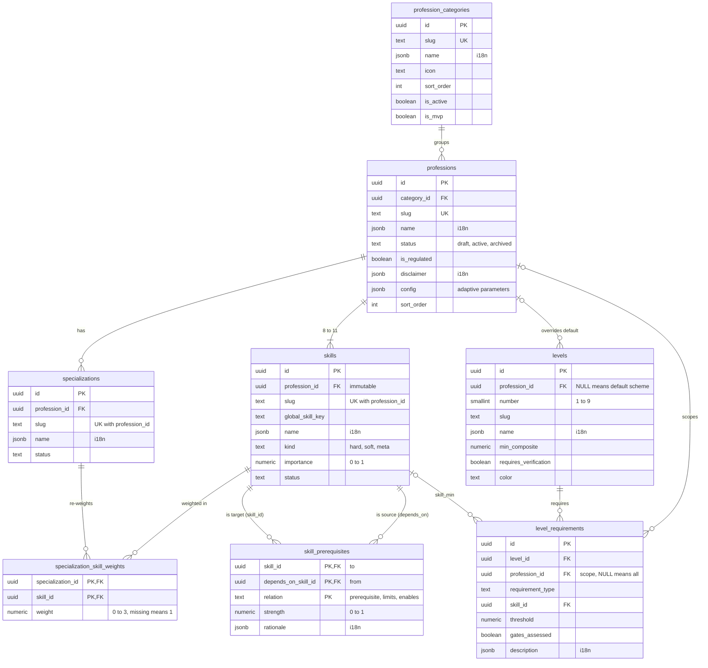

All catalog tables: owner catalog; RLS **Public** for active rows of active professions; retention forever (archived,
never deleted, because results reference them). Content comes from `content/` via the seeder (§17).

#### `profession_categories`

| Column | Type | Constraints / notes |
|--------|------|---------------------|
| `id` | uuid | PK |
| `slug` | text | NN UQ, CK `^[a-z][a-z0-9_]{1,63}$` (02 D6: `business`, `it`, `sales`, `marketing`, `management`, `accounting`, `design`, `students`, `education`, `driving`) |
| `name` | jsonb | NN `i18n!` |
| `description` | jsonb | NN `D '{}'` `i18n` |
| `icon` | text | ≤ 64 (lucide icon name) |
| `sort_order` | integer | NN `D 0` |
| `is_active`, `is_mvp` | boolean | NN (`D true`, `D false`) |
| `created_at`, `updated_at` | timestamptz | `upd` |

#### `professions`

| Column | Type | Constraints / notes |
|--------|------|---------------------|
| `id` | uuid | PK |
| `category_id` | uuid | NN FK → `profession_categories(id)` restrict |
| `slug` | text | NN UQ (`entrepreneur`, `software_developer`, `sales_specialist`, …) |
| `name` | jsonb | NN `i18n!` (e.g. `{"uz": "Tadbirkor", "ru": "Предприниматель", "en": "Entrepreneur"}`) |
| `description` | jsonb | NN `D '{}'` `i18n` |
| `status` | text | NN `D 'draft'` CK content status |
| `is_regulated` | boolean | NN `D false` |
| `disclaimer` | jsonb | `i18n`; CK `professions_regulated_disclaimer`: an active regulated profession must have one |
| `config` | jsonb | NN `D '{}'` object (J1): `{minQuestions: 7, maxQuestions: 15, targetQuestions: 12, targetSe: 0.45, retestCooldownDays: 14, experienceCaps: {"0": 4, "lt1": 5}, maxSelfReportItems: 2, minScenarioLikeItems: 2}`; missing keys fall back to the brief defaults |
| `sort_order` | integer | NN `D 0` |
| `created_at`, `updated_at` | timestamptz | `upd` |

Index: `professions_category_id_idx (category_id, sort_order)`.

#### `specializations`

| Column | Type | Constraints / notes |
|--------|------|---------------------|
| `id` | uuid | PK |
| `profession_id` | uuid | NN FK → `professions(id)` cascade |
| `slug` | text | NN; UQ `(profession_id, slug)` |
| `name` | jsonb | NN `i18n!` |
| `description` | jsonb | NN `D '{}'` `i18n` |
| `status` | text | NN `D 'active'` CK content status |
| `sort_order` | integer | NN `D 0` |
| `created_at`, `updated_at` | timestamptz | `upd` |

UQ `(id, profession_id)` is the target of the composite FKs from templates, sessions, results and team assessments.

#### `skills`

| Column | Type | Constraints / notes |
|--------|------|---------------------|
| `id` | uuid | PK |
| `profession_id` | uuid | NN FK → `professions(id)` cascade; immutable (trigger `skills_profession_immutable`) |
| `slug` | text | NN; UQ `(profession_id, slug)` |
| `global_skill_key` | text | cross-profession identity (e.g. `communication`); partial index where not null |
| `name` | jsonb | NN `i18n!` |
| `description` | jsonb | NN `D '{}'` `i18n` |
| `kind` | text | NN CK in (`hard`, `soft`, `meta`) |
| `importance` | numeric(6,4) | NN CK `0 < x ≤ 1` |
| `sort_order` | integer | NN `D 0` |
| `status` | text | NN `D 'active'` CK content status |
| `created_at`, `updated_at` | timestamptz | `upd` |

UQ `(id, profession_id)` backs composite FKs from questions, actions and do-not rules.

#### `specialization_skill_weights`

Per-specialization multiplier of skill importance (adjusted importance = `skills.importance × weight`; a missing row
means 1).

| Column | Type | Constraints / notes |
|--------|------|---------------------|
| `specialization_id` | uuid | PK part, FK → `specializations(id)` cascade |
| `skill_id` | uuid | PK part, FK → `skills(id)` cascade; trigger: same profession as the specialization |
| `weight` | numeric(6,4) | NN CK 0–3 |
| `created_at`, `updated_at` | timestamptz | `upd` |

#### `skill_prerequisites`

Directed skill graph used by the bottleneck engine (brief §8). Edge direction: `depends_on_skill_id` ("from") →
`skill_id` ("to"). `prerequisite`: learn *from* before *to*; `limits`: a weak *from* caps the value of a strong *to*;
`enables`: soft link.

| Column | Type | Constraints / notes |
|--------|------|---------------------|
| `skill_id` | uuid | PK part, FK → `skills(id)` cascade |
| `depends_on_skill_id` | uuid | PK part, FK → `skills(id)` cascade; CK ≠ `skill_id`; trigger: same profession |
| `relation` | text | PK part, CK in (`prerequisite`, `limits`, `enables`) |
| `strength` | numeric(4,3) | NN `D 1` CK 0–1 |
| `rationale` | jsonb | `i18n` — the explanation template ("Sotuv talab yaratadi, lekin ichki jarayonlar takrorlanmaydi.") |
| `created_at`, `updated_at` | timestamptz | `upd` |

Index on `depends_on_skill_id`. Acyclicity of `prerequisite` edges is checked by `content:validate` (a DB constraint
cannot express it cheaply).

#### `levels`

Level schemes 1..9. Rows with `profession_id IS NULL` are the default scheme (Starter 0 … Master 85); rows with a
profession override that number for that profession.

| Column | Type | Constraints / notes |
|--------|------|---------------------|
| `id` | uuid | PK |
| `profession_id` | uuid | FK → `professions(id)` cascade; NULL = default scheme |
| `number` | smallint | NN CK 1–9 |
| `slug` | text | NN (e.g. `practitioner`) |
| `name` | jsonb | NN `i18n!` |
| `short_description`, `meaning` | jsonb | NN `D '{}'` `i18n` |
| `min_composite` | numeric(5,2) | NN CK 0–100 (defaults 0, 15, 25, 35, 45, 55, 65, 75, 85) |
| `requires_verification` | boolean | NN `D false` (true for 8 Leader, 9 Master) |
| `color` | text | CK `^#[0-9A-Fa-f]{6}$` |
| `created_at`, `updated_at` | timestamptz | `upd` |

Partial unique indexes: `levels_profession_number_key (profession_id, number) where profession_id is not null` and
`levels_default_number_key (number) where profession_id is null`. Effective scheme of a profession:

```sql
select distinct on (l.number) l.*
  from public.levels l
 where l.profession_id = $profession_id or l.profession_id is null
 order by l.number, (l.profession_id is null);  -- profession override first
```

#### `level_requirements`

| Column | Type | Constraints / notes |
|--------|------|---------------------|
| `id` | uuid | PK |
| `level_id` | uuid | NN FK → `levels(id)` cascade |
| `profession_id` | uuid | FK → `professions(id)` cascade; scopes a requirement attached to a default-scheme level to one profession (NULL = all) |
| `requirement_type` | text | NN CK in (`composite_min`, `skill_min`, `verified_scenario`, `practical_action`, `experience_min`) |
| `skill_id` | uuid | FK → `skills(id)` cascade; CK required for `skill_min` |
| `threshold` | numeric(8,2) | CK required for `composite_min`, `skill_min` |
| `gates_assessed` | boolean | NN `D true` — `false` = shown as "to verify" but never blocks the ASSESSED level |
| `description` | jsonb | NN `D '{}'` `i18n` |
| `sort_order` | integer | NN `D 0` |
| `created_at`, `updated_at` | timestamptz | `upd` |

Indexes: `(level_id, sort_order)`, partial on `profession_id`, partial on `skill_id`. Requirements of profession P at
level L = rows of the effective level row of L where `profession_id is null or profession_id = P`. **Decision:** a
profession that overrides a level must carry that level's requirements itself (the validator enforces it); requirements
are not inherited from the overridden default row.

---

## 5. Assessment

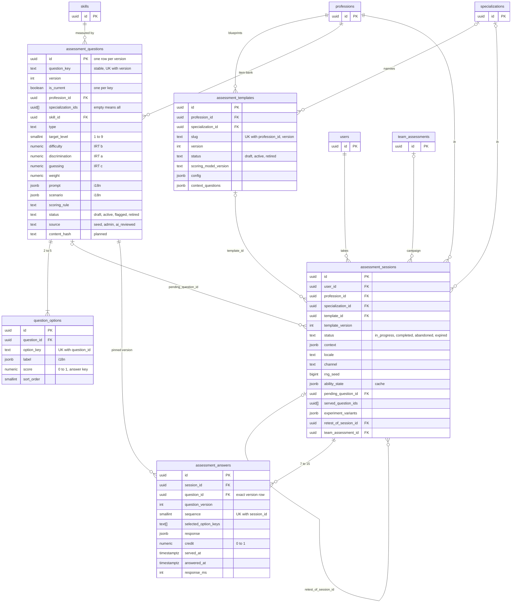

Owner: assessments. Item bank and options are **Server-only** (they contain answer keys and IRT parameters, brief §5).

#### `assessment_templates`

Versioned assessment blueprint per profession (optionally per specialization). RLS: **Server-only**. Retention:
forever.

| Column | Type | Constraints / notes |
|--------|------|---------------------|
| `id` | uuid | PK |
| `profession_id` | uuid | NN FK → `professions(id)` cascade |
| `specialization_id` | uuid | composite FK `(specialization_id, profession_id)` → `specializations(id, profession_id)` cascade |
| `slug` | text | NN CK `^[a-z][a-z0-9_-]{1,63}$` |
| `version` | integer | NN `D 1` CK > 0; UQ `(profession_id, slug, version)` |
| `status` | text | NN `D 'draft'` CK in (`draft`, `active`, `retired`) |
| `scoring_model_version` | text | NN `D 'irt2pl-eap-hier-v1'` |
| `config` | jsonb | NN `D '{}'` object; key-by-key override of `professions.config` (J1 keys) |
| `context_questions` | jsonb | NN `D '[]'` array of `{key, prompt, options: [{key, label, skillBoosts?, suggestsSpecialization?}]}` — up to 2 profession-specific questions after the global ones |
| `created_at`, `updated_at` | timestamptz | `upd` |

**Planned:** `assessment_templates_one_active_key` — unique `(profession_id, specialization_id) nulls not distinct
where status = 'active'` (one live blueprint per track); and a guard trigger making `config`, `context_questions`,
`scoring_model_version` immutable once any session references the row (a change creates `version + 1`, §17.4).

#### `assessment_questions`

Versioned IRT item bank (2PL + guessing). A row is one **version** of the item identified by the stable
`question_key` (`<profession>.<skill>.<nn>`, e.g. `sales_specialist.discovery.03`). RLS: **Server-only**. Retention:
forever (answered versions are evidence for every result that used them).

| Column | Type | Constraints / notes |
|--------|------|---------------------|
| `id` | uuid | PK — referenced by answers; identifies an exact version |
| `question_key` | text | NN CK `^[a-z0-9_]+(\.[a-z0-9_]+)*$`, ≤ 160 |
| `version` | integer | NN `D 1` CK > 0; UQ `(question_key, version)` |
| `is_current` | boolean | NN `D true`; the version new sessions may serve |
| `profession_id` | uuid | NN FK → `professions(id)` cascade |
| `specialization_ids` | uuid[] | NN `D '{}'`; empty = every specialization (**Decision**, §20 A1) |
| `skill_id` | uuid | NN; composite FK `(skill_id, profession_id)` → `skills(id, profession_id)` cascade |
| `type` | text | NN CK in (`knowledge`, `judgment`, `scenario`, `decision`, `self_report`, `open`) |
| `target_level` | smallint | NN CK 1–9 (content covers 2–8) |
| `difficulty` | numeric(6,3) | NN CK −6…6; IRT *b*; seeded as `(target_level − 5) × 0.7` (target 7 → 1.4) |
| `discrimination` | numeric(6,3) | NN `D 1` CK `0 < a ≤ 4`; IRT *a* (content range 0.4–2.0; `self_report` 0.5) |
| `guessing` | numeric(5,4) | NN `D 0` CK `0 ≤ c < 1`; IRT *c* = `1 / number_of_options` for single-best knowledge/judgment/scenario/decision items (4 options → 0.25), 0 for `self_report` and partial-credit items |
| `weight` | numeric(5,3) | NN `D 1` CK `0 < w ≤ 5` (`self_report` 0.5) |
| `prompt` | jsonb | NN `i18n!` |
| `scenario` | jsonb | `i18n` — situation text for scenario/decision items |
| `media` | jsonb | object: `{kind: "code", language, code}` or `{kind: "table", headers, rows}` |
| `explanation` | jsonb | `i18n`; shown after the test only (never during it) |
| `scoring_rule` | text | NN CK in (`single_best`, `partial_credit`, `likert`, `open_ai`); CK `(type = 'open') = (scoring_rule = 'open_ai')` |
| `status` | text | NN `D 'draft'` CK in (`draft`, `active`, `flagged`, `retired`) |
| `source` | text | NN `D 'seed'` CK in (`seed`, `admin`, `ai_reviewed`) |
| `tags` | text[] | NN `D '{}'` |
| `content_hash` | text | **Planned** — sha256 of the canonical JSON of all content + psychometric fields + options; used by the seeder (§17.3) and by embeddings (§15) |
| `created_at`, `updated_at` | timestamptz | `upd` |

Indexes: `assessment_questions_question_key_version_key` (UQ); UQ `(id, version)` (target of the answers' composite
FK, so an answer's `question_version` can never disagree with the row it references);
`assessment_questions_one_current_key` — unique `(question_key) where is_current`; `assessment_questions_bank_idx
(profession_id, skill_id, target_level) where is_current and status = 'active'` (bank load); `(skill_id,
profession_id)` for the composite FK. **Planned:** `assessment_questions_one_draft_key` — unique `(question_key) where
status = 'draft' and not is_current` (one open admin draft per item).

Triggers:
- `assessment_questions_guard_immutable` — once any `assessment_answers` row references the row, the content and
  psychometric columns (`question_key, version, profession_id, specialization_ids, skill_id, type, target_level,
  difficulty, discrimination, guessing, weight, prompt, scenario, media, explanation, scoring_rule`) cannot change;
  only `is_current`, `status`, `tags` (and `updated_at`) may.
- `assessment_questions_require_locales` — a row cannot be `active` without non-blank `uz`/`ru`/`en` prompt, scenario
  and option labels (02 D5).
- `assessment_questions_specializations_valid` — every element of `specialization_ids` is a specialization of the
  question's own profession (array elements cannot carry FKs).
- `assessment_questions_require_options` (deferred constraint trigger) — an active closed-ended question has 2–5
  options at COMMIT, so a question and its options can be written in any order within one transaction.

#### `question_options`

Answer options and their credit; the answer key. RLS: **Server-only**. Retention: forever.

| Column | Type | Constraints / notes |
|--------|------|---------------------|
| `id` | uuid | PK |
| `question_id` | uuid | NN FK → `assessment_questions(id)` cascade |
| `option_key` | text | NN CK `^[a-z0-9_]{1,16}$` (content uses `a`–`e`); UQ `(question_id, option_key)` |
| `label` | jsonb | NN `i18n!` |
| `score` | numeric(4,3) | NN CK 0–1: `single_best` exactly one 1 and the rest 0; `partial_credit` ∈ {0, 0.5, 1}; `likert` graded (validator) |
| `sort_order` | smallint | NN `D 0`; canonical order — the client order is shuffled deterministically by `hash(rng_seed, question_id)` (03) |
| `created_at`, `updated_at` | timestamptz | `upd` |

Triggers: `question_options_guard_immutable` blocks INSERT/UPDATE/DELETE of options of an answered question;
`question_options_require_locales` blocks non-trilingual labels on an active question; `question_options_require_count`
(deferred) re-checks the 2–5 option rule of the affected question at COMMIT.

#### `assessment_sessions`

One adaptive test run. RLS: **Own** SELECT through a column grant that excludes `ability_state` (would leak the level
before unlock) and `rng_seed` (would make item selection predictable). Retention: forever (completion-rate and item
analytics; replay).

| Column | Type | Constraints / notes |
|--------|------|---------------------|
| `id` | uuid | PK |
| `user_id` | uuid | NN FK → `users(id)` cascade |
| `profession_id` | uuid | NN FK → `professions(id)` restrict |
| `specialization_id` | uuid | composite FK → `specializations(id, profession_id)` restrict |
| `template_id` | uuid | FK → `assessment_templates(id)` restrict |
| `template_version` | integer | CK > 0; denormalized pin of the template version |
| `status` | text | NN `D 'in_progress'` CK in (`in_progress`, `completed`, `abandoned`, `expired`); CK completed ⇒ `completed_at` |
| `context` | jsonb | NN `D '{}'`: `{experience: "0"\|"lt1"\|"1to3"\|"3to5"\|"5plus", working: "yes"\|"no"\|"learning", goal, timePerDay: 10\|20\|30\|60, extra: [{key, option}]}` |
| `locale` | text | NN `D 'uz'` (locale at start; the report renders in any locale later) |
| `channel` | text | NN `D 'web'` CK channel set |
| `rng_seed` | bigint | NN; 63-bit random from the server (01 §7.1); per-step PRNG = splitmix64(`rng_seed` + `sequence`) |
| `ability_state` | jsonb | NN `D '{}'`; **cache only** (answers are the truth): `{thetaG, seG, skills: [{skillId, theta, se, n}], phase, pending: {questionId, servedAt, sequence}}` |
| `pending_question_id` | uuid | FK → `assessment_questions(id)` restrict; the served-but-unanswered item |
| `served_question_ids` | uuid[] | NN `D '{}'`, ≤ 15 elements |
| `experiment_variants` | jsonb | NN `D '{}'`; `{"assessment.length": "b"}` snapshot at start (J3) |
| `retest_of_session_id` | uuid | FK → `assessment_sessions(id)` set null |
| `team_assessment_id` | uuid | FK → `team_assessments(id)` set null (added in `…001100`) |
| `started_at`, `last_activity_at` | timestamptz | NN `D now()` |
| `completed_at` | timestamptz | set with `completed` |
| `created_at`, `updated_at` | timestamptz | `upd` |

UQ `(id, user_id)` is the target of the results' ownership FK (§1.9): updating `user_id` cascades to the session's
result, its unlocks and share cards.

Indexes: `assessment_sessions_user_idx (user_id, profession_id, started_at desc)` (active session, retest cooldown);
`(profession_id, started_at)`; partials on `specialization_id`, `template_id`, `pending_question_id`,
`retest_of_session_id`, `team_assessment_id`; `assessment_sessions_in_progress_idx (last_activity_at) where status =
'in_progress'` (hourly `expire-sessions`: idle > 24 h → `expired`, 02 D11).

**Planned:**
- `assessment_sessions_one_in_progress_key` — unique `(user_id) where status = 'in_progress'`. Starting a session
  already abandons the user's other in-progress session (01 §7.1, 02 D11); the index turns that rule into an invariant
  and the merge procedure resolves the one possible conflict (§14.1 step 2).
- Status guard trigger: only `in_progress → completed | abandoned | expired`; the three targets are terminal.
- Item exclusion inside a session and across the retest window is by **`question_key`**, not by version id, so a new
  version published mid-session can never re-serve the same item (**Decision**, §17.4).

#### `assessment_answers`

Served items and responses. Insert-only: the row is written once, when the answer arrives, with `served_at` copied from
`ability_state.pending.servedAt` (01 §7.2). RLS: **Server-only** (no user column; ownership via session). Retention:
forever (scoring replay, item recalibration with ≥ 300 responses per item, 01 §15).

| Column | Type | Constraints / notes |
|--------|------|---------------------|
| `id` | uuid | PK |
| `session_id` | uuid | NN FK → `assessment_sessions(id)` cascade |
| `question_id` | uuid | NN — the exact version row |
| `question_version` | integer | NN CK > 0; composite FK `(question_id, question_version)` → `assessment_questions(id, version)` **restrict**, so the denormalized version is guaranteed to match |
| `sequence` | smallint | NN CK 1–100 |
| `selected_option_keys` | text[] | NN `D '{}'` |
| `response` | jsonb | non-option responses (`{value}` for likert, text for future `open` items) |
| `credit` | numeric(4,3) | CK 0–1; computed server-side from `question_options.score` at answer time |
| `served_at` | timestamptz | NN; server time the item was served |
| `answered_at` | timestamptz | CK ≥ `served_at`; server receive time |
| `response_ms` | integer | CK ≥ 0; `answered_at − served_at` (speeding: < 2,500 ms on > 30 % of items lowers confidence) |
| `created_at`, `updated_at` | timestamptz | `upd` |

Constraints: UQ `(session_id, question_id)`, UQ `(session_id, sequence)` (the idempotency key of the answer endpoint:
a retried submit for an existing sequence replays the current view, 01 §7.2). Index `assessment_answers_question_idx
(question_id, question_version)` for item stats and the FK. Trigger `assessment_answers_guard` (implemented): no
INSERT, UPDATE or DELETE once the session is `completed` (the answers are the audit record of the result), and the
question must belong to the session's profession. **Planned:** also reject UPDATE while the session is in progress
(answers are insert-only by design; §14.2).

---

## 6. Results

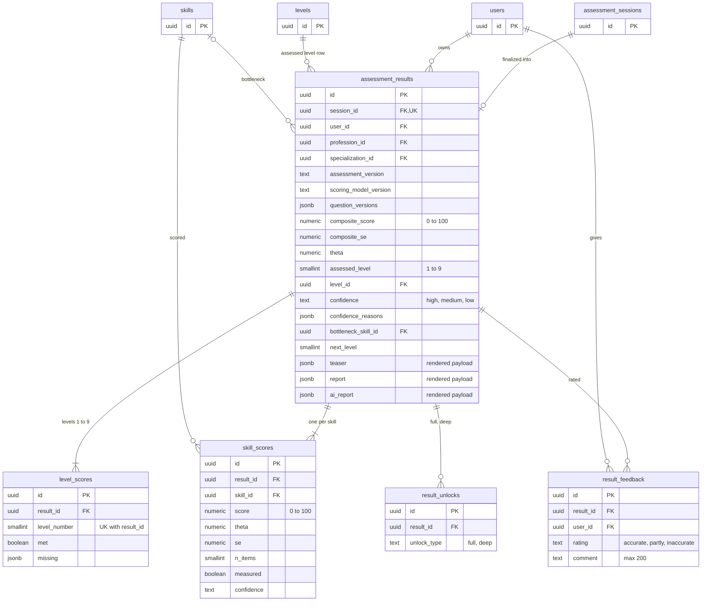

Owner: results. Results, skill scores and level scores are RLS **Own+unlocked**: the free teaser is served by the
server only, so RLS can never leak the level before payment (brief §5). Retention: forever, immutable (§14.2).

#### `assessment_results`

| Column | Type | Constraints / notes |
|--------|------|---------------------|
| `id` | uuid | PK |
| `session_id` | uuid | NN UQ — finalization is idempotent per session; ownership FK `(session_id, user_id)` → `assessment_sessions(id, user_id)` `on update cascade deferrable initially deferred` (no delete action: a session with a result cannot be deleted on its own) |
| `user_id` | uuid | NN FK → `users(id)` cascade; changes only by cascade from the session (merge) |
| `profession_id` | uuid | NN FK → `professions(id)` restrict |
| `specialization_id` | uuid | composite FK → `specializations(id, profession_id)` restrict |
| `assessment_version` | text | NN ≤ 64; **Decision:** `"<template_slug>@v<template_version>"` (e.g. `entrepreneur@v1`), or `"<profession_slug>@c<content.version>"` when the session has no template |
| `scoring_model_version` | text | NN ≤ 64 (`irt2pl-eap-hier-v1`) |
| `question_versions` | jsonb | NN `D '[]'`; array `[{questionId, questionKey, version}]` in answer order (J2) |
| `composite_score` | numeric(5,2) | NN CK 0–100; importance-weighted mean of skill scores |
| `composite_se` | numeric(6,3) | NN CK ≥ 0; `SE_g × 100 / 7` (01 D11) |
| `theta` | numeric(6,3) | NN CK −6…6; θ_g (EAP) |
| `assessed_level` | smallint | NN CK 1–9 |
| `level_id` | uuid | NN FK → `levels(id)` restrict — the effective level row used (trigger `assessment_results_consistency`: it is level `assessed_level` of the profession's scheme, or of the default scheme when the profession does not override that number; profession/specialization equal the session's) |
| `confidence` | text | NN CK in (`high`, `medium`, `low`) |
| `confidence_reasons` | jsonb | NN `D '[]'`, e.g. `["n_lt_12", "speeding", "self_report_gap", "boundary_range"]` |
| `bottleneck_skill_id` | uuid | composite FK `(bottleneck_skill_id, profession_id)` → `skills(id, profession_id)` restrict; NULL when no weak skill (02 D12 fallback) |
| `next_level` | smallint | CK 1–9 and `> assessed_level`; NULL at level 9 |
| `teaser` | jsonb | NN `D '{}'`; free view: strongest and bottleneck skill ids/names; **no level, no price** (02 D12) |
| `report` | jsonb | NN `D '{}'`; full deterministic report; `report.meta` = `{reportGeneratorVersion, plannerVersion, contentVersion, weights: [{skillId, importance, specializationWeight}], levelScheme: [{number, minComposite, requiresVerification}]}` (**Decision**: the snapshot that makes the report self-explaining after catalog edits) |
| `ai_report` | jsonb | optional narrative `{model, promptVersion, locale, sections, generatedAt}`; written asynchronously after unlock |
| `created_at`, `updated_at` | timestamptz | `upd` |

UQ `(id, user_id)` is the target of the ownership FKs of `result_unlocks` and `share_cards`. Indexes: `(user_id,
created_at desc)` (home/history), `(session_id, user_id)` (ownership FK), `(profession_id, created_at)` (benchmarks,
admin), partial `(specialization_id, profession_id)`, `(level_id)`, partial `(bottleneck_skill_id, profession_id)`.
Trigger `assessment_results_guard_immutable` (implemented): every scoring column (`session_id` … `next_level`,
`created_at`) is immutable; only `user_id` (merge cascade) and the rendered payloads `teaser`, `report`, `ai_report`
may change — see §14.2 for the planned gate on payload rewrites.

#### `skill_scores`

| Column | Type | Constraints / notes |
|--------|------|---------------------|
| `id` | uuid | PK |
| `result_id` | uuid | NN FK → `assessment_results(id)` cascade; UQ `(result_id, skill_id)` |
| `skill_id` | uuid | NN FK → `skills(id)` restrict |
| `score` | numeric(5,2) | NN CK 0–100; `clamp(round((θ_s + 3.5) / 7 × 100), 0, 100)` |
| `theta`, `se` | numeric(6,3) | θ_s and posterior SD (hierarchical prior N(θ_g, 0.8²)) |
| `n_items` | smallint | NN `D 0` |
| `measured` | boolean | NN `D true`; `false` = no item covered the skill ("not directly measured", θ_s = θ_g) |
| `confidence` | text | CK confidence set |
| `created_at` | timestamptz | NN `D now()` |

Index `(skill_id)`. Triggers (implemented): `skill_scores_same_profession` (the skill belongs to the result's
profession) and `skill_scores_immutable` (`public.forbid_update()` rejects every UPDATE).

#### `level_scores`

| Column | Type | Constraints / notes |
|--------|------|---------------------|
| `id` | uuid | PK |
| `result_id` | uuid | NN FK → `assessment_results(id)` cascade; UQ `(result_id, level_number)` |
| `level_number` | smallint | NN CK 1–9 |
| `met` | boolean | NN — composite threshold and all `gates_assessed` requirements of this level met |
| `missing` | jsonb | NN `D '[]'`: `[{requirementType, skillId, threshold, current, gatesAssessed}]` — the snapshot used by "what is missing for the next level" |
| `created_at` | timestamptz | NN `D now()` |

Append-only: trigger `level_scores_immutable` (`public.forbid_update()`, implemented).

#### `result_feedback` (02 D2, F22)

Perceived-accuracy rating of a full result; one per user and result, last write wins, editable for 24 h (app rule).
RLS: **Server-only** (admins read comments in the Questions/Profession view; never public). Retention: rating kept;
`comment` nulled on user deletion.

| Column | Type | Constraints / notes |
|--------|------|---------------------|
| `id` | uuid | PK |
| `result_id` | uuid | NN FK → `assessment_results(id)` cascade; UQ `(result_id, user_id)` |
| `user_id` | uuid | NN FK → `users(id)` cascade; index |
| `rating` | text | NN CK in (`accurate`, `partly`, `inaccurate`) — UI "Toʻgʻri / Qisman / Notoʻgʻri" |
| `comment` | text | ≤ 200 chars |
| `created_at`, `updated_at` | timestamptz | `upd` |

---

## 7. Payments

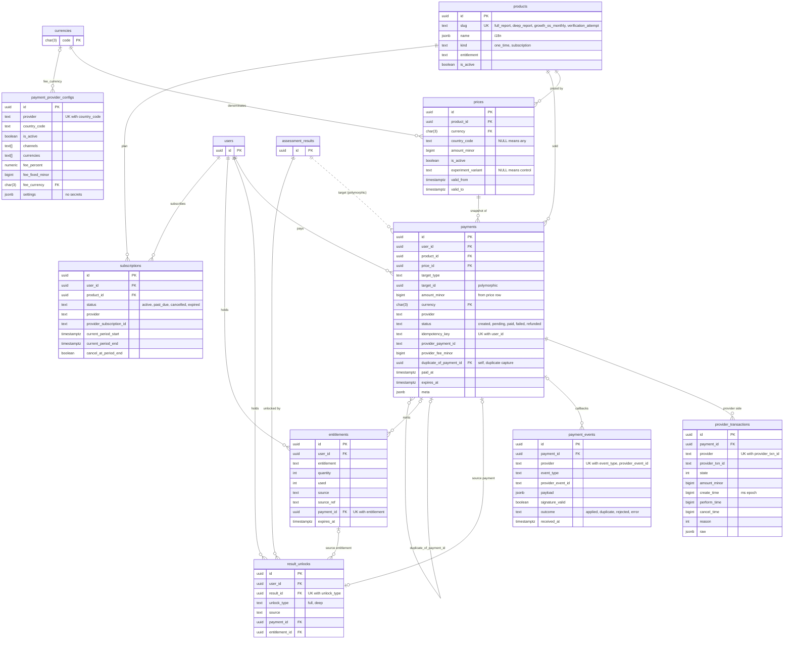

Owners: pricing (`products`, `prices`), payments (the rest). Payment status, unlocks and entitlements are written only
by the server; there are no INSERT/UPDATE/DELETE grants for API roles. Retention of every table in this section:
**forever** (financial records). **Decision:** never auto-deleted; the legal minimum retention period for Uzbekistan
and other launch countries must be confirmed by counsel and can only lengthen this, never shorten it.

#### `products`

RLS: **Public** (`is_active`).

| Column | Type | Constraints / notes |
|--------|------|---------------------|
| `id` | uuid | PK |
| `slug` | text | NN UQ CK in (`full_report`, `deep_report`, `growth_os_monthly`, `verification_attempt`) — a new product needs code for its entitlement, so extending the CHECK in a migration is intended |
| `name` | jsonb | NN `i18n!` ("Toʻliq natija" / "Полный результат" / "Full result") |
| `description` | jsonb | NN `D '{}'` `i18n` |
| `kind` | text | NN CK in (`one_time`, `subscription`) |
| `entitlement` | text | NN CK in (`result_unlock`, `deep_analysis`, `verification_attempt`, `retest`, `growth_os`) |
| `is_active` | boolean | NN `D true` (MVP: only `full_report` active) |
| `sort_order` | integer | NN `D 0` |
| `created_at`, `updated_at` | timestamptz | `upd` |

#### `prices`

Server-side price list. Append-only in spirit: a price change deactivates the row and inserts a new one, so historical
payments keep pointing at what they were charged; trigger `prices_guard_update` makes `product_id`, `currency` and
`amount_minor` immutable once any payment references the row. RLS: **Public** (active rows of active products).

| Column | Type | Constraints / notes |
|--------|------|---------------------|
| `id` | uuid | PK |
| `product_id` | uuid | NN FK → `products(id)` restrict |
| `currency` | char(3) | NN FK → `currencies(code)` |
| `country_code` | text | CK `^[A-Z]{2}$`; NULL = any country |
| `amount_minor` | bigint | NN CK > 0 (`full_report` UZS: `100000` = 1,000 soʻm) |
| `is_active` | boolean | NN `D true` |
| `experiment_variant` | text | ≤ 64; NULL = control/default |
| `valid_from`, `valid_to` | timestamptz | CK `valid_to > valid_from` |
| `created_at`, `updated_at` | timestamptz | `upd` |

Constraint `prices_natural_key` — unique **nulls not distinct** `(product_id, currency, country_code,
experiment_variant, valid_from)` (also the seed upsert key). Index `(currency)`. Resolution (most specific wins,
01 §17):

```sql
select pr.*
  from public.prices pr
  join public.products p on p.id = pr.product_id and p.is_active
 where p.slug = $product_slug
   and pr.is_active
   and pr.currency = $currency
   and (pr.country_code = $country or pr.country_code is null)
   and (pr.experiment_variant = $variant or pr.experiment_variant is null)
   and (pr.valid_from is null or pr.valid_from <= now())
   and (pr.valid_to is null or now() < pr.valid_to)
 order by (pr.country_code is null), (pr.experiment_variant is null), pr.valid_from desc nulls last
 limit 1;
```

#### `payment_provider_configs`

Per-country provider availability, channels, currencies and contracted fees. **No secrets** (credentials are env vars;
a CHECK rejects `settings` keys `secret`, `secret_key`, `key`, `password`, `token`, `api_key`, `private_key`).
RLS: **Server-only**.

| Column | Type | Constraints / notes |
|--------|------|---------------------|
| `id` | uuid | PK (**Decision**: surrogate key; the brief's natural key is UQ `(provider, country_code)`) |
| `provider` | text | NN CK provider set |
| `country_code` | text | NN CK `^[A-Z]{2}$` |
| `is_active` | boolean | NN `D false` |
| `channels` | text[] | NN `D '{}'` ⊆ {`web`, `telegram`, `mobile`} |
| `currencies` | text[] | NN `D '{}'`, ISO codes |
| `fee_percent` | numeric(6,3) | NN `D 0` CK 0 ≤ x < 100 — 0 until the contracted rate is entered (never invented) |
| `fee_fixed_minor` | bigint | NN `D 0` CK ≥ 0; CK non-zero ⇒ `fee_currency` set |
| `fee_currency` | char(3) | FK → `currencies(code)` |
| `settings` | jsonb | NN `D '{}'` object, non-secret (e.g. `{"serviceId": …}` is fine) |
| `created_at`, `updated_at` | timestamptz | `upd` |

#### `payments`

Payment state machine. RLS: **Own** SELECT. FK `user_id` is **restrict**: a payment outlives any user purge.

| Column | Type | Constraints / notes |
|--------|------|---------------------|
| `id` | uuid | PK; sent to providers as the account/payload id |
| `user_id` | uuid | NN FK → `users(id)` restrict |
| `product_id` | uuid | NN FK → `products(id)` restrict |
| `price_id` | uuid | NN FK → `prices(id)` restrict |
| `target_type` | text | NN `D 'none'` CK in (`assessment_result`, `verification_task`, `subscription`, `none`); must be allowed for the product's entitlement by `public.payment_target_types()` (`result_unlock`, `deep_analysis` → `assessment_result`; `verification_attempt` → `verification_task` or `none`; `growth_os` → `subscription` or `none`; `retest` → `none`) |
| `target_id` | uuid | CK `(target_type = 'none') = (target_id is null)`; at COMMIT the target exists and (results, subscriptions) belongs to the payer (`payments_verify`) |
| `amount_minor` | bigint | NN CK > 0; must equal the price row (trigger) |
| `currency` | char(3) | NN FK → `currencies(code)`; must equal the price row |
| `provider` | text | NN CK provider set |
| `status` | text | NN `D 'created'` CK in (`created`, `pending`, `paid`, `failed`, `refunded`) |
| `idempotency_key` | text | NN CK length 8–200 (client `Idempotency-Key`); UQ `(user_id, idempotency_key)`; immutable |
| `provider_payment_id` | text | ≤ 200 (Payme transaction id, Click `click_trans_id`, Stars `telegram_payment_charge_id`); write-once |
| `provider_fee_minor` | bigint | CK ≥ 0; snapshot at PAID (§1.6) |
| `failure_reason` | text | ≤ 500 (`expired`, `provider_cancelled`, `amount_mismatch`, `superseded_by_merge`, …) |
| `duplicate_of_payment_id` | uuid | FK → `payments(id)`; CK ≠ `id`. Set once, on the `created`/`pending → paid` transition of a **duplicate capture** (a second provider captured money for a target that already has a PAID payment of the same user and product); such a payment is excluded from `payments_one_paid_per_target`, can never unlock anything, and is then refunded (`paid → refunded`) |
| `paid_at`, `failed_at`, `refunded_at` | timestamptz | CK: `paid`/`refunded` ⇒ `paid_at`; `failed` ⇒ `failed_at`; `refunded` ⇒ `refunded_at` |
| `expires_at` | timestamptz | `created_at + app_settings.payments.expiry_minutes[provider]` (Payme 720, others 30) |
| `meta` | jsonb | NN `D '{}'`: `{channel, locale, returnPath}` (J1) |
| `created_at`, `updated_at` | timestamptz | `upd` |

Indexes — the uniqueness rules the brief requires are enforced by **partial unique indexes**:

| Index | Definition | Purpose |
|-------|------------|---------|
| `payments_user_id_idempotency_key_key` | unique `(user_id, idempotency_key)` | a retried create returns the same payment |
| `payments_one_paid_per_target` | unique `(user_id, product_id, target_id) where status = 'paid' and duplicate_of_payment_id is null` | at most one PAID payment per purchase target; a refunded payment leaves the predicate, so a re-purchase is possible; NULLs distinct, so consumables without a target can be bought again |
| `payments_one_open_per_target_provider` | unique `(user_id, product_id, target_id, provider)` **nulls not distinct** `where status in ('created', 'pending')` | one open checkout per target and provider (also per product and provider for target-less purchases), reused on retry |
| `payments_provider_payment_id_key` | unique `(provider, provider_payment_id) where provider_payment_id is not null` | provider ids map to one payment |
| `payments_user_idx` | `(user_id, created_at desc)` | own payment list |
| `payments_product_idx` | `(product_id, created_at)` | admin / unit economics |
| `payments_open_idx` | `(created_at) where status in ('created', 'pending')` | `expire-payments` cron |
| `payments_target_idx` | `(target_id) where target_id is not null` | "is this result paid?" |
| `payments_price_id_idx`, `payments_currency_idx`, `payments_duplicate_of_idx` (partial) | FK support | |

Triggers:
- `payments_guard_insert` — a payment starts `created` or `pending`, without `duplicate_of_payment_id`; amount,
  currency and product equal the referenced price; the price is active and inside its validity window; the product is
  active; the target type fits the product (`payment_target_types`).
- `payments_guard_update` — amount/currency/product/price immutable; target, provider and idempotency key immutable;
  `provider_payment_id` write-once; `duplicate_of_payment_id` set once, only on a duplicate capture; legal transitions
  only: `created → pending | paid | failed`, `pending → paid | failed`, `paid → refunded` (`failed`, `refunded`
  terminal; same-status updates allowed for idempotent webhook handling); stamps `paid_at` / `failed_at` /
  `refunded_at`.
- `payments_verify` (deferred constraint trigger) — at COMMIT: `user_id` moves only from a user whose
  `merged_into_user_id` is the new owner (merge only); the target exists and belongs to the payer; a payment-sourced
  unlock references only a PAID payment.

The full PAID transaction is in §13.

#### `provider_transactions`

Provider-side transaction mirror for protocols that need it (Payme CheckTransaction/GetStatement, Click
Prepare/Complete). RLS: **Server-only**.

| Column | Type | Constraints / notes |
|--------|------|---------------------|
| `id` | uuid | PK |
| `payment_id` | uuid | NN FK → `payments(id)` restrict |
| `provider` | text | NN CK provider set; UQ `(provider, provider_txn_id)` |
| `provider_txn_id` | text | NN 1–200 |
| `state` | integer | NN; Payme semantics (`1` created, `2` performed, `-1` cancelled before perform, `-2` cancelled after perform); **Decision:** Click and Stars use the same codes (Click Prepare → 1, Complete → 2, cancelled → −1; Stars success → 2) so one reconciliation query covers all |
| `amount_minor` | bigint | NN CK > 0; trigger `provider_transactions_match_payment`: provider and amount equal the payment's |
| `create_time`, `perform_time`, `cancel_time` | bigint | provider ms epoch (returned verbatim to Payme) |
| `reason` | integer | provider cancel reason code |
| `raw` | jsonb | NN `D '{}'`; last provider payload, verbatim (J4) |
| `created_at`, `updated_at` | timestamptz | `upd` |

Indexes: `(payment_id)`; `(provider, create_time)` for Payme `GetStatement(from, to)`.

#### `payment_events`

Every provider callback, stored once per provider event (replay-safe audit trail). RLS: **Server-only**.

| Column | Type | Constraints / notes |
|--------|------|---------------------|
| `id` | uuid | PK |
| `payment_id` | uuid | FK → `payments(id)` set null (unknown payment ids are still recorded) |
| `provider` | text | NN CK provider set |
| `event_type` | text | NN 1–64 (`CheckPerformTransaction`, `CreateTransaction`, `PerformTransaction`, `CancelTransaction`, `prepare`, `complete`, `pre_checkout_query`, `successful_payment`, …) |
| `provider_event_id` | text | NN 1–200 — Payme `params.id`; Click `click_trans_id`; Stars `pre_checkout_query.id` / `telegram_payment_charge_id`; mock: generated |
| `payload` | jsonb | NN `D '{}'`; request body verbatim (J4); headers are never stored |
| `signature_valid` | boolean | NN `D false` |
| `outcome` | text | CK in (`applied`, `duplicate`, `rejected`, `error`); NULL while processing |
| `error` | text | ≤ 2000, no secrets |
| `received_at` | timestamptz | NN `D now()` |
| `processed_at` | timestamptz | |

Constraint UQ `(provider, event_type, provider_event_id)`: a replayed callback conflicts, inserts nothing, and the
handler answers from the payment's current state. `duplicate` marks a *new* event whose effect was already applied
(e.g. a second success notification for a paid payment). Indexes: `(payment_id, received_at)` partial, `(received_at)`.
**Decision:** LEVEL never asks providers for payer contact data (Stars `need_*` flags false, Payme/Click account =
payment id only), so payloads carry no PII by construction.

#### `result_unlocks`

Idempotent unlock records of a result. RLS: **Server-only** (policies consult it through
`public.is_result_unlocked()`).

| Column | Type | Constraints / notes |
|--------|------|---------------------|
| `id` | uuid | PK |
| `user_id` | uuid | NN FK → `users(id)` cascade |
| `result_id` | uuid | NN; UQ `(result_id, unlock_type)`; ownership FK `(result_id, user_id)` → `assessment_results(id, user_id)` `on update cascade deferrable initially deferred`, no delete action (an unlocked result is the fulfilment record of a payment and cannot be deleted) |
| `unlock_type` | text | NN CK in (`full`, `deep`) |
| `source` | text | NN CK grant-source set; CK `(source = 'payment') = (payment_id is not null)` |
| `payment_id` | uuid | FK → `payments(id)` restrict; partial UQ `result_unlocks_payment_id_key` — one payment unlocks exactly one (result, type) |
| `entitlement_id` | uuid | FK → `entitlements(id)` set null (e.g. a `deep` unlock paid with a `deep_analysis` entitlement) |
| `created_at` | timestamptz | NN `D now()` |

Indexes: `(user_id)`, `(result_id, user_id)`, partial `(entitlement_id)`. Written with `on conflict (result_id,
unlock_type) do nothing` in the PAID transaction; deleted only by the refund transaction (payment-sourced rows).
Deferred trigger `result_unlocks_verify`: a payment-sourced unlock references a PAID, non-duplicate payment of the
result's owner, for this result, whose product entitlement matches the unlock type (`result_unlock → full`,
`deep_analysis → deep`); the unlock of a still-PAID payment cannot be deleted except together with its refund.

#### `entitlements`

Consumable or time-bound rights. RLS: **Own** SELECT.

| Column | Type | Constraints / notes |
|--------|------|---------------------|
| `id` | uuid | PK |
| `user_id` | uuid | NN FK → `users(id)` cascade |
| `entitlement` | text | NN CK in (`deep_analysis`, `verification_attempt`, `retest`, `growth_os`) |
| `quantity` | integer | NN `D 1` CK > 0 |
| `used` | integer | NN `D 0` CK ≥ 0 and `used ≤ quantity` |
| `source` | text | NN CK grant-source set |
| `source_ref` | text | ≤ 200; id of the granting payment / reward grant / subscription / audit row |
| `expires_at` | timestamptz | NULL = no expiry |
| `created_at`, `updated_at` | timestamptz | `upd` |

Index `(user_id, entitlement)`. Consumption is one atomic statement (oldest-expiring first) and writes an
`audit_logs` row `entitlement.consumed` with the consumer reference:

```sql
update public.entitlements e
   set used = e.used + 1
 where e.id = (
   select id from public.entitlements
    where user_id = $user_id and entitlement = 'retest' and used < quantity
      and (expires_at is null or expires_at > now())
    order by expires_at nulls last, created_at
    limit 1
    for update skip locked)
returning e.id;
```

#### `subscriptions`

Recurring products (Growth OS; inactive in the MVP). RLS: **Own** SELECT.

| Column | Type | Constraints / notes |
|--------|------|---------------------|
| `id` | uuid | PK |
| `user_id` | uuid | NN FK → `users(id)` cascade |
| `product_id` | uuid | NN FK → `products(id)` restrict |
| `status` | text | NN `D 'active'` CK in (`active`, `past_due`, `cancelled`, `expired`) |
| `provider` | text | NN CK provider set |
| `provider_subscription_id` | text | ≤ 200 |
| `current_period_start`, `current_period_end` | timestamptz | NN; CK end > start |
| `cancel_at_period_end` | boolean | NN `D false` |
| `created_at`, `updated_at` | timestamptz | `upd` |

Indexes: `subscriptions_one_live_per_product` — unique `(user_id, product_id) where status in ('active', 'past_due')`;
`subscriptions_provider_id_key` — unique `(provider, provider_subscription_id) where provider_subscription_id is not
null`; `(user_id, status)`; `(product_id)`.

---

## 8. Sharing and referrals

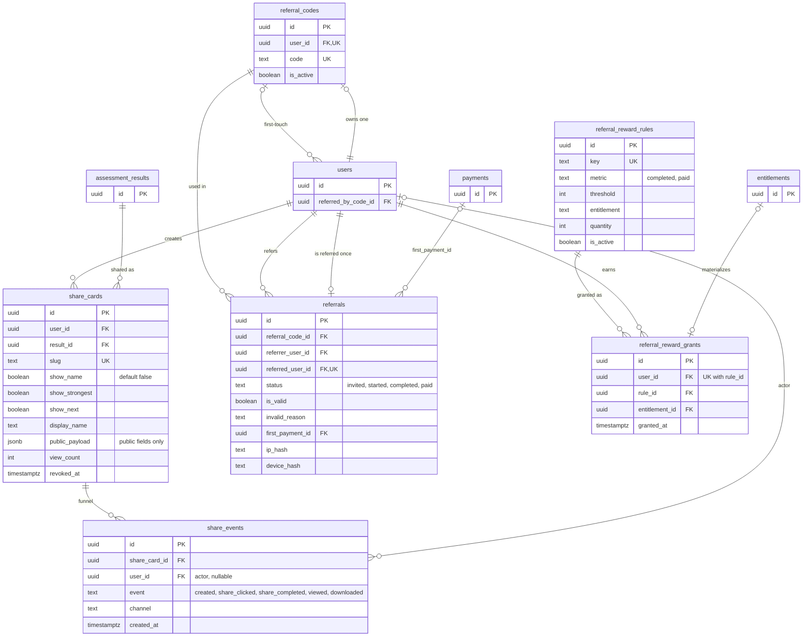

#### `share_cards`

Public share cards rendered **only** from `public_payload` (brief §10). Owner: sharing. RLS: **Own** SELECT; the
public page reads through the server. Retention: kept while the user exists; revoked (not deleted) by refund
(02 D15), deletion request, or the owner.

| Column | Type | Constraints / notes |
|--------|------|---------------------|
| `id` | uuid | PK |
| `user_id` | uuid | NN FK → `users(id)` cascade |
| `result_id` | uuid | NN FK → `assessment_results(id)` cascade |
| `slug` | text | NN UQ CK `^[A-Za-z0-9_-]{6,32}$` (generated: 10 lowercase base32 chars, 01 D21) |
| `show_name` | boolean | NN `D false`; CK `show_name or display_name is null` |
| `show_strongest`, `show_next` | boolean | NN `D true` |
| `display_name` | text | 1–64; only with explicit consent |
| `public_payload` | jsonb | NN `D '{}'`; **Decision** shape (J1, ≤ 4 KB): `{v: 1, locale, profession: {slug, name}, level: {number, name} \| null, strongestSkill: {name} \| null, nextTarget: {number, name} \| null, displayName \| null, refCode}` — `level` is null unless the result is unlocked (01 §7.5); never weakness, salary or private data |
| `view_count` | integer | NN `D 0`; **Decision:** incremented at most once per (card, viewer `ip_hash`) per day (gated by a `rate_limits` key) to avoid a hot-row write per view |
| `revoked_at` | timestamptz | revoked cards answer 410 |
| `created_at`, `updated_at` | timestamptz | `upd` |

Indexes: `(user_id, created_at desc)`, `(result_id)`. **Planned:** `share_cards_reuse_idx (result_id, show_name,
show_strongest, show_next) where revoked_at is null` — a card is reused per toggle set (01 D10).

Example payload text rendered by the card (uz): "Men Tadbirkor LEVEL testidan oʻtdim. Natijam: LEVEL 4. Sizniki
nechchi?"; OG title: "Aziz — Sales LEVEL 5. Sizniki nechchi?" (name only when `show_name`).

#### `share_events`

Share-card funnel. Owner: sharing. RLS: **Server-only**. Retention: **Decision** 13 months (same as raw analytics);
`share_cards.view_count` keeps the lifetime total.

| Column | Type | Constraints / notes |
|--------|------|---------------------|
| `id` | uuid | PK |
| `share_card_id` | uuid | NN FK → `share_cards(id)` cascade |
| `user_id` | uuid | FK → `users(id)` set null — the actor (owner or viewer) when known |
| `event` | text | NN CK in (`created`, `share_clicked`, `share_completed`, `viewed`, `downloaded`) |
| `channel` | text | CK `^[a-z][a-z0-9_]{0,31}$` (`telegram_message`, `telegram_story`, `download`, `copy_link`, …) |
| `created_at` | timestamptz | NN `D now()` |

Indexes: `(share_card_id, created_at)`, partial `(user_id)`.

#### `referral_codes`

One code per user. Owner: referrals. RLS: **Own** SELECT. Retention: kept; `is_active = false` on deletion.

| Column | Type | Constraints / notes |
|--------|------|---------------------|
| `id` | uuid | PK |
| `user_id` | uuid | NN UQ FK → `users(id)` cascade |
| `code` | text | NN UQ CK `^[A-Z2-9]{6,10}$`; generated as 8 chars of the RFC 4648 base32 alphabet `A–Z2–7` (01 D21), retry on conflict |
| `is_active` | boolean | NN `D true` |
| `created_at`, `updated_at` | timestamptz | `upd` |

#### `referrals`

First-touch attribution of a referred user. Owner: referrals. RLS: **Own** for the referrer, through a column grant
without `ip_hash`, `device_hash`, `first_payment_id`. Retention: forever (reward audit).

| Column | Type | Constraints / notes |
|--------|------|---------------------|
| `id` | uuid | PK |
| `referral_code_id` | uuid | NN FK → `referral_codes(id)` cascade — the code that was used |
| `referrer_user_id` | uuid | NN FK → `users(id)` cascade — canonical owner (re-pointed on merge) |
| `referred_user_id` | uuid | NN **UQ** FK → `users(id)` cascade; CK ≠ `referrer_user_id` |
| `status` | text | NN `D 'invited'` CK in (`invited`, `started`, `completed`, `paid`); monotonic |
| `is_valid` | boolean | NN `D true`; CK `is_valid or invalid_reason is not null` |
| `invalid_reason` | text | CK in (`self_referral`, `same_telegram_id`, `same_device`, `merged_identity`, `merged_duplicate`, `refunded`, `fraud_suspected`, `other`) |
| `invited_at` | timestamptz | NN `D now()` |
| `started_at`, `completed_at`, `paid_at` | timestamptz | set with the status |
| `first_payment_id` | uuid | FK → `payments(id)` set null |
| `ip_hash`, `device_hash` | text | salted hashes (validity checks, anomaly flag > 20 valid referrals per `ip_hash` per day) |
| `created_at`, `updated_at` | timestamptz | `upd` |

Indexes: `(referrer_user_id, status)`, `(referral_code_id)`, partial `(first_payment_id)`. Rule counting (only valid
referrals; a refunded first payment stops counting toward `paid` rules, 01 §3.5):

```sql
-- metric 'completed'
select count(*) from public.referrals r
 where r.referrer_user_id = $user_id and r.is_valid and r.status in ('completed', 'paid');
-- metric 'paid'
select count(*) from public.referrals r
  join public.payments p on p.id = r.first_payment_id and p.status = 'paid'
 where r.referrer_user_id = $user_id and r.is_valid and r.status = 'paid';
```

**Decision:** `invalid_reason = 'refunded'` is set by an admin only when a refund indicates abuse; ordinary refunds are
handled by the `paid` query above, and the referral keeps counting toward `completed` rules.

#### `referral_reward_rules`

RLS: **Server-only**. Retention: forever (grants reference them; deactivate, never delete).

| Column | Type | Constraints / notes |
|--------|------|---------------------|
| `id` | uuid | PK |
| `key` | text | NN UQ (e.g. `three_completed_retest`) |
| `metric` | text | NN CK in (`completed`, `paid`) |
| `threshold` | integer | NN CK > 0 |
| `entitlement` | text | NN CK entitlement set |
| `quantity` | integer | NN `D 1` CK > 0 |
| `is_active` | boolean | NN `D true` |
| `created_at`, `updated_at` | timestamptz | `upd` |

#### `referral_reward_grants`

Idempotent record that a rule was granted to a user (once per rule). RLS: **Server-only**. Retention: forever.

| Column | Type | Constraints / notes |
|--------|------|---------------------|
| `id` | uuid | PK |
| `user_id` | uuid | NN FK → `users(id)` cascade; UQ `(user_id, rule_id)` |
| `rule_id` | uuid | NN FK → `referral_reward_rules(id)` restrict |
| `entitlement_id` | uuid | FK → `entitlements(id)` set null |
| `granted_at` | timestamptz | NN `D now()` |

Grant = `insert … on conflict (user_id, rule_id) do nothing returning id`; only when a row is returned does the same
transaction insert the entitlement (`source = 'referral_reward'`, `source_ref = grant id`) and set `entitlement_id`.

---

## 9. Growth, roadmaps and verification

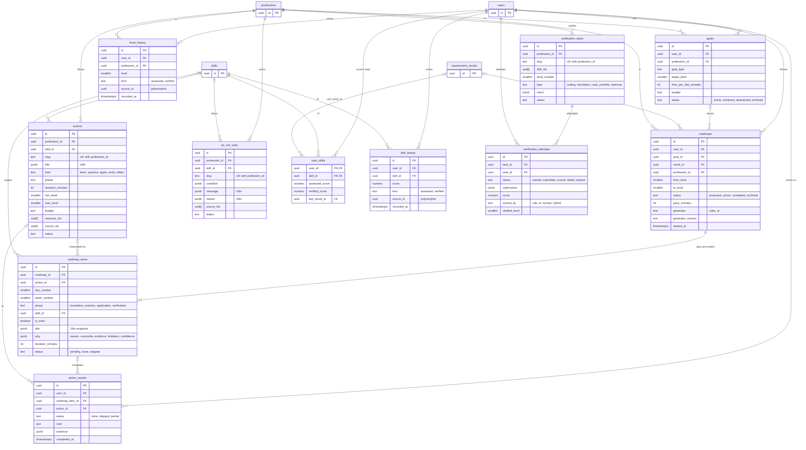

Owners: roadmaps (`actions`, `do_not_rules`, `roadmaps`, `roadmap_items`, `action_results`), growth (`goals`,
`user_skills`, `skill_history`, `level_history`), verification (tasks, attempts). Content tables (`actions`,
`do_not_rules`, `verification_tasks`) are **Server-only** and retained forever (archived, not deleted). User tables are
**Own** SELECT; retained while the user exists; free text is nulled on deletion.

#### `goals`

| Column | Type | Constraints / notes |
|--------|------|---------------------|
| `id` | uuid | PK |
| `user_id` | uuid | NN FK → `users(id)` cascade |
| `profession_id` | uuid | NN FK → `professions(id)` restrict |
| `goal_type` | text | NN CK goal-type set |
| `target_level` | smallint | CK 1–9 |
| `time_per_day_minutes` | integer | CK 5–480 |
| `budget` | text | CK budget set |
| `status` | text | NN `D 'active'` CK in (`active`, `achieved`, `abandoned`, `archived`) |
| `created_at`, `updated_at` | timestamptz | `upd` |

Indexes: `(user_id, status)`, `(profession_id)`.

#### `actions`

Action library (content-as-code) referenced by roadmap items.

| Column | Type | Constraints / notes |
|--------|------|---------------------|
| `id` | uuid | PK |
| `profession_id` | uuid | NN FK → `professions(id)` cascade |
| `skill_id` | uuid | composite FK `(skill_id, profession_id)` → `skills` cascade |
| `slug` | text | NN; UQ `(profession_id, slug)` (seed key) |
| `title` | jsonb | NN `i18n!` |
| `description` | jsonb | NN `D '{}'` `i18n` |
| `kind` | text | NN CK in (`learn`, `practice`, `apply`, `verify`, `reflect`) |
| `phase` | text | NN CK in (`foundation`, `practice`, `application`, `verification`) |
| `duration_minutes` | integer | NN CK 1–240 (content 5–120; daily main action 5–30) |
| `min_level`, `max_level` | smallint | NN `D 1` / `D 9`; CK `min_level ≤ max_level` |
| `budget` | text | NN `D 'free'` CK budget set |
| `success_criteria`, `why` | jsonb | `i18n` |
| `resource_ids`, `source_ids` | uuid[] | NN `D '{}'`; array references (§1.8) |
| `status` | text | NN `D 'active'` CK content status |
| `created_at`, `updated_at` | timestamptz | `upd` |

Index partial `(skill_id, profession_id)`.

#### `roadmaps`

30-day roadmap from the current to the next level; `proposed` at unlock, `active` on accept (02 D18).

| Column | Type | Constraints / notes |
|--------|------|---------------------|
| `id` | uuid | PK |
| `user_id` | uuid | NN FK → `users(id)` cascade |
| `goal_id` | uuid | FK → `goals(id)` set null |
| `result_id` | uuid | FK → `assessment_results(id)` set null |
| `profession_id` | uuid | NN FK → `professions(id)` restrict |
| `from_level`, `to_level` | smallint | NN CK 1–9, `to_level ≥ from_level` |
| `status` | text | NN `D 'proposed'` CK in (`proposed`, `active`, `completed`, `archived`) |
| `pace_minutes` | integer | NN `D 30` CK 5–480 |
| `generator` | text | NN `D 'rules'` CK in (`rules`, `ai`) — AI only writes narrative, never structure |
| `generator_version` | text | NN ≤ 64 (planner version; audit) |
| `started_at`, `completed_at` | timestamptz | |
| `created_at`, `updated_at` | timestamptz | `upd` |

Indexes: `roadmaps_one_active_per_profession` — unique `(user_id, profession_id) where status = 'active'`;
`(user_id, status)`; partials on `goal_id`, `result_id`; `(profession_id)`. Activation is idempotent per result
(01 D4): `POST /api/v1/roadmaps {resultId, goal}` returns the existing roadmap for that result if present.

#### `roadmap_items`

Snapshotted steps: `title`, `description` and `why` are **copied** from the action at generation time, so later
library edits never rewrite a user's plan. RLS: **Own** via roadmap ownership.

| Column | Type | Constraints / notes |
|--------|------|---------------------|
| `id` | uuid | PK |
| `roadmap_id` | uuid | NN FK → `roadmaps(id)` cascade |
| `action_id` | uuid | FK → `actions(id)` set null |
| `day_number` | smallint | CK 1–366 (days 1–7 daily) |
| `week_number` | smallint | CK 1–53 (W2–W4 milestones) |
| `phase` | text | NN CK phase set (W1 foundation, W2 practice, W3 application, W4 verification) |
| `skill_id` | uuid | FK → `skills(id)` set null |
| `is_main` | boolean | NN `D false` — one main action per day |
| `title` | jsonb | NN `i18n!` |
| `description` | jsonb | NN `D '{}'` `i18n` |
| `why` | jsonb | NN `D '{}'` object `{reason, sourceIds, evidence, limitation, confidence}` (J1); `sourceIds` only verified sources, otherwise `reason` is "Yetarli ishonchli maʼlumot mavjud emas." |
| `duration_minutes` | integer | CK 1–480 |
| `status` | text | NN `D 'pending'` CK in (`pending`, `done`, `skipped`) |
| `completed_at` | timestamptz | |
| `sort_order` | integer | NN `D 0` |
| `created_at`, `updated_at` | timestamptz | `upd` |

Indexes: `(roadmap_id, day_number, sort_order)`, partial `(action_id)`, partial `(skill_id)`.

#### `action_results`

User check-ins on actions. Actions never move the level (02 D23).

| Column | Type | Constraints / notes |
|--------|------|---------------------|
| `id` | uuid | PK |
| `user_id` | uuid | NN FK → `users(id)` cascade |
| `roadmap_item_id` | uuid | FK → `roadmap_items(id)` set null |
| `action_id` | uuid | FK → `actions(id)` set null |
| `status` | text | NN CK in (`done`, `skipped`, `partial`) |
| `note` | text | ≤ 2000 — nulled on deletion |
| `evidence` | jsonb | object (link/upload reference, later) — nulled on deletion |
| `completed_at` | timestamptz | NN `D now()` |
| `created_at`, `updated_at` | timestamptz | `upd` |

Indexes: `(user_id, completed_at desc)`, partials on `roadmap_item_id`, `action_id`.

#### `do_not_rules`

"Do not do now" rules with conditions and reasons.

| Column | Type | Constraints / notes |
|--------|------|---------------------|
| `id` | uuid | PK |
| `profession_id` | uuid | NN FK → `professions(id)` cascade |
| `skill_id` | uuid | composite FK → `skills(id, profession_id)` cascade |
| `slug` | text | NN; UQ `(profession_id, slug)` |
| `condition` | jsonb | NN `D '{}'` object `{maxLevel, minLevel, weakSkills: [slug], goalTypes: [goal]}` (J1; rule applies when all present clauses hold, `weakSkills` = any) |
| `message`, `reason` | jsonb | NN `i18n!` |
| `source_ids` | uuid[] | NN `D '{}'` |
| `status` | text | NN `D 'active'` CK content status |
| `created_at`, `updated_at` | timestamptz | `upd` |

#### `user_skills`

Latest assessed and verified score per user and skill — a **projection** rebuildable from `skill_history`.

| Column | Type | Constraints / notes |
|--------|------|---------------------|
| `user_id` | uuid | PK part, FK → `users(id)` cascade |
| `skill_id` | uuid | PK part, FK → `skills(id)` cascade |
| `assessed_score`, `verified_score` | numeric(5,2) | CK 0–100 |
| `last_result_id` | uuid | FK → `assessment_results(id)` set null |
| `created_at`, `updated_at` | timestamptz | `upd` |

Indexes: `(skill_id)`, partial `(last_result_id)`. Written on `result.finalized` (assessed) and `verification.scored`
(verified).

#### `skill_history` and `level_history`

Append-only time series for progress charts and the level-up metric.

| Column | Type | Constraints / notes |
|--------|------|---------------------|
| `id` | uuid | PK |
| `user_id` | uuid | NN FK → `users(id)` cascade |
| `skill_id` (skill_history) | uuid | NN FK → `skills(id)` cascade |
| `score` (skill_history) | numeric(5,2) | NN CK 0–100 |
| `profession_id` (level_history) | uuid | NN FK → `professions(id)` restrict |
| `level` (level_history) | smallint | NN CK 1–9 |
| `kind` | text | NN CK in (`assessed`, `verified`) — ASSESSED and VERIFIED are separate badges |
| `source_id` | uuid | polymorphic: `assessment_results.id` (assessed) or `verification_attempts.id` (verified) |
| `recorded_at` | timestamptz | NN `D now()` |

Indexes: `skill_history (user_id, skill_id, recorded_at)`, `(skill_id)`; `level_history (user_id, profession_id,
recorded_at desc)`, `(profession_id)`. **Planned:** UQ `(user_id, skill_id, kind, source_id)` and `(user_id,
profession_id, kind, source_id)` so the at-least-once `result.finalized` subscriber (01 §3.5) cannot double-append.

#### `verification_tasks`

Practical tasks that verify a level (feature flag `verification = false` in the MVP).

| Column | Type | Constraints / notes |
|--------|------|---------------------|
| `id` | uuid | PK |
| `profession_id` | uuid | NN FK → `professions(id)` cascade |
| `slug` | text | NN; UQ `(profession_id, slug)` |
| `skill_ids` | uuid[] | NN `D '{}'`; GIN index |
| `level_number` | smallint | NN CK 1–9 |
| `type` | text | NN CK in (`coding`, `simulation`, `case`, `portfolio`, `exercise`) |
| `title`, `brief` | jsonb | NN `i18n!` |
| `rubric` | jsonb | NN `D '[]'` array `[{criterion: i18n, weight}]` (≥ 2 criteria) |
| `status` | text | NN `D 'draft'` CK content status |
| `created_at`, `updated_at` | timestamptz | `upd` |

#### `verification_attempts`

| Column | Type | Constraints / notes |
|--------|------|---------------------|
| `id` | uuid | PK |
| `task_id` | uuid | NN FK → `verification_tasks(id)` restrict |
| `user_id` | uuid | NN FK → `users(id)` cascade |
| `status` | text | NN `D 'started'` CK in (`started`, `submitted`, `scored`, `failed`, `expired`); CK `scored` ⇒ `score` and `scored_by` |
| `submission` | jsonb | object (text, links, Storage object paths later) — nulled on deletion |
| `transcript` | jsonb | object/array (simulations) — nulled on deletion |
| `rubric_scores` | jsonb | object/array per criterion |
| `score` | numeric(5,2) | CK 0–100 |
| `scored_by` | text | CK in (`rule`, `ai`, `human`, `hybrid`) — AI is never the only scorer of a level |
| `verified_level` | smallint | CK 1–9 |
| `started_at` | timestamptz | NN `D now()` |
| `submitted_at`, `scored_at` | timestamptz | |
| `created_at`, `updated_at` | timestamptz | `upd` |

Indexes: `(user_id, started_at desc)`, `(task_id)`.

---

## 10. Evidence

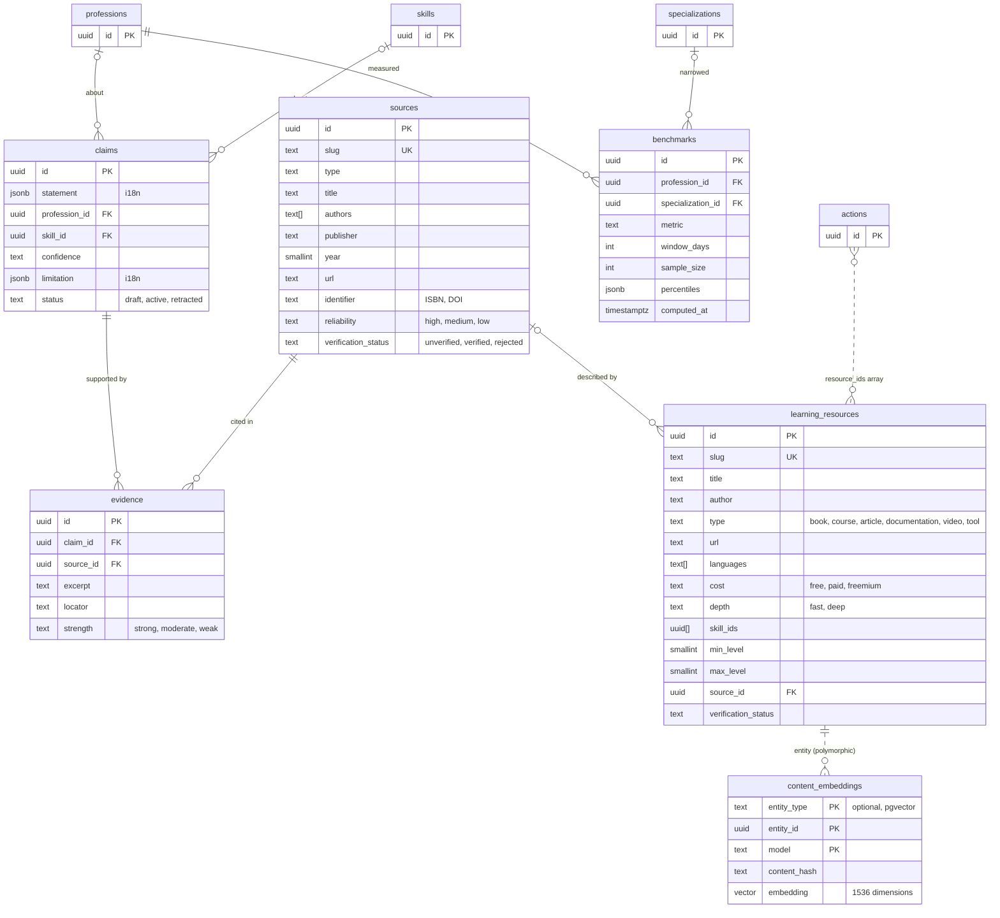

Owner: evidence. Nothing here may be fabricated: rows reach clients only when `verification_status = 'verified'`
(set by a human reviewer), and an empty list is valid content. Retention: forever (sources back historical
recommendations; rejected rows are kept for the review trail).

#### `sources`

RLS: **Public** (`verification_status = 'verified'`).

| Column | Type | Constraints / notes |
|--------|------|---------------------|
| `id` | uuid | PK |
| `slug` | text | UQ (seed key) |
| `type` | text | NN CK in (`official`, `academic`, `professional_body`, `university`, `documentation`, `company_report`, `industry_research`, `book`, `expert`) |
| `title` | text | NN 1–500, original language |
| `authors` | text[] | NN `D '{}'` |
| `publisher` | text | ≤ 300 |
| `year` | smallint | CK 1400–2100 |
| `url` | text | CK `^https?://`, ≤ 2000 — only real, checked URLs |
| `identifier` | text | ≤ 200 (ISBN / DOI / standard number) |
| `reliability` | text | NN `D 'medium'` CK in (`high`, `medium`, `low`) |
| `verification_status` | text | NN `D 'unverified'` CK verification status |
| `created_at`, `updated_at` | timestamptz | `upd` |

#### `claims`

Statements used in "why" explanations, each with confidence and limitation. RLS: **Server-only**.

| Column | Type | Constraints / notes |
|--------|------|---------------------|
| `id` | uuid | PK |
| `statement` | jsonb | NN `i18n!` |
| `profession_id` | uuid | FK → `professions(id)` cascade (partial index) |
| `skill_id` | uuid | FK → `skills(id)` cascade (partial index) |
| `confidence` | text | NN `D 'low'` CK confidence set |
| `limitation` | jsonb | `i18n` |
| `status` | text | NN `D 'draft'` CK in (`draft`, `active`, `retracted`) |
| `created_at`, `updated_at` | timestamptz | `upd` |

**Decision:** a claim may be `active` only with ≥ 1 `evidence` row whose source is `verified` (checked by the seeder
and the admin publish action).

#### `evidence`

Link of a claim to a source. RLS: **Server-only**.

| Column | Type | Constraints / notes |
|--------|------|---------------------|
| `id` | uuid | PK |
| `claim_id` | uuid | NN FK → `claims(id)` cascade |
| `source_id` | uuid | NN FK → `sources(id)` restrict |
| `excerpt` | text | ≤ 2000 |
| `locator` | text | ≤ 200 (page / section / timestamp) |
| `strength` | text | NN `D 'moderate'` CK in (`strong`, `moderate`, `weak`) |
| `created_at`, `updated_at` | timestamptz | `upd` |

Indexes on both FKs.

#### `learning_resources`

Real resources mapped to skills and level ranges. RLS: **Public** (`verified`).

| Column | Type | Constraints / notes |
|--------|------|---------------------|
| `id` | uuid | PK |
| `slug` | text | UQ (seed key) |
| `title` | text | NN 1–500 |
| `author` | text | ≤ 300 |
| `type` | text | NN CK in (`book`, `course`, `article`, `documentation`, `video`, `tool`) |
| `url` | text | CK `^https?://` |
| `languages` | text[] | NN `D '{}'` (locale codes of the resource itself) |
| `cost` | text | NN `D 'free'` CK in (`free`, `paid`, `freemium`) |
| `depth` | text | NN `D 'fast'` CK in (`fast`, `deep`) |
| `skill_ids` | uuid[] | NN `D '{}'`; GIN index (`skill_ids && $ids`) |
| `min_level`, `max_level` | smallint | CK 1–9, `min ≤ max` |
| `source_id` | uuid | FK → `sources(id)` set null |
| `verification_status` | text | NN `D 'unverified'` |
| `embedding` | vector(1536) | added by `…001300` only when pgvector exists; **not used** — see §15.6 |
| `created_at`, `updated_at` | timestamptz | `upd` |

#### `benchmarks`

Percentile snapshots computed from real results. RLS: **Server-only** (served through the API only when
`sample_size ≥ app_settings.benchmark_min_sample`, default 1000, always with sample size and window shown).

| Column | Type | Constraints / notes |
|--------|------|---------------------|
| `id` | uuid | PK |
| `profession_id` | uuid | NN FK → `professions(id)` cascade |
| `specialization_id` | uuid | FK → `specializations(id)` cascade |
| `metric` | text | NN CK `^[a-z][a-z0-9_]{1,63}$`; MVP metrics `composite_score`, `assessed_level` |
| `window_days` | integer | NN CK > 0 |
| `sample_size` | integer | NN CK ≥ 0 |
| `percentiles` | jsonb | NN `D '{}'` `{"p10": …, "p25": …, "p50": …, "p75": …, "p90": …}` |
| `computed_at` | timestamptz | NN `D now()` |
| `created_at` | timestamptz | NN `D now()` |

Indexes: `(profession_id, metric, computed_at desc)` (latest snapshot), partial `(specialization_id)`. Computed by the
daily `compute-benchmarks` job over completed results in the window, **one latest result per (canonical user,
profession)**, excluding admins and `app_settings.analytics.excluded_user_ids`. Append-only history.
**Decision:** per-skill benchmarks need an additive `skill_id` column and are out of MVP scope.

#### `content_embeddings`

Optional semantic-search storage, created only when pgvector is available. Specified in §15.

---

## 11. Analytics and experiments

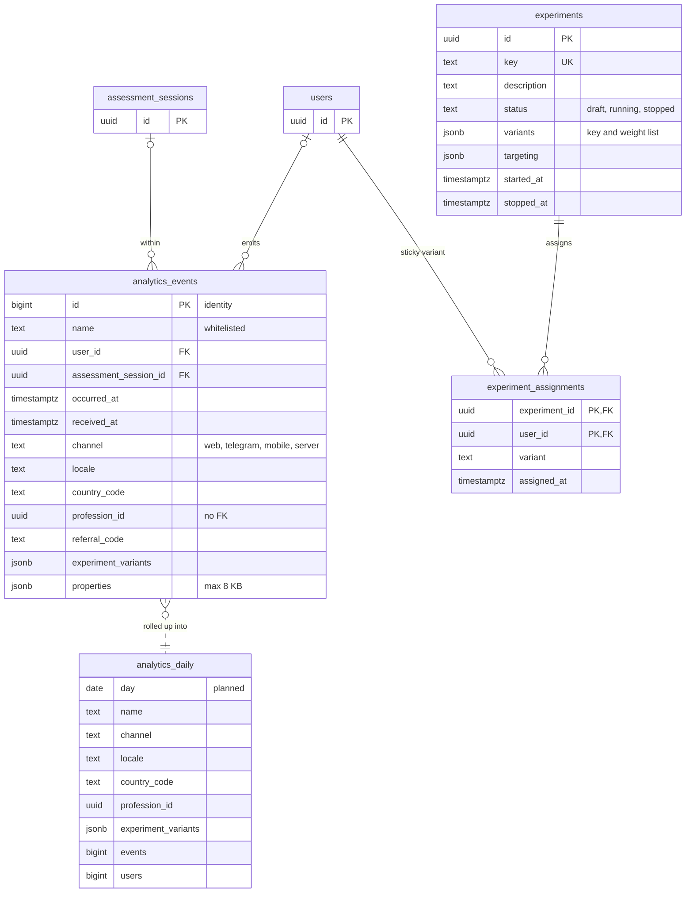

#### `analytics_events`

Append-only product events with whitelisted names (brief §11 + `result_feedback_submitted`, 02 D2). Owner: analytics.
RLS: **Server-only**. Retention: 13 months raw, then daily aggregates (§16). No PII in `properties` (02 §8.6): user
identity is the opaque `user_id` only.

| Column | Type | Constraints / notes |
|--------|------|---------------------|
| `id` | bigint | PK, `generated always as identity` |
| `name` | text | NN CK `^[a-z][a-z0-9_]{1,63}$`; whitelist enforced by the API (client-allowed names per 02 AC-F21-02 / D31; all others server-only) |
| `user_id` | uuid | FK → `users(id)` set null; **not rewritten on merge** (queries canonicalize, §16.4) |
| `assessment_session_id` | uuid | FK → `assessment_sessions(id)` set null |
| `occurred_at` | timestamptz | NN `D now()`; client value clamped (§16.2) |
| `received_at` | timestamptz | NN `D now()` |
| `channel` | text | CK in (`web`, `telegram`, `mobile`, `server`) |
| `locale` | text | CK locale shape |
| `country_code` | text | CK `^[A-Z]{2}$` |
| `profession_id` | uuid | denormalized for funnels; intentionally no FK (analytics outlives catalog edits) |
| `referral_code` | text | ≤ 16 |
| `experiment_variants` | jsonb | NN `D '{}'` `{"<experiment key>": "<variant>"}` (J3) |
| `properties` | jsonb | NN `D '{}'`, CK object and `pg_column_size ≤ 8192`; e.g. `question_answered` → `{sequence, responseMs}` (never option key or credit) |

Indexes: `(name, occurred_at)` (funnels), `(user_id, occurred_at)` (retention cohorts), `(assessment_session_id)`.

#### `experiments`

Server-side A/B experiments. Owner: experiments. RLS: **Server-only**. Retention: forever (small; results history).

| Column | Type | Constraints / notes |
|--------|------|---------------------|
| `id` | uuid | PK |
| `key` | text | NN UQ; grammar per J3 (see §20 A3) |
| `description` | text | ≤ 2000 |
| `status` | text | NN `D 'draft'` CK in (`draft`, `running`, `stopped`) |
| `variants` | jsonb | NN `D '[]'` `[{"key": "control", "weight": 50}, {"key": "b", "weight": 50}]`; validator: ≥ 2 variants, integer weights summing to 100 |
| `targeting` | jsonb | NN `D '{}'` `{channels?, locales?, countries?, professionSlugs?}` |
| `started_at`, `stopped_at` | timestamptz | |
| `created_at`, `updated_at` | timestamptz | `upd` |

#### `experiment_assignments`

Sticky variant per user = weighted pick from `hash(experiment_key + user_id)`, recorded on first exposure. RLS:
**Server-only**. Retention: kept while the experiment exists (cascade on experiment delete).

| Column | Type | Constraints / notes |
|--------|------|---------------------|
| `experiment_id` | uuid | PK part, FK → `experiments(id)` cascade |
| `user_id` | uuid | PK part, FK → `users(id)` cascade; index `(user_id)` |
| `variant` | text | NN 1–64 |
| `assigned_at` | timestamptz | NN `D now()` |

Insert with `on conflict (experiment_id, user_id) do nothing` and read back, so concurrent first exposures agree.

#### `analytics_daily` (**Planned**, created with partitioning, §16.3)

Daily rollup that outlives raw events. Owner: analytics. RLS: **Server-only**. Retention: forever.

---

## 12. Organizations and ops

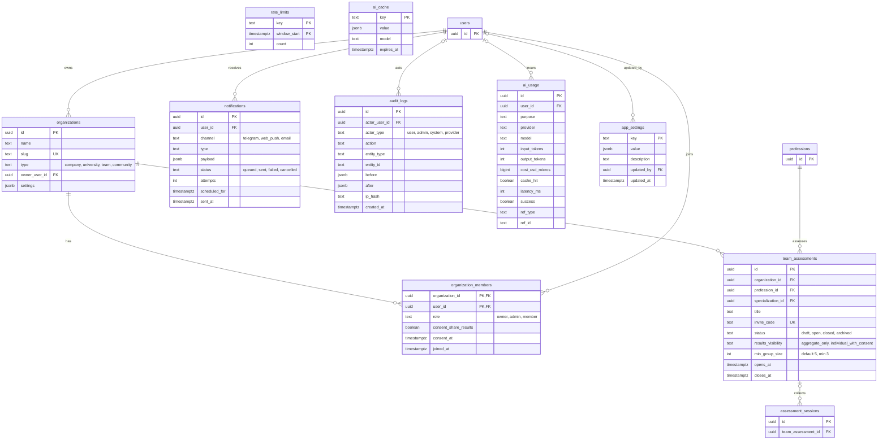

#### `organizations`

B2B organizations (post-launch). Owner: organizations. RLS: members SELECT their org (`is_org_member`). Retention:
while active; owner FK is **restrict** (an org must be transferred before its owner could be purged).

| Column | Type | Constraints / notes |
|--------|------|---------------------|
| `id` | uuid | PK |
| `name` | text | NN 1–200 |
| `slug` | text | NN UQ CK `^[a-z0-9][a-z0-9-]{1,62}$` |
| `type` | text | NN CK in (`company`, `university`, `team`, `community`) |
| `owner_user_id` | uuid | NN FK → `users(id)` restrict |
| `settings` | jsonb | NN `D '{}'` object |
| `created_at`, `updated_at` | timestamptz | `upd` |

#### `organization_members`

RLS: own membership row, or the full roster for org owners/admins (`is_org_admin`).

| Column | Type | Constraints / notes |
|--------|------|---------------------|
| `organization_id` | uuid | PK part, FK → `organizations(id)` cascade |
| `user_id` | uuid | PK part, FK → `users(id)` cascade; index `(user_id)` |
| `role` | text | NN `D 'member'` CK in (`owner`, `admin`, `member`) |
| `consent_share_results` | boolean | NN `D false`; CK consent ⇒ `consent_at` |
| `consent_at` | timestamptz | |
| `joined_at` | timestamptz | NN `D now()` |
| `created_at`, `updated_at` | timestamptz | `upd` |

#### `team_assessments`

Organization-run campaigns. RLS: **Server-only**; aggregates only via `public.team_assessment_aggregate(id)` (SECURITY
DEFINER: caller must be org owner/admin; only consenting members' latest results; no rows below `min_group_size`).

| Column | Type | Constraints / notes |
|--------|------|---------------------|
| `id` | uuid | PK |
| `organization_id` | uuid | NN FK → `organizations(id)` cascade |
| `profession_id` | uuid | NN FK → `professions(id)` restrict |
| `specialization_id` | uuid | composite FK → `specializations(id, profession_id)` restrict |
| `title` | text | NN 1–200 |
| `invite_code` | text | NN UQ CK `^[A-Z2-9]{6,12}$` |
| `status` | text | NN `D 'draft'` CK in (`draft`, `open`, `closed`, `archived`) |
| `results_visibility` | text | NN `D 'aggregate_only'` CK in (`aggregate_only`, `individual_with_consent`) |
| `min_group_size` | integer | NN `D 5` CK ≥ 3 (privacy floor) |
| `opens_at`, `closes_at` | timestamptz | CK `closes_at > opens_at` |
| `created_at`, `updated_at` | timestamptz | `upd` |

#### `notifications`

Outbound queue (post-launch; 02 §6: no reminders in the MVP). Owner: notifications. RLS: **Own** SELECT.
Retention: **Decision** — `sent`/`failed`/`cancelled` rows deleted by `prune` 180 days after `updated_at`.

| Column | Type | Constraints / notes |
|--------|------|---------------------|
| `id` | uuid | PK |
| `user_id` | uuid | NN FK → `users(id)` cascade |
| `channel` | text | NN CK in (`telegram`, `web_push`, `email`) |
| `type` | text | NN CK `^[a-z][a-z0-9_]{1,63}$` (e.g. `roadmap_day_ready`) |
| `payload` | jsonb | NN `D '{}'` — template parameters, never rendered PII |
| `status` | text | NN `D 'queued'` CK in (`queued`, `sent`, `failed`, `cancelled`) |
| `attempts` | integer | NN `D 0` |
| `scheduled_for` | timestamptz | NN `D now()` |
| `sent_at` | timestamptz | |
| `error` | text | ≤ 2000 |
| `created_at`, `updated_at` | timestamptz | `upd` |

Indexes: `(user_id, created_at desc)`, `notifications_due_idx (scheduled_for) where status = 'queued'`. Dispatcher
claims work with `select … for update skip locked limit 50`.

#### `audit_logs`

Append-only trail of privileged and financial actions (admin edits, settings, content versions, refunds, manual
unlocks, merges, deletions, role changes, entitlement consumption). Owner: kernel. RLS: **Server-only**. Retention:
**forever**. Trigger `audit_logs_append_only` rejects every UPDATE except the `set null` of `actor_user_id`; no
DELETE path exists in code.

| Column | Type | Constraints / notes |
|--------|------|---------------------|
| `id` | uuid | PK |
| `actor_user_id` | uuid | FK → `users(id)` set null |
| `actor_type` | text | NN CK in (`user`, `admin`, `system`, `provider`) |
| `action` | text | NN 1–100, dotted verb (`payment.refunded`, `identity.users_merged`, `content.question_version_published`) |
| `entity_type` | text | NN 1–64 |
| `entity_id` | text | ≤ 200 (text so composite ids like `sales_specialist.discovery.03@v2` fit) |
| `before`, `after` | jsonb | changed fields only; secrets and raw PII never logged |
| `ip_hash` | text | salted hash |
| `created_at` | timestamptz | NN `D now()` |

Indexes: `(entity_type, entity_id, created_at)`, partial `(actor_user_id, created_at)`, `(created_at)`.

#### `rate_limits`

Fixed-window counters keyed by action + hashed subject. Owner: kernel. RLS: **Server-only** (function
`public.rate_limit_hit(key, window_seconds, limit)` executable by `service_role` only). Retention: `prune` deletes
windows older than 1 day.

| Column | Type | Constraints / notes |
|--------|------|---------------------|
| `key` | text | PK part, 1–200, e.g. `answers:<user_id>`, `session_create:<ip_hash>` |
| `window_start` | timestamptz | PK part; `floor(epoch / window) × window` from `clock_timestamp()` |
| `count` | integer | NN `D 0` |

Index `(window_start)` for pruning. One upsert per hit (`on conflict … do update set count = count + 1 returning
count`).

#### `ai_usage`

Every AI call with tokens, cost, latency and cache hit. Owner: ai. RLS: **Server-only**. Retention: **Decision**
forever in the MVP (≈ a few rows per paid report); revisit at 10M rows with a monthly rollup.

| Column | Type | Constraints / notes |
|--------|------|---------------------|
| `id` | uuid | PK |
| `user_id` | uuid | FK → `users(id)` set null; re-pointed on merge (per-user budgets) |
| `purpose` | text | NN `^[a-z][a-z0-9_]{1,63}$` (`report_narrative`, `roadmap_narrative`, …) |
| `provider`, `model` | text | NN |
| `input_tokens`, `output_tokens` | integer | NN `D 0` |
| `cost_usd_micros` | bigint | NN `D 0` |
| `cache_hit` | boolean | NN `D false` |
| `latency_ms` | integer | |
| `success` | boolean | NN `D true` |
| `ref_type`, `ref_id` | text | e.g. `assessment_result`, result id (unit economics join) |
| `created_at` | timestamptz | NN `D now()` |

Indexes: `(created_at)`, partial `(user_id, created_at)`, partial `(ref_type, ref_id)`.

#### `ai_cache`

Content-addressed cache of AI outputs (key = hash of purpose + model + prompt version + inputs). Owner: ai. RLS:
**Server-only**. Retention: until `expires_at`, deleted by `prune`.

| Column | Type | Constraints / notes |
|--------|------|---------------------|
| `key` | text | PK 1–200 |
| `value` | jsonb | NN; validated with zod after read (camelCase keys, J1) |
| `model` | text | ≤ 100 |
| `created_at` | timestamptz | NN `D now()` |
| `expires_at` | timestamptz | partial index where not null |

#### `app_settings`

Runtime-tunable settings (01 §12.2). Owner: kernel. RLS: **Server-only**. Retention: forever; every change writes an
`audit_logs` row with before/after.

| Column | Type | Constraints / notes |
|--------|------|---------------------|
| `key` | text | PK CK `^[a-z][a-z0-9_]*(\.[a-z0-9_]+)*$`, ≤ 100 (`benchmark_min_sample`, `payments.expiry_minutes`, `content.version`) |
| `value` | jsonb | NN; JSON `null` = "not configured" (never guessed) |
| `description` | text | ≤ 500 |
| `updated_at` | timestamptz | `upd` |
| `updated_by` | uuid | FK → `users(id)` set null |

---

## 13. Payment integrity in SQL

The payment rules of brief §9 map onto the schema as follows. All statements run inside `withTx` (01 §3.5) on the
privileged connection.

### 13.1 State machine

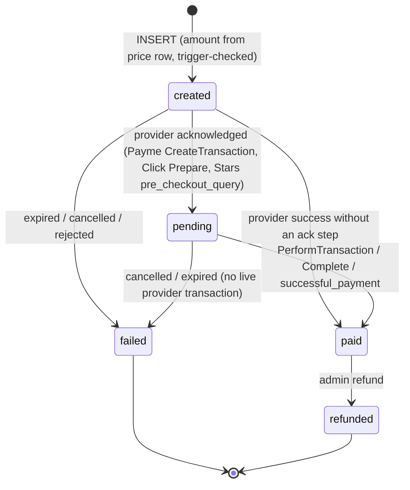

`payments_guard_update` rejects every other transition (SQLSTATE `23514`, constraint `payments_status_transition`).
There is no `failed → paid` edge: the `expire-payments` job never fails a payment that has a live provider transaction,
and a provider success that arrives for a failed payment is stored as `payment_events.outcome = 'rejected'`, alerts
ops, and is refunded manually (01 §7.4).

### 13.2 Create (idempotent)

```sql
-- 1. Already unlocked? → respond {status: 'already_unlocked'}, create nothing.
select 1 from public.result_unlocks where result_id = $target_id and unlock_type = 'full';
-- 2. Same client retry? → return it.
select * from public.payments where user_id = $user_id and idempotency_key = $key;
-- 3. Open checkout for the same target and provider? → reuse it (and its checkout link).
select * from public.payments
 where user_id = $user_id and product_id = $product_id and target_id = $target_id and provider = $provider
   and status in ('created', 'pending') and expires_at > now();
-- 4. Otherwise insert; amount/currency come from the resolved price row (§7 prices), never from the client.
insert into public.payments (user_id, product_id, price_id, target_type, target_id, amount_minor, currency, provider,
                             idempotency_key, expires_at, meta)
values ($user_id, $product_id, $price_id, 'assessment_result', $target_id, $price_amount_minor, $price_currency,
        $provider, $key, now() + make_interval(mins => $expiry_minutes), $meta)
returning *;
```

A concurrent duplicate create loses on `payments_user_id_idempotency_key_key` or on
`payments_one_open_per_target_provider` (SQLSTATE `23505`); the handler catches it and re-runs steps 2–3.

### 13.3 PAID + unlock in one transaction

```sql
begin;
-- Replay-safe event record. No row returned = replay: answer from the payment's current state and stop.
insert into public.payment_events (payment_id, provider, event_type, provider_event_id, payload, signature_valid)
values ($payment_id, 'payme', 'PerformTransaction', $payme_txn_id, $body, true)
on conflict (provider, event_type, provider_event_id) do nothing
returning id;

select * from public.payments where id = $payment_id for update;          -- serializes concurrent callbacks
-- guards in code: status in ('created','pending'); amount = stored amount_minor; not expired; target not unlocked

update public.payments
   set status = 'paid',
       provider_payment_id = $payme_txn_id,
       provider_fee_minor = round(amount_minor * $fee_percent / 100) + $fee_fixed_minor
 where id = $payment_id;                                                   -- trigger stamps paid_at = now()

insert into public.result_unlocks (user_id, result_id, unlock_type, source, payment_id)
values ($user_id, $target_id, 'full', 'payment', $payment_id)
on conflict (result_id, unlock_type) do nothing;                           -- idempotent unlock

update public.provider_transactions
   set state = 2, perform_time = $perform_time_ms, raw = $body
 where provider = 'payme' and provider_txn_id = $payme_txn_id;

insert into public.analytics_events (name, user_id, channel, properties)
values ('payment_paid', $user_id, 'server', jsonb_build_object('paymentId', $payment_id, 'provider', 'payme'));
insert into public.audit_logs (actor_type, action, entity_type, entity_id, after)
values ('provider', 'payment.paid', 'payment', $payment_id::text, jsonb_build_object('status', 'paid'));

update public.payment_events set outcome = 'applied', processed_at = now() where id = $event_id;
commit;
```

**Decision (duplicate capture):** if the UPDATE to `paid` violates `payments_one_paid_per_target` (another provider
already captured money for the same result — possible only when a provider reports success after its pre-check),
the handler rolls back, then in a new transaction stores the event with `outcome = 'rejected'`, sets the payment to
`failed` with `failure_reason = 'duplicate_paid_target'` and `meta.refundRequired = true`, and alerts ops; the integrity
counter `double_paid_target` reads these rows (§14.6).

### 13.4 Refund and expiry

```sql
-- Refund (admin, one transaction; 02 D15)
update public.payments set status = 'refunded' where id = $payment_id and status = 'paid';
delete from public.result_unlocks where payment_id = $payment_id and source = 'payment';
insert into public.audit_logs (actor_user_id, actor_type, action, entity_type, entity_id, before, after, ip_hash)
values ($admin_id, 'admin', 'payment.refunded', 'payment', $payment_id::text,
        '{"status":"paid"}', '{"status":"refunded"}', $ip_hash);
-- after commit: payment.refunded → sharing revokes the result's cards, referrals stop counting the payment

-- expire-payments (every 10 min)
update public.payments p
   set status = 'failed', failure_reason = 'expired'
 where p.status in ('created', 'pending') and p.expires_at < now()
   and not exists (select 1 from public.provider_transactions t where t.payment_id = p.id and t.state = 1);
```

### 13.5 Unit economics inputs

Per paid payment (Phase 7 view `admin_v_unit_economics`, 12 §migrations): gross = `amount_minor`; provider fee =
`provider_fee_minor`; AI cost = `sum(ai_usage.cost_usd_micros)` where `ref_type = 'assessment_result' and ref_id =
target_id`, converted with `app_settings.fx` (unknown FX ⇒ shown as unknown, never estimated); infrastructure estimate
from `app_settings`; referral reward cost = entitlements granted by rules that this payment helped trigger; net
contribution = gross − the rest, per currency.

---

## 14. Data lifecycle

### 14.1 Anonymous-user merge (Telegram sign-in or link token)

Brief §3: find-or-create the user by `telegram_user_id` and **merge** the current anonymous user into it — re-point
sessions, results, payments and referrals, mark the anonymous row `merged_into_user_id`, never lose a result. The
module-level conflict rules are 01 §3.5; this is the SQL each participant runs, **in this order, in one transaction**
(`identity.mergeUsers(tx, from, to)`), with `$from` = the anonymous (or web) user and `$to` = the Telegram user.

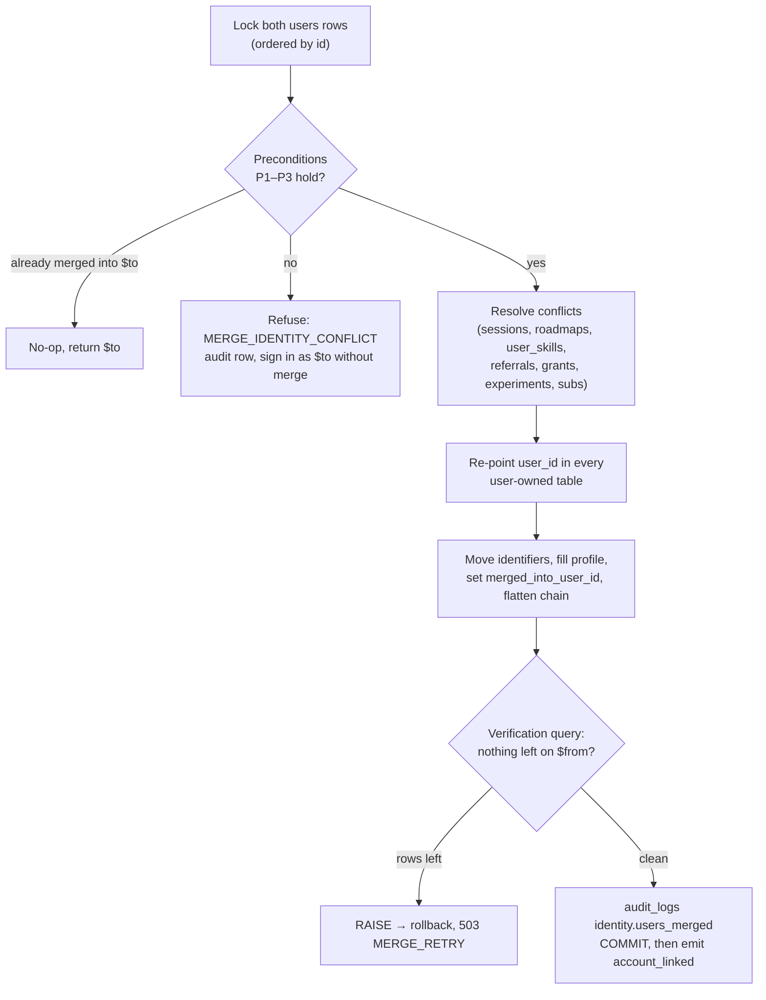

**Step 0 — transaction settings and locks.**

```sql
set local lock_timeout = '3s';
set local statement_timeout = '10s';
select id, is_anonymous, telegram_user_id, auth_user_id, phone_e164, email, country_code,
       referred_by_code_id, first_touch, merged_into_user_id, deleted_at
  from public.users
 where id in ($from, $to)
 order by id                      -- deterministic lock order: two concurrent merges cannot deadlock
   for update;
```

**Step 1 — preconditions** (checked in code on the locked rows):

- **P1** `$from <> $to`; neither row has `deleted_at`; `$to.merged_into_user_id is null`. If
  `$from.merged_into_user_id = $to` → idempotent no-op; if it points elsewhere → refuse.
- **P2** Not both identified with results: refuse when `$from.is_anonymous = false and $to.is_anonymous = false` and
  both own `assessment_results` (02 F19: merging two identified accounts is out of scope; the UI explains and points to
  support; nothing is deleted).
- **P3** No identifier conflict: for each of `telegram_user_id`, `auth_user_id`, `phone_e164`, `email` it is not the
  case that both rows have different non-NULL values.

A refusal writes `audit_logs (action 'identity.merge_refused')` and the caller signs in as `$to` without merging.
**Decision:** a *failed* merge (lock timeout, verification failure) aborts sign-in with `503 MERGE_RETRY` instead of
signing in without merging, because the client would otherwise drop the anonymous token and orphan its results; the
TMA client retries with backoff while the anonymous session stays valid.

**Step 2 — sessions and assessment data.**

```sql
update public.auth_sessions set user_id = $to where user_id = $from;      -- the old web cookie now resolves to $to

-- at most one in_progress session per user (02 D11): keep the most recently active one of the two users
update public.assessment_sessions s set status = 'abandoned'
 where s.user_id in ($from, $to) and s.status = 'in_progress'
   and s.id <> (select id from public.assessment_sessions
                 where user_id in ($from, $to) and status = 'in_progress'
                 order by last_activity_at desc, id limit 1);
update public.assessment_sessions set user_id = $to where user_id = $from;
update public.assessment_results  set user_id = $to where user_id = $from;  -- allowed by the immutability guard
update public.result_feedback     set user_id = $to where user_id = $from;  -- cannot conflict: results had one owner
update public.verification_attempts set user_id = $to where user_id = $from;
```

**Step 3 — money and access.**

```sql
-- idempotency keys are per client; a collision between two clients is only theoretical, but must not abort the merge
update public.payments f
   set idempotency_key = left(f.idempotency_key, 180) || ':m:' || left($from::text, 8)
 where f.user_id = $from
   and exists (select 1 from public.payments t where t.user_id = $to and t.idempotency_key = f.idempotency_key);
update public.payments       set user_id = $to where user_id = $from;
update public.result_unlocks set user_id = $to where user_id = $from;
update public.entitlements   set user_id = $to where user_id = $from;    -- value is never lost

-- one live subscription per (user, product): keep $to's, convert $from's remaining period into an entitlement
insert into public.entitlements (user_id, entitlement, quantity, source, source_ref, expires_at)
select $to, 'growth_os', 1, 'subscription', f.id::text, f.current_period_end
  from public.subscriptions f
 where f.user_id = $from and f.status in ('active', 'past_due')
   and exists (select 1 from public.subscriptions t where t.user_id = $to and t.product_id = f.product_id
                 and t.status in ('active', 'past_due'));
update public.subscriptions f set status = 'cancelled', cancel_at_period_end = true
 where f.user_id = $from and f.status in ('active', 'past_due')
   and exists (select 1 from public.subscriptions t where t.user_id = $to and t.product_id = f.product_id
                 and t.status in ('active', 'past_due'));
update public.subscriptions set user_id = $to where user_id = $from;
```

The partial unique indexes `payments_one_paid_per_target` and `payments_one_open_per_target_provider` cannot conflict
here: an `assessment_result` target has exactly one owner, and target-less payments have NULL `target_id` (distinct).
**Decision:** a future target type that two users could share must fail `$from`'s open `created` payments
(`failure_reason = 'superseded_by_merge'`) before re-pointing, and abort the merge if a `pending`/`paid` conflict remains.

**Step 4 — sharing and referrals.**

```sql
update public.share_cards  set user_id = $to where user_id = $from;
update public.share_events set user_id = $to where user_id = $from;

-- referral code: one per user. If $to has none, $from's code moves; otherwise $from's code stays on the merged row
-- and attribution resolves its owner through canonicalUserId() (01 §3.5).
update public.referral_codes set user_id = $to
 where user_id = $from and not exists (select 1 from public.referral_codes where user_id = $to);

-- (a) referrals between the two identities are self-referrals: invalidate, do not re-point
update public.referrals set is_valid = false, invalid_reason = 'merged_identity'
 where (referrer_user_id = $from and referred_user_id = $to)
    or (referrer_user_id = $to and referred_user_id = $from);
-- (b) $from was referred but $to already has its own referral row → duplicate (referred_user_id is unique)
update public.referrals f set is_valid = false, invalid_reason = 'merged_duplicate'
 where f.referred_user_id = $from
   and exists (select 1 from public.referrals t where t.referred_user_id = $to);
-- (c) re-point the rest
update public.referrals set referred_user_id = $to
 where referred_user_id = $from and referrer_user_id <> $to
   and not exists (select 1 from public.referrals where referred_user_id = $to);
update public.referrals set referrer_user_id = $to
 where referrer_user_id = $from and referred_user_id <> $to;

-- reward grants: unique (user_id, rule_id). Conflicting grants stay on $from as history; their entitlements
-- were already re-pointed in step 3, so no value is lost.
update public.referral_reward_grants f set user_id = $to
 where f.user_id = $from
   and not exists (select 1 from public.referral_reward_grants t where t.user_id = $to and t.rule_id = f.rule_id);
```

**Step 5 — growth, roadmaps, experiments, ops.**

```sql
update public.goals set user_id = $to where user_id = $from;

-- one active roadmap per (user, profession): keep the one started most recently, archive the other
update public.roadmaps f set status = 'archived'
 where f.user_id = $from and f.status = 'active'
   and exists (select 1 from public.roadmaps t
                where t.user_id = $to and t.status = 'active' and t.profession_id = f.profession_id
                  and coalesce(t.started_at, t.created_at) >= coalesce(f.started_at, f.created_at));
update public.roadmaps t set status = 'archived'
 where t.user_id = $to and t.status = 'active'
   and exists (select 1 from public.roadmaps f
                where f.user_id = $from and f.status = 'active' and f.profession_id = t.profession_id);
update public.roadmaps       set user_id = $to where user_id = $from;    -- roadmap_items follow their roadmap
update public.action_results set user_id = $to where user_id = $from;

-- user_skills (PK user, skill): keep the row with the later updated_at
delete from public.user_skills t using public.user_skills f
 where t.user_id = $to and f.user_id = $from and f.skill_id = t.skill_id and f.updated_at > t.updated_at;
delete from public.user_skills f using public.user_skills t
 where f.user_id = $from and t.user_id = $to and f.skill_id = t.skill_id;
update public.user_skills   set user_id = $to where user_id = $from;
update public.skill_history set user_id = $to where user_id = $from;
update public.level_history set user_id = $to where user_id = $from;

-- experiments: on conflict keep $to's variant; $from's conflicting rows stay (inert)
update public.experiment_assignments f set user_id = $to
 where f.user_id = $from
   and not exists (select 1 from public.experiment_assignments t
                    where t.user_id = $to and t.experiment_id = f.experiment_id);

update public.notifications set status = 'cancelled' where user_id = $from and status = 'queued';
update public.notifications set user_id = $to where user_id = $from;
update public.organization_members f set user_id = $to
 where f.user_id = $from
   and not exists (select 1 from public.organization_members t
                    where t.user_id = $to and t.organization_id = f.organization_id);
update public.organizations set owner_user_id = $to where owner_user_id = $from;
update public.ai_usage      set user_id = $to where user_id = $from;      -- per-user AI budgets stay correct
update public.link_tokens   set expires_at = least(expires_at, now())
 where user_id = $from and consumed_at is null;                           -- the consumed one was marked by identity
```

Not rewritten, by design: `analytics_events` (append-only; queries canonicalize, §16.4), `audit_logs` (append-only
trigger), `app_settings.updated_by`.

**Step 6 — profile and identity row.**

```sql
-- profile: fill $to's NULL columns from $from; consents and share-name choice are NOT transferred implicitly
update public.profiles t set
       display_name         = coalesce(t.display_name, f.display_name),
       first_name           = coalesce(t.first_name, f.first_name),
       time_per_day_minutes = coalesce(t.time_per_day_minutes, f.time_per_day_minutes),
       budget               = coalesce(t.budget, f.budget),
       location             = coalesce(t.location, f.location),
       goal_type            = coalesce(t.goal_type, f.goal_type),
       timezone             = coalesce(t.timezone, f.timezone)
  from public.profiles f
 where t.user_id = $to and f.user_id = $from;
update public.profiles set user_id = $to
 where user_id = $from and not exists (select 1 from public.profiles where user_id = $to);
delete from public.profiles where user_id = $from;                        -- leftover after the copy

-- identifiers: unique constraints are checked per statement, so clear them on $from first
update public.users
   set telegram_user_id = null, auth_user_id = null, phone_e164 = null, email = null,
       merged_into_user_id = $to
 where id = $from;
update public.users t
   set telegram_user_id    = coalesce(t.telegram_user_id, $from_telegram_user_id),
       auth_user_id        = coalesce(t.auth_user_id, $from_auth_user_id),
       phone_e164          = coalesce(t.phone_e164, $from_phone_e164),
       email               = coalesce(t.email, $from_email),
       is_anonymous        = t.is_anonymous and $from_is_anonymous,
       country_code        = coalesce(t.country_code, $from_country_code),
       first_touch         = case when t.first_touch = '{}'::jsonb then $from_first_touch else t.first_touch end,
       referred_by_code_id = coalesce(t.referred_by_code_id,
                               case when $from_referral_valid_after_merge then $from_referred_by_code_id end)
 where t.id = $to;
-- flatten chains: anything previously merged into $from now points straight at $to
update public.users set merged_into_user_id = $to where merged_into_user_id = $from;
```

`$from_referral_valid_after_merge` is true when `$from`'s referral row was re-pointed in step 4(c) (not invalidated),
so `$to` never ends up "referred" by its own code.

**Step 7 — verification and audit.**

```sql
select t, n from (
            select 'assessment_sessions' t, count(*) n from public.assessment_sessions where user_id = $from
  union all select 'assessment_results', count(*) from public.assessment_results  where user_id = $from
  union all select 'payments',           count(*) from public.payments            where user_id = $from
  union all select 'result_unlocks',     count(*) from public.result_unlocks      where user_id = $from
  union all select 'entitlements',       count(*) from public.entitlements        where user_id = $from
  union all select 'share_cards',        count(*) from public.share_cards         where user_id = $from
  union all select 'auth_sessions',      count(*) from public.auth_sessions       where user_id = $from
  union all select 'roadmaps',           count(*) from public.roadmaps            where user_id = $from
) x where n > 0;     -- any row → RAISE, transaction rolls back (lost_results must stay 0)

insert into public.audit_logs (actor_user_id, actor_type, action, entity_type, entity_id, before, after, ip_hash)
values ($to, 'user', 'identity.users_merged', 'user', $from::text,
        jsonb_build_object('fromUserId', $from, 'toUserId', $to),
        $moved_counts_json, $ip_hash);
```

After commit: `identity.users_merged` → analytics `account_linked` (server event) and a reconcile of referral reward
rules for `$to` (its valid referral counts may have grown; grants are idempotent). Intentional leftovers on `$from`:
a kept referral code, conflicting reward grants, conflicting experiment assignments, invalidated referral rows — all
history, none user-visible.

### 14.2 Result immutability

A finalized result is a statement about one session at one time; it never changes (brief §4; 01 §7.3: "reads never
recompute"). Already enforced: `assessment_results.session_id` is unique (idempotent finalization), answered questions
and their options are immutable (§5 triggers), payments' amounts are immutable. **Planned** migration
`<ts>_results_immutability.sql` adds:

```sql
create or replace function public.assessment_results_guard_immutable()
returns trigger
language plpgsql
set search_path = ''
as $$
begin
  if (old.id, old.session_id, old.profession_id, old.specialization_id, old.assessment_version,
      old.scoring_model_version, old.question_versions, old.composite_score, old.composite_se, old.theta,
      old.assessed_level, old.level_id, old.confidence, old.confidence_reasons, old.bottleneck_skill_id,
      old.next_level, old.teaser, old.created_at)
     is distinct from
     (new.id, new.session_id, new.profession_id, new.specialization_id, new.assessment_version,
      new.scoring_model_version, new.question_versions, new.composite_score, new.composite_se, new.theta,
      new.assessed_level, new.level_id, new.confidence, new.confidence_reasons, new.bottleneck_skill_id,
      new.next_level, new.teaser, new.created_at)
  then
    raise exception 'assessment result % is immutable', old.id
      using errcode = 'check_violation', constraint = 'assessment_results_immutable';
  end if;
  if new.report is distinct from old.report
     and coalesce(current_setting('level.allow_report_rebuild', true), '') <> 'on' then
    raise exception 'assessment result % report is immutable outside an audited rebuild', old.id
      using errcode = 'check_violation', constraint = 'assessment_results_report_immutable';
  end if;
  return new;  -- user_id (merge), ai_report (async narrative) and updated_at may change
end
$$;

create trigger assessment_results_guard_immutable
  before update on public.assessment_results
  for each row execute function public.assessment_results_guard_immutable();

-- skill_scores, level_scores and assessment_answers are insert-only
create or replace function public.reject_update()
returns trigger
language plpgsql
set search_path = ''
as $$
begin
  raise exception '% rows are insert-only', tg_table_name
    using errcode = 'check_violation', constraint = tg_table_name || '_insert_only';
end
$$;
create trigger skill_scores_insert_only before update on public.skill_scores
  for each row execute function public.reject_update();
create trigger level_scores_insert_only before update on public.level_scores
  for each row execute function public.reject_update();
create trigger assessment_answers_insert_only before update on public.assessment_answers
  for each row execute function public.reject_update();
```

- **Report rebuild (Decision):** if a defect in report *presentation* must be fixed for existing results, an admin job
  runs `set local level.allow_report_rebuild = 'on'`, rewrites `report` with a bumped `report.meta.reportGeneratorVersion`,
  and writes one `audit_logs` row per result (`result.report_rebuilt`, before/after hashes). Scores, level and
  confidence columns cannot change even then. A changed *scoring* is never applied retroactively: the user retakes the
  assessment (new session, new result).
- No repository contains `DELETE` against `assessment_results`, `skill_scores`, `level_scores` or `assessment_answers`
  (enforced by a grep rule in `scripts/arch/`); only cascades from a future hard user purge can remove them.
- Refunds do not touch results: they remove the payment-sourced unlock (the result returns to teaser view).

### 14.3 Auditability through versions

| Question an auditor asks | Where the answer is pinned |
|--------------------------|----------------------------|
| Which exact items, with which parameters and wording, did the user see? | `assessment_answers.question_id` (version row) + `question_version`; content/psychometric columns and options immutable once answered |
| Why did the CAT pick those items? | `assessment_sessions.rng_seed` + `template_id`/`template_version` + `experiment_variants`; per-step PRNG `splitmix64(rng_seed + sequence)` — reproducible |
| How was the score computed? | `assessment_results.scoring_model_version` (code is versioned, never edited in place), `question_versions`, `report.meta.weights` |
| Which thresholds and requirements produced the level? | `assessment_results.level_id`, `level_scores` (met + missing per level), `report.meta.levelScheme` |
| What did the user pay, at which price, with which fee? | `payments.price_id`, `amount_minor`, `currency`, `provider_fee_minor` snapshot; `payment_events` raw callbacks; `provider_transactions` |
| Who changed content, settings, prices, roles; who refunded or unlocked manually? | `audit_logs` (before/after), `app_settings.updated_by`, question `source` + version rows |
| Which roadmap logic produced a plan? | `roadmaps.generator`, `generator_version`; `roadmap_items` text snapshots |

**Decision:** a scoring model change (algorithm or constants such as τ = 0.8, the θ grid, the D = 1.7 constant) ships
as a new `scoring_model_version` string; the code of every version that has results stays in
`src/modules/scoring/domain` and is selectable by version. **Planned** script `scripts/audit/replay-result.ts
<resultId>` loads the inputs below, re-runs the pinned model, and diffs composite, θ, level and skill scores (tolerance
1e-6):

```sql
select a.sequence, a.question_id, a.question_version, a.selected_option_keys, a.credit, a.response_ms,
       q.question_key, q.skill_id, q.type, q.difficulty, q.discrimination, q.guessing, q.weight
  from public.assessment_answers a
  join public.assessment_questions q on q.id = a.question_id
 where a.session_id = (select session_id from public.assessment_results where id = $result_id)
 order by a.sequence;
```

### 14.4 Deletion request (02 F19, D27)

"Maʼlumotlarimni oʻchirish" runs one transaction (`identity.requestDeletion`, with participants), then writes an audit
row. Hard purge jobs are out of MVP scope; the FK actions in §1.9 make a later purge a single `delete from users`.

```sql
update public.users
   set deleted_at = now(), telegram_user_id = null, auth_user_id = null, phone_e164 = null, email = null,
       first_touch = '{}'::jsonb
 where id = $user_id;
update public.profiles
   set display_name = null, first_name = null, username = null, location = null, timezone = null,
       show_name_on_share = false, notifications_opt_in = false, marketing_opt_in = false
 where user_id = $user_id;
update public.auth_sessions  set revoked_at = now() where user_id = $user_id and revoked_at is null;
update public.share_cards    set revoked_at = now(), display_name = null, show_name = false
 where user_id = $user_id and revoked_at is null;                         -- public pages answer 410
update public.referral_codes set is_active = false where user_id = $user_id;
update public.notifications  set status = 'cancelled' where user_id = $user_id and status = 'queued';
update public.action_results set note = null, evidence = null where user_id = $user_id;
update public.result_feedback set comment = null where user_id = $user_id;
update public.verification_attempts set submission = null, transcript = null where user_id = $user_id;
insert into public.audit_logs (actor_user_id, actor_type, action, entity_type, entity_id, ip_hash)
values ($user_id, 'user', 'identity.deletion_requested', 'user', $user_id::text, $ip_hash);
```

Kept, pseudonymous: payments and provider records (accounting; linked only by the opaque user id), results and answers
(no PII; needed for item statistics), analytics events (no PII by rule). **Decision:** identifiers are nulled so a
returning Telegram user starts a fresh account rather than reviving the deleted one.

### 14.5 Retention schedule

Jobs are the cron handlers of 01 §14 (`/api/v1/cron/{job}`).

| Data | Retention | Job |
|------|-----------|-----|
| `rate_limits` | windows older than 1 day | `prune` (daily 04:10 UTC) |
| `ai_cache` | until `expires_at` | `prune` |
| `link_tokens` | 7 days after `expires_at` | `prune` |
| `auth_sessions` | 90 days after `coalesce(revoked_at, expires_at)` (**Decision**) | `prune` |
| `notifications` (sent/failed/cancelled) | 180 days after `updated_at` (**Decision**) | `prune` (post-launch) |
| `analytics_events` | 13 months raw, then `analytics_daily` forever (01 §15) | `prune` (batched delete) until partitioned; then `analytics-partitions` (monthly) |
| `share_events` | 13 months (**Decision**) | `prune` (batched) |
| `assessment_sessions` in progress | idle > 24 h → `expired` (02 D11) | `expire-sessions` (hourly) |
| `payments` open | past `expires_at` → `failed` | `expire-payments` (every 10 min) |
| Payments, provider records, unlocks, entitlements, subscriptions, reward grants | forever (financial) | — |
| Sessions, answers, results, scores, feedback ratings | forever (results never lost; recalibration; replay) | — |
| `audit_logs` | forever, append-only | — |
| `ai_usage` | forever in MVP (**Decision**, revisit at 10M rows) | — |
| Catalog, content, evidence, benchmarks, experiments | forever; archived/retired instead of deleted | — |
| User free text (`profiles` fields, notes, comments, submissions) | until deletion request → nulled | `identity.requestDeletion` |
| Empty anonymous users | forever in MVP; **Decision**: post-MVP purge of anonymous users with no sessions, payments, referrals, codes or cards and `last_seen_at` older than 180 days | — |

Batched deletes (no long locks, no table bloat spikes):

```sql
delete from public.analytics_events
 where id in (select id from public.analytics_events
               where occurred_at < now() - interval '13 months'
               order by id limit 10000);      -- repeated until 0 rows, ≤ 60 s per run
```

### 14.6 Integrity queries (`integrity` job, daily 01:10 UTC; 02 §3.3)

```sql
-- lost_results: results still owned by a merged user
select count(*) from public.assessment_results r
  join public.users u on u.id = r.user_id where u.merged_into_user_id is not null;
-- unlock_without_payment
select count(*) from public.result_unlocks u
  left join public.payments p on p.id = u.payment_id
 where u.source = 'payment' and (p.id is null or p.status <> 'paid');
-- paid_without_unlock
select count(*) from public.payments p
  join public.products pr on pr.id = p.product_id and pr.entitlement = 'result_unlock'
 where p.status = 'paid' and p.target_type = 'assessment_result'
   and not exists (select 1 from public.result_unlocks u where u.result_id = p.target_id and u.unlock_type = 'full');
-- double_paid_target (the partial unique index prevents the state; this counts captures that need a refund)
select count(*) from public.payments where failure_reason = 'duplicate_paid_target';
-- dangling array references (example; one query per §1.8 column)
select a.id, x.rid from public.actions a cross join lateral unnest(a.resource_ids) as x(rid)
 where not exists (select 1 from public.learning_resources r where r.id = x.rid);
```

---

## 15. pgvector usage plan

### 15.1 Principles

- Semantic search is an **internal quality and curation tool**, never a user-facing "ask anything" surface
  (brief §0). Nothing in the assessment, scoring, report, payment or roadmap path depends on it.
- pgvector is optional: Supabase ships it; a plain local or CI Postgres may not. Every migration that touches vector
  objects is a conditional `DO` block, and the application feature-detects at boot.
- Embeddings are **derived data**: fully rebuildable from content, never backed up separately, never exposed to
  clients.

### 15.2 Storage (implemented, migration `…001300_pgvector_optional.sql`)

The migration checks `pg_available_extensions` for `vector`; if absent it raises a NOTICE and returns (no-op). If
present it creates the extension (in schema `extensions` when that schema exists, as on Supabase), adds
`learning_resources.embedding vector(1536)`, and creates:

| Column | Type | Constraints / notes |
|--------|------|---------------------|
| `entity_type` | text | PK part, CK in (`learning_resource`, `assessment_question`, `action`, `skill`, `claim`, `profession`) |
| `entity_id` | uuid | PK part; polymorphic, no FK (orphans removed by the `integrity` job) |
| `model` | text | PK part, 1–100 — rows of different models coexist; queries always filter by the current model |
| `content_hash` | text | ≤ 128; `sha256(model || '\n' || embedded_text)` — re-embed only when it changes |
| `embedding` | `extensions.vector(1536)` | NN |
| `created_at`, `updated_at` | timestamptz | `upd` |

RLS enabled and all privileges revoked from `anon`/`authenticated` (server-only).

### 15.3 What is embedded

| Entity | Embedded text (**Decision**) | Used for |
|--------|------------------------------|----------|
| `assessment_question` (current versions only) | `en` prompt + `en` scenario + `en` option labels | near-duplicate detection when authoring or editing items (content CI and the admin editor warn when cosine distance to an existing current item of the same profession is below a configurable threshold, default 0.08) |
| `learning_resource` | title + author + type + the reviewer's `en` summary | reviewer suggestions: top-k candidate resources per skill description; a human accepts the mapping into `learning_resources.skill_ids` (verification status untouched) |
| `skill`, `action` | `en` name/title + description | resource ↔ skill ↔ action suggestions for content reviewers |
| `claim` | `en` statement | finding existing claims before writing a new one (avoids duplicate claims with diverging confidence) |
| `profession` | `en` name + description + skill names | post-MVP profession search on the landing page (static list in the MVP) |

`en` is required for every active content row (02 D5), so one vector per entity suffices; the embedding model must be
multilingual if `uz`/`ru` search queries are ever embedded (post-MVP decision when profession search ships).

### 15.4 Write path

- **Planned** `scripts/content/embed.ts` runs after `db:seed` (and on demand from admin) when
  `content_embeddings` exists and an embedding provider is configured. It never runs in a request path.
- Provider: an `EmbeddingProvider` interface next to `AiProvider` (the Anthropic implementation of `AiProvider` does
  not produce embeddings). The concrete provider and model are chosen when the first embedding feature is scheduled;
  `NullEmbeddingProvider` (default) disables the feature. The dimension is fixed at 1536 by the migration;
  **Decision:** adopting a model with another dimension means a conditional migration that recreates
  `content_embeddings` with the new dimension (derived data, no loss) — mixed dimensions in one column are impossible.
- Upsert, skipping unchanged content:

  ```sql
  insert into public.content_embeddings (entity_type, entity_id, model, content_hash, embedding)
  values ($type, $id, $model, $hash, $vector::extensions.vector)
  on conflict (entity_type, entity_id, model) do update
     set embedding = excluded.embedding, content_hash = excluded.content_hash
   where public.content_embeddings.content_hash is distinct from excluded.content_hash;
  ```

- Non-current question versions are deleted from the table when a new version is published (§17.4).

### 15.5 Query path

```sql
select e.entity_id, e.embedding operator(extensions.<=>) $query::extensions.vector as distance
  from public.content_embeddings e
  join public.assessment_questions q on q.id = e.entity_id and q.is_current
 where e.entity_type = 'assessment_question' and e.model = $model and q.profession_id = $profession_id
 order by e.embedding operator(extensions.<=>) $query::extensions.vector
 limit 10;
```

- `<=>` is cosine distance. The operator and type are schema-qualified because the extension schema is not on the
  pooled connection's `search_path` in every environment; the repository reads the schema name once at boot
  (`select n.nspname from pg_extension e join pg_namespace n on n.oid = e.extnamespace where e.extname = 'vector'`).
- **Index (Decision):** none at first. The planned corpus is in the low thousands of rows (10 professions × ~40+
  questions, plus resources, actions and skills), where an exact scan is both correct and fast. An HNSW index is added
  by a conditional migration when any `(entity_type, model)` slice exceeds 20,000 rows or the measured p95 of these
  admin queries exceeds 50 ms:

  ```sql
  do $$
  declare v_schema text;
  begin
    if to_regclass('public.content_embeddings') is null then
      raise notice 'pgvector not installed: skipping content_embeddings index';
      return;
    end if;
    select n.nspname into v_schema from pg_extension e join pg_namespace n on n.oid = e.extnamespace
     where e.extname = 'vector';
    execute format('create index if not exists content_embeddings_question_hnsw_idx on public.content_embeddings '
                || 'using hnsw (embedding %I.vector_cosine_ops) where entity_type = %L', v_schema, 'assessment_question');
  end
  $$;
  ```

### 15.6 Availability detection and fallback

- Boot check (cached per instance): `select to_regclass('public.content_embeddings') is not null as available`. The
  feature is on only when available **and** `app_settings.features.semanticSearch = true` **and** a non-null embedding
  provider is configured.
- Fallback when off: duplicate detection uses the deterministic validator check (normalized `en` prompt equality and
  identical option sets); reviewer suggestions use `skill_ids` overlap (GIN) and `ILIKE` on titles.
- `learning_resources.embedding` (created by `…001300`) is **not used**; `content_embeddings` is the single store
  (**Decision**). A later conditional migration drops the column (§20 A8).

---

## 16. `analytics_events` partitioning and retention

### 16.1 Stance

The MVP keeps `analytics_events` as one plain table with a `bigint` identity key and three btree indexes (§11).
Partitioning is introduced when the 01 §15 trigger fires (`analytics_events` > 20M rows, or dashboard queries > 2 s,
or DB CPU > 60 % sustained). As a sizing aid (arithmetic, not a measurement): 01 §15 counts ~20 events per completed
assessment, so 1M completed assessments ≈ 20M rows. Until then, retention is the batched delete of §14.5.

### 16.2 Ingestion rules that keep partitions bounded

- Server events: `occurred_at = now()`, `channel = 'server'`.
- Client events (02 AC-F21-01: ≤ 20 per request, ≤ 2 KB `properties` each, whitelisted names): **Decision** — the
  server clamps the client timestamp, `occurred_at = least(received_at, greatest(client_ts, received_at - interval
  '72 hours'))`, and records `properties.clockAdjusted = true` when it had to. No row can land in a far-past or future
  partition.
- One multi-row `insert … values (…), (…)` per request; no per-event round trips.

### 16.3 Target design

- `analytics_events` becomes `partition by range (occurred_at)` with **monthly** partitions named
  `analytics_events_yYYYYmMM` plus `analytics_events_default` (catches anything outside the pre-created range; the
  `ops-checks` job alerts if it is non-empty).
- PK becomes `(id, occurred_at)` (a partitioned table's unique keys must include the partition key).
- **Decision:** `id` uses a plain sequence default instead of `generated always as identity` (identity columns on
  partitioned tables are not available on every Postgres major version Supabase runs; a sequence works on 15+).
- **Decision:** the two FKs (`user_id`, `assessment_session_id`) are dropped at conversion: users and sessions are
  never hard-deleted in the MVP, analytics is append-only, and FK checks on the hottest insert path buy nothing.
- Same three indexes, declared on the parent (propagated to every partition).
- Every partition gets `enable row level security` and inherits revoked privileges (default privileges from
  `…001200`), so `check-rls` stays green.
- Rollup table (created in the same migration):

  ```sql
  create table public.analytics_daily (
    day                 date not null,
    name                text not null,
    channel             text,
    locale              text,
    country_code        text,
    profession_id       uuid,
    experiment_variants jsonb not null default '{}'::jsonb,
    events              bigint not null check (events >= 0),
    users               bigint not null check (users >= 0),   -- distinct canonical users that day (not additive)
    created_at          timestamptz not null default now()
  );
  create unique index analytics_daily_key on public.analytics_daily
    (day, name, channel, locale, country_code, profession_id, experiment_variants) nulls not distinct;
  alter table public.analytics_daily enable row level security;
  ```

  Funnels and D7/D30 retention are computed from raw events inside the 13-month window; older periods keep daily
  counts only.

### 16.4 Conversion procedure (migration `<ts>_analytics_partitioning.sql` + backfill script)

```sql
-- Migration (one short transaction; the only exclusive lock is the rename)
alter table public.analytics_events rename to analytics_events_legacy;
-- Index names, the PK constraint and the identity sequence keep their old names after a table rename and are
-- schema-unique, so move them out of the way before the new table claims those names.
alter index public.analytics_events_name_idx    rename to analytics_events_legacy_name_idx;
alter index public.analytics_events_user_idx    rename to analytics_events_legacy_user_idx;
alter index public.analytics_events_session_idx rename to analytics_events_legacy_session_idx;
alter table public.analytics_events_legacy rename constraint analytics_events_pkey to analytics_events_legacy_pkey;
create sequence public.analytics_events_event_id_seq as bigint;   -- legacy identity sequence keeps its own name
select setval('public.analytics_events_event_id_seq',
              (select coalesce(max(id), 0) + 1 from public.analytics_events_legacy), false);
create table public.analytics_events (
  id                    bigint not null default nextval('public.analytics_events_event_id_seq'),
  name                  text not null check (name ~ '^[a-z][a-z0-9_]{1,63}$'),
  user_id               uuid,
  assessment_session_id uuid,
  occurred_at           timestamptz not null default now(),
  received_at           timestamptz not null default now(),
  channel               text check (channel in ('web', 'telegram', 'mobile', 'server')),
  locale                text check (locale ~ '^[a-z]{2,3}(-[A-Za-z0-9]{2,8})*$'),
  country_code          text check (country_code ~ '^[A-Z]{2}$'),
  profession_id         uuid,
  referral_code         text check (length(referral_code) <= 16),
  experiment_variants   jsonb not null default '{}'::jsonb check (jsonb_typeof(experiment_variants) = 'object'),
  properties            jsonb not null default '{}'::jsonb
                          check (jsonb_typeof(properties) = 'object' and pg_column_size(properties) <= 8192),
  primary key (id, occurred_at)
) partition by range (occurred_at);
alter sequence public.analytics_events_event_id_seq owned by public.analytics_events.id;
create table public.analytics_events_default partition of public.analytics_events default;
do $$
declare m date;
begin
  for m in
    select generate_series(
             date_trunc('month', coalesce((select min(occurred_at) from public.analytics_events_legacy), now())),
             date_trunc('month', now()) + interval '3 months',
             interval '1 month')::date
  loop
    execute format('create table if not exists public.%I partition of public.analytics_events '
                || 'for values from (%L) to (%L)',
                   'analytics_events_y' || to_char(m, 'YYYY') || 'm' || to_char(m, 'MM'), m, (m + interval '1 month')::date);
  end loop;
end
$$;
create index analytics_events_name_idx    on public.analytics_events (name, occurred_at);
create index analytics_events_user_idx    on public.analytics_events (user_id, occurred_at);
create index analytics_events_session_idx on public.analytics_events (assessment_session_id);
-- + enable RLS on parent and every partition (loop as in …001200), revoke from anon/authenticated
```

Then `scripts/db/backfill-analytics.ts` copies `analytics_events_legacy` in batches of 50,000 ids (`insert into
analytics_events (<explicit column list>) select <same list> from analytics_events_legacy where id > $last and id <=
$last + 50000`), compares per-month counts, and only then drops the legacy table in a follow-up migration. New events
flow into the partitioned table from the moment the migration commits; the app does not change (same table name and
columns).

### 16.5 Monthly maintenance (`analytics-partitions` job)

1. Create the next 3 months of partitions if missing (`create table if not exists … partition of …`), enable RLS.
2. For each partition whose upper bound is older than `date_trunc('month', now()) - interval '13 months'`:
   - upsert its rollup idempotently:

     ```sql
     insert into public.analytics_daily (day, name, channel, locale, country_code, profession_id,
                                         experiment_variants, events, users)
     select e.occurred_at::date, e.name, e.channel, e.locale, e.country_code, e.profession_id, e.experiment_variants,
            count(*), count(distinct coalesce(u.merged_into_user_id, e.user_id))
       from public.analytics_events_y2027m01 e
       left join public.users u on u.id = e.user_id
      group by 1, 2, 3, 4, 5, 6, 7
     on conflict (day, name, channel, locale, country_code, profession_id, experiment_variants)
     do update set events = excluded.events, users = excluded.users;
     ```

   - `alter table public.analytics_events detach partition public.analytics_events_y2027m01;` then `drop table` —
     run in the 04:10 UTC window with `lock_timeout = '5s'` and up to 3 retries (both statements briefly lock the
     parent). `DETACH … CONCURRENTLY` is not relied on (it cannot run in a transaction block and has restrictions
     around DEFAULT partitions).
3. Alert if `analytics_events_default` holds rows.

### 16.6 Query rules

- Every user-level metric canonicalizes merged users: `coalesce(u.merged_into_user_id, e.user_id)` with `left join
  users u on u.id = e.user_id` (merges flatten chains, so one hop is exact).
- Every query filters on `occurred_at` (partition pruning) — admin views (`admin_v_funnel_daily` etc., Phase 7) take a
  date range parameter; dashboards on materialized views refreshed by cron at the 100k stage (01 §15).
- Experiment analysis groups by `experiment_variants ->> '<key>'`; a user merged mid-experiment is analysed with the
  variant recorded on each event (exposure-based), and `experiment_assignments` keeps the target's variant thereafter.

---

## 17. Content seed and versioning strategy

### 17.1 Content-as-code pipeline

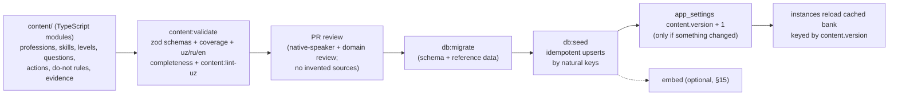

- Content lives in `content/` as typed modules validated by `content/schema.ts` (the repo's form of 12 §5's reviewed
  JSON; the rules below are identical). Seeder entry point: `npm run db:seed`.
- **Reference data needed for the app to boot** (languages, currencies, countries, products, prices, provider configs,
  reward rules, settings defaults) is inserted by migrations (`…001400_reference_data.sql`) with `on conflict do
  nothing` — insert-if-absent, so runtime edits by admins are never overwritten.
- **Profession content** (categories → professions → specializations → skills → weights → edges → levels → requirements
  → templates → questions + options → sources → resources → claims + evidence → actions → do-not rules → verification
  tasks) is upserted by the seeder in that FK order.
- Deploy order: `db:migrate` → `db:seed` → promote the new app build. Old app instances tolerate new content (they read
  whatever is current).

### 17.2 Idempotency rules

| Rule | Mechanism |
|------|-----------|
| Natural keys, never uuids, identify content | see table §17.5 |
| A second run is a no-op (13 Phase 2 exit criterion) | every upsert has `where (cols) is distinct from (excluded cols)` so unchanged rows are not touched and `updated_at` does not move; the seeder counts affected rows |
| `content.version` bumps only on change | final transaction: `update app_settings set value = to_jsonb((value::text)::int + 1) where key = 'content.version'` iff affected rows > 0; written to `audit_logs` (`content.seeded`, counts per table) |
| No partial profession | one transaction per profession; failures roll back that profession only and fail the run |
| No concurrent seeders | session-level `select pg_try_advisory_lock(hashtext('level:content-seed'))`; not acquired → exit with "seed already running". The seeder (like the migration runner) uses the direct database connection (`DATABASE_URL_DIRECT`), because session-level advisory locks are not reliable through the transaction-mode pooler |
| Removal never deletes referenced content | an entity missing from files is archived: professions/specializations/skills/actions/do-not rules/verification tasks → `status = 'archived'`; questions → `status = 'retired'`; level requirements and skill edges (not referenced by user data) are deleted |
| Sources and resources | upsert by `slug`; `verification_status = 'verified'` only when the file carries reviewer metadata (`review: {by, at}`); the validator rejects `verified` without it (**Decision**) |

Example (professions; same shape for every slug-keyed table):

```sql
insert into public.professions as p (category_id, slug, name, description, status, is_regulated, disclaimer, config,
                                     sort_order)
values ($category_id, 'accountant', $name, $description, 'active', true, $disclaimer, $config, 6)
on conflict (slug) do update
   set category_id = excluded.category_id, name = excluded.name, description = excluded.description,
       status = excluded.status, is_regulated = excluded.is_regulated, disclaimer = excluded.disclaimer,
       config = excluded.config, sort_order = excluded.sort_order
 where (p.category_id, p.name, p.description, p.status, p.is_regulated, p.disclaimer, p.config, p.sort_order)
       is distinct from
       (excluded.category_id, excluded.name, excluded.description, excluded.status, excluded.is_regulated,
        excluded.disclaimer, excluded.config, excluded.sort_order)
returning p.id;
```

`level_requirements` has no natural key: the seeder computes the desired set per (effective level, profession scope)
and applies a set difference on the full tuple `(requirement_type, skill_id, threshold, gates_assessed, description,
sort_order)` — insert missing, delete absent, leave equal rows untouched.

### 17.3 Question versioning in the seeder

Derived parameters are computed by the seeder when the file omits them: `difficulty = (target_level − 5) × 0.7`;
`discrimination = 1.0` (`self_report` 0.5); `guessing = 1 / options` for single-best knowledge/judgment/scenario/decision
items else 0; `weight = 1` (`self_report` 0.5). `content_hash` (**Planned** column) = sha256 of the canonical JSON
(sorted keys, numbers normalized to the column scale) of every immutable column plus the ordered options
`[{optionKey, label, score, sortOrder}]`.

Per `question_key`, inside the profession transaction:

```sql
select q.id, q.version, q.content_hash, q.source,
       exists (select 1 from public.assessment_answers a where a.question_id = q.id) as answered
  from public.assessment_questions q
 where q.question_key = $key and q.is_current
   for update;
```

| Current row | File hash vs current | Action |
|-------------|----------------------|--------|
| none | — | insert version 1 (`is_current = true`, `source = 'seed'`, status from file) + options |
| exists | equal | no-op (lifecycle-only changes such as `status`/`tags` are applied in place) |
| exists, not answered | different | update in place (allowed by the guard) and replace options |
| exists, answered | different | **new version**: old row `is_current = false, status = 'retired'`, then insert `version + 1` with `is_current = true` + options (statement order matters: the partial unique index on `is_current` is checked per statement) |
| exists, `source = 'admin'` | different | **drift**: do not overwrite; report and fail in CI unless the content file is updated from the admin version (export script) or the run passes `--accept-file` (**Decision**: prevents seed ↔ admin ping-pong) |

Race safety: if a learner answers the item between the `answered` check and an in-place update, the immutability
trigger raises, the profession transaction rolls back, and the re-run takes the new-version branch. Correctness rests
on the database guard, not on timing.

### 17.4 Admin edits create new question versions

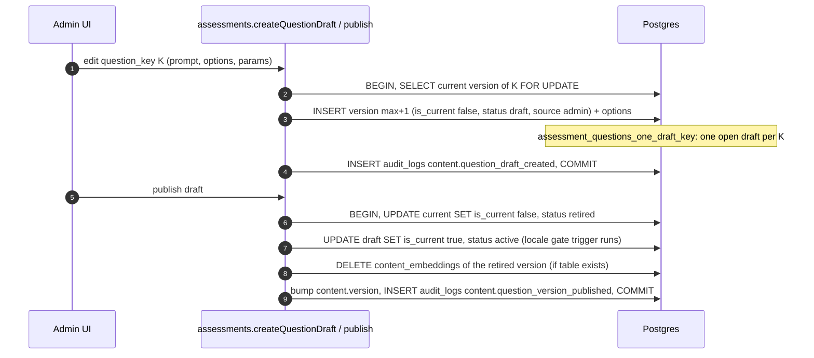

- A draft is freely editable (it has no answers); publishing is the only way it reaches learners.
- In-progress sessions keep their pinned versions: an answer to a pending retired version is still scored with that
  version's options. New selections read the bank of the new `content.version`.
- **Decision:** the CAT excludes already-served items by `question_key` (not by version id), within a session and
  across the retest window, so a version published mid-session can never re-serve the same item.
- Flagging (admin flags from low completion, 02 F18) sets `status = 'flagged'` on the current version; flagged items
  leave the bank immediately (the bank filter is `is_current and status = 'active'`) and no version is created.
- Recalibration (01 §15: offline 2PL fit on items with ≥ 300 responses) writes new `difficulty`/`discrimination` values
  into the content files → the seeder creates new versions; `scoring_model_version` changes only if the algorithm
  changes.
- Item statistics are reported per version (parameters differ) and rolled up per `question_key`.
- Templates follow the same rule: a change to `config`, `context_questions` or `scoring_model_version` of a template
  referenced by sessions inserts `version + 1` as `active` and retires the old row.
- Catalog tables other than questions/templates (skills, importance, levels, requirements, actions, do-not rules) are
  edited in place: every result snapshots what it used (`level_scores`, `report.meta`, `roadmap_items` text), so
  edits only affect future results.

### 17.5 Natural keys used by the seeder

| Table | Key |
|-------|-----|
| `profession_categories`, `professions` | `slug` |
| `specializations`, `skills`, `actions`, `do_not_rules`, `verification_tasks` | `(profession_id, slug)` |
| `specialization_skill_weights` | `(specialization_id, skill_id)` |
| `skill_prerequisites` | `(skill_id, depends_on_skill_id, relation)` |
| `levels` | `(profession_id, number)` / `number` for the default scheme (two partial unique indexes → two upsert statements) |
| `level_requirements` | set difference on the full tuple (§17.2) |
| `assessment_templates` | `(profession_id, slug, version)` |
| `assessment_questions` | `(question_key, version)` + `is_current` (§17.3) |
| `question_options` | `(question_id, option_key)` |
| `sources`, `learning_resources` | `slug` |
| `claims` / `evidence` | **Planned** `claims.slug` UQ (claims currently have no natural key); evidence by `(claim_id, source_id, locator)` |
| `products`, `prices`, `payment_provider_configs`, `referral_reward_rules`, `app_settings` | `slug`; `prices_natural_key`; `(provider, country_code)`; `key`; `key` — insert-if-absent |

---

## 18. Migration practice

- Files: `supabase/migrations/<YYYYMMDDHHMMSS>_<module>_<change>.sql`; applied in lexical order. The local/test runner
  (`scripts/db/migrate-lib.ts`) applies each file in its own transaction and records `name` + sha256 `checksum` in
  `level_meta.migrations`; an applied file whose checksum changed aborts the run. Applied files are never edited;
  fixes are new files.
- Tests: integration tests create a fresh database, apply `scripts/db/supabase-local-shim.sql` (roles `anon`,
  `authenticated`, `service_role`; `auth.uid()` from `request.jwt.claims`), then all migrations, then RLS tests that
  `set local role authenticated` with crafted claims.
- Every new table ships, in the same migration: RLS enabled, grants (or none), FK indexes, `set_updated_at` trigger if
  mutable, comments (`comment on table …`), and this document's update.
- Breaking changes follow expand → migrate code → contract across two deploys (12 §migrations). New CHECKs and FKs on
  large tables use `not valid` + `validate constraint`.
- **Decision (Planned runner feature):** a migration whose first line is `-- level:no-transaction` runs outside a
  transaction so it may use `create index concurrently` on large tables (`analytics_events`, `assessment_answers`); such
  files contain exactly one statement each.
- Optional extensions (pgvector) are always guarded by `DO` blocks keyed on `pg_available_extensions` /
  `to_regclass(...)` so every environment applies the same file list.

---

## 19. Hot queries and the indexes that serve them

| Path | Query shape | Index |
|------|-------------|-------|
| Session resolution (every request) | `auth_sessions` by `id`, `users` by `id` | PKs |
| Telegram sign-in | `users where telegram_user_id = $1` | UQ `telegram_user_id` |
| Item bank load (cached per `content.version`) | current active questions of a profession + options | `assessment_questions_bank_idx`; UQ `(question_id, option_key)` |
| Active session / retest cooldown | sessions by `(user_id, profession_id)` newest first | `assessment_sessions_user_idx`; Planned `one_in_progress` |
| Submit answer | session by `id` FOR UPDATE; insert answer | PK; UQ `(session_id, sequence)` |
| Finalize | result by `session_id` | UQ `session_id` |
| Home / history | results by `user_id` newest first | `assessment_results_user_idx` |
| Access check (teaser vs full) | `result_unlocks` by `(result_id, unlock_type)` | UQ |
| Create payment | `(user_id, idempotency_key)`; open payment by target | UQ; `payments_one_open_per_target_provider` |
| Webhook | payment by `id`; `provider_transactions (provider, provider_txn_id)`; `payment_events` dedupe | PK; UQs |
| Payme GetStatement | `provider_transactions` by `(provider, create_time)` range | `provider_transactions_create_time_idx` |
| `expire-payments` / `expire-sessions` | open payments by `created_at`; in-progress sessions by `last_activity_at` | partial indexes |
| Share page `/s/{slug}` | `share_cards` by `slug` | UQ `slug` |
| Referral visit `/r/{code}` | `referral_codes` by `code` | UQ `code` |
| Reward evaluation | `referrals` by `(referrer_user_id, status)` | `referrals_referrer_idx` |
| Rate limit | upsert `(key, window_start)` | PK |
| Funnels / cohorts | `analytics_events` by `(name, occurred_at)`, `(user_id, occurred_at)` | btree indexes (+ partition pruning later) |
| Item statistics | answers by `question_id` | `assessment_answers_question_id_idx` |
| Notifications due | `status = 'queued'` by `scheduled_for` | `notifications_due_idx` |

Rule: every FK column is indexed unless it is the leading column of another index (the migrations follow this; the
`(skill_id, profession_id)` indexes exist for the composite FKs).

---

## 20. Alignment notes (implemented vs. specified)

Differences between the applied migrations, the brief and the sibling documents, with the resolution this document
adopts. Each "Planned" item needs a new migration (never an edit of an applied file).

| # | Topic | Resolution |
|---|-------|-----------|
| A1 | Brief: `assessment_questions.specialization_id` (NULL = all). Migration: `specialization_ids uuid[]` (empty = all). | **Decision:** keep the array — it is a strict generalization (one item can serve several specializations without duplicate items and duplicate statistics); "empty = all" preserves the brief's semantics. |
| A2 | `link_tokens` (01 D9, 02 D26) is not in the migrations. | **Planned** `<ts>_identity_link_tokens.sql` per §3. |
| A3 | `experiments.key` CHECK is `^[a-z][a-z0-9_]{1,63}$`; 01 uses dotted keys (`assessment.length`, `price.full_report`); J3 forbids `_` in keys used as jsonb object keys. | **Planned:** CHECK `^[a-z][a-z0-9-]*(\.[a-z][a-z0-9-]*)*$` and ≤ 64 chars; experiment keys are written `teaser.headline`, `price.full-report`, `assessment.length`. |
| A4 | `…001400` inserts an inactive 5 XTR `full_report` price; 02 D14 says no XTR price is seeded. | Harmless while inactive (never offered); **Planned** reference-data migration deletes it if no payment references it, so the owner must create the Stars price explicitly. |
| A5 | `…001400` activates the brief's example rules (3 paid → `deep_analysis`, 3 completed → `verification_attempt`); 02 D21 defines the MVP rule 3 completed → 1 `retest`. | **Planned:** insert `three_completed_retest` active; set the two example rules `is_active = false` until `deep_report` and verification launch. |
| A6 | `…001400` settings keys (`default_retest_cooldown_days`, `ai_monthly_budget_usd`, `infra_cost_per_assessment_minor`, `share_base_url`, `benchmark_window_days`) differ from 01 §12.2. | 01 §12.2 is the reference; the next reference-data migration inserts the 01 keys (insert-if-absent) and the code reads only those. |
| A7 | Integrity guards not yet implemented. | **Planned:** results/scores/answers immutability (§14.2); template immutability + one active template (§5); session status guard + one in-progress session per user (§5); `assessment_questions.content_hash` and one-draft index (§5, §17); `share_cards_reuse_idx` (§8); history uniqueness (§9); `claims.slug` (§17.5). |
| A8 | `…001300` adds `learning_resources.embedding`, unused. | `content_embeddings` is the single store; a conditional migration drops the column. |
| A9 | Brief context experience values are `0`, `lt1`, `1to3`, `3to5`, `5plus` (and `experience_caps` example `{"0": 4, "lt1": 5}`); `content/context-questions.ts` and `content/schema.ts` use `none` for the first band. | One spelling must be used in `assessment_sessions.context` and `professions.config.experienceCaps`; this document uses the brief's `0`. The content layer must map or rename before Phase 3 seeding. |
| A10 | 01 §18 says "no global column transform"; `src/lib/db/client.ts` uses `postgres.camel`. | Rules J1–J4 (§1.7) make jsonb safe under the transform; 01 §18 should be updated to match the code. |
| A11 | 12 §5 describes JSON content files and `scripts/content/seed.ts`; the repo has TypeScript content modules and `npm run db:seed`. | Same rules; §17 applies to either form. 12 §6 names the ledger `meta.schema_migrations`; the runner uses `level_meta.migrations`. |
| A12 | Brief: `payment_provider_configs(provider, country_code, …)` without an id. | Migration adds surrogate `id` with UQ `(provider, country_code)` — equivalent. |

---

## 21. Decision log

Decisions made in this document that other sections must align with:

1. **jsonb key spelling (J1–J5):** camelCase structural keys; no data values with `_` as object keys (arrays instead);
   experiment keys without `_`; provider payloads verbatim and read as text; zod on write.
2. **`question_versions`** is an array `[{questionId, questionKey, version}]`; **`assessment_version`** =
   `<template_slug>@v<version>` (or `<profession_slug>@c<content.version>` without a template).
3. **`report.meta`** snapshots `reportGeneratorVersion`, `plannerVersion`, `contentVersion`, importance weights and
   the level scheme; results, skill scores, level scores and answers are immutable (Planned triggers); a report-only
   rebuild requires `level.allow_report_rebuild` and an audit row.
4. **Question versioning:** admin edits create drafts (`is_current = false`), publish swaps `is_current` and retires the
   old version; seeder creates `version + 1` only when an answered item changed; admin-sourced versions are protected
   from seed overwrite (drift check); CAT exclusion is by `question_key`.
5. **Merge procedure** (§14.1): ordered locks, preconditions P1–P3, conflict rules for in-progress sessions (keep most
   recent), active roadmaps (keep most recently started), `user_skills` (later `updated_at`), referrals
   (`merged_identity` / `merged_duplicate`), subscriptions (convert remaining period into an entitlement), identifiers
   moved after being cleared on the source, chain flattening, verification query, `503 MERGE_RETRY` on failure.
6. **Deletion** nulls identifiers and free text, revokes sessions and cards, keeps pseudonymous payments, results and
   events.
7. **Retention:** auth sessions 90 days after end; link tokens 7 days after expiry; notifications 180 days; analytics
   and share events 13 months raw (then `analytics_daily`); financial, assessment and audit data forever.
8. **Payments:** fee rounding `round(amount × pct / 100) + fixed` snapshotted at PAID; duplicate capture →
   `failed` + `duplicate_paid_target` + `meta.refundRequired`; provider transaction state codes shared across
   providers; no payer PII requested from providers.
9. **Analytics:** client timestamps clamped to `[received_at − 72 h, received_at]`; partitioning by month on
   `occurred_at` with a sequence-default id, PK `(id, occurred_at)`, FKs dropped, DEFAULT partition alerting; metrics
   canonicalize merged users.
10. **pgvector:** `content_embeddings` is the only vector store; `en` text embedded; exact search until 20,000 rows per
    slice or p95 > 50 ms, then a conditional HNSW migration; `EmbeddingProvider` separate from `AiProvider`, null by
    default; everything conditional on extension availability.
11. **Seeding:** reference data in migrations (insert-if-absent); profession content via `db:seed` with natural keys,
    `is distinct from` no-op upserts, one transaction per profession, advisory lock, `content.version` bump only on
    change, archive instead of delete, `verified` only with reviewer metadata.
12. **Smaller invariants:** one in-progress session per user; one active template per track; share-card reuse per
    toggle set; `last_seen_at` / `last_used_at` / `view_count` write throttling; claims need verified evidence to be
    active; benchmarks use one latest result per canonical user and profession.
