# 05 — Profession Taxonomy and Skill Models

> **Scope.** The canonical content specification for the LEVEL catalog: the taxonomy (category → profession →
> specialization), profession-scoped skills, importance weights, specialization multipliers, the skill dependency
> graph, per-profession level schemes and level requirements, experience caps, verification task ideas, and
> regulated-domain notes — first as a general model, then exactly for each of the 10 MVP professions.
>
> **Audience.** Content authors (who write `content/professions/<slug>/index.ts`), the catalog/scoring/results
> engineers (who consume it), and reviewers of `npm run content:validate`.
>
> **Sources of truth.** The engineering brief (§4 catalog tables, §6 assessment engine, §7 levels, §8 result engine,
> §13 content) governs. `04-database-erd.md` §4 describes the tables; `content/schema.ts` is the authoring schema.
> Where the brief is silent this document records a **Decision:**. Everything in §5–§14 is normative for content:
> slugs, importances, weights, edges and thresholds here must equal the seeded content. A content PR that changes any
> of them updates this document in the same PR.
>
> **Related.** `01-architecture.md` (catalog, scoring, results modules), `02-mvp-spec.md` (F03 categories, F07 level
> assignment, F11 skill bars, F12 next level), `04-database-erd.md` (§4 Catalog, §9 verification tables, §17 seeding).

## Contents

1. [Model overview](#1-model-overview)
2. [Data model and authoring rules](#2-data-model-and-authoring-rules)
3. [Level schemes, requirements and experience caps](#3-level-schemes-requirements-and-experience-caps)
4. [Verification model](#4-verification-model)
5. [Profession 1 — entrepreneur](#5-profession-1--entrepreneur)
6. [Profession 2 — software_developer](#6-profession-2--software_developer)
7. [Profession 3 — sales_specialist](#7-profession-3--sales_specialist)
8. [Profession 4 — marketing](#8-profession-4--marketing)
9. [Profession 5 — manager](#9-profession-5--manager)
10. [Profession 6 — accountant](#10-profession-6--accountant)
11. [Profession 7 — designer](#11-profession-7--designer)
12. [Profession 8 — career_readiness](#12-profession-8--career_readiness)
13. [Profession 9 — teacher](#13-profession-9--teacher)
14. [Profession 10 — driving_instructor](#14-profession-10--driving_instructor)
15. [Cross-profession summary](#15-cross-profession-summary)
16. [Content author checklist and validator rules](#16-content-author-checklist-and-validator-rules)
17. [Decision log and alignment notes](#17-decision-log-and-alignment-notes)

---

## 1. Model overview

LEVEL measures **domain competency in one profession at a time**. A level is never a statement about a person's
worth or intelligence (brief §0). The catalog is a three-level taxonomy plus a per-profession skill model:

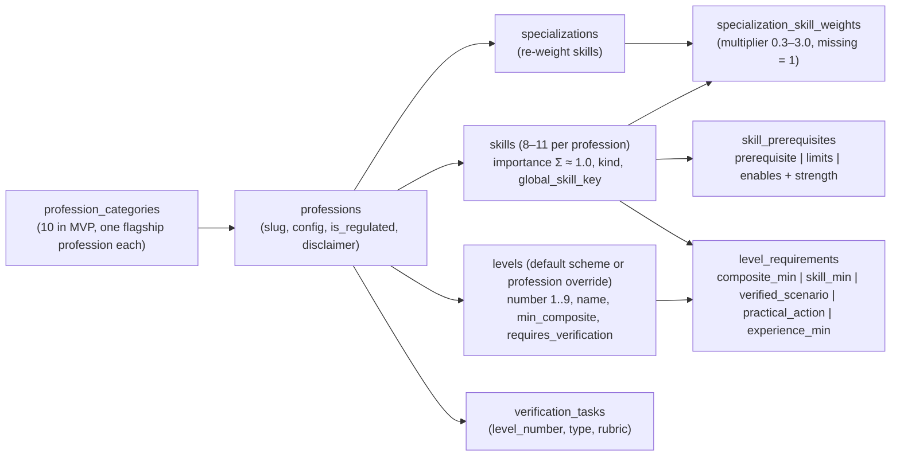

How each element is used at runtime (brief §6–§8):

| Element | Consumer | Effect |
|---------|----------|--------|
| `skills.importance` × specialization weight | scoring (composite), routing (coverage order) | Composite = normalized weighted mean of skill scores |
| Context `skillBoosts` (profession context questions) | routing only | Re-orders coverage; **Decision:** never changes composite weights (composite must be reproducible from importance × specialization weight alone, as snapshotted in `report.meta.weights`) |
| `skill_prerequisites` | results (bottleneck, explanation), roadmaps (ordering) | Leverage formula, "learn X before Y", explanation templates |
| `levels.min_composite` + `level_requirements` | scoring (assessed level), results (next-level gap) | Highest level whose composite and gates are met |
| `professions.config.experienceCaps` | scoring | Caps the assessed level for low experience |
| `verification_tasks` | verification (flag `verification = false` in MVP) | Grants the separate VERIFIED level |
| `global_skill_key` | growth/home (transferable skills view) | **Decision:** display-only in MVP; never used as a scoring prior |

---

## 2. Data model and authoring rules

### 2.1 Categories

**Decision:** category slugs are those already seeded by `content/taxonomy/categories.ts`:

| sort | slug | name (uz / ru / en) | MVP profession |
|------|------|---------------------|----------------|
| 1 | `business` | Tadbirkorlik / Предпринимательство / Entrepreneurship | `entrepreneur` |
| 2 | `technology` | Dasturlash / Программирование / Software development | `software_developer` |
| 3 | `sales` | Savdo / Продажи / Sales | `sales_specialist` |
| 4 | `marketing` | Marketing va SMM / Маркетинг и SMM / Marketing & SMM | `marketing` |
| 5 | `management` | Boshqaruv / Управление / Management | `manager` |
| 6 | `finance` | Buxgalteriya / Бухгалтерия / Accounting | `accountant` |
| 7 | `design` | Dizayn / Дизайн / Design | `designer` |
| 8 | `career` | Talaba va karyera / Студенты и карьера / Students & career | `career_readiness` |
| 9 | `education` | Taʼlim / Образование / Teaching | `teacher` |
| 10 | `driving` | Avtomaktab / Автошкола / Driving instruction | `driving_instructor` |

See §17 A1 for the mismatch with `02-mvp-spec.md` D6 (`it`, `accounting`, `students`).

### 2.2 Professions

Authoring object (`ProfessionContent` in `content/schema.ts`) → table `professions`.

| Field | Rule |
|-------|------|
| `slug` | snake_case, equals the folder name, immutable once any result exists |
| `category` | one of §2.1 |
| `name`, `description` | i18n `{uz, ru, en}`, all three required |
| `isRegulated` | `true` for `accountant`, `driving_instructor` (see §10, §14). Requires `disclaimer` |
| `disclaimer` | i18n; shown on the profession start screen (before the first context question), in the full-report footer and on every verification task screen. **Decision:** never on share cards (they carry no advice) |
| `config` | only keys that differ from defaults: `minQuestions 7, maxQuestions 15, targetQuestions 12, targetSe 0.45, retestCooldownDays 14, experienceCaps {"0": 4, "lt1": 5}, maxSelfReportItems 2, minScenarioLikeItems 2` |

### 2.3 Specializations

- 0..n per profession; slug snake_case, unique within the profession.
- A specialization never adds skills. It only re-weights the profession's skills (`skillWeights: {skillSlug: weight}`)
  and filters questions (`question.specializations`, empty = all). Specialization-flavoured items (e.g. a Python/
  pandas item for `ai_ml`) live under an existing skill and carry `specializations: ["ai_ml"]`.
- **Decision:** weights are in **[0.3, 3.0]** (DB allows 0–3; 0 is not used in MVP because a 0-weight skill would
  silently disappear from the report). Missing = 1.0. Only non-1.0 weights are listed in this document.
- **Decision:** a skill that is a **gate skill** (K1–K3 in §3.3) must have weight ≥ 0.5 in every specialization, so a
  gate is never applied to a skill the specialization barely measures.
- "No specialization chosen" (allowed in UI as "Umumiy / Общий / General") = all weights 1.0.

### 2.4 Skills

| Field | Rule |
|-------|------|
| `slug` | snake_case, unique per profession, ≤ 40 chars, stable forever (question keys embed it: `<profession>.<skill>.<nn>`) |
| `globalSkillKey` | from the controlled vocabulary in §2.5 or `null`. **Decision:** unique per profession (no two skills of one profession share a key) |
| `name` | i18n, ≤ 40 chars per locale (fits a skill bar label on a 360 px screen) |
| `description` | i18n, one sentence, ≤ 160 chars — the definition given in this document |
| `kind` | `hard` (domain knowledge/technique), `soft` (interpersonal), `meta` (judgment, self-regulation, learning) |
| `importance` | (0, 1], 2 decimals; Σ over the profession = 1.00 (validator tolerance ±0.05; this document uses exactly 1.00) |
| count | 8–11 per profession (brief §13; schema allows 6–12 but MVP content must stay in 8–11) |

**Adjusted importance and composite.** For specialization *s* (or none):

```
adj_i      = importance_i × weight_{s,i}            (weight = 1 when missing or no specialization)
composite  = Σ_i adj_i × score_i / Σ_i adj_i        (normalized; score_i ∈ 0..100)
```

Unmeasured skills (θ_s = θ_g, `measured = false`) keep their weight; their score equals the general-ability score,
so they are neutral. **Decision:** gate skills (K1–K3) are always in the routing coverage set regardless of
specialization weight, so gates are evaluated on directly measured skills (aligns with brief §6 coverage phase).

### 2.5 `global_skill_key` vocabulary (Decision)

Cross-profession identity for transferable skills ("your communication skill is assessed in 4 professions").
Controlled list — adding a key requires a PR to this table:

| key | meaning |
|-----|---------|
| `communication` | spoken/interpersonal communication |
| `writing` | written communication |
| `negotiation` | negotiation |
| `sales` | selling and closing |
| `marketing` | creating demand |
| `customer_focus` | understanding customers/users/audiences |
| `finance_literacy` | reading and managing money and financial information |
| `unit_economics` | per-unit profitability |
| `operations` | processes and their improvement |
| `planning` | goal setting, planning, structuring work |
| `decision_making` | decisions under uncertainty |
| `leadership` | leading people |
| `hiring` | hiring and onboarding |
| `feedback` | giving/receiving feedback, coaching, critique |
| `self_management` | priorities, time, resilience |
| `problem_solving` | diagnosing and solving problems |
| `learning_agility` | learning how to learn, reflection |
| `digital_tools` | professional software/tools fluency |
| `teamwork` | collaboration in a team |
| `data_literacy` | measurement and analytics |
| `ethics_compliance` | professional ethics and rule compliance |
| `safety` | physical safety and risk management |
| `programming` | general programming ability |
| `sql` | SQL and relational data |

Scores are **never** copied or averaged across professions (the item banks differ). The transferable view shows each
profession's own score side by side, labelled with its profession.

### 2.6 Dependency graph (`skill_prerequisites`)

Authoring edge `{from, to, relation, strength, rationale}` → row (`depends_on_skill_id = from`, `skill_id = to`).

| relation | Meaning | Engine use (brief §8) |
|----------|---------|----------------------|
| `prerequisite` | Learn *from* before *to* | Prerequisite-first tie-break in bottleneck; roadmap orders *from* before *to* |
| `limits` | A weak *from* caps the value of a strong *to* | Leverage term `strength × max(0, score(to) − score(from)) / 100`; explanation template names the limited strong skill |
| `enables` | *from* makes *to* easier/faster to grow (soft link) | Roadmap may pair actions; no leverage term |

Leverage (brief §8), restated with this document's notation:

```
gap_to_next(w)  = max(0, threshold_{L+1}(w) − score(w)) / 100
                  threshold_{L+1}(w) = skill_min of w at level L+1 if one exists, else min_composite(L+1)
leverage(w)     = adj_importance(w) × gap_to_next(w)
                + Σ_{y : (w limits y)} strength(w, y) × max(0, score(y) − score(w)) / 100
bottleneck      = argmax leverage over weak skills; if w is a prerequisite of another weak skill, w wins ties
                  (Decision: "tie" = leverage within 0.005)
```

**Strength scale (Decision):** only four values are used so that authors are consistent:

| strength | label | use when |
|----------|-------|----------|
| 0.9 | critical | *to* is nearly worthless or unsafe without *from* |
| 0.7 | strong | *to* regularly fails to convert into results without *from* |
| 0.5 | moderate | clear, common dependency |
| 0.3 | weak | noticeable but secondary |

**Graph rules (validator):**

1. `prerequisite` edges form a DAG (no cycles).
2. No 2-cycles of `limits` (A limits B and B limits A).
3. At most one edge per (from, to) pair (the PK allows one per relation; we restrict to one in total).
4. 7–12 edges per profession; every skill appears in ≥ 1 edge.
5. Every `limits` edge has an i18n `rationale` that reads as an explanation template, phrased about the work, never
   about the person ("Sotuv talab yaratadi, lekin ichki jarayonlar takrorlanmaydi.", not "Siz tartibsizsiz").

In the per-profession diagrams: `-->` prerequisite, `==>` limits, `-.->` enables; labels show the strength.

---

## 3. Level schemes, requirements and experience caps

### 3.1 Default scheme (brief §7, `content/levels/default.ts`)

| # | slug | en | uz | ru | min_composite | requires_verification |
|---|------|----|----|----|--------------|-----------------------|
| 1 | `starter` | Starter | Boshlangʻich | Старт | 0 | no |
| 2 | `beginner` | Beginner | Yangi boshlovchi | Начинающий | 15 | no |
| 3 | `developing` | Developing | Rivojlanayotgan | Развивающийся | 25 | no |
| 4 | `practitioner` | Practitioner | Amaliyotchi | Практик | 35 | no |
| 5 | `professional` | Professional | Professional | Профессионал | 45 | no |
| 6 | `advanced` | Advanced | Ilgʻor | Продвинутый | 55 | no |
| 7 | `expert` | Expert | Ekspert | Эксперт | 65 | no |
| 8 | `leader` | Leader | Yetakchi | Лидер | 75 | **yes** |
| 9 | `master` | Master | Ustoz | Мастер | 85 | **yes** |

**Decision:** all 10 MVP professions keep the default **thresholds** (no profession has calibration data yet that
would justify moving them; thresholds move only after real score distributions exist, through a new
`scoring_model_version`). Three professions rename levels for their domain: `entrepreneur`, `software_developer`,
`career_readiness` (§5, §6, §12) — and only names/slugs/meanings change. A renaming profession supplies all 9 level
objects (schema `levels.length(9)`); levels it does not rename copy the default text verbatim.

Badge/share label: `LEVEL {number} · {name.en uppercased}` plus the localized name underneath (as in
`content/levels/default.ts`). With an override the profession's names are used ("LEVEL 5 · SYSTEM BUILDER").

### 3.2 Requirement types

| type | threshold | skill | gates_assessed | Satisfied when |
|------|-----------|-------|----------------|----------------|
| `composite_min` | = `min_composite(L)` | — | true | composite ≥ threshold |
| `skill_min` | 0–100 | required | true | `skill_scores.score` ≥ threshold |
| `verified_scenario` | null | optional | **false** | a passed verification attempt on a non-portfolio task of that level (§4) |
| `practical_action` | null | optional | **false** | a passed verification attempt on a `portfolio` task of that level (§4) |
| `experience_min` | band ordinal | — | — | **Decision:** not authored in MVP (experience caps cover it) |

**Decision (composite_min):** authors never write `composite_min`. The seeder generates exactly one
`composite_min` row per level 2..9 of every effective scheme with `threshold = min_composite`, so the "what is
missing for the next level" list (02 F12) is uniform. The validator rejects an authored `composite_min`.

**Decision (verification rows never gate ASSESSED):** `verified_scenario` and `practical_action` rows always have
`gates_assessed = false`. Levels 8–9 are already unreachable by assessment through `requires_verification`
(brief §7 cap). Showing them as requirements is what tells the user *how* to get there.

### 3.3 Standard requirement template (Decision)

Each profession names three **gate skills**: **K1** (the skill without which the profession's output does not
exist), **K2** and **K3** (the next most load-bearing). Thresholds are derived from `min_composite(L)` with slack
that narrows as the level rises (skill scores have larger SE than the composite, and an imbalanced profile is
expected at low levels):

| L | composite_min | K1 | K2 | K3 | verification rows (gates_assessed = false) |
|---|---------------|----|----|----|--------------------------------------------|
| 2 | 15 | ≥ 10 | — | — | — |
| 3 | 25 | ≥ 20 | — | — | — |
| 4 | 35 | ≥ 30 | ≥ 25 | — | — |
| 5 | 45 | ≥ 40 | ≥ 35 | — | `verified_scenario` (L5 task) |
| 6 | 55 | ≥ 50 | ≥ 45 | ≥ 45 | — |
| 7 | 65 | ≥ 60 | ≥ 55 | ≥ 55 | `verified_scenario` (L7 task) |
| 8 | 75 | ≥ 70 | ≥ 65 | ≥ 65 | `verified_scenario` (L8 task) + `practical_action` (L8 portfolio) |
| 9 | 85 | ≥ 80 | ≥ 75 | ≥ 75 | `verified_scenario` (L9 task) + `practical_action` (L9 portfolio) |

Rule of thumb: K1 = `min_composite − 5`; K2/K3 = `min_composite − 10`. Professions may add a fourth gate or tighten a
gate (documented per profession, e.g. `driving_instructor.safety_risk_management` has **no slack**). `skill_min`
rows at levels 8–9 keep `gates_assessed = true` (harmless — the cap already applies) so the same rows are reused for
the VERIFIED computation.

Requirement description copy pattern (i18n, authored per row):

- `skill_min`: uz "«{skill}» koʻnikmasi kamida {threshold} ball", ru "Навык «{skill}» не ниже {threshold}",
  en "{skill} at least {threshold}".
- `verified_scenario`: uz "Amaliy vaziyatni real topshiriqda tasdiqlash", ru "Подтвердить навык в практическом
  сценарии", en "Prove it in a practical scenario".
- `practical_action`: uz "Real ishdan dalil taqdim etish", ru "Предоставить подтверждение из реальной работы",
  en "Provide evidence from real work".

### 3.4 Experience caps

`experienceCaps` maps the context experience band to the maximum ASSESSED level. Brief spelling of the bands:
`0`, `lt1`, `1to3`, `3to5`, `5plus` (content code currently spells the first band `none`; see §17 A2). Default
`{"0": 4, "lt1": 5}`. Overrides in this document: `driving_instructor` (stricter, safety), `career_readiness`
(looser, the audience has no field experience by definition). Experience caps never apply to the VERIFIED level
(§4.3): evidence replaces the experience proxy.

### 3.5 Assessed level (restated for authors)

```
assessed = max L such that
    composite ≥ min_composite(L)
    AND every requirement with gates_assessed = true at levels 2..L is met
    AND NOT levels[L].requires_verification            (→ max 7 with the default scheme)
    AND L ≤ experienceCaps[context.experience] (when present)
```

Example (entrepreneur): composite 52, finance 47, operations 30, sales 61, experience `1to3`.
L5 needs finance ≥ 40 ✔, operations ≥ 35 ✘ → assessed = 4 (Practitioner). Next level "System Builder" shows
"Operatsion jarayonlar ≥ 35 (hozir 30)". Bottleneck very likely `operations` (it also `limits` sales: leverage term
0.7 × (61 − 30)/100 = 0.217).

---

## 4. Verification model

Verification is behind `features.verification = false` in the MVP (01 §module table). This section fixes the
content contract so tasks can be authored now and switched on later.

### 4.1 Task slots per profession (Decision)

| slot | level_number | type | satisfies | MVP authoring |
|------|--------------|------|-----------|---------------|
| `v5_scenario` | 5 | `simulation` \| `case` \| `coding` \| `exercise` | `verified_scenario` L5 | **required** (1 task, status `draft` until flag on) |
| `v7_scenario` | 7 | same | `verified_scenario` L7 | post-MVP |
| `v8_scenario` | 8 | same | `verified_scenario` L8 | post-MVP |
| `v8_portfolio` | 8 | `portfolio` | `practical_action` L8 | post-MVP |
| `v9_scenario` | 9 | same | `verified_scenario` L9 | post-MVP |
| `v9_portfolio` | 9 | `portfolio` | `practical_action` L9 | post-MVP |

Task slug = `<slot>_<short_name>` (e.g. `v5_scenario_cash_gap_case`). Rubric: ≥ 3 criteria, weights sum to 1.0.

### 4.2 Scoring

- Pass = attempt `score ≥ 70` (**Decision**; stored as `app_settings.verification_pass_score`, default 70).
- `scored_by`: `rule` or `hybrid` (rule + AI rubric) for L5/L7; **human or hybrid-with-human** for L8/L9.
  AI alone never scores (brief §0); a `scored_by = 'ai'` attempt cannot pass.
- Simulations (AI customer, AI interviewer, AI team member) store the full transcript; scoring uses the rubric with
  per-criterion evidence quotes from the transcript.

### 4.3 VERIFIED level (Decision)

```
gate_level  = max L such that composite_min and skill_min rows at levels 2..L are met
              (using the most recent completed result of the profession, ≤ 180 days old; no experience cap,
               no requires_verification cap)
verified    = max over levels V ∈ {5, 7, 8, 9} such that
                 every verification requirement of level V is satisfied by a passed attempt
                 AND V ≤ gate_level
```

So verified ∈ {none, 5, 7, 8, 9}; L8/L9 need both the scenario and the portfolio. Two badges are always shown
separately: "BAHOLANGAN / ОЦЕНЁН / ASSESSED" and "TASDIQLANGAN / ПОДТВЕРЖДЁН / VERIFIED".

---

## 5. Profession 1 — `entrepreneur`

| Field | Value |
|-------|-------|
| category | `business` |
| name | uz **Tadbirkor** · ru **Предприниматель** · en **Entrepreneur** |
| is_regulated | false |
| config | defaults; `experienceCaps {"0": 4, "lt1": 5}` |
| gate skills | K1 `finance` · K2 `operations` · K3 `sales` |

### 5.1 Specializations

| slug | uz / ru / en | non-default weights |
|------|--------------|---------------------|
| `beginner_founder` | Yangi tadbirkor / Начинающий предприниматель / Beginner founder | sales 1.3, customer_product 1.3, strategy 0.8, leadership 0.7, hiring_team 0.6 |
| `small_business_owner` | Kichik biznes egasi / Владелец малого бизнеса / Small business owner | operations 1.2, finance 1.2, sales 1.1 |
| `growth_founder` | Oʻsish bosqichidagi asoschi / Основатель растущего бизнеса / Growth-stage founder | unit_economics 1.4, marketing 1.3, hiring_team 1.2 |
| `multi_branch_owner` | Koʻp filialli biznes egasi / Владелец сети филиалов / Multi-branch owner | operations 1.5, hiring_team 1.3, leadership 1.2, finance 1.1, customer_product 0.8 |
| `startup_founder` | Startap asoschisi / Основатель стартапа / Startup founder | customer_product 1.5, unit_economics 1.3, decision_making 1.2, operations 0.8 |
| `company_ceo` | Kompaniya rahbari (CEO) / Генеральный директор / Company CEO | strategy 1.5, leadership 1.4, hiring_team 1.2, sales 0.8, marketing 0.8 |

### 5.2 Skills

| # | slug | global key | kind | imp. | en | uz | ru | definition |
|---|------|-----------|------|------|----|----|----|------------|
| 1 | `sales` | `sales` | hard | 0.13 | Sales | Savdo | Продажи | Turning interest into paid deals and repeat customers. |
| 2 | `marketing` | `marketing` | hard | 0.10 | Marketing | Marketing | Маркетинг | Creating predictable demand from the right customers at an acceptable cost. |
| 3 | `operations` | `operations` | hard | 0.13 | Operations & processes | Operatsion jarayonlar | Операционные процессы | Making delivery repeatable: standard steps, checklists, roles, quality control. |
| 4 | `finance` | `finance_literacy` | hard | 0.13 | Financial management | Moliyaviy boshqaruv | Управление финансами | Cash flow, P&L, separating business and personal money, planning reserves. |
| 5 | `unit_economics` | `unit_economics` | hard | 0.09 | Unit economics | Unit-iqtisodiyot | Юнит-экономика | Knowing margin, customer acquisition cost and lifetime value per unit sold. |
| 6 | `hiring_team` | `hiring` | soft | 0.10 | Hiring & team | Jamoa yigʻish | Найм и команда | Hiring, onboarding and keeping the people the business depends on. |
| 7 | `leadership` | `leadership` | soft | 0.08 | Leadership | Yetakchilik | Лидерство | Setting direction, delegating and holding people accountable without micromanaging. |
| 8 | `customer_product` | `customer_focus` | hard | 0.09 | Customer & product | Mijoz va mahsulot | Клиент и продукт | Understanding who buys and why, and shaping the offer around real needs. |
| 9 | `strategy` | `planning` | meta | 0.08 | Strategy & priorities | Strategiya va ustuvorliklar | Стратегия и приоритеты | Choosing where to compete and what not to do this quarter. |
| 10 | `decision_making` | `decision_making` | meta | 0.07 | Decisions under uncertainty | Noaniqlikda qaror qabul qilish | Решения в неопределённости | Deciding with incomplete data: small tests, reversible bets, explicit risk limits. |
| | | | | **1.00** | | | | |

### 5.3 Dependency edges

| from | relation | to | strength | rationale (en; uz where it is the brief's template) |
|------|----------|----|----------|------------------------------------------------------|
| `operations` | limits | `sales` | 0.7 | Sales generate demand, but internal processes are not repeatable. — uz "Sotuv talab yaratadi, lekin ichki jarayonlar takrorlanmaydi." |
| `operations` | limits | `marketing` | 0.5 | More leads arrive than the business can serve with consistent quality. |
| `unit_economics` | limits | `marketing` | 0.7 | Scaling acquisition without knowing per-customer margin can scale losses. |
| `unit_economics` | limits | `sales` | 0.5 | Volume grows, but each sale may not be profitable. |
| `finance` | prerequisite | `unit_economics` | 0.7 | Margin and acquisition cost need a correct P&L first. |
| `hiring_team` | limits | `operations` | 0.5 | Processes exist on paper, but nobody reliable runs them. |
| `leadership` | limits | `hiring_team` | 0.5 | Good hires leave or underperform without direction and delegation. |
| `customer_product` | prerequisite | `marketing` | 0.5 | Marketing amplifies an offer; first know who it is for. |
| `customer_product` | enables | `sales` | 0.5 | A clear need-fit offer makes selling easier. |
| `finance` | enables | `decision_making` | 0.5 | Knowing reserves defines how much risk a decision can take. |
| `decision_making` | enables | `strategy` | 0.3 | Strategy is a chain of decisions under uncertainty. |

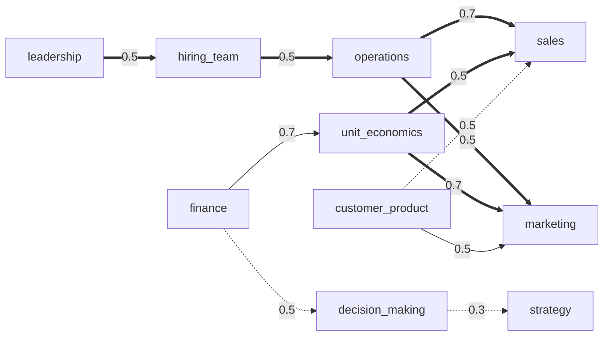

### 5.4 Level scheme (renamed — Decision)

Default thresholds; levels 5–7 renamed to describe the founder's job at that stage. L4 "Practitioner" → next
"System Builder" is the most common transition in this profession and the key upgrade message.

| # | slug | en | uz | ru | meaning (en) |
|---|------|----|----|----|--------------|
| 1 | `starter` | Starter | Boshlangʻich | Старт | default |
| 2 | `beginner` | Beginner | Yangi boshlovchi | Начинающий | default |
| 3 | `developing` | Developing | Rivojlanayotgan | Развивающийся | default |
| 4 | `practitioner` | Practitioner | Amaliyotchi | Практик | The business runs, but mostly through your personal effort. |
| 5 | `system_builder` | System Builder | Tizim quruvchi | Строитель систем | Processes, numbers and people work without you in every step. |
| 6 | `scaler` | Scaler | Oʻstiruvchi | Масштабирующий | You grow what works with known unit economics and a team. |
| 7 | `strategist` | Strategist | Strateg | Стратег | You choose markets and bets deliberately and manage risk across them. |
| 8 | `leader` | Leader | Yetakchi | Лидер | default (verification) |
| 9 | `master` | Master | Ustoz | Мастер | default (verification) |

Next-level copy (uz): "Siz Amaliyotchi darajasidasiz. Keyingi bosqich — Tizim quruvchi: biznesingiz har bir qadamda
sizsiz ham ishlay olishi kerak."

### 5.5 Level requirements

| L | composite | skill gates | verification (non-gating) |
|---|-----------|-------------|---------------------------|
| 2 | 15 | finance ≥ 10 | — |
| 3 | 25 | finance ≥ 20 | — |
| 4 | 35 | finance ≥ 30, operations ≥ 25 | — |
| 5 | 45 | finance ≥ 40, operations ≥ 35 | verified_scenario `v5_scenario_cash_gap_case` |
| 6 | 55 | finance ≥ 50, operations ≥ 45, sales ≥ 45 | — |
| 7 | 65 | finance ≥ 60, operations ≥ 55, sales ≥ 55 | verified_scenario `v7_scenario_scaling_case` |
| 8 | 75 | finance ≥ 70, operations ≥ 65, sales ≥ 65 | verified_scenario `v8_scenario_board_simulation` + practical_action `v8_portfolio_business_evidence` |
| 9 | 85 | finance ≥ 80, operations ≥ 75, sales ≥ 75 | verified_scenario `v9_scenario_strategy_defense` + practical_action `v9_portfolio_multi_unit_evidence` |

### 5.6 Verification task ideas

- **L5 business scenario (case, hybrid):** a fictional small business (labelled fictional) with a 3-month table of
  revenue, costs, receivables and stock. The user (1) identifies the cash gap and its cause, (2) names the bottleneck
  skill area, (3) writes a 30-day plan with 3 measurable steps. Rubric: correct cash diagnosis (rule-checked numbers)
  0.4, bottleneck reasoning 0.3, plan measurability 0.3.
- **L8 practical_action (portfolio, human):** evidence from the user's own business: one documented process (SOP) in
  use by ≥ 2 people plus 8 consecutive weeks of a weekly metrics log. Reviewer checks consistency, not business size.

---

## 6. Profession 2 — `software_developer`

| Field | Value |
|-------|-------|
| category | `technology` |
| name | uz **Dasturchi** · ru **Разработчик ПО** · en **Software developer** |
| is_regulated | false |
| config | defaults; `experienceCaps {"0": 4, "lt1": 5}` |
| gate skills | K1 `programming_fundamentals` · K2 `debugging` · K3 `testing_quality`; extra hygiene gate `version_control` at L4–L5 |

### 6.1 Specializations

| slug | uz / ru / en | non-default weights |
|------|--------------|---------------------|
| `frontend` | Frontend / Frontend / Frontend | testing_quality 1.2, collaboration 1.2, api_design 0.9, system_design 0.8, deployment_ops 0.8, sql_databases 0.6 |
| `backend` | Backend / Backend / Backend | sql_databases 1.4, api_design 1.4, system_design 1.2, security_basics 1.2 |
| `mobile` | Mobil dasturlash / Мобильная разработка / Mobile | testing_quality 1.2, api_design 1.1, deployment_ops 1.1, sql_databases 0.7 |
| `ai_ml` | AI / ML / AI / ML / AI / ML | data_structures_algorithms 1.3, sql_databases 1.2, deployment_ops 0.9, api_design 0.8 |
| `data` | Maʼlumotlar muhandisligi / Инженерия данных / Data engineering | sql_databases 1.8, data_structures_algorithms 1.1, system_design 0.9, api_design 0.7 |
| `devops` | DevOps / DevOps / DevOps | deployment_ops 2.0, version_control 1.3, security_basics 1.3, api_design 0.8, data_structures_algorithms 0.6 |
| `cybersecurity` | Kiberxavfsizlik / Кибербезопасность / Cybersecurity | security_basics 2.5, debugging 1.2, deployment_ops 1.2, data_structures_algorithms 0.7 |

**Decision:** specialization-specific knowledge (ML metrics, pipelines, container orchestration, threat models) is
measured by specialization-filtered items under the existing skills (e.g. `ai_ml` items under
`programming_fundamentals` and `testing_quality` about data leakage / evaluation). No specialization-only skills in
MVP (keeps 11 bars comparable inside the profession).

### 6.2 Skills

| # | slug | global key | kind | imp. | en | uz | ru | definition |
|---|------|-----------|------|------|----|----|----|------------|
| 1 | `programming_fundamentals` | `programming` | hard | 0.14 | Programming fundamentals | Dasturlash asoslari | Основы программирования | Types, control flow, functions, data handling and reading code in one main language. |
| 2 | `data_structures_algorithms` | — | hard | 0.09 | Data structures & algorithms | Maʼlumotlar tuzilmalari va algoritmlar | Структуры данных и алгоритмы | Choosing structures and algorithms and reasoning about their cost. |
| 3 | `version_control` | — | hard | 0.07 | Version control (Git) | Versiyalarni boshqarish (Git) | Контроль версий (Git) | Branches, commits, merges, conflicts, reviews and safe history changes. |
| 4 | `sql_databases` | `sql` | hard | 0.10 | SQL & databases | SQL va maʼlumotlar bazalari | SQL и базы данных | Modelling tables, writing correct queries, indexes and transactions. |
| 5 | `api_design` | — | hard | 0.10 | APIs & integration | API va integratsiya | API и интеграции | Designing and consuming HTTP APIs: contracts, status codes, errors, idempotency. |
| 6 | `testing_quality` | — | hard | 0.10 | Testing & code quality | Testlash va kod sifati | Тестирование и качество кода | Writing meaningful tests and readable, maintainable code. |
| 7 | `debugging` | `problem_solving` | meta | 0.11 | Debugging & problem solving | Xatolarni topish va muammo yechish | Отладка и решение проблем | Reproducing, isolating and fixing defects systematically. |
| 8 | `system_design` | — | hard | 0.09 | System design | Tizim dizayni va arxitektura | Системный дизайн и архитектура | Structuring components, data flow and trade-offs for reliability and scale. |
| 9 | `deployment_ops` | — | hard | 0.07 | Deployment & operations | Deploy va ekspluatatsiya | Деплой и эксплуатация | Shipping builds, environments, configuration, logs and rollback. |
| 10 | `security_basics` | — | hard | 0.06 | Secure coding | Xavfsiz kod yozish | Безопасная разработка | Avoiding common vulnerabilities: injection, secrets, auth and input validation. |
| 11 | `collaboration` | `communication` | soft | 0.07 | Collaboration & communication | Hamkorlik va muloqot | Командная работа и коммуникация | Clarifying tasks, estimating, reviewing and explaining technical decisions. |
| | | | | **1.00** | | | | |

### 6.3 Dependency edges

| from | relation | to | strength | rationale |
|------|----------|----|----------|-----------|
| `version_control` | prerequisite | `deployment_ops` | 0.7 | Deployments are built from versioned code; without Git there is no reliable release or rollback. |
| `sql_databases` | prerequisite | `api_design` | 0.5 | Most APIs read and write data; correct queries come before endpoints. |
| `programming_fundamentals` | prerequisite | `data_structures_algorithms` | 0.9 | Algorithms are expressed in code. |
| `programming_fundamentals` | prerequisite | `testing_quality` | 0.7 | You test code you can already write. |
| `api_design` | prerequisite | `system_design` | 0.5 | Systems are composed of service contracts. |
| `programming_fundamentals` | limits | `system_design` | 0.7 | Designs stay on the whiteboard if they cannot be implemented. |
| `debugging` | limits | `programming_fundamentals` | 0.5 | Code gets written, but defects are found slowly and fixed by guessing. |
| `testing_quality` | limits | `deployment_ops` | 0.5 | Fast releases ship untested changes to users. |
| `security_basics` | limits | `api_design` | 0.5 | A well-shaped API that leaks data or trusts input is a liability. |
| `collaboration` | limits | `system_design` | 0.3 | Good designs are not adopted without clear communication. |
| `data_structures_algorithms` | enables | `system_design` | 0.3 | Cost reasoning carries over to architecture trade-offs. |

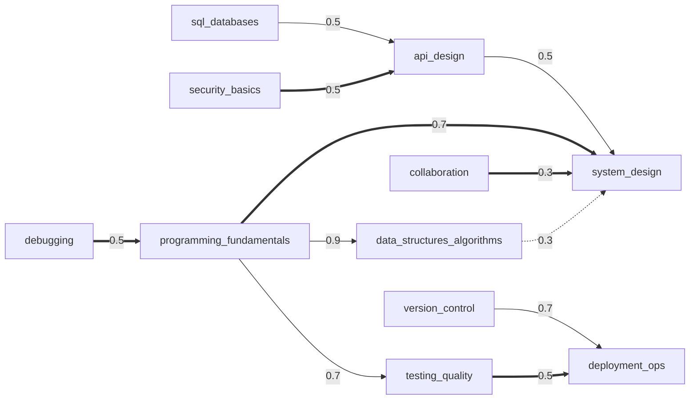

### 6.4 Level scheme (renamed — Decision)

Developers already describe themselves with these grades, so the result is immediately interpretable. Because grades
differ between employers, the level meaning and the full report carry the line uz "Bu kompetensiya darajasi, ish
beruvchi lavozimi emas." / ru "Это уровень компетенций, а не должность у работодателя." / en "This is a competency
level, not an employer job grade."

| # | slug | en | uz | ru |
|---|------|----|----|----|
| 1 | `starter` | Starter | Boshlangʻich | Старт |
| 2 | `trainee` | Trainee | Stajyor | Стажёр |
| 3 | `junior` | Junior | Junior | Junior |
| 4 | `junior_plus` | Junior+ | Junior+ | Junior+ |
| 5 | `middle` | Middle | Middle | Middle |
| 6 | `middle_plus` | Middle+ | Middle+ | Middle+ |
| 7 | `senior` | Senior | Senior | Senior |
| 8 | `lead` | Lead | Lead | Lead |
| 9 | `principal` | Principal | Principal | Principal |

### 6.5 Level requirements

| L | composite | skill gates | verification (non-gating) |
|---|-----------|-------------|---------------------------|
| 2 | 15 | programming_fundamentals ≥ 10 | — |
| 3 | 25 | programming_fundamentals ≥ 20 | — |
| 4 | 35 | programming_fundamentals ≥ 30, debugging ≥ 25, version_control ≥ 25 | — |
| 5 | 45 | programming_fundamentals ≥ 40, debugging ≥ 35, version_control ≥ 35 | verified_scenario `v5_scenario_coding_kata` |
| 6 | 55 | programming_fundamentals ≥ 50, debugging ≥ 45, testing_quality ≥ 45 | — |
| 7 | 65 | programming_fundamentals ≥ 60, debugging ≥ 55, testing_quality ≥ 55 | verified_scenario `v7_scenario_design_review` |
| 8 | 75 | programming_fundamentals ≥ 70, debugging ≥ 65, testing_quality ≥ 65 | verified_scenario `v8_scenario_incident_simulation` + practical_action `v8_portfolio_repository_review` |
| 9 | 85 | programming_fundamentals ≥ 80, debugging ≥ 75, testing_quality ≥ 75 | verified_scenario `v9_scenario_architecture_defense` + practical_action `v9_portfolio_technical_leadership` |

### 6.6 Verification task ideas

- **L5 coding task (coding, rule + hybrid):** a small repository in the user's chosen language (JavaScript/TypeScript
  or Python in MVP) with a failing test and a missing function. The user fixes the bug, implements the function and
  adds one test. Rubric: hidden tests pass (rule) 0.5, the added test fails on the original bug (rule) 0.2,
  readability and naming (AI rubric, human spot check) 0.3. Time box 60 min.
- **L8 practical_action (portfolio, human):** link to real code the user authored (public repository or an excerpt
  with permission) plus a 300-word write-up of one design decision and its trade-offs.

---

## 7. Profession 3 — `sales_specialist`

| Field | Value |
|-------|-------|
| category | `sales` |
| name | uz **Sotuv mutaxassisi** · ru **Специалист по продажам** · en **Sales specialist** |
| is_regulated | false |
| config | defaults; `experienceCaps {"0": 4, "lt1": 5}` |
| gate skills | K1 `discovery` · K2 `objection_handling` · K3 `closing` |

### 7.1 Specializations

| slug | uz / ru / en | non-default weights |
|------|--------------|---------------------|
| `retail` | Chakana savdo / Розничные продажи / Retail | product_knowledge 1.3, presentation 1.2, follow_up_retention 1.2, pipeline_crm 0.7, prospecting 0.6 |
| `b2b` | B2B savdo / B2B-продажи / B2B | discovery 1.4, negotiation 1.3, pipeline_crm 1.3, prospecting 1.2 |
| `telephone_sales` | Telefon orqali savdo / Телефонные продажи / Telephone sales | emotional_resilience 1.4, prospecting 1.3, objection_handling 1.3, negotiation 0.7 |
| `field_sales` | Dala savdosi / Выездные продажи / Field sales | prospecting 1.3, follow_up_retention 1.2, emotional_resilience 1.2 |
| `sales_manager` | Savdo menejeri / Менеджер отдела продаж / Sales manager | team_coaching 2.5, pipeline_crm 1.6, follow_up_retention 1.1, closing 0.9, prospecting 0.8 |
| `head_of_sales` | Savdo boʻlimi rahbari / Руководитель отдела продаж / Head of sales | team_coaching 3.0, pipeline_crm 1.8, negotiation 1.2, closing 0.8, product_knowledge 0.7, prospecting 0.6 |

### 7.2 Skills

| # | slug | global key | kind | imp. | en | uz | ru | definition |
|---|------|-----------|------|------|----|----|----|------------|
| 1 | `prospecting` | — | hard | 0.08 | Prospecting | Mijoz izlash | Поиск клиентов | Finding and qualifying potential buyers who can actually buy. |
| 2 | `discovery` | `customer_focus` | hard | 0.13 | Needs discovery | Ehtiyojni aniqlash | Выявление потребностей | Asking questions that uncover the buyer's real problem, criteria and decision process. |
| 3 | `product_knowledge` | — | hard | 0.07 | Product knowledge | Mahsulotni bilish | Знание продукта | Knowing what the product does, for whom, and how it compares. |
| 4 | `presentation` | — | soft | 0.10 | Value presentation | Qiymatni taqdim etish | Презентация ценности | Linking product features to the buyer's stated needs. |
| 5 | `objection_handling` | — | soft | 0.12 | Objection handling | Eʼtirozlar bilan ishlash | Работа с возражениями | Clarifying, acknowledging and resolving doubts without pressure. |
| 6 | `closing` | `sales` | hard | 0.11 | Closing | Bitimni yopish | Закрытие сделки | Agreeing on a clear next step or decision at the right moment. |
| 7 | `follow_up_retention` | — | hard | 0.09 | Follow-up & retention | Kuzatuv va mijozni saqlash | Сопровождение и удержание | Keeping commitments after the sale; repeat purchases and referrals. |
| 8 | `pipeline_crm` | — | hard | 0.10 | Pipeline & CRM discipline | Voronka va CRM intizomi | Воронка и CRM-дисциплина | Recording every deal, next step and date; reading the funnel. |
| 9 | `negotiation` | `negotiation` | soft | 0.10 | Negotiation | Muzokara | Переговоры | Trading concessions for value; protecting price and terms. |
| 10 | `emotional_resilience` | `self_management` | meta | 0.07 | Resilience & self-management | Bardoshlilik va oʻzini boshqarish | Стрессоустойчивость и самоорганизация | Staying consistent after rejection; managing own activity plan. |
| 11 | `team_coaching` | `feedback` | soft | 0.03 | Sales coaching | Savdo jamoasiga murabbiylik | Коучинг продавцов | Developing other sellers through call reviews, feedback and targets. |
| | | | | **1.00** | | | | |

**Decision:** `team_coaching` has a low base importance (individual contributors are not judged on it) and is lifted
to 0.075–0.09 adjusted weight by the `sales_manager`/`head_of_sales` multipliers. For other specializations it is
usually not served and is shown as "Bevosita oʻlchanmagan".

### 7.3 Dependency edges

| from | relation | to | strength | rationale |
|------|----------|----|----------|-----------|
| `discovery` | prerequisite | `presentation` | 0.7 | Value can only be presented against a need you have uncovered. |
| `product_knowledge` | prerequisite | `presentation` | 0.5 | You cannot link features to needs without knowing the features. |
| `discovery` | limits | `closing` | 0.7 | Closing attempts fail when the real need was never found. |
| `objection_handling` | limits | `closing` | 0.7 | Deals stall at the first doubt that is not resolved. |
| `pipeline_crm` | limits | `prospecting` | 0.5 | New leads are found but lost without recorded next steps. |
| `pipeline_crm` | limits | `follow_up_retention` | 0.5 | Promised follow-ups are forgotten without a system. |
| `emotional_resilience` | limits | `prospecting` | 0.5 | Outreach volume drops after rejection. |
| `negotiation` | enables | `closing` | 0.5 | Trading terms keeps deals alive near the end. |
| `discovery` | enables | `negotiation` | 0.3 | Knowing what the buyer values shows what to trade. |
| `pipeline_crm` | enables | `team_coaching` | 0.5 | Coaching relies on pipeline data. |

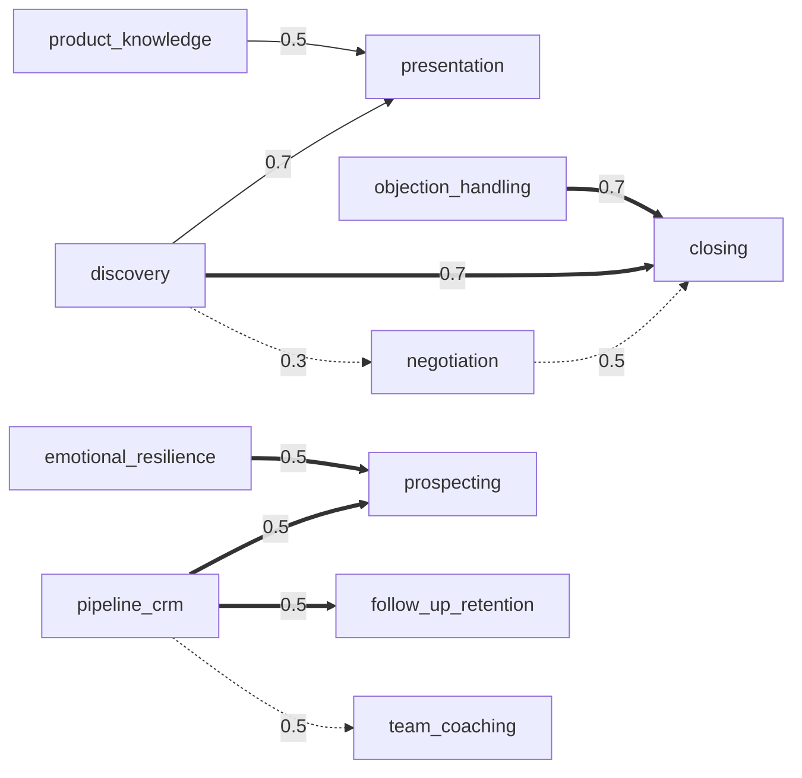

### 7.4 Level scheme

Default names and thresholds (no rename; "Sales LEVEL 5 · PROFESSIONAL" reads naturally, see brief §10 share copy).

### 7.5 Level requirements

| L | composite | skill gates | verification (non-gating) |
|---|-----------|-------------|---------------------------|
| 2 | 15 | discovery ≥ 10 | — |
| 3 | 25 | discovery ≥ 20 | — |
| 4 | 35 | discovery ≥ 30, objection_handling ≥ 25 | — |
| 5 | 45 | discovery ≥ 40, objection_handling ≥ 35 | verified_scenario `v5_scenario_ai_customer` |
| 6 | 55 | discovery ≥ 50, objection_handling ≥ 45, closing ≥ 45 | — |
| 7 | 65 | discovery ≥ 60, objection_handling ≥ 55, closing ≥ 55 | verified_scenario `v7_scenario_ai_b2b_negotiation` |
| 8 | 75 | discovery ≥ 70, objection_handling ≥ 65, closing ≥ 65 | verified_scenario `v8_scenario_call_review_coaching` + practical_action `v8_portfolio_pipeline_evidence` |
| 9 | 85 | discovery ≥ 80, objection_handling ≥ 75, closing ≥ 75 | verified_scenario `v9_scenario_sales_system_design` + practical_action `v9_portfolio_team_results` |

### 7.6 Verification task ideas

- **L5 AI customer simulation (simulation, hybrid):** chat role-play (≤ 12 user turns) with a simulated buyer whose
  persona has one hidden need and two scripted objections (price, timing). The persona is deterministic per seed;
  the AI only plays the customer. Rubric: open discovery questions and the hidden need identified (rule: structured
  extraction compared with the persona key) 0.35, objections acknowledged and resolved without pressure 0.35, a
  concrete next step agreed 0.2, no false promises 0.1.
- **L8 call review (scenario):** the user reviews a transcript of a fictional junior seller's call and writes
  coaching feedback; scored by a human with the rubric.

---

## 8. Profession 4 — `marketing`

| Field | Value |
|-------|-------|
| category | `marketing` |
| name | uz **Marketolog** · ru **Маркетолог** · en **Marketer** |
| is_regulated | false |
| config | defaults; `experienceCaps {"0": 4, "lt1": 5}` |
| gate skills | K1 `analytics_measurement` · K2 `customer_research` · K3 `positioning_messaging` |

### 8.1 Specializations

| slug | uz / ru / en | non-default weights |
|------|--------------|---------------------|
| `smm` | SMM / SMM / SMM | content_creation 1.5, channel_management 1.4, copywriting 1.2, paid_acquisition 0.8, budget_planning 0.8 |
| `performance` | Performance marketing / Performance-маркетинг / Performance marketing | paid_acquisition 2.0, analytics_measurement 1.4, funnel_conversion 1.4, experimentation 1.3, content_creation 0.6 |
| `content` | Kontent marketing / Контент-маркетинг / Content marketing | content_creation 1.6, copywriting 1.6, paid_acquisition 0.5 |
| `brand` | Brend marketing / Бренд-маркетинг / Brand marketing | positioning_messaging 1.8, customer_research 1.3, funnel_conversion 0.7, paid_acquisition 0.6 |
| `seo` | SEO / SEO / SEO | channel_management 1.6, content_creation 1.3, analytics_measurement 1.2, paid_acquisition 0.4 |
| `strategy` | Marketing strategiyasi / Маркетинговая стратегия / Marketing strategy | budget_planning 1.5, customer_research 1.4, positioning_messaging 1.4, channel_management 0.8, content_creation 0.6, copywriting 0.6 |

### 8.2 Skills

| # | slug | global key | kind | imp. | en | uz | ru | definition |
|---|------|-----------|------|------|----|----|----|------------|
| 1 | `customer_research` | `customer_focus` | hard | 0.12 | Audience research | Auditoriyani oʻrganish | Исследование аудитории | Finding out who the customer is, what they need and how they decide. |
| 2 | `positioning_messaging` | — | hard | 0.11 | Positioning & messaging | Pozitsiyalash va xabar | Позиционирование и месседж | Stating why this offer, for whom, versus which alternative. |
| 3 | `content_creation` | — | hard | 0.10 | Content creation | Kontent yaratish | Создание контента | Planning and producing posts, videos and articles that serve a goal. |
| 4 | `copywriting` | `writing` | hard | 0.08 | Copywriting | Kopirayting | Копирайтинг | Clear persuasive text: headline, benefit, proof, call to action. |
| 5 | `channel_management` | — | hard | 0.09 | Channel management | Kanallarni boshqarish | Управление каналами | Running social, search, messenger and email channels by their own rules. |
| 6 | `paid_acquisition` | — | hard | 0.09 | Paid acquisition | Pullik reklama | Платное привлечение | Setting up, targeting and optimizing paid campaigns. |
| 7 | `analytics_measurement` | `data_literacy` | hard | 0.13 | Analytics & measurement | Analitika va oʻlchash | Аналитика и измерение | Tracking, attribution and metrics such as CPL, CAC, ROAS and conversion. |
| 8 | `funnel_conversion` | — | hard | 0.10 | Funnel & conversion | Voronka va konversiya | Воронка и конверсия | Finding and fixing drop-off between first touch and purchase. |
| 9 | `budget_planning` | `planning` | hard | 0.10 | Budget & campaign planning | Byudjet va kampaniya rejasi | Бюджет и планирование кампаний | Allocating budget across channels and time against a goal. |
| 10 | `experimentation` | — | meta | 0.08 | Experimentation | A/B tajribalar | Эксперименты (A/B) | Forming hypotheses and testing them fairly before scaling. |
| | | | | **1.00** | | | | |

### 8.3 Dependency edges

| from | relation | to | strength | rationale |
|------|----------|----|----------|-----------|
| `customer_research` | prerequisite | `positioning_messaging` | 0.9 | Positioning is a claim about customers; it needs research first. |
| `positioning_messaging` | limits | `content_creation` | 0.7 | Attractive content does not sell an unclear message. |
| `positioning_messaging` | limits | `paid_acquisition` | 0.5 | Ads buy attention for a message that does not convert. |
| `analytics_measurement` | limits | `paid_acquisition` | 0.7 | Budget is spent without knowing which campaigns pay back. |
| `funnel_conversion` | limits | `paid_acquisition` | 0.7 | Traffic is bought into a leaky funnel. |
| `budget_planning` | limits | `paid_acquisition` | 0.5 | Good campaigns run out of money or overspend. |
| `analytics_measurement` | prerequisite | `experimentation` | 0.7 | A test is meaningless without a reliable metric. |
| `copywriting` | enables | `content_creation` | 0.5 | Strong text lifts every content format. |
| `analytics_measurement` | enables | `budget_planning` | 0.5 | Allocation follows measured returns. |
| `customer_research` | enables | `channel_management` | 0.3 | Knowing where the audience is picks the channel. |

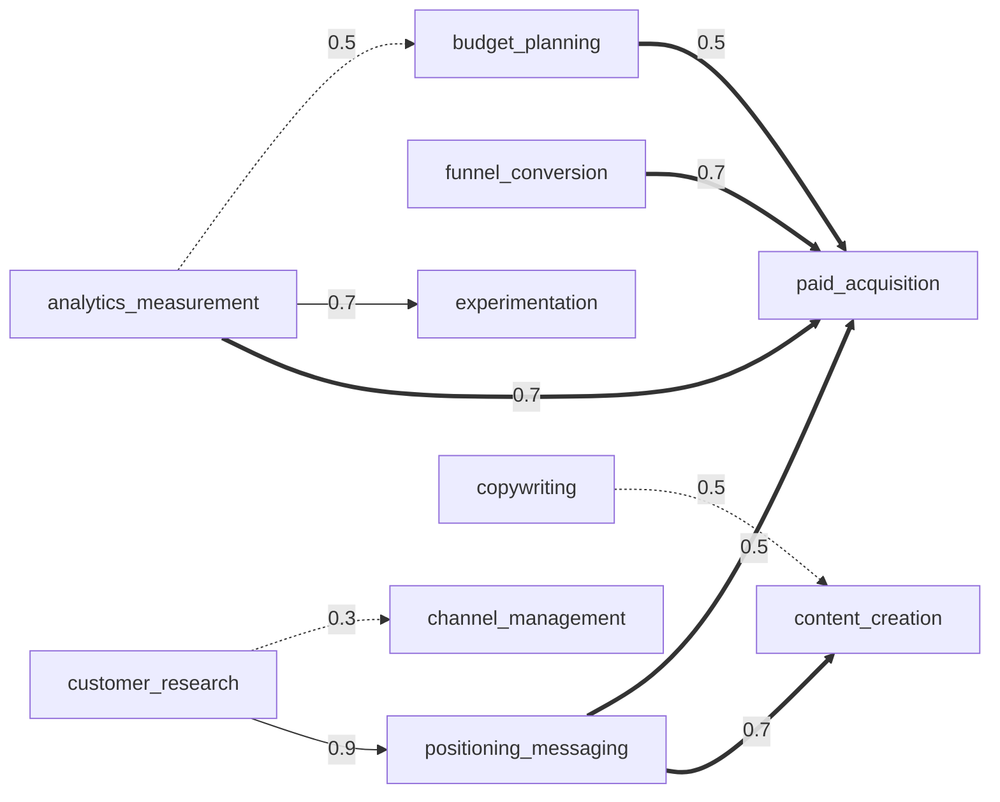

### 8.4 Level scheme

Default names and thresholds.

### 8.5 Level requirements

| L | composite | skill gates | verification (non-gating) |
|---|-----------|-------------|---------------------------|
| 2 | 15 | analytics_measurement ≥ 10 | — |
| 3 | 25 | analytics_measurement ≥ 20 | — |
| 4 | 35 | analytics_measurement ≥ 30, customer_research ≥ 25 | — |
| 5 | 45 | analytics_measurement ≥ 40, customer_research ≥ 35 | verified_scenario `v5_scenario_campaign_analysis` |
| 6 | 55 | analytics_measurement ≥ 50, customer_research ≥ 45, positioning_messaging ≥ 45 | — |
| 7 | 65 | analytics_measurement ≥ 60, customer_research ≥ 55, positioning_messaging ≥ 55 | verified_scenario `v7_scenario_launch_plan` |
| 8 | 75 | analytics_measurement ≥ 70, customer_research ≥ 65, positioning_messaging ≥ 65 | verified_scenario `v8_scenario_strategy_case` + practical_action `v8_portfolio_campaign_results` |
| 9 | 85 | analytics_measurement ≥ 80, customer_research ≥ 75, positioning_messaging ≥ 75 | verified_scenario `v9_scenario_brand_strategy_defense` + practical_action `v9_portfolio_marketing_system` |

### 8.6 Verification task ideas

- **L5 campaign analysis (case, rule + hybrid):** a fictional 4-week table per channel (spend, impressions, clicks,
  leads, sales, revenue; labelled fictional). The user computes CPL, CAC and ROAS per channel (rule-checked, ±1 %
  tolerance), identifies the weakest funnel step, and reallocates next month's budget with a justification and one
  test hypothesis. Rubric: correct metrics 0.4, diagnosis 0.3, reallocation logic 0.2, testable hypothesis 0.1.
- **L8 practical_action (portfolio, human):** a real campaign the user ran, with screenshots of the ad account
  metrics (personal/customer data redacted) and a post-mortem.

---

## 9. Profession 5 — `manager`

| Field | Value |
|-------|-------|
| category | `management` |
| name | uz **Menejer (rahbar)** · ru **Менеджер (руководитель)** · en **Manager** |
| is_regulated | false |
| config | defaults; `experienceCaps {"0": 4, "lt1": 5}` (experience = experience managing people or projects) |
| gate skills | K1 `goal_setting_planning` · K2 `feedback_coaching` · K3 `delegation` |

### 9.1 Specializations (Decision — brief lists none)

| slug | uz / ru / en | non-default weights |
|------|--------------|---------------------|
| `team_lead` | Jamoa rahbari / Тимлид / Team lead | feedback_coaching 1.3, delegation 1.2, communication 1.2, hiring_onboarding 0.8, process_improvement 0.8 |
| `middle_manager` | Oʻrta boʻgʻin rahbari / Руководитель среднего звена / Middle manager | performance_management 1.3, decision_making 1.2, hiring_onboarding 1.2, conflict_resolution 1.1 |
| `project_manager` | Loyiha menejeri / Менеджер проектов / Project manager | goal_setting_planning 1.6, communication 1.3, process_improvement 1.1, feedback_coaching 0.8, hiring_onboarding 0.5 |
| `operations_manager` | Operatsion menejer / Операционный менеджер / Operations manager | process_improvement 1.8, performance_management 1.2, conflict_resolution 0.9 |

### 9.2 Skills

| # | slug | global key | kind | imp. | en | uz | ru | definition |
|---|------|-----------|------|------|----|----|----|------------|
| 1 | `goal_setting_planning` | `planning` | hard | 0.12 | Goal-setting & planning | Maqsad qoʻyish va rejalashtirish | Постановка целей и планирование | Turning direction into measurable goals, milestones and owners. |
| 2 | `delegation` | — | soft | 0.11 | Delegation | Vakolat berish | Делегирование | Handing over outcomes with context, authority and check-in points. |
| 3 | `feedback_coaching` | `feedback` | soft | 0.11 | Feedback & coaching | Fikr-mulohaza va murabbiylik | Обратная связь и коучинг | Specific, timely feedback and growing people's capability. |
| 4 | `communication` | `communication` | soft | 0.10 | Communication | Muloqot | Коммуникация | Clear updates, expectations and listening up, down and across. |
| 5 | `decision_making` | `decision_making` | meta | 0.10 | Decision-making | Qaror qabul qilish | Принятие решений | Making timely, reasoned decisions and owning their consequences. |
| 6 | `performance_management` | — | hard | 0.10 | Performance management | Samaradorlikni boshqarish | Управление эффективностью | Setting standards, tracking results and addressing underperformance fairly. |
| 7 | `hiring_onboarding` | `hiring` | hard | 0.08 | Hiring & onboarding | Ishga olish va moslashtirish | Найм и адаптация | Defining roles, structured interviews and first-90-days onboarding. |
| 8 | `process_improvement` | `operations` | hard | 0.09 | Process improvement | Jarayonlarni takomillashtirish | Улучшение процессов | Finding waste and bottlenecks and making work repeatable. |
| 9 | `conflict_resolution` | — | soft | 0.09 | Conflict resolution | Nizolarni hal qilish | Разрешение конфликтов | Surfacing disagreements early and resolving them on interests, not positions. |
| 10 | `self_management` | `self_management` | meta | 0.10 | Self-management & priorities | Oʻzini boshqarish va ustuvorliklar | Самоменеджмент и приоритеты | Managing own time, energy and priorities as a role model. |
| | | | | **1.00** | | | | |

### 9.3 Dependency edges

| from | relation | to | strength | rationale |
|------|----------|----|----------|-----------|
| `goal_setting_planning` | prerequisite | `delegation` | 0.7 | You can only hand over an outcome that is clearly defined. |
| `goal_setting_planning` | prerequisite | `performance_management` | 0.9 | Performance is judged against goals that were set in advance. |
| `feedback_coaching` | limits | `performance_management` | 0.7 | Problems are measured, but people do not learn how to improve. |
| `communication` | limits | `feedback_coaching` | 0.5 | Feedback that is unclear or badly timed does not land. |
| `delegation` | limits | `process_improvement` | 0.5 | Improved processes depend on the manager when nobody else owns them. |
| `self_management` | limits | `delegation` | 0.5 | An overloaded manager delegates late and without context. |
| `communication` | enables | `conflict_resolution` | 0.5 | Listening and restating make conflicts solvable. |
| `hiring_onboarding` | enables | `delegation` | 0.3 | Well-onboarded people can take more ownership. |
| `decision_making` | enables | `goal_setting_planning` | 0.3 | Plans require choosing between options. |

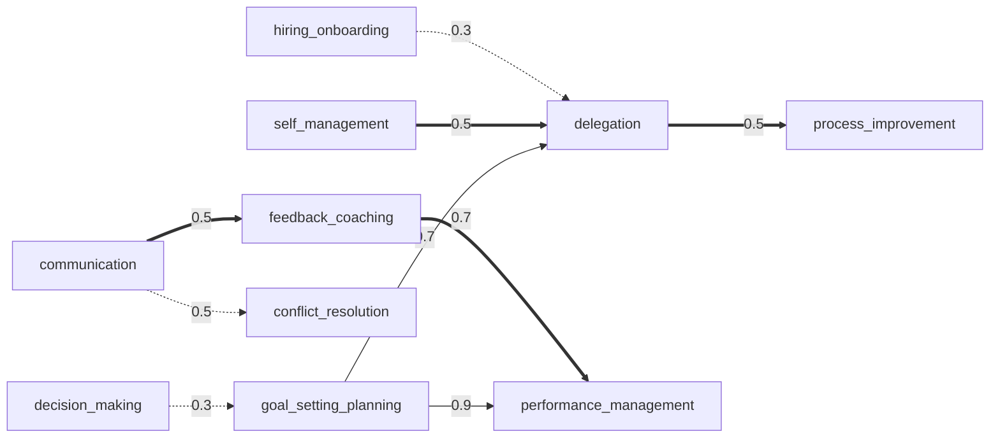

### 9.4 Level scheme

Default names and thresholds.

### 9.5 Level requirements

| L | composite | skill gates | verification (non-gating) |
|---|-----------|-------------|---------------------------|
| 2 | 15 | goal_setting_planning ≥ 10 | — |
| 3 | 25 | goal_setting_planning ≥ 20 | — |
| 4 | 35 | goal_setting_planning ≥ 30, feedback_coaching ≥ 25 | — |
| 5 | 45 | goal_setting_planning ≥ 40, feedback_coaching ≥ 35 | verified_scenario `v5_scenario_one_on_one_simulation` |
| 6 | 55 | goal_setting_planning ≥ 50, feedback_coaching ≥ 45, delegation ≥ 45 | — |
| 7 | 65 | goal_setting_planning ≥ 60, feedback_coaching ≥ 55, delegation ≥ 55 | verified_scenario `v7_scenario_team_restructure_case` |
| 8 | 75 | goal_setting_planning ≥ 70, feedback_coaching ≥ 65, delegation ≥ 65 | verified_scenario `v8_scenario_leadership_simulation` + practical_action `v8_portfolio_team_evidence` |
| 9 | 85 | goal_setting_planning ≥ 80, feedback_coaching ≥ 75, delegation ≥ 75 | verified_scenario `v9_scenario_org_design_defense` + practical_action `v9_portfolio_managers_developed` |

### 9.6 Verification task ideas

- **L5 business scenario (simulation, hybrid):** an AI-played team member (persona: capable but missing deadlines
  for two weeks, with a hidden reason). The user runs a 1:1 (≤ 12 turns) and then writes a delegation note for the
  next task. Rubric: specific behaviour-based feedback 0.3, hidden cause uncovered 0.25, agreed measurable next step
  0.25, delegation note has outcome + context + check-in 0.2.
- **L8 practical_action (portfolio, human):** anonymized evidence of a goal cascade and a quarter of 1:1 notes from
  the user's real team (no names; team members' consent attested).

---

## 10. Profession 6 — `accountant`

| Field | Value |
|-------|-------|
| category | `finance` |
| name | uz **Buxgalter** · ru **Бухгалтер** · en **Accountant** |
| is_regulated | **true** |
| config | defaults; `experienceCaps {"0": 4, "lt1": 5}` |
| gate skills | K1 `double_entry_bookkeeping` · K2 `financial_statements` · K3 `accuracy_controls` |

### 10.1 Regulated-domain rules

Disclaimer (`professions.disclaimer`):

- uz: "Bu taʼlimiy baholash. U buxgalterlik malakasini tasdiqlovchi sertifikat emas va moliyaviy, soliq yoki huquqiy
  maslahat hisoblanmaydi. Soliq stavkalari va qoidalar oʻzgarib turadi — amaldagi qonunchilikni rasmiy manbalardan
  tekshiring."
- ru: "Это образовательная оценка. Она не является сертификатом квалификации бухгалтера и не является финансовой,
  налоговой или юридической консультацией. Ставки и правила меняются — проверяйте действующее законодательство по
  официальным источникам."
- en: "This is an educational assessment. It is not an accounting qualification certificate and not financial, tax or
  legal advice. Tax rates and rules change — check current legislation in official sources."

**Decision (content rules):**

1. Items are principle-based by default (double entry, accrual, reconciliation, controls).
2. Any item whose correct answer depends on a jurisdiction's current law (a tax rate, a deadline, a form name) must
   carry tags `jurisdiction:<country>` and `law_dated:<YYYY-MM-DD>`, and an `evidence` link to an `official` source
   in `sources`. Without a verified official source the item is not written. These items are served only when the
   user's `country_code` matches and are retired at the next law change (new version).
3. Roadmap actions never instruct a specific tax treatment of the user's own situation.
4. VERIFIED badges in this profession say "LEVEL tomonidan tasdiqlangan amaliy topshiriq" — never "certified".

### 10.2 Specializations (Decision — brief lists none)

| slug | uz / ru / en | non-default weights |
|------|--------------|---------------------|
| `bookkeeping` | Buxgalteriya yuritish / Ведение учёта / Bookkeeping | primary_documents 1.4, double_entry_bookkeeping 1.3, accounting_software 1.3, management_accounting 0.6 |
| `tax_accounting` | Soliq hisobi / Налоговый учёт / Tax accounting | taxation 2.0, professional_ethics 1.3, payroll 1.1, management_accounting 0.6 |
| `payroll` | Ish haqi hisobi / Расчёт зарплаты / Payroll | payroll 2.5, taxation 1.3, primary_documents 1.1, financial_statements 0.7, management_accounting 0.5 |
| `financial_reporting` | Moliyaviy hisobot (IFRS) / Финансовая отчётность (МСФО) / Financial reporting (IFRS) | financial_statements 1.8, accounting_principles 1.3, accuracy_controls 1.2, payroll 0.6 |
| `management_accounting` | Boshqaruv hisobi / Управленческий учёт / Management accounting | management_accounting 2.0, financial_statements 1.2, taxation 0.7, payroll 0.5 |

### 10.3 Skills

| # | slug | global key | kind | imp. | en | uz | ru | definition |
|---|------|-----------|------|------|----|----|----|------------|
| 1 | `accounting_principles` | — | hard | 0.13 | Accounting principles | Buxgalteriya hisobi asoslari | Основы бухгалтерского учёта | Accrual, matching, assets/liabilities/equity and the accounting equation. |
| 2 | `double_entry_bookkeeping` | — | hard | 0.13 | Double-entry bookkeeping | Ikki yoqlama yozuv | Двойная запись | Posting correct debit/credit entries for typical business transactions. |
| 3 | `primary_documents` | — | hard | 0.10 | Primary documents & reconciliation | Birlamchi hujjatlar va solishtirish | Первичные документы и сверка | Invoices, receipts, bank statements; reconciling them with the ledger. |
| 4 | `taxation` | — | hard | 0.11 | Taxation | Soliqqa tortish | Налогообложение | Tax concepts, tax base, accrual and filing logic (jurisdiction-aware). |
| 5 | `payroll` | — | hard | 0.08 | Payroll | Ish haqi hisob-kitobi | Расчёт заработной платы | Calculating gross-to-net pay, deductions and related postings. |
| 6 | `financial_statements` | — | hard | 0.12 | Financial statements | Moliyaviy hisobotlar | Финансовая отчётность | Preparing and reading balance sheet, P&L and cash-flow statement. |
| 7 | `management_accounting` | `finance_literacy` | hard | 0.09 | Management accounting & analysis | Boshqaruv hisobi va tahlil | Управленческий учёт и анализ | Costing, budgets, margins and variance analysis for decisions. |
| 8 | `accounting_software` | `digital_tools` | hard | 0.08 | Accounting software & spreadsheets | Buxgalteriya dasturlari va jadvallar | Учётные программы и таблицы | Working accurately in accounting systems and spreadsheets. |
| 9 | `accuracy_controls` | — | meta | 0.08 | Accuracy & internal control | Aniqlik va ichki nazorat | Точность и внутренний контроль | Checks, segregation of duties and catching errors before they spread. |
| 10 | `professional_ethics` | `ethics_compliance` | meta | 0.08 | Professional ethics & compliance | Kasbiy etika va qonunga rioya | Профессиональная этика и комплаенс | Confidentiality, independence and refusing improper requests. |
| | | | | **1.00** | | | | |

### 10.4 Dependency edges

| from | relation | to | strength | rationale |
|------|----------|----|----------|-----------|
| `accounting_principles` | prerequisite | `double_entry_bookkeeping` | 0.9 | Entries apply the accounting equation. |
| `double_entry_bookkeeping` | prerequisite | `financial_statements` | 0.9 | Statements are built from correct ledgers. |
| `accounting_principles` | prerequisite | `taxation` | 0.5 | Tax bases start from accounting figures. |
| `financial_statements` | prerequisite | `management_accounting` | 0.7 | Analysis needs reliable statements. |
| `primary_documents` | limits | `double_entry_bookkeeping` | 0.5 | Correct postings of wrong or missing documents are still wrong. |
| `accuracy_controls` | limits | `financial_statements` | 0.7 | Statements look complete but contain undetected errors. |
| `accuracy_controls` | limits | `taxation` | 0.5 | Tax knowledge is undermined by calculation errors. |
| `professional_ethics` | limits | `taxation` | 0.5 | Tax expertise without ethics creates legal risk for the employer. |
| `taxation` | enables | `payroll` | 0.5 | Payroll deductions follow tax logic. |
| `accounting_software` | enables | `primary_documents` | 0.3 | Systems make matching and reconciliation faster. |

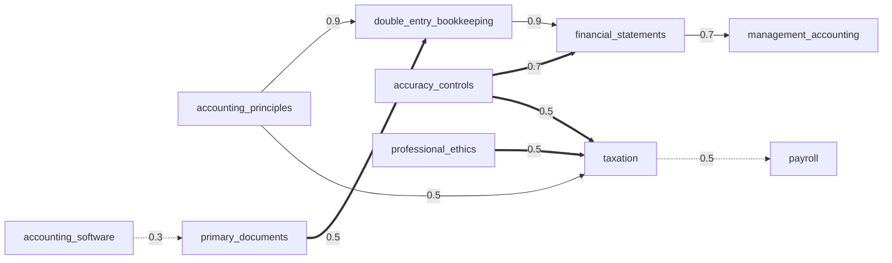

### 10.5 Level scheme

Default names and thresholds. Level 8–9 meaning gets an extra line: "Tasdiqlash LEVEL topshirigʻi orqali amalga
oshiriladi va davlat yoki kasbiy sertifikat oʻrnini bosmaydi." / "Подтверждение проводится через задание LEVEL и не
заменяет государственный или профессиональный сертификат." / "Verification is a LEVEL task and does not replace a
state or professional certificate."

### 10.6 Level requirements

| L | composite | skill gates | verification (non-gating) |
|---|-----------|-------------|---------------------------|
| 2 | 15 | double_entry_bookkeeping ≥ 10 | — |
| 3 | 25 | double_entry_bookkeeping ≥ 20 | — |
| 4 | 35 | double_entry_bookkeeping ≥ 30, financial_statements ≥ 25 | — |
| 5 | 45 | double_entry_bookkeeping ≥ 40, financial_statements ≥ 35 | verified_scenario `v5_scenario_month_close_exercise` |
| 6 | 55 | double_entry_bookkeeping ≥ 50, financial_statements ≥ 45, accuracy_controls ≥ 45 | — |
| 7 | 65 | double_entry_bookkeeping ≥ 60, financial_statements ≥ 55, accuracy_controls ≥ 55 | verified_scenario `v7_scenario_error_hunt_exercise` |
| 8 | 75 | double_entry_bookkeeping ≥ 70, financial_statements ≥ 65, accuracy_controls ≥ 65 | verified_scenario `v8_scenario_reporting_case` + practical_action `v8_portfolio_close_process` |
| 9 | 85 | double_entry_bookkeeping ≥ 80, financial_statements ≥ 75, accuracy_controls ≥ 75 | verified_scenario `v9_scenario_controls_design` + practical_action `v9_portfolio_finance_function` |

### 10.7 Verification task ideas

- **L5 financial exercise (exercise, rule):** ~20 transactions of a fictional company for one month. The user posts
  journal entries (account picker from a fixed chart of accounts), produces a trial balance and a simplified P&L.
  Rule-scored: each entry exact-match on accounts and amounts 0.6, trial balance balances 0.2, P&L net result correct
  0.2. Jurisdiction-neutral (no tax rates).
- **L7 error hunt (exercise, rule):** a ledger with 6 planted errors (transposition, wrong account, duplicate,
  missing accrual…); score = found and correctly fixed ÷ 6, minus false positives.
- **L8/L9:** human reviewer with a professional background; never AI-only.

---

## 11. Profession 7 — `designer`

| Field | Value |
|-------|-------|
| category | `design` |
| name | uz **Dizayner** · ru **Дизайнер** · en **Designer** |
| is_regulated | false |
| config | defaults; `experienceCaps {"0": 4, "lt1": 5}` |
| gate skills | K1 `visual_fundamentals` · K2 `brief_problem_framing` · K3 `typography` |

### 11.1 Specializations (Decision — brief lists none)

| slug | uz / ru / en | non-default weights |
|------|--------------|---------------------|
| `graphic` | Grafik dizayn / Графический дизайн / Graphic design | visual_fundamentals 1.3, typography 1.3, layout_grids 1.2, user_research 0.5, interaction_ux 0.4 |
| `ui_ux` | UI/UX dizayn / UI/UX-дизайн / UI/UX design | interaction_ux 2.0, user_research 1.8, presentation_handoff 1.2, typography 0.8, brand_systems 0.8 |
| `brand_identity` | Brend identifikatsiyasi / Айдентика бренда / Brand identity | brand_systems 2.0, typography 1.3, brief_problem_framing 1.2, interaction_ux 0.4 |
| `motion` | Motion dizayn / Моушн-дизайн / Motion design | design_tools 1.5, visual_fundamentals 1.3, interaction_ux 0.8, layout_grids 0.8, user_research 0.6 |

### 11.2 Skills

| # | slug | global key | kind | imp. | en | uz | ru | definition |
|---|------|-----------|------|------|----|----|----|------------|
| 1 | `visual_fundamentals` | — | hard | 0.13 | Visual fundamentals | Vizual asoslar | Визуальные основы | Composition, hierarchy, contrast, colour and balance. |
| 2 | `typography` | — | hard | 0.10 | Typography | Tipografika | Типографика | Choosing and setting type for readability and tone. |
| 3 | `layout_grids` | — | hard | 0.09 | Layout & grids | Maket va setkalar | Вёрстка и сетки | Structuring content with grids, spacing and alignment across formats. |
| 4 | `brief_problem_framing` | `problem_solving` | meta | 0.11 | Brief & problem framing | Brif va muammoni aniqlash | Бриф и постановка задачи | Extracting the real goal, audience and constraints before designing. |
| 5 | `user_research` | `customer_focus` | hard | 0.09 | User research | Foydalanuvchini oʻrganish | Исследование пользователей | Interviews, observation and usability tests that inform design. |
| 6 | `interaction_ux` | — | hard | 0.10 | Interaction & UX | Interaksiya va UX | Взаимодействие и UX | Flows, states, feedback and accessibility of interfaces. |
| 7 | `design_tools` | `digital_tools` | hard | 0.08 | Design tools | Dizayn dasturlari | Инструменты дизайна | Efficient, organized work in professional design software. |
| 8 | `brand_systems` | — | hard | 0.09 | Brand & design systems | Brend va dizayn tizimlari | Бренд и дизайн-системы | Consistent reusable rules: logos, palettes, components, tokens. |
| 9 | `critique_iteration` | `feedback` | meta | 0.10 | Critique & iteration | Tanqid va takomillashtirish | Критика и итерации | Giving and using critique to improve work in cycles. |
| 10 | `presentation_handoff` | `communication` | soft | 0.11 | Presentation & handoff | Taqdimot va topshirish | Презентация и передача макетов | Defending decisions to clients and preparing files developers/printers can use. |
| | | | | **1.00** | | | | |

### 11.3 Dependency edges

| from | relation | to | strength | rationale |
|------|----------|----|----------|-----------|
| `visual_fundamentals` | prerequisite | `layout_grids` | 0.7 | Grids organize hierarchy you must first understand. |
| `typography` | prerequisite | `brand_systems` | 0.5 | Type rules are the core of most brand systems. |
| `user_research` | prerequisite | `interaction_ux` | 0.7 | Flows are designed around observed user behaviour. |
| `brief_problem_framing` | limits | `visual_fundamentals` | 0.7 | Beautiful work solves the wrong problem. |
| `presentation_handoff` | limits | `visual_fundamentals` | 0.5 | Good design is rejected or built incorrectly. |
| `critique_iteration` | limits | `interaction_ux` | 0.5 | Interfaces ship with issues no one challenged. |
| `brief_problem_framing` | enables | `user_research` | 0.3 | A clear problem tells you what to research. |
| `design_tools` | enables | `layout_grids` | 0.3 | Tool fluency makes grid systems practical. |

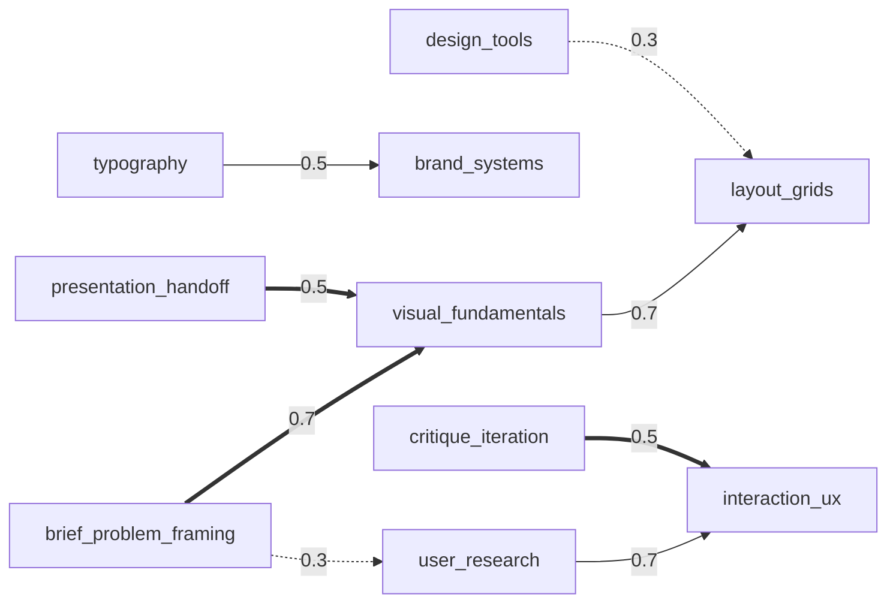

### 11.4 Level scheme

Default names and thresholds.

### 11.5 Level requirements

| L | composite | skill gates | verification (non-gating) |
|---|-----------|-------------|---------------------------|
| 2 | 15 | visual_fundamentals ≥ 10 | — |
| 3 | 25 | visual_fundamentals ≥ 20 | — |
| 4 | 35 | visual_fundamentals ≥ 30, brief_problem_framing ≥ 25 | — |
| 5 | 45 | visual_fundamentals ≥ 40, brief_problem_framing ≥ 35 | verified_scenario `v5_scenario_brief_challenge` |
| 6 | 55 | visual_fundamentals ≥ 50, brief_problem_framing ≥ 45, typography ≥ 45 | — |
| 7 | 65 | visual_fundamentals ≥ 60, brief_problem_framing ≥ 55, typography ≥ 55 | verified_scenario `v7_scenario_redesign_critique` |
| 8 | 75 | visual_fundamentals ≥ 70, brief_problem_framing ≥ 65, typography ≥ 65 | verified_scenario `v8_scenario_client_defense` + practical_action `v8_portfolio_review` |
| 9 | 85 | visual_fundamentals ≥ 80, brief_problem_framing ≥ 75, typography ≥ 75 | verified_scenario `v9_scenario_design_system_case` + practical_action `v9_portfolio_body_of_work` |

### 11.6 Verification task ideas

- **L5 portfolio challenge (case, hybrid + human):** a fictional client brief (local café, Uzbek/Russian bilingual
  menu board, or a sign-up screen for `ui_ux`), 48-hour window. Submission: one deliverable image/PDF + a 150-word
  rationale (goal, audience, key decision). Rubric: brief fit 0.3, hierarchy/typography 0.3, craft 0.2, rationale
  0.2. AI may pre-check rationale completeness; a human scores visuals.
- **L8 practical_action (portfolio, human):** 3 real projects with the user's role, constraints and outcome stated;
  reviewers check authorship claims for consistency (process files or drafts).

---

## 12. Profession 8 — `career_readiness`

| Field | Value |
|-------|-------|
| category | `career` |
| name | uz **Talaba (ishga tayyorlik)** · ru **Студент (готовность к карьере)** · en **Student (career readiness)** |
| is_regulated | false |
| config | `experienceCaps {"0": 5, "lt1": 6}` (Decision, §12.6) |
| gate skills | K1 `communication` · K2 `learning_skills` · K3 `job_search` |

The "experience" context question here means any work, internship or volunteering experience.

**Decision (audience):** content must be suitable for ages 14+. No age question is added (data minimization);
roadmap actions never require payment, travel or contact with strangers; share cards keep the name off by default
(brief §10).

### 12.1 Specializations (Decision — brief lists none)

| slug | uz / ru / en | non-default weights |
|------|--------------|---------------------|
| `school_student` | Maktab oʻquvchisi / Школьник / School student | self_awareness_direction 1.6, learning_skills 1.4, job_search 0.6, interview_skills 0.5 |
| `university_student` | Talaba / Студент вуза / University student | job_search 1.2, interview_skills 1.2, digital_literacy 1.1 |
| `recent_graduate` | Yangi bitiruvchi / Недавний выпускник / Recent graduate | job_search 1.6, interview_skills 1.6, self_awareness_direction 0.8 |
| `career_changer` | Kasbini oʻzgartiruvchi / Смена профессии / Career changer | self_awareness_direction 1.4, learning_skills 1.3, job_search 1.3 |

### 12.2 Skills

| # | slug | global key | kind | imp. | en | uz | ru | definition |
|---|------|-----------|------|------|----|----|----|------------|
| 1 | `self_awareness_direction` | — | meta | 0.10 | Career direction | Yoʻnalishni aniqlash | Профориентация | Knowing own interests and strengths and choosing a realistic first target role. |
| 2 | `learning_skills` | `learning_agility` | meta | 0.11 | Learning how to learn | Oʻrganishni bilish | Умение учиться | Planning study, practising deliberately and checking understanding. |
| 3 | `communication` | `communication` | soft | 0.11 | Communication | Muloqot | Коммуникация | Explaining ideas clearly, listening and asking good questions. |
| 4 | `written_communication` | `writing` | soft | 0.08 | Writing & email etiquette | Yozma muloqot | Письменная коммуникация | Clear messages, emails and short documents with a professional tone. |
| 5 | `digital_literacy` | `digital_tools` | hard | 0.09 | Digital & AI tools | Raqamli va AI vositalar | Цифровые и AI-инструменты | Using documents, spreadsheets, online collaboration and AI tools responsibly. |
| 6 | `problem_solving` | `problem_solving` | meta | 0.10 | Problem solving | Muammo yechish | Решение задач | Breaking down a problem, testing options and choosing a reasoned solution. |
| 7 | `teamwork` | `teamwork` | soft | 0.09 | Teamwork | Jamoada ishlash | Работа в команде | Sharing work, keeping commitments and handling disagreement in a group. |
| 8 | `time_management` | `self_management` | meta | 0.10 | Time management & reliability | Vaqtni boshqarish va masʼuliyat | Тайм-менеджмент и ответственность | Meeting deadlines, prioritizing and being reliable. |
| 9 | `job_search` | — | hard | 0.11 | CV & job search | Rezyume va ish izlash | Резюме и поиск работы | Writing a targeted CV and finding and applying to suitable openings. |
| 10 | `interview_skills` | — | soft | 0.11 | Interview skills | Suhbatdan oʻtish | Прохождение собеседования | Preparing for interviews and answering with concrete examples. |
| | | | | **1.00** | | | | |

### 12.3 Dependency edges

| from | relation | to | strength | rationale |
|------|----------|----|----------|-----------|
| `self_awareness_direction` | prerequisite | `job_search` | 0.7 | A CV and applications need a chosen target role. |
| `communication` | limits | `interview_skills` | 0.7 | Interview preparation does not show when answers are unclear. |
| `written_communication` | limits | `job_search` | 0.5 | Applications are filtered out on CV and message quality. |
| `time_management` | limits | `learning_skills` | 0.5 | Good study methods fail without consistent time. |
| `learning_skills` | enables | `digital_literacy` | 0.5 | New tools are learned faster with a learning method. |
| `communication` | enables | `teamwork` | 0.5 | Teams depend on clear communication. |
| `problem_solving` | enables | `interview_skills` | 0.3 | Case-style questions test problem solving directly. |

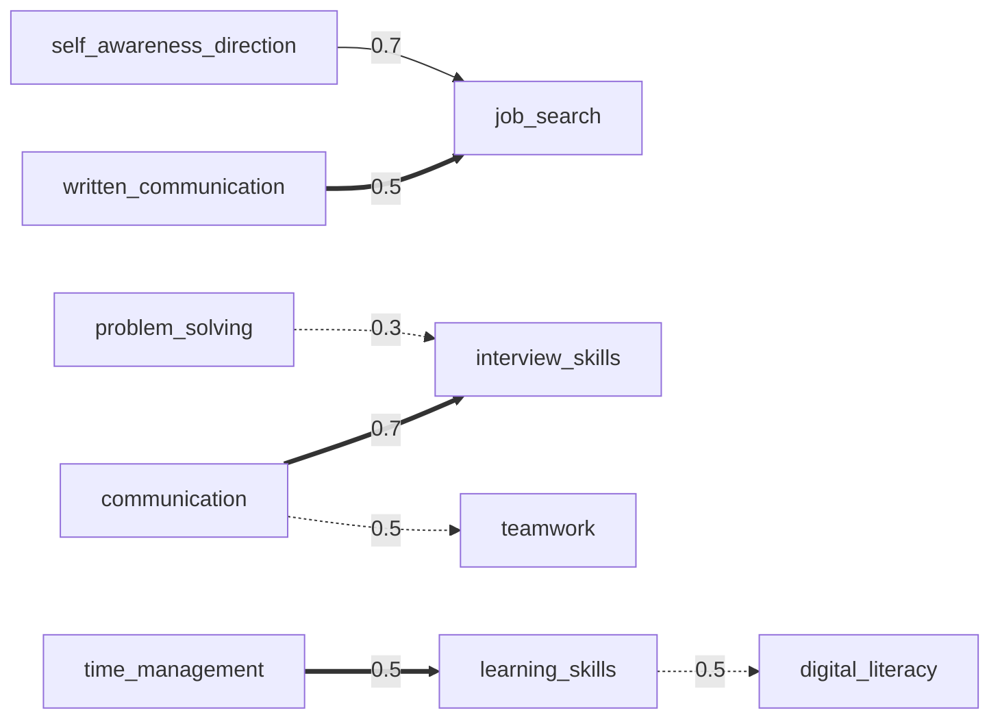

### 12.4 Level scheme (renamed — Decision)

Readiness wording instead of professional wording; thresholds default.

| # | slug | en | uz | ru |
|---|------|----|----|----|
| 1 | `starter` | Starter | Boshlangʻich | Старт |
| 2 | `explorer` | Explorer | Izlanuvchi | Исследующий |
| 3 | `preparing` | Preparing | Tayyorlanayotgan | Готовящийся |
| 4 | `internship_ready` | Internship-ready | Amaliyotga tayyor | Готов к стажировке |
| 5 | `job_ready` | Job-ready | Ishga tayyor | Готов к работе |
| 6 | `strong_candidate` | Strong Candidate | Kuchli nomzod | Сильный кандидат |
| 7 | `standout_candidate` | Standout Candidate | Ajralib turuvchi nomzod | Выдающийся кандидат |
| 8 | `proven_candidate` | Proven Candidate | Isbotlangan nomzod | Подтверждённый кандидат |
| 9 | `peer_mentor` | Peer Mentor | Tengdoshlar ustozi | Наставник для сверстников |

"Ready" here means competency readiness measured by LEVEL, not a guarantee of being hired; the L4/L5 meaning text
states: uz "Bu ishga qabul qilinish kafolati emas.", ru "Это не гарантия трудоустройства.", en "This is not a
guarantee of being hired."

### 12.5 Level requirements

| L | composite | skill gates | verification (non-gating) |
|---|-----------|-------------|---------------------------|
| 2 | 15 | communication ≥ 10 | — |
| 3 | 25 | communication ≥ 20 | — |
| 4 | 35 | communication ≥ 30, learning_skills ≥ 25 | — |
| 5 | 45 | communication ≥ 40, learning_skills ≥ 35 | verified_scenario `v5_scenario_mock_interview` |
| 6 | 55 | communication ≥ 50, learning_skills ≥ 45, job_search ≥ 45 | — |
| 7 | 65 | communication ≥ 60, learning_skills ≥ 55, job_search ≥ 55 | verified_scenario `v7_scenario_group_case` |
| 8 | 75 | communication ≥ 70, learning_skills ≥ 65, job_search ≥ 65 | verified_scenario `v8_scenario_panel_interview` + practical_action `v8_portfolio_internship_evidence` |
| 9 | 85 | communication ≥ 80, learning_skills ≥ 75, job_search ≥ 75 | verified_scenario `v9_scenario_mentoring_session` + practical_action `v9_portfolio_mentoring_evidence` |

### 12.6 Experience caps (Decision)

`{"0": 5, "lt1": 6}`. The default `{"0": 4}` would stop most of the audience at "Internship-ready" regardless of
competency; readiness for a first job is legitimately assessable without prior work. "Strong Candidate" and above
expect some real exposure (internship, volunteering, part-time).

### 12.7 Verification task ideas

- **L5 mock interview (simulation, hybrid):** the user picks an entry-level role family; an AI interviewer asks 5
  fixed-bank questions (2 behavioural, 1 motivation, 1 problem-solving, 1 "questions for us") in the chosen
  language. Rubric: concrete examples (situation-action-result present, rule-checked by structured extraction) 0.4,
  clarity 0.3, role fit reasoning 0.2, asks a relevant question 0.1. Plus a CV checklist (rule) as a pre-step that
  must be completed but is not scored.
- **L8 practical_action (portfolio, human):** evidence of a completed internship/volunteering/project with a
  reference contact or certificate image; personal data of third parties redacted.

---

## 13. Profession 9 — `teacher`

| Field | Value |
|-------|-------|
| category | `education` |
| name | uz **Oʻqituvchi** · ru **Преподаватель** · en **Teacher** |
| is_regulated | false (**Decision**: educational assessment of teaching practice, no safety/legal advice; still carries a note) |
| note (shown like a disclaimer) | uz "Natija pedagogik attestatsiya yoki toifa oʻrnini bosmaydi." / ru "Результат не заменяет педагогическую аттестацию или категорию." / en "The result does not replace official teacher certification or grading." |
| config | defaults; `experienceCaps {"0": 4, "lt1": 5}` |
| gate skills | K1 `lesson_planning` · K2 `assessment_feedback` · K3 `instructional_methods` |

### 13.1 Specializations (Decision — brief lists none)

| slug | uz / ru / en | non-default weights |
|------|--------------|---------------------|
| `school_teacher` | Maktab oʻqituvchisi / Школьный учитель / School teacher | classroom_management 1.3, communication_parents 1.3 |
| `language_teacher` | Til oʻqituvchisi / Преподаватель языка / Language teacher | instructional_methods 1.3, differentiation 1.2, communication_parents 0.7 |
| `private_tutor` | Repetitor / Репетитор / Private tutor | differentiation 1.5, student_motivation 1.3, communication_parents 1.2, classroom_management 0.4 |
| `online_instructor` | Onlayn oʻqituvchi / Онлайн-преподаватель / Online instructor | student_motivation 1.4, instructional_methods 1.3, assessment_feedback 1.2, classroom_management 0.5, communication_parents 0.4 |

### 13.2 Skills

| # | slug | global key | kind | imp. | en | uz | ru | definition |
|---|------|-----------|------|------|----|----|----|------------|
| 1 | `subject_mastery` | — | hard | 0.10 | Subject mastery | Fanni bilish | Владение предметом | Accurate, deep knowledge of the subject taught, including common misconceptions. |
| 2 | `lesson_planning` | `planning` | hard | 0.13 | Lesson planning | Dars rejalashtirish | Планирование урока | Sequencing activities, timing and materials toward an objective. |
| 3 | `learning_objectives` | — | hard | 0.09 | Learning objectives | Oʻquv maqsadlari | Учебные цели | Writing observable, level-appropriate objectives for each lesson. |
| 4 | `instructional_methods` | — | hard | 0.12 | Instructional methods | Oʻqitish metodlari | Методы обучения | Explaining, modelling, guided and independent practice, active learning. |
| 5 | `classroom_management` | — | soft | 0.11 | Classroom management | Sinfni boshqarish | Управление классом | Routines, clear expectations and calm responses to disruption. |
| 6 | `assessment_feedback` | `feedback` | hard | 0.12 | Assessment & feedback | Baholash va fikr-mulohaza | Оценивание и обратная связь | Checking understanding during and after learning and giving actionable feedback. |
| 7 | `differentiation` | — | hard | 0.09 | Differentiation | Tabaqalashtirilgan yondashuv | Дифференцированное обучение | Adapting tasks and support to different levels and needs. |
| 8 | `student_motivation` | — | soft | 0.09 | Motivation & relationships | Motivatsiya va munosabat | Мотивация и отношения | Building trust and engagement so students keep trying. |
| 9 | `communication_parents` | `communication` | soft | 0.07 | Parents & colleagues | Ota-onalar va hamkasblar bilan muloqot | Работа с родителями и коллегами | Clear, respectful communication about progress and issues. |
| 10 | `reflective_practice` | `learning_agility` | meta | 0.08 | Reflective practice | Refleksiya va oʻz ustida ishlash | Рефлексия и профессиональный рост | Reviewing own lessons with evidence and improving deliberately. |
| | | | | **1.00** | | | | |

### 13.3 Dependency edges

| from | relation | to | strength | rationale |
|------|----------|----|----------|-----------|
| `learning_objectives` | prerequisite | `lesson_planning` | 0.9 | A plan is built backwards from what students should be able to do. |
| `learning_objectives` | prerequisite | `assessment_feedback` | 0.7 | You assess against the objective you set. |
| `assessment_feedback` | prerequisite | `differentiation` | 0.5 | You adapt for students once you know where each one is. |
| `classroom_management` | limits | `instructional_methods` | 0.7 | Strong methods do not work in a disrupted class. |
| `subject_mastery` | limits | `instructional_methods` | 0.5 | Engaging methods spread misconceptions if the content is wrong. |
| `lesson_planning` | limits | `classroom_management` | 0.3 | Unplanned transitions invite disruption. |
| `student_motivation` | enables | `classroom_management` | 0.5 | Students who trust the teacher cooperate with routines. |
| `reflective_practice` | enables | `instructional_methods` | 0.3 | Methods improve through reviewing what worked. |
| `communication_parents` | enables | `student_motivation` | 0.3 | Aligned home support sustains effort. |

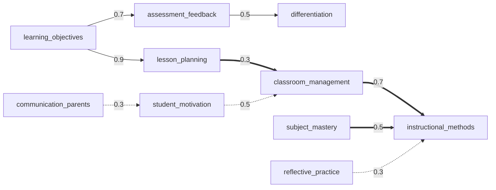

**Decision:** `subject_mastery` items are subject-neutral in MVP (recognizing misconceptions, checking own
explanations); subject-specific banks (mathematics, English, …) are a post-MVP specialization axis.

### 13.4 Level scheme

Default names and thresholds (L9 "Ustoz" fits the domain).

### 13.5 Level requirements

| L | composite | skill gates | verification (non-gating) |
|---|-----------|-------------|---------------------------|
| 2 | 15 | lesson_planning ≥ 10 | — |
| 3 | 25 | lesson_planning ≥ 20 | — |
| 4 | 35 | lesson_planning ≥ 30, assessment_feedback ≥ 25 | — |
| 5 | 45 | lesson_planning ≥ 40, assessment_feedback ≥ 35 | verified_scenario `v5_scenario_lesson_plan_critique` |
| 6 | 55 | lesson_planning ≥ 50, assessment_feedback ≥ 45, instructional_methods ≥ 45 | — |
| 7 | 65 | lesson_planning ≥ 60, assessment_feedback ≥ 55, instructional_methods ≥ 55 | verified_scenario `v7_scenario_classroom_incidents` |
| 8 | 75 | lesson_planning ≥ 70, assessment_feedback ≥ 65, instructional_methods ≥ 65 | verified_scenario `v8_scenario_mentor_feedback` + practical_action `v8_portfolio_lesson_evidence` |
| 9 | 85 | lesson_planning ≥ 80, assessment_feedback ≥ 75, instructional_methods ≥ 75 | verified_scenario `v9_scenario_curriculum_design` + practical_action `v9_portfolio_teachers_mentored` |

### 13.6 Verification task ideas

- **L5 lesson plan critique (case, hybrid):** a fictional 45-minute lesson plan with planted weaknesses (vague
  objective, no check for understanding, unrealistic timing, one activity for all levels). The user lists the issues
  and rewrites the objective, one activity and an exit check. Rubric: issues found (rule: matched against the key)
  0.4, rewritten objective is observable 0.2, activity aligned to objective 0.2, exit check measures the objective
  0.2.
- **L8 practical_action (portfolio, human):** a real lesson plan + student work samples + a reflection.
  **Decision:** no video or images showing students' faces or names (minors' privacy); teacher-only audio/video
  segments are allowed.

---

## 14. Profession 10 — `driving_instructor`

| Field | Value |
|-------|-------|
| category | `driving` |
| name | uz **Haydovchilik yoʻriqchisi** · ru **Инструктор по вождению** · en **Driving instructor** |
| is_regulated | **true** (Decision: safety-critical, licensed activity) |
| config | `experienceCaps {"0": 3, "lt1": 5}` (experience = experience instructing learners) |
| gate skills | K1 `safety_risk_management` (**no slack**, §14.5) · K2 `clear_commands` · K3 `traffic_rules_knowledge` |

### 14.1 Regulated-domain rules

Disclaimer:

- uz: "Bu taʼlimiy baholash. LEVEL natijasi haydovchilik guvohnomasi, yoʻriqchilik huquqi yoki rasmiy malaka
  hujjati emas. Amaliy mashgʻulotlarni faqat qonunchilikka muvofiq ruxsatga ega shaxslar oʻtkazadi."
- ru: "Это образовательная оценка. Результат LEVEL не является водительским удостоверением, правом на
  инструкторскую деятельность или официальным документом о квалификации. Практические занятия проводят только лица,
  имеющие допуск по закону."
- en: "This is an educational assessment. A LEVEL result is not a driving licence, an instructor licence or an
  official qualification. Practical lessons may only be given by people authorized under the law."

**Decision (content rules):**

1. Items are about **teaching** driving safely: risk management, command timing, learner psychology, progression.
2. Jurisdiction-specific rules (speed limits, signs, fines, exam procedure) are written only with an `official`
   source in `sources`, tagged `jurisdiction:uz` (default) and `law_dated:<YYYY-MM-DD>`, and served only to users in
   that country; otherwise universal principles only.
3. Roadmap actions never instruct the user to drive or to instruct on public roads; practice actions are
   reflection, planning, observation and simulator/closed-area work under authorized supervision.
4. Any answer option that is unsafe scores 0 even in `partial_credit` items.

### 14.2 Specializations (Decision — brief lists none)

| slug | uz / ru / en | non-default weights |
|------|--------------|---------------------|
| `practical_instructor` | Amaliy haydash yoʻriqchisi / Инструктор практического вождения / Practical driving instructor | vehicle_control_demonstration 1.4, clear_commands 1.3, hazard_perception 1.2, traffic_rules_knowledge 0.9 |
| `theory_instructor` | Nazariya oʻqituvchisi / Преподаватель теории / Theory instructor | traffic_rules_knowledge 1.6, hazard_perception 1.3, instruction_structure 1.2, clear_commands 0.7, vehicle_control_demonstration 0.4 |
| `corporate_driver_trainer` | Korporativ haydovchilar murabbiyi / Тренер корпоративных водителей / Corporate driver trainer | safety_risk_management 1.4, hazard_perception 1.4, learner_psychology 0.8, assessment_readiness 0.5 |

### 14.3 Skills

| # | slug | global key | kind | imp. | en | uz | ru | definition |
|---|------|-----------|------|------|----|----|----|------------|
| 1 | `traffic_rules_knowledge` | — | hard | 0.12 | Traffic rules knowledge | Yoʻl harakati qoidalarini bilish | Знание ПДД | Accurate knowledge of rules, signs and right-of-way, and explaining them. |
| 2 | `safety_risk_management` | `safety` | hard | 0.15 | Safety & risk management | Xavfsizlik va xavfni boshqarish | Безопасность и управление рисками | Choosing routes, timing and interventions (incl. dual controls) so lessons stay safe. |
| 3 | `hazard_perception` | — | hard | 0.10 | Hazard perception teaching | Xavfni oldindan koʻrishni oʻrgatish | Обучение восприятию опасности | Teaching learners to scan, anticipate and respond to hazards early. |
| 4 | `vehicle_control_demonstration` | — | hard | 0.09 | Vehicle control & demonstration | Avtomobilni boshqarish va namoyish | Управление и демонстрация | Demonstrating manoeuvres correctly and breaking them into teachable steps. |
| 5 | `instruction_structure` | `planning` | hard | 0.11 | Lesson structure & progression | Mashgʻulot tuzilmasi va bosqichlar | Структура и последовательность занятий | Sequencing lessons from simple to complex environments with clear goals. |
| 6 | `clear_commands` | `communication` | soft | 0.11 | Clear in-car commands | Aniq koʻrsatmalar berish | Чёткие команды в машине | Short, early, unambiguous directions: where, when, what. |
| 7 | `learner_psychology` | — | soft | 0.09 | Learner psychology & anxiety | Oʻquvchi psixologiyasi va hayajon | Психология ученика и тревожность | Recognizing stress and overload and adjusting pace and tone. |
| 8 | `error_correction_feedback` | `feedback` | soft | 0.10 | Error correction & feedback | Xatoni tuzatish va fikr-mulohaza | Исправление ошибок и обратная связь | Correcting faults safely in the moment and debriefing them after. |
| 9 | `assessment_readiness` | — | hard | 0.07 | Progress & exam readiness | Rivojni baholash va imtihonga tayyorlik | Оценка прогресса и готовность к экзамену | Judging objectively when a learner is ready for independent driving or the exam. |
| 10 | `professional_conduct` | `ethics_compliance` | meta | 0.06 | Professional conduct & ethics | Kasbiy odob va etika | Профессиональное поведение и этика | Respect, boundaries, honesty about readiness, no shortcuts on rules. |
| | | | | **1.00** | | | | |

### 14.4 Dependency edges

| from | relation | to | strength | rationale |
|------|----------|----|----------|-----------|
| `safety_risk_management` | limits | `instruction_structure` | 0.9 | A well-structured lesson is unsafe if risk is not controlled. |
| `safety_risk_management` | limits | `vehicle_control_demonstration` | 0.7 | Skilful demonstrations do not protect a learner in an unsafe setting. |
| `clear_commands` | limits | `safety_risk_management` | 0.5 | Safety knowledge fails when instructions come late or are ambiguous. |
| `learner_psychology` | limits | `error_correction_feedback` | 0.5 | Corrections given to an overloaded learner make errors worse. |
| `traffic_rules_knowledge` | prerequisite | `hazard_perception` | 0.7 | Anticipation starts from knowing who must yield and where. |
| `traffic_rules_knowledge` | prerequisite | `assessment_readiness` | 0.5 | Readiness is judged against the rules. |
| `instruction_structure` | prerequisite | `assessment_readiness` | 0.5 | Progress is assessed against a planned progression. |
| `error_correction_feedback` | enables | `assessment_readiness` | 0.3 | Debrief records show readiness trends. |
| `professional_conduct` | enables | `learner_psychology` | 0.3 | Respectful conduct builds the trust that lowers anxiety. |

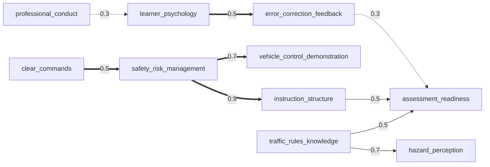

### 14.5 Level scheme and requirements

Default names and thresholds. **Decision:** `safety_risk_management` is gated with **zero slack** from L4 upward
(threshold = `min_composite(L)`), because a strong composite must not hide weak safety in a safety-critical domain.

| L | composite | skill gates | verification (non-gating) |
|---|-----------|-------------|---------------------------|
| 2 | 15 | safety_risk_management ≥ 10 | — |
| 3 | 25 | safety_risk_management ≥ 20 | — |
| 4 | 35 | safety_risk_management ≥ 35, clear_commands ≥ 25 | — |
| 5 | 45 | safety_risk_management ≥ 45, clear_commands ≥ 35 | verified_scenario `v5_scenario_instruction_scenarios` |
| 6 | 55 | safety_risk_management ≥ 55, clear_commands ≥ 45, traffic_rules_knowledge ≥ 45 | — |
| 7 | 65 | safety_risk_management ≥ 65, clear_commands ≥ 55, traffic_rules_knowledge ≥ 55 | verified_scenario `v7_scenario_lesson_progression_plan` |
| 8 | 75 | safety_risk_management ≥ 75, clear_commands ≥ 65, traffic_rules_knowledge ≥ 65 | verified_scenario `v8_scenario_observed_lesson_review` + practical_action `v8_portfolio_instructor_evidence` |
| 9 | 85 | safety_risk_management ≥ 85, clear_commands ≥ 75, traffic_rules_knowledge ≥ 75 | verified_scenario `v9_scenario_instructor_mentoring` + practical_action `v9_portfolio_school_programme` |

### 14.6 Experience caps (Decision)

`{"0": 3, "lt1": 5}`. Someone who has never instructed learners is capped at "Developing" (3): the assessment cannot
observe in-car behaviour, and overstating readiness here has a safety cost. `lt1` keeps the default 5.

### 14.7 Verification task ideas

- **L5 driving-instruction scenario (exercise, rule + hybrid):** 6 text scenarios (later with static images),
  e.g. "an anxious learner approaches an uncontrolled intersection at 30 km/h with a parked van blocking the view".
  For each, the user writes the exact command(s) and when to give them (distance/time), and what to do if the learner
  does not respond. Rubric: safety-first intervention plan (rule: key elements present, any unsafe action = 0 for the
  scenario) 0.5, command clarity (short, early, unambiguous) 0.3, debrief/correction approach 0.2.
- **L8 (human, post-MVP):** observed lesson review by an authorized senior instructor, plus evidence of current
  legal authorization to instruct (checked, not stored beyond the review).

---

## 15. Cross-profession summary

| profession | category | #skills | #specs | #edges | renamed levels | experienceCaps | gates K1 / K2 / K3 | L5 verification type | regulated |
|-----------|----------|---------|--------|--------|----------------|----------------|--------------------|----------------------|-----------|
| `entrepreneur` | business | 10 | 6 | 11 | yes (5–7) | default | finance / operations / sales | case | no |
| `software_developer` | technology | 11 | 7 | 11 | yes (2–9) | default | programming_fundamentals / debugging / testing_quality (+version_control L4–5) | coding | no |
| `sales_specialist` | sales | 11 | 6 | 10 | no | default | discovery / objection_handling / closing | simulation | no |
| `marketing` | marketing | 10 | 6 | 10 | no | default | analytics_measurement / customer_research / positioning_messaging | case | no |
| `manager` | management | 10 | 4 | 9 | no | default | goal_setting_planning / feedback_coaching / delegation | simulation | no |
| `accountant` | finance | 10 | 5 | 10 | no | default | double_entry_bookkeeping / financial_statements / accuracy_controls | exercise | **yes** |
| `designer` | design | 10 | 4 | 8 | no | default | visual_fundamentals / brief_problem_framing / typography | case | no |
| `career_readiness` | career | 10 | 4 | 7 | yes (2–9) | `{"0":5,"lt1":6}` | communication / learning_skills / job_search | simulation | no |
| `teacher` | education | 10 | 4 | 9 | no | default | lesson_planning / assessment_feedback / instructional_methods | case | no (note) |
| `driving_instructor` | driving | 10 | 3 | 9 | no | `{"0":3,"lt1":5}` | safety_risk_management (no slack) / clear_commands / traffic_rules_knowledge | exercise | **yes** |

Transferable skills (global keys shared by ≥ 3 MVP professions): `communication` (developer, manager, designer,
career_readiness, teacher, driving_instructor), `feedback` (sales, manager, designer, teacher, driving_instructor),
`planning` (entrepreneur, marketing, manager, teacher, driving_instructor), `customer_focus` (entrepreneur, sales,
marketing, designer), `self_management` (sales, manager, career_readiness), `problem_solving` (developer, designer,
career_readiness), `digital_tools` (accountant, designer, career_readiness), `ethics_compliance` (accountant,
driving_instructor — 2), `decision_making` (entrepreneur, manager — 2).

---

## 16. Content author checklist and validator rules

Per profession, before `status = active`:

1. Profession fields, category, `isRegulated` + `disclaimer` exactly as in this document.
2. Skills: slugs, global keys, kinds, importances exactly as listed; Σ importance = 1.00.
3. Specialization weights exactly as listed; weights in [0.3, 3.0]; gate skills ≥ 0.5 everywhere.
4. Edges exactly as listed, each with i18n rationale; graph rules §2.6 pass.
5. Levels: 9 objects when renamed; requirements per the profession's table; no authored `composite_min`.
6. Questions: ≥ 40 active; every skill ≥ 3 non-self-report items over ≥ 3 target levels (validator), and
   **recommended** ≥ 4 items per skill across target levels 2–8 with gate skills ≥ 5 items (they decide levels);
   ≥ 30 % scenario-like; ≤ 25 % self_report. Items for gate skills must include target levels up to 7.
7. Actions: ≥ 3 per skill across phases, ≥ 2 per skill ≤ 30 min; do-not rules ≥ 3.
8. Verification: the `v5_scenario_*` task authored with rubric (status `draft` while the flag is off).
9. No invented statistics, studies, URLs, books or experts; fictional case data is labelled fictional
   ("Shartli misol" / "Условный пример" / "Fictional example").
10. Uzbek text uses ʻ (U+02BB) and ʼ (U+02BC) only.

**Validator additions required by this document** (to add to `content/validate-lib.ts`; today it checks only the
first group):

| rule | severity |
|------|----------|
| 8 ≤ #skills ≤ 11 | error |
| Σ importance within 1 ± 0.05 (exists) | error |
| specialization weight ∈ [0.3, 3.0] | error |
| `globalSkillKey` ∈ §2.5 vocabulary and unique per profession | error |
| `prerequisite` edges acyclic; no `limits` 2-cycles; ≤ 1 edge per (from, to) | error |
| edge strength ∈ {0.3, 0.5, 0.7, 0.9} | error |
| 7 ≤ #edges ≤ 12 and every skill in ≥ 1 edge | warning |
| no authored `composite_min`; `verified_scenario`/`practical_action` have `gatesAssessed = false` | error |
| `skill_min` thresholds non-decreasing by level per skill | error |
| levels 2..9 each have ≥ 1 `skill_min` | error |
| gate skills (skills used in any `skill_min`) have weight ≥ 0.5 in every specialization | error |
| `isRegulated` ⇒ `disclaimer` present | error |
| items tagged `jurisdiction:*` carry `law_dated:*` and an evidence source | error |

---

## 17. Decision log and alignment notes

### Decisions

| # | Decision | Section |
|---|----------|---------|
| P1 | Context `skillBoosts` affect routing only, never composite weights | §1 |
| P2 | `global_skill_key` is display-only (transferable view), controlled vocabulary, unique per profession | §2.4, §2.5 |
| P3 | Specialization weights in [0.3, 3.0]; gate skills ≥ 0.5 in every specialization | §2.3 |
| P4 | Gate skills K1–K3 always included in the routing coverage set | §2.4 |
| P5 | Edge strength scale {0.3, 0.5, 0.7, 0.9}; prerequisite DAG; no limits 2-cycles; one edge per pair | §2.6 |
| P6 | Bottleneck tie = leverage within 0.005; prerequisite wins ties; `gap_to_next` uses the skill's own next `skill_min` when present | §2.6 |
| P7 | All MVP professions keep default thresholds; renames for entrepreneur, software_developer, career_readiness | §3.1 |
| P8 | `composite_min` rows are generated by the seeder, never authored | §3.2 |
| P9 | Verification requirement rows always `gates_assessed = false` | §3.2 |
| P10 | Standard requirement template (K1 = min_composite − 5, K2/K3 = min_composite − 10; gate counts 1/1/2/2/3/3/3/3) | §3.3 |
| P11 | `experience_min` not authored in MVP | §3.2 |
| P12 | Verification slots at L5, L7, L8 (+portfolio), L9 (+portfolio); only L5 authored in MVP | §4.1 |
| P13 | Pass score 70 (`app_settings.verification_pass_score`); L8–9 need human scoring; AI-only cannot pass | §4.2 |
| P14 | VERIFIED level formula; ∈ {5, 7, 8, 9}; uses results ≤ 180 days; ignores experience caps | §4.3 |
| P15 | Specializations for manager, accountant, designer, career_readiness, teacher, driving_instructor (brief lists none) | §9–§14 |
| P16 | `sales_specialist.team_coaching` low base importance, lifted by manager specializations | §7.2 |
| P17 | Accountant and driving_instructor regulated; jurisdiction-specific items need official source + date tags | §10.1, §14.1 |
| P18 | `driving_instructor` safety gate has zero slack; caps `{"0": 3, "lt1": 5}` | §14.5, §14.6 |
| P19 | `career_readiness` caps `{"0": 5, "lt1": 6}`; content suitable for 14+; no age question | §12 |
| P20 | Teacher not regulated but shows a non-certification note; no minors' faces/names in evidence | §13 |
| P21 | Developer grade names carry "competency level, not employer job grade" line | §6.4 |

### Alignment notes

| # | Note | Action |
|---|------|--------|
| A1 | Category slugs: `content/taxonomy/categories.ts` uses `technology`, `finance`, `career`; `02-mvp-spec.md` D6 lists `it`, `accounting`, `students`. This document follows the content code (it is the seed source). | Update 02 D6 to the content slugs. |
| A2 | Experience band spelling: brief/DB `0`, content code `none` (also 04 §20 A9). This document writes caps with `0`. | Content layer maps `none` → `0` before seeding (or renames); one spelling in `assessment_sessions.context` and `professions.config.experienceCaps`. |
| A3 | `content/schema.ts` allows 6–12 skills and weights 0–3; this document narrows to 8–11 and 0.3–3.0. | Add validator rules in §16. |
| A4 | `level_requirements` has no `specialization_id`; gates are profession-wide by design (P3 keeps them meaningful). | None for MVP. |
| A5 | `verification_tasks` needs the slot naming of §4.1 in `slug`; type ↔ requirement mapping (`portfolio` ↔ `practical_action`, others ↔ `verified_scenario`) is enforced in the verification module. | Implement with the verification module (flag off in MVP). |
