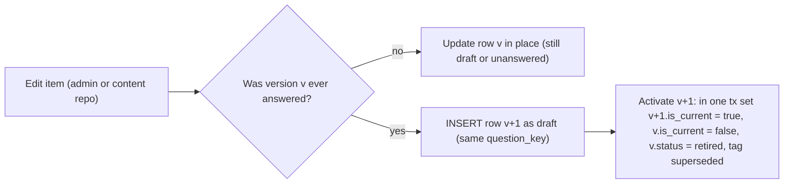
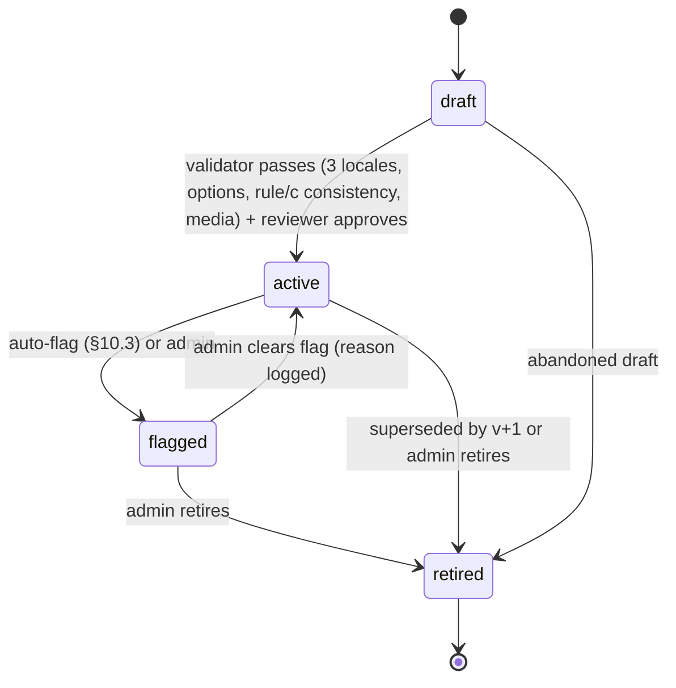
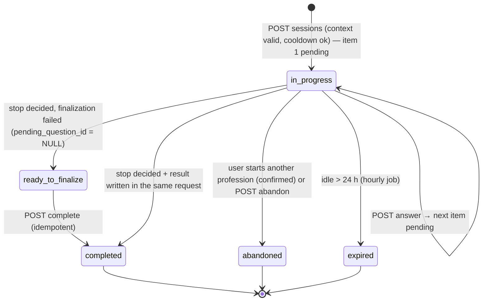

# 06 — Assessment Architecture

> Scope: the question bank, assessment templates, context questions, the adaptive routing engine, session
> lifecycle, integrity (anti-cheating) signals, retest rules, item quality analytics, AI boundaries and the
> assessment API contract. The scoring math (likelihood, EAP, levels, confidence, bottleneck) lives in
> [`07-scoring-formulas.md`](./07-scoring-formulas.md).
>
> Source of truth: the decisions brief (§6 assessment engine, §4 tables, §0 principles). Where the brief is silent
> this document decides, marked **Decision:**. Where an earlier document or the current code differs, the
> difference is listed in §14 so the owners can align it.

Module ownership (01 §2): `src/modules/assessments` (bank, templates, routing, sessions, integrity, item stats) and
`src/modules/scoring` (pure math, 07). Everything in this document runs **server-side only**. The client gets
localized prompt text, opaque option keys and a progress counter, nothing more.

---

## 1. Design goals and hard rules

| # | Rule | Why |
|---|------|-----|
| G1 | 3–5 minutes: 3–5 context questions + 7–15 items (target 12). | Brief §6. Viral entry point, mobile first. |
| G2 | Deterministic and reproducible: same bank + same seed + same answers ⇒ same items, same option order, same result. | Auditability, support, golden tests. |
| G3 | Zero AI calls on the core path. | Brief §0: "core assessment works with AI fully down". |
| G4 | The client never receives option scores, authored option keys, IRT parameters, skill ids of items, θ, SE, credit, routing phase or the seed. | Brief §0, §5: answer keys are server-only. |
| G5 | One question per screen, 2–5 options, no correct/incorrect feedback during the test, no visible timer. | Brief §6. |
| G6 | Mixed formats; never only "rate yourself 1–10". ≤ 2 `self_report`, ≥ 2 scenario-like (`judgment`/`scenario`/`decision`). | Brief §6. |
| G7 | Answered question versions are immutable; results store `assessment_version`, `scoring_model_version`, `question_versions`. | Brief §4. |
| G8 | Integrity signals lower **confidence**; they never silently change a score. | Brief §6/§7 (speeding lowers confidence). |

---

## 2. Question bank model

### 2.1 Item record

Table `assessment_questions` (04 §5) — one row per **version** of an item; `question_key` is stable across
versions (`<profession>.<skill>.<nn>`, e.g. `entrepreneur.systemization.04`).

| Field | Rule |
|-------|------|
| `type` | `knowledge` (fact/concept), `judgment` (pick the best of several plausible actions), `scenario` (situation text + question), `decision` (real-life trade-off with consequences), `self_report` (frequency/behaviour Likert, never "rate yourself 1–10"), `open` (free text; **not served in the MVP**, §11). |
| `target_level` | 1..9, the level at which a typical person answers it correctly about half of the time above guessing. Content covers 2–8. |
| `difficulty` b | Seeded as `b = (target_level − 5) × 0.7` (target 2 → −2.1, 5 → 0, 8 → 2.1). Replaced only by recalibration (§10.4), which creates a new version. |
| `discrimination` a | 0.4–2.0, default 1.0; `self_report` 0.5. |
| `guessing` c | `1 / number_of_options` for `single_best` knowledge/judgment/scenario/decision items (4 options → 0.25); `0` for `self_report`, `partial_credit` and `likert` items. Validator-enforced. |
| `weight` w | Default 1; `self_report` 0.5. Range 0 < w ≤ 5 (DB CHECK); content uses 0.5 or 1. |
| `scoring_rule` | `single_best` (exactly one option scores 1, rest 0), `partial_credit` (scores ∈ {0, 0.5, 1}, exactly one 1; allowed for `judgment`/`scenario`/`decision`), `likert` (`self_report`; graded scores, monotone in authored order, e.g. 0, 0.25, 0.5, 0.75, 1), `open_ai` (only `type = open`). |
| `prompt`, `scenario`, `explanation` | jsonb `{uz, ru, en}`; an item can be `active` only with all three locales (02 D5 trigger). `explanation` is shown only after the test, in the unlocked report, never during it. |
| `media` | §2.3. |
| `specialization_ids` | Empty = all specializations of the profession (04 §20 A1). |
| `status` | §2.5. |
| `source` | `seed` (content repo), `admin` (written in admin UI), `ai_reviewed` (AI-drafted, human-approved; §11). |
| `tags` | Free tags for authoring and analytics (`"cash_flow"`, `"b2c"`, `"uz_market"`). Tags are not used by routing. |

**Decision:** an item measures exactly **one** skill. Cross-skill scenarios are written twice (two items, two
skills) or attributed to the dominant skill. Multi-skill attribution would break the per-skill likelihood in 07 §5.

### 2.2 Options and partial credit

Table `question_options`: `option_key` (`a`..`e`, authored order), `label` jsonb, `score` ∈ [0, 1], `sort_order`.

| Scoring rule | Options | Score pattern | Credit x |
|--------------|---------|---------------|----------|
| `single_best` | 2–5 | one 1, rest 0 | score of the selected option |
| `partial_credit` | 3–5 | one 1 (best), ≥ 1 of 0.5 (acceptable), ≥ 1 of 0 (poor) | score of the selected option |
| `likert` | 3–5 | monotone non-decreasing in `sort_order`, first 0, last 1 | score of the selected option |

Validator rules (content CI + DB triggers):
- 2–5 options for every closed item; exactly one selection per answer (`creditFor` rejects 0 or ≥ 2 keys).
- `partial_credit` items have `guessing = 0` (a 0.5 option is not a guess-floor event).
- **Decision:** no "I don't know" option (02 D9): it would invalidate c = 1/num_options.
- **Decision:** at most one option with score 1 for every rule. Two equally best answers mean the item is ambiguous.
- Distractors must be plausible; an option chosen by < 2 % of respondents is reported as dead (§10).

Credit computation (server, at answer time; stored in `assessment_answers.credit`):

```
displayKeys  = request.optionKey                    // "o1".."o5" (opaque, per session)
authoredKeys = authoredOptionKeys(question, optionOrderSeed(rngSeed, sequence), [displayKeys])
x            = clamp(option(authoredKeys[0]).score, 0, 1)   // non-finite → 0
store selected_option_keys = authoredKeys  (re-scoring never needs the seed)
```

### 2.3 Media

`media` jsonb, discriminated by `kind`. Rendered inside the question card; never contains the answer.

| kind | Shape | Rendering rules |
|------|-------|-----------------|
| `code` | `{kind:"code", language:"sql", code:"SELECT …"}` | Monospace, horizontal scroll inside the block only, max 30 lines (validator), no syntax-colour dependence for meaning. Code is not translated; comments inside code should be language-neutral. |
| `table` | `{kind:"table", headers:[i18n…], rows:[["…"]]}` | ≤ 6 columns × 10 rows; cell values are numbers/neutral strings. |
| `chart` | `{kind:"chart", chartType:"bar"\|"line", title:i18n, xLabels:[string], series:[{name:i18n, values:[number]}], unit?:string}` | **Decision:** rendered client-side as inline SVG from data (no image upload), plus a visually hidden data table for screen readers; ≤ 3 series × 12 points. |
| `image` | `{kind:"image", src:"/content/q/<hash>.webp", alt:i18n, aspect:"4:3"}` | Static asset path under our origin (no third-party hotlinks); fixed aspect box (no layout shift); `alt` required in 3 locales. |

**Decision:** `chart` is added to the media union (the current code type supports `code`, `table`, `image`); until
the renderer ships, the content validator rejects `chart` items for activation.

### 2.4 Versioning



- Immutability trigger (04 §5): once any `assessment_answers` row references a version, content and psychometric
  columns and its options are frozen.
- `is_current` — exactly one per `question_key` (partial unique index). Routing loads only
  `is_current AND status = 'active'`.
- **Decision:** a version is never deleted. A session whose `pending_question_id` points to a version that was
  superseded or flagged mid-session can still answer it (the row exists, it is just no longer selected for new
  serves). Exclusion within a session and across the retest window is by `question_key`, so v+1 of an item already
  seen is never served to the same user in the same session (04 §5 Decision).
- Results store `question_versions` = `[{questionId, questionKey, version}]` in answer order.

### 2.5 Status lifecycle



| Status | Served to new selections | Answers accepted | Stats computed |
|--------|--------------------------|------------------|----------------|
| `draft` | no | no | no |
| `active` | yes (if `is_current`) | yes | yes |
| `flagged` | **no** | yes, if already pending | yes |
| `retired` | no | yes, if already pending | historical only |

Every transition writes `audit_logs` (`action = 'question.status_changed'`, before/after, actor `admin` or `system`).

**Decision (pool floor):** an automatic flag never drops the active pool of a `(profession, skill)` below
`min_active_items_per_skill` (default 3, `app_settings.assessment.min_active_items_per_skill`). Instead the item is
tagged `needs_review` and an admin alert is raised. A manual flag may go below the floor; the admin UI warns.

### 2.6 Exposure tracking

Exposure = how often an item is served. It matters because a frequently served item leaks through screenshots and
shared answers.

- Counters are computed, not stored per serve: a serve is an `assessment_answers` row, or the
  `pending_question_id` of a session that ended unanswered.
- `exposure_rate(q, 30d) = sessions that served q / sessions started in the item's profession whose specialization
  matches q, in the last 30 days`.
- Controls already in the engine: randomesque top-3 (§5.6), never twice per session, retest freshness (§8).
- **Decision:** the MVP adds no exposure penalty to routing. An exposure-aware rule (such as Sympson–Hetter) would make
  selection depend on a moving global counter and break replay (G2). Overexposure is an analytics flag (§10.3)
  answered by authoring sibling items at the same `(skill, target_level)`.
- Bank sizing rule for content (brief §13: ~40+ items/profession): every core skill should have ≥ 4 active items
  spread over ≥ 3 distinct target levels, so the top-3 randomesque candidates exist near most θ values.

---

## 3. Assessment templates and configuration

Table `assessment_templates` (`profession_id`, `specialization_id` NULL = all, `slug`, `version`, `status`,
`scoring_model_version`, `config`, `context_questions`).

- **Decision:** at most one `active` template per `(profession_id, specialization_id)`; a session uses the most
  specific match (specialization template, else profession template, else no template → profession config
  defaults). A session pins `template_id` + `template_version`; a used template version is immutable (edits create
  version + 1).
- `assessment_version` stored on the result = `"<template_slug>@v<template_version>"` (04 §5 Decision).

### 3.1 Config resolution

`effective = deepMerge(app_settings.assessment.defaults, professions.config, assessment_templates.config)` (later wins),
then validated by zod and normalized (`1 ≤ max`, `0 ≤ min ≤ target ≤ max`, integers).

```json
{
  "minQuestions": 7,
  "maxQuestions": 15,
  "targetQuestions": 12,
  "targetSe": 0.45,
  "extensionSeMargin": 0.0,
  "maxSelfReportItems": 2,
  "minScenarioLikeItems": { "yes": 4, "no": 2, "learning": 2 },
  "randomesqueK": 3,
  "maxCoreSkills": 8,
  "coreReservedSlots": 3,
  "speeding": { "thresholdMs": 2500, "maxRatio": 0.30 },
  "retestCooldownDays": 14,
  "retestWindowDays": 180,
  "experienceCaps": { "0": 4, "lt1": 5 },
  "goalBoosts": { "lead": { "people_management": 1.3 } },
  "contextQuestionKeys": ["experience", "working", "goal", "time_per_day"]
}
```

| Key | Default | Notes |
|-----|---------|-------|
| `minQuestions` / `maxQuestions` / `targetQuestions` | 7 / 15 / 12 | Brief §6. |
| `targetSe` | 0.45 | Brief §6 stop rule. |
| `extensionSeMargin` | **0.0** | **Decision:** optional soft stop at `targetQuestions` when `SE_g ≤ targetSe + margin`. The brief-literal stop rule is margin 0, so that is the default. A non-zero value may only be set through the experiment `assessment.length` and is recorded in `experiment_variants`. |
| `maxSelfReportItems` | 2 | Brief §6 (≤ 2). |
| `minScenarioLikeItems` | per `working` (§4.3) | Brief minimum 2; never below 2. |
| `randomesqueK` | 3 | Brief §6 (top-3). Fixed at 3 in v1; kept in config for completeness. |
| `maxCoreSkills`, `coreReservedSlots` | 8, 3 | Core skill count = `min(#routable, max(1, target − 3), 8)`. |
| `speeding` | 2500 ms / 0.30 | Brief §6. |
| `retestCooldownDays` | 14 | Brief §6. |
| `retestWindowDays` | 180 | **Decision:** items seen within 180 days are avoided on retest while the bank allows. |
| `experienceCaps` | `{"0":4,"lt1":5}` | Brief §7. |
| `goalBoosts` | code defaults (§4.4) | Routing only; multipliers ∈ [1.0, 1.5]. |

**Decision (not configurable):** prior means, prior SD, τ, the θ grid, the score mapping and the confidence thresholds
belong to `scoring_model_version` (07 §15). They cannot be overridden by a template, so a stored
`scoring_model_version` fully determines the math.

---

## 4. Context questions

Asked one per screen **before** the session is created; collected client-side and sent with
`POST /api/v1/assessments/sessions` (02 D8), because the prior needs `experience` before item 1 is chosen.
Default set = 4 questions; a template may add **one** profession-specific question (max 5 total; up to 6 options).
A retest pre-fills the previous answers (02 AC-F05-04).

### 4.1 Exact list

| # | key | uz prompt | Options (key — uz / ru / en) |
|---|-----|-----------|------------------------------|
| 1 | `experience` | Bu sohada qancha tajribangiz bor? | `0` — Tajribam yoʻq / Нет опыта / None yet · `lt1` — 1 yildan kam / Меньше 1 года / Less than 1 year · `1to3` — 1–3 yil / 1–3 года / 1–3 years · `3to5` — 3–5 yil / 3–5 лет / 3–5 years · `5plus` — 5 yildan koʻp / Больше 5 лет / 5+ years |
| 2 | `working` | Hozir bu sohada ishlaysizmi? | `yes` — Ha / Да / Yes · `no` — Yoʻq / Нет / No · `learning` — Oʻrganyapman / Учусь / I'm learning |
| 3 | `goal` | Asosiy maqsadingiz qanday? | `start` — Boshlash / Начать / Get started · `find_job` — Ish topish / Найти работу / Find a job · `professional` — Professional boʻlish / Стать профессионалом / Become a professional · `increase_income` — Daromadni oshirish / Увеличить доход / Increase income · `lead` — Rahbar boʻlish / Стать руководителем / Become a leader · `expert` — Ekspert boʻlish / Стать экспертом / Become an expert |
| 4 | `time_per_day` | Rivojlanish uchun kuniga qancha vaqt ajrata olasiz? | `10` — 10 daqiqa / 10 минут / 10 min · `20` — 20 daqiqa / 20 минут / 20 min · `30` — 30 daqiqa / 30 минут / 30 min · `60` — 1 soat / 1 час / 1 hour |
| 5 | template-defined (optional) | e.g. entrepreneur: Biznesingizda nechta xodim ishlaydi? | 2–6 options; each option may carry `skillBoosts` (0.5–2.0) and `suggestsSpecialization` |

ru prompts: «Сколько у вас опыта в этой сфере?», «Вы сейчас работаете в этой сфере?», «Какая у вас главная цель?»,
«Сколько времени в день вы готовы уделять развитию?». en: "How much experience do you have in this field?",
"Do you currently work in this field?", "What is your main goal?", "How much time per day can you give to growth?".

Templates may hide goal options per profession (02: entrepreneur hides `find_job`).

### 4.2 `experience` → prior mean, caps, requirements

| experience | μ0 (prior mean of θ_g) | Experience cap (default) | Years for `experience_min` |
|------------|------------------------|--------------------------|----------------------------|
| `0` | −1.0 | Level 4 | 0 |
| `lt1` | −0.6 | Level 5 | 0.5 |
| `1to3` | 0.0 | — | 1 |
| `3to5` | 0.4 | — | 3 |
| `5plus` | 0.8 | — | 5 |

Prior `N(μ0, 1.0²)` (07 §4). A weak prior: after about 6 informative items, data dominates. Item 1 is the coverage
item whose b is nearest μ0 (e.g. `3to5` → μ0 = 0.4 → a target-level-6 item, b = 0.7, |0.7 − 0.4| = 0.3, beats a
target-level-5 item, |0 − 0.4| = 0.4).

### 4.3 `working` → item type mix

**Decision:** `working` changes only the type quota, never the prior or the score (experience already moves the
prior; using both would double-count the same self-report).

| working | `minScenarioLikeItems` | Rationale |
|---------|------------------------|-----------|
| `yes` | 4 | Practitioners are best measured with applied judgment/scenario/decision items. |
| `no` | 2 | Brief minimum. |
| `learning` | 2 | Learners meet more knowledge items naturally because routing targets lower b. |

The quota is enforced as in §5.5 (scenario-only filter when the remaining slots are needed). If the bank cannot
reach the quota, the session proceeds (quota "unreachable"), and the gap is logged as `quota_unreachable` for content.

### 4.4 `goal` → skill importance boosts (routing only)

- `routingImportance_s = normalize(importance_s × specializationWeight_s × goalBoost_s × contextBoost_s)`.
- `compositeImportance_s = normalize(importance_s × specializationWeight_s)` — **no goal**, so the same answers give
  the same composite and level whatever goal was stated (brief §6: composite = importance × specialization weight).
- Default `goalBoost` rules (code `GOAL_BOOST_RULES`): `lead` / `manager` → ×1.3 for skills whose `slug` or
  `global_skill_key` contains `leadership | management | people | delegation`. Other goals: no boost, because we have
  no reliable evidence that the goal changes which current competencies matter.
- Templates may add `goalBoosts` per profession (skill slug → multiplier ∈ [1.0, 1.5]), e.g. entrepreneur
  `scale_business` → `systemization ×1.3`. Content must state the reason in the template's changelog.
- Effects of the boost: which skills are core (coverage), and the order of the precision phase. The goal is also
  stored in `goals` and drives the roadmap (08).
- `time_per_day`: no routing effect; the 7-day plan uses it (brief §8). The optional 5th question's `skillBoosts`
  are routing-only multipliers, like goal boosts.

---

## 5. Adaptive routing algorithm

Implementation: `src/modules/assessments/domain/routing*.ts` (pure). Inputs are loaded by the application service in
the same transaction that locks the session (`SELECT … FOR UPDATE`).

### 5.1 Inputs

```ts
RoutingInput {
  bank: Question[]                 // is_current AND status='active' items of the profession (all specializations)
  answered: AnsweredItem[]         // this session, in sequence order (n = answered.length)
  servedQuestionIds: uuid[]        // answered + pending
  skills: {id, importance}[]       // ROUTING importance (§4.4), normalized
  specializationId: uuid | null
  priorMean: number                // μ0 from experience
  config: EffectiveConfig          // §3.1, with minScenarioLikeItems resolved from working
  rngSeed: number                  // assessment_sessions.rng_seed (safe integer, §5.6)
  recentlySeenKeys: Set<string>    // question_keys this user answered for this profession within retestWindowDays
}
```

### 5.2 Pool construction (each step)

```
routable     = unique skills with importance > 0 (if none > 0: all)        // specialization weight 0 → never served
sessionBank  = bank where servable(q)                                      // type ≠ open, ≥ 2 options
                     ∧ q.skillId ∈ routable
                     ∧ (q.specializationIds = ∅ ∨ specializationId ∈ q.specializationIds)
served       = answered ∪ pending (by id)
servedKeys   = { q.key : q.id ∈ served }
eligible     = sessionBank − served ids − servedKeys                       // never repeat an item or another version of it
fresh        = eligible − recentlySeenKeys
pool         = (|fresh| ≥ maxQuestions − n) ? fresh : eligible             // "when bank allows"
covered      = { skillId of served items }
srCount      = #served self_report;   scCount = #served judgment|scenario|decision
```

### 5.3 Core skills (coverage set)

```
coreCount = min(|routable|, max(1, targetQuestions − coreReservedSlots), maxCoreSkills)   // 12 → min(|routable|, 8)
core      = first coreCount skills by routing importance (desc, ties: input order)
            restricted to skills with ≥ 1 item in sessionBank
```

Stable for the whole session (computed on `sessionBank`, not on the shrinking pool). Non-core skills are measured only
if the precision phase picks them; otherwise their θ_s = θ_g and they are flagged "not directly measured" (07 §5).

### 5.4 Step function

```
function selectNextQuestion(input): Decision
  cfg = normalize(input.config); n = |input.answered|
  pool = buildPool(input, cfg)
  est  = estimateAbilities(answered, skills, priorMean)       // θ_g, SE_g, {θ_s, SD_s}  (07 §4–§5)

  if n ≥ cfg.maxQuestions                       → STOP("max_items")
  if pool = ∅                                   → STOP("bank_exhausted")

  allowSR      = srCount < cfg.maxSelfReportItems
  uncovered    = [s ∈ core : s ∉ covered ∧ candidates(s, {allowSR}) ≠ ∅]     // in core order
  coverageDone = uncovered = ∅
  need         = max(0, cfg.minScenarioLikeItems − scCount)
  quotaPending = need > 0 ∧ ∃ q ∈ pool : scenarioLike(q)
  canStop      = (n ≥ cfg.minQuestions ∧ est.SE_g ≤ cfg.targetSe)
               ∨ (n ≥ cfg.targetQuestions ∧ est.SE_g ≤ cfg.targetSe + cfg.extensionSeMargin)

  if coverageDone ∧ ¬quotaPending ∧ canStop      → STOP("precision_reached")

  scenarioOnly = quotaPending ∧ (cfg.targetQuestions − n ≤ need ∨ (coverageDone ∧ canStop))
  C = {allowSR, scenarioOnly}

  if ¬coverageDone:                                              // COVERAGE PHASE
     for s in uncovered:
        cand = candidates(s, C)
        if cand ≠ ∅: return SERVE(randomesque(rankByDistance(cand, est.θ_g)), "coverage")

  for s in routable sorted by (importance_s × SD_s) desc,        // PRECISION PHASE
                       then importance desc, then input order:
     cand = candidates(s, C)
     if cand ≠ ∅: return SERVE(randomesque(rankByInformation(cand, est.θ_s)), "precision")

  if scenarioOnly: retry PRECISION PHASE with C = {allowSR, scenarioOnly: false}
  → STOP("bank_exhausted")                                       // e.g. only self_report items over the cap remain
```

Helpers:

```
candidates(s, C)          = [q ∈ pool : q.skillId = s ∧ (C.allowSR ∨ q.type ≠ self_report)
                                       ∧ (¬C.scenarioOnly ∨ scenarioLike(q.type))]
rankByDistance(Q, θ_g)    = sort Q by |q.b − θ_g| asc, ties by question_key asc, then id asc
rankByInformation(Q, θ_s) = sort Q by I_q(θ_s) desc, ties by question_key asc, then id asc
I_q(θ)                    = (1.7·a)² · ((P − c)² / (1 − c)²) · ((1 − P) / P),   P = P_q(θ)   (07 §2)
```

For an unmeasured skill, `θ_s = θ_g` and `SD_s = sqrt(SE_g² + τ²)` (≥ 0.8), so unmeasured important skills rank high
in the precision phase automatically.

Fisher information example (a = 1, at θ = 0.4): `single_best` 4-option item at b = 0 → I = 0.429; `partial_credit` item
(c = 0) at b = 0.7 → I = 0.677; `single_best` at b = 1.4 → I = 0.120. The partial-credit item is preferred: c = 0 items
carry more information, which is one reason to author judgment/scenario items with partial credit.

### 5.5 Constraints summary

| Constraint | Enforcement |
|------------|-------------|
| ≤ 2 `self_report` | `allowSR = false` once 2 were served (hard). |
| ≥ N scenario-like (N from §4.3, min 2) | `scenarioOnly` filter when the remaining normal-length slots are needed, or when the quota is the only thing blocking a stop. If unreachable, the test proceeds. |
| Specialization filter | Pool construction (hard). |
| No repeats within session | By id and by `question_key` (hard). |
| Retest freshness | Recently seen keys excluded while `|fresh| ≥ maxQuestions − n` (soft). |
| No `open` items | `servable` (hard, MVP). |
| Zero-weight skills never served | `routable` (hard). |

### 5.6 Randomesque selection and seeding

```
k     = min(3, |ranked|)
u     = mulberry32( deriveSeed(rngSeed, n, stream = 0 /*routing*/) )()        // u ∈ [0, 1)
index = min(k − 1, floor(u · k))
serve ranked[index]
```

- `deriveSeed(seed, sequence, stream)` mixes the session seed, the step and a stream id with the murmur3 finalizer
  (`rng.ts`). It plays the role of "`seed + sequence`" from the brief, but neighbouring sequences get unrelated
  seeds. Stream 0 = routing, stream 1 = option order.
- Option order of the item served at `sequence`: `seededShuffle(options, deriveSeed(rngSeed, sequence, 1))` for
  knowledge/judgment/scenario/decision; authored order for `self_report`/`likert`. Display keys `o1..oN` follow the
  displayed position. A reload recomputes the identical order.
- **Decision:** `rng_seed` is generated as a uniformly random **safe integer** in `[0, 2^53 − 1]` (stored in the
  `bigint` column), so the JS `number` used by the PRNG is exact. postgres.js returns `bigint` as a string, which is
  converted with `Number()` and asserted `Number.isSafeInteger`.
- `Math.random()` is banned in `domain/` (lint rule).

### 5.7 Stop rule and progress denominator

Stop (brief §6): `n ≥ min (7) AND coverage done AND SE_g ≤ target_se (0.45)`, or `n = max (15)`, plus two technical
stops: `bank_exhausted`, and scenario quota pending (continue). With `extensionSeMargin > 0` (experiment only), also
`n ≥ target AND SE_g ≤ target_se + margin`.

Progress shown as `current / D`, where `current = n + 1` while an item is on screen (02 D10, 03 §S06):

```
D = targetQuestions (12)          while current ≤ targetQuestions
D = maxQuestions (15)             once item targetQuestions + 1 is served (one-time note "test.extended":
                                  "Aniqroq natija uchun yana bir nechta savol")
on stop: bar animates to 100 % on the computing screen; never "skipped" wording; never current > D.
```

The API returns `progress: {current, total}`; the client never derives D itself.

### 5.8 Performance budget

Per answer: one EAP over ≤ 15 items on 161 grid points plus ≤ 11 per-skill EAPs (about 30k `exp` calls), plus ranking
≤ 60 items. Target ≤ 250 ms p95 for the answer endpoint including DB (02). The bank of a profession (≤ 200 rows +
options) is cached in-process per `(profession_id, bank_etag)`; `bank_etag = max(updated_at)` over its questions.

---

## 6. Session lifecycle and resume



`ready_to_finalize` is a derived view state (`status = in_progress AND pending_question_id IS NULL AND n ≥ 1`), not a
DB status.

Rules:
1. **One in-progress session per user** (04 planned unique index). Starting another profession asks for
   confirmation (03 S05) and marks the old one `abandoned`; the same profession resumes it.
2. **Serve**: when an item becomes pending, the server writes `pending_question_id`, appends to
   `served_question_ids`, and sets `ability_state.pending = {questionId, sequence, servedAt: now()}`.
3. **Resume** (`GET …/sessions/{id}`): returns the **same** pending item, same option order (seed stream 1, same
   sequence), same progress. It never selects a new item. The server records
   `ability_state.pending.lastViewedAt = now()`.
4. **Timing**: `response_ms = answered_at − max(servedAt, lastViewedAt)`. **Decision:** measuring from the latest
   view prevents a reload or an app switch from producing huge times, and it makes speeding detection fair after a
   resume. Stored `served_at` stays the original serve time.
5. **Answer** (§12.3): idempotent per `sequence`; a stale `questionId` returns `409 STALE_QUESTION` unless it is a
   replay of an already stored `(session, sequence)`, in which case the current view is returned.
6. **Expiry**: hourly job sets `expired` when `last_activity_at < now() − 24h` (`app_settings.assessment.session_ttl_hours`).
   Answers of expired sessions are kept for item analytics (drop-off, §10).
7. **Identity merge** (brief §3): sessions are re-pointed to the surviving user. If both users have an in-progress
   session, the most recently active one survives and the other is `abandoned`.
8. **Template/bank changes mid-session**: the session keeps its pinned template version and its served versions.
   New selections use the current bank (a newly activated item can be served; a flagged one cannot).
9. **Finalization** (07, 01 §7.3): scoring + level + report + `assessment_results` insert + `status = completed` in one
   transaction. If it fails, the answer is still committed and the state becomes `ready_to_finalize`.

---

## 7. Integrity (anti-cheating and bot) signals

Measured from server timestamps only (`served_at`/`answered_at`; the client never sends timing).

| Signal | Definition | Threshold | Effect |
|--------|------------|-----------|--------|
| `speeding` | share of timed items with `response_ms < 2500` | > 0.30 | Confidence −1 step (brief §7); reason `speeding` shown. |
| `impossible_timing` | items with `response_ms < 800` | ≥ 3 items | **Decision:** integrity flag. No extra confidence change (those items already count as speeding). |
| `position_pattern` | share of the most frequent **display position** among shuffled (non-likert) items | ≥ 0.80 with ≥ 8 such items | **Decision:** integrity flag. Options are shuffled per item, so a constant position is random tapping, not knowledge. |
| `uniform_likert` | all `self_report` answers at the same extreme while the self-report gap check fires | gap > 0.45 | Already handled by the self-report downgrade (07 §9). |
| `burst_sessions` | completed sessions per `device_hash` or `ip_hash` per hour | > 5 | Rate limit on start (brief §12); later sessions flagged. |
| `scripted_client` | answers with no `GET` of the pending item since serve AND `response_ms < 1000` on ≥ 50 % of items | — | Integrity flag. |

An integrity flag (any of `impossible_timing`, `position_pattern`, `burst_sessions`, `scripted_client`):
- never changes the score or the level (G8);
- is stored in `assessment_results.report.meta.integrity = {flags:[…], speedingRatio, positionModeShare, impossibleCount}`
  (counts only, no raw timings);
- excludes the result from benchmarks/percentiles (07 §14) and from item statistics (§10);
- makes the result **not count** as a valid referral `completed` event (brief §10 validity), with
  `invalid_reason = 'integrity'`;
- shows the user the neutral speeding copy if speeding fired, and nothing else. We never accuse the user.

User copy (speeding reason, 07 §9.3): "Baʼzi savollarga juda tez javob berildi." Retake hint on LOW: "Natijani
aniqlashtirish uchun testni keyinroq shoshilmasdan qayta topshiring."

---

## 8. Retest freshness and cooldown

```
eligibleAt = last_completed_at(user, profession) + retestCooldownDays (UTC; 13-build-phases Decision)
start allowed iff now ≥ eligibleAt OR user has an unused 'retest' entitlement (consumed atomically at start)
else → 409 RETEST_COOLDOWN {details.eligibleAt}
```

- Cooldown counts per profession and any specialization. A user may test a different profession at any time.
- `retest_of_session_id` = the user's latest completed session for that profession (set by the server; the client
  value is only a hint and is validated for ownership).
- Freshness: `recentlySeenKeys` = `question_key`s answered by the user (including merged identities) for the
  profession within `retestWindowDays` (180). They are excluded while the bank allows (§5.2). If the bank is too
  small, the overlap is accepted and counted as `retest_overlap_items` in `report.meta` (for analytics only).
- The context is pre-filled from the previous session; the user confirms or edits it (`experience` may legitimately
  change).
- Each retest creates a new result with its own unlock (02 D22). Old results are never modified.
- Comparison ("+6 ball since last time") is shown only if both results share `scoring_model_version`; otherwise the
  history shows both with the note "Baholash usuli yangilangan — natijalar bevosita solishtirilmaydi." (07 §15).

---

## 9. Session data written

| When | Writes |
|------|--------|
| Start | `assessment_sessions` (context, locale, channel, `rng_seed`, template pin, `experiment_variants`, `retest_of_session_id`), first serve (§6 rule 2), `analytics_events: test_started` (server). |
| Answer | `assessment_answers` (authored keys, credit, `served_at`, `answered_at`, `response_ms`, `question_version`, `sequence`), `ability_state` cache `{thetaG, seG, skills:[{skillId, theta, se, n}], phase}`, next serve or stop, `question_answered` event (sequence, question_id, question_version, response_ms; **never credit or option**). |
| Complete | `assessment_results`, `skill_scores`, `level_scores`, `user_skills`/history projections, `test_completed`. |

`ability_state` is a cache. The answers table is the truth and the estimate is recomputed from all answers on every step.

---

## 10. Question quality analytics

### 10.1 Data source

**Decision:** a nightly-refreshed materialized view `question_item_stats` (admin-only, server-only RLS), keyed by
`(question_id)` (= version) over a rolling 90-day window, plus an all-time variant for recalibration. Inputs: answers
of sessions whose result is not integrity-flagged and whose user is not an admin/test account.

### 10.2 Metrics

| Metric | Formula | Min n |
|--------|---------|-------|
| `exposures` | serves (answered + ended-while-pending) | — |
| `exposure_rate` | §2.6 (30-day) | 200 sessions in profession |
| `p_value` | mean credit x over answered serves | 50 |
| `answer_distribution` | share per authored `option_key` (+ per locale) | 50 |
| `pbis` (point-biserial / item–total) | Pearson `corr(x_i, composite_score)` over completed results (`corr()` aggregate) | 100 |
| `fit_residual` | mean of `x − P_q(θ̂_g)` where θ̂_g is the session's final θ_g | 100 |
| `top_third_key_share` | among results with composite in the top third, share choosing the best option | 30 in top third |
| `drop_off_rate` | sessions that ended `abandoned`/`expired` with this item pending ÷ exposures | 50 |
| `median_response_ms` | median over answered serves | 50 |
| `locale_gap` | max − min p-value across locales with ≥ 50 answers each | 50 per locale |

Note: in an adaptive test every item is routed to people near its difficulty, so p-values cluster around 0.5–0.75 and
`pbis` is attenuated by range restriction. `fit_residual` (observed vs model-expected credit) is the primary
calibration signal. `pbis` is reported as the brief requires, with these thresholds kept conservative.

SQL sketch:

```sql
select a.question_id,
       count(*)                                         as answered,
       avg(a.credit)                                    as p_value,
       corr(a.credit::float8, r.composite_score::float8) as pbis,
       percentile_cont(0.5) within group (order by a.response_ms) as median_response_ms
from assessment_answers a
join assessment_results r on r.session_id = a.session_id
where a.answered_at >= now() - interval '90 days'
  and coalesce(jsonb_array_length(r.report -> 'meta' -> 'integrity' -> 'flags'), 0) = 0
group by a.question_id;
```

### 10.3 Flags

| Flag | Condition | Action |
|------|-----------|--------|
| `negative_discrimination` | `pbis < 0` (n ≥ 100) | **auto-flag** (status → `flagged`, subject to the pool floor §2.5) |
| `key_suspect` | a non-best option chosen more than the best option in the top third | **auto-flag** |
| `drop_off` | `drop_off_rate > max(0.05, 2 × profession median)` (n ≥ 50) | **auto-flag** |
| `low_discrimination` | `0 ≤ pbis < 0.10` (n ≥ 100) | review queue |
| `miscalibrated` | `|fit_residual| > 0.15` (n ≥ 100) | review queue → recalibration candidate |
| `too_easy` / `too_hard` | `p_value > 0.95` / `< 0.10` (n ≥ 50) | review queue |
| `dead_distractor` | an option chosen < 2 % (n ≥ 200) | review queue (rewrite distractor → new version) |
| `too_long` / `trivial` | median > 90 s / median < 4 s on non-self_report | review queue |
| `translation_suspect` | `locale_gap > 0.20` | review queue (check the translation) |
| `overexposed` | `exposure_rate > 0.40` | review queue (author siblings) |
| `unused` | active ≥ 30 days, 0 serves while its profession had ≥ 500 sessions | informational |

Admin flags from brief §11 ("low completion → flag questions") map to `drop_off`. Every auto-flag writes an
`audit_logs` row with the metric snapshot.

### 10.4 Recalibration

- Eligible after ≥ 300 answers per item (04 §5).
- Offline script (`scripts/calibration`) fits a, b (c stays fixed by the rule in §2.1) with the current θ estimates.
  The output is reviewed and published as **new versions** (same content, new a/b). It is never an in-place update.
- New versions affect only future sessions. Historical results keep the parameters of the versions they used.

---

## 11. AI usage boundaries

| Area | AI allowed? | Boundary |
|------|-------------|----------|
| Item selection, credit for closed items, θ, level, confidence, bottleneck | **Never** | Deterministic domain code only. |
| Item authoring and translation drafts | Yes | `source = 'ai_reviewed'` requires named human approval before `active`. AI never sets a, b, c or option scores. |
| Open answers (`type = open`) | Post-MVP only | Rules below. The MVP serves no open items (02 D9). |
| Report narrative (`ai_report`) | Yes, optional | Never changes stored numbers; labelled; the page is complete without it (02 F10). |

### 11.1 Open-answer scoring (post-MVP)

1. **Rubric** stored on the item: `scenario.rubric = {criteria: [{key, description: i18n, maxPoints, requiredElements?: [string]}]}`.
2. **Deterministic checks first** (no AI call if they fail): length 40–1,500 chars; language matches the session
   locale (script detection); not a copy of the prompt (normalized trigram similarity ≤ 0.8); duplicate-answer hash
   seen from > 3 other users in 30 days → integrity flag. A failure gives credit 0 for the failing check, or excludes
   the item.
3. **AI rubric scoring**: the provider returns strict JSON `[{criterionKey, points, evidenceQuote}]` (zod-validated).
   Each `evidenceQuote` must be a verbatim substring of the answer, otherwise that criterion scores 0. The answer text
   is passed as data with an instruction-isolation wrapper; instructions inside the answer are ignored.
4. **Double scoring**: two independent calls (temperature 0, different criterion order). If the credits differ by
   > 0.25, `credit = min` and the item is queued for human review.
5. `credit = Σ points / Σ maxPoints`, `weight = 0.5`, `guessing = 0`; at most **1** open item per session; never the
   only item of its skill.
6. **Never the sole source**: the result is computed with and without open items. If the assessed level differs,
   the **closed-items-only level** is reported and the open answer goes to human review. AI can refine a skill score
   within a level, but it can never move a level on its own.
7. **AI down**: the open item's credit is `null` → excluded from the likelihood; the session completes normally.
8. Every call is logged in `ai_usage` (purpose `open_answer_scoring`, cost) and cached by `sha256(rubric_version ||
   answer_normalized)`.

---

## 12. API contract (assessments)

Conventions from 01 §5.1: camelCase, envelope `{data}` / `{error}`, localized strings only, `Cache-Control: private,
no-store`. Paths follow the authoritative 01 §5.3 catalog (`/api/v1/assessments/sessions…`); 02/03 shorthand
`/api/v1/assessments/{id}` refers to the same resources.

### 12.1 Never in any assessment response

`option.score`, authored option keys (`a`..`e`), `difficulty`, `discrimination`, `guessing`, `weight`, `targetLevel`,
item `skillId`, `scoringRule`, `explanation`, `credit`, `theta*`, `se*`, `phase`, `rngSeed`, `abilityState`,
`servedQuestionIds`, `questionKey`, `version`, any correctness hint. Enforced by the zod response schemas (strict
objects) and a contract test that serializes every response and fails on these key names.

### 12.2 Start

`POST /api/v1/assessments/sessions` — auth: ensure (anonymous identity minted if missing); rate-limited;
optional `Idempotency-Key`.

```json
{
  "professionSlug": "entrepreneur",
  "specializationSlug": "small_business_owner",
  "context": {
    "experience": "1to3",
    "working": "yes",
    "goal": "increase_income",
    "timePerDay": 20,
    "extra": [{ "key": "team_size", "option": "6_20" }]
  },
  "retestOfSessionId": null
}
```

`201`:

```json
{
  "data": {
    "session": {
      "id": "6b1c…",
      "status": "in_progress",
      "professionSlug": "entrepreneur",
      "specializationSlug": "small_business_owner",
      "startedAt": "2026-10-01T09:12:03Z"
    },
    "question": {
      "id": "1f0e…",
      "sequence": 1,
      "type": "scenario",
      "prompt": "Mijozlar buyurtmasi ikki barobar oshdi, lekin yetkazib berish kechikmoqda. Birinchi navbatda nima qilasiz?",
      "scenario": "Siz 8 xodimli onlayn doʻkon egasisiz…",
      "media": null,
      "options": [
        { "key": "o1", "label": "Yana reklama beraman" },
        { "key": "o2", "label": "Buyurtma jarayonini bosqichma-bosqich yozib, qayerda toʻxtashini aniqlayman" },
        { "key": "o3", "label": "Yangi xodim olaman" },
        { "key": "o4", "label": "Narxni oshiraman" }
      ],
      "hintKey": "test.firstItemHint"
    },
    "progress": { "current": 1, "total": 12 }
  },
  "meta": { "locale": "uz" }
}
```

Errors: `400 VALIDATION_FAILED` (unknown context key/option, unknown profession/specialization),
`409 RETEST_COOLDOWN` (`details.eligibleAt`), `429 RATE_LIMITED`, `503 MAINTENANCE`. If the user has an in-progress
session for the **same** profession, `200` returns that session's view (resume) instead of creating one.
**Decision:** a different-profession in-progress session is abandoned by the server only when the request carries
`"replaceActive": true` (sent after the 03 S05 confirmation); without it → `409 SESSION_NOT_ACTIVE`-family code
`ACTIVE_SESSION_EXISTS` with `details.sessionId` and `details.professionSlug`.

### 12.3 Answer

`POST /api/v1/assessments/sessions/{id}/answers` — auth: required (owner, else `404`); rate-limited.

```json
{ "questionId": "1f0e…", "sequence": 1, "optionKey": "o2" }
```

Server steps (one transaction, session row locked): ownership → status `in_progress` → if a row exists for
`(session, sequence)` return the current view (idempotent replay) → `questionId == pending_question_id` and
`sequence == n + 1` else `409 STALE_QUESTION` → map display key → credit → insert answer → re-estimate → route →
serve or stop → commit → if stop: finalize.

`200` — next:

```json
{
  "data": {
    "status": "next",
    "question": { "id": "9a7d…", "sequence": 2, "type": "knowledge", "prompt": "…", "scenario": null,
                  "media": { "kind": "table", "headers": ["Oy", "Daromad", "Xarajat"], "rows": [["Yan", "40", "35"]] },
                  "options": [{ "key": "o1", "label": "…" }, { "key": "o2", "label": "…" }, { "key": "o3", "label": "…" }] },
    "progress": { "current": 2, "total": 12 }
  }
}
```

`200` — completed: `{"data": {"status": "completed", "resultId": "c3e2…"}}`
`200` — finalization pending: `{"data": {"status": "ready_to_finalize"}}` → client calls `…/complete`.

Errors: `400 VALIDATION_FAILED` (`details.issues: [{path: ["optionKey"]}]` for an unknown display key; no values
echoed), `404 NOT_FOUND`, `409 SESSION_NOT_ACTIVE`, `409 STALE_QUESTION`, `429 RATE_LIMITED`.

### 12.4 Resume / view

`GET /api/v1/assessments/sessions/{id}`:

```json
{ "data": { "session": { "id": "6b1c…", "status": "in_progress", "professionSlug": "entrepreneur" },
            "view": "question",
            "question": { "id": "9a7d…", "sequence": 7, "type": "decision", "prompt": "…", "scenario": "…",
                          "media": null, "options": [ { "key": "o1", "label": "…" } ] },
            "progress": { "current": 7, "total": 12 } } }
```

`view ∈ question | ready_to_finalize | completed (+resultId) | ended (abandoned/expired)`. Same item, same option
order, same `current/total` as before the reload (02 AC-F06-03).

### 12.5 Complete and abandon

- `POST …/sessions/{id}/complete` — idempotent; `200 {"status":"completed","resultId"}`; `409 SESSION_NOT_ACTIVE` if
  abandoned/expired; `409 STALE_QUESTION` if an item is still pending.
- `POST …/sessions/{id}/abandon` — `204`; idempotent.

### 12.6 Context questions

`GET /api/v1/catalog/professions/{slug}/context-questions?specialization=` → localized prompts and options in display
order (hidden goal options removed). No boosts or multipliers are exposed.

---

## 13. Test plan (assessment module)

| Test | Assertion |
|------|-----------|
| Reproducibility | Same seed + answers ⇒ same item ids, option orders, stop reason (property test, 1,000 random sessions). |
| Constraints | ≤ 2 self_report always; scenario-like ≥ quota whenever the bank allows; no key repeated. |
| Stop | Never stops before 7; always stops at 15; stops only with coverage done (except max/bank). |
| Progress | `current ≤ total`; total ∈ {12, 15}; total never decreases. |
| Contract | Responses contain none of the §12.1 keys (schema + serialized-string scan). |
| Idempotency | Double POST of the same sequence ⇒ one answer row, same response. |
| Resume | GET after serve returns the identical question + option order. |
| AI down | NullProvider: full test completes with a result. |
| Simulation | Simulated respondents at θ ∈ {−2, −1, 0, 1, 2}: mean |θ̂ − θ| and length distribution reported in CI (no fixed claims; guards regressions against the previous run). |

---

## 14. Alignment notes for other sections and code

| Topic | This document | Elsewhere today | Owner action |
|-------|---------------|-----------------|--------------|
| Experience key for "no experience" | `0` (brief §6; 04 context CHECK) | code `ExperienceBand` uses `none`, `content/context-questions.ts` option key `none` | Rename code key to `"0"` or map at the API boundary; DB stores `"0"`. |
| Per-step PRNG | `mulberry32(deriveSeed(rngSeed, sequence, stream))` (code `rng.ts`) | 01 §7.1 / 04 say splitmix64(`rng_seed + sequence`); 03/04 say option order by `hash(rng_seed, question_id)` | Docs 01/03/04 align to `rng.ts`. |
| `rng_seed` range | safe integer < 2^53 | 01 §7.1 "63-bit" | 01 aligns. |
| Progress total when extended | 15 (02 D10) | code `plannedTotalFor` returns `max(target, n+1)` | Code aligns to 02 D10. |
| Soft stop at target | `extensionSeMargin` default 0 (brief-literal) | code `EXTENSION_SE_MARGIN = 0.1` always on | Code reads it from config, default 0. |
| `working` effect | scenario-like quota yes 4 / no 2 / learning 2 | code uses a static `minScenarioLikeItems` | Application layer resolves the quota from context. |
| `chart` media | in the union, activation blocked until the renderer exists | code union lacks `chart` | Add type + validator rule. |
| API paths | `/api/v1/assessments/sessions/…` (01 §5.3) | 02/03 shorthand `/api/v1/assessments/{id}` | 02/03 treat it as an alias in prose; the routes follow 01. |
| Active session conflict | `replaceActive: true` + `ACTIVE_SESSION_EXISTS` | 03 calls `…/abandon` first | Both work; `…/abandon` stays as the explicit path. |
