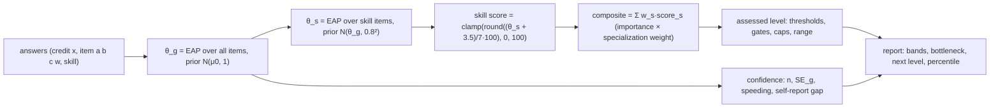

# 07 — Scoring Formulas

> Scope: the exact math that turns a session's answers into θ estimates, skill scores, a composite, an ASSESSED
> level, a confidence grade, strong/weak bands, a bottleneck, the next-level gap and (when real data allows) a
> percentile. Item routing is in [`06-assessment-architecture.md`](./06-assessment-architecture.md).
>
> Source of truth: decisions brief §6–§8 and §0. Where the brief is silent this document decides, marked
> **Decision:**. All functions here are pure (`src/modules/scoring/domain`, `src/modules/results/domain`): no I/O,
> deterministic, fully unit-tested. AI never takes part in any formula in this document.

---

## 0. Notation and constants

| Symbol | Meaning | Value / source |
|--------|---------|----------------|
| θ | latent ability on the logit-like scale | grid [−4, 4] |
| θ_g, SE_g | general ability posterior mean / SD | §4 |
| θ_s, SD_s | skill s ability posterior mean / SD | §5 |
| a, b, c, w | discrimination, difficulty, guessing, likelihood weight of an item | 06 §2.1 |
| x | credit of a response, x ∈ [0, 1] | 06 §2.2 |
| D | logistic scaling constant | 1.7 |
| μ0 | prior mean of θ_g from `experience` | `0`→−1.0, `lt1`→−0.6, `1to3`→0.0, `3to5`→0.4, `5plus`→0.8 |
| σ0 | prior SD of θ_g | 1.0 |
| τ | SD of θ_s around θ_g | 0.8 |
| grid | quadrature points | θ_k = −4 + 0.05k, k = 0..160 (161 points) |
| `scoring_model_version` | identifier of everything in §1–§9 | `"irt2pl-eap-hier-v1"` (brief §6) |

---

## 1. Pipeline



`scoreAssessment(input) → {scoringModelVersion, ability, assignment, confidence, speedingRatio, selfReportGap}`; then
`buildReport(...)` (results module) adds bands, bottleneck, next level and plans. Both are stored once at finalization
and never recomputed on read.

---

## 2. Item response function (3PL with fixed c)

```
P_i(θ) = c_i + (1 − c_i) / (1 + exp(−1.7 · a_i · (θ − b_i)))
```

- `b_i = (target_level − 5) × 0.7` unless recalibrated (06 §10.4).
- `c_i = 1/num_options` for single-best knowledge/judgment/scenario/decision items, `0` for `self_report` and
  partial-credit items. c is **fixed** (not estimated), hence "3PL with fixed c". At θ = b, P = c + (1 − c)/2.
- Numerical guards: P is clamped to [1e−6, 1 − 1e−6]; c is clamped to [0, 0.99].

Fisher information (used by routing, 06 §5.4):

```
I_i(θ) = (1.7·a_i)² · ((P_i − c_i)² / (1 − c_i)²) · ((1 − P_i) / P_i)
```

For c = 0 this reduces to (1.7a)²·P(1 − P), maximal at θ = b with value (1.7a)²/4 = 0.7225 for a = 1.

---

## 3. Weighted fractional log-likelihood

```
ℓ_i(θ) = w_i · [ x_i · ln P_i(θ) + (1 − x_i) · ln(1 − P_i(θ)) ]
ℓ(θ)   = Σ_i ℓ_i(θ)                          (local independence given θ)
```

- x = 1 / 0.5 / 0 for best / acceptable / poor (partial credit); likert steps in between.
- w = 1 by default, 0.5 for `self_report`: a self-rating moves θ half as much as a tested answer.
- Credit is clamped to [0, 1]; a non-finite or negative w counts as 0.
- For fixed θ, ℓ is linear in x, so more credit never lowers θ̂ (monotonicity; property-tested).

---

## 4. General ability θ_g — EAP on the grid

```
log π(θ_k) = −½ · ((θ_k − μ0)/σ0)² + ℓ(θ_k)                k = 0..160
w_k        = exp(log π(θ_k) − max_j log π(θ_j)) / Σ_j exp(log π(θ_j) − max_j log π(θ_j))   (log-sum-exp)
θ_g        = Σ_k θ_k · w_k
SE_g       = sqrt( Σ_k (θ_k − θ_g)² · w_k )
```

- With no answers θ_g = μ0 and SE_g ≈ 1.0 (the discretized prior).
- The estimate is bounded by the grid (−4..4), so all-correct or all-wrong patterns stay finite. EAP is used instead
  of maximum likelihood for this reason.

### 4.1 Mini numeric demo (computed with the production code)

Prior `1to3` → N(0, 1). Items (a = 1):

| # | Item | b | c | x | θ_g after | SE_g after | score(θ_g) |
|---|------|---|---|---|-----------|------------|------------|
| 0 | — (prior) | | | | 0.000 | 1.000 | 50 |
| 1 | knowledge, 4 options, correct | 0.0 | 0.25 | 1 | 0.338 | 0.940 | 55 |
| 2 | scenario, partial credit, "acceptable" | 0.7 | 0 | 0.5 | 0.462 | 0.766 | 57 |
| 3 | knowledge, 4 options, wrong | 1.4 | 0.25 | 0 | 0.288 | 0.705 | 54 |

Item 1 (c = 0.25) moves θ less than a c = 0 item would, because a correct answer could be a guess. The partial-credit
item shrinks SE more (0.940 → 0.766) than item 3 does (0.766 → 0.705). That matches its higher information at θ ≈ 0.4
(0.677 vs 0.120, 06 §5.4).

---

## 5. Skill abilities θ_s — hierarchical prior

For each skill s with n_s ≥ 1 answered items:

```
θ_s, SD_s = EAP over ONLY skill s's items, prior N(θ_g, τ²), τ = 0.8      (same grid and formulas as §4)
measured_s = true
```

For a skill with n_s = 0:

```
θ_s = θ_g,   SD_s = sqrt(SE_g² + τ²),   measured_s = false   → UI label "Bevosita oʻlchanmagan" / "Не измерялся напрямую" / "Not directly measured"
```

- Shrinkage: one item barely moves a skill away from θ_g; several consistent items pull it away. This is the
  intended protection against "one lucky answer = strong skill".
- **Decision:** this two-stage empirical-Bayes form (θ_g from all items, then the skill posterior with θ_g plugged in)
  is the production model of `irt2pl-eap-hier-v1`, exactly as the brief specifies. The exact joint posterior in
  `hierarchical.ts` is kept for calibration studies only and is not used for stored results.
- Unmeasured skills are excluded from "strongest skill" (02 AC-F11-03) and from the bottleneck tie-break advantage
  (measured skills win ties, §11).

---

## 6. Score mapping

```
score(θ)      = clamp(round((θ + 3.5) / 7 × 100), 0, 100)     θ = −3.5 → 0, 0 → 50, 3.5 → 100
θ(score)      = score / 100 × 7 − 3.5                          (inverse, unrounded)
SE_points(se) = 100 / 7 × se ≈ 14.29 × se
```

Skill scores are stored as integers (`skill_scores.score`), θ and SE unrounded (`numeric`).
Level thresholds of the default scheme sit at band edges θ = (L − 5.5) × 0.7: Level 4 at θ = −1.05 → score 35.

---

## 7. Composite and specialization multipliers

```
raw_s       = skills.importance_s × specialization_skill_weights(spec, s)     (missing weight = 1; 0 removes s)
w_s         = raw_s / Σ_t raw_t                                               (all raw = 0 → equal weights)
composite   = round1( Σ_s w_s × score_s )                                     over skills with a score
composite_se = round1( 100/7 × SE_g )                                         (01 §7.3 Decision)
```

- **No goal boost** in the composite (06 §4.4). The same answers give the same composite whatever goal was stated.
- Unmeasured skills keep their θ_g-based score inside the composite with full weight. Their uncertainty shows up in
  confidence (`unmeasured_skills` reason), not by dropping them.
- `report.meta.weights = [{skillId, importance, specializationWeight}]` snapshots the weights used, so a result
  explains itself after catalog edits.

---

## 8. Level assignment

### 8.1 Data

`levels` (profession scheme or default): `number`, `min_composite`, `requires_verification`.
`level_requirements`: `composite_min | skill_min | verified_scenario | practical_action | experience_min`,
`threshold`, `gates_assessed`.

Default scheme (brief §7): 1 Starter 0 · 2 Beginner 15 · 3 Developing 25 · 4 Practitioner 35 · 5 Professional 45 ·
6 Advanced 55 · 7 Expert 65 · 8 Leader 75 (verification) · 9 Master 85 (verification).

### 8.2 Algorithm

```
sorted   = levels by number asc (Level 1 = floor, always met; its own requirements never block)
gatesOk  = true
for i, L in sorted:
   if i > 0: gatesOk = gatesOk ∧ ∀ r ∈ req(L) with gates_assessed: met(r)
   met[L]  = (i = 0) ∨ (composite ≥ L.min_composite ∧ gatesOk)          // cumulative gates of all levels ≤ L
uncapped = highest L with met[L]

verificationCap = highest L ≤ uncapped with ¬L.requires_verification      // 8, 9 are never ASSESSED
experienceCap   = config.experienceCaps[experience]  (e.g. {"0": 4, "lt1": 5}); none → ∞
assessed        = min(uncapped, verificationCap, highest L ≤ experienceCap)
cappedBy        = null | "experience" | "verification"      (tie → "experience": the person-specific cap the UI must explain)

met(r): composite_min → composite ≥ t;  skill_min → score_s ≥ t (missing score = unmet);
        experience_min → years(experience) ≥ t with years 0/0.5/1/3/5;
        verified_scenario / practical_action → verified counts ≥ t (null t → 1)
comparison tolerance 1e−9
```

- Verified counts never lift the verification cap: the VERIFIED level is a separate badge from
  `verification_attempts` (brief §7).
- `level_scores` stores, per level, `met` and `missing` (each unmet requirement with current value and threshold).

### 8.3 Boundary range

The range uses the composite SE, and per-skill SE for skill gates (`SE_points(SD_s)`, default `composite_se`):

```
next = L + 1, prev = L − 1
upperPlausible = next exists ∧ next not blocked by a cap
               ∧ next.min_composite − composite ≤ composite_se
               ∧ every unmet gating composite_min/skill_min of next is within its margin (score + margin ≥ t)
               ∧ every other gating requirement of next is met
range = [L, L+1]    if upperPlausible
      = [L−1, L]    else if prev exists ∧ composite − L.min_composite < composite_se
      = null        otherwise
```

Display (02 D16): the badge keeps the single assessed level; the line below reads "Ehtimoliy oraliq: LEVEL 4–5" /
«Вероятный диапазон: LEVEL 4–5» / "Likely range: LEVEL 4–5". Share cards always use the single level.

Calibration note: with default item parameters, composite_se ≈ 5.7–7 points, so results within about 6 points of a
boundary show a range. That is the literal brief rule; narrowing it requires calibrated items, not a formula change.

---

## 9. Confidence

### 9.1 Rules

```
base = HIGH    if n ≥ 12 ∧ SE_g ≤ 0.35
       MEDIUM  if n ≥ 8  ∧ SE_g ≤ 0.55
       LOW     otherwise
speeding        = (#timed items with response_ms < 2500) / (#timed items) > 0.30
self_report_gap = gap > 0.45            (gap defined in 9.2; null when no self_report or no tested item)
confidence      = base − [speeding] − [self_report_gap]       (one step each, floor LOW)
```

The brief's HIGH condition "self-report consistency ok" is expressed through the downgrade. A HIGH base with a
self-report gap becomes MEDIUM.

### 9.2 Self-report consistency gap

The brief says "|self-report credit − knowledge credit| > 0.45". **Decision (interpretation):** "knowledge credit"
is the credit that the person's tested answers **predict** for those same self-report items, not the raw mean of
tested credits. Adaptive routing aims every tested item at about 50–65 % success for everyone, so a raw mean
comparison would measure item targeting instead of honesty, and it would flag honest respondents.

```
θ̂_g'  = EAP over tested (non-self_report) items only, prior N(μ0, 1)
θ̂_s'  = EAP over tested items of skill s, prior N(θ̂_g', τ²)   (θ̂_g' if s has no tested item)
gap    = | mean_{i ∈ SR} x_i − mean_{i ∈ SR} P_i(θ̂_{s(i)}') |      ∈ [0, 1]
```

Example: a self-report item with a = 0.5, b = 0, c = 0, tested ability θ̂' = 0.3 → expected credit 0.563. A self-rating
of 1.0 gives gap 0.437 (no downgrade). If tested ability were −1.5, expected ≈ 0.22 → gap 0.78 → downgrade.

### 9.3 Reasons and copy

`assessment_results.confidence_reasons` (ordered): `few_items` (n < 12), `high_uncertainty` (SE_g > 0.35), `speeding`,
`self_report_gap`, `near_boundary` (range reported; informational), `unmeasured_skills` (≥ 1 skill of at least
average weight unmeasured; informational). Only the first four can lower the grade.

| Reason | uz | ru | en |
|--------|----|----|----|
| `few_items` | Savollar soni kam boʻldi. | Вопросов было немного. | Only a few questions were answered. |
| `high_uncertainty` | Oʻlchov xatosi hali yuqori. | Погрешность измерения пока высокая. | Measurement error is still high. |
| `speeding` | Baʼzi savollarga juda tez javob berildi. | На часть вопросов ответы были даны очень быстро. | Some questions were answered very quickly. |
| `self_report_gap` | Oʻzingizga bergan baho test javoblaringizdan sezilarli farq qiladi. | Ваша самооценка заметно расходится с ответами на тест. | Your self-ratings differ noticeably from your test answers. |
| `near_boundary` | Natijangiz ikki daraja chegarasiga yaqin. | Ваш результат близок к границе двух уровней. | Your result is close to the boundary between two levels. |
| `unmeasured_skills` | Baʼzi muhim koʻnikmalar bevosita oʻlchanmadi. | Некоторые важные навыки не измерялись напрямую. | Some important skills were not measured directly. |

Confidence line. The MEDIUM uz text is the brief's copy verbatim; the confidence label stays in English in every
locale, as in the brief:

| Grade | uz | ru | en |
|-------|----|----|----|
| HIGH | Bu dastlabki baholash. Level {n} natijangiz High Confidence. Amaliy topshiriq orqali uni tasdiqlashingiz mumkin. | Это предварительная оценка. Ваш результат Level {n} — High Confidence. Подтвердить его можно реальным практическим заданием. | This is a preliminary assessment. Your Level {n} result has High Confidence. You can verify it with a real practical task. |
| MEDIUM | Bu dastlabki baholash. Level {n} natijangiz Medium Confidence. Real amaliy topshiriq orqali aniqlikni oshirish mumkin. | Это предварительная оценка. Ваш результат Level {n} — Medium Confidence. Точность можно повысить с помощью реального практического задания. | This is a preliminary assessment. Your Level {n} result has Medium Confidence. A real practical task can increase its accuracy. |
| LOW | Bu dastlabki baholash. Level {n} natijangiz Low Confidence. Natijani aniqlashtirish uchun testni keyinroq shoshilmasdan qayta topshiring yoki real amaliy topshiriqni bajaring. | Это предварительная оценка. Ваш результат Level {n} — Low Confidence. Чтобы уточнить его, пройдите тест позже без спешки или выполните реальное практическое задание. | This is a preliminary assessment. Your Level {n} result has Low Confidence. To sharpen it, retake the test later without rushing, or complete a real practical task. |

LOW results list their reasons under the line (03 §S10 row 1).

---

## 10. Strong / weak bands

With `t_s` = the `skill_min` threshold of skill s at level L+1 (absent → undefined):

```
weak   if score_s < 40  ∨ (t_s defined ∧ score_s < t_s)
strong if score_s ≥ max(60, t_s ?? 0)
ok     otherwise
```

UI labels (02 D17): strong "Kuchli" / «Сильная сторона» / "Strong"; ok "Meʼyorda" / «В норме» / "On track"; weak
"Eʼtibor kerak" / «Требует внимания» / "Needs attention". Bands are text + colour, never colour alone.
Strongest list: non-weak skills (all skills if every skill is weak), measured first, score desc, importance desc,
excluding the bottleneck. Weakest list: weak skills (else ok), measured first, score asc, importance desc.

---

## 11. Bottleneck (leverage, dependency graph, prerequisite-first)

### 11.1 Graph

`skill_prerequisites(skill_id, depends_on_skill_id, relation, strength ∈ [0,1])`, read as directed edges:
- `limits` X → Y: a weak X caps the value of a strong Y (e.g. systemization limits sales).
- `prerequisite` X → Y: learn X before Y.
- `enables`: informational only (roadmap copy); not used in formulas.
Each edge may carry a `rationale` i18n text that becomes the explanation.

### 11.2 Leverage

For every weak skill w (`importance(w)` = `importance × specialization weight`, unnormalized, as in §7 `raw_w`):

```
target(w)    = max(40, t_w ?? 40)                          // the weak-band boundary for w
gapTerm(w)   = importance(w) × max(0, target(w) − score(w)) / 100
limitsTerm(w)= Σ_{edges w →limits y} strength(w,y) × max(0, score(y) − score(w)) / 100
leverage(w)  = gapTerm(w) + limitsTerm(w)
```

`gap_to_next` in the brief formula is `max(0, target − score)/100`, on the same 0–1 scale as the limits term.

### 11.3 Selection

```
weak  = skills with band = weak and a score; if ∅ → no bottleneck (copy result.bottleneck.none)
best  = argmax leverage   (ties: measured first, importance desc, skill id asc)
// prerequisite-first (transitive): while some unvisited weak w has a prerequisite path w → … → best
// (the path may pass through non-weak skills), move best to the best-ranked such w
reason = prerequisite_of_weak   if the walk moved
       | limits_strong_skills   else if Σ contributions to NON-weak limited skills > gapTerm(best)
       | prerequisite_of_weak   else if best is a prerequisite ancestor of other weak skills
       | largest_gap            otherwise
limited = non-weak targets of best's limits edges with contribution > 0 (largest first)
unlocks = weak skills downstream of best via prerequisite edges, in prerequisite (topological) order
```

Explanation = the rationale of the dominant edge if present, else the reason template:
- `limits_strong_skills` uz: "Kuchli tomonlaringiz ({limited}) «{skill}» koʻnikmasi tufayli cheklanib qolmoqda. Bu koʻnikmani rivojlantirsangiz, mavjud salohiyatingiz toʻliq ochiladi."
- `prerequisite_of_weak` uz: "«{skill}» — {unlocks} uchun poydevor. Avval shu koʻnikmadan boshlang: keyingi koʻnikmalar uning ustiga quriladi."
- `largest_gap` uz: "«{skill}» koʻnikmasida keyingi darajagacha boʻlgan farq, uning ahamiyatini hisobga olganda, eng katta. Shu farqni yopish sizni eng tez oldinga olib chiqadi."

When the bottleneck is not the lowest-scoring skill, the report adds `result.bottleneck.whyNotLowest`
(03 §S10 row 8), e.g. uz: "Eng past ball — «{lowest}», lekin «{skill}» ni yaxshilash koʻproq natija beradi: {reason}".

---

## 12. Next level and gap

```
next             = L + 1 (none at L = 9 or if undefined)
requirements     = level_requirements(next) (+ implicit "≥ 1 verified scenario" if next.requires_verification and
                   no explicit one), each with {type, skillId, threshold, current, met, gatesAssessed}
compositeGap     = round1(max(0, next.min_composite − composite))
blockedBy        = ["experience"] if next > experienceCap; ["verification"] if next requires verification
                   and no verified scenario exists
skill gap (row)  = max(0, threshold − current)
```

**Decision (ordering of "what is missing", max 3):** first the bottleneck's row, then rows of its `unlocks` in
prerequisite order, then the remaining unmet rows by leverage desc. This keeps the list consistent with the
prerequisite-first rule and the 7-day plan.

Copy: "Umumiy ball: {composite} / {min}" when compositeGap > 0; verification-only next level: "LEVEL 8 faqat amaliy
tasdiqlash orqali beriladi. Bu imkoniyat hozircha mavjud emas." (02 F12); experience cap: "Tajriba darajangiz
boʻyicha test natijasi LEVEL {cap} bilan cheklanadi."

---

## 13. "Do not do now" rules

`do_not_rules.condition = {max_level?, min_level?, weak_skills?: [slug], goal_types?: [goal]}`.
**Decision:** a rule fires iff `min_level ≤ assessed ≤ max_level` (missing bound = open) ∧ (no `weak_skills` ∨ **any**
listed skill is weak) ∧ (no `goal_types` ∨ goal ∈ goal_types). Max 3 shown, ordered by the bottleneck's skill first,
then rule `sort_order`. `why.source_ids` lists only verified sources. With none, the limitation reads "Yetarli
ishonchli maʼlumot mavjud emas." / «Недостаточно достоверных данных.» / "Not enough reliable information."

---

## 14. Percentile policy

- Shown only from a real `benchmarks` row: `metric = 'composite'`, same `profession_id` (and `specialization_id`, else
  profession-level), same `scoring_model_version`, `window_days = 90`, `sample_size ≥
  app_settings.benchmark_min_sample` (default 1000), `computed_at` within the last 7 days. Otherwise nothing is
  shown: no placeholder and no estimate.
- **Decision (population):** the first completed result per user per (profession, specialization) inside the
  window; excluded: integrity-flagged results (06 §7), admin/test users, merged duplicate identities, results of
  another `scoring_model_version`.
- `percentiles` jsonb = composite cut points `{"p1": …, "p99": …}`, computed nightly with `percentile_cont`.
  User percentile = `max{p ∈ 1..99 : cut_p ≤ composite}`; below p1 → not shown.
- **Decision:** percentiles appear only on the unlocked report for the owner, never on share cards or public pages
  (share card fields are fixed by brief §10), and are not shown below the 25th percentile
  (`app_settings.benchmark_min_display_percentile = 25`), so the product never shames.
- Copy format (numbers are placeholders, not data):
  - uz: "Oxirgi 90 kun ichida ushbu testni yakunlagan 12,430 foydalanuvchi orasida 73-percentile."
  - ru: «Среди 12 430 пользователей, прошедших этот тест за последние 90 дней: 73-й перцентиль.»
  - en: "73rd percentile among 12,430 users who completed this test in the last 90 days."
  The sample size and window always come from the row.

---

## 15. Worked example (a) — Entrepreneur, Level 4 Practitioner, bottleneck Systemization

Illustrative content (the real entrepreneur seed has 8–11 skills; six are used here). Specialization
`small_business_owner`. Context: `experience = 3to5` (no cap), `working = yes`, `goal = scale_business`.
n = 12 answered items, SE_g = 0.40, no speeding, one self-report item with gap 0.21.

### 15.1 Scores and weights

| Skill | importance | spec weight | raw_s | w_s | score | θ_s = score·0.07 − 3.5 |
|-------|-----------|-------------|-------|-----|-------|------------------------|
| Sales | 0.90 | 1.00 | 0.90 | 0.1768 | 81 | 2.17 |
| Customer (service) | 0.70 | 1.00 | 0.70 | 0.1375 | 74 | 1.68 |
| Marketing | 0.80 | 1.00 | 0.80 | 0.1572 | 72 | 1.54 |
| Finance | 0.90 | 1.10 | 0.99 | 0.1945 | 39 | −0.77 |
| Systemization | 0.80 | 1.25 | 1.00 | 0.1965 | 31 | −1.33 |
| Management | 0.70 | 1.00 | 0.70 | 0.1375 | 48 | −0.14 |
| Σ | | | 5.09 | 1.0000 | | |

```
composite = (0.90·81 + 0.70·74 + 0.80·72 + 0.99·39 + 1.00·31 + 0.70·48) / 5.09 = 285.51 / 5.09 = 56.09 → 56.1
composite_se = round1(100/7 × 0.40) = 5.7
```

### 15.2 Level

Illustrative requirements: L4 gates `sales ≥ 35`, `finance ≥ 30`, `systemization ≥ 25` (all met). L5 gates
`finance ≥ 45` ✗ (39), `systemization ≥ 45` ✗ (31), `management ≥ 45` ✓ (48).

| L | min | composite ≥ min | cumulative gates | met |
|---|-----|-----------------|------------------|-----|
| 4 | 35 | ✓ | ✓ | ✓ |
| 5 | 45 | ✓ | ✗ (finance, systemization) | ✗ |
| 6 | 55 | ✓ (56.1) | ✗ | ✗ |

Assessed = **Level 4 Practitioner**. The composite alone would reach Level 6. Strong sales do not compensate for a
broken operations base, which is exactly what gates are for.
Range: L5 needs systemization 31 + 7.4 (SD_s 0.52 → 7.4 points) = 38.4 < 45 → no upper range; 56.1 − 35 = 21.1 ≥ 5.7 →
no lower range → **single Level 4**.
Confidence: n = 12 ≥ 12, but SE_g 0.40 > 0.35 → base MEDIUM; no downgrades → **MEDIUM**, reasons
`[high_uncertainty]`. Line: "Bu dastlabki baholash. Level 4 natijangiz Medium Confidence. Real amaliy topshiriq orqali
aniqlikni oshirish mumkin."

### 15.3 Bands (L+1 = 5 thresholds: finance 45, systemization 45, management 45)

Sales 81, Customer 74, Marketing 72 → **strong**; Management 48 → **ok** (≥ 45, < 60); Finance 39, Systemization 31 →
**weak**.

### 15.4 Leverage

Edges (illustrative content): systemization →limits sales 0.6, customer 0.5, marketing 0.4, management 0.3;
finance →limits marketing 0.3, sales 0.2. No prerequisite edge between finance and systemization.

```
Systemization: gapTerm = 1.00 × (45 − 31)/100 = 0.140
               limits  = 0.6·(81−31)/100 + 0.5·(74−31)/100 + 0.4·(72−31)/100 + 0.3·(48−31)/100
                       = 0.300 + 0.215 + 0.164 + 0.051 = 0.730
               leverage = 0.870
Finance:       gapTerm = 0.99 × (45 − 39)/100 = 0.0594
               limits  = 0.3·(72−39)/100 + 0.2·(81−39)/100 = 0.099 + 0.084 = 0.183
               leverage = 0.2424
```

Bottleneck = **Systemization**, reason `limits_strong_skills` (0.730 to non-weak skills > gapTerm 0.140),
limited = [Sales, Customer, Marketing, Management]. Explanation (edge rationale, uz): "Sotuv talab yaratadi, lekin
ichki jarayonlar takrorlanuvchan emas — buyurtmalar oshgani sari xatolar va kechikishlar ham oshadi."
en: "Sales generate demand, but internal processes are not repeatable."

**Why not "the lowest score":** Systemization is also the lowest here, but that is not why it was chosen. Counterfactual:
Finance 28 (now the lowest), everything else equal:

```
Finance:       gapTerm = 0.99 × 17/100 = 0.1683; limits = 0.3·44/100 + 0.2·53/100 = 0.238; leverage = 0.4063
Systemization: unchanged 0.870
```

Systemization still wins, and the report adds `whyNotLowest`: fixing Finance would raise one score, while fixing
Systemization releases the value of four already-strong skills.

**Why not Marketing:** Marketing (72) is strong, so it is not a candidate. Its gapTerm would be 0 (72 ≥ 45) and it
has no outgoing `limits` edges. More marketing would push more demand into a process that already fails under
load. The do-not rule (`weak_skills: [systemization]`, `max_level: 5`) fires: uz "Hozircha reklama byudjetini
oshirmang." — reason "Talab oshsa, tizimsiz jarayonlar koʻproq kechikish va mijoz yoʻqotishga olib keladi." The
source list is empty, so the limitation reads "Yetarli ishonchli maʼlumot mavjud emas."

Next level (5): compositeGap 0; missing: Systemization 31 / 45 (gap 14), Finance 39 / 45 (gap 6).

---

## 16. Worked example (b) — Backend developer, Level 3, prerequisite ordering

Profession `software_developer`, specialization `backend` (weights: SQL ×1.2, API design ×1.3). Context:
`experience = lt1` (cap 5, not binding), `working = learning`, `goal = find_job`. n = 12, SE_g = 0.47, 4 of 12 timed
items < 2.5 s.

### 16.1 Scores and composite

| Skill | importance | spec | raw_s | w_s | score |
|-------|-----------|------|-------|-----|-------|
| Programming fundamentals | 1.00 | 1.0 | 1.00 | 0.1582 | 50 |
| Debugging | 0.70 | 1.0 | 0.70 | 0.1108 | 46 |
| HTTP basics | 0.60 | 1.0 | 0.60 | 0.0949 | 42 |
| Git | 0.60 | 1.0 | 0.60 | 0.0949 | 33 |
| SQL | 0.90 | 1.2 | 1.08 | 0.1709 | 30 |
| REST API design | 0.80 | 1.3 | 1.04 | 0.1646 | 34 |
| Testing | 0.70 | 1.0 | 0.70 | 0.1108 | 27 |
| Architecture (system design) | 0.60 | 1.0 | 0.60 | 0.0949 | 42 |
| Σ | | | 6.32 | 1.0000 | |

```
composite    = 239.06 / 6.32 = 37.83 → 37.8
composite_se = round1(100/7 × 0.47) = 6.7
```

### 16.2 Level

Illustrative requirements: L3 gate `fundamentals ≥ 35` ✓. L4: gates `sql ≥ 40` ✗, `git ≥ 40` ✗; non-gating
`api_design ≥ 35`, `testing ≥ 30`.
L4: composite 37.8 ≥ 35 ✓ but gates ✗ → not met. Assessed = **Level 3 Developing** (`cappedBy = null`).
Range: SQL 30 + 7.9 (SD_s 0.55) = 37.9 < 40 → no upper range; 37.8 − 25 = 12.8 ≥ 6.7 → none.
Confidence: base MEDIUM (n = 12, SE 0.47 ≤ 0.55). Speeding 4/12 = 0.33 > 0.30 → **LOW**; reasons
`[high_uncertainty, speeding]`.

### 16.3 Bands (L4 thresholds: SQL 40, Git 40, API 35, Testing 30)

Weak: Git 33, SQL 30, API design 34, Testing 27. Ok: fundamentals 50, debugging 46, HTTP 42, architecture 42. Strong:
none (the strongest list falls back to the best non-weak skills: fundamentals, debugging, HTTP/architecture).

### 16.4 Leverage and prerequisite-first

Edges: fundamentals →prereq git; **git →prereq sql (0.5)**; **sql →prereq api_design (0.8)**; http →prereq api_design;
**api_design →prereq testing (0.6)**; sql →limits api_design 0.5; testing →limits debugging 0.3; api_design →limits
architecture 0.4.

| Weak skill | gapTerm | limitsTerm | leverage |
|------------|---------|------------|----------|
| Testing | 0.70 × 13/100 = 0.091 | 0.3 × 19/100 = 0.057 | **0.148** |
| SQL | 1.08 × 10/100 = 0.108 | 0.5 × 4/100 = 0.020 | 0.128 |
| API design | 1.04 × 6/100 = 0.0624 | 0.4 × 8/100 = 0.032 | 0.0944 |
| Git | 0.60 × 7/100 = 0.042 | 0 | 0.042 |

Walk: argmax = Testing → weak prerequisite ancestors of Testing = {API design, SQL, Git}; best-ranked = SQL (0.128) →
weak ancestors of SQL = {Git} → **Git**; no weak ancestor of Git → stop.
Bottleneck = **Git**, reason `prerequisite_of_weak`, unlocks = **[SQL, REST API design, Testing]** (topological
order). The order Git → SQL → REST API → Testing drives "what is missing", the 7-day plan (day 1–2 Git
foundations) and the 30-day roadmap (W1 foundation gap = Git + SQL basics). Highest raw leverage (Testing) is
deliberately **not** first: testing endpoints is premature when there is no API design and no SQL to test against.

uz explanation: "«Git» — SQL, REST API dizayni va Testlash uchun poydevor. Avval shu koʻnikmadan boshlang: keyingi
koʻnikmalar uning ustiga quriladi."

Do-not rule: `{max_level: 4, weak_skills: [sql, api_design]}` fires → uz "Hozircha murakkab mikroservis arxitekturasini
oʻrganishga kirishmang." reason "SQL va REST API asoslari mustahkam boʻlmasa, mikroservislar murakkabligi
oʻrganishni sekinlashtiradi. Avval bitta servisni toʻgʻri qurishni oʻrganing." (no verified source → limitation
"Yetarli ishonchli maʼlumot mavjud emas."). en: "Do not start advanced microservices yet."

Next level (4): compositeGap 0 (composite already ≥ 35); missing, in §12 order: Git 33 / 40, SQL 30 / 40, API design
34 / 35, Testing 27 / 30.

---

## 17. Versioning and re-scoring policy

### 17.1 What `scoring_model_version` covers

Everything in §2–§9: IRT function and D, likelihood, grid, prior means/SD, τ, score mapping, composite and composite SE,
level algorithm (incl. caps and range), confidence thresholds, speeding thresholds and the self-report gap. Bump the
version (`irt2pl-eap-hier-v1` → `…-v2`) for **any** change that could alter any stored field for the same answers.

Not covered (separately versioned and snapshotted in `report.meta`): level thresholds/requirements and weights
(content, snapshotted as `levelScheme`, `weights`, `contentVersion`), banding/bottleneck/next-level/do-not logic
(`reportGeneratorVersion`), plans (`plannerVersion`), item parameters (question versions, `question_versions`).

### 17.2 Rules

1. **Never silently change historical results.** `assessment_results`, `skill_scores` and `level_scores` are
   immutable (DB guard). The version string is written at finalization.
2. The template pins `scoring_model_version`. A new version reaches users only through a new template version
   (optionally an experiment). In-progress sessions finish with the version they started with.
3. A scorer registry `scorers[version]` keeps **every** version that any stored result references. CI re-scores
   golden fixtures plus a sample of stored answer sets per version and asserts byte-identical output.
4. **Model improvements** do not re-score history. Comparisons between results of different versions show both
   values with: "Baholash usuli yangilangan — natijalar bevosita solishtirilmaydi." / «Методика оценки обновлена —
   результаты нельзя сравнивать напрямую.» / "The scoring method was updated — results are not directly comparable."
5. **Material bug** (a stored level or confidence is wrong under the version's own definition): fix it as a new
   version; run an offline re-score that writes **shadow rows** (**Decision:** table `result_rescores(result_id,
   scoring_model_version, payload jsonb, reason, created_at)`, owned by 04) and an `audit_logs` entry. If the level
   changes, the owner sees a dated notice on the result page with both values. Unlocks and payments are unaffected.
   Share cards keep their payload until the user regenerates them. `level_history` gets a new row; old rows are
   never edited.
6. Benchmarks and percentiles are computed per version (§14). They never mix versions.

---

## 18. Golden test vectors

| Case | Input | Expected |
|------|-------|----------|
| Prior only | μ0 = 0, no items | θ_g = 0.000, SE_g = 1.000, score 50 |
| §4.1 | 3 items | θ_g 0.338 / 0.462 / 0.288; SE 0.940 / 0.766 / 0.705 |
| Fisher | θ = 0.4, a = 1: (b 0, c .25), (b .7, c 0), (b 1.4, c .25) | 0.429, 0.677, 0.120 |
| Example (a) | §15 scores/weights/edges | composite 56.1; Level 4; MEDIUM; bottleneck systemization 0.87 `limits_strong_skills` |
| Example (a′) | Finance 28 | bottleneck still systemization; finance leverage 0.4063 |
| Example (b) | §16 | composite 37.8; Level 3; LOW (speeding); bottleneck git, unlocks [sql, api_design, testing] |
| Verification cap | composite 90, all gates met | Level 7, `cappedBy = verification` |
| Experience cap | experience `0`, composite 50 | Level 4, `cappedBy = experience` |
| Percentile | sample 999 / 1000 | hidden / shown |

---

## 19. Alignment notes

| Topic | This document | Elsewhere | Action |
|-------|---------------|-----------|--------|
| Model version string | `irt2pl-eap-hier-v1` (brief §6) | code `SCORING_MODEL_VERSION = "irt3pl-eap-hier-v1"` | Code constant aligns to the brief before the first production result. |
| Confidence reason keys | `few_items, high_uncertainty, speeding, self_report_gap, near_boundary, unmeasured_skills` (code) | 04 example `n_lt_12`, `boundary_range` | 04 example aligns to the code keys. |
| "What is missing" order | bottleneck → unlocks (prerequisite order) → leverage | 02 F12 "ordered by leverage" | 02 reads it as leverage with the prerequisite-first rule. |
| Percentile display floor | ≥ 25th, owner-only, never on cards | — | 02 F10 / sharing align. |
| `result_rescores` table | proposed | not in 04 | 04 adds it when the first re-score is needed (not MVP). |
