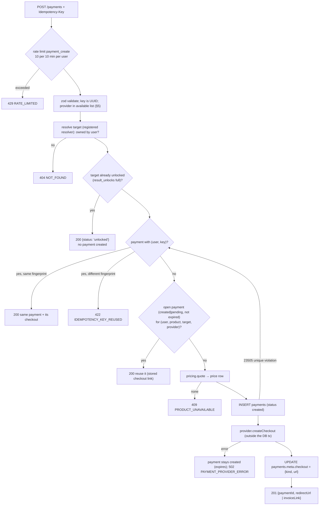
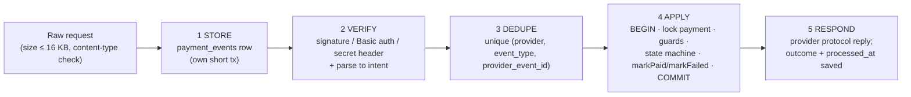
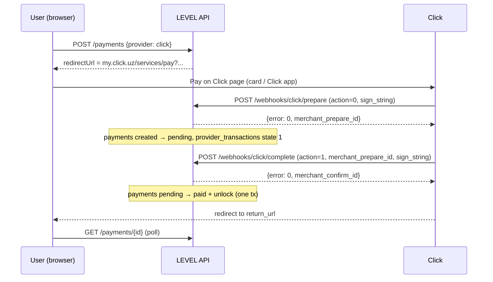
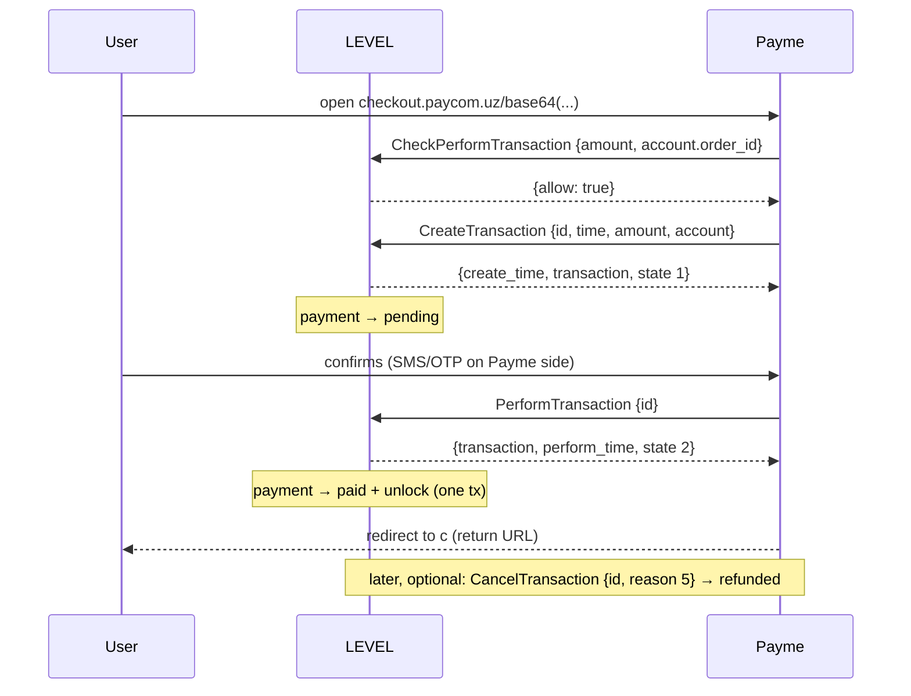

# 08 — Payment Architecture

> LEVEL — "Know where you are. Know what's next. Prove your growth."
> Status: design baseline for Phase 5 (payments + unlocks). The Decisions Brief §9 is the source of truth. This document
> refines it into an implementable design and stays consistent with `01-architecture.md` (module API, routes, cron,
> env), `02-mvp-spec.md` (F09, §7 pricing ladder, D14/D15), `03-user-flows.md` (S09) and `04-database-erd.md` (§7
> tables, §13 payment integrity SQL). Where those documents are silent, choices are marked **Decision:** and repeated in
> the [decision log](#18-decision-log-for-cross-document-alignment).
>
> **Provider protocol details** (§10–§12) are written from the providers' public merchant documentation as the author
> knows it. Every item tagged **[verify]** must be checked against the provider's current documentation and sandbox
> before go-live. Nothing tagged **[verify]** may be relied on in production code until a sandbox test proves it.

---

## Contents

1. [Scope and invariants](#1-scope-and-invariants)
2. [Module layout](#2-module-layout)
3. [Provider abstraction](#3-provider-abstraction)
4. [Products, prices and quotes](#4-products-prices-and-quotes)
5. [Channel → provider availability](#5-channel--provider-availability)
6. [Payment state machine](#6-payment-state-machine)
7. [Idempotency and concurrency](#7-idempotency-and-concurrency)
8. [PAID + unlock in one transaction](#8-paid--unlock-in-one-transaction)
9. [Webhook processing pipeline](#9-webhook-processing-pipeline)
10. [Click SHOP API](#10-click-shop-api)
11. [Payme Merchant API](#11-payme-merchant-api)
12. [Telegram Stars](#12-telegram-stars)
13. [Return, polling and client UX](#13-return-polling-and-client-ux)
14. [Expiry, reconciliation and refunds](#14-expiry-reconciliation-and-refunds)
15. [Fraud, replay and abuse prevention](#15-fraud-replay-and-abuse-prevention)
16. [Unit economics](#16-unit-economics)
17. [Test strategy](#17-test-strategy)
18. [Decision log for cross-document alignment](#18-decision-log-for-cross-document-alignment)

---

## 1. Scope and invariants

MVP sells one product: `full_report` (target `assessment_result`, default price 1,000 UZS = `amount_minor 100000`,
taken from the `prices` table, never from code). The architecture already carries `deep_report`,
`verification_attempt` and `growth_os_monthly` (inactive until their phases).

Invariants (each one has an automated test in §17 and, where it can drift in production, an integrity counter from
02 §3.3):

| # | Invariant | Enforced by |
|---|-----------|-------------|
| I1 | The client never decides payment status, amount, currency or unlock | Route handlers accept only `{productSlug, targetType, targetId, provider}` + `Idempotency-Key`; status read via `GET /payments/{id}`; client callbacks (`openInvoice`, return URL params) are hints only |
| I2 | Amount and currency always come from the server price row | `payments_guard_insert` trigger (amount/currency/product equal `prices` row) |
| I3 | Every provider callback is stored once | `payment_events` UQ `(provider, event_type, provider_event_id)` |
| I4 | Callback amount equals stored `payments.amount_minor` (after unit conversion) and currency matches | Adapter normalization + pipeline guard; mismatch → `rejected`, `amount_mismatch` |
| I5 | PAID transition and `result_unlocks` insert happen in one DB transaction | `markPaid(tx)` (§8); deferred trigger `result_unlocks_verify` |
| I6 | At most one non-duplicate PAID payment per (user, product, target) | Partial unique index `payments_one_paid_per_target` |
| I7 | Only legal state transitions | `payments_guard_update` trigger (SQLSTATE `23514`) + domain `state-machine.ts` |
| I8 | Mock provider never runs in production | `env.ts` boot assertion (`APP_ENV=production` ∧ `PAYMENTS_MOCK_ENABLED=true` → crash) + availability filter |
| I9 | No secrets in the database, no card data ever touches LEVEL | Credentials in env only (01 §12); checkout happens on the provider's page / Telegram's sheet |
| I10 | No payer PII requested from providers | Stars `need_*` flags false; Payme/Click account = payment id only (04 §7 `payment_events`) |

Out of scope for MVP: recurring billing, automatic refunds through Click/Payme APIs, multi-item carts, coupons,
B2B invoicing, fiscal receipts beyond what the provider issues (see §16.4).

---

## 2. Module layout

Matches `12-folder-structure.md` (`src/modules/payments`, `src/modules/pricing`). Additions from this document are
marked ✚.

```text
src/modules/payments/
├── index.ts · contracts.ts                    # public API (01 §3.3 table), DTO zod schemas
├── domain/
│   ├── state-machine.ts                       # canTransition(from, to, actor), TRANSITIONS table (§6)
│   ├── idempotency.ts                         # request fingerprint, key validation (§7)
│   ├── fees.ts                                # providerFeeMinor(amount, config) (04 §1.6 rounding)
│   ├── provider-availability.ts               # availableProviders(ctx, configs, prices) (§5)
│   ├── money-units.ts ✚                       # toProviderAmount / fromProviderAmount per provider (§3.3)
│   └── economics.ts ✚                         # netContribution(...) pure formula (§16)
├── application/
│   ├── checkout-options.ts · create-payment.ts · get-payment-status.ts
│   ├── mark-paid.ts                           # tx: paid + unlock (§8)
│   ├── webhook-pipeline.ts ✚                  # store → verify → dedupe → apply → respond (§9)
│   ├── handle-click.ts · handle-payme.ts · handle-telegram.ts
│   ├── refund.ts · expire-stale.ts · reconcile.ts ✚
│   └── access.ts                              # isResultUnlocked, grantUnlock, entitlements
├── infrastructure/
│   ├── payments-repo.ts · provider-transactions-repo.ts · payment-events-repo.ts
│   ├── unlocks-repo.ts · entitlements-repo.ts · provider-configs-repo.ts
│   └── providers/
│       ├── provider.ts                        # PaymentProvider interface (§3)
│       ├── registry.ts ✚                      # builds the enabled provider map from env at boot
│       ├── mock.ts · click.ts · click-sign.ts ✚ · payme.ts · payme-errors.ts
│       ├── telegram-stars.ts · stripe.ts      # stripe: placeholder, throws PROVIDER_UNAVAILABLE
└── ui/ checkout-sheet.tsx · provider-button.tsx · payment-status.tsx
```

Route handlers (01 §5): `GET /api/v1/payments/options`, `POST /api/v1/payments`, `GET /api/v1/payments/{id}`,
`POST /api/v1/payments/webhooks/click/prepare`, `…/click/complete`, `…/payme`, `POST /api/v1/telegram/webhook`,
`POST /api/v1/payments/mock/{id}` (non-production), `POST /api/v1/admin/payments/{id}/refund`.

---

## 3. Provider abstraction

### 3.1 Design

Providers differ in shape: Click calls us twice with form posts, Payme drives a JSON-RPC conversation, Telegram sends
bot updates and expects an API call back within 10 s. The abstraction therefore separates three concerns:

1. **Adapter (infrastructure, per provider)** — knows the wire protocol: builds checkout links, verifies signatures,
   parses requests into normalized **intents**, and renders protocol responses. No DB access.
2. **Pipeline (application, shared)** — stores events, dedupes, locks the payment, applies the state machine, runs
   `markPaid` / `markFailed` / `markRefunded`.
3. **Protocol handler (application, per provider)** — the provider-specific *business* checks (e.g. Payme's 12 h
   timeout, Click's `merchant_prepare_id`) expressed against the pipeline's primitives.

### 3.2 TypeScript interface sketch

```ts
// src/modules/payments/infrastructure/providers/provider.ts
import type { Money } from '@/lib/money';

export type ProviderId = 'click' | 'payme' | 'telegram_stars' | 'stripe' | 'mock';
export type Channel = 'web' | 'telegram' | 'mobile';
export type PaymentStatus = 'created' | 'pending' | 'paid' | 'failed' | 'refunded';

export interface ProviderCapabilities {
  /** Provider asks us to confirm before capture (Click Prepare, Payme CreateTransaction, Stars pre_checkout_query). */
  readonly ackStep: boolean;
  /** We can trigger a refund through an API (Stars: refundStarPayment). Click/Payme: false in MVP (cabinet). */
  readonly refundApi: boolean;
  /** We can pull a transaction list for reconciliation (Stars: getStarTransactions). */
  readonly pullStatement: boolean;
  readonly subscriptions: boolean;
  /** Currencies the provider settles in (Click/Payme: UZS; Stars: XTR; Stripe: configured list). */
  readonly currencies: readonly string[];
}

export interface CheckoutInput {
  paymentId: string;              // uuid, sent to the provider as order id / payload
  amount: Money;                  // { amountMinor: bigint, currency: 'UZS' | 'XTR' | … } from the price row
  productName: string;            // localized, already resolved
  productDescription: string;
  locale: 'uz' | 'ru' | 'en' | string;
  channel: Channel;
  returnUrl: string;              // `${APP_URL}/${locale}/pay/${paymentId}` — never carries status
  expiresAt: Date;
}

export type CheckoutResult =
  | { kind: 'redirect'; url: string }          // Click, Payme, Stripe, mock
  | { kind: 'invoice_link'; url: string };     // Telegram Stars → WebApp.openInvoice(url)

/** Normalized, provider-independent meaning of an inbound callback. Produced only after verification. */
export type WebhookIntent =
  | { type: 'precheck'; paymentRef: string; amount: Money; providerTxnId?: string; payerRef?: string }
  | { type: 'ack'; paymentRef: string; amount: Money; providerTxnId: string; providerTime?: number }
  | { type: 'capture'; paymentRef: string; amount?: Money; providerTxnId: string; providerChargeId?: string }
  | { type: 'cancel'; providerTxnId: string; reason: number | null; afterCapture: boolean }
  | { type: 'refund_notice'; providerChargeId: string }
  | { type: 'query'; providerTxnId?: string; from?: number; to?: number }   // Payme CheckTransaction/GetStatement
  | { type: 'ignore' };                                                       // other bot updates, /start, …

export interface VerifiedWebhook<Raw = unknown> {
  provider: ProviderId;
  eventType: string;              // 'prepare' | 'complete' | 'CreateTransaction' | 'pre_checkout_query' | …
  providerEventId: string;        // dedupe key (§9.3)
  signatureValid: boolean;
  intent: WebhookIntent;
  raw: Raw;                       // verbatim body for payment_events.payload (04 J4)
  protocolContext: unknown;       // e.g. JSON-RPC request id, Click click_trans_id — needed to render the reply
}

export interface ApplyResult {
  outcome: 'applied' | 'duplicate' | 'rejected' | 'error';
  code: ProtocolCode;             // provider-neutral reason, mapped to a wire code by the adapter
  payment?: { id: string; status: PaymentStatus };
  providerTxn?: { id: string; state: 1 | 2 | -1 | -2; createTime: number; performTime: number;
                  cancelTime: number; reason: number | null; merchantRef: bigint | null };
  statement?: unknown[];          // Payme GetStatement rows
}

export type ProtocolCode =
  | 'ok' | 'bad_signature' | 'bad_request' | 'unknown_method' | 'payment_not_found' | 'txn_not_found'
  | 'amount_mismatch' | 'already_paid' | 'target_unlocked' | 'expired' | 'cancelled' | 'cannot_perform'
  | 'cannot_cancel' | 'busy_other_txn' | 'payer_mismatch' | 'internal';

export interface RawWebhookRequest { headers: Headers; bodyText: string; contentType: string | null }
export interface RawWebhookResponse { status: number; headers?: Record<string, string>; body: string }

export interface PaymentProvider {
  readonly id: ProviderId;
  readonly capabilities: ProviderCapabilities;

  /** True when all required env credentials are present (registry skips unconfigured providers). */
  isConfigured(): boolean;

  /** Builds the checkout link. Pure for Click/Payme/mock; Stars calls createInvoiceLink. */
  createCheckout(input: CheckoutInput): Promise<CheckoutResult>;

  /** Verifies authenticity (signature / Basic auth / secret header) and parses into an intent. Never throws on bad
   *  input: returns signatureValid=false or intent with code bad_request so the pipeline can store and answer. */
  handleWebhook(req: RawWebhookRequest): Promise<VerifiedWebhook>;

  /** Renders the provider-protocol reply for a pipeline result. Business rejections are NOT HTTP 5xx (01 §10). */
  renderResponse(webhook: VerifiedWebhook, result: ApplyResult): RawWebhookResponse;

  /** Optional: provider-side refund (Stars). Throws PROVIDER_UNAVAILABLE when unsupported. */
  refund?(input: { providerChargeId: string; payerRef: string }): Promise<{ ok: true } | { ok: false; error: string }>;

  /** Optional: pull provider transactions for reconciliation (Stars). */
  listTransactions?(input: { since: Date; cursor?: string }): Promise<{ items: ProviderStatementItem[]; next?: string }>;
}

export interface ProviderStatementItem {
  providerChargeId: string; paymentRef: string | null; amount: Money; at: Date; direction: 'in' | 'out';
}
```

Notes:
- `handleWebhook` is the brief's "handleWebhook(req) → typed outcome, verify signatures"; it is side-effect free so it
  can be unit-tested with fixtures alone (§17).
- The Telegram webhook route also receives non-payment updates (`/start`, …). The route dispatches
  `pre_checkout_query` and `message.successful_payment` (and `message.refunded_payment` **[verify]**) to the Stars
  adapter and everything else to identity/notifications.
- `stripe.ts` implements the interface but `isConfigured()` returns `false` and `createCheckout` throws
  `PROVIDER_UNAVAILABLE` until the international phase. **Decision:** when built it will use hosted Checkout Sessions
  with `client_reference_id = payment.id` and verify `Stripe-Signature` (timestamped HMAC-SHA256) — **[verify]** at
  that time.

### 3.3 Unit conversion at the edge

Inside LEVEL every amount is `amount_minor bigint` + `currency` with exponent from `currencies.minor_units`
(04 §1.6). Adapters convert only at the wire:

| Provider | Wire amount | `toProvider(amountMinor)` | `fromProvider(wire)` |
|----------|-------------|---------------------------|----------------------|
| Payme | integer tiyin | `amountMinor` (UZS exponent 2) | `BigInt(wire)`; reject non-integers |
| Click | soʻm decimal string, e.g. `"1000"`, `"1000.00"` **[verify exact format Click sends]** | `formatDecimal(amountMinor, 2)` → `"1000.00"` | **string** parse → minor units: split on `.`, pad/validate ≤ 2 fraction digits; never `parseFloat` |
| Telegram Stars | integer Stars (XTR exponent 0) | `Number(amountMinor)` | `BigInt(total_amount)` |
| Stripe (future) | integer in currency's smallest unit (Stripe's own exponent table) | per-currency map **[verify]** | same |

`fromProvider` results are compared with `payments.amount_minor` as bigints: equality only, no tolerance.

### 3.4 Registry

```ts
// registry.ts — evaluated once per server instance
export function buildProviderRegistry(env: Env): ReadonlyMap<ProviderId, PaymentProvider> {
  const all = [clickProvider(env), paymeProvider(env), telegramStarsProvider(env), stripeProvider(env)];
  if (env.APP_ENV !== 'production' && env.PAYMENTS_MOCK_ENABLED) all.push(mockProvider(env));
  return new Map(all.filter(p => p.isConfigured()).map(p => [p.id, p]));
}
```

---

## 4. Products, prices and quotes

### 4.1 Model (04 §7)

- `products` — one row per sellable thing: `slug`, i18n `name`/`description`, `kind one_time|subscription`,
  `entitlement` (`result_unlock`, `deep_analysis`, `verification_attempt`, `retest`, `growth_os`), `is_active`.
- `prices` — `(product_id, currency, country_code NULL=any, experiment_variant NULL=control, amount_minor, is_active,
  valid_from, valid_to)`. Append-only in spirit: a price change inserts a new row; rows referenced by payments are
  immutable (`prices_guard_update`).
- `payment_provider_configs` — `(provider, country_code)` → `is_active`, `channels[]`, `currencies[]`, `fee_percent`,
  `fee_fixed_minor`, `fee_currency`, non-secret `settings` (e.g. `{"serviceId": "…", "accountField": "order_id"}`).
- `currencies` — `code`, `minor_units` (UZS 2, XTR 0, USD 2).

**Nothing in code knows "1,000" or "UZS".** The seed (`content/pricing/prices.json`) inserts the MVP row; copy uses
`formatMoney(quote.money, locale)` (01 §16): `"{price}ga toʻliq natijani ochish"` → "1,000 soʻmga toʻliq natijani
ochish"; ru `"Открыть полный результат за {price}"`; en `"Unlock the full result for {price}"`.

Seed for MVP (02 §7.1, D14):

| product | currency | country | variant | amount_minor | display |
|---------|----------|---------|---------|--------------|---------|
| `full_report` | UZS | NULL | NULL | 100000 | 1,000 soʻm |
| `full_report` | XTR | — | — | *not seeded* | Stars hidden until an admin creates a row (no invented exchange rate) |

### 4.2 Quote resolution

`pricing.quote({ productSlug, countryCode, currency, channel, userId, at })` (01 §3.3) runs the SQL in 04 §7
`prices` (most specific wins: country match over NULL, assigned variant over NULL, newest `valid_from`). The
experiment variant comes from `experiments.getVariant(userId, 'price.full-report')` (sticky, server-side; experiment
keys use `[a-z0-9.-]` per 04 J3).

```ts
export interface Quote {
  priceId: string; productId: string; productSlug: string;
  money: { amountMinor: bigint; currency: string };
  display: string;                 // formatMoney(money, locale)
  experimentVariant: string | null;
}
```

Rules:
- A payment snapshots `price_id`, `amount_minor`, `currency`. Price edits never change existing payments; an open
  payment keeps its price until it expires (**Decision:** even if the price row is deactivated meanwhile — the trigger
  checks validity only at INSERT).
- **Decision:** a price experiment never shows two prices to one user: the variant is assigned on first quote and
  stored in `experiment_assignments`; anchor/"was" prices are never rendered (02 §7.2).
- One quote per candidate currency: for each available provider (§5), `quote()` is called with each currency in
  `provider.capabilities.currencies ∩ payment_provider_configs.currencies`; the first hit is that provider's price.
  Providers without a price are dropped (Stars without an XTR row → hidden).

---

## 5. Channel → provider availability

### 5.1 Matrix

| Provider | `web` (browser) | `telegram` (Mini App) | `mobile` (future native app) | Currencies | Notes |
|----------|-----------------|-----------------------|------------------------------|------------|-------|
| `click` | **On** (default) | Off by default; admin-configurable ⚠ | Off | UZS | Redirect to `my.click.uz`; in TMA opened via `WebApp.openLink` (external browser) |
| `payme` | **On** (default) | Off by default; admin-configurable ⚠ | Off | UZS | Redirect to `checkout.paycom.uz`; in TMA via `WebApp.openLink` |
| `telegram_stars` | Off (**Decision:** invoices are opened only inside Telegram via `WebApp.openInvoice`) | **On** (default) once an active XTR price exists | Off | XTR | Required by Telegram for digital goods inside bots/Mini Apps |
| `stripe` | Future (international) | Off (Telegram policy) | Off | configured | Placeholder adapter |
| `mock` | dev/test/preview only | dev/test/preview only | dev/test only | any | Forbidden in production (I8) |

Default `app_settings.payments.channel_providers` (02 F09): `{"web": ["click","payme"], "telegram":
["telegram_stars"], "mobile": []}`. Array order = display order.

### 5.2 Compliance considerations

- ⚠ **Telegram Stars policy.** Telegram's terms for bots and Mini Apps require that digital goods and services sold
  inside them be paid in Telegram Stars. A LEVEL report unlock is a digital good. Therefore the `telegram` channel
  defaults to Stars only. Enabling Click/Payme for `telegram` shows the admin warning from 02 §7.3 ("Telegram requires
  Stars for digital goods inside Mini Apps. Enable only with a documented reason.") and writes an `audit_logs` row
  `payments.channel_providers.changed` with the reason text. **[verify the current wording of Telegram's bot payment
  terms and any regional exceptions with counsel before launch]**.
- ⚠ **Native apps (future `mobile` channel).** Apple App Store and Google Play have their own in-app purchase rules for
  digital goods. `mobile: []` until a store-billing provider (`apple_iap`, `google_play`) is designed. **Decision:**
  the API-first design means native apps will reuse `/payments/options` and receive only store-billing providers for
  `mobile`.
- ⚠ **Cross-border web.** Click and Payme accept Uzbekistan-issued cards; non-UZ web visitors see the note from 02 §7.2
  ("Hozircha faqat Click va Payme orqali (Oʻzbekiston kartalari) toʻlash mumkin.").
- ⚠ **Fiscal receipts (Uzbekistan).** Online sales may require fiscal receipts with product classification codes
  (IKPU/MXIK). Payme's `CheckPerformTransaction` supports a `detail` receipt object for this purpose. **[verify
  obligations with counsel and with Click/Payme; MVP returns no `detail` until confirmed]**. Codes, if needed, live in
  `products` metadata via `payment_provider_configs.settings.receipt` (non-secret), never hard-coded.

### 5.3 Availability function

```ts
// domain/provider-availability.ts (pure)
export function availableProviders(i: {
  channel: Channel; country: string; appEnv: AppEnv;
  channelProviders: Record<Channel, ProviderId[]>;           // app_settings.payments.channel_providers
  configs: ProviderConfigRow[];                              // payment_provider_configs (cached 60 s)
  registry: ReadonlyMap<ProviderId, PaymentProvider>;        // configured adapters (env credentials present)
  quotes: Map<ProviderId, Quote | null>;                     // §4.2
  killSwitch: Set<ProviderId>;                               // app_settings.payments.disabled_providers ✚
}): Array<{ provider: ProviderId; quote: Quote }> {
  return (i.channelProviders[i.channel] ?? [])
    .filter(p => !(p === 'mock' && i.appEnv === 'production'))
    .filter(p => i.registry.has(p) && !i.killSwitch.has(p))
    .filter(p => i.configs.some(c => c.provider === p && c.countryCode === i.country && c.isActive
                                     && c.channels.includes(i.channel)))
    .flatMap(p => { const q = i.quotes.get(p); return q ? [{ provider: p, quote: q }] : []; });
}
```

**Decision:** `app_settings.payments.disabled_providers` (default `[]`) is an operator kill switch that takes effect
within the 60 s settings cache, without editing per-country rows (01 §10 graceful degradation).

Zero providers → `GET /payments/options` returns `{ providers: [] }` and the UI shows
"Toʻlov hozircha mavjud emas. Keyinroq urinib koʻring." / "Оплата сейчас недоступна. Попробуйте позже." /
"Payment is not available right now. Please try again later." (`POST /payments` → `409 PRODUCT_UNAVAILABLE`).

---

## 6. Payment state machine

### 6.1 Diagram

```mermaid
stateDiagram-v2
    [*] --> created: POST /payments (server, price row)
    created --> pending: provider ack (Click Prepare, Payme CreateTransaction, Stars pre_checkout_query ok)
    created --> paid: provider capture without prior ack (mock complete; defensive path)
    created --> failed: expiry job, provider cancel, pre-check rejection after ack attempt
    pending --> paid: Click Complete ok, Payme PerformTransaction, Stars successful_payment
    pending --> failed: Payme CancelTransaction (state 1), Click Complete with error, Payme 12 h timeout, expiry job
    paid --> refunded: admin refund, Payme CancelTransaction on performed txn, Stars refund confirmed
    failed --> [*]
    refunded --> [*]
```



### 6.2 Allowed transitions and who can trigger them

| From → To | Trigger(s) | Actor (`audit_logs.actor_type`) | Side effects in the same transaction |
|-----------|-----------|----------------------------------|--------------------------------------|
| ∅ → `created` | `POST /api/v1/payments` after quote + idempotency checks | `user` (request) — server computes everything | `analytics_events payment_started` (after checkout link creation succeeds) |
| `created → pending` | Click Prepare ok · Payme `CreateTransaction` ok · Stars `pre_checkout_query` answered `ok=true` | `provider` | `provider_transactions` row state 1 (Click/Payme); `payment_events` applied |
| `created → paid` | mock `complete` (non-prod) · a capture arriving without a stored ack (defensive; e.g. ack event lost) | `provider` / `system` (mock) | §8 PAID transaction |
| `created → failed` | `expire-payments` cron (`expired`) · provider cancel (`provider_cancelled`) · mock `fail` · user merge conflict (`superseded_by_merge`, 01 §3.5) | `system` / `provider` | — |
| `pending → paid` | Click Complete (error 0) · Payme `PerformTransaction` · Stars `successful_payment` · mock `complete` | `provider` | §8 PAID transaction |
| `pending → failed` | Payme `CancelTransaction` on state 1 (`provider_cancelled`) · Payme timeout (`provider_timeout`) · Click Complete with Click `error < 0` (`provider_cancelled`) · `expire-payments` when no live provider transaction (`expired`) | `provider` / `system` | `provider_transactions.state = -1`, `cancel_time`, `reason` |
| `paid → refunded` | Admin refund command (after the money is returned in the provider cabinet or via `refundStarPayment`) · Payme `CancelTransaction` on a performed txn (state 2 → −2) · Stars `refunded_payment` notice **[verify]** | `admin` / `provider` | delete payment-sourced `result_unlocks`; `audit_logs payment.refunded`; post-commit `payment.refunded` event (sharing revokes cards, referrals stop counting — 02 D15) |
| any → same status | Replayed / repeated callbacks | — | none (idempotent; event `duplicate`) |

Forbidden (trigger raises `23514 payments_status_transition`): `failed → *`, `refunded → *`, `paid → failed`,
`paid → pending`, `pending → created`. **The client can trigger no transition at all.** Admin cannot set `paid`
manually; a goodwill unlock is a `result_unlocks` row with `source='admin'` (02 §F18), never a fake payment.

### 6.3 Domain encoding

```ts
// domain/state-machine.ts
export const TRANSITIONS: Record<PaymentStatus, readonly PaymentStatus[]> = {
  created: ['pending', 'paid', 'failed'],
  pending: ['paid', 'failed'],
  paid: ['refunded'],
  failed: [],
  refunded: [],
};
export type Actor = 'user' | 'provider' | 'system' | 'admin';
const ACTORS: Record<`${PaymentStatus}>${PaymentStatus}`, readonly Actor[]> = { /* mirrors §6.2 */ } as never;

export function canTransition(from: PaymentStatus, to: PaymentStatus, actor: Actor): boolean {
  if (from === to) return true;                                   // idempotent no-op
  return TRANSITIONS[from].includes(to) && (ACTORS[`${from}>${to}`] ?? []).includes(actor);
}
```

The DB trigger enforces the edge set; the domain function additionally enforces the actor. Both are tested against
the same table (§17).

### 6.4 Late captures (no `failed → paid`)

A provider success for a `failed` payment (e.g. Stars `successful_payment` after our expiry job ran) is **never**
applied. The event is stored as `rejected` with `error = 'late_capture'`, the payment gets
`meta.refundRequired = true` (**Decision:** `meta` is the only mutable field allowed on a terminal payment, by the
update trigger), ops is alerted, and:
- Stars: the admin "Refund" button calls `refundStarPayment` (**Decision:** one-click, not automatic, so a human sees
  every money movement in MVP).
- Click/Payme: cannot happen by protocol — their late `Complete`/`PerformTransaction` is answered with an error
  (`-9` / `-31008`), so no capture occurs (§10, §11).

### 6.5 Duplicate capture

Two providers can, in a narrow race, both capture money for the same result (e.g. Stars in the TMA and Payme in an
external browser). Pre-checks (Click Prepare, Payme `CreateTransaction`/`PerformTransaction`, Stars
`pre_checkout_query`) refuse targets that are already unlocked, which closes the window for Click and Payme entirely
(they ask us before capturing). For Stars, `successful_payment` is post-capture, so:

**Decision (aligns 04 §7 `duplicate_of_payment_id` and resolves the wording in 04 §13.3):** the second capture
transitions `pending → paid` with `duplicate_of_payment_id = <the first paid payment>` (excluded from
`payments_one_paid_per_target`), inserts **no** unlock, sets `meta.refundRequired = true`, alerts ops, and is then
refunded (`paid → refunded`). This records the money truthfully (it *was* captured) and keeps `double_paid_target`
countable. 04 §13.3's alternative ("set to `failed`") is superseded because a captured payment must not read as failed
in accounting.

---

## 7. Idempotency and concurrency

### 7.1 Create-payment algorithm

`POST /api/v1/payments` with header `Idempotency-Key: <uuidv4>` (required; 01 §5) and body
`{ productSlug, targetType, targetId, provider }`.



Details:
- **Fingerprint** — `meta.requestHash = sha256(productSlug|targetType|targetId|provider)` (**Decision**). Same key with
  a different fingerprint → `422 IDEMPOTENCY_KEY_REUSED`.
- **Already-unlocked short-circuit** — checked first (cheapest and most common after paying on another device), again
  in every provider pre-check, and finally guaranteed by `payments_one_paid_per_target` + `result_unlocks`
  `unique(result_id, unlock_type)`.
- **Open-payment reuse** — the stored `meta.checkout` link is returned (Click/Payme links are deterministic from the
  payment anyway; Stars invoice links are stored because each `createInvoiceLink` call returns a new link).
  **Decision:** if a reused open payment is within 2 minutes of `expires_at`, it is not reused; the create path
  continues and the old one expires normally (the unique index allows the new insert only after the expiry job flips
  it, so the handler first calls `expireIfStale(paymentId)` inside the same transaction when `expires_at < now()`).
- **Provider call outside the DB transaction** — never hold a row lock across a network call. If `createCheckout`
  fails, the `created` row simply expires; a retry with the same key returns it and retries `createCheckout` when
  `meta.checkout` is absent.
- Client side (02 F09): the key is generated when the pay sheet opens and kept in `sessionStorage` per
  (result, provider), so double taps and retries reuse it.

### 7.2 Database guarantees (04 §7)

| Constraint | Protects against |
|------------|------------------|
| `unique (user_id, idempotency_key)` | double tap / network retry creating two payments |
| partial unique `(user_id, product_id, target_id, provider) nulls not distinct where status in ('created','pending')` | two open checkouts for the same target and provider |
| partial unique `(user_id, product_id, target_id) where status='paid' and duplicate_of_payment_id is null` | two PAID payments for one target |
| partial unique `(provider, provider_payment_id) where provider_payment_id is not null` | one provider transaction mapped to two payments |
| `provider_transactions unique (provider, provider_txn_id)` | duplicate Click/Payme txn rows |
| `provider_transactions unique (provider, merchant_ref) where merchant_ref is not null` ✚ | Click `merchant_prepare_id` collisions |
| `payment_events unique (provider, event_type, provider_event_id)` | replayed callbacks applied twice |
| `result_unlocks unique (result_id, unlock_type)` + partial unique `(payment_id)` | double unlock; one payment unlocking two results |

### 7.3 Row locking

- Every state-changing webhook path runs `select … from payments where id = $1 for update` **after** inserting the
  event row and **before** any guard check, so concurrent callbacks for one payment serialize (01 §18).
- Payme and Click handlers additionally lock the `provider_transactions` row (`for update`) when it exists.
- Lock order (deadlock avoidance, **Decision**): `payment_events` insert → `payments` row → `provider_transactions` row
  → `result_unlocks` insert. No path locks in a different order.
- The create path takes no row lock; it relies on the unique indexes and retries steps 2–3 on `23505` (04 §13.2).
- Isolation level: `read committed` (default) is sufficient because every decision is made on a locked row or
  enforced by a unique index.

---

## 8. PAID + unlock in one transaction

`markPaid(tx, { paymentId, provider, providerPaymentId, eventId, providerTxn? })` — the only code that sets `paid`.

```ts
// application/mark-paid.ts (sketch)
export async function markPaid(tx: Tx, i: MarkPaidInput): Promise<ApplyResult> {
  const p = await paymentsRepo.lockById(tx, i.paymentId);                     // SELECT … FOR UPDATE
  if (!p) return reject('payment_not_found');
  if (p.status === 'paid' && p.providerPaymentId === i.providerPaymentId) return duplicate(p);
  if (p.status === 'failed') return rejectLateCapture(tx, p, i);              // §6.4
  if (!canTransition(p.status, 'paid', 'provider')) return reject('cannot_perform');
  if (i.amountMinor !== undefined && i.amountMinor !== p.amountMinor) return reject('amount_mismatch');

  const cfg = await providerConfigs.get(tx, p.provider, p.countryCode);
  const fee = providerFeeMinor(p.amountMinor, p.currency, cfg);               // 04 §1.6 rounding
  const firstPaid = await paymentsRepo.findPaidForTarget(tx, p.userId, p.productId, p.targetId);

  if (firstPaid) {                                                            // §6.5 duplicate capture
    await paymentsRepo.setPaid(tx, p.id, { providerPaymentId: i.providerPaymentId, fee,
                                           duplicateOf: firstPaid.id, refundRequired: true });
    await alerts.enqueue(tx, 'duplicate_capture', { paymentId: p.id });
    return applied(p, 'already_paid');
  }
  await paymentsRepo.setPaid(tx, p.id, { providerPaymentId: i.providerPaymentId, fee });
  await grantForProduct(tx, p);           // full_report → result_unlocks ON CONFLICT DO NOTHING;
                                          // deep_report → 'deep'; consumables → entitlements row (source payment)
  if (i.providerTxn) await providerTxRepo.markPerformed(tx, i.providerTxn);
  await analytics.server(tx, 'payment_paid', p.userId, { paymentId: p.id, provider: p.provider });
  await audit.write(tx, { actorType: 'provider', action: 'payment.paid', entity: ['payment', p.id] });
  tx.afterCommit(() => events.publish('payment.paid', { paymentId: p.id }),
                 () => events.publish('result.unlocked', { resultId: p.targetId, type: 'full' }));
  return applied(p, 'ok');
}
```

The SQL is 04 §13.3. Properties:
- Payment status, fee snapshot, unlock, provider transaction state, analytics event, audit row and the
  `payment_events.outcome='applied'` update **commit or roll back together**.
- `payments_verify` and `result_unlocks_verify` (deferred) re-check at COMMIT that the unlock references a PAID,
  non-duplicate payment of the owner for that result.
- Post-commit events are best-effort (01 §3.5: no outbox in MVP); anything they drive (AI narrative, referral `paid`
  status) is recomputed by the `reconcile` job if lost (§14.2).
- Target: transaction wall time p95 < 50 ms; it contains no network calls.

---

## 9. Webhook processing pipeline

### 9.1 Stages



Implementation order inside `webhook-pipeline.ts` (verify is pure and cheap, so it runs first in code, but nothing
is applied before the event is durably stored):

1. **Read** the body once as text (`await req.text()`), reject > 16 KB (**Decision**) with the protocol's "bad request"
   reply. Never log the body (01 §11 redaction).
2. **Verify + parse** with `provider.handleWebhook(req)` → `VerifiedWebhook` (pure).
3. **Store** `payment_events` in its own transaction:
   - signature valid → `provider_event_id` = the provider's id (§9.3), `signature_valid = true`;
   - signature invalid → **Decision:** `provider_event_id = 'invalid:' || gen_random_uuid()` and `event_type` as
     claimed, `outcome = 'rejected'`. An unauthenticated request must never occupy the dedupe key of a real event
     (otherwise a forged request could block the genuine callback). Storage of invalid events is capped by the
     rate-limit key `webhook_invalid:{provider}` at 300 per 10 min (**Decision**); above the cap they are only
     counted, not stored. `ops-checks` alerts at ≥ 10 invalid in 10 min (01 §11).
   - `on conflict do nothing returning id` — no row returned ⇒ **duplicate**: skip to step 5 answering from the
     current state (Payme/Click require identical answers to repeated calls).
4. **Apply** in one transaction (§7.3 lock order). Business rejections are **not exceptions**: they produce
   `ApplyResult{outcome:'rejected', code}`. Unexpected exceptions → `outcome:'error'`, transaction rolled back,
   outcome written in a separate statement.
5. **Respond** via `provider.renderResponse(webhook, result)`; update `payment_events.outcome`, `processed_at`,
   `error` (no secrets, ≤ 2000 chars).

### 9.2 HTTP semantics per provider

| Provider | Success reply | Business rejection | Internal error | Provider retry behaviour |
|----------|---------------|--------------------|----------------|--------------------------|
| Click | HTTP 200 JSON, `error: 0` | HTTP 200 JSON, `error: -1…-9` | HTTP 200 JSON, `error: -7` (**Decision**) | Click may repeat Prepare/Complete **[verify retry policy]** |
| Payme | HTTP 200 JSON-RPC `result` | HTTP 200 JSON-RPC `error` | HTTP 200 JSON-RPC `error -32400` | Payme repeats calls on errors/timeouts; repeated calls must return identical results |
| Telegram | HTTP 200 (empty body) after `answerPreCheckoutQuery` call | `answerPreCheckoutQuery ok=false` + HTTP 200 | HTTP 200 after the event is stored (**Decision**); the `reconcile` job re-processes it | Telegram retries non-2xx deliveries **[verify]**; we never rely on it |

01 §10 rule holds: business rejections never return 5xx.

### 9.3 Dedupe keys (`provider_event_id`)

| Provider | `event_type` | `provider_event_id` |
|----------|--------------|---------------------|
| Click | `prepare` | `click_trans_id` |
| Click | `complete` | `click_trans_id` (+ `:err` suffix when Click's `error < 0`, **Decision**, so a cancel notice and a success notice for one txn are distinct events) |
| Payme | `CreateTransaction`, `PerformTransaction`, `CancelTransaction` | `params.id` |
| Payme | `CheckPerformTransaction` | **Decision:** `cpt:` + `sha256(body)` — identical repeats dedupe, different amounts don't |
| Payme | `CheckTransaction`, `GetStatement` | not stored (read-only; logged as one structured log line without body) |
| Telegram | `pre_checkout_query` | `pre_checkout_query.id` |
| Telegram | `successful_payment` | `telegram_payment_charge_id` |
| Telegram | `refunded_payment` **[verify]** | `telegram_payment_charge_id` |
| mock | `complete` / `fail` | `mock:` + payment id + outcome |

### 9.4 Payment lookup and authorization of the callback

- `paymentRef` from the provider (Click `merchant_trans_id`, Payme `account.order_id`, Stars `invoice_payload`) must
  parse as a UUID; otherwise "not found" code without a DB query.
- The payment's `provider` must equal the calling provider (a Payme callback cannot touch a Click payment) —
  otherwise "not found".
- Amount and currency checks (I4) happen inside the locked transaction.

---

## 10. Click SHOP API

> Source: Click merchant "SHOP API" documentation as known to the author. All field names, formulas and codes are
> **[verify against Click docs before go-live]**; the structure below is what the implementation will be tested
> against in the Click test environment.

### 10.1 Flow



### 10.2 Payment URL

```text
https://my.click.uz/services/pay
  ?service_id={CLICK_SERVICE_ID}
  &merchant_id={CLICK_MERCHANT_ID}
  &amount={amount_minor/100 formatted "1000.00"}
  &transaction_param={payments.id}
  &return_url={urlencode(APP_URL + "/" + locale + "/pay/" + payments.id)}
```

Optional parameters (`merchant_user_id`, `card_type`) are not sent in MVP. Base URL comes from `CLICK_CHECKOUT_URL`
(01 §12) so a test base can be configured. **[verify parameter names, amount format and return_url behaviour]**

### 10.3 Request parameters (form-urlencoded POST from Click)

| Field | Prepare (action=0) | Complete (action=1) | Type | Notes |
|-------|--------------------|---------------------|------|-------|
| `click_trans_id` | ✓ | ✓ | bigint | Click's transaction id → `provider_transactions.provider_txn_id`, `payments.provider_payment_id` |
| `service_id` | ✓ | ✓ | int | must equal `CLICK_SERVICE_ID` |
| `click_paydoc_id` | ✓ | ✓ | bigint | stored in `raw` only |
| `merchant_trans_id` | ✓ | ✓ | string | our `payments.id` (from `transaction_param`) |
| `merchant_prepare_id` | — | ✓ | int | what we returned in Prepare |
| `amount` | ✓ | ✓ | decimal string (soʻm) | compare via string → minor parse (§3.3) |
| `action` | `0` | `1` | int | |
| `error` | ✓ | ✓ | int | Click-side status; in Complete `< 0` means the payment failed/cancelled on Click's side |
| `error_note` | ✓ | ✓ | string | |
| `sign_time` | ✓ | ✓ | string `YYYY-MM-DD HH:mm:ss` | |
| `sign_string` | ✓ | ✓ | hex MD5 | |

### 10.4 Signature

```text
Prepare:  sign_string = md5( click_trans_id + service_id + SECRET_KEY + merchant_trans_id
                             + amount + action + sign_time )
Complete: sign_string = md5( click_trans_id + service_id + SECRET_KEY + merchant_trans_id
                             + merchant_prepare_id + amount + action + sign_time )
```

- `+` is plain string concatenation of the **raw received strings** (never re-formatted numbers — `"1000.00"` and
  `"1000"` hash differently). `SECRET_KEY` = env `CLICK_SECRET_KEY`.
- Compare lower-case hex with `crypto.timingSafeEqual` over equal-length buffers.
- MD5 is the provider's scheme, not our choice; it authenticates via the shared secret. Combined with the
  `service_id` check, `payment_events` dedupe and amount/state guards it is acceptable; the secret is rotated if
  leakage is suspected.

```ts
// click-sign.ts
export function clickSign(f: ClickForm, secret: string): string {
  const parts = [f.click_trans_id, f.service_id, secret, f.merchant_trans_id,
                 ...(f.action === '1' ? [f.merchant_prepare_id] : []), f.amount, f.action, f.sign_time];
  return createHash('md5').update(parts.join(''), 'utf8').digest('hex');
}
```

### 10.5 Response fields (JSON, HTTP 200)

| Field | Prepare | Complete |
|-------|---------|----------|
| `click_trans_id` | echo | echo |
| `merchant_trans_id` | echo | echo |
| `merchant_prepare_id` | our int id | — |
| `merchant_confirm_id` | — | our int id (**Decision:** same value as `merchant_prepare_id`) |
| `error` | code (§10.6) | code |
| `error_note` | short English text | short English text |

**Decision (`merchant_prepare_id`):** Click expects an integer. A new column `provider_transactions.merchant_ref
bigint` filled from sequence `public.provider_merchant_ref_seq` (partial unique `(provider, merchant_ref)`) holds it.
04 §7 must add this column.

### 10.6 Error codes

| Code | Meaning (Click) | LEVEL uses it when |
|------|-----------------|--------------------|
| `0` | Success | all checks pass |
| `-1` | SIGN CHECK FAILED | bad `sign_string` or `service_id` ≠ ours |
| `-2` | Incorrect parameter amount | amount ≠ `payments.amount_minor` (`amount_mismatch`) or unparsable |
| `-3` | Action not found | `action` not `0`/`1`, or wrong action on the endpoint |
| `-4` | Already paid | payment already `paid` by a *different* `click_trans_id`, or target already unlocked |
| `-5` | User does not exist (order not found) | `merchant_trans_id` not a UUID / no payment / payment not `click` |
| `-6` | Transaction does not exist | Complete with unknown `click_trans_id` or `merchant_prepare_id` mismatch |
| `-7` | Failed to update user | unexpected server error (**Decision**) |
| `-8` | Error in request from Click | missing/malformed required fields |
| `-9` | Transaction cancelled | payment `failed`/expired, txn state −1, or Click's `error < 0` in Complete |

### 10.7 Handler logic

**Prepare (action=0):**
1. Required fields present → else `-8`. `action == "0"` → else `-3`. Signature + `service_id` → else `-1`.
2. Lookup payment by `merchant_trans_id`, provider `click` → else `-5`.
3. Lock payment. Amount equal → else `-2`.
4. `paid` (by any txn) or target unlocked → `-4`. `failed`/`refunded` or `expires_at < now()` → `-9`.
5. Existing `provider_transactions (click, click_trans_id)` → return the same `merchant_prepare_id`, `0` (repeat).
6. Another live (state 1) Click txn for this payment with a different `click_trans_id` → **Decision:** allowed (user
   retried on Click's page); the older one is set state −1 reason `superseded` (internal reason 0). Only one can
   complete because Complete requires state 1.
7. Insert txn state 1, `merchant_ref = nextval`, `create_time = now ms`; payment `created → pending`. Reply `0`.

**Complete (action=1):**
1. Field/action/signature checks as above (`-8`, `-3`, `-1`).
2. Payment lookup → `-5`; txn by `click_trans_id` with `merchant_ref = merchant_prepare_id` → else `-6`.
3. Lock payment + txn. Amount → `-2`.
4. Txn state 2 and payment `paid` by this txn → reply `0` with the same `merchant_confirm_id` (idempotent repeat;
   **[verify: some Click integrations expect `-4` for repeated Complete — confirm in sandbox]**).
5. Txn state −1 or payment `failed` → `-9`.
6. Click's own `error < 0` → txn state −1 (`cancel_time`, `reason = error`), payment `pending → failed`
   (`provider_cancelled`), reply `-9`.
7. Target already unlocked by another payment → txn state −1, payment `failed` (`target_unlocked`), reply `-4`
   (Click then does not capture **[verify]**).
8. `markPaid` (§8) with `providerTxn` → state 2, `perform_time`. Reply `0`, `merchant_confirm_id`.

**Click txn expiry (Decision):** a Click txn in state 1 for > `app_settings.payments.click_prepare_ttl_minutes`
(default 30) is cancelled by `expire-payments` (state −1, payment `failed/expired`). A Complete arriving afterwards
gets `-9`, so Click reverses instead of capturing — this is how `failed → paid` is avoided for Click.

### 10.8 Refunds (Click)

MVP: refunds are performed in the Click merchant cabinet, then an admin presses "Mark refunded" (02 §F18), which runs
the refund transaction (§14.4). Click also offers a separate "Merchant API" (REST, with an `Auth` header built from
`merchant_user_id`, a SHA1 digest of timestamp + secret, and the timestamp) that includes payment status and reversal
endpoints — **[verify; post-MVP candidate for `refund()` and `listTransactions()`]**.

---

## 11. Payme Merchant API

> Source: Payme (Paycom) Merchant API documentation as known to the author. **[verify every method, field, error code
> and the checkout URL format against the current Payme developer docs and the Payme sandbox before go-live]**.

### 11.1 Transport and authentication

- Payme calls `POST /api/v1/payments/webhooks/payme` with a JSON-RPC 2.0-style body
  `{"method": "...", "params": {...}, "id": <number>}`.
- Header `Authorization: Basic base64("Paycom:" + PAYME_KEY)`. The login part is the literal `Paycom`
  **[verify]**; the password is the merchant key from the cabinet (test key in sandbox, production key in prod).
  Compare the decoded password with `timingSafeEqual`. Failure → error `-32504` (still HTTP 200).
- Every reply is HTTP 200 with either `{"result": {...}, "id": <same id>}` or
  `{"error": {"code": <int>, "message": {"ru": "...", "uz": "...", "en": "..."}, "data": <string|null>}, "id": <same id>}`.
- Amounts are integers in **tiyin** (= `amount_minor` for UZS). Times are **milliseconds since epoch** (bigint).
- Account field: **Decision:** `order_id` (configured in the Payme cabinet; name stored as
  `payment_provider_configs.settings.accountField`), value = `payments.id`. 01 §7.4's `account.payment_id` is aligned to
  `account.order_id` by this document.
- **Transaction timeout:** 43,200,000 ms (12 h). A state-1 transaction older than that is cancelled with reason `4`.
- `ChangePassword` (Payme can ask the merchant to update the key) — **Decision:** not supported (keys live in env and
  rotate by deploy); reply `-32601` **[verify that Payme tolerates this]**.

### 11.2 Methods

| Method | Params | Success `result` |
|--------|--------|------------------|
| `CheckPerformTransaction` | `{ amount, account: { order_id } }` | `{ "allow": true }` (optionally `detail` receipt — §5.2) |
| `CreateTransaction` | `{ id, time, amount, account: { order_id } }` | `{ "create_time": ms, "transaction": "<our txn id>", "state": 1 }` |
| `PerformTransaction` | `{ id }` | `{ "transaction": "...", "perform_time": ms, "state": 2 }` |
| `CancelTransaction` | `{ id, reason }` | `{ "transaction": "...", "cancel_time": ms, "state": -1 \| -2 }` |
| `CheckTransaction` | `{ id }` | `{ "create_time", "perform_time", "cancel_time", "transaction", "state", "reason" }` (unset times = `0`, unset reason = `null`) |
| `GetStatement` | `{ from, to }` | `{ "transactions": [ { "id", "time", "amount", "account": { "order_id" }, "create_time", "perform_time", "cancel_time", "transaction", "state", "reason" } ] }` |

`transaction` = our `provider_transactions.id` (uuid string). `id` = Payme's transaction id
(`provider_transactions.provider_txn_id`).

### 11.3 Transaction states and cancel reasons

| State | Meaning | LEVEL payment status |
|-------|---------|----------------------|
| `1` | Created, awaiting perform | `pending` |
| `2` | Performed (money captured) | `paid` |
| `-1` | Cancelled before perform | `failed` |
| `-2` | Cancelled after perform (refund) | `refunded` |

| Reason | Meaning **[verify]** |
|--------|----------------------|
| `1` | One or more receivers not found or inactive in Payme |
| `2` | Error during debit operation in the processing center |
| `3` | Transaction execution error |
| `4` | Cancelled by timeout |
| `5` | Refund |
| `10` | Unknown error |

### 11.4 Error codes

| Code | Meaning | LEVEL uses it when |
|------|---------|--------------------|
| `-32700` | Parse error (invalid JSON) | body is not JSON |
| `-32600` | Invalid request (missing required fields, not POST, wrong structure) | zod validation of the RPC envelope/params fails |
| `-32601` | Method not found | unknown `method` (incl. `ChangePassword`, Decision) |
| `-32504` | Insufficient privileges | missing/invalid Basic auth |
| `-32400` | System (internal) error | unexpected exception |
| `-31001` | Invalid amount | `amount` ≠ `payments.amount_minor` |
| `-31003` | Transaction not found | Perform/Cancel/Check for unknown `params.id` |
| `-31008` | Unable to perform operation | perform on non-state-1 txn, timeout, target unlocked between create and perform |
| `-31007` | Unable to cancel (order completed, goods delivered) | only if `app_settings.payments.payme.allow_cancel_after_perform = false` (§11.5) |
| `-31050 … -31099` | Account (order) errors; `data` = account field name (`"order_id"`) | see LEVEL sub-codes below |

**Decision — LEVEL account sub-codes** (all with `data: "order_id"`):

| Code | Meaning | uz | ru | en |
|------|---------|----|----|----|
| `-31050` | Order not found / not a Payme payment | Buyurtma topilmadi | Заказ не найден | Order not found |
| `-31051` | Result already unlocked / payment already paid | Natija allaqachon ochilgan | Результат уже открыт | Result already unlocked |
| `-31052` | Payment expired or cancelled | Toʻlov muddati tugagan | Срок оплаты истёк | Payment expired |
| `-31053` | Another Payme transaction is in progress for this order | Bu buyurtma uchun toʻlov jarayonda | По заказу уже идёт оплата | A payment for this order is in progress |

Messages live in `payme-errors.ts` and use correct Uzbek orthography (U+02BB in "Toʻlov").

### 11.5 Handler logic

Shared pre-check `checkOrder(account, amount)` (used by `CheckPerformTransaction` and the create-new branch of
`CreateTransaction`), on the locked payment:
1. `account.order_id` is a UUID and maps to a payment with `provider = 'payme'` → else `-31050`.
2. `amount === amount_minor` → else `-31001`.
3. payment `paid` or target unlocked → `-31051`.
4. payment `failed`/`refunded` or `expires_at < now()` → `-31052`.

**CheckPerformTransaction:** `checkOrder`; if a state-1 txn exists for this payment → `-31053`; else `{allow: true}`.
No state change.

**CreateTransaction:**
1. Txn `(payme, params.id)` exists:
   - state ≠ 1 → `-31008`;
   - `now − create_time > 43,200,000` → cancel it (state −1, reason 4, `cancel_time = now`), payment →
     `failed (provider_timeout)`, reply `-31008`;
   - else reply the stored `{create_time, transaction, state: 1}` (idempotent repeat).
2. Not exists: `checkOrder`; another state-1 txn for this payment → `-31053`; insert txn state 1,
   `create_time = now ms`, `provider_time = params.time` ✚; payment `created → pending`; reply.

**PerformTransaction:**
1. Txn not found → `-31003`.
2. State 2 → reply stored `{transaction, perform_time, state: 2}`.
3. State ≠ 1 → `-31008`.
4. Timed out → cancel (reason 4), payment `failed`, `-31008`.
5. Target unlocked by a different payment → cancel txn (state −1, reason 3), payment `failed (target_unlocked)`,
   reply `-31008` (Payme then cancels; no capture — no duplicate capture with Payme).
6. `markPaid` → state 2, `perform_time = now ms`; reply.

**CancelTransaction:**
1. Txn not found → `-31003`.
2. State 1 → state −1, `cancel_time`, `reason = params.reason`; payment `pending → failed (provider_cancelled)`; reply.
3. State 2 → **Decision:** allowed by default (`app_settings.payments.payme.allow_cancel_after_perform = true`):
   state −2, `cancel_time`, `reason`; payment `paid → refunded` via the refund transaction (§14.4, actor `provider`).
   This is how a refund made in the Payme cabinet reaches LEVEL automatically. If the setting is `false` → `-31007`.
4. State −1/−2 → reply stored `{transaction, cancel_time, state}`.

**CheckTransaction:** read-only; txn not found → `-31003`; reply stored fields (`0` for unset times, `reason` or
`null`).

**GetStatement:** read-only; all Payme txns with `from ≤ create_time ≤ to` **[verify inclusive bounds and whether the
filter is on `create_time` or Payme `time`]**, ordered by `create_time`, each with `time = provider_time` ✚ and
`account: {order_id: payment_id}`. Served by index `(provider, create_time)`.

**Decision (`provider_time`):** `provider_transactions.provider_time bigint` stores Payme's `params.time` from
`CreateTransaction`; `raw` keeps the latest payload (04 §7), so the original `time` would otherwise be lost.

### 11.6 Checkout URL

```text
https://checkout.paycom.uz/{base64( "m={PAYME_MERCHANT_ID};ac.order_id={payments.id};a={amount_tiyin};"
                                     + "l={uz|ru|en};c={return_url}" )}
```

- Fields: `m` merchant id, `ac.order_id` account, `a` amount in tiyin, `l` language, `c` return URL; optional `ct`
  (ms before redirect to `c`) and `cr` (currency) are not sent in MVP. Base URL from `PAYME_CHECKOUT_URL` (sandbox
  base differs, e.g. a test host) **[verify all parameter names, separator `;`, and base64 variant]**.
- The return URL must not contain `;` (ours: `${APP_URL}/${locale}/pay/${uuid}` — safe).
- A GET form-post variant also exists **[verify]**; not used.

### 11.7 Payme sequence



---

## 12. Telegram Stars

> Source: Telegram Bot API (payments in Telegram Stars). **[verify method/field names against the current Bot API
> reference before go-live]**.

### 12.1 Create the invoice

`createInvoiceLink` (bot token from `TELEGRAM_BOT_TOKEN`):

| Param | Value |
|-------|-------|
| `title` | localized product name, 1–32 chars ("LEVEL: Toʻliq natija") |
| `description` | 1–255 chars ("Darajangiz, koʻnikmalar tahlili va 30 kunlik yoʻl xaritasi") |
| `payload` | `payments.id` (36 bytes; limit 1–128 bytes) |
| `provider_token` | empty string / omitted for Stars **[verify]** |
| `currency` | `XTR` |
| `prices` | exactly one `LabeledPrice { label, amount: amount_minor }` (XTR exponent 0) |
| `need_name`, `need_phone_number`, `need_email`, `need_shipping_address` | all `false` (I10) |
| `subscription_period` | not used in MVP (Growth OS subscription later; 30-day period **[verify]**) |

Returns an invoice URL → `{kind: 'invoice_link'}` → TMA calls `WebApp.openInvoice(url, cb)`. The link is stored in
`payments.meta.checkout` for reuse (§7.1).

### 12.2 Webhook security

- `setWebhook(url = APP_URL/api/v1/telegram/webhook, secret_token = TELEGRAM_WEBHOOK_SECRET, allowed_updates =
  ["message", "pre_checkout_query", …])`.
- Every update must carry header `X-Telegram-Bot-Api-Secret-Token` equal to the secret (constant-time compare);
  otherwise HTTP 401 and an `invalid:` event (§9.1). There is no body signature; the secret header is the
  authentication.

### 12.3 `pre_checkout_query` — must be answered within 10 seconds

Update fields: `id`, `from` (user), `currency`, `total_amount`, `invoice_payload`.

Checks (target total < 2 s, hard timeout for our processing 8 s):
1. `invoice_payload` is a UUID → payment with `provider = 'telegram_stars'` → else not found.
2. `currency == 'XTR'` and `total_amount == amount_minor` → else `amount_mismatch`.
3. `from.id` equals `users.telegram_user_id` of the payment's (post-merge) user → else `payer_mismatch`
   (**Decision:** forwarded invoices are refused; gifting is not a MVP feature and payer identity feeds referral
   validity).
4. Payment `created|pending`, `expires_at > now()`, target not unlocked.
5. Pass → payment `created → pending`; `answerPreCheckoutQuery(id, ok=true)`.
   Fail → `answerPreCheckoutQuery(id, ok=false, error_message)` with a localized message (user locale from the
   payment's `meta.locale`):

| Code | uz | ru | en |
|------|----|----|----|
| `target_unlocked` | Bu natija allaqachon ochilgan. | Этот результат уже открыт. | This result is already unlocked. |
| `expired` | Toʻlov muddati tugagan. Qaytadan urinib koʻring. | Срок оплаты истёк. Попробуйте ещё раз. | This payment has expired. Please try again. |
| other | Toʻlovni hozir amalga oshirib boʻlmaydi. | Сейчас оплата невозможна. | Payment cannot be completed right now. |

If our answer would be late (deadline approaching), we answer `ok=false` with the generic message — a missed answer is
treated by Telegram as a failure anyway **[verify]**.

### 12.4 `successful_payment`

Arrives as `message.successful_payment`: `currency`, `total_amount`, `invoice_payload`,
`telegram_payment_charge_id`, `provider_payment_charge_id` (empty/irrelevant for Stars **[verify]**).

- Dedupe on `telegram_payment_charge_id`.
- Currency/amount check (mismatch → `rejected`, `meta.refundRequired = true`, alert — money was captured).
- `markPaid` with `providerPaymentId = telegram_payment_charge_id` (needed for refunds). Duplicate/late capture →
  §6.4/§6.5.
- Respond HTTP 200. Then (post-commit, best effort) the bot may send a short confirmation message
  "Toʻlov qabul qilindi. Toʻliq natijangiz ochildi." with a `web_app` button back to the result.

### 12.5 Refunds and reconciliation (Stars)

- `refundStarPayment(user_id = telegram_user_id, telegram_payment_charge_id)` → `true`. Called only from the admin
  refund command (**Decision**: human-in-the-loop in MVP). On `true`, the refund transaction runs (§14.4). If Telegram
  also delivers a `refunded_payment` update **[verify]**, it dedupes as `duplicate` against the already-refunded
  payment.
- `getStarTransactions(offset, limit)` lists the bot's Star transactions **[verify fields: whether incoming
  transactions expose `invoice_payload` via the transaction partner]** — used by `reconcile` (§14.2).
- Stars revenue is withdrawn by Telegram's own mechanism; its fiat value is **not known to LEVEL at payment time**.
  `app_settings.fx.XTR` (admin-maintained, `null` = unknown) is used for unit economics; it is never guessed (§16).

---

## 13. Return, polling and client UX

Consistent with 03 §9 (S09).

- Web: same-tab redirect to the provider. Return route `/{locale}/pay/{paymentId}` **ignores all query parameters**.
- TMA Stars: `WebApp.openInvoice` callback statuses `paid | pending | cancelled | failed` are hints:
  `cancelled` → back to the teaser with toast "Toʻlov bekor qilindi." / "Оплата отменена." / "Payment cancelled.";
  `failed` → failed state; `paid`/`pending` → confirming state that polls the server.
- Polling `GET /api/v1/payments/{id}` → `{ status, resultId }` only (owner session required; without a matching
  session, status only — 03 §9.4). Schedule: immediately, every 2 s for 30 s, then every 5 s until 5 min → slow
  state; extra poll on `visibilitychange` → visible and TMA `activated`. Stops on `paid`, `failed`, `refunded`.
- **Decision (server-side poll budget):** `GET /payments/{id}` is a primary-key read served without joins; it is
  rate-limited at 120 per 10 min per user (fail-open key, 01 §6) so a stuck tab cannot hammer the DB.
- Copy:

| State | uz | ru | en |
|-------|----|----|----|
| confirming | Toʻlov tasdiqlanmoqda… | Подтверждаем оплату… | Confirming your payment… |
| slow | Tasdiqlash odatdagidan uzoqroq davom etmoqda. Natija toʻlov tasdiqlangach avtomatik ochiladi. [Qayta tekshirish] | Подтверждение занимает больше времени, чем обычно. Результат откроется автоматически после подтверждения. [Проверить снова] | Confirmation is taking longer than usual. Your result will unlock automatically once it is confirmed. [Check again] |
| failed | Toʻlov amalga oshmadi. Pul yechilgan boʻlsa, u avtomatik qaytariladi yoki biz bilan bogʻlaning. [Qayta urinish] [Boshqa usul] | Оплата не прошла. … [Повторить] [Другой способ] | The payment did not go through. … [Try again] [Another method] |
| paid | → S10 full result (success haptic in TMA) | | |

  **Decision:** the "failed" copy promises "returned automatically **or** contact us" (not an unconditional automatic
  refund), because Click/Payme refunds are manual in MVP.
- Paid on another device: `GET /payments/options` returns `{status: 'unlocked'}` → reload as S10 (03 §9).

---

## 14. Expiry, reconciliation and refunds

### 14.1 `expire-payments` (cron every 10 min, 01 §14)

Per provider, using `app_settings.payments.expiry_minutes` (`click 30, payme 720, telegram_stars 30, mock 30`):

```sql
-- generic: no live provider transaction
update payments p set status = 'failed', failure_reason = 'expired'
 where p.status in ('created','pending') and p.expires_at < now()
   and not exists (select 1 from provider_transactions t where t.payment_id = p.id and t.state = 1);
```

Plus provider-specific:
- **Payme:** state-1 txns with `now_ms − create_time > 43,200,000 + 300,000` (12 h + 5 min grace, **Decision**) →
  state −1, reason 4, `cancel_time`; payment `failed (provider_timeout)`. Payme's own `CheckTransaction` then sees −1.
- **Click:** state-1 txns older than `click_prepare_ttl_minutes` → state −1; payment `failed`.
- **Stars:** no provider txn row; a `pending` Stars payment past `expires_at` fails; a later `successful_payment` is a
  late capture (§6.4).

Each batch runs in one transaction per payment (`for update skip locked`, limit 500 per run).

### 14.2 `reconcile` (cron every 15 min) + `integrity` (daily)

| Step | What | Action |
|------|------|--------|
| R1 | `payment_events` with `outcome is null` older than 2 min, or `outcome = 'error'` younger than 24 h | Re-run apply from the stored payload (handlers are idempotent); after 24 h → alert only |
| R2 | `paid_without_unlock` (non-duplicate PAID `full_report` without a `result_unlocks` row) | `grantUnlock` (idempotent) + alert (it should be impossible) |
| R3 | Lost post-commit effects: PAID payments whose referral is not `paid`, unlocked results without a proposed roadmap | Re-publish `payment.paid` / `result.unlocked` handlers (idempotent consumers) |
| R4 | Stars: `getStarTransactions` since last cursor (stored in `app_settings.payments.stars_reconcile_cursor`) | Unknown incoming charge with a known payload → apply as synthetic `successful_payment` event (`event_type = 'reconcile_success'`); unknown payload → alert |
| R5 | Open `meta.refundRequired = true` payments | Admin banner list |
| R6 | Stale `pending` > 30 min (any provider) | Alert (01 §11 ops thresholds) |
| Daily | Integrity counters 02 §3.3 (`unlock_without_payment`, `paid_without_unlock`, `double_paid_target`, `amount_mismatch`) | Non-zero → admin banner + alert |

**Decision (Click/Payme statement reconciliation):** neither provider calls our pull side in MVP; `GetStatement` is a
method *Payme calls on us*, not a statement we can fetch. Our side is
`scripts/reconcile-payments.ts --provider payme|click --file <cabinet-export.csv> --from --to`: parses the cabinet
export (columns mapped per provider in the script), matches on provider txn id / order id, and reports
(a) provider-success without LEVEL `paid`, (b) LEVEL `paid` without provider success, (c) amount differences. It never
writes; fixes go through admin commands. Run weekly and at month end by finance/ops. 12 §scripts' description
("compare provider statements (Payme GetStatement) with payments") is refined by this.

### 14.3 Refund policy

**Decision (product, per 02 D15 and brief §10):**
- A refund **revokes** the payment-sourced unlock (the user returns to teaser state), revokes share cards of that
  result, and stops counting the referral `paid` metric. Already granted referral rewards are not clawed back
  silently; they are flagged for admin (01 §3.5).
- Refund reasons accepted in MVP: duplicate capture, late capture, technical failure (result not delivered), user
  request within 14 days (**Decision**; policy text on the terms page, to be confirmed by counsel), fraud/chargeback.
- Refunds are full only (no partial refunds for a 1,000 UZS item).
- **Decision:** if a user re-buys after a refund, the normal flow applies (the refunded payment left the
  `payments_one_paid_per_target` predicate).

### 14.4 Refund transaction

`refund(paymentId, reason, actor)`:

1. Pre-step outside the DB (admin path only): Stars → `refundStarPayment` must return `true` first; Click/Payme →
   admin confirms the cabinet refund is done (checkbox + reason, 02 §F18).
2. One DB transaction: lock payment; `paid → refunded` (trigger stamps `refunded_at`); `delete from result_unlocks
   where payment_id = $1 and source = 'payment'`; Payme txn state −2 if applicable; `audit_logs payment.refunded`
   (`actor_type` `admin` or `provider`, `before`/`after`, reason); `analytics_events` none (no refund event in the
   whitelist — **Decision:** add `payment_refunded` to the brief §11 whitelist in 09/analytics doc if needed; until then
   audit log is the record).
3. Post-commit `payment.refunded` (sharing, referrals).

Duplicate-capture payments (no unlock) use the same transaction; the delete affects 0 rows.

---

## 15. Fraud, replay and abuse prevention

| Threat | Control |
|--------|---------|
| Forged webhook | Click MD5 sign + `service_id`; Payme Basic auth key; Telegram secret header; constant-time compares; invalid events stored under `invalid:` ids (cannot block real ones), capped, alerted |
| Replay of a genuine webhook | `payment_events` unique key → `duplicate`, answered from current state; state machine makes repeats no-ops |
| Amount tampering (client or provider-side config error) | Amount only from server price row; callback amount must equal `amount_minor`; Click amount parsed as string; mismatch → `rejected` + integrity counter |
| Client claims success (`openInvoice` "paid", return URL `?status=success`) | Ignored; only server state counts (I1) |
| Unlocking someone else's result | Target resolver checks ownership at create; `payments_verify` and `result_unlocks_verify` check at COMMIT; Stars `from.id` must match the payer |
| Payment id enumeration | UUIDv4 ids; `GET /payments/{id}` returns status only, result content requires the owner session |
| Double charge (double tap, two tabs, two providers) | Idempotency key, open-payment reuse, already-unlocked short-circuit, provider pre-checks, partial unique index, duplicate-capture handling |
| Card-testing / payment spam | `payment_create` 10 per 10 min per user (fail closed, 01 §6); per-IP-hash limit 30 per 10 min (**Decision**); providers' own risk controls |
| Referral reward farming via self-payments | Referral validity rules (brief §10); refunds stop counting; rewards evaluated only on PAID non-duplicate payments |
| Late/duplicate capture | §6.4, §6.5 with `meta.refundRequired` and alerts |
| Secret leakage | Secrets only in env (01 §12); redaction list includes `authorization`, `sign_string`; raw payloads only in `payment_events` (server-only RLS); headers never stored |
| Provider IP spoofing | Not relied upon. **Decision:** optional IP allowlist in `payment_provider_configs.settings.allowedIps` (non-secret) as an *additional* check, off by default **[verify the providers' published callback IP ranges if enabled]** |
| Webhook flooding / large bodies | 16 KB body cap; invalid-event storage cap; Vercel function concurrency limits |
| Merge races (anon → Telegram user while a payment is open) | Identity merge re-points open payments; conflicting open payments for the same target are failed with `superseded_by_merge` (01 §3.5); provider pre-checks use the post-merge owner |
| Insider misuse | Admin cannot mark `paid`; admin unlocks are `source='admin'` with mandatory reason; every admin money action is audit-logged |

---

## 16. Unit economics

### 16.1 Inputs (all from data; nothing estimated silently)

| Term | Source | Unit |
|------|--------|------|
| `gross` | `payments.amount_minor` (PAID or later REFUNDED) | payment currency, minor |
| `refund` | `amount_minor` if status `refunded`, else 0 | payment currency, minor |
| `provider_fee` | `payments.provider_fee_minor` (snapshot at PAID from `payment_provider_configs`: `round(amount × fee_percent / 100) + fee_fixed_minor`) | payment currency, minor |
| `fee_retained_on_refund` | `app_settings.economics.fee_refunded_on_refund[provider]` (bool, default `false` ⇒ fee assumed kept by provider) **[verify per provider contract]** | — |
| `ai_cost` | `Σ ai_usage.cost_usd_micros` with `(ref_type, ref_id)` ∈ {(`assessment_result`, target_id), (`assessment_session`, session_id)} | USD micros |
| `infra` | `app_settings.economics.infra_usd_micros_monthly` ÷ PAID count in that month (fully loaded, **Decision**); also shown: marginal `infra_usd_micros_per_completed_result` × completed/paid ratio | USD micros |
| `referral_reward_cost` | for each reward grant: `app_settings.economics.reward_cost_usd_micros[entitlement]` (marginal fulfilment cost, e.g. the AI cost of a deep analysis) ÷ `rule.threshold`, allocated to each counted PAID payment of that grant (**Decision**) | USD micros |
| `tax` | `app_settings.economics.tax_percent[country]` — `null` = not configured (shown as "not configured", not 0) | payment currency, minor |
| `fx` | `app_settings.fx[currency]` = units of currency per 1 USD (UZS), or USD per unit (XTR) — `null` = unknown | — |

`fee_percent` and `fee_fixed_minor` are 0 until the contracted rates are entered (04 §7); the admin view marks a
provider with zero fees as "fee not configured".

### 16.2 Formula (per payment, computed in `domain/economics.ts`)

```text
to_ccy(usd_micros)    = usd_micros / 10^6 × fx_ccy_per_usd × 10^minor_units(ccy)          (minor units, round half-up)
net_revenue           = gross − refund − tax
fees                  = provider_fee   if status = paid
                      = provider_fee   if status = refunded and fee_retained_on_refund
                      = 0              otherwise
variable_costs        = to_ccy(ai_cost + infra + referral_reward_cost)
net_contribution      = net_revenue − fees − variable_costs
contribution_margin   = net_contribution / gross                                          (gross > 0)
```

- If `fx` for the payment currency is `null`, `variable_costs` and `net_contribution` are **unknown** (UI: "Yetarli
  ishonchli maʼlumot mavjud emas." / "Недостаточно достоверных данных." / "Not enough reliable information."), never
  computed with a guessed rate. Gross and fee are still shown.
- Aggregates are always grouped by currency (04 §1.6); a USD roll-up is offered only for currencies with known `fx`.
- Stars: `gross` is in XTR; its fiat value depends on Telegram's conversion/withdrawal terms, entered by an admin as
  `fx.XTR` (USD per Star actually realized). Until set, Stars payments show XTR gross only.
- Free-user costs: infra for non-paying completions is carried by payers through the fully-loaded `infra` term; AI is
  not used for free teasers (01 §8), so it adds no free-user AI cost.

### 16.3 Break-even condition (planning aid, no assumed numbers)

For a price `P` (minor units), fee rate `f`, fixed fee `F`, and per-paid variable costs `V` (converted):

```text
net_contribution > 0  ⇔  P × (1 − f/100) − F − V > 0  ⇔  P > (F + V) / (1 − f/100)
```

01 §8.4 bounds the AI part of `V` to `ai.max_share_of_gross` (default 10 %) of gross per report by construction.

### 16.4 Admin view

`admin_v_unit_economics` (04 §13.5): one row per PAID/REFUNDED payment with every term above, plus daily/monthly
aggregates per currency × provider × experiment variant. CSV export. Fiscal/tax obligations are a compliance item
(§5.2), not modelled beyond `tax_percent`.

---

## 17. Test strategy

### 17.1 Layers

| Layer | Location (12 §8) | What |
|-------|------------------|------|
| Unit (pure) | `tests/unit/modules/payments/` | state machine table (every from×to×actor, matches DB trigger list); fee rounding; money unit conversion (Click string parsing edge cases: `"1000"`, `"1000.0"`, `"1000.00"`, `"1000.001"` → reject, `"1e3"` → reject, `"-1000"` → reject); `clickSign` for prepare/complete; Payme Basic-auth parsing; availability matrix; idempotency fingerprint; economics formula incl. unknown fx |
| Adapter contract | `tests/unit/modules/payments/providers/` | `handleWebhook` + `renderResponse` per provider against **fixtures** (§17.2): every Click error code, every Payme error code and method, Telegram secret header |
| Integration (real Postgres) | `tests/integration/modules/payments/` | create-payment idempotency (same key, different body → 422; already unlocked → no row; open payment reuse; `23505` retry path); PAID transaction atomicity (inject failure after unlock insert → nothing committed); trigger rejects illegal transitions; duplicate capture; refund deletes unlock; expiry skips live txns; deferred verify triggers |
| Concurrency | `tests/integration/modules/payments/concurrency.test.ts` | 20 parallel identical `PerformTransaction` → exactly one `applied`, 19 `duplicate`, one unlock; parallel Payme Perform + Stars success for the same result → one unlock, one duplicate-capture; parallel creates with same key → one payment |
| API | `tests/integration/api/payments/` | route handlers with `Request` objects: CSRF exempt only for webhooks; Basic auth; body size cap; protocol replies are HTTP 200 for business errors |
| E2E | `tests/e2e/payments.spec.ts` | teaser → mock pay → full result; double tap; return page after redirect; slow state with mock "delay"; already-unlocked shortcut |
| Sandbox acceptance | manual checklist on staging (02 §10.2) | Click test service, Payme sandbox, Telegram test environment (Stars) — happy path, cancel, timeout, refund |

### 17.2 Signed fixture webhooks

- Fixtures live in `tests/fixtures/payments/{click,payme,telegram}/*.json` as **unsigned templates** with
  placeholders (`{{paymentId}}`, `{{amount}}`, `{{now}}`). Helpers sign them at test time with test secrets:
  `signClickFixture(form, CLICK_TEST_SECRET)`, `paymeAuthHeader(PAYME_TEST_KEY)`,
  `telegramWebhookHeaders(TELEGRAM_TEST_WEBHOOK_SECRET)`. The signing helpers reuse production code paths only for
  the *format*, and tests also include a hand-computed MD5 vector (computed once with `md5sum`, committed with the
  command used) so a bug in `clickSign` cannot sign and verify itself into a false pass.
- **Recorded sandbox payloads** (from the Click/Payme/Telegram test environments) are added once available, with
  secrets and any personal fields scrubbed, and replace guessed field sets where they differ — this is how every
  **[verify]** tag is closed.
- Negative fixtures: bad sign, wrong `service_id`, wrong amount, unknown order, repeated Complete, Complete after
  cancel, Payme wrong auth, Create after 12 h (clock injected), Cancel after perform, Stars wrong secret header, Stars
  wrong currency, Stars payer mismatch, oversize body, malformed JSON.

### 17.3 Mock provider

- `mock.ts` implements `PaymentProvider`; `createCheckout` returns `{kind:'redirect', url:
  '/{locale}/pay/mock/{paymentId}'}` (**Decision:** a non-production page with "Pay" / "Fail" / "Delay 6 min" buttons,
  route `src/app/[locale]/pay/mock/[paymentId]/page.tsx`, 404 in production).
- Buttons call `POST /api/v1/payments/mock/{id}` `{outcome: 'complete'|'fail'}`, which runs the **same pipeline**
  (event store → dedupe → `markPaid`) with `provider='mock'`, so e2e exercises production code.
- Guarded twice: registry excludes it in production, and `env.ts` refuses to boot with
  `APP_ENV=production ∧ PAYMENTS_MOCK_ENABLED=true` (AC-F09-08 has a test that imports the registry with production env).

### 17.4 Time and randomness

All handlers take `now()` from an injected clock (`ctx.clock`) so Payme 12 h timeouts, Click TTL and expiry are tested
deterministically; SQL uses `now()` but integration tests set `SET LOCAL` timestamps via a test-only
`app.now_override` function only where needed (**Decision:** handlers pass explicit `now` parameters into SQL for
expiry comparisons, so no override function is required in production).

---

## 18. Decision log for cross-document alignment

| # | Decision | Affects |
|---|----------|---------|
| P1 | Provider interface = `isConfigured`, `createCheckout`, `handleWebhook` (pure verify + parse to `WebhookIntent`), `renderResponse`, optional `refund`, `listTransactions`; a shared webhook pipeline applies intents | 01 §3.3, 12 folder (`webhook-pipeline.ts`, `registry.ts`, `click-sign.ts`, `money-units.ts`, `economics.ts`, `reconcile.ts`) |
| P2 | **New columns** `provider_transactions.merchant_ref bigint` (sequence `provider_merchant_ref_seq`, partial UQ `(provider, merchant_ref)`) for Click `merchant_prepare_id`/`merchant_confirm_id`, and `provider_transactions.provider_time bigint` for Payme `params.time` (GetStatement) | 04 §7 `provider_transactions`, migration `…_payments.sql` |
| P3 | Duplicate capture = `paid` with `duplicate_of_payment_id`, no unlock, `meta.refundRequired`, then `refunded` — supersedes the "set to failed" wording in 04 §13.3 | 04 §13.3, integrity counter `double_paid_target` |
| P4 | Late capture on a `failed` payment stays `failed`; event `rejected` (`late_capture`), `meta.refundRequired = true`; `meta` is the only field the trigger allows to change on terminal payments | 04 §7 `payments_guard_update` |
| P5 | Payme account field is `order_id` (value = `payments.id`), name in `payment_provider_configs.settings.accountField`; 01 §7.4 `account.payment_id` → `account.order_id` | 01 §7.4, seed `provider-configs.json` |
| P6 | Payme `CancelTransaction` on a performed txn is accepted by default (`app_settings.payments.payme.allow_cancel_after_perform = true`) and runs the refund transaction with actor `provider` | 01 §12 settings table, 02 F09 refund rules |
| P7 | LEVEL Payme account sub-codes `-31050` not found, `-31051` already unlocked/paid, `-31052` expired, `-31053` other txn in progress; `ChangePassword` → `-32601` | `payme-errors.ts` |
| P8 | Invalid-signature events stored with `provider_event_id = 'invalid:' || uuid`, capped at 300 / 10 min per provider; body cap 16 KB | 04 §7 `payment_events` notes, 01 §11 |
| P9 | Dedupe ids: Click complete with Click `error < 0` gets suffix `:err`; Payme `CheckPerformTransaction` keyed `cpt:` + sha256(body); `CheckTransaction`/`GetStatement` not stored | 04 §7 `payment_events` |
| P10 | Telegram webhook replies 200 once the event is stored; failed applies are re-processed by `reconcile` (R1) | 01 §10 |
| P11 | Stars `pre_checkout_query` rejects payer mismatch (`from.id` ≠ payer's `telegram_user_id`); Stars is not offered on `web`; refunds via admin-triggered `refundStarPayment` | 02 F09, 03 §9.3 |
| P12 | Kill switch `app_settings.payments.disabled_providers` (default `[]`); `app_settings.payments.click_prepare_ttl_minutes` (30); Payme timeout grace 5 min in expiry job | 01 §12 settings |
| P13 | Click/Payme statement reconciliation is a read-only CSV import script (`scripts/reconcile-payments.ts --file`), not a GetStatement pull; Stars reconciled automatically via `getStarTransactions` with cursor `app_settings.payments.stars_reconcile_cursor` | 12 scripts, 01 §14 cron |
| P14 | Idempotency fingerprint `meta.requestHash`; checkout link stored in `meta.checkout`; open payment not reused within 2 min of expiry | 04 §7 `payments.meta` shape |
| P15 | Refund policy: full refunds only; user-request window 14 days (pending counsel); refund revokes unlock + share cards + referral counting; rewards flagged, not clawed back | 02 F09/D15, terms page |
| P16 | Unit economics: fully loaded infra (`infra_usd_micros_monthly` ÷ monthly PAID), referral reward cost = `reward_cost_usd_micros[entitlement] / threshold` per counted payment, `tax_percent[country]` nullable, `fee_refunded_on_refund[provider]` default false, unknown fx ⇒ unknown net | 04 §13.5 `admin_v_unit_economics`, 01 §12 settings (`economics.*`) |
| P17 | Mock checkout page `src/app/[locale]/pay/mock/[paymentId]/page.tsx` (404 in production) using the same pipeline | 12 folder structure |
| P18 | `payment_refunded` analytics event is not in the brief §11 whitelist; refunds are recorded in `audit_logs` until an analytics doc adds it | analytics doc |
| P19 | Rate limits: `payment_status` 120 / 10 min per user (fail-open); `payment_create` per IP hash 30 / 10 min in addition to the per-user limit | 01 §6 rate-limit table |
| P20 | Fiscal receipt (`detail` in Payme CheckPerformTransaction, IKPU/MXIK codes) not sent until counsel and providers confirm obligations | compliance checklist (13 build phases, P5 exit) |
