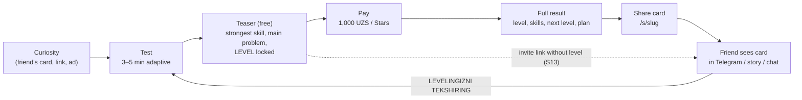
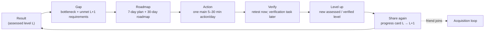
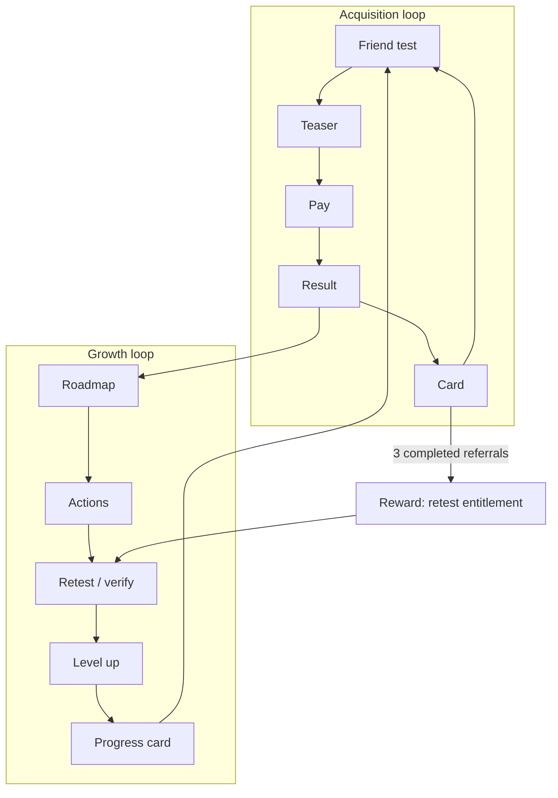
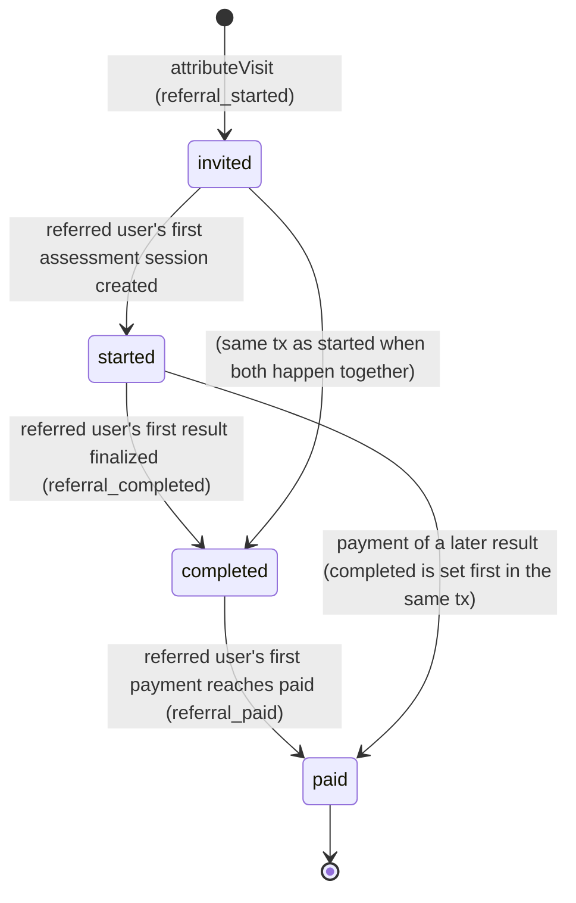
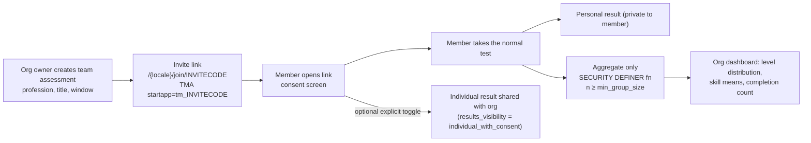

# 09 — Viral loop and referral architecture

> Scope: how a finished assessment becomes a share, how a share becomes a new tester, how referrals are attributed,
> validated and rewarded, and how we measure virality honestly. Source of truth: the decisions brief (§0, §3, §10,
> §11). This section builds on, and must stay consistent with, `01-architecture.md` §7.5 (share and referral
> attribution sequence, D21 code/slug formats), `02-mvp-spec.md` F15/F16 and D19–D21/D26, `03-user-flows.md`
> S11–S13, and `04-database-erd.md` (`share_cards`, `share_events`, `referral_codes`, `referrals`,
> `referral_reward_rules`, `referral_reward_grants`, `organizations`, `team_assessments`). Event names and metric
> formulas are defined in `11-analytics-events.md`.
>
> Lines marked **Decision:** are made here where the brief and the earlier sections are silent.

## Contents

1. [Principles](#1-principles)
2. [The loops](#2-the-loops)
3. [Share card](#3-share-card)
4. [Public share page and OG meta](#4-public-share-page-and-og-meta)
5. [Share and invite texts (uz / ru / en)](#5-share-and-invite-texts-uz--ru--en)
6. [Referral code format](#6-referral-code-format)
7. [Attribution](#7-attribution)
8. [Referral status pipeline](#8-referral-status-pipeline)
9. [Anti-abuse](#9-anti-abuse)
10. [Reward rules engine](#10-reward-rules-engine)
11. [Opt-in leaderboards (post-MVP design)](#11-opt-in-leaderboards-post-mvp-design)
12. [Team and university challenges (post-MVP design)](#12-team-and-university-challenges-post-mvp-design)
13. [Viral coefficient: math and honest measurement](#13-viral-coefficient-math-and-honest-measurement)
14. [Module boundaries, APIs and jobs](#14-module-boundaries-apis-and-jobs)
15. [Edge cases](#15-edge-cases)
16. [Decisions for cross-document alignment](#16-decisions-for-cross-document-alignment)

---

## 1. Principles

| # | Rule | Enforced by |
|---|------|-------------|
| P1 | A share is a **progress statement** ("I measured where I am"), never a ranking of people. Level = domain competency, not human value. | Card spec §3, copy §5, leaderboard rules §11 |
| P2 | The card shows only what the user chose. Name is **off** by default. Weakness, bottleneck, scores, confidence reasons, salary and any private data are **never** rendered, regardless of toggles. | `public_payload` zod schema (§3.2), render-from-payload-only rule |
| P3 | No fake urgency, scarcity, percentiles, IQ framing or shame in any share text, card or invite. Percentiles appear only from real data with `sample_size ≥ benchmark_min_sample` (default 1000) and never on the MVP card. | Copy review checklist, §5 |
| P4 | Client is never trusted for referral status, validity, counts or rewards. Every transition and grant happens server-side, idempotently. | `referrals` application service (§8, §10), RLS (no client writes) |
| P5 | Attribution is first-touch, write-once and only for genuinely new users. | §7 |
| P6 | Virality is reported from real events with denominators and intervals. "Not enough data" is a valid dashboard state. | §13, `11-analytics-events.md` §6 |
| P7 | The share loop and the referral loop are **one loop**: every share link (`/s/{slug}`) attributes to the card owner's referral code (02 D19). | §7 |

---

## 2. The loops

### 2.1 Acquisition loop (curiosity → … → friend → test)



| Step | Server-observed signal (`11-analytics-events.md`) | Owner module | Main lever (experiment key) |
|------|-----------------------------------------------------|--------------|-----------------------------|
| Curiosity → landing | `landing_view` (client), `share_card_viewed` (server, bots excluded), `referral_started` | sharing, referrals | `landing.headline`, `landing.cta` |
| Landing → test | `test_started` | assessments | `landing.cta` |
| Test → teaser | `test_completed`, `teaser_viewed` | assessments, results | `assessment.length` |
| Teaser → pay | `payment_started`, `payment_paid`, `payment_failed` | payments | `teaser.layout`, `payment.moment` |
| Pay → result | `result_viewed` | results | `result.design` |
| Result → card | `share_clicked`, `share_completed` | sharing | `share.card` |
| Card → friend → test | `share_card_viewed`, `referral_started`, then the friend's own `test_started` (envelope `referral_code` set) | sharing, referrals | `share.card` |

### 2.2 Growth loop (result → … → level up → share again)



| Step | Signal | Notes |
|------|--------|-------|
| Result → gap | `result_viewed` | Gap is computed deterministically (brief §8); nothing to share about it (P2). |
| Gap → roadmap | `roadmap_opened`, `roadmap_accepted` | Plan start rate (02 §3.2). |
| Roadmap → action | `action_completed`, `action_skipped` | Actions never move the level (02 D23). |
| Action → verify | `retest_started` (MVP); `verification_attempts` rows (post-MVP, feature `verification`) | Retest after cooldown, or earlier with a `retest` entitlement (the MVP referral reward, §10). |
| Verify → level up | `test_completed` with `properties.assessedLevel` > previous unlocked level of the same profession; `level_history` row | Level-up rate (11 §6). |
| Level up → share again | `share_clicked` / `share_completed` with `properties.cardKind = 'progress'` | **Decision:** a "progress" card variant (§3.6) is offered only when the new level is strictly higher than the previous unlocked level; a lower or equal retest offers the normal card, and the UI never prompts sharing a lower level. |

The referral reward (a cooldown-skipping retest, §10) feeds the growth loop rather than giving away the paid
report: inviting friends speeds up *your* next measurement, which is what the product is about.

### 2.3 Where the loops connect



---

## 3. Share card

### 3.1 Lifecycle (summary of 01 §7.5, 02 F15, 03 S11)

- `POST /api/v1/share-cards {resultId, showName, showStrongest, showNext, displayName?}` creates or reuses a
  `share_cards` row per toggle set (+ display name) once the preview settles (debounce 600 ms). Response:
  `{cardId, slug, shareUrl, telegramShareUrl, images {story, square, telegram, og}, shareText}`.
- Images: `GET /s/{slug}/{template}.png?l={locale}&v={hash}` where `template ∈ story|square|telegram|og`.
- Revocation: owner (`DELETE /api/v1/share-cards/{slug}`), refund (02 D15), deletion request (04 §14.4). Revoked
  slugs answer **410** for page and images.
- **Decision:** `share_cards` rows are immutable after creation except `revoked_at`, `view_count`, `display_name` /
  `show_name` (nulled on deletion). Any toggle change creates or reuses another row; therefore a link that someone
  already posted never changes content silently.

### 3.2 `public_payload` (the only render input)

Matches 04 `share_cards.public_payload` (camelCase per 04 J1, ≤ 4 KB). Zod schema in
`src/modules/sharing/domain/public-payload.ts`, `.strict()` so extra keys fail (AC-F15-01):

```ts
export const PublicPayloadV1 = z.object({
  v: z.literal(1),
  locale: z.string().regex(/^[a-z]{2,3}$/),            // sharer's locale at creation (03 S11)
  cardKind: z.enum(['level', 'locked', 'progress']),     // Decision: added, see §3.6
  profession: z.object({ slug: z.string().max(64), name: z.string().min(1).max(60) }),
  level: z.object({ number: z.number().int().min(1).max(9), name: z.string().max(40) }).nullable(),
  previousLevel: z.object({ number: z.number().int().min(1).max(9) }).nullable(),  // progress cards only
  strongestSkill: z.object({ name: z.string().max(60) }).nullable(),
  nextTarget: z.object({ number: z.number().int().min(2).max(9), name: z.string().max(40) }).nullable(),
  displayName: z.string().max(20).nullable(),
  refCode: z.string().regex(/^[A-Z2-7]{8}$/),
}).strict();
```

Builder rules (`sharing.application.buildPublicPayload`):

| Field | Source | Present when |
|-------|--------|--------------|
| `profession.name` | `professions.name[locale]` with fallback chain requested → en → uz; specialization is **not** shown (Decision: keeps the card generic and avoids revealing career details) | always |
| `level` | `assessment_results.assessed_level` + `levels.name[locale]` (single assessed level, not the range — 02 D16) | result unlocked (`result_unlocks` exists); else `null` and `cardKind = 'locked'` |
| `strongestSkill` | strongest skill by score among skills in band `strong` (brief §8) | `showStrongest` and a strong skill exists; else `null` (no fallback to a non-strong skill) |
| `nextTarget` | `assessed_level + 1` and its name | `showNext` and `assessed_level < 9` and the result is unlocked |
| `displayName` | `profiles.first_name` or typed name | `showName = true` only; validated `^[\p{L}][\p{L} \-ʻʼ]{0,19}$`u (letters, space, hyphen, U+02BB, U+02BC; ≤ 20 chars) |
| `previousLevel` | previous unlocked result of the same profession | `cardKind = 'progress'` only |
| `refCode` | owner's `referral_codes.code` (created lazily by `referrals.getOrCreateCode`) | always |

Never in the payload, enforced by schema and by a unit test that renders every template from a payload built from a
fixture result with extreme values: bottleneck/weak skills, any numeric score, composite, theta, SE, confidence and
its reasons, specialization, experience, goal, salary or income, country, city, Telegram username, phone, email,
user id, result id.

### 3.3 Templates and exact layout

Common rules:

- Rendering: `next/og` `ImageResponse` (Satori) from `public_payload` only. Fonts: Inter `.woff` (400, 600, 700,
  800; Latin + Cyrillic subsets), bundled under `src/modules/sharing/infrastructure/fonts/`. Satori does not accept
  woff2.
- **Decision:** CI script `scripts/check-font-glyphs.ts` asserts that every bundled font's cmap contains U+02BB,
  U+02BC, U+0400–U+04FF and the Uzbek Cyrillic letters (U+049B, U+0493, U+04B3, U+045E) for future `uz-Cyrl`; if a
  glyph is missing the build fails and a Noto Sans subset is added as a fallback font.
- Colours: background is a dark neutral (`#0E1116`) with an accent from `levels.color` of the shown level (locked
  cards use the brand accent). **Decision:** all text is white or `#E6E8EB`; the accent is used only for the level
  number and a 6 px rule, so contrast does not depend on admin-chosen level colours. Text contrast ≥ 4.5:1 is tested
  for every seeded level colour.
- Text fitting: each text box has a max font size (below) and shrinks in 4 % steps down to 70 % of it; beyond that the
  text is truncated with "…". Profession and level names never wrap to more than 2 lines (1 line for OG name rows).
- **Decision:** slots do not reflow. An absent optional field (name, strongest, next) leaves its box empty, so every
  card of a template has the same visual rhythm and the QR/link position is stable for scanners.
- QR (`qrcode` package): encodes `https://{PUBLIC_HOST}/s/{slug}` (the share page attributes to the owner's code),
  error correction **M**, quiet zone 2 modules, black on a white rounded square (radius 16 px).
- Short link text: `{PUBLIC_HOST}/s/{slug}` without scheme, monospace-like tracking, `#C9CED6`.
- "BAHOLANGAN / ОЦЕНЁН / ASSESSED" micro-label pill (02 D16) on every level-bearing card; "VERIFIED" pill reserved for
  post-MVP verified levels (separate badge, never merged).
- Coordinates are `x, y, w, h` in px from the top-left corner.

**Story — 1080 × 1920** (TMA `shareToStory`, Instagram/Telegram stories). **Decision:** y 0–200 and y 1680–1920 are
reserved for platform overlays (progress bar, reply bar) and contain background only.

| Element | Box (x, y, w, h) | Type |
|---------|------------------|------|
| LEVEL logo | 80, 220, 240, 64 | SVG wordmark |
| ASSESSED pill | 760, 228, 240, 48 | 26 px / 700, right-aligned at x 1000 |
| Display name (optional) | 80, 400, 920, 64 | 52 px / 600 |
| Profession | 80, 480, 920, 144 | 60 px / 600, ≤ 2 lines |
| "LEVEL" label | 80, 640, 920, 80 | 72 px / 700, letter-spacing 0.08 em |
| Level number | 80, 720, 920, 400 | 380 px / 800, accent colour, line-height 1 |
| Level name | 80, 1130, 920, 90 | 76 px / 700 |
| Accent rule | 80, 1240, 160, 6 | accent |
| Strongest skill (optional) | 80, 1280, 920, 56 | 40 px / 500 — `card.strongest` |
| Next target (optional) | 80, 1350, 920, 56 | 40 px / 500 — `card.next` |
| QR | 80, 1440, 200, 200 | |
| Short link | 310, 1470, 690, 48 | 34 px / 500 |
| Footer | 310, 1540, 690, 90 | 48 px / 700 — `card.footer` |

**Square — 1080 × 1080** (feeds, WhatsApp, download default on desktop).

| Element | Box (x, y, w, h) | Type |
|---------|------------------|------|
| LEVEL logo | 72, 72, 200, 52 | |
| ASSESSED pill | 808, 74, 200, 44 | 24 px / 700 |
| Display name | 72, 180, 936, 52 | 44 px / 600 |
| Profession | 72, 240, 936, 60 | 52 px / 600, 1 line |
| Level number | 72, 330, 400, 320 | 300 px / 800, accent |
| "LEVEL" label | 500, 350, 508, 72 | 64 px / 700 |
| Level name | 500, 430, 508, 150 | 64 px / 700, ≤ 2 lines |
| Strongest skill | 72, 690, 936, 48 | 36 px / 500 |
| Next target | 72, 750, 936, 48 | 36 px / 500 |
| QR | 72, 848, 160, 160 | |
| Short link | 260, 860, 748, 40 | 30 px / 500 |
| Footer | 260, 920, 748, 72 | 44 px / 700 |

**Telegram — 1080 × 1350** (4:5; `shareMessage` prepared message photo, Telegram chats).

| Element | Box (x, y, w, h) | Type |
|---------|------------------|------|
| LEVEL logo | 80, 80, 220, 56 | |
| ASSESSED pill | 780, 84, 220, 44 | 24 px / 700 |
| Display name | 80, 220, 920, 56 | 48 px / 600 |
| Profession | 80, 290, 920, 64 | 56 px / 600, 1 line (shrink first) |
| "LEVEL" label | 80, 400, 920, 72 | 64 px / 700 |
| Level number | 80, 470, 920, 330 | 320 px / 800, accent |
| Level name | 80, 810, 920, 80 | 68 px / 700 |
| Strongest skill | 80, 930, 920, 52 | 38 px / 500 |
| Next target | 80, 995, 920, 52 | 38 px / 500 |
| QR | 80, 1100, 170, 170 | |
| Short link | 280, 1115, 720, 44 | 32 px / 500 |
| Footer | 280, 1175, 720, 72 | 46 px / 700 |

**OG — 1200 × 630** (link previews: Telegram, WhatsApp, X, Facebook, LinkedIn). **Decision:** no QR (a preview is
already a link). The image follows the same toggles as the other templates; the name appears in the image and in the
OG title only when `show_name` is on.

| Element | Box (x, y, w, h) | Type |
|---------|------------------|------|
| LEVEL logo | 64, 56, 200, 48 | |
| ASSESSED pill | 936, 58, 200, 40 | 22 px / 700 |
| Display name | 64, 150, 640, 48 | 40 px / 600 |
| Profession | 64, 206, 640, 56 | 48 px / 600, 1 line |
| Strongest skill | 64, 300, 640, 44 | 32 px / 500 |
| Next target | 64, 352, 640, 44 | 32 px / 500 |
| Footer | 64, 470, 640, 60 | 40 px / 700 |
| Short link | 64, 540, 640, 36 | 28 px / 500 |
| "LEVEL" label | 760, 150, 376, 60 | 52 px / 700 |
| Level number | 760, 210, 376, 260 | 240 px / 800, accent |
| Level name | 760, 480, 376, 60 | 44 px / 700, 1 line |

### 3.4 Privacy defaults

| Setting | Default | Notes |
|---------|---------|-------|
| `show_name` | **off** | Turning on uses `profiles.first_name` or a typed name (≤ 20 chars). Never the Telegram username or last name. **Decision:** `profiles.show_name_on_share` remembers the last choice only after the user turns it on once; it never starts as on. |
| `show_strongest` | on | Strength only; the opposite (weakest/bottleneck) has no toggle because it is never shareable. |
| `show_next` | on | "Next goal: LEVEL n+1" is aspirational, not a weakness. |
| Level | shown only if unlocked | Locked results produce `cardKind = 'locked'` without a number (01 §7.5). |
| Indexing | `noindex` | §4. |
| Telegram identity | never on card | Even in TMA, where `first_name` is known. |

### 3.5 Caching and rendering budget

- p95 render ≤ 1.5 s server time per template (AC-F15-03).
- Image route: `Cache-Control: public, max-age=300, s-maxage=86400, stale-while-revalidate=3600`, CDN cache tag
  `card:{slug}`. **Decision:** revocation purges the tag and the route answers 410 from the DB check, so a revoked
  card stops resolving at the edge immediately and in browsers within ≤ 5 minutes. (Long-lived `immutable` caching is
  rejected because revocation must be prompt — 03 S12.)
- `v` = first 12 hex chars of SHA-256(`public_payload` canonical JSON + template + font set version) — cache busting
  when the renderer changes.
- Downloads: same route with `?dl=1` → `Content-Disposition: attachment; filename="level-{profession-slug}-{n}.png"`
  (TMA `downloadFile` needs it, 03 S11).

### 3.6 Card kinds

| `cardKind` | When | Level slot | Footer |
|------------|------|------------|--------|
| `level` | unlocked result (default) | `LEVEL n · name` | `card.footer` |
| `locked` | result not unlocked; data model supports it (01 §7.5). **Decision:** MVP UI exposes it only from the invite screen S13 ("Invite with a card") — S11 still requires an unlocked result (02 F15, 03 S11) | large "?" in accent + `card.lockedTitle` | `card.footer` |
| `progress` | unlocked retest result whose level > previous unlocked level of the same profession | `LEVEL p → n` (previous → new) | `card.progressFooter` |

A level-down retest never creates a progress card and the UI never suggests sharing it (P1).

---

## 4. Public share page and OG meta

Route `/s/{slug}` is rewritten to `/{locale}/s/{slug}` (03 S12), public React Server Component, ISR 300 s, card
lookup by slug through `sharing.getPublicCard(slug)` (server only; RLS keeps `share_cards` own-row).

### 4.1 Behaviour

| Step | Rule |
|------|------|
| Lookup | Unknown slug → 404 with start CTA; revoked or owner deleted → 410 `public.revoked`. |
| Attribution | Sets `level_ref = owner refCode` if absent (first touch, 30 days); sets `level_did` if absent. Never creates a user (02 F19 D25). |
| Analytics | Server emits `share_card_viewed` unless the UA matches the bot list (§4.3). `user_id` = viewer if a session already exists, else null. `share_events(event='viewed')` and `view_count` increment at most once per (card, viewer `ip_hash`) per day (04). |
| CTA | `public.cta` → S04 for the card's profession (skips category), same test in one tap. Secondary `public.openTelegram` → `t.me/<bot>/<app>?startapp={refCode}`. |
| Owner viewing | *Bu sizning kartangiz* + revoke; no `share_card_viewed` (Decision: owner views are excluded from virality counts, `properties.isOwner` not needed). |
| Page chrome locale | viewer's locale (03); OG meta in the **card's** locale (crawlers have no locale; the sharer's audience most likely reads the sharer's language). |

### 4.2 Meta tags (exact)

```html
<title>{ogTitle}</title>
<meta name="description" content="{public.what}">
<meta name="robots" content="noindex, nofollow">            <!-- Decision: personal pages are not indexed -->
<link rel="canonical" href="https://{PUBLIC_HOST}/s/{slug}">
<meta property="og:type" content="website">
<meta property="og:site_name" content="LEVEL">
<meta property="og:url" content="https://{PUBLIC_HOST}/s/{slug}">
<meta property="og:title" content="{ogTitle}">
<meta property="og:description" content="{public.what}">
<meta property="og:locale" content="{uz_UZ|ru_RU|en_US}">
<meta property="og:image" content="https://{PUBLIC_HOST}/s/{slug}/og.png?l={cardLocale}&v={hash}">
<meta property="og:image:width" content="1200">
<meta property="og:image:height" content="630">
<meta property="og:image:alt" content="{ogTitle}">
<meta name="twitter:card" content="summary_large_image">
<meta name="twitter:title" content="{ogTitle}">
<meta name="twitter:image" content="https://{PUBLIC_HOST}/s/{slug}/og.png?l={cardLocale}&v={hash}">
```

`ogTitle` selection (keys from 03 S12, plus two added keys):

| Card | Key | uz example |
|------|-----|------------|
| level, name on | `public.title.named` | "Aziz — Sales LEVEL 5. Sizniki nechchi?" |
| level, name off | `public.title.anon` | "Sales LEVEL 5. Sizniki nechchi?" |
| locked | `public.title.locked` (01 §7.5) | "Tadbirkor LEVEL testi. Sen qaysi LEVELdasan?" |
| progress, name off | `public.title.progress` (**Decision**, new key) | "Sotuv mutaxassisi: LEVEL 4 → LEVEL 5. Sizniki nechchi?" |

(The brief's example uses the English word "Sales" inside Uzbek copy; actual output uses `professions.name[locale]`.)

### 4.3 Bot exclusion

`share_card_viewed` and `view_count` skip requests whose UA matches (case-insensitive)
`TelegramBot|facebookexternalhit|Facebot|Twitterbot|WhatsApp|Slackbot|Discordbot|LinkedInBot|Googlebot|bingbot|
YandexBot|Applebot|SkypeUriPreview|vkShare|redditbot|Pinterest|HeadlessChrome|python-requests|curl|Wget` or that send
`Purpose: prefetch` / `Sec-Purpose: prefetch`. The list lives in `src/lib/http/bots.ts` and is unit-tested. Bots still
get the full HTML and OG tags.

---

## 5. Share and invite texts (uz / ru / en)

All texts are next-intl messages; `{profession}` is the localized profession name, `{n}` the level number. Uzbek uses
U+02BB (ʻ) and U+02BC (ʼ) only. The URL is appended by the share mechanism (Web Share `url`, `t.me/share/url?url=`),
not embedded in the text, except where noted.

| Key | uz | ru | en |
|-----|----|----|----|
| `share.text.default` (03) | Men {profession} LEVEL testidan oʻtdim. Natijam: LEVEL {n}. Sizniki nechchi? | Мой результат в тесте LEVEL ({profession}): LEVEL {n}. А какой у вас? | I took the LEVEL test for {profession}. My result: LEVEL {n}. What is yours? |
| `share.text.progress` (**Decision**) | {profession} boʻyicha LEVEL {p} dan LEVEL {n} ga oʻtdim. Sizniki nechchi? | {profession}: я перешёл с LEVEL {p} на LEVEL {n}. А какой у вас? | {profession}: I moved from LEVEL {p} to LEVEL {n}. What is yours? |
| `share.text.locked` (**Decision**) | Men {profession} LEVEL testidan oʻtdim. Sen qaysi LEVELdasan? | Я прошёл тест LEVEL ({profession}). А какой LEVEL у тебя? | I took the LEVEL test for {profession}. What's your LEVEL? |
| `invite.text` (S13, **Decision**) | {profession} boʻyicha hozirgi darajangizni 3–5 daqiqada bilib oling. Testni boshlash bepul: {url} | Узнайте свой текущий уровень в сфере «{profession}» за 3–5 минут. Начать тест бесплатно: {url} | Find out your current level in {profession} in 3–5 minutes. Starting the test is free: {url} |
| `invite.text.generic` (no profession yet) | Kasbingiz boʻyicha hozirgi darajangizni 3–5 daqiqada bilib oling. Testni boshlash bepul: {url} | Узнайте свой текущий уровень в профессии за 3–5 минут. Начать тест бесплатно: {url} | Find out your current level in your profession in 3–5 minutes. Starting the test is free: {url} |
| `tg.prepared.caption` (shareMessage) | = `share.text.*` for the card kind | = | = |
| `tg.prepared.button` | LEVELINGIZNI TEKSHIRING | ПРОВЕРЬТЕ СВОЙ LEVEL | CHECK YOUR LEVEL |
| `card.lockedTitle` | {profession} LEVEL testi | Тест LEVEL: {profession} | LEVEL test: {profession} |
| `card.progressFooter` | Sen qaysi LEVELdasan? | А какой LEVEL у тебя? | What's your LEVEL? |

Copy rules (checked in review and by `scripts/check-copy.ts`, **Decision**): no superlatives about the user ("best",
"top N%"), no time pressure ("faqat bugun", "только сегодня", "only today"), no percentiles, no IQ, no comparisons
that rank the friend below the sharer. "3–5 daqiqa" is used only while the measured median test duration stays within
it (02 D3).

---

## 6. Referral code format

Aligned with 01 D21 and the 02 D26 `start_param` grammar.

| Property | Value |
|----------|-------|
| Alphabet | RFC 4648 base32: `A–Z` and `2–7` (32 symbols). It has no `0`, `1`, `8`, `9`, so the classic `O/0`, `I/1`, `B/8` confusions cannot occur inside a code. |
| Length | 8 characters → 32⁸ ≈ 1.1 × 10¹² codes; random from `crypto.randomBytes(5)` (40 bits) encoded to 8 symbols. |
| Canonical regex | `^[A-Z2-7]{8}$` (generated); grammar accepts `^[A-Z2-7]{6,12}$` for forward compatibility. |
| Case | Canonical uppercase. Links are generated uppercase; input is normalized. |
| Normalization (typed or pasted input, `/r/{code}`) | trim → remove spaces and `-` → uppercase → map `0→O`, `1→I`, `8→B` (**Decision**: recovers common mis-typing; the mapped letters are the only plausible intents) → validate. |
| Display | grouped `ABCD EFGH` on the invite screen only; links never contain separators. |
| Denylist | **Decision:** regenerate if the code contains any substring from `src/modules/referrals/domain/code-denylist.ts` (short offensive words in uz/ru/en Latin transliteration, plus `LEVEL`, `ADMIN`, `TEST`). |
| Uniqueness | `referral_codes.code` UNIQUE; retry up to 5 times on conflict, then error `REFERRAL_CODE_EXHAUSTED` (should never happen; alerts). |
| Creation | Lazily on first share/invite screen (`referrals.getOrCreateCode`), one per user (`user_id` UNIQUE). |
| Lifetime | Permanent; `is_active = false` on deletion request. Inactive codes still redirect but attribute nothing. |
| Merge | Per 01 §3.5: if the merge target has no code, the anon code is re-pointed; otherwise the anon code row stays and attribution resolves its owner via `canonicalUserId()`. |

Note for the data-model section: 04's CHECK on `referral_codes.code` (`^[A-Z2-9]{6,10}$`) admits `8`/`9`, which the
generator never produces; tightening it to `^[A-Z2-7]{6,12}$` (same as the `start_param` grammar) is recommended.

---

## 7. Attribution

### 7.1 Entry points

| Entry | Mechanism | Stored as |
|-------|-----------|-----------|
| Web `/r/{CODE}` | 302 to `/{locale}` (or `/{locale}/professions/{slug}` when `?c={cardSlug}` resolves) with `Set-Cookie: level_ref={CODE}; Max-Age=2592000; Path=/; HttpOnly; Secure; SameSite=Lax` **only if absent**, plus `level_did` if absent. Visit rate-limited (`referral_visit`: 30/h per ip_hash+code; over limit the redirect still works but no cookie is set). | Cookie until the first API call |
| Web `/s/{slug}` | Same cookie with the card owner's code (02 D19). | Cookie |
| TMA `t.me/<bot>/<app>?startapp={CODE}` | `start_param` inside signed `initData` (verified HMAC, `auth_date` ≤ 24 h), grammar per 02 D26. | Read in `POST /api/v1/auth/telegram` |
| Bot `/start {CODE}` (deep link to the bot chat) | **Decision:** the bot replies with the Mini App button whose URL carries `startapp={CODE}`, so attribution still flows through verified `initData`; the bot itself never attributes. | — |
| Prepared message button / story widget | URL `t.me/<bot>/<app>?startapp={CODE}` (03 S11). | `start_param` |

`referral.attribution_days` = 30 (01 §12.2) = cookie lifetime = first-touch window.

### 7.2 Attribution algorithm (`referrals.attributeVisit`)

```ts
// referrals/application/attribute-visit.ts (server-only; runs inside the request that created the user)
export async function attributeVisit(tx, input: {
  userId: string;                    // canonical id of the user created in THIS request
  code: string;                      // normalized
  entry: 'web_r' | 'share_page' | 'tma_start_param';
  userCreatedInThisRequest: boolean;
  hadAssessmentSessionBefore: boolean;
  deviceHash: string | null;         // HMAC(HASH_SALT, level_did) on web; null in TMA
  telegramUserId: bigint | null;
  ipHash: string | null;
}): Promise<AttributionOutcome> {
  if (!input.userCreatedInThisRequest || input.hadAssessmentSessionBefore) return { kind: 'ignored', reason: 'not_new' };
  const code = await codes.findActive(tx, input.code);
  if (!code) return { kind: 'ignored', reason: 'unknown_or_inactive_code' };
  const referrerId = await identity.canonicalUserId(tx, code.userId);
  if (referrerId === input.userId) return { kind: 'ignored', reason: 'self' };   // CHECK forbids the row
  const invalid = await validity.check(tx, { referrerId, ...input });           // §9.1, first match wins
  const row = await referrals.insertIfAbsent(tx, {                              // ON CONFLICT (referred_user_id) DO NOTHING
    referralCodeId: code.id, referrerUserId: referrerId, referredUserId: input.userId,
    status: 'invited', isValid: invalid === null, invalidReason: invalid,
    ipHash: input.ipHash, deviceHash: input.deviceHash,
  });
  if (!row) return { kind: 'ignored', reason: 'already_attributed' };
  await identity.setFirstTouchReferral(tx, input.userId, code.id);              // users.referred_by_code_id IS NULL guard
  await analytics.track(tx, 'referral_started', { userId: input.userId, referralCode: code.code,
    properties: { referralId: row.id, entry: input.entry, isValid: row.isValid, invalidReason: invalid } });
  return { kind: 'attributed', referralId: row.id, isValid: row.isValid };
}
```

### 7.3 Precedence and conflicts

| Situation | Outcome |
|-----------|---------|
| Cookie `level_ref=A`, then user opens `/r/B` | Cookie stays `A` (first touch). |
| Web anon user attributed to `A`, later opens TMA with `startapp=B`, merge into a **new** Telegram user | Referral row re-pointed to the Telegram user (merge re-points referrals, brief §3); `B` ignored (`already_attributed`). |
| Web anon user attributed to `A`, merges into an **existing** Telegram user T who had an assessment session before `invited_at` | Row marked `is_valid=false, invalid_reason='merged_identity'` (T was not a new user). |
| Both merged users carry referral rows | Keep the earliest `invited_at` valid; the other `merged_duplicate` (it keeps `referred_user_id` = the merged anon id, so the unique constraint holds). |
| TMA user with `start_param` that is an `lk_` link token | Link-token flow (02 D26); no referral from that request. |
| User already had a session (any) before the visit | No attribution (02 D20). `users.first_touch` already exists. |
| Cookie present but user never makes an API call | Nothing is stored; crawlers and preview bots create nothing. |
| Code belongs to a deleted user | `is_active=false` → ignored. |
| Referrer later merges into another user | `referrer_user_id` re-pointed to the canonical user; re-run validity (§9.2). |

### 7.4 Sequence (web and TMA)

```mermaid
sequenceDiagram
    autonumber
    participant F as Friend
    participant E as /r or /s route
    participant API as /api/v1
    participant ID as identity
    participant RF as referrals
    participant AN as analytics
    alt Web
        F->>E: GET /r/CODE or /s/slug
        E-->>F: 302 or 200, Set-Cookie level_ref (if absent), level_did (if absent)
        F->>API: POST /session (first API call, cookie sent)
        API->>ID: ensureAnonymous(meta, first_touch)
    else Telegram Mini App
        F->>API: POST /auth/telegram {initData with start_param=CODE}
        API->>ID: verify HMAC + auth_date, find-or-create, merge current anon
    end
    API->>RF: attributeVisit(tx, user, code, entry, device/ip hashes)
    RF->>RF: validity checks (self, telegram id, device, merged)
    RF->>AN: referral_started (same transaction)
    Note over RF: status invited; later started, completed, paid (section 8)
```

---

## 8. Referral status pipeline



| Transition | Trigger (in-process domain event) | Same transaction as | Analytics | Timestamp |
|------------|----------------------------------|---------------------|-----------|-----------|
| → `invited` | `attributeVisit` | user creation / Telegram sign-in | `referral_started` | `invited_at` |
| `invited → started` | `assessment.started` (first session of the referred user, any profession) | session insert | none (the friend's `test_started` carries `referral_code` in its envelope) | `started_at` |
| `→ completed` | `result.finalized` (first result, any profession) | result insert | `referral_completed` | `completed_at` |
| `→ paid` | `payment.paid` (first paid payment of any product) | PAID transition + unlock | `referral_paid` | `paid_at`, `first_payment_id` |

Rules:

- **Monotonic:** `update referrals set status = $new … where referred_user_id = $u and status_rank(status) <
  status_rank($new)`; skipped intermediate statuses get their timestamps filled with the same instant.
- Transitions run for invalid referrals too (funnel truth), but invalid rows never count for rewards or for the S13
  counters (AC-F16-03).
- **Decision:** progress window — a status change counts only if it happens within
  `referral.progress_window_days` (default **90**) of `invited_at`; later activity leaves the referral at its last
  status. Keeps reward accounting bounded and K windows comparable.
- Refunds: status stays `paid` (history is truth); the `paid` reward count joins `payments.status = 'paid'` (04
  query), so a refund stops counting (brief §10, AC-F16-05). No new analytics event; `payment.refunded` is visible
  in payments and audit logs.
- Retests and second professions do not move the pipeline (first-time milestones only).

---

## 9. Anti-abuse

### 9.1 Validity checks at attribution (first match wins)

| # | Check | Data | `invalid_reason` |
|---|-------|------|------------------|
| 1 | Same canonical user | `canonicalUserId(code.user_id) = userId` | not stored (row CHECK forbids); `ignored: self` logged |
| 2 | Same Telegram id | `referrer.telegram_user_id = referred.telegram_user_id` (possible when the referrer's code belongs to an anon user later merged into the same Telegram account) | `same_telegram_id` |
| 3 | Same device | referred `device_hash` ∈ `auth_sessions.device_hash` of the referrer (and of users merged into the referrer) seen in the last 180 days | `same_device` |
| 4 | Merged identity | referrer and referred resolve to the same canonical user after any merge, or the referred user merged into a pre-existing user (§7.3) | `merged_identity` / `merged_duplicate` |
| 5 | Admin judgment | manual after review of anomaly flags | `fraud_suspected` / `refunded` (abuse via refunds) / `other` |

- **IP hash never invalidates** (CGNAT, campus Wi-Fi). It only raises an anomaly flag (§9.4).
- In TMA, device identity is the Telegram user id (01 D21); check 3 applies to web-originated sessions only.
- **Decision:** validity is re-evaluated (never from invalid back to valid automatically) on every merge touching
  either side; flipping `valid → invalid` writes an `audit_logs` row (`referral.invalidated`).

### 9.2 Merged identities

The `identity.merge` transaction calls `referrals.onMerge(tx, {fromUserId, toUserId})`:

1. Re-point `referrals.referrer_user_id` from → to.
2. Re-point `referrals.referred_user_id` from → to unless `to` already has a row (then keep earliest `invited_at`, mark
   the other `merged_duplicate`).
3. Any row whose referrer and referred now coincide → `merged_identity`.
4. If `to` existed with an assessment session before the referral's `invited_at` → `merged_identity`.
5. Re-run reward evaluation for affected referrers (grants are never revoked automatically, §9.3).

### 9.3 Reward caps and claw-back policy

| Control | Value | Where |
|---------|-------|-------|
| One grant per (user, rule) | DB unique `(user_id, rule_id)` | brief §10 |
| Rolling cap across rules | `referral.max_grants_per_30d` = **3** (Decision) per user | evaluation step; excess thresholds wait and are granted by the nightly reconcile once under the cap |
| Global daily budget | `referral.daily_grant_budget` = **500** grants/day (Decision; owner adjusts) | evaluation step; over budget → deferred + admin flag `referral_budget_hit` |
| Counting | valid referrals only; `paid` metric only with the first payment still `paid` | 04 queries |
| Claw-back | **Decision:** none automatic. If an admin marks referrals `fraud_suspected` and the referrer's granted entitlement is unused, the admin may expire it (`entitlements.expires_at = now()`, audit `entitlement.revoked`). Used entitlements are never reversed. | admin |
| Referred-side rewards | none in the MVP (02 D21, one-sided) | — |

### 9.4 Anomaly flags (admin, Growth loops screen)

| Flag | Condition (rolling) | Action |
|------|---------------------|--------|
| `ref_ip_cluster` | > `referral.ip_anomaly_per_day` (default 20, 01 §7.5) valid referrals with the same `ip_hash` in 24 h for one referrer | Review; optionally mark `fraud_suspected` |
| `ref_fast_complete` | ≥ 5 of a referrer's referred completions in 24 h with median `durationMs` < 60 s or speeding flagged on > 50 % | Review (bots/farmed completions) |
| `ref_device_reuse` | one `device_hash` appears on > 3 referred users of different referrers in 7 days | Review |
| `ref_refund_ratio` | referrer's referred paid count ≥ 5 and refunded share > 30 % | Review |
| `referral_budget_hit` | daily grant budget reached | Raise budget or investigate |

All thresholds live in `app_settings.referral.flags` and are shown with their denominators.

---

## 10. Reward rules engine

### 10.1 Rule model

`referral_reward_rules(key, metric completed|paid, threshold, entitlement, quantity, is_active)` (04). Rules are
data; adding a tier is inserting a row, not deploying code.

| key | metric | threshold | entitlement | qty | MVP state |
|-----|--------|-----------|-------------|-----|-----------|
| `three_completed_retest` | completed | 3 | `retest` | 1 | **active** (02 D21) |
| `three_paid_deep_analysis` | paid | 3 | `deep_analysis` | 1 | inactive until the deep report ships (activation blocked by admin validation, 02 D21) |
| `three_completed_verification` | completed | 3 | `verification_attempt` | 1 | inactive until `features.verification` (brief §10 example) |
| `ten_completed_retest` | completed | 10 | `retest` | 1 | inactive example of a second tier (Decision: tiers are separate rules because grants are once per rule) |

Admin validation on activation: entitlement consumable in this release; threshold ≥ 1; quantity ≤ 3; a rule may not
be deleted once granted (deactivate only); changing `threshold` or `entitlement` of a granted rule is refused — create
a new rule instead (grants must remain explainable).

### 10.2 Evaluation (idempotent)

Runs after every status transition of a **valid** referral, after merges, and in the nightly `referral-rewards`
reconcile job (catches deferred grants and any missed evaluation).

```ts
// referrals/application/evaluate-rewards.ts
export async function evaluateRewards(tx, referrerId: string, now: Date): Promise<Grant[]> {
  await tx`select pg_advisory_xact_lock(hashtextextended(${'ref_rewards:' + referrerId}, 0))`; // serialize per referrer
  const counts = await referrals.countValid(tx, referrerId);          // {completed, paid} — 04 queries
  const rules = await rules.listActive(tx);                           // ordered by threshold asc, key asc
  const granted: Grant[] = [];
  for (const rule of rules) {
    if (counts[rule.metric] < rule.threshold) continue;
    if (await caps.exceeded(tx, referrerId, now)) { flags.raise('referral_cap_deferred', referrerId); break; }
    const grant = await tx`
      insert into referral_reward_grants (user_id, rule_id) values (${referrerId}, ${rule.id})
      on conflict (user_id, rule_id) do nothing returning id`;
    if (grant.length === 0) continue;                                  // already granted → idempotent no-op
    const ent = await entitlements.grant(tx, { userId: referrerId, entitlement: rule.entitlement,
      quantity: rule.quantity, source: 'referral_reward', sourceRef: grant[0].id });
    await tx`update referral_reward_grants set entitlement_id = ${ent.id} where id = ${grant[0].id}`;
    await audit.write(tx, { actorType: 'system', action: 'referral.reward_granted', entityType: 'referral_reward_grants',
      entityId: grant[0].id, after: { ruleKey: rule.key, entitlementId: ent.id } });
    granted.push({ ruleKey: rule.key, entitlementId: ent.id });
  }
  return granted;   // caller enqueues a notification (post-MVP) and the S13 screen shows the granted state
}
```

Properties: idempotent by the unique key; safe under concurrent completions (advisory lock + unique); the same
transaction holds grant + entitlement + audit; counts read only valid referrals inside the progress window.

### 10.3 Cost accounting

Unit economics (brief §9) attribute "referral reward cost" to the period of consumption, not grant:
`reward_cost = Σ consumed referral-sourced entitlements × marginal cost of fulfilment` (for `retest`: AI cost of the
retest's narrative from `ai_usage` + infra estimate; no cash outflow). **Decision:** forgone revenue is shown as a
separate memo line (list price × consumed paid-equivalent entitlements, e.g. `deep_analysis`), never mixed into net
contribution.

---

## 11. Opt-in leaderboards (post-MVP design)

Out of MVP scope (02 §6). Design constraints fixed now so nothing shipped earlier blocks them.

| Aspect | Rule |
|--------|------|
| Unit | **Groups, not individuals.** Categories: profession (e.g. *Dasturchilar*), university, company, city. No individual names, ranks or avatars ever. |
| Opt-in | Per user, explicit: planned `profiles.leaderboard_opt_in boolean default false` + per-organization `organization_members.consent_share_results`. Only opted-in users contribute. Withdrawal removes the user from the next aggregate. |
| Level source | **Verified** levels only (assessed levels are self-administered and gameable; brief two-badge rule). Until verification ships, leaderboards stay off. |
| Minimum group size | A group is shown only with ≥ `leaderboards.min_group_size` (Decision: **20**) opted-in members with a verified level; distribution cells < 5 are merged into neighbours. Team views keep their own `min_group_size` (default 5, min 3). |
| Metric | **Progress**, not standing: `verified level-ups per 100 opted-in members in the last 90 days` and the distribution of verified levels (histogram). |
| Ordering | Top 10 groups by progress only; no positions below 10, no "last place", no bottom lists; ties alphabetical. A group's own members privately see "your group's progress vs its previous 90 days", never its rank below the top 10. |
| Percentiles | Individual "where am I in my group" only if the group sample ≥ `benchmark_min_sample` (1000), with sample size and window shown (brief §0). |
| City | From `profiles.location`, normalized to a city code; never precise location. |
| Anti-gaming | Verified-only, per-user one contribution per profession, joins/leaves within the window counted at window end only. |
| Storage | Precomputed daily into a planned `leaderboard_snapshots(category, group_key, window_end, members, level_ups, histogram jsonb)`; served from snapshots only (no ad-hoc queries that could be differenced). |

---

## 12. Team and university challenges (post-MVP design)

Uses `organizations`, `organization_members`, `team_assessments` (04; feature flag `features.organizations`).



| Aspect | Rule |
|--------|------|
| Invite code | 8 chars, same base32 alphabet as referral codes, unique in `team_assessments.invite_code`. **Decision:** TMA uses `startapp=tm_{CODE}`; this extends the 02 D26 grammar with `^tm_[A-Z2-7]{8}$` when organizations ship. |
| Consent | Joining shows: what the org will see (aggregates only by default), what it will never see (individual answers, scores, name unless consented), opt-out at any time. `consent_share_results` + `consent_at` recorded; withdrawal hides the individual from org views from the next request and from aggregates from the next snapshot. |
| Aggregates | `org_team_aggregate(team_assessment_id)` SECURITY DEFINER: returns null (UI: "Yetarli ishonchli maʼlumot mavjud emas.") unless completed members ≥ `min_group_size`; returns level histogram (cells < 5 merged), per-skill mean and median score, completion count. No filters or slices (prevents differencing). |
| Individual results | Only `results_visibility = 'individual_with_consent'` **and** member consent; shows level and strongest skill, never raw answers. |
| Challenge framing | "Team progress" between two windows (verified/assessed level-ups per 100 members), never member-vs-member. |
| Referral interplay | **Decision:** joining via a team invite does **not** create a referral or count toward rewards (the org drives the traffic; rewards would be gamed). `users.first_touch.team = invite code` for analytics. |
| Payment | Personal unlock as usual in MVP+1; org-paid bundles are a later pricing item. |

---

## 13. Viral coefficient: math and honest measurement

### 13.1 Definitions

For an **activation cohort** C_w = users whose first `test_completed` falls in week w (canonical user ids; admins,
`analytics.excluded_user_ids` and mock-only payers excluded):

- **i** (invites per user) = |{valid referrals r : r.referrer ∈ C_w, r.invited_at ≤ referrer.activated_at + 30 d}| / |C_w|.
  An "invite" is a **referred user created** (row in `referrals`, `referral_started`), because the act of
  sending a link to an unknown audience is not observable.
- **c_completed** = |{those referrals with completed_at ≤ invited_at + 30 d}| / |{those referrals}|.
- **c_paid** = same with `paid_at` and the first payment still `paid`.
- **K_completed = i × c_completed**, **K_paid = i × c_paid** (brief §10). K_completed is the headline (it measures
  the loop that brings new testers); K_paid is the economic one.
- Diagnostic decomposition: `i = s × v`, where `s` = `share_completed` (+ invite-link copies) per activated user,
  `v` = valid referred users per share. Shows whether a low K is a card problem (s) or a landing problem (v).
- **Cycle time** `t_c` = median(referred.completed_at − referrer.activated_at) over completed referrals.

### 13.2 What K implies (math only)

With K < 1, each seed user brings on average `1/(1 − K)` users in total (geometric series `1 + K + K² + …`), e.g.
K = 0.3 → ≈ 1.43 users per seed; K ≥ 1 implies self-sustaining growth only while the cohort-level K holds, which
saturation of a social graph usually prevents. These are arithmetic identities, not forecasts.

### 13.3 Honest measurement rules

| Rule | Why |
|------|-----|
| Count only valid referrals inside the 30-day windows; same windows for every cohort | Comparable over time; self-referrals excluded |
| Report K per cohort week with |C_w| and the numerator counts; hide K (show "Not enough reliable information.") when |C_w| < 100 or referred users < 30 | Small samples mislead |
| Show `c` with a 95 % Wilson interval when the denominator < 1,000 (02 §3.1) | Uncertainty visible |
| Report K by entry (`web_r`, `share_page`, `tma_start_param`) and by channel | Different loops |
| Label measured K as a **lower bound** | Untracked spread: screenshots without QR scans, links opened in a different browser than the one that later starts the test, cookie loss in in-app browsers, users who open the bot without `startapp` |
| Never add organic or paid-ads users to the numerator | Only attributed referrals |
| Mature cohorts only: a week is "final" 60 days after its end (30 d invite + 30 d conversion) | Immature cohorts understate K |
| Keep experiment variants separate (`experiment_variants` on the referrer's events) | K is a guardrail/secondary metric in share-card tests |

SQL is in `11-analytics-events.md` §6.7.

---

## 14. Module boundaries, APIs and jobs

| Module | Public API (additions to 01 §3.3 in bold) |
|--------|---------------------------------------------|
| sharing | `createOrReuseCard`, `getPublicCard(slug)`, `renderCardImage(slug, template, locale)`, `prepareTelegramMessage`, `recordShareEvent(ctx, slug, event, method)`, `revokeCard`, **`revokeCardsForResult(tx, resultId, reason)`** |
| referrals | `getOrCreateCode(userId)`, **`normalizeCode(input)`**, `attributeVisit(tx, input)`, `onAssessmentStarted`, `onResultFinalized`, `onPaymentPaid`, **`onMerge(tx, from, to)`**, `evaluateRewards(tx, referrerId)`, `getInviteScreen(userId)` (counts per status, rule progress) |
| organizations (later) | `createTeamAssessment`, `joinByInviteCode`, `setConsent`, `getAggregate` |

| Endpoint | Auth | Notes |
|----------|------|-------|
| `POST /api/v1/share-cards` | session | rate-limited (`share_card_create`) |
| `GET /s/{slug}`, `GET /s/{slug}/{template}.png` | none | public, cached |
| `POST /api/v1/share-cards/{slug}/events` | session, owner | `share_clicked`, `share_completed` (+ `share_events`) |
| `POST /api/v1/share-cards/{slug}/telegram-message` | session, owner | `savePreparedInlineMessage` |
| `DELETE /api/v1/share-cards/{slug}` | session, owner | revoke |
| `GET /r/{code}` | none | cookie + 302 |
| `GET /api/v1/referrals/me` | session | `{code, webUrl, tmaUrl, counts {invited, started, completed, paid}, rules [{key, metric, threshold, progress, granted}]}` — counts only, valid only |

| Job (01 §14 cron) | Schedule | Work |
|-------------------|----------|------|
| `referral-rewards` | daily 02:20 UTC | re-evaluate referrers with status changes in the last 48 h + deferred grants |
| `referral-flags` | hourly | compute §9.4 anomaly flags |
| `growth-metrics` | daily 03:00 UTC | materialize K per mature cohort for the admin screen (`admin_v_k_cohorts`) |

---

## 15. Edge cases

| Case | Handling |
|------|----------|
| Friend opens a share link in Telegram's in-app browser, then switches to the TMA | Web cookie is lost to the TMA; TMA attribution needs `startapp`. Share page's *Telegram orqali ochish* button carries `startapp={refCode}`, so prefer it in Telegram. Measured K remains a lower bound. |
| Friend clicks two different friends' links | First click wins (cookie); second ignored. |
| Friend already took a test before clicking | No attribution (not new). |
| Referrer deletes data | Code inactive; existing referral rows stay (reward audit) with no PII; cards revoked (410). |
| Referred user deletes data | Referral row stays (counts remain valid; the user existed and acted). |
| Result refunded | Level-bearing cards of that result revoked (02 D15); referral `paid` stops counting; no automatic claw-back of grants. |
| Owner shares a locked result, unlocks later | Existing locked card stays locked (immutable); a new level card is created by the share screen. |
| Display name contains Cyrillic / Uzbek ʻ ʼ | Allowed by the regex; fonts cover them (CI check). |
| Very long profession name (e.g. "Haydovchilik instruktori") | Shrink to 70 %, then 2 lines, then ellipsis. |
| `startapp` with lowercase or `0/1/8` | Telegram passes it verbatim; server normalizes (§6) before the grammar check. |
| Preview bot hits `/r/{CODE}` | No JS, no API call → no user, no referral; the visit counter is rate-limited and bots are not counted. |
| Concurrent completions reaching threshold 3 | Advisory lock + unique grant → exactly one grant (AC-F16-04). |
| Rule deactivated after users progressed | Ungranted progress no longer shown; existing grants stay. |

---

## 16. Decisions for cross-document alignment

| # | Decision | Affects |
|---|----------|---------|
| V1 | `public_payload` gains `cardKind ('level' \| 'locked' \| 'progress')` and `previousLevel`; refCode regex `^[A-Z2-7]{8}$` | 04 `share_cards`, sharing zod schema |
| V2 | Progress card offered only when a retest level is strictly higher; never suggest sharing a lower level | 03 S10/S11, results UI |
| V3 | Locked (level-less) card exposed in MVP UI only from S13 invite; S11 stays unlocked-only | 03 S11/S13 |
| V4 | Card templates: fixed-slot layouts (§3.3), story safe zones y 0–200 and 1680–1920, OG without QR, accent only on level number and rule | sharing renderer |
| V5 | Font glyph CI check for U+02BB/U+02BC + Cyrillic | 12 folder structure (`scripts/check-font-glyphs.ts`), 13 build phases |
| V6 | Image caching `max-age=300, s-maxage=86400` + tag purge on revoke (not immutable) | 01 §9 caching |
| V7 | Share page `noindex, nofollow`; OG in card locale; owner views not counted | 03 S12 |
| V8 | Code input normalization `0→O, 1→I, 8→B`, denylist; recommend 04 CHECK `^[A-Z2-7]{6,12}$` | 04 `referral_codes`, referrals domain |
| V9 | Bot `/start CODE` replies with a Mini App button carrying `startapp`; bot never attributes | Telegram bot handler |
| V10 | `referral.progress_window_days = 90`; statuses only for first-time milestones | referrals, 01 §12.2 |
| V11 | Re-evaluation on merge; `merged_identity` when merging into a pre-existing user who had a session before `invited_at` | identity merge, referrals |
| V12 | Caps: `referral.max_grants_per_30d = 3`, `referral.daily_grant_budget = 500`; no automatic claw-back; admin may expire unused grants | referrals, admin, 01 §12.2 |
| V13 | Reward evaluation serialized with `pg_advisory_xact_lock` per referrer + nightly reconcile job | referrals, 01 §14 jobs |
| V14 | Reward cost booked at consumption; forgone revenue as a memo line | unit economics (admin) |
| V15 | Leaderboards: groups only, verified levels only, min 20 members, top-10 by progress, no bottom lists | post-MVP |
| V16 | Team invites: route `/{locale}/join/{code}`, `startapp=tm_{CODE}` (grammar extension), no referral attribution | 02 D26 (later), organizations |
| V17 | K defined on weekly activation cohorts with 30 d + 30 d windows; hidden below 100 activated / 30 referred; labelled lower bound | analytics (11 §6.7), admin |
| V18 | New message keys: `share.text.progress`, `share.text.locked`, `invite.text`, `invite.text.generic`, `card.lockedTitle`, `card.progressFooter`, `public.title.progress`, `tg.prepared.button` | i18n message files |
