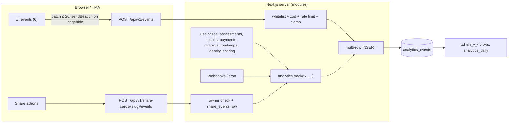

# 11 — Analytics events, metrics and experiments

> Scope: the analytics event envelope, the complete event catalog (brief §11 whitelist + `result_feedback_submitted`
> from 02 D2), emission paths, funnel and KPI definitions as SQL, admin dashboard metrics, automated flags,
> the experiment framework, and event retention/partitioning. Source of truth: the decisions brief (§0, §2, §11).
> Consistent with `01-architecture.md` (§3.3 module APIs, §6 rate limits, §11 observability, §12.2 settings, §15
> scaling), `02-mvp-spec.md` (§3 metrics/targets, F18 admin, F21 pipeline incl. D31 client whitelist, F22 feedback),
> `04-database-erd.md` (`analytics_events`, `experiments`, `experiment_assignments`, §14.4 deletion, §16
> partitioning; J1 camelCase jsonb keys, J3 experiment keys) and `09-viral-referral.md` (loops, referral pipeline, K).
>
> Lines marked **Decision:** are made here where the brief and the earlier sections are silent.

## Contents

1. [Principles](#1-principles)
2. [Envelope](#2-envelope)
3. [Emission paths](#3-emission-paths)
4. [Event catalog](#4-event-catalog)
5. [Identity resolution and exclusions](#5-identity-resolution-and-exclusions)
6. [Funnel and KPI definitions](#6-funnel-and-kpi-definitions)
7. [Admin dashboard metrics](#7-admin-dashboard-metrics)
8. [Automated flags](#8-automated-flags)
9. [Experiment framework](#9-experiment-framework)
10. [Retention, partitioning and deletion](#10-retention-partitioning-and-deletion)
11. [Data quality checks](#11-data-quality-checks)
12. [Decisions for cross-document alignment](#12-decisions-for-cross-document-alignment)

---

## 1. Principles

- **Whitelist only.** The set of names in §4 is closed; anything else is rejected (client: 400; server: a TypeScript
  union, so unknown names do not compile). Adding an event = edit brief-aligned docs + the union + this catalog.
- **Server is authoritative.** Events that describe state the client must never be trusted for (assessment start and
  completion, payments, unlocks, referrals, roadmap state, levels) are emitted **only by the server, in the same DB
  transaction** as the state change. Client events describe UI intent only (02 D31).
- **No PII.** Identity is the opaque `user_id` uuid. Never: names, display names, phone, email, Telegram id or
  username, raw IP or UA (not even hashed — hashes live in their own tables), free text, full URLs with query strings,
  answer option keys, item credit, card display names (02 AC-F21-03, 04 §14.4).
- **Honest metrics.** Every rate is shown with its numerator, denominator and, below 1,000, a 95 % Wilson interval
  (02 §3.1). Below a minimum denominator a metric shows "Not enough reliable information." instead of a number.
- **Analytics never gates product behaviour.** Losing an event must not break a user flow; server events share the
  transaction (so they are as durable as the state), client events are best-effort.

---

## 2. Envelope

Every row in `analytics_events` (04 §11) has the same envelope. Property keys inside `properties` are camelCase (04 J1).

| Field | Column | Type | Set by | Rules |
|-------|--------|------|--------|-------|
| `name` | `name` | text | emitter | Whitelisted (§4); `^[a-z][a-z0-9_]{1,63}$` |
| `occurred_at` | `occurred_at` | timestamptz | server `now()`; client value clamped | Client: `least(received_at, greatest(clientTs, received_at − 72 h))`; `properties.clockAdjusted = true` when clamped (04 §16.2) |
| `received_at` | `received_at` | timestamptz | server | `now()` at insert |
| `user_id` | `user_id` | uuid \| null | server from session | Never from the client body. Null only for `share_card_viewed` by a visitor without a session and for client events sent before a session exists (session optional for the 6 client events). |
| anonymous flag | `properties.isAnonymous` | boolean | server | **Decision:** reserved envelope key stored in `properties` (no schema change): value of `users.is_anonymous` at emission; omitted when `user_id` is null. |
| `assessment_session_id` | `assessment_session_id` | uuid \| null | server | Set for assessment-scoped events (`test_started`, `question_answered`, `test_completed`, `retest_started`; also `teaser_viewed`, `result_viewed`, `payment_*` when the target is a result). |
| `channel` | `channel` | `web \| telegram \| mobile \| server` | server | Client events: session claim `ch` (or request context for sessionless). Server events triggered by a user request: the request's channel. Server events from webhooks/cron (`payment_paid`, `payment_failed`, `referral_*` caused by them): `server`, with `properties.userChannel` = channel of the payment/session. |
| `locale` | `locale` | text | server | Resolved request locale (next-intl); for webhook events the user's `users.locale`. |
| `country_code` | `country_code` | char(2) \| null | server | `users.country_code`, else the edge geo header (`x-vercel-ip-country`) at request time; the IP itself is never stored. |
| `profession_id` | `profession_id` | uuid \| null | server | Denormalized for funnels: the session's/result's profession, or the selected profession for `profession_selected`/`context_completed`. |
| `referral_code` | `referral_code` | text \| null | server | The **user's own attribution** code (`users.referred_by_code_id → code`) for every event of a referred user; for `share_card_viewed` the **card owner's** code; for `referral_*` the referrer's code. Never taken from the client body. |
| `experiment_variants` | `experiment_variants` | jsonb object | server | `{"<experiment key>": "<variant>"}` of the user's existing assignments in **running** experiments (no new assignment is created by emitting an event). Assessment-scoped events use the session snapshot `assessment_sessions.experiment_variants` merged over the user's assignments. |
| `properties` | `properties` | jsonb object | emitter | Per-event schema (§4), `.strict()` zod; ≤ 2 KB per client event, ≤ 8 KB stored (04). Reserved keys: `v` (schema version, default 1), `isAnonymous`, `clockAdjusted`, `clientEventId`, `userChannel`. |

TypeScript (server):

```ts
// src/modules/analytics/domain/events.ts
export type EventName =
  | 'landing_view' | 'language_selected' | 'category_selected' | 'profession_selected' | 'context_completed'
  | 'test_started' | 'question_answered' | 'test_completed' | 'teaser_viewed'
  | 'payment_started' | 'payment_paid' | 'payment_failed' | 'result_viewed'
  | 'share_clicked' | 'share_completed' | 'share_card_viewed'
  | 'referral_started' | 'referral_completed' | 'referral_paid'
  | 'roadmap_opened' | 'roadmap_accepted' | 'action_completed' | 'action_skipped'
  | 'retest_started' | 'account_linked' | 'result_feedback_submitted';

export const CLIENT_EVENTS = ['landing_view', 'language_selected', 'category_selected',
  'profession_selected', 'context_completed', 'roadmap_opened'] as const;           // POST /api/v1/events (02 D31)
export const SHARE_ENDPOINT_EVENTS = ['share_clicked', 'share_completed'] as const; // POST /share-cards/{slug}/events

// analytics.track(tx, name, { userId, sessionId?, professionId?, properties }) — validates properties with the
// per-event zod schema, fills the envelope from the request context, inserts in the caller's transaction.
```

---

## 3. Emission paths



| Path | Names | Validation | Limits | Delivery |
|------|-------|-----------|--------|----------|
| `POST /api/v1/events` | 6 client events | body `{events: [{name, clientEventId: uuid, clientTs: ISO, properties}]}`; name ∈ `CLIENT_EVENTS`, per-event zod `.strict()`; unknown name → 400 `EVENT_NOT_ALLOWED` for the whole batch | ≤ 20 events/request, ≤ 2 KB properties each, rate limit `events` 120/min per user or ip_hash (01 §6), fail open (drop) | Best-effort. Client queues in memory, flushes every 5 s or 10 events and on `pagehide` via `navigator.sendBeacon` (Bearer not possible in beacons, so TMA uses `fetch(…, {keepalive: true})`). |
| `POST /api/v1/share-cards/{slug}/events` | `share_clicked`, `share_completed` | owner of the card; `{event, method, template}` | rate limit `share_card_create` bucket | Synchronous; also writes `share_events`. |
| `analytics.track` in use cases | all server events | TS union + zod | none | Same transaction as the state change. |

**Decision (dedupe):** client events carry `clientEventId` (uuid v4) in `properties`; retries may duplicate rows, so
client-event metrics count **distinct users/sessions**, never raw rows, and the `analytics_daily` rollup counts
`distinct clientEventId` for client events. No unique index (hot insert path, partitioned table).

**Decision (landing_view entry pages):** `landing_view` fires once per page load of the **funnel entry page**:
S01 landing, or S04 when a visitor arrives directly from a share page CTA / `/r` redirect to a profession, or the TMA
first screen; `properties.page` says which. This keeps "test start rate" well-defined for share-driven traffic that
skips S01.

---

## 4. Event catalog

Types: `uuid`, `int`, `str(n)` (max length), `enum(...)`, `bool`, `?` = optional. Envelope fields from §2 are not
repeated. "Server" events are rejected if a client posts them (AC-F21-02).

### 4.1 Acquisition and test

| Event | Emitter | Trigger | Required properties | PII rules / notes |
|-------|---------|---------|---------------------|-------------------|
| `landing_view` | client (`/events`) | Entry page rendered (see §3) | `page: enum(landing, profession, tma_home)`, `entry: enum(direct, referral, share, tma, utm)`, `utmSource?: str(64)`, `utmMedium?: str(64)`, `utmCampaign?: str(64)`, `utmContent?: str(64)`, `utmTerm?: str(64)`, `referrerHost?: str(253)` | Host only for referrer (no path/query). UTM values truncated, control chars stripped. No full URL. |
| `language_selected` | client | User picks a language (picker, header switch) | `from: str(8) \| null`, `to: str(8)`, `source: enum(picker, header, tma_prompt)` | Auto-detection does not emit. |
| `category_selected` | client | Category card tapped (S03) | `categorySlug: str(64)`, `position: int` | — |
| `profession_selected` | client | Profession (+ specialization) confirmed (S04) | `professionSlug: str(64)`, `specializationSlug: str(64) \| null`, `isRegulated: bool` | Envelope `profession_id` filled server-side from the slug. |
| `context_completed` | client | Last context answer submitted, before session creation (02 D8) | `experience: enum(0, lt1, 1to3, 3to5, 5plus)`, `working: enum(yes, no, learning)`, `goal: enum(start, find_job, professional, increase_income, lead, expert)`, `timePerDay: enum(10, 20, 30, 60)`, `durationMs: int` | Self-reported context bands only; no free text. |
| `test_started` | server | `assessment_sessions` row inserted (01 §7.1) | `templateId: uuid`, `templateVersion: int`, `specializationId: uuid \| null`, `isRetest: bool`, `scoringModelVersion: str(32)`, `maxQuestions: int`, `targetQuestions: int` | Session id in envelope. |
| `question_answered` | server | Answer committed (01 §7.2) | `sequence: int`, `questionId: uuid`, `questionVersion: int`, `itemType: enum(knowledge, judgment, scenario, decision, self_report)`, `skillId: uuid`, `responseMs: int`, `speeding: bool` (`responseMs < 2500`) | **Never** option keys, credit, θ or SE (answer-key leakage and score leakage; 04). Server-measured `responseMs` (served_at → answered_at). |
| `test_completed` | server | Result finalized (01 §7.3), same tx as `assessment_results` insert | `resultId: uuid`, `nItems: int`, `durationMs: int`, `stopReason: enum(se_target, max_items)`, `assessedLevel: int(1..9)`, `levelRange: [int, int] \| null`, `confidence: enum(high, medium, low)`, `isRetest: bool`, `previousLevel: int \| null` (previous unlocked result, same profession), `speedingShare: number(0..1)`, `aiUsed: bool` | Level is internal (server-only table); never exposed through client-readable paths. No composite/θ (keeps the event small; they live in `assessment_results`). |
| `retest_started` | server | Session created with `retest_of_session_id` (in addition to `test_started`) | `retestOfSessionId: uuid`, `daysSincePrevious: int`, `usedEntitlement: bool`, `entitlementSource: enum(referral_reward, purchase, admin, promo) \| null` | — |

### 4.2 Result and payment

| Event | Emitter | Trigger | Required properties | PII rules / notes |
|-------|---------|---------|---------------------|-------------------|
| `teaser_viewed` | server | `GET /api/v1/results/{id}` served in teaser state | `resultId: uuid`, `priceId: uuid \| null`, `amountMinor: int \| null`, `currency: str(3) \| null`, `isFirstView: bool` | Price from the server price row shown in the CTA; null when no price (e.g. Stars hidden). |
| `payment_started` | server | `POST /api/v1/payments` returns a checkout (new **or reused** open payment) | `paymentId: uuid`, `productSlug: enum(full_report, deep_report, growth_os_monthly, verification_attempt)`, `provider: enum(click, payme, telegram_stars, stripe, mock)`, `amountMinor: int`, `currency: str(3)`, `targetType: str(32)`, `targetId: uuid`, `reused: bool` | Amount from the server price row. Already-unlocked targets do not emit (no checkout). |
| `payment_paid` | server | `created/pending → paid` transition, same tx as unlock (01 §7.4) | `paymentId: uuid`, `productSlug`, `provider`, `amountMinor: int`, `currency: str(3)`, `providerFeeMinor: int \| null`, `secondsToPay: int` (created → paid), `targetId: uuid` | Channel `server`, `userChannel` set. No card/wallet/phone data from provider payloads. |
| `payment_failed` | server | `→ failed` (provider cancel/decline, expiry cron) | `paymentId: uuid`, `productSlug`, `provider`, `reason: enum(expired, cancelled_by_user, declined, provider_error, amount_mismatch, other)`, `providerCode: str(32) \| null` | `providerCode` is the provider's numeric/state code only, never messages that might echo user input. |
| `result_viewed` | server | `GET /api/v1/results/{id}` served in unlocked (full) state | `resultId: uuid`, `unlockSource: enum(payment, referral_reward, subscription, admin, promo)`, `isFirstView: bool`, `hasAiReport: bool` | "Full" view only; teaser views are `teaser_viewed`. |
| `result_feedback_submitted` | server | `POST /api/v1/results/{id}/feedback` (02 F22) | `resultId: uuid`, `rating: enum(accurate, partly, inaccurate)`, `hasComment: bool`, `isEdit: bool` | Comment text stored only in `result_feedback`, never in analytics. |

### 4.3 Sharing and referrals

| Event | Emitter | Trigger | Required properties | PII rules / notes |
|-------|---------|---------|---------------------|-------------------|
| `share_clicked` | client (share-card endpoint; server-validated) | Share action tapped (03 S11) | `slug: str(32)`, `template: enum(story, square, telegram, og)`, `method: enum(native, telegram_web, telegram_message, telegram_story, download, copy_link)`, `cardKind: enum(level, locked, progress)` | Owner-checked. No display name. |
| `share_completed` | client (share-card endpoint) | Native share resolved / `shareMessage` or `shareToStory` callback success / download finished / link copied | same as `share_clicked` | Best-effort signal (an AbortError emits nothing). |
| `share_card_viewed` | server | `/s/{slug}` rendered for a non-bot, non-owner viewer (09 §4) | `slug: str(32)`, `cardKind`, `hadSession: bool`, `viewerLocale: str(8)` | `user_id` = viewer if a session exists, else null; envelope `referral_code` = owner's code. No referrer URL, no IP. |
| `referral_started` | server | `referrals` row inserted (`invited`) (09 §7.2) | `referralId: uuid`, `entry: enum(web_r, share_page, tma_start_param)`, `isValid: bool`, `invalidReason: str(32) \| null` | `user_id` = referred user; `referral_code` = referrer's code. Referrer id is not in the event (join via `referrals`). |
| `referral_completed` | server | referral reaches `completed` (first result of the referred user) | `referralId: uuid`, `isValid: bool`, `resultId: uuid` | Same identity rules. |
| `referral_paid` | server | referral reaches `paid` (first paid payment) | `referralId: uuid`, `isValid: bool`, `paymentId: uuid`, `productSlug` | Same identity rules. Refunds emit nothing here (09 §8). |

### 4.4 Growth, identity

| Event | Emitter | Trigger | Required properties | PII rules / notes |
|-------|---------|---------|---------------------|-------------------|
| `roadmap_opened` | client (`/events`) | Roadmap screen visible ≥ 1 s | `roadmapId: uuid`, `status: enum(proposed, active, completed)`, `source: enum(result, home, nav, notification)` | — |
| `roadmap_accepted` | server | `proposed → active` | `roadmapId: uuid`, `resultId: uuid`, `fromLevel: int`, `toLevel: int`, `paceMinutes: int`, `generator: enum(rules, ai)` | — |
| `action_completed` | server | `roadmap_items` status → `done` (idempotent: emits only on actual transition) | `roadmapId: uuid`, `roadmapItemId: uuid`, `actionId: uuid \| null`, `dayNumber: int \| null`, `weekNumber: int`, `phase: enum(foundation, practice, application, verification)`, `isMain: bool`, `durationMinutes: int` | User notes/evidence never included. |
| `action_skipped` | server | status → `skipped` | same as `action_completed` | — |
| `account_linked` | server | Telegram sign-in from web (link token), phone/email OTP verified, or anon → Telegram merge | `method: enum(telegram, phone, email)`, `merged: bool`, `fromAnonymous: bool` | **Never** the phone, email, Telegram id or username. `user_id` = surviving (target) user. |

Total: 26 events (25 from the brief + `result_feedback_submitted`, 02 D2).

---

## 5. Identity resolution and exclusions

Events are append-only and not rewritten on merge (01 §3.5); queries canonicalize. Merge chains are followed up to
depth 5 (01 §3.5).

```sql
-- Canonical user mapping (view; materialize later if slow)
create view public.analytics_v_user_canon as
with recursive chain(user_id, cur, depth) as (
  select id, id, 0 from public.users
  union all
  select c.user_id, u.merged_into_user_id, c.depth + 1
    from chain c join public.users u on u.id = c.cur
   where u.merged_into_user_id is not null and c.depth < 5
)
select distinct on (user_id) user_id, cur as canon_user_id
  from chain order by user_id, depth desc;

-- Excluded users (02 §3.1): admins, configured ids, mock-only payers
create view public.analytics_v_excluded as
select u.id as user_id from public.users u where u.role = 'admin'
union
select (jsonb_array_elements_text(value))::uuid from public.app_settings where key = 'analytics.excluded_user_ids'
union
select p.user_id from public.payments p group by p.user_id
having bool_and(p.provider = 'mock') and count(*) > 0;

-- Base event view used by every metric below
create view public.analytics_v_events as
select e.*, c.canon_user_id as cuid
  from public.analytics_events e
  left join public.analytics_v_user_canon c on c.user_id = e.user_id
 where e.user_id is null
    or c.canon_user_id not in (select user_id from public.analytics_v_excluded);
```

Notation below: `ev` = `analytics_v_events`; `:from`, `:to` = report window (by `occurred_at`); filters
(channel, locale, country, profession, experiment variant `experiment_variants ->> :key = :variant`) are appended
to the **denominator** event set and inherited by the numerator through the join key.

---

## 6. Funnel and KPI definitions

All rates: numerator ⊆ denominator by construction (joined on the same key); Wilson 95 % interval when the
denominator < 1,000; hidden below the minimum denominator in §8.

### 6.1 Test start rate

```sql
-- users who started a test within 7 days of their first landing_view in the window
with l as (select cuid, min(occurred_at) t0 from ev where name = 'landing_view'
            and occurred_at >= :from and occurred_at < :to and cuid is not null group by cuid)
select count(*) filter (where exists (select 1 from ev s where s.cuid = l.cuid and s.name = 'test_started'
                                      and s.occurred_at between l.t0 and l.t0 + interval '7 days'))::numeric
       / nullif(count(*), 0) as test_start_rate
  from l;
```

**Decision:** landing views without any session (`user_id` null — the user left before the first API call) are
counted separately as `anonymous_bounces` and **excluded** from this denominator, because they cannot be joined; the
dashboard shows both numbers. (Most users get a session on landing hydration, 02 D25, so the gap should be small.)

### 6.2 Completion rate

```sql
select count(distinct c.assessment_session_id)::numeric / nullif(count(distinct s.assessment_session_id), 0)
  from ev s
  left join ev c on c.assessment_session_id = s.assessment_session_id and c.name = 'test_completed'
 where s.name = 'test_started' and s.occurred_at >= :from and s.occurred_at < :to
   and s.occurred_at < now() - interval '24 hours';   -- sessions old enough to have expired (02 D11)
```

Companion: **median test duration** = `percentile_cont(0.5) within group (order by (properties->>'durationMs')::int)`
over `test_completed`. Per-question drop-off lives in F18's Questions view (from `assessment_sessions` /
`assessment_answers`).

### 6.3 Teaser → payment conversion

```sql
with t as (select distinct properties->>'resultId' rid from ev where name = 'teaser_viewed'
            and occurred_at >= :from and occurred_at < :to)
select
  count(*) filter (where exists (select 1 from ev p where p.name = 'payment_started'
                                 and p.properties->>'targetId' = t.rid))::numeric / nullif(count(*), 0)
    as teaser_to_checkout,
  count(*) filter (where exists (select 1 from public.result_unlocks u where u.result_id = t.rid::uuid
                                 and u.source = 'payment'))::numeric / nullif(count(*), 0)
    as teaser_to_paid
from t;
```

`teaser_to_paid` reads `result_unlocks` (source of truth; excludes refunded because refund deletes the unlock, 01 §7.4).

### 6.4 Payment success rate

```sql
select count(distinct pd.properties->>'paymentId')::numeric / nullif(count(distinct ps.properties->>'paymentId'), 0)
  from ev ps
  left join ev pd on pd.name = 'payment_paid' and pd.properties->>'paymentId' = ps.properties->>'paymentId'
 where ps.name = 'payment_started' and ps.occurred_at >= :from and ps.occurred_at < :to
   and ps.occurred_at < now() - interval '13 hours';  -- longest provider expiry (Payme 12 h) has passed
```

Breakdowns: by `provider`, `userChannel`, `payment_failed.reason`. Reconciled nightly with `payments` (§11).

### 6.5 Share rate

```sql
with v as (select distinct cuid from ev where name = 'result_viewed' and occurred_at >= :from and occurred_at < :to)
select count(*) filter (where exists (select 1 from ev s where s.cuid = v.cuid and s.name = 'share_completed'
                                     and s.occurred_at >= :from))::numeric / nullif(count(*), 0)
  from v;
```

Companions: `share_clicked → share_completed` ratio per `method`/`template`; views per card
(`share_card_viewed` / distinct shared slugs).

### 6.6 Referral conversion

```sql
select count(*) filter (where r.status in ('completed', 'paid'))::numeric / nullif(count(*), 0) as to_completed,
       count(*) filter (where r.status = 'paid' and p.status = 'paid')::numeric / nullif(count(*), 0) as to_paid
  from public.referrals r
  left join public.payments p on p.id = r.first_payment_id
 where r.is_valid and r.invited_at >= :from and r.invited_at < :to
   and r.invited_at < now() - interval '30 days';     -- mature only
```

(Event-based equivalent: valid `referral_completed` / valid `referral_started`; both agree by construction —
checked in §11.)

### 6.7 Viral coefficient K (definition in 09 §13)

```sql
with cohort as (                                   -- activation = first test_completed
  select cuid, min(occurred_at) activated_at from ev where name = 'test_completed' group by cuid
), c as (select * from cohort where activated_at >= :week_start and activated_at < :week_start + interval '7 days'
          and activated_at < now() - interval '60 days'),
inv as (
  select r.* from public.referrals r join c on c.cuid = r.referrer_user_id
   where r.is_valid and r.invited_at <= c.activated_at + interval '30 days')
select (select count(*) from c)                                        as activated,
       count(*)                                                        as invites,
       count(*)::numeric / nullif((select count(*) from c), 0)         as i,
       count(*) filter (where completed_at <= invited_at + interval '30 days')::numeric / nullif(count(*), 0)
                                                                       as c_completed,
       count(*) filter (where completed_at <= invited_at + interval '30 days')::numeric
         / nullif((select count(*) from c), 0)                         as k_completed,
       count(*) filter (where paid_at <= invited_at + interval '30 days'
                        and exists (select 1 from public.payments p where p.id = inv.first_payment_id
                                    and p.status = 'paid'))::numeric
         / nullif((select count(*) from c), 0)                         as k_paid
  from inv;
```

`referrals.referrer_user_id` is already canonical (re-pointed on merge). Hidden when `activated < 100` or
`invites < 30` (09 §13.3); labelled "lower bound".

### 6.8 D7 / D30 retention

**Decision:** "active" = any event from this set with the user as actor: the 6 client events, `test_started`,
`question_answered`, `teaser_viewed`, `result_viewed`, `payment_started`, `share_clicked`, `share_completed`,
`roadmap_accepted`, `action_completed`, `action_skipped`, `retest_started`, `account_linked`,
`result_feedback_submitted`. Excluded: webhook/cron-driven (`payment_paid`, `payment_failed`), events caused by other
people (`referral_*`, `share_card_viewed` of one's card) and `test_completed` (implied by answers).

Cohort = first `test_started` day (02 §3.1). D7 = active in days [7, 14); D30 = active in days [30, 37) (**Decision**,
week-window variant matching 02's D7 definition).

```sql
with cohort as (select cuid, min(occurred_at)::date d0 from ev where name = 'test_started' group by cuid)
select c.d0,
       count(*) as users,
       count(*) filter (where exists (select 1 from ev a where a.cuid = c.cuid and a.name = any(:active_names)
         and a.occurred_at >= c.d0 + 7 and a.occurred_at < c.d0 + 14))::numeric / count(*) as d7,
       count(*) filter (where exists (select 1 from ev a where a.cuid = c.cuid and a.name = any(:active_names)
         and a.occurred_at >= c.d0 + 30 and a.occurred_at < c.d0 + 37))::numeric / count(*) as d30
  from cohort c
 where c.d0 >= :from and c.d0 < :to and c.d0 < current_date - 37
 group by c.d0;
```

### 6.9 Level-up rate

```sql
-- among completed retests that have a previous unlocked level in the same profession
select count(*) filter (where (properties->>'assessedLevel')::int > (properties->>'previousLevel')::int)::numeric
       / nullif(count(*), 0) as level_up_rate
  from ev
 where name = 'test_completed' and (properties->>'isRetest')::boolean
   and properties ? 'previousLevel' and properties->>'previousLevel' is not null
   and occurred_at >= :from and occurred_at < :to;
```

Shown alongside the share of retests with `confidence in (high, medium)`; a level-up at low confidence is reported but
not celebrated in-product (copy says "dastlabki").

### 6.10 Main KPI — Verified Level Progress (VLP)

The product unit is progress (brief §0), so the north-star metric is **verified level-ups**, not tests or revenue.

```
VLP_month = distinct (user, profession) pairs with a level_history row
            kind = 'verified' in the month AND level > greatest(prior verified level, assessed level at roadmap start)
          / distinct (user, profession) pairs with an active roadmap at any point in the month
```

```sql
with active as (
  select distinct r.user_id, r.profession_id, r.from_level
    from public.roadmaps r
   where r.status in ('active', 'completed') and r.started_at < :month_end
     and coalesce(r.completed_at_or_archived_at, :month_end) >= :month_start   -- implementation: status history
), ups as (
  select distinct h.user_id, h.profession_id
    from public.level_history h join active a using (user_id, profession_id)
   where h.kind = 'verified' and h.recorded_at >= :month_start and h.recorded_at < :month_end
     and h.level > greatest(a.from_level, coalesce((select max(p.level) from public.level_history p
           where p.user_id = h.user_id and p.profession_id = h.profession_id and p.kind = 'verified'
             and p.recorded_at < h.recorded_at), 0)))
select (select count(*) from ups)::numeric / nullif((select count(*) from active), 0) as vlp;
```

**Decision:** while `features.verification = false`, the dashboard shows the proxy **Assessed Level Progress
(ALP)** — same formula with `kind = 'assessed'`, only results with confidence `high`/`medium`, and only retests taken
≥ `retest_cooldown_days` after the previous result — clearly labelled "proxy (assessed, not verified)". VLP and ALP
are never summed or shown as one series. (`roadmaps` has no `completed_at` column in the brief; the implementation
reads the activity interval from `audit_logs`/status timestamps — data-model section to confirm.)

### 6.11 Other product metrics (02 §3.2)

| Metric | Formula |
|--------|---------|
| Perceived accuracy | (`rating in (accurate, partly)`) / all `result_feedback_submitted` (latest per result) |
| Plan start rate | results with `roadmap_accepted` / results with `result_viewed` (first view) |
| Action completion | `action_completed` / (`action_completed` + `action_skipped`) on main items, and main items done by day 7 / main items due by day 7 |
| Referral visits per sharer | valid `referral_started` / users with `share_completed` (or invite link copy) |
| Retest rate | users with `retest_started` within 60 days of first unlocked result / users with an unlocked result ≥ 60 days ago |
| Revenue per tester | Σ `payment_paid.amountMinor` (per currency, never summed across currencies) / users with `test_completed` |

---

## 7. Admin dashboard metrics

Screens per 02 F18. Every number: value, numerator/denominator, interval (if n < 1,000), window, filters, and an
experiment-variant filter.

| Screen | Metrics |
|--------|---------|
| Overview | First-100 cohort panel (02 §3.2 targets vs actual); VLP (or ALP proxy); tests started/completed today, 7 d; paid unlocks 7 d; active flags (§8); integrity counters (02 §3.3) |
| Funnel | landing → language → category → profession → context → started → completed → teaser → payment_started → paid → result_viewed → share_completed → referral_started; step conversion and absolute counts; anonymous bounces; filters channel/locale/country/profession/variant |
| Assessment | completion rate, median duration, n items distribution, stop reason share, confidence distribution, speeding share, level distribution per profession (counts only; no percentiles unless ≥ `benchmark_min_sample`) |
| Questions | per item (02 F18): serves, drop-off, median `responseMs`, option distribution, credit mean, flags |
| Payments | started, success rate by provider/channel, failure reasons, median `secondsToPay`, refunds, open > 30 min |
| Unit economics | gross, provider fee, AI cost, infra estimate, referral reward cost (09 §10.3), net per payment; per currency |
| Growth loops | share rate, method/template mix, views per card, referral funnel (invited/started/completed/paid, valid vs invalid by reason), referral conversion, K_completed/K_paid per mature cohort with i/s/v decomposition, cycle time, rewards granted/consumed, anomaly flags (09 §9.4) |
| Retention | D7/D30 by cohort week, channel, profession; plan start rate; action completion; retest rate; level-up rate |
| Quality | perceived accuracy by profession, feedback comments (admin-only), AI fallback rate, AI cost per report |
| Experiments | per experiment: status, assignment counts per variant, SRM check, primary metric with interval, guardrails, minimum-sample progress (§9) |

---

## 8. Automated flags

Computed by the `analytics-flags` cron (hourly) into the admin "active flags" list (**Decision:** stored in
`app_settings` key `analytics.flags_state` as the last evaluation snapshot — no new table). A flag fires only if the
denominator ≥ the minimum; it clears automatically when the metric recovers for two consecutive evaluations. Thresholds
live in `app_settings.analytics.flag_thresholds` (02 D1) and default to:

| Flag key | Metric (window) | Fires when | Min denominator | Routes to (brief §11) | Suggested first look |
|----------|-----------------|-----------|-----------------|------------------------|----------------------|
| `low_start_rate` | test start rate (7 d) | < 20 % | 50 landing users | Landing | headline/CTA experiment |
| `low_completion` | completion rate (7 d) | < 60 % | 30 starts | **Questions** | per-item drop-off; `assessment.length` |
| `slow_test` | median duration (7 d) | > 6 min | 30 completions | Questions / question count | longest items |
| `low_teaser_checkout` | teaser → checkout (7 d) | < 20 % | 30 teasers | **Teaser / paywall** | `teaser.layout`, `payment.moment` |
| `low_teaser_paid` | teaser → paid (7 d) | < 10 % | 30 teasers | Teaser / paywall | — |
| `low_payment_success` | payment success (7 d) | < 70 % | 20 payments | Provider config | failure reasons by provider |
| `low_accuracy` | perceived accuracy (14 d) | < 50 % | 20 ratings | Scoring / content | worst professions |
| `low_share` | share rate (7 d) | < 15 % | 30 full viewers | **Share card** | `share.card`, entry points |
| `low_visits_per_sharer` | referral visits per sharer (14 d) | < 1.0 | 20 sharers | Share card / loop | card CTA, OG preview |
| `low_referral` | referral conversion (30 d, mature) | < 20 % | 30 referred | **Referral loop** | share page → S04 path |
| `item_dropoff` | per item (all time) | drop-off > 10 % | 20 serves | Questions | 02 F18 item flags |
| `item_slow` | per item | median `responseMs` > 60 s | 20 serves | Questions | — |
| `item_dominant_option` | per item | one option > 90 % | 50 serves | Questions | — |
| `item_dead_option` | per item | an option never chosen | 50 serves | Questions | — |
| `client_events_dropped` | rejected/accepted client events (1 h) | > 5 % | 200 events | Engineering | schema drift |
| `event_reconcile_mismatch` | §11 checks | any non-zero | — | Engineering | — |

```json
{
  "low_start_rate": { "lt": 0.20, "minDenominator": 50, "windowDays": 7 },
  "low_completion": { "lt": 0.60, "minDenominator": 30, "windowDays": 7 },
  "slow_test": { "gtSeconds": 360, "minDenominator": 30, "windowDays": 7 },
  "low_teaser_checkout": { "lt": 0.20, "minDenominator": 30, "windowDays": 7 },
  "low_teaser_paid": { "lt": 0.10, "minDenominator": 30, "windowDays": 7 },
  "low_payment_success": { "lt": 0.70, "minDenominator": 20, "windowDays": 7 },
  "low_accuracy": { "lt": 0.50, "minDenominator": 20, "windowDays": 14 },
  "low_share": { "lt": 0.15, "minDenominator": 30, "windowDays": 7 },
  "low_visits_per_sharer": { "lt": 1.0, "minDenominator": 20, "windowDays": 14 },
  "low_referral": { "lt": 0.20, "minDenominator": 30, "windowDays": 30 }
}
```

Flags are suggestions; actions (retiring an item, changing a teaser) are admin decisions with audit logs. Flags
are evaluated per profession too when the per-profession denominator meets the minimum.

---

## 9. Experiment framework

### 9.1 Model

`experiments(key, status draft|running|stopped, variants [{key, weight}], targeting)` and
`experiment_assignments(experiment_id, user_id, variant, assigned_at)` (04). Keys follow 04 J3
(`[a-z0-9-]` segments joined by `.`).

| Key | Surface | Variants (example) | Primary metric | Notes |
|-----|---------|--------------------|----------------|-------|
| `landing.headline` | S01 headline | `control`, `b` | test start rate | copy only |
| `landing.cta` | S01 CTA text | `control`, `b` | test start rate | |
| `assessment.length` | stop rule target | `control` (target 12), `short` (target 10) | completion rate; guardrail: confidence high/medium share, perceived accuracy | snapshot on `assessment_sessions.experiment_variants`; scoring model unchanged |
| `teaser.layout` | S08 teaser | `control`, `b` | teaser → paid | never fake urgency, never reveal locked values (02 D12) |
| `payment.moment` | when the paywall appears | `control` (after teaser), `b` (teaser then CTA after strongest-skill detail) | teaser → paid | |
| `result.design` | S10 layout | `control`, `b` | share rate, plan start rate | |
| `share.card` | card visual / default template | `control`, `b` | share rate; secondary: views per card, K_completed | renders from the same `public_payload` |
| `price.full-report` | price row | price variants via `prices.experiment_variant` | teaser → paid × amount (revenue per teaser) | the amount always comes from the server price row; the `payments.price_id` records it |

Not experimentable (**Decision**): scoring formulas and level thresholds (users must be comparable), privacy defaults
on the card (name stays off), disclaimers, any variant with urgency/scarcity/fake percentiles (brief §0). The admin
experiment form validates the key against an allowlist `app_settings.experiments.allowed_keys`.

### 9.2 Sticky assignment (server-side only)

```ts
// src/modules/experiments/domain/assign.ts — pure
import { createHash } from 'node:crypto';

export function bucketOf(experimentKey: string, userId: string): number {
  // brief §11: hash(experiment_key + user_id); ':' separator avoids key/id concatenation ambiguity
  const h = createHash('sha256').update(`${experimentKey}:${userId}`).digest();
  return h.readUInt32BE(0) % 10_000;                     // 0..9999, uniform enough for weights in 0.01 % steps
}

export function pickVariant(variants: { key: string; weight: number }[], bucket: number): string {
  // weights are integers summing to 100 (04 validator)
  let acc = 0;
  for (const v of variants) { acc += v.weight * 100; if (bucket < acc) return v.key; }
  return variants[variants.length - 1].key;
}
```

`experiments.getVariant(userId, key, targetingCtx)`:

1. Experiment not `running` → `null` (caller renders the default experience; nothing stored).
2. Targeting (`channels`, `locales`, `countries`, `professionSlugs`) not matched → `null`.
3. Existing row in `experiment_assignments` → return it (sticky even if weights change later).
4. Else compute `pickVariant(variants, bucketOf(key, canonicalUserId))`,
   `insert … on conflict (experiment_id, user_id) do nothing`, read back (concurrency-safe, 04).

**Exposure = assignment.** **Decision:** `getVariant` is called only at the point where the variant changes what the
user sees (lazy), so the assignment row's `assigned_at` is the exposure log; no separate exposure event is added to
the whitelist. Analysis population for an experiment = users with an assignment row. Code review rule: no
`getVariant` calls "just in case" (they would dilute the experiment).

Variants on events: the envelope's `experiment_variants` carries the user's assignments in running experiments;
assessment-scoped events use the session snapshot so a mid-test assignment change cannot occur.

Merges: target user's assignment wins (01 §3.5). **Decision:** users whose merged-away identity had a *different*
variant in the same experiment are flagged `contaminated` in analysis (computed by joining assignments of merged
users) and excluded from that experiment's readout.

Weights changes while running are refused by admin validation (they would break the sample ratio); to change
allocation, stop and start a new experiment key with a version suffix (`teaser.layout-2`).

### 9.3 Analysis rules

| Rule | Value |
|------|-------|
| Unit of analysis | canonical user (assignment), metric computed only on events after `assigned_at` |
| Minimum sample (per variant) | `n ≥ max(n_power, 300 assigned users, 50 primary conversions)`, where `n_power = (z_{1−α/2} + z_{1−β})² · (p₁(1−p₁) + p₂(1−p₂)) / δ²` with α = 0.05, power 0.8 (factor 7.85), `p₁` = baseline, `δ` = minimum detectable absolute effect set at experiment creation. Example arithmetic: `p₁ = 0.30`, `δ = 0.05` → `7.85 × (0.21 + 0.2275) / 0.0025 ≈ 1,374` per variant. |
| Minimum duration | ≥ 7 full days (weekly cycle) and until the minimum sample is reached; results are hidden ("collecting data — n/N") before both hold |
| Test | two-sided two-proportion z-test at the fixed horizon; 95 % intervals for the difference; Holm correction with > 2 variants |
| Peeking | interim views show counts and guardrails only; the primary metric's p-value/interval appears only at the planned horizon (fixed-horizon design) |
| SRM | chi-square test of assigned counts vs weights; p < 0.001 → experiment marked `invalid_srm`, results suppressed |
| Guardrails (all experiments) | payment success rate, completion rate, perceived accuracy, refund rate, API 5xx rate, share-card revoke rate. A guardrail worse in the treatment by more than its tolerance (default: 5 percentage points, or any increase in refund rate with p < 0.05) raises flag `experiment_guardrail` and suggests stopping; an admin decides |
| Ethics guardrail | any variant found to use urgency, shame or fake numbers is stopped regardless of results |
| Decision record | on stop, the admin records `{winner, rationale}` in `experiments.description` history via audit log |

### 9.4 Lifecycle

```mermaid
stateDiagram-v2
    [*] --> draft: admin creates (key in allowlist, weights sum 100, MDE, primary metric)
    draft --> running: start (started_at), weights locked
    running --> stopped: admin stop or guardrail decision (stopped_at)
    stopped --> [*]: winner shipped as default via code or price row; key never reused
```



---

## 10. Retention, partitioning and deletion

Aligned with 04 §14.5 and §16.

| Item | Rule |
|------|------|
| Raw events | 13 months in `analytics_events`, then deleted (batched delete now; monthly partition drop after partitioning) |
| Rollup | `analytics_daily` (04 §16.3) kept forever: `(day, name, channel, locale, country_code, profession_id, experiment_variants) → events, users`; written by the `analytics-rollup` cron daily 02:40 UTC for `day = current_date − 1` and re-run for the previous 3 days (late client events within the 72 h clamp) |
| Partitioning trigger | `analytics_events` > 20M rows, dashboard queries > 2 s, or DB CPU > 60 % sustained (01 §15) |
| Partition scheme | monthly `range (occurred_at)`, `analytics_events_yYYYYmMM` + default partition; 3 months pre-created; cron `analytics-partitions` creates ahead and drops partitions older than 13 months after confirming rollups exist for every day in them |
| Indexes | `(name, occurred_at)`, `(user_id, occurred_at)`, `(assessment_session_id)` (04); **Decision:** add expression index `((properties->>'resultId')) where name in ('teaser_viewed','result_viewed','payment_started')` only if §6.3 queries exceed 2 s |
| Long-range metrics | Funnels, retention and K need raw events and are computed only within the 13-month window; beyond it, dashboards show daily counts from `analytics_daily` |
| Deletion request (04 §14.4) | Events kept pseudonymous (no PII by rule); `user_id` stays (opaque). **Decision:** none of the event properties are free text, so nothing needs nulling; the deleted user is excluded from future cohort readouts via `users.deleted_at` only if the admin chooses "exclude deleted" (default: include, since their past behaviour was real) |
| Access | RLS server-only (brief §5); admin reads through `admin_v_*` views via the server; exports (CSV) contain no PII and are audit-logged |

---

## 11. Data quality checks

Run by the nightly `integrity` job (01 §11) next to 02 §3.3 counters; any mismatch raises
`event_reconcile_mismatch`.

| Check | Expectation |
|-------|-------------|
| `payment_paid` events vs `payments.status in ('paid','refunded')` with `paid_at` in the day | equal counts |
| `test_completed` events vs `assessment_results` created in the day | equal counts |
| `test_started` events vs `assessment_sessions.started_at` in the day | equal counts |
| `referral_started` (valid) vs `referrals` (valid, `invited_at` in the day) | equal counts |
| Events with unknown `name` | 0 (CHECK + whitelist) |
| Client events with `clockAdjusted` | < 5 % of client events (else flag clock/queue bug) |
| Default partition row count (after partitioning) | 0 |
| Events whose `properties` contain keys outside the per-event schema | 0 (sampled 1,000/day validation with the zod schemas) |

Integration test (AC-F18-01): for a seeded dataset, every §6 metric equals the direct SQL in this document.

---

## 12. Decisions for cross-document alignment

| # | Decision | Affects |
|---|----------|---------|
| A1 | Anonymous flag stored as reserved `properties.isAnonymous` (no new column); reserved keys `v`, `isAnonymous`, `clockAdjusted`, `clientEventId`, `userChannel` | 04 `analytics_events`, analytics module |
| A2 | `referral_code` envelope = the user's own attribution code; for `share_card_viewed` the card owner's; for `referral_*` the referrer's | analytics, referrals, sharing |
| A3 | Webhook/cron-originated events use `channel = 'server'` with `properties.userChannel` | payments, analytics |
| A4 | `landing_view` fires on the funnel entry page (S01, S04 direct entry, TMA first screen) with `properties.page` | 02 AC-F01-04, 03 S01/S04 |
| A5 | Client events carry `clientEventId`; metrics count distinct users/sessions; no unique index | analytics |
| A6 | `question_answered` properties: `sequence, questionId, questionVersion, itemType, skillId, responseMs, speeding` — never option keys/credit | 04 example `{sequence, responseMs}` extended |
| A7 | `test_completed` carries `assessedLevel`, `previousLevel`, `confidence`, `isRetest` so level-up rate is event-computable | assessments, results |
| A8 | Retention "active" event set (§6.8); D30 = days [30, 37) | 02 §3.2 (D7 definition kept) |
| A9 | Main KPI = Verified Level Progress (VLP) from `level_history`; ALP proxy while verification is off, never merged | admin overview, 02 §3 |
| A10 | Flags evaluated hourly by `analytics-flags`, snapshot in `app_settings.analytics.flags_state`, threshold JSON in `analytics.flag_thresholds` | 01 §12.2, admin |
| A11 | Exposure = lazy assignment (no exposure event); contaminated merged users excluded; weight changes on running experiments refused | experiments module, admin |
| A12 | Experiment hash `sha256(key + ':' + userId)`, first 4 bytes mod 10,000, integer weights × 100 | experiments domain |
| A13 | Minimum sample/duration rules, fixed-horizon analysis, SRM p < 0.001, guardrail set (§9.3) | admin experiments screen |
| A14 | Non-experimentable: scoring, thresholds, card privacy defaults, disclaimers; key allowlist `app_settings.experiments.allowed_keys` | experiments, 01 §12.2 |
| A15 | `analytics-rollup` daily cron with 3-day re-run; `analytics-partitions` drops only after rollup coverage verified | 01 §14 jobs, 04 §16 |
| A16 | `roadmaps` needs an activity interval (e.g. `completed_at`/`archived_at` or status timestamps) to compute VLP's denominator exactly | 04 roadmaps (confirm) |
