# 13 — Build Phases, Validation Milestone and Scale Gates

> How LEVEL gets built: phases 0–9, each with scope, deliverables, exit criteria and risks; the MVP launch; the
> validation milestone that decides whether to keep growing; scale gates from 1k to 1M users; and an explicit
> DO-NOT-BUILD-YET list. Architecture references point to `01-architecture.md` (§n) and `12-folder-structure.md`;
> feature and acceptance-criteria references (F/AC/D numbers) point to `02-mvp-spec.md`; screens (S numbers) to
> `03-user-flows.md`. **Decision:** marks choices the brief does not make.

---

## 1. Phase map

```mermaid
flowchart LR
    P0["P0 Docs"] --> P1["P1 Foundation"]
    P1 --> P2["P2 Catalog + content"]
    P1 --> P3["P3 Assessment + scoring + API"]
    P2 --> P3
    P3 --> P4["P4 Result engine"]
    P4 --> P5["P5 Payments + unlocks"]
    P5 --> P6["P6 Share + OG + referrals"]
    P6 --> CB["Closed beta checkpoint"]
    P6 --> P7["P7 Analytics, experiments, admin"]
    CB --> P8["P8 Growth OS home"]
    P7 --> P8
    P8 --> P9["P9 Hardening"]
    P9 --> L["MVP launch<br/>(02 §10 release gates)"]
    L --> V{"Validation milestone<br/>first 100 starts (02 §3)"}
    V -->|fail| IT["Fix the failing gate only"]
    IT --> V
    V -->|pass| G1["Gate 1k"]
    G1 --> G10["Gate 10k"]
    G10 --> G100["Gate 100k"]
    G100 --> G1M["Gate 1M"]
```

| Phase | Size (relative) | Can overlap with |
|-------|-----------------|------------------|
| P0 Docs | S | — |
| P1 Foundation | L | P2 content authoring (JSON files need only the schemas) |
| P2 Catalog + content | XL (10 professions × ~40+ items × 3 languages) | P1, P3 |
| P3 Assessment + scoring | L | P2 (engine tests use a synthetic fixture profession) |
| P4 Result engine | M | — |
| P5 Payments + unlocks | L (+ merchant onboarding, paperwork starts in P1) | P6 design |
| P6 Share + referrals | M | P7 |
| P7 Analytics + admin | M | P6, P8 |
| P8 Growth OS home | L | P7 |
| P9 Hardening | M | — |

**Decisions on sequencing:**
- The MVP launch (start of the first-100 cohort, `app_settings.launch.public_at`) happens only after P9, because
  02 §10 makes F01–F22 (including home/history/retest F17, linking/deletion F19 and admin F18) and the performance,
  accessibility and security gates part of the MVP Definition of Done.
- Analytics **capture** (table, `track()`, `POST /api/v1/events`) lands in P3 so every later phase is measured from day
  one; experiments tables and `getVariant()` also land in P3 (assessment length variant hook). Dashboards, experiment
  management and question analytics are P7.
- A **closed beta checkpoint** after P6 (≥ 30 invited testers on production with real payments enabled, all listed in
  `app_settings.analytics.excluded_user_ids`) catches completion and payment UX defects before P8 work is committed.
  It is a defect hunt, not a validation gate: nothing is concluded from its rates.

---

## 2. Definition of Done (applies to every phase)

A phase is done only when **all** of these pass on the phase's final commit:

| # | Gate | Command / evidence |
|---|------|--------------------|
| 1 | Typecheck | `pnpm typecheck` — 0 errors (TypeScript 6.0.x strict) |
| 2 | Lint | `pnpm lint` — 0 errors, 0 warnings (`--max-warnings=0`), includes layering bans and `max-lines` |
| 3 | Architecture | `pnpm check:arch` — module entry points, dependency map, no cycles, file-size limits |
| 4 | Unit tests | `pnpm test:unit` green; `domain/` line coverage ≥ 90 % (**Decision**) |
| 5 | Integration tests | `pnpm test:integration` green on Postgres 16 with emulated Supabase roles; `pnpm db:check-rls` green |
| 6 | E2E | `pnpm test:e2e` green for the phase's flows (chromium; projects `mobile-360`, `mobile-390`) |
| 7 | i18n / content | `pnpm i18n:check`, `pnpm content:lint-uz`, `pnpm content:validate` green when messages/content changed; banned-terms lint (02 E3) on new copy |
| 8 | Security review | Phase checklist below completed in the PR description; findings fixed or ticketed with severity ≤ low |
| 9 | Mobile review | Phase checklist below with Playwright screenshots (360×640, 390×844) + manual check in Telegram (Android and iOS) for TMA-visible screens |
| 10 | Docs | Architecture deltas reflected in `docs/architecture/*` in the same PR; the phase's 02 acceptance criteria referenced in the PR |

**Generic security checklist** (every phase, plus phase-specific items): server decides every sensitive state; new
tables have RLS + policies in the same migration; zod on every input; no secrets/PII in logs; rate limits on new
mutating endpoints; CSRF mode correct (cookie vs Bearer vs webhook); no answer keys or locked data in any client DTO;
no fabricated facts/sources/statistics in copy or content.

**Generic mobile checklist**: no horizontal scroll at 320–360 px; tap targets ≥ 48 px (primary buttons ≥ 52 px,
options ≥ 56 px — 03 §0.3); one primary action per screen, sticky above the keyboard and safe areas; readable at 200 %
text zoom; works in Telegram light and dark themes; Telegram BackButton/MainButton behave per 03 §0.1; slow-3G
throttled run shows skeletons, not blank screens; copy fits in uz, ru and en (Uzbek strings are often the longest).

---

## 3. Phases

### Phase 0 — Documentation

- **Scope:** MVP spec, user flows, architecture, data model, engines, payments, security, content, analytics, folder
  structure, build phases (`docs/architecture/`), consistent with the Decisions Brief.
- **Deliverables:** `docs/architecture/00–13`; decision logs per document; owner questions (Stars price in XTR,
  merchant contracts, daily AI budget, infra cost estimate for unit economics, support contact).
- **Exit criteria:** cross-read shows no contradiction between documents or with the brief; no invented
  statistics/URLs/benchmarks; owner sign-off. Typecheck/lint/tests/mobile: n/a. Security review: threat model reviewed.
- **Risks:** docs drift from code → architecture changes update docs in the same PR.

### Phase 1 — Foundation

- **Scope**
  - Scaffold: Next.js 16 App Router, React 19, TypeScript 6.0.x strict (not 7.x), Tailwind CSS 4 via
    `@tailwindcss/postcss`, ESLint 9 flat + `eslint-config-next` 16 + typescript-eslint, Vitest (projects unit and
    integration), Playwright 1.56.1 (chromium at `/opt/pw-browsers`), tsx, pnpm 10, Node 22 (**Decision**).
  - Tooling: CI workflow, `check:arch`, file-size check, `.env.example`, zod env schema with the `APP_ENV` production
    guards (01 §12).
  - Kernel (`src/lib`): db client + `withTx`, errors/envelope, logger + redaction, request id, rate limiter, audit log,
    settings reader, crypto helpers, localized-text resolver, money, event bus, Telegram initData verifier, LRU cache,
    clock, API client skeleton. Composition root: `defineRoute`, request context, bootstrap.
  - Migrations + RLS: `kernel_extensions`, `kernel_tables`, `catalog_reference`, `identity` (incl.
    `auth_sessions.device_hash`).
  - DB test harness: template database migrated once, per-worker clone, roles `anon`/`authenticated`/`service_role`,
    `auth.uid()` from `request.jwt.claims`, helpers `asAnon()` / `asUser(id)`.
  - i18n: next-intl with `[locale]` (uz default, ru, en), `src/proxy.ts`, namespaced messages, negotiation chain,
    S02 language sheet, `lint-uz`, banned-terms lint (02 E3).
  - UI kit: primitives in `src/components/ui`, app shell (480 px column, 16 px gutters), sticky CTA, Telegram provider
    (conditional `telegram-web-app.js` loading — 02 D28, theme params → tokens, BackButton/MainButton bridges,
    `isVersionAtLeast` gating, minimum `WebApp.version` 6.2 per 03 §0.6).
  - Identity: `POST /api/v1/session` (auth mode `ensure`, created on the first personal action), JWT HS256 via jose,
    `level_session` cookie + Bearer, `GET/PATCH /api/v1/me`, `/tma` bootstrap + `POST /api/v1/auth/telegram` (verify,
    find-or-create, merge with lifecycle participants, `start_param` grammar 02 D26), admin bootstrap login,
    `/api/v1/health`, `/api/v1/config`.
  - Landing skeleton in 3 locales; legal pages (terms, privacy, educational-assessment disclaimer) drafts.
  - External: start Click/Payme merchant onboarding; create staging + production Telegram bots.
- **Deliverables:** runnable app locally and on Vercel preview; staging Supabase project migrated; CI green.
- **Exit criteria**
  - DoD 1–10.
  - Integration: anon/authenticated cannot read other users' `users`/`profiles`/`auth_sessions`, cannot read
    `app_settings`, `audit_logs`, `rate_limits`; public read works for `languages`/`countries`/`currencies`.
  - initData tests: valid; tampered field; wrong bot token; `auth_date` 24 h + 1 s old; missing `hash`; duplicate keys;
    compare is constant-time (02 AC-F19-03).
  - Session tests: expired, revoked, wrong secret, rotation (`SESSION_SECRET_PREVIOUS` verifies only), Bearer wins
    over cookie when both are present (**Decision**).
  - CSRF: cross-origin cookie POST → 403; Bearer POST accepted.
  - Merge: anonymous user with data signs in via Telegram as an existing user → rows (incl. `auth_sessions`) re-pointed,
    anon marked `merged_into_user_id`, single transaction (failure injection rolls back everything).
  - Crawler test: GET of landing/catalog pages creates no `users` rows.
  - Security review: JWT/cookie flags, CSRF, admin login rate limit + constant time, headers/CSP incl.
    `frame-ancestors` for Telegram Web and conditional Telegram script, env validation.
  - Mobile review: shell + landing + language sheet at 360×640/390×844 and inside the staging Mini App on Android and
    iOS; Telegram theme applied; landing first-load JS ≤ 150 KB gzip (02 §8.1).
- **Risks:** TypeScript 6 vs typescript-eslint compatibility (pin per brief); Next 16 API changes (`proxy.ts`, async
  `params`); postgres.js behind the transaction pooler (`prepare: false`); cookies inside the Telegram Web iframe (Bearer
  path from day 1); merchant onboarding lead time (started now).

### Phase 2 — Catalog + content (10 professions × 3 languages)

- **Scope**
  - Migrations: `catalog_taxonomy`, `evidence`, `roadmaps_library` (+ RLS: public read for active catalog rows and
    verified sources/resources; questions/options never readable).
  - Content pipeline: zod schemas (`scripts/content/schemas.ts`), `content:validate`, `content:lint-uz`,
    `content:coverage`, idempotent `content:seed` with the question versioning rule (`12-folder-structure.md` §5);
    question activation requires uz + ru + en (02 D5).
  - Content for entrepreneur, software_developer, sales_specialist, marketing, manager, accountant, designer,
    career_readiness, teacher, driving_instructor (10 categories, one profession each — 02 D6) with the
    specializations listed in the brief: 8–11 skills with importance and dependency edges, default levels (optionally
    renamed — 02 D30), requirements for levels 2–9, assessment template + context questions (02 D8), ~40+ questions in
    uz/ru/en, ≥ 3 actions per skill across phases, do-not rules, real-only resources (empty is valid), disclaimers
    (`accountant`, `driving_instructor` are `is_regulated` — 02 D7).
  - Catalog API (`/api/v1/catalog/*`) and public pages S01/S03/S04.
- **Deliverables:** 10 profession folders under `content/professions/`, seeded on staging; coverage report artifact in CI.
- **Exit criteria**
  - DoD 1–10.
  - `content:validate` per profession: 8–11 skills; `prerequisite` edges acyclic; ≥ 40 active questions; every skill
    ≥ 3 items at ≥ 3 distinct target levels within 2–8; ≥ 30 % scenario/judgment/decision items; ≤ 10 % self_report
    items; 2–5 options per item (context questions up to 6 — 02 D8); `single_best` items have exactly one option with
    score 1; partial-credit scores in {0, 0.5, 1}; 100 % uz/ru/en completeness; levels 8–9
    `requires_verification = true`; requirements for levels 2–9 present; ≥ 3 actions per skill spanning ≥ 2 phases;
    ≥ 3 do-not rules per profession (**Decision**); disclaimers in 3 languages for regulated professions (02 E5).
  - `content:lint-uz` 0 findings (ʻ U+02BB in oʻ/gʻ, ʼ U+02BC for tutuq; no ASCII apostrophes); banned-terms lint 0.
  - Resources: none served unless `verification_status = 'verified'` by a human reviewer; no URL or book included unless
    real and certain (review log in the PR).
  - Seeder: second run is a no-op; changing an answered question creates `version + 1` (integration test).
  - Security review: catalog DTOs expose no answer keys; public read policies limited to active/verified rows.
  - Mobile review: S01, S03, S04 (long Uzbek names wrap, disclaimer readable).
- **Risks:** content volume and quality (largest MVP effort); translation accuracy (native-speaker review for uz and
  ru — 02 §10.4); shaming or culturally off wording; fabricated resources (empty beats invented); item difficulty is
  expert judgment until recalibration (confidence labels, "Bu dastlabki baholash" copy).

### Phase 3 — Assessment + scoring engines + API

- **Scope**
  - `scoring` (pure): IRT 2PL with guessing, weighted fractional log-likelihood, EAP on θ ∈ [−4, 4] step 0.05 with
    experience prior, hierarchical per-skill EAP (τ = 0.8), score mapping, composite, `composite_se`, level assignment
    with gates, caps and boundary ranges, confidence with downgrades, CAT (coverage, precision, randomesque top-3 with
    splitmix64 seeded PRNG, constraints, stop rule), `SCORING_MODEL_VERSION = "irt2pl-eap-hier-v1"`.
  - `assessments`: templates, sessions (start, abandon other in-progress sessions, resume via `GET /me`), answers with
    server-side `served_at`/`answered_at`, item-bank cache, constraints, retest window exclusion, speeding detection,
    idle expiry cron (24 h → `expired`, 02 D11).
  - `results` tables + minimal `finalizeSession` (scores, level, confidence, versions persisted; report JSON in P4).
  - Analytics capture: `analytics_events`, server `track()` (`test_started`, `question_answered`, `test_completed`),
    `POST /api/v1/events` with the 8-event client whitelist (02 D31), per-event property schemas, limits.
  - Experiments: tables + sticky `getVariant()` (hash(key + user_id) → weighted variant), used for
    `assessment.length`.
  - API: context questions, start, get session, answer, complete. UI: S05 (one question per screen), S06 (no correctness
    feedback, progress per 02 D10, 400 ms commit delay, no back to previous item — 02 D9, `disableVerticalSwipes()` in
    TMA), S07 computing state, resume banner, retry on network failure.
- **Exit criteria**
  - DoD 1–10.
  - Formula tests against hand-computed values: P(θ) for given (a, b, c); b = (target_level − 5) × 0.7; θ = −3.5 → 0 and
    θ = 3.5 → 100 with clamping; EAP of a 2-item toy matches brute-force integration to 1e-6; Fisher information formula.
  - Simulation acceptance (`pnpm sim:assessment`, 2,000 synthetic respondents per profession, θ uniform in [−2.5, 2.5],
    responses generated from the model itself) — **Decision** thresholds for synthetic data only: median length 9–15;
    mean |θ̂_g − θ| ≤ 0.5 at stop; 100 % of sessions meet constraints and core-skill coverage; no item served in > 40 %
    of sessions where the bank allows.
  - Determinism: same seed + same answers → identical item sequence and scores (property test).
  - Concurrency: two parallel submissions of the same answer → one row; both responses consistent; a wrong `sequence`
    → `STALE_QUESTION`.
  - Contract test: no question DTO contains option scores or explanations; RLS denies `assessment_questions` and
    `question_options` to client roles.
  - Performance: answer endpoint p95 ≤ 250 ms server time, final answer incl. scoring ≤ 400 ms (02 §8.1) on staging
    with a seeded bank; question payload ≤ 5 KB.
  - Security review: rate limits on start/answer; ownership checks return 404; `served_at` never taken from the client;
    events endpoint whitelist/size limits; client attempts to send server-only events → 400 (02 AC-F21-02).
  - Mobile review: S05–S07 per 03; options full-width; no layout shift between questions; long scenario text scrolls
    with the CTA visible; exit confirmation keeps the session resumable.
- **Risks:** seed item parameters are judgment-based (confidence labels, ranges, recalibration at the 10k→100k stage);
  speeding false positives (only lowers confidence, never the score); slow networks (small payloads, idempotent retries).

### Phase 4 — Result engine

- **Scope**
  - `results/domain`: skill bands (strong ≥ max(60, next-level threshold); weak below next-level requirement or < 40;
    labels Kuchli / Meʼyorda / Eʼtibor kerak — 02 D17), bottleneck by leverage with prerequisite-first preference and
    explanation templates, next-level requirements with current vs threshold, teaser builder with fallbacks for "no weak
    skill" / "no strong skill" (02 D12), full report builder (section order per 02 F10), deterministic narrative
    template, mandatory competency disclaimer (02 E4).
  - `roadmaps` planner (pure, over the P2 library): top 3 actions now, do-not rules by condition, 7-day plan (one main
    5–30 min action per day within `time_per_day_minutes` from context), 30-day roadmap (W1 foundation gap, W2
    practice, W3 real application, W4 verification), each with `why {reason, source_ids, evidence, limitation,
    confidence}`; missing evidence renders "Yetarli ishonchli maʼlumot mavjud emas." / "Недостаточно достоверных
    данных." / "Not enough reliable information."
  - `GET /api/v1/results`, `GET /api/v1/results/{id}` (teaser vs full decided server-side), `POST
    /api/v1/results/{id}/feedback` + `result_feedback` table (F22).
  - UI: S08 teaser ("Natijangiz tayyor", strongest skill, main problem, honest locked sections — 02 E7), S10 full
    result, confidence sentence ("Bu dastlabki baholash. Level 4 natijangiz Medium Confidence. Real amaliy topshiriq
    orqali aniqlikni oshirish mumkin."), level ranges ("Level 4–5"), regulated disclaimers, accuracy feedback.
  - `ai` module: gateway, `NullProvider`, `AnthropicProvider`, `ai_usage`, `ai_cache`, budget guard, output guards;
    report narrative generated asynchronously after unlock (in P4 triggered via the audited admin manual-unlock endpoint);
    AI text labelled (02 E9).
- **Exit criteria**
  - DoD 1–10.
  - Golden tests: one fixture result per profession → report JSON snapshot, human-reviewed once, then locked.
  - Bottleneck tests: constructed case where the lowest skill is not the bottleneck; prerequisite-first rule; ties broken
    by importance, then `skills.sort_order` (**Decision**).
  - Teaser contract: no level number/name, no skill scores, no roadmap, no fake placeholder values; includes strongest
    + bottleneck skill names or the documented fallbacks.
  - AI tests: with `AI_PROVIDER=null` the full report renders the deterministic narrative; a stub provider returning a
    URL or a number not in the input is rejected → fallback; budget guard blocks when `fx` is missing.
  - 7-day plan: per-day minutes ≤ `time_per_day_minutes`; 30-day roadmap has all four phases.
  - Feedback: one rating per user per result, editable for 24 h (02 AC-F22-01).
  - Security review: full report never served without an unlock row; admin unlock audited; AI prompt contains only
    structured facts.
  - Mobile review: S08 and S10 first fold at 360 px per 03 §S10; sticky pay/share CTA; no-shame copy check in uz/ru/en.
- **Risks:** generic-feeling recommendations (depends on P2 action depth); sparse evidence (honest fallback text);
  AI cost drift (budget guard + coarse cache keys, 01 §8).

### Phase 5 — Payments (mock, Click, Payme, Telegram Stars) + unlocks

- **Scope**
  - Migrations: `pricing`, `payments`, `payments_access` (+ results "own AND unlocked" RLS policies).
  - `pricing.quote()`; `payments` state machine (created → pending → paid | failed; paid → refunded), idempotency,
    provider adapters (mock non-prod, Click Prepare/Complete with MD5 `sign_string`, Payme JSON-RPC with Basic auth and
    12 h timeout, Telegram Stars via `createInvoiceLink` XTR + `pre_checkout_query` + `successful_payment`, Stripe
    placeholder), webhook routes, Telegram bot webhook route (also answers `/start` with the Mini App button), single
    transaction paid + unlock, entitlements API, admin refunds (delete the payment-sourced unlock in the refund
    transaction, revoke cards and referral counting — 02 D15), expiry cron, Payme statement reconcile script, provider
    fee snapshot at PAID time, `app_settings.payments.channel_providers` (02 F09).
  - UI: S09 pay sheet with providers filtered by channel/country, return page polling, "Toʻlov tasdiqlanmoqda…" and slow
    states, already-unlocked handling, double-tap protection.
  - Seeds: `full_report` price 100000 minor UZS; no XTR price seeded (02 D14) — Stars appears once an admin creates one.
- **Exit criteria**
  - DoD 1–10.
  - State machine: every allowed/forbidden transition tested.
  - Provider contract tests (synthetic + recorded payloads): Click — happy path, bad sign, wrong amount, unknown
    `merchant_trans_id`, repeated Complete; Payme — all six methods, wrong auth, wrong amount, CreateTransaction after
    timeout, cancel before and after perform, replay; Stars — pre-checkout accept/refuse, duplicate
    `successful_payment`; provider pre-checks reject already-unlocked targets.
  - Concurrency: the same success webhook delivered twice in parallel → one PAID transition, one unlock row.
  - Idempotency: same key → same payment; same key different body → 422; already unlocked → no new payment; open
    payment reused per (user, product, target, provider) (02 AC-F09-04, AC-F09-05).
  - Sandbox acceptance runs for Click, Payme and Stars (Telegram test environment) on staging (02 §10.2).
  - Security review: signatures + constant-time compares; secrets only from env; no payload logging; boot fails with
    mock enabled when `APP_ENV=production`; amounts only from price rows; webhook amount equality; RLS leak test on
    results.
  - E2E: teaser → mock pay → full result; double tap on pay; return page after redirect.
  - Mobile review: Stars invoice inside the TMA on Android and iOS; web redirect and return on mobile Chrome and Safari,
    including in-app browsers (02 §8.7).
- **Risks:** merchant contracts not ready (mock + Stars still exercise the flow); Telegram policy for digital goods
  (Stars only inside the Mini App by default); preview URLs cannot receive provider webhooks (use staging); refunds are
  manual in provider cabinets (admin marks them).

### Phase 6 — Share cards + OG + referrals + rewards

- **Scope**
  - `sharing`: public-payload whitelist, card per toggle set (created/reused when the preview settles — 03 S11), share
    text ("Men Tadbirkor LEVEL testidan oʻtdim. Natijam: LEVEL 4. Sizniki nechchi?"), image route for story 1080×1920,
    square 1080×1080, telegram 1080×1350, og 1200×630 (next/og, Inter `.woff`, QR via `qrcode`), "BAHOLANGAN /
    ASSESSED" micro-label (02 D16), public page `/s/[slug]` with OG ("Aziz — Sales LEVEL 5. Sizniki nechchi?", CTA
    "LEVELINGIZNI TEKSHIRING"), share events, `telegram-message` for `shareMessage`, revoke (410).
  - Share UI: name toggle default **off**, strongest/next toggles, Telegram share, Web Share API, download. Level-bearing
    cards require an unlocked result; locked results get the level-less card (**Decision**, 01 §7.5).
  - `referrals`: one code per user (8 chars, RFC 4648 base32), `/r/CODE[?c=slug]` and `t.me/<bot>/<app>?startapp=CODE`,
    first-touch attribution for users created in that request (02 D20), statuses via events, validity rules, reward
    rules (MVP: 3 completed → 1 retest — 02 D21) with idempotent grants through `payments.grantEntitlement`, S13 invite
    screen with counters.
- **Exit criteria**
  - DoD 1–10.
  - Payload test: `public_payload` keys ⊆ whitelist (02 AC-F15-01); no weakness/salary/private data; name only when
    opted in; locked card carries no level.
  - Images: each format 200 with exact dimensions; "Oʻzbekiston, maʼlumot, Привет" renders without missing glyphs
    (visual snapshot reviewed); uncached render p95 ≤ 1.5 s (02 AC-F15-03); `Cache-Control` immutable with hash.
  - OG: `/s/{slug}` answers 200 (rewrite, not redirect) with `og:title` and `og:image`; revoked → 410; Telegram link
    preview checked on staging.
  - Attribution: write-once first touch; self-referral by same user / same Telegram id / same device hash / merged
    identity → invalid (02 AC-F16-03); IP-only match never invalidates; merge after attribution leaves one valid
    referral.
  - Rewards: counted on valid referrals only; concurrent evaluation grants once (02 AC-F16-04); refunds decrement the
    paid counter (02 AC-F16-05).
  - Security review: rate limits on card creation and referral visits; slug unguessability; revoked cards unreachable.
  - Mobile review: S11–S13 in Telegram Android/iOS (`shareMessage`/`shareToStory` gated by version, fallbacks) and
    mobile browsers; story download works.
- **Risks:** Satori font/glyph issues; Telegram caches link previews (hash in the image URL); referral fraud (validity
  rules + admin anomaly flag); privacy expectations (defaults off).

### Closed beta checkpoint (after Phase 6)

≥ 30 invited testers (excluded from analytics cohorts) run the full loop on production with real Click/Payme/Stars
payments. Exit: zero integrity-counter violations (02 §3.3), every reported defect triaged, manual Telegram matrix
(iOS, Android, Desktop, Web) passed for the golden path. No product conclusions are drawn from beta rates.

### Phase 7 — Analytics + experiments + admin dashboard + question analytics/flags + unit economics

- **Scope** (02 F18)
  - Admin screens: Overview (first-100 cohort panel with Wilson intervals, integrity counters, active flags), Funnel
    (landing → language → category → profession → context → started → completed → teaser → payment_started → paid →
    result_viewed → share → referral, filterable by date, channel, locale, profession, variant), Questions, Payments,
    Unit economics, Growth loops (share rate, template usage, referral funnel, K = avg invites per user × invite
    conversion, rewards), Experiments, Settings. Every rate shows n and a 95 % Wilson interval below n = 1,000.
  - Experiments admin: create/start/stop; metrics shown from ≥ 200 exposures per arm; ship/kill decisions require
    ≥ 1,000 users per arm (**Decision**). Testable surfaces: headline, CTA, question count, teaser, payment moment, result
    design, share card. Price experiments sticky per user, no "was/now" prices (02 §7.2).
  - Question analytics: serves, drop-off rate, median `response_ms`, option distribution, mean credit, flag status;
    flag/retire actions (new versions only, never edits of used rows).
  - Flags (defaults in `app_settings.analytics.flag_thresholds`): question auto-suggestions per 02 F18 (drop-off > 10 %
    with ≥ 20 serves; median response > 60 s; one option chosen > 90 % with ≥ 50 serves; an option never chosen with
    ≥ 50 serves) plus **Decision** psychometric flags (mean credit > 0.95 or < 0.05, or item–rest correlation < 0.10,
    each with ≥ 50 serves); funnel flags per 02 §3.2 alarm thresholds and minimum denominators, routed to questions /
    teaser-paywall / share card / referral loop.
  - Unit economics per payment and per period (02 AC-F09-09): gross − provider fee − AI cost (`ai_usage` × fx) −
    infra estimate − referral reward cost (**Decision:** rewarded entitlements valued at their product's list price,
    booked in the period granted) = net contribution.
  - Integrity counters job + admin banner (02 §3.3); `admin_views` migration; `question-stats` and `compute-benchmarks`
    crons (benchmarks stored, hidden below `benchmark_min_sample`); settings editor with audit; audit log viewer.
- **Exit criteria**
  - DoD 1–10.
  - Funnel numbers equal direct SQL over `analytics_events` for the same filters (02 AC-F18-01) on a seeded synthetic
    dataset with hand-computed expected values.
  - Price change visible to the teaser CTA within 60 s, never changing existing payments (02 AC-F18-02); provider
    disable affects new payments only (02 AC-F18-03); every admin mutation audited (02 AC-F18-04).
  - Admin authz: non-admins get 404 on `/admin/**` and 403 on `/api/v1/admin/**` (02 AC-F18-05).
  - Analytics PII: properties validated per event schema; no free text; merged users resolved canonically.
  - Experiments: bucketing within ±2 % of weights over 100k synthetic ids (deterministic); stickiness across sessions
    and after merge.
  - Security review: admin login rate limit, admin session TTL 12 h (**Decision**), masked phone numbers, CSV exports
    without PII.
  - Mobile review: admin is desktop-first; checked only for no breakage at 390 px.
- **Risks:** small samples misread (intervals + minimum n); heavy queries on events (views, indexes, later
  partitioning); admin as an attack surface.

### Phase 8 — Growth OS home

- **Scope** (02 F17, F19; verification only as a flagged scaffold)
  - Migrations: `growth`, `roadmaps_persisted`, `identity_link_tokens`, `verification` (tables only).
  - S15 home: assessed level, next level, progress bar = `(composite − min_composite(L)) / (min_composite(L+1) −
    min_composite(L))` clamped 0–1 and labelled "41 / 45" (02 D23 — actions never move it), today's ONE main action +
    up to 2 optional ("Bugungi qadam"), main gap, next assessment date, roadmap strip; uses the latest *unlocked* result
    per profession with a banner for a newer locked one; bottom navigation only after the first result (02 D24).
  - Roadmaps: `proposed` at unlock (`result.unlocked` subscriber — 02 D18), `active` on accept
    (`POST /api/v1/roadmaps`), item status done/skip/partial, sequence-based pacing, no streaks.
  - Retest (S16): cooldown from `professions.config.retest_cooldown_days` (default 14), `retest` entitlement consumed
    atomically at session creation, unseen items preferred, `retest_of_session_id` linked; retest results need their own
    unlock (02 D22); per-skill deltas with neutral level-down copy.
  - S17 history (20 per page), ASSESSED badge; VERIFIED slot hidden while `features.verification = false`.
  - Account linking (S14): web → Telegram link token (`lk_`, 10 min, single use — 02 D26) and phone via Supabase OTP;
    data deletion (02 D27).
  - Verification scaffold: `verification_tasks`/`verification_attempts`, attempt lifecycle, rule-scored exercise type,
    all behind the flag (out of MVP scope per 02 §6).
  - AI personalization: roadmap narrative (cheap tier, coarse cache key) with deterministic fallback.
- **Exit criteria**
  - DoD 1–10.
  - 02 AC-F17-01..05 and AC-F19-01..05 pass (home states, cooldown block with date, atomic entitlement use, unseen-item
    preference, history paging, linking keeps all data with `lost_results = 0`, single-use link tokens, deletion → 410).
  - Whole Growth OS works with `AI_PROVIDER=null`.
  - Cooldown boundary tests (**Decision:** computed in UTC from `completed_at`; UI shows the local date).
  - Events `roadmap_opened`, `roadmap_accepted`, `action_completed`, `action_skipped`, `retest_started`,
    `account_linked` emitted.
  - Security review: roadmap item changes only by owner via server; link tokens hashed at rest; phone linking verifies the
    Supabase token server-side; deletion revokes sessions and cards in one transaction.
  - Mobile review: S14–S18 in TMA and mobile browsers.
- **Risks:** drifting into chat ("ask AI anything" is out of scope permanently); verification credibility (no
  "certified" wording); account-merge edge cases (two identified accounts → support case, 02 F19).

### Phase 9 — Hardening (MVP release gates)

- **Scope:** everything in 02 §10 not already proven: full security review (threat-model walkthrough, dependency
  audit, secret scan, RLS probe with the publishable key against the Supabase Data API, CSP/header verification,
  rate-limit verification, secret rotation drill, least-privilege database role evaluation, logging redaction audit);
  complete e2e suite (web, TMA bootstrap with signed fake initData, payments mock, share/referral, linking/deletion,
  i18n, resilience, admin); manual Telegram matrix (iOS, Android, Desktop, Web) and real-device check on a low-end
  Android; performance budgets on the 3G lab profile (02 §8.1) and load test (50 answer requests/s for 10 min, p95
  ≤ 400 ms, error rate < 0.1 %); accessibility (WCAG 2.2 AA, axe via `@axe-core/playwright` with zero serious/critical
  on S01–S17, TalkBack + VoiceOver pass on S06, S08, S10); `EXPLAIN ANALYZE` and index review of hot queries; backup
  restore drill; runbooks (payment incident, provider outage, AI cost spike, data deletion request).
- **Exit criteria:** DoD 1–10; all 02 §10 release gates green; zero open high/critical findings; e2e green on 3
  consecutive runs; restore drill completed with recorded duration; runbooks reviewed by the owner;
  `app_settings.analytics.targets` and `.flag_thresholds` set and frozen for the first cohort.
- **Risks:** late discovery of structural issues (mitigated by per-phase reviews and the closed beta).

---

## 4. Validation milestone (first 100 users after launch)

Goal: prove the core loop — **start → complete → pay → share → referral** — with real users before growing traffic.
Cohort, formulas and thresholds are defined in `02-mvp-spec.md` §3; this section turns them into go/no-go gates.

| Item | Definition |
|------|------------|
| Cohort | First 100 distinct users with a server `test_started` after `app_settings.launch.public_at`; excludes admins, `analytics.excluded_user_ids` (incl. closed-beta testers) and mock-only payers; each user observed 14 days; readout when user #100 reaches day 14 (02 §3.1). |
| Measurement | Admin Overview panel (P7) or `scripts/ops/funnel.sql`; every rate with n and Wilson 95 % interval. |
| Gate A — completion | `test_completed / test_started ≥ 60 %` (≥ 60 of 100 — the brief's bar; 02 target 70 %). |
| Gate B — meaningful pay % | Teaser → paid ≥ 10 % (02 alarm floor; target 20 %) **and** payment success ≥ 70 % (02 alarm floor; target 85 %). |
| Gate C — meaningful share % | Share rate (users with `share_completed` / users with full `result_viewed`) ≥ 15 % (02 alarm floor; target 20 %) **and** ≥ 1 valid `referral_started`. |
| Integrity | All 02 §3.3 counters exactly zero. |
| Trust guardrail | Perceived accuracy ≥ 50 % (02 alarm floor; F22). |

Decision rules (extends 02 §3.4):
- **All gates pass** → open Gate 1k; enable price experiments for the deep report only when that product is activated.
- **A fails** → fix the test first (flagged items, length experiment 10 vs 12, clarity, mobile UX); nothing else ships.
- **A passes, B fails** → teaser/paywall work only (what is visible, payment moment) — never urgency, scarcity or fake
  discounts (02 E2); if payment success < 70 %, fix providers before anything else.
- **A and B pass, C fails** → share card and share entry points only.
- **Perceived accuracy < 50 %** → freeze marketing and audit scoring/content for the worst professions.
- Re-run with the **next** 100 starts. Targets and thresholds are frozen when a cohort starts; editing them invalidates
  the cohort. These numbers are LEVEL's own launch hypotheses (02 §3.2), not industry benchmarks.

---

## 5. Scale gates

| Gate | Entry condition (measured) | Must exist before opening | Infra / build at this stage (01 §15) |
|------|---------------------------|---------------------------|--------------------------------------|
| **1k users** | Validation milestone passed | Daily payment reconciliation; ops alerts; weekly review of question/funnel flags; support contact live | No infra change |
| **10k users** | At 1k, gates A–C hold on a rolling 14-day window (point estimates within the validation cohort's intervals or better); D7 baseline measured | PITR enabled; first experiment readouts with ≥ 1,000 users per arm; reminders designed (post-MVP) only if D7 shows a need | Compute upgrade only when CPU > 60 % sustained; index review |
| **100k users** | Net contribution per paid report positive over 30 days (P7 unit economics); refund rate tracked | Monthly partitioning of `analytics_events`; materialized views for dashboards; item recalibration (new question versions, new `scoring_model_version`); benchmarks shown only where `sample_size ≥ 1000` | Redis/queue only when the 01 §15 triggers fire |
| **1M users** | Sustained growth with stable unit economics | Native apps on `/api/v1`; organizations pilot; multi-country pricing and providers | Read replicas, warehouse export, optional separate deployment for payments/webhooks |

---

## 6. DO-NOT-BUILD-YET

Consolidates 02 §6 (out of MVP scope) with architecture-level items.

| Item | Why not now | Unlock condition |
|------|-------------|------------------|
| Chat UI / "ask AI anything" | Violates the product principle (progress, not chat) | **Never** |
| Shame, IQ framing, fake urgency/scarcity, countdowns, streaks, badges-for-points | Violates principles (02 E2, E3) | **Never** |
| Certificates, "certified" wording, PDF export | Educational assessment only | **Never** without a real certifying partner |
| Salary data or income claims | Unverifiable; fabrication risk | Not planned |
| Leaderboards, public profiles, feeds, comments | Privacy and shame risk; not the core loop | Not planned |
| Course marketplace, affiliate links, paid placements in resources | Trust of recommendations | Not planned |
| AI-generated questions entering the live bank without human review | Validity and fabrication risk | Never without review (`source = 'ai_reviewed'` requires approval) |
| Open (free-text, AI-scored) items in the test | Core test must work with AI down | Verification phase only |
| Deep report generation and purchase | `deep_report` configured, inactive | Gate 1k + owner decision |
| Growth OS subscription checkout / recurring billing | `growth_os_monthly` inactive; no retention evidence | D30 retention measured + owner decision |
| Verification tasks UI, uploads (Supabase Storage), simulations, VERIFIED badge | Scaffold only, flag off | Rubric quality reviewed; after Gate 10k |
| Reminders and campaigns (Telegram messages, web push, email) | Bot only answers `/start` and handles Stars in MVP | D7 baseline measured; opt-in design reviewed |
| Organizations, team assessments, B2B dashboards, invoicing | Consent + min-group-size logic needs care | Gate 10k |
| Stripe / international cards; currencies other than UZS and XTR | UZ-first | ≥ 10 % of starts from outside UZ for 30 days (**Decision**) |
| Native iOS / Android apps | Web + TMA validate demand; API-first keeps the door open | Gate 100k |
| Percentile display | Only with `sample_size ≥ benchmark_min_sample` (1000) and window shown | Per profession when the sample threshold is met |
| Email linking, Google/Apple sign-in, Telegram Login Widget | Phone + Telegram suffice | Demand from support data |
| Merging two identified accounts | Support case | Not planned for self-service |
| Self-service refunds; promo-code UI; discount engine | Admin handles refunds and grants | After Gate 10k |
| More than 3 UI languages; more than 10 professions; user-suggested professions | Architecture supports it; content cost | After Gate 1k, per demand |
| Question authoring UI / WYSIWYG content editor | Reviewed JSON + seed is safer and versioned | More than one full-time content editor (**Decision**) |
| Multi-profession comparison view | History lists them separately | Not planned for MVP |
| Offline mode / PWA install; live chat support | Not needed for the loop | After Gate 10k |
| pgvector / embeddings / semantic search; Supabase Realtime | No feature needs them | A concrete feature with a measured need |
| Redis, message queues, microservices, multi-region | Single Postgres + Vercel is enough | 01 §15 triggers |
